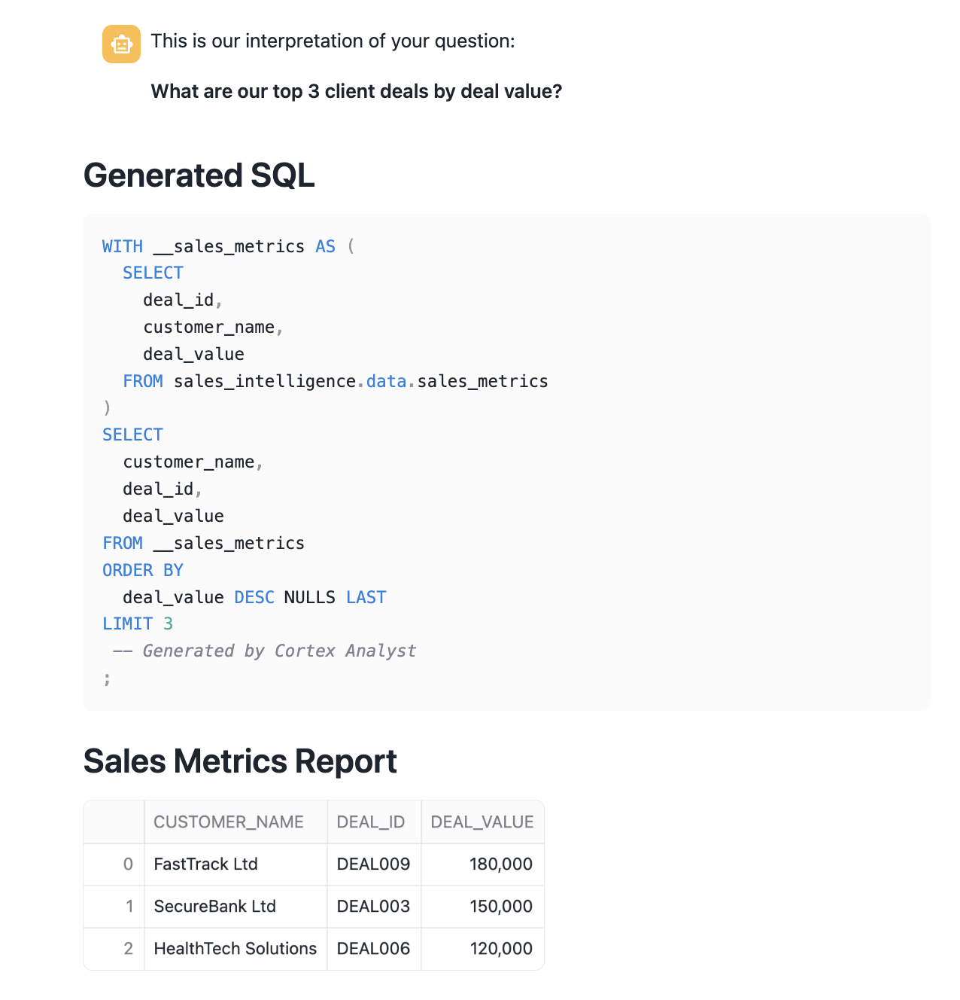
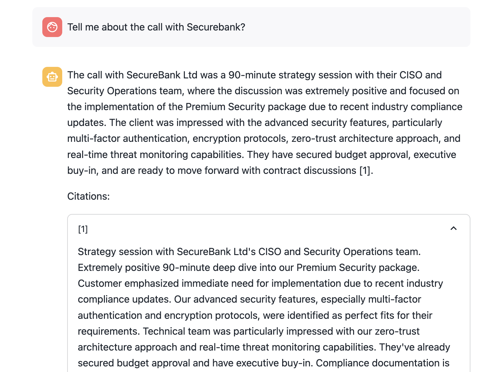

author: James Cha-Earley
id: getting_started_with_cortex_agents
summary: Get started with Cortex Agents
categories: Getting-Started
environments: web
status: Published 
feedback link: https://github.com/Snowflake-Labs/sfguides/issues
tags: Getting Started, Data Science, Data Engineering, Twitter 

# Getting Started with Cortex Agents

## Overview
Duration: 5

Modern organizations face the challenge of managing both structured data (like metrics and KPIs) and unstructured data (such as customer conversations, emails, and meeting transcripts). The ability to analyze and derive insights from both types of data is crucial for understanding customer needs, improving processes, and driving business growth. 

In this quickstart, you'll learn how to build an Intelligent Sales Assistant that leverages Snowflake's capabilities for analyzing sales conversations and metrics. Using Cortex Agents and Streamlit, we'll create an interactive and intuitive assistant.

### What is Snowflake Cortex?
The platform leverages three powerful Snowflake Cortex capabilities:

#### Cortex Analyst
- Converts natural language questions into SQL queries
- Understands semantic models defined in YAML files
- Enables querying data without writing SQL manually
- Handles complex analytical questions about sales metrics
- Achieves over 90% accuracy through user-generated semantic models that capture domain knowledge and business context

#### Cortex Search
- Delivers best-in-class search performance through a hybrid approach combining semantic and keyword search
- Leverages an advanced embedding model (E5) to understand complex semantic relationships
- Enables searching across unstructured data with exceptional accuracy and speed
- Supports real-time indexing and querying of large-scale text data
- Returns contextually relevant results ranked by relevance scores

#### Cortex Agents
The Cortex Agents is a stateless REST API endpoint that:
- Seamlessly combines Cortex Search's hybrid search capabilities with Cortex Analyst's 90%+ accurate SQL generation
- Streamlines complex workflows by handling:
  - Context retrieval through semantic and keyword search
  - Natural language to SQL conversion via semantic models
  - LLM orchestration and prompt management
- Enhances response quality through:
  - In-line citations to source documents
  - Built-in answer abstaining for irrelevant questions
  - Multi-message conversation context management
- Optimizes application development with:
  - Single API call integration
  - Streamed responses for real-time interactions
  - Reduced latency through efficient orchestration

These capabilities work together to:
1. Search through sales conversations for relevant context
2. Go from Text to SQL to answer analytical questions
3. Combine structured and unstructured data analysis
4. Provide natural language interactions with your data

### What You'll Learn
- Setting up a sales intelligence database in Snowflake
- Creating and configuring Cortex Search services
- Building a Streamlit interface for sales analytics
- Implementing semantic search for sales conversations
- Creating a question-answering system using LLMs

### What You'll Build
A full-stack application that enables users to:
- Search through sales conversations using semantic similarity
- Analyze sales metrics and patterns
- Ask questions about sales data and get AI-powered responses

### What You'll Need
Before you begin, make sure you have the following:

- **Snowflake Account**: Access to Snowflake with sufficient privileges to create databases, schemas, tables, and upload files. You will also need to set up an RSA public key for the user in (Snowflake)[https://app.snowflake.com].
- **Cortex Agents Access**: You will need access to Snowflake Cortex service, **Cortex Agents**, **Cortex Search**, and **Cortex Analyst** features.

## Setup Workspace
Duration: 10

**Step 1.** In Snowsight, create a SQL Worksheet and open [setup.sql](https://github.com/Snowflake-Labs/sfguide-getting-started-with-cortex-agents/blob/main/setup.sql) to execute all statements in order from top to bottom.

This script will:
- Create the database, schema, and warehouse
- Create tables for sales conversations and metrics
- Load sample sales data
- Enable change tracking for real-time updates
- Configure Cortex Search service
- Create a stage for semantic models

**Step 2.** Upload the semantic model:

- Download [sales_metrics_model.yaml](https://github.com/Snowflake-Labs/sfguide-getting-started-with-cortex-agents/blob/main/sales_metrics_model.yaml)(NOTE: Do NOT right-click to download.)
- Navigate to Data » Databases » SALES_INTELLIGENCE » DATA » Stages » MODELS
- Click "+ Files" in the top right
- Browse and select sales_metrics_model.yaml file
- Click "Upload"

## Streamlit Application
Duration: 15

**Step 1.** Click on [Intelligent Sales Assistant Streamlit App](https://github.com/Snowflake-Labs/sfguide-getting-started-with-cortex-agents/blob/main/streamlit.py). (NOTE: Do NOT right-click to download.)

**Step 2.** In your Snowflake account:
* On the left hand navigation menu, click on Streamlit
* On the top left click the **Streamlit App** 
* In the Create Streamlit App dialog, select **sales_intelligence** for your database and **data** as your schema
* Select your **Warehouse**
* Click on Create button

> aside positive
> Make sure your database and schema match the ones created in the setup step.

**Step 3.**
* Copy and Paste contents from the [streamlit.py](https://github.com/Snowflake-Labs/sfguide-getting-started-with-cortex-agents/blob/main/streamlit.py) into your new Streamlit App 

**Step 4.** Great questions to ask
* What are our top 3 client deals?

* Tell me about the call with Securebank?

## Conclusion and Resources
Duration: 5

Congratulations! You've successfully built an Intelligent Sales Assistant using Snowflake Cortex capabilities. This application demonstrates the power of combining structured and unstructured data analysis through:
- Natural language interactions with your sales data
- Semantic search across sales conversations
- Automated SQL generation for analytics
- Real-time streaming responses
- Interactive chat interface

### What You Learned
- **Cortex Agents**: How to integrate and use the stateless REST API for combining search and analysis capabilities
- **Cortex Search**: How to leverage hybrid search combining semantic and keyword approaches for more accurate results
- **Cortex Analyst**: How to convert natural language to SQL using semantic models for high-accuracy analytics
- **Integration**: How to combine these capabilities into a cohesive application using Streamlit

### Related Resources
- [Cortex Agents Guide](https://docs.snowflake.com/user-guide/snowflake-cortex/cortex-agents)
- [Cortex Search Overview](https://docs.snowflake.com/en/user-guide/snowflake-cortex/cortex-search/cortex-search-overview)
- [Cortex Analyst Overview](https://docs.snowflake.com/en/user-guide/snowflake-cortex/cortex-analyst)
- [Snowflake Cortex Documentation](https://docs.snowflake.com/en/user-guide/snowflake-cortex/llm-functions)
- [Cortex Search Tutorial](https://docs.snowflake.com/en/user-guide/snowflake-cortex/cortex-search/tutorials/cortex-search-tutorial-1-search)