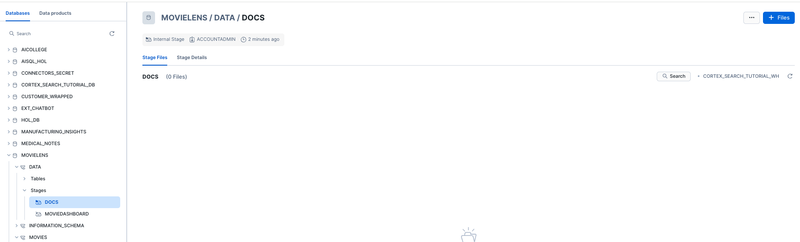

author: marzillo-snow
id: getting_started_with_cortex_agents_and_amazon_q
summary: This is a quickstart for using Cortex Agents and Amazon Q
categories: Getting-Started, data-science, data-engineering, AWS, cortex, genai, Amazon, Q, search, LLM, copilot, Agents, Cortex
environments: web
status: Published 
feedback link: https://github.com/Snowflake-Labs/sfguides/issues
tags: Getting Started, Data Science, Data Engineering, Copilot, Amazon, Agents

# Getting Started with Cortex Agents and Amazon Q
<!-- ------------------------ -->
## Overview 
Duration: 15

[Cortex Agents](https://docs.snowflake.com/en/user-guide/snowflake-cortex/cortex-agents) orchestrate across both structured and unstructured data sources to deliver insights. They plan tasks, use tools to execute these tasks, and generate responses. Agents use Cortex Analyst (structured) and Cortex Search (unstructured) as tools, along with LLMs, to analyze data. Cortex Search extracts insights from unstructured sources, while Cortex Analyst generates SQL to process structured data. A comprehensive support for tool identification and tool execution enables delivery of sophisticated applications grounded in enterprise data.

[Amazon Q Business](https://aws.amazon.com/q/business/) is a generative AI assistant that transforms how work gets done in your organization. With specialized capabilities for software developers, business intelligence analysts, contact center employees, supply chain analysts, and anyone building with AWS, Amazon Q helps every employee get insights on their data and accelerate their tasks. Leveraging Amazon Q's advanced agentic capabilities, companies can streamline processes, get to decisions faster, and help employees be more productive.

Cortex Search: A Snowflake service that combines advanced search capabilities to find relevant information within any text data stored in your organization's Snowflake environment. It takes care of all the complex technical processes automatically, allowing organizations to implement powerful search features without worrying about the underlying technical infrastructure.
Amazon Q Business Plugin: An integration tool that connects Amazon Q Business with other business services and data sources through secure, customizable connections. These plugins enhance Amazon Q's functionality by allowing it to safely access and work with various company systems and services while maintaining security standards.
Amazon Q Business Chat Interface: The main user interface where you can interact with Amazon Q Business through a conversational format to access company information and services. Users can ask questions and make requests using natural language, and the interface provides responses by gathering and synthesizing information from connected business systems.

### Use Case

Users will create an intelligent search system for movie script PDFs and structured movie data using Snowflake Cortex AI and Amazon Q Business. Snowflake Cortex AI will process and index the unstructured PDF movie scripts, making them searchable through advanced text analysis. Amazon Q Business will then provide a natural language interface, allowing users to ask questions about the scripts in conversational language and receive relevant answers. For example, users could ask about specific dialogues, scene descriptions, or character interactions across different movie scripts, and the system will retrieve and present the relevant information. This implementation demonstrates how to transform raw PDF scripts into an interactive, queryable knowledge base that understands and responds to complex questions about movie content.

The end-to-end workflow will look like this:

Ingest data into structured and unstructured data stores then:
1. Create a Cortex Analyst service with structured data with a Semantic Model.
2. Using Snowflake functions prepare the data and create a Cortex Search service with unstructured data.
3. Create a Cortex Agent that brokers the decision on when to use each service (as well as other GenAI functions (potentially))
4. Amazon Q for Business is connected to the Cortex Agents service with a plugin using oauth authentication.
5. Users can use Amazon Q for Business with Cortex securely and seamlessly.
6. (optional and not covered in this lab) Along with the Cortex Plugin users can access other AWS data and services through Amazon Q for Business


### Prerequisites
- Familiarity with [Snowflake](https://quickstarts.snowflake.com/guide/getting_started_with_snowflake/index.html#0) and a Snowflake account with Cortex Search.
- Familiarity with [AWS](https://aws.amazon.com/free) and an AWS account.

### What You'll Learn
- Using Cortex Search along with complimentary functions in Snowflake.
- Using Cortex Analyst and semantic models in Snowflake.
- Using Cortex Agents.
- Using Amazon Q to leverage generative AI to get quick answers from your data.
- Connect Amazon Q to Snowflake Cortex Search with a custom plugin.

### What You’ll Need 
- A free [Snowflake Account](https://signup.snowflake.com/?utm_cta=quickstarts_)
- [AWS Account](https://aws.amazon.com/free) with access to Q
- For the sake of the lab it is best if both platforms have access to the public internet and are not in a virtual network


### What You’ll Build 
You will build an end-to-end copilot workflow on unstructured data in Snowflake
- to load data to Snowflake via Snowsight
- to extract unstructured data and create chunks in Snowflake
- to create a Snowflake Cortex Search Service on unstructured data
- to create a semantic model with Cortex Analyst on structured data
- to create a Cortex Agent using the Search and Analyst services
- to create a connection from Amazon Q to Cortex Search with Oauth authentication

<!-- ------------------------ -->
## Creating an Amazon Q Business Application
Duration: 5

In this section, we'll set up [Amazon Q Business](https://aws.amazon.com/q/business/qstart) , a generative AI-powered assistant that enables natural language interaction with business data. We'll create and configure a Q Business application that will connect with our Snowflake database, enabling intelligent querying of our movie script data. While we're using movie scripts for this example, these same steps can be applied to analyze any type of business documents in your organization.

### Create your Q Business Application
1. Open Amazon Q Business on the console and select Get Started


2. Select **Create application**


3. Provide the name **myQBusinessApp** for your application under **Application Name** myapp. You may review all the other settings, but for now we will not change the default configuration.


4. To create our Q Business application we need to ensure we have Identity Centre set up to help us manage user access to the app. As you scroll through the configuration select the Create account instance button to create an Identity Centre instance for the AWS account and link our application.


5. Once you have scrolled to the very bottom, select the **Create** button located in the right corner.co


Congratulations you have now created your first Q Business App!

### Copy the Deployed URL and save for later

After clicking Create, you should have been automatically routed to your QBusinessApp home page. Here you can see all of the information regarding your application. Be sure to copy the **Deployed URL** and store this in a notes page or text file to the side, we will need this later to set up our authorization between Snowflake and Q Business.


### Create an IAM User

Before we continue on, we need to make sure we have configured a user to access our Q Business Application.

1. To first create a user select **Manage user access** on your Q Business App web page.


2. Next, select **Add groups and users**, then continue by selecting the **Add new users** button in the pop up window.


3. Configure your new user with the following information, or feel free to use your own name. **Please ensure that your email is an email you have access to**.


4. Continue through the user management process by selecting, **Add**, then **Assign** .

5. You should then be routed to the **Manage access and subscriptions** webpage where your user details will be available for you to review. One you are happy with your use details select Confirm.


6. By this time you should have received an email in your inbox from **no-reply@login.awsapps.com**. Please open this email and select **Accept invitation**.


7. Follow the prompts to create a password for your user and to register an MFA device. **Please do not forget your password you will need it later to log in!**


**Well done!** From this section of the lab you have successfully configured your Q Business Application and created a user that has permissions to access the application.

<!-- ------------------------ -->
## Using Generative AI with Cortex and Amazon Q Business for Movie Data Analysis

Duration: 15

In this section, we'll create the foundation for an AI-powered movie data analysis system. By configuring Snowflake Cortex Search, Cortex Analyst and a Cortex Agent, you'll build a system that can process, store, and intelligently search through movie scripts. Once completed, this setup will allow users to ask natural language questions about movie content and receive relevant answers through Amazon Q Business.

### Upload Data to Snowflake and Create Cortex Search Service

1. Download the movie script for Toy Story, by clicking [here](https://github.com/Snowflake-Labs/getting_started_with_cortex_agents_and_amazon_q/blob/main/toy-story-1995.pdf)  and selecting the download button. This PDF will be our test data for the search system and Q Business Application.

2. Navigate to the Snowflake UI and create a new SQL worksheet where we'll run our setup commands.


3. Create database MOVIELENS and schema, table for the movie  and load the move dashboard data from a csv file.
```sql
CREATE OR REPLACE DATABASE movielens;
CREATE OR REPLACE SCHEMA movielens.movies;
CREATE OR REPLACE SCHEMA movielens.data;
CREATE OR REPLACE WAREHOUSE workshopwh;

USE DATABASE movielens;
USE SCHEMA data;

CREATE TABLE movies_dashboard (
movie_id NUMBER,
    	movie_title VARCHAR,
   	movie_release_year INTEGER,
    	genre VARCHAR,
   	user_rating FLOAT,
   	rating_timestamp TIMESTAMP_NTZ,
    	user_id NUMBER,
    	user_firstname VARCHAR,
   	user_lastname VARCHAR,
    	user_city VARCHAR,
    	user_state VARCHAR,
    	user_country VARCHAR,
    	user_email VARCHAR,
    	user_phonenumber VARCHAR,
    	interaction_timestamp NUMBER ,
    	interaction_type VARCHAR
);

CREATE OR REPLACE STAGE MOVIEDASHBOARD
URL='s3://hol-qs-bucket/'
FILE_FORMAT = (TYPE = 'csv');

COPY INTO movies_dashboard FROM @MOVIEDASHBOARD/movies_dashboard.csv
  FILE_FORMAT=(TYPE = 'csv' FIELD_DELIMITER = ',' SKIP_HEADER = 1);
```

4. Now that we have our database ready, we can also upload the script files to the PUBLIC schema of the DOCS stage in the SCRIPT_DB database. To do this select **Data -> SCRIPT_DB -> PUBLIC -> Stages -> DOCS. Click +FILES** to upload the movie script you have previously downloaded.



Once uploaded you should be able to see your PDF file in your webpage to validate that you have successfully uploaded the movie script.


5. Run the following code to process your movie scripts. This code does two things: first, it extracts text from the PDFs into a table (SCRIPT_TABLE), then divides that text into searchable segments(chunks) stored into a new table SCRIPT_TABLE_CHUNK
``` sql
USE WAREHOUSE workshopwh;
USE DATABASE movielens;
USE SCHEMA data;
CREATE STAGE DOCS
DIRECTORY = ( ENABLE = true )
ENCRYPTION = ( TYPE = 'SNOWFLAKE_SSE' );


--Create Table for text data
CREATE OR REPLACE TABLE SCRIPT_TABLE AS
SELECT
'toy-story-script' as doc,
SNOWFLAKE.CORTEX.PARSE_DOCUMENT(@MOVIELENS.DATA.DOCS, 'toy-story-script-1995.pdf', {'mode': 'LAYOUT'}) as script_text;


-- Create table with chunked text
CREATE OR REPLACE TABLE SCRIPT_TABLE_CHUNK AS
SELECT
TO_VARCHAR(c.value) as CHUNK_TEXT, DOC
FROM
SCRIPT_TABLE,
LATERAL FLATTEN( input => SNOWFLAKE.CORTEX.SPLIT_TEXT_RECURSIVE_CHARACTER (
TO_VARCHAR(script_text:content),
'none',
700,
100
)) c;
SELECT * FROM SCRIPT_TABLE_CHUNK;

```
Note: The code splits the text into 700-token chunks with 100-token overlaps. These numbers can be adjusted later to optimize your search results. For more details about text processing options, see the [Snowflake documentation](https://docs.snowflake.com/en/sql-reference/functions/split_text_recursive_character-snowflake-cortex).

6. Now we are ready to create a Cortex Search Service by running the code on the CHUNK_TEXT field. This service will enable intelligent searching across your processed movie scripts:

``` sql
-- Create Search Service
CREATE OR REPLACE CORTEX SEARCH SERVICE SCRIPT_SEARCH_SRV
ON CHUNK_TEXT
ATTRIBUTES DOC
WAREHOUSE = HOL_WH
TARGET_LAG = '30 day'
AS (
SELECT CHUNK_TEXT as CHUNK_TEXT, DOC FROM SCRIPT_TABLE_CHUNK);


CREATE OR REPLACE STAGE models DIRECTORY = (ENABLE = TRUE);

```
The service automatically updates every 30 days and allows filtering by document name using the DOC attribute..

### Set up Cortex Analyst

1. Download the [movie_dashboard.yaml](https://github.com/Snowflake-Labs/getting_started_with_cortex_agents_and_amazon_q/blob/main/movie_dashboard.yaml) (NOTE: Do NOT right-click to download.)

2. Navigate to **Data » Databases » movielens » Stages »  models**

3. Click **+ Files** in the top right


4. Browse and select movie_review.yaml file

5. Click **Upload**

**Well Done!** with this upload you have now created a Cortex Analyst service.

### Set up the Agent

In this section we create a stored procedure that passes a Cortex Agent spec to the Cortex API that utilizes the Search and Analyst Services we just created.

``` sql
CREATE OR REPLACE PROCEDURE call_cortex_agent_proc(query STRING, limit INT)
RETURNS VARIANT
LANGUAGE PYTHON
RUNTIME_VERSION = '3.9'
PACKAGES = ('snowflake-snowpark-python')
HANDLER = 'call_cortex_agent_proc'
AS $$
import json
import _snowflake
import re
from snowflake.snowpark.context import get_active_session

def call_cortex_agent_proc(query: str, limit: int = 10):
    session = get_active_session()
    
    API_ENDPOINT = "/api/v2/cortex/agent:run"
    API_TIMEOUT = 50000  

    CORTEX_SEARCH_SERVICES = "MOVIELENS.DATA.SCRIPT_SEARCH_SRV"
    SEMANTIC_MODELS = "@MOVIELENS.DATA.MODELS/movie_dashboard.yaml"
     query = "you are an assistant tasked with asking specific questions about movies and specifically about the movie Toy Story, you will summarize and answer this question:" + query + ". do not just return results make sure they are summarized in a concise answer"

    payload = {
        "model": "llama3.1-70b",
        "messages": [{"role": "user", "content": [{"type": "text", "text": query}]}],
        "tools": [
            {"tool_spec": {"type": "cortex_analyst_text_to_sql", "name": "analyst1"}},
            {"tool_spec": {"type": "cortex_search", "name": "search1"}}
        ],
        "tool_resources": {
            "analyst1": {"semantic_model_file": SEMANTIC_MODELS},
            "search1": {"name": CORTEX_SEARCH_SERVICES, "max_results": limit}
        }
    }

    try:
        resp = _snowflake.send_snow_api_request(
            "POST", API_ENDPOINT, {}, {}, payload, None, API_TIMEOUT
        )

        if resp["status"] != 200:
            return {"error": resp["status"]}

        response_content = json.loads(resp["content"])
        return process_cortex_response(response_content, session)

    except Exception as e:
        return {"error": str(e)}

def clean_text(text):
    """ Cleans up unwanted characters and symbols from search results. """
    text = re.sub(r'[\u3010\u3011\u2020\u2021]', '', text)  # Remove unwanted symbols
    text = re.sub(r'^\s*ns\s+\d+\.*', '', text)  # Remove prefixes like "ns 1."
    text = text.strip()  # Trim whitespace
    return text

def process_cortex_response(response, session):
    """ Parses Cortex response and executes SQL if provided. """
 result = {"type": "unknown", "text": None, "sql": None, "query_results": None}

    full_text_response = []  # Stores formatted search responses
    
    for event in response:
        if event.get("event") == "message.delta":
            data = event.get("data", {})
            delta = data.get("delta", {})

            for content_item in delta.get("content", []):
                content_type = content_item.get("type")

                if content_type == "tool_results":
                    tool_results = content_item.get("tool_results", {})

                    for result_item in tool_results.get("content", []):
                        if result_item.get("type") == "json":
                            json_data = result_item.get("json", {})

                            if "sql" in json_data:
                                result["type"] = "cortex_analyst"
                                result["sql"] = json_data["sql"]
                                result["text"] = json_data.get("text", "")

                                # Execute the generated SQL query in Snowflake
                                try:
                                    query_results = session.sql(result["sql"]).collect()
                                    result["query_results"] = [row.as_dict() for row in query_results]
                                except Exception as e:
                                    result["query_results"] = {"error": str(e)}

                            elif "searchResults" in json_data:
                                result["type"] = "cortex_search"
                                formatted_results = []

                                for sr in json_data.get("searchResults", []):
                                    search_text = clean_text(sr.get("text", "").strip())
                                    citation = sr.get("citation", "").strip()

                                    if search_text:
                                        if citation:
                                            formatted_results.append(f"- {search_text} (Source: {citation})")
                                        else:
                                            formatted_results.append(f"- {search_text}")
                                
                                if formatted_results:
                                    full_text_response.extend(formatted_results)
                
                elif content_type == "text":
                    text_piece = clean_text(content_item.get("text", "").strip())
                    if text_piece:
                        full_text_response.append(text_piece)

    result["text"] = "\n".join(full_text_response) if full_text_response else "No relevant search results found."
    return result
$$;

CALL call_cortex_agent_proc('what is the dinosaurs name in toy story?', 5);

```

Now you can access that stored procedure from external sources like Q for Business!

### Set up Oauth
The final step is setting up OAuth authentication, this creates a secure connection between Snowflake and Amazon Q Business nd ensures that only authorized requests can access your movie script data.

1. Run the following code to create the security integration. This code creates a secure connection that will allow Amazon Q Business to safely access your Snowflake data. You'll need to replace **<Deployed URL>** with the URL of your Amazon Q application (which you have copied earlier from the AWS Console).
``` sql
--create custom oauth
CREATE OR REPLACE SECURITY INTEGRATION Q_AUTH_HOL
TYPE = OAUTH
ENABLED = TRUE
OAUTH_ISSUE_REFRESH_TOKENS = TRUE
OAUTH_REFRESH_TOKEN_VALIDITY = 3600
OAUTH_CLIENT = CUSTOM
OAUTH_CLIENT_TYPE = CONFIDENTIAL
OAUTH_REDIRECT_URI = '<Deployed URL>/oauth/callback';

GRANT USAGE on database SCRIPT_DB to role PUBLIC;
GRANT USAGE on schema PUBLIC to role PUBLIC;
GRANT USAGE on CORTEX SEARCH SERVICE SCRIPT_SEARCH_SERVICE to role PUBLIC;

DESC INTEGRATION Q_AUTH_HOL;

SELECT SYSTEM$SHOW_OAUTH_CLIENT_SECRETS('Q_AUTH_HOL');
```


2. After running the code, save these important credentials, we will need them later on!:
OAUTH_CLIENT_ID from the results
OAUTH_CLIENT_SECRET from the results
Your Snowflake URL (find this by clicking your account name in the bottom left of the Snowflake UI, selecting your account,then view account details. Your snowflake URL is https:// + your Account/Server URL e.g. https://<Your-Acount-Identifier>.snowflakecomputing.com)
For more information about Snowflake's OAuth configuration, visit the [Snowflake OAuth documentation](https://docs.snowflake.com/en/user-guide/oauth-custom).

<!-- ------------------------ -->
## Configure a Q Business Custom Plugin for Snowflake Integration
Duration: 5

Next, we'll create a Q Business Custom Plugin to connect our Q Business Application with the Cortex Search in Snowflake. This integration enables the Q Business chatbot interface to access and analyze the movie script data stored in Snowflake.

### Create your Custom Plugin for Snowflake
1. Navigate to the **Plugins** tab found in the left navigation menu in your Q App webpage and select **Add Plugin**


2. Select **Create custom plugin** button in the top right of your Q application page


3. Name the plugin **movie-agent**. and provide a description.For example: `plugin to connect to movie script data from snowflake`.

4. Under **API Schema select the Define with in-line OpenAPI** schema editor

5. Select YAML format and paste the following OpenAPI specification. Important: Please update these 3 values in the code:
- url: <Your-Snowflake-URL>
- authorizationUrl: <Your-Snowflake-URL>/oauth/authorize
- tokenUrl: <Your-Snowflake-URL>/oauth/token-request
As a reminder you can find your Snowflake URL by clicking your account name in the bottom left of the Snowflake UI, selecting your account, then view account details. Your snowflake URL is https:// + your Account/Server URL e.g. https://<Your-Acount-Identifier>.snowflakecomputing.com

```
openapi: 3.0.0
info:
  title: Cortex Agent SQL API Wrapper
  version: 2.0.0
servers:
  - url: https://<your-account>.snowflakecomputing.com
paths:
  /api/v2/statements:
    post:
      summary: Call stored procedure to query Cortex Agent
      description: Uses the Snowflake SQL API to execute `CALL MOVIELENS.DATA.call_cortex_agent_proc(query, 5)` where the query is provided by the user and the second argument is fixed to 5.
      parameters:
        - in: header
          name: Authorization
          required: true
          description: Bearer token with Snowflake OAuth access
          schema:
            type: string
        - in: header
          name: X-Snowflake-Authorization-Token-Type
          required: true
          schema:
            type: string
            enum: ["OAUTH"]
          description: Snowflake token type (must be "OAUTH")
      requestBody:
        required: true
        content:
          application/json:
            schema:
              $ref: '#/components/schemas/SQLRequest'
      responses:
        '200':
          description: Successful stored procedure call
          content:
            application/json:
              schema:
                $ref: '#/components/schemas/SQLResponse'
      security:
        - oauth2: []
components:
  schemas:
    SQLRequest:
      type: object
      required:
        - query
      properties:
        query:
          type: string
          description: The user query to pass to the Cortex Agent
      example:
        query: "What is Toy Story about?"
    SQLResponse:
      type: object
      properties:
        statementHandle:
          type: string
        resultSet:
          type: array
          items:
            type: object
            additionalProperties: true
        queryId:
          type: string
        success:
          type: boolean
  securitySchemes:
    oauth2:
      type: oauth2
      flows:
        authorizationCode:
          authorizationUrl: https://<your-account>.snowflakecomputing.com/oauth/authorize
          tokenUrl: https://<your-account>.snowflakecomputing.com/oauth/token-request
          scopes:
            session:role:PUBLIC: The Snowflake role to assume
```

**Some things to note***

- The path defined in the OpenAPI schema assumes you set up your Stored Procedure in the MOVIELENS database, in the DATA schema,  - if you used different names in your Snowflake setup, you'll need to modify these values accordingly.
- The description field under the POST method is crucial as Q uses this to determine when to route questions to this plugin.

6. After you have updated the YAML code, ensure that under the Authentication header, Authentication required has been selected.

7. Next, look to the **AWS Secrets Manager Section** here:
- Select **Create and add new secret**
- Name your secret (e.g., "movie-scripts")
- Enter your Snowflake Client ID and Client Secret we have copied from the previous setup
- Add the OAuth callback URL (same as OAUTH_REDIRECT_URI from Snowflake security integration)


8. Finally, Click the **Create** button then **Add Plugin** to complete your plugin setup. You can validate that your plugin has been set up successfully when the **Plugin Status** is updated to green.


Great Job! Your plugin is now ready to use within Q Business to query movie script data from Snowflake

<!-- ------------------------ -->
## Testing your Movie Agent Analysis Application

<!-- ------------------------ -->
## Conclusion and Resources
Duration: 5

This quickstart is just that, a quick way to get you started with using Amazon Q with Snowflake Cortex, though with this start you are now enabled to extend the quickstart in the below ways:
    - Scale the workflow to a use case with many documents and use a more robust Cortex Search Service.
    - Use a Cortex Q plugin alongside Quicksight to get next level answers on your data that's represented in your dashboards.
    - Use multiple plugins to Cortex from Q along with AWS service to create a robust web app for getting answers from your data with plain text.

### What You Learned
- Loading data to Snowflake via Snowsight
- Extracting unstructured data and creating chunks in Snowflake
- Creating a Snowflake Cortex Search Service on unstructured data
- Creating a connection from Amazon Q to Cortex Search with Oauth authentication using Q plugins

### Resources
There are some great blogs on Medium regarding Snowflake Cortex and Amazon Services work together:

- [Snowflake Cortex](https://www.snowflake.com/en/data-cloud/cortex/)

- [Amazon Q](https://aws.amazon.com/q/?trk=c570e8a2-ec3c-4968-baa4-f8537e37dd1d&sc_channel=ps&s_kwcid=AL!4422!10!71949557907688!71950102400240&ef_id=07cc246a6d4218358de8430ee23fc18e:G:s&msclkid=07cc246a6d4218358de8430ee23fc18e)

- [Amazon Bedrock and Snowflake Cortex](https://catalog.us-east-1.prod.workshops.aws/workshops/2d4e5ea4-78c8-496f-8246-50d8971414c9/en-US/01-overview)

- [Using Snowflake, Streamlit and External Access with amazon Bedrcok](https://quickstarts.snowflake.com/guide/getting_started_with_bedrock_streamlit_and_snowflake/index.html?index=..%2F..index#0)
