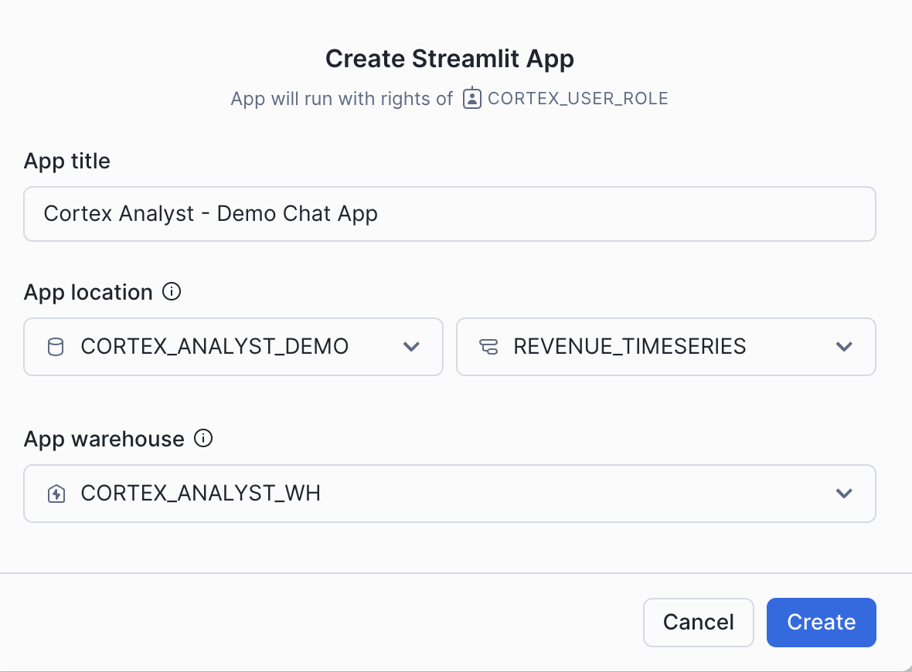

author: caleb-baechtold
id: getting_started_with_cortex_analyst 
summary: Through this quickstart guide, you will learn how to use Cortex Analyst to provide natural-language query interfaces to structured data in Snowflake using GenAI
categories: Getting-Started
environments: web
status: Published 
feedback link: https://github.com/Snowflake-Labs/sfguides/issues
tags: Getting Started, Data Science, GenAI, Cortex, Cortex Analyst

# Getting Started with Cortex Analyst: Augment BI with AI
<!-- ------------------------ -->
## Overview 

Through this quickstart guide, you will explore how to get started with [Cortex Analyst](https://docs.snowflake.com/user-guide/snowflake-cortex/cortex-analyst), which is a fully managed service in Snowflake that provides a conversational interface to interact with structured data in Snowflake.

### What is Cortex Analyst?

Cortex Analyst is a fully managed service in [Cortex AI](https://www.snowflake.com/en/data-cloud/cortex) that provides a conversational interface to interact with structured data in Snowflake. It streamlines the development of intuitive, self-service analytics applications for business users, while providing industry-leading accuracy. To deliver high text-to-SQL accuracy, Cortex Analyst uses an agentic AI setup powered by state-of-the-art LLMs. Available as a convenient REST API, Cortex Analyst can seamlessly integrate into any application. This empowers developers to customize how and where business users interact with results, while still benefiting from Snowflake's integrated security and governance features, including role-based access controls (RBAC), to protect valuable data.


### Why use Cortex Analyst?
Historically, business users have primarily relied on BI dashboards and reports to answer their data questions. However, these resources often lack the flexibility needed, leaving users dependent on overburdened data analysts for updates or answers, which can take days. Cortex Analyst disrupts this cycle by providing a natural language interface with high text-to-SQL accuracy. With Cortex Analyst organizations can streamline the development of intuitive, conversational applications that can enable business users to ask questions using natural language and receive more accurate answers in near real time

This quickstart will focus on getting started with Cortex Analyst, teaching the mechanics of how to interact with the Cortex Analyst service and how to define the Semantic Model definitions that enhance the precision of results from this conversational interface over your Snowflake data.

### What you will learn 
- How to construct and configure a Semantic Model for your data
- How to call the Cortex Analyst REST API to use your Semantic Model to enable natural-language question-asking on top of your structured data in Snowflake via Streamlit in Snowflake (SiS) application
- How to integrate Cortex Analyst with Cortex Search

### Prerequisites
- [Git](https://git-scm.com/book/en/v2/Getting-Started-Installing-Git) installed
    > aside positive
    >
    >Download the [git repo](https://github.com/Snowflake-Labs/sfguide-getting-started-with-cortex-analyst)
- (Optional) [Python >= 3.9, <= 3.11 installed](https://www.python.org/downloads/) to run the OSS Semantic Model Generator
- A Snowflake account login with a role that has the ability to create database, schema, tables, stages, user-defined functions, and stored procedures. If not, you will need to register for a free trial account from any of the supported cloud regions or use a different role.

### What You’ll Build 
- A Semantic Model over sample financial data
- A Streamlit in Snowflake (SiS) app with a conversational interface to Cortex Analyst


<!-- ------------------------ -->
## Set up the Snowflake environment
Duration: 2

> aside positive
>
> MAKE SURE YOU'VE DOWNLOADED THE [GIT REPO](https://github.com/Snowflake-Labs/sfguide-getting-started-with-cortex-analyst).

Open up the [create_snowflake_objects.sql](https://github.com/Snowflake-Labs/sfguide-getting-started-with-cortex-analyst/blob/main/create_snowflake_objects.sql) file in a SQL worksheet in Snowsight.

Run the following SQL commands in a SQL worksheet to create the [warehouse](https://docs.snowflake.com/en/sql-reference/sql/create-warehouse.html), [database](https://docs.snowflake.com/en/sql-reference/sql/create-database.html) and [schema](https://docs.snowflake.com/en/sql-reference/sql/create-schema.html).

```SQL
/*--
• Database, schema, warehouse, and stage creation
--*/

USE ROLE SECURITYADMIN;

--To make a request to Cortex Analyst, you must use a role that has the SNOWFLAKE.CORTEX_USER role granted
CREATE ROLE cortex_user_role;

GRANT DATABASE ROLE SNOWFLAKE.CORTEX_USER TO ROLE cortex_user_role;

--Grant role to a user
GRANT ROLE cortex_user_role TO USER <user>;

USE ROLE SYSADMIN;

-- Create demo database
CREATE OR REPLACE DATABASE cortex_analyst_demo;

-- Create schema
CREATE OR REPLACE SCHEMA cortex_analyst_demo.revenue_timeseries;

-- Create warehouse
CREATE OR REPLACE WAREHOUSE cortex_analyst_wh
    WAREHOUSE_SIZE = 'large'
    WAREHOUSE_TYPE = 'standard'
    AUTO_SUSPEND = 60
    AUTO_RESUME = TRUE
    INITIALLY_SUSPENDED = TRUE
COMMENT = 'Warehouse for Cortex Analyst demo';

GRANT USAGE ON WAREHOUSE cortex_analyst_wh TO ROLE cortex_user_role;
GRANT OPERATE ON WAREHOUSE cortex_analyst_wh TO ROLE cortex_user_role;

GRANT OWNERSHIP ON DATABASE cortex_analyst_demo TO ROLE cortex_user_role;
GRANT OWNERSHIP ON SCHEMA cortex_analyst_demo.revenue_timeseries TO ROLE cortex_user_role;

USE ROLE cortex_user_role;

-- Use the created warehouse
USE WAREHOUSE cortex_analyst_wh;

-- Create stage for raw data
CREATE OR REPLACE STAGE raw_data DIRECTORY = (ENABLE = TRUE);

/*--
Fact and Dimension Table Creation
--*/

-- Fact table: daily_revenue
CREATE OR REPLACE TABLE cortex_analyst_demo.revenue_timeseries.daily_revenue (
    date DATE,
    product_id INT,
    region_id INT,
    revenue FLOAT,
    cogs FLOAT,
    forecasted_revenue FLOAT
);

-- Dimension table: product_dim
CREATE OR REPLACE TABLE cortex_analyst_demo.revenue_timeseries.product_dim (
    product_id INT,
    product_line VARCHAR(16777216)
);

-- Dimension table: region_dim
CREATE OR REPLACE TABLE cortex_analyst_demo.revenue_timeseries.region_dim (
    region_id INT,
    sales_region VARCHAR(16777216),
    state VARCHAR(16777216)
);

```

These can also be found in the [**create_snowflake_objects.sql**](https://github.com/Snowflake-Labs/sfguide-getting-started-with-cortex-analyst/blob/main/create_snowflake_objects.sql) file.

<!-- ------------------------ -->
## Ingest the Revenue Data and Semantic Model YAML
Duration: 10

> aside positive
>
> MAKE SURE YOU'VE DOWNLOADED THE [GIT REPO](https://github.com/Snowflake-Labs/sfguide-getting-started-with-cortex-analyst).

There are three data files and one YAML file included in the [Git Repo](https://github.com/Snowflake-Labs/sfguide-getting-started-with-cortex-analyst) that you should have cloned:
- [daily_revenue.csv](https://github.com/Snowflake-Labs/sfguide-getting-started-with-cortex-analyst/blob/main/data/daily_revenue.csv)
- [region.csv](https://github.com/Snowflake-Labs/sfguide-getting-started-with-cortex-analyst/blob/main/data/region.csv)
- [product.csv](https://github.com/Snowflake-Labs/sfguide-getting-started-with-cortex-analyst/blob/main/data/product.csv)
- [revenue_timeseries.yaml](https://github.com/Snowflake-Labs/sfguide-getting-started-with-cortex-analyst/blob/main/revenue_timeseries.yaml)

You will now upload these files to your Snowflake account and ingest the data files into the tables created in the previous step.

To upload the data files:
- Navigate to the Worksheets tab in Snowsight, click the '+' button in the top right corner and select **Add Data**
- On the Add Data page, select **Load files into a stage**
- Select the four files that you want to upload (listed above)
- Select **CORTEX_ANALYST_DEMO** as Database, **REVENUE_TIMESERIES** as Schema, and **RAW_DATA** as Stage
- Click Upload

Let's go check that the files were successfully uploaded to the stage. In the Snowsight UI:
- Select **Data >> Databases**
- Select the CORTEX_ANALYST_DEMO database and REVENUE_TIMESERIES Schema that contain the stage
- Select Stages and select the RAW_DATA stage
- If prompted, select Enable Directory Table and the CORTEX_ANALYST_WH to refresh the directory table

You should see the four files listed in the stage:


Now, let's load the raw CSV data into the tables. Go back to your Snowflake SQL worksheet and run the following [load_data.sql](https://github.com/Snowflake-Labs/sfguide-getting-started-with-cortex-analyst/blob/main/load_data.sql) code to load data into the tables:

```sql
/*--
• load data into tables
--*/
COPY INTO CORTEX_ANALYST_DEMO.REVENUE_TIMESERIES.DAILY_REVENUE
FROM @raw_data
FILES = ('daily_revenue_combined.csv')
FILE_FORMAT = (
    TYPE=CSV,
    SKIP_HEADER=1,
    FIELD_DELIMITER=',',
    TRIM_SPACE=FALSE,
    FIELD_OPTIONALLY_ENCLOSED_BY=NONE,
    REPLACE_INVALID_CHARACTERS=TRUE,
    DATE_FORMAT=AUTO,
    TIME_FORMAT=AUTO,
    TIMESTAMP_FORMAT=AUTO
    EMPTY_FIELD_AS_NULL = FALSE
    error_on_column_count_mismatch=false
)

ON_ERROR=CONTINUE
FORCE = TRUE ;


COPY INTO CORTEX_ANALYST_DEMO.REVENUE_TIMESERIES.DAILY_REVENUE_BY_PRODUCT
FROM @raw_data
FILES = ('daily_revenue_by_product_combined.csv')
FILE_FORMAT = (
    TYPE=CSV,
    SKIP_HEADER=1,
    FIELD_DELIMITER=',',
    TRIM_SPACE=FALSE,
    FIELD_OPTIONALLY_ENCLOSED_BY=NONE,
    REPLACE_INVALID_CHARACTERS=TRUE,
    DATE_FORMAT=AUTO,
    TIME_FORMAT=AUTO,
    TIMESTAMP_FORMAT=AUTO
    EMPTY_FIELD_AS_NULL = FALSE
    error_on_column_count_mismatch=false
)

ON_ERROR=CONTINUE
FORCE = TRUE ;


COPY INTO CORTEX_ANALYST_DEMO.REVENUE_TIMESERIES.DAILY_REVENUE_BY_REGION
FROM @raw_data
FILES = ('daily_revenue_by_region_combined.csv')
FILE_FORMAT = (
    TYPE=CSV,
    SKIP_HEADER=1,
    FIELD_DELIMITER=',',
    TRIM_SPACE=FALSE,
    FIELD_OPTIONALLY_ENCLOSED_BY=NONE,
    REPLACE_INVALID_CHARACTERS=TRUE,
    DATE_FORMAT=AUTO,
    TIME_FORMAT=AUTO,
    TIMESTAMP_FORMAT=AUTO
    EMPTY_FIELD_AS_NULL = FALSE
    error_on_column_count_mismatch=false
)

ON_ERROR=CONTINUE
FORCE = TRUE ;
```
<!-- ------------------------ -->
## Create a Streamlit Conversational App
Duration: 10

Now, you will create a demo chat application to call the Cortex Analyst API and ask natural-language questions over our structured revenue datasets. To create the Streamlit in Snowflake application:

- Go to the Streamlit page in Snowsight, and click `+ Streamlit App`, and fill it in with the below details and click create:

- Open up the [cortex_analyst_sis_demo_app.py](https://github.com/Snowflake-Labs/sfguide-getting-started-with-cortex-analyst/blob/main/cortex_analyst_sis_demo_app.py) file in your preferred local code editor
- Copy and paste the SiS app code into the Streamlit editor

- Click `Run` and begin asking questions!

Take note of the `send_message` function that is defined in this Python code. This is the function that takes our chat input prompt, packages it up as a JSON object, and sends it to the Cortex Analyst API (with the specified `revenue_timeseries.yaml` Semantic Model). 

```python
def send_message(prompt: str) -> Dict[str, Any]:
    """Calls the REST API and returns the response."""
    request_body = {
        "messages": [{"role": "user", "content": [{"type": "text", "text": prompt}]}],
        "semantic_model_file": f"@{DATABASE}.{SCHEMA}.{STAGE}/{FILE}",
    }
    resp = requests.post(
        url=f"https://{HOST}/api/v2/cortex/analyst/message",
        json=request_body,
        headers={
            "Authorization": f'Snowflake Token="{st.session_state.CONN.rest.token}"',
            "Content-Type": "application/json",
        },
    )
    request_id = resp.headers.get("X-Snowflake-Request-Id")
    if resp.status_code < 400:
        return {**resp.json(), "request_id": request_id}  # type: ignore[arg-type]
    else:
        raise Exception(
            f"Failed request (id: {request_id}) with status {resp.status_code}: {resp.text}"
        )
```

You can now begin asking natural language questions about the revenue data in the chat interface (e.g. "What questions can I ask?")

<!-- ------------------------ -->
## Semantic Model Details
Duration: 10

The semantic model file [`revenue_timeseries.yaml`](https://github.com/Snowflake-Labs/sfguide-getting-started-with-cortex-analyst/blob/main/revenue_timeseries.yaml) is the key that unlocks Cortex Analyst's power. This YAML file dictates the tables, columns, etc. that Analyst can use in order to run queries that answer natural-language questions Let's talk a little about the details of this file:

The [Semantic Model](https://docs.snowflake.com/en/user-guide/snowflake-cortex/cortex-analyst/semantic-model-spec) is composed of a number of different fields that help Cortex Analyst understand the specifics of your data:
- Logical Tables which are composed of Logical Columns
- Logical Columns which are one of `dimensions`, `time_dimensions`, or `measures`

Logical Tables are relatively straightforward- these are tables or views within a database. That's it! Pretty simple

Logical Columns get a bit more complicated; a logical column can reference an underlying physical column in a table, or it can be a expression containing one or more physical columns. So, for example, in the [`revenue_timeseries.yaml`](https://github.com/Snowflake-Labs/sfguide-getting-started-with-cortex-analyst/blob/main/revenue_timeseries.yaml), we have a simple logical column `daily_revenue` that is a physical column. In the `daily_revenue` measure definition, you'll notice that we provide a description, as well as synonyms, data_type, and a default_aggregation, but no `expr` parameter. This is because `revenue` is simply a physical column in the `daily_revenue` table:

```yaml
measures:
    - name: daily_revenue
        expr: revenue
        description: total revenue for the given day
        synonyms: ["sales", "income"]
        default_aggregation: sum
        data_type: number
```

In contrast, we define a different measure `daily_profit` which is not in fact a physical column, but rather an expression of the difference between the `revenue` and `cogs` physical columns:

```yaml
- name: daily_profit
    description: profit is the difference between revenue and expenses.
    expr: revenue - cogs
    data_type: number
``` 
In the semantic model, `time_dimensions` specifically capture temporal features of the data, and `dimensions` are not quantitative fields (e.g. quantitative fields are `measures`, while categorical fields are `dimensions`).

An example `time_dimension`:
```yaml
time_dimensions:
    - name: date
    expr: date
    description: date with measures of revenue, COGS, and forecasted revenue for each product line
    unique: false
    data_type: date
```

An example `dimension`:
```yaml
dimensions:
    - name: product_line
    expr: product_line
    description: product line associated with it's own slice of revenue
    unique: false
    data_type: varchar
    sample_values:
        - Electronics
        - Clothing
        - Home Appliances
        - Toys
        - Books
```

Here are some tips on building your own semantic model to use with Cortex Analyst:

When generating the semantic model, think from the end user perspective:
- For business user, accuracy and trust is the paramount
- Organize your YAML file in the unit of business domain/topic
- If you are trying to pull a snippet of this data into excel for your business stakeholder, what are the tabs and columns you’d keep? What are the column namings you’d use?
- Use above to guide your selection of tables and columns. Err on the side of only including necessary columns.
- We recommend not exceeding 3-5 tables, 10-20 columns each table to start.

Some additional items that’ll significantly improve model performance:
- Capture more difficult or more business-specific queries into expressions and verified queries (please use the Chat tab within streamlit admin app to add verified queries)
  - Verified queries will be provided as few-shot example for model to draw inspiration from, hence significantly improve performance
  - If any organization specific logic cannot be captured via other spec items, we recommend you to add to verified queries.
- Start with a simple and small scope, gradually expanding. YAML building is an iterative process.

For more information about the semantic model, please refer to the [documentation](https://docs.snowflake.com/en/user-guide/snowflake-cortex/cortex-analyst/semantic-model-spec).

<!-- ------------------------ -->
## Using the Verified Query Repository (VQR)
Duration: 10

In addition to the previously discussed Semantic Model information, the [Cortex Analyst Verified Query Repository (VQR)](https://docs.snowflake.com/user-guide/snowflake-cortex/cortex-analyst/verified-query-repository) can help improve accuracy and trustworthiness of results by providing a collection of questions and corresponding SQL queries to answer them. Cortex Analyst will then use these verified queries when answering similar types of questions in the future.

### Adding Verified Queries
Verified queries ultimately are specified in the `verified_queries` section of the semantic model, e.g.:
```yaml
verified_queries:
  - name: "California profit"
    question: "What was the profit from California last month?"
    verified_at: 1714497970
    verified_by: Jane Doe
    sql: "
SELECT sum(profit)
FROM __sales_data
WHERE state = 'CA'
    AND sale_timestamp >= DATE_TRUNC('month', DATEADD('month', -1, CURRENT_DATE))
    AND sale_timestamp < DATE_TRUNC('month', CURRENT_DATE)
"
```

While verified queries can be added directly to the Semantic Model, Snowflake also provides an OSS Streamlit application to help add verified queries to your model. 


To install and use this app:
1. Clone the [semantic-model-generator repository](https://github.com/Snowflake-Labs/semantic-model-generator). Follow the setup instructions in the [repo’s README](https://github.com/Snowflake-Labs/semantic-model-generator/blob/main/README.md) to provide your credentials. Then follow the instructions in the [admin_app README](https://github.com/Snowflake-Labs/semantic-model-generator/blob/main/admin_apps/README.md) to install dependencies and start the app.
2. Once the app is running, enter the database, schema, and stage location of your semantic model YAML file in the empty fields. The YAML appears in an interactive editor on the left side of the window.
3. On the right side of the window, ask a question in the chat interface to generate a SQL query.
4. Inspect the generated query and the results it produces. If it worked as you expected, select the **Save as verified query** button below the assistant answer to add the query to your semantic model.
5. If generated query is incorrect, select the **Edit** button and modify the query, then run the modified query and see if it produces the intended results. Continue modifying and testing the query until it works the way you want it to. Finally, select **Save as verified query** to save the query to your semantic model.
6. Select the **Save** button in the bottom left of the window to update the semantic model, then go back to step 2 if you want to add more queries.
7. When you’re satisfied with the queries you’ve added, select the **Upload** button and enter a file name for your new YAML file, then select **Submit Upload**.

Modify your SiS application code to point at the new Semantic Model YAML file location, and use Cortex Analyst as before!

<!-- ------------------------ -->
## Conclusion and Resources
Congratulations, you have successfully completed this quickstart! Through this quickstart, we were able to showcase how Cortex Analyst allows business users to ask natural-language questions over their structured data to perform analysis and receive trusted answers to business questions.

### What you learned
- How to create a semantic model YAML file
- How to interact with the Cortex Analyst REST API via a Streamlit in Snowflake (SiS) chat interface

For more information, check out the resources below:

### Related Resources
- [Source Code on GitHub](https://github.com/Snowflake-Labs/sfguide-getting-started-with-cortex-analyst)
- [Cortex Analyst docs](https://docs.snowflake.com/user-guide/snowflake-cortex/cortex-analyst)
- [Cortex Analyst examples](https://github.com/Snowflake-Labs/sf-samples/tree/main/samples/cortex-analyst)
- [Semantic Model Generator](https://github.com/Snowflake-Labs/semantic-model-generator)

<!-- ------------------------ -->
