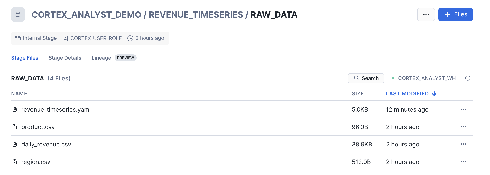
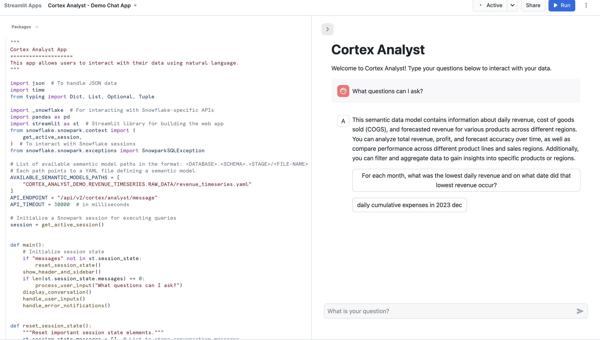

author: caleb-baechtold
id: getting_started_with_cortex_analyst
summary: Through this quickstart guide, you will learn how to use Cortex Analyst to provide natural-language query interfaces to structured data in Snowflake using GenAI
categories: Getting-Started
environments: web
status: Draft 
feedback link: https://github.com/Snowflake-Labs/sfguides/issues
tags: Getting Started, Data Science, GenAI, Cortex

# Getting Started with Cortex Analyst
<!-- ------------------------ -->
## Overview 

Through this quickstart guide, you will explore how to get started with [Cortex Analyst](https://docs.snowflake.com/LIMITEDACCESS/snowflake-cortex/cortex-analyst-overview) to let business users "talk" to their structured data in Snowflake using natural language.

### What is Cortex Analyst?

Cortex Analyst is fully managed solution that lets business users "talk" to their structured data in Snowflake using natural language. Powered by state-of-the-art Snowflake hosted LLMs it provides a convenient REST API for seamless integration into any application, while ensuring a high-precision experience.


### Why use Cortex Analyst?
Cortex Analyst empowers business users to self-service data analysis through conversation, reducing dependency on data teams for ad hoc queries and speeding up time to insights and decisions. Cortex Analyst has a lower total cost of ownership (TCO) and improved accuracy compared to building your own "Talk to Your Data" (TTYD) solution from scratch.

This quickstart will focus on getting started with Cortex Analyst, teaching the mechanics of how to interact with the Cortex Analyst service and Semantic Model definitions to support TTYD on Snowflake.

### What you will learn 
- How to construct and configure a Semantic Model for your data
- How to call the Cortex Analyst REST API to use your Semantic Model to enable natural-language question-asking on top of your structured data in Snowflake

### Prerequisites
- [Git](https://git-scm.com/book/en/v2/Getting-Started-Installing-Git) installed
    > aside positive
    >
    >Download the [git repo](https://github.com/Snowflake-Labs/sfguide-getting-started-with-cortex-analyst)
- A Snowflake account login with a role that has the ability to create database, schema, tables, stages, user-defined functions, and stored procedures. If not, you will need to register for a free trial or use a different role.

### What You’ll Build 
- A Semantic Model over sample financial data
- A Streamlit app with a conversational interface to Cortex Analyst


<!-- ------------------------ -->
## Set up the Snowflake environment
Duration: 2

> aside positive
>
> MAKE SURE YOU'VE DOWNLOADED THE [GIT REPO](https://github.com/Snowflake-Labs/sfguide-getting-started-with-cortex-analyst).

Open up the [create_snowflake_objects.sql](https://github.com/Snowflake-Labs/sfguide-getting-started-with-cortex-analyst/blob/main/create_snowflake_objects.sql) file in a SQL worksheet in Snowsight.

Run the following SQL commands in a SQL worksheet to create the [warehouse](https://docs.snowflake.com/en/sql-reference/sql/create-warehouse.html), [database](https://docs.snowflake.com/en/sql-reference/sql/create-database.html) and [schema](https://docs.snowflake.com/en/sql-reference/sql/create-schema.html).

```SQL
USE ROLE sysadmin;

/*--
• database, schema, warehouse and stage creation
--*/

-- create demo database
CREATE OR REPLACE DATABASE cortex_analyst_demo;

-- create schema
CREATE OR REPLACE SCHEMA revenue_timeseries;

-- create warehouse
CREATE OR REPLACE WAREHOUSE cortex_analyst_wh
    WAREHOUSE_SIZE = 'large'
    WAREHOUSE_TYPE = 'standard'
    AUTO_SUSPEND = 60
    AUTO_RESUME = TRUE
    INITIALLY_SUSPENDED = TRUE
COMMENT = 'warehouse for cortex analyst demo';


USE WAREHOUSE cortex_analyst_wh;

CREATE STAGE raw_data DIRECTORY = (ENABLE = TRUE);

/*--
• table creation
--*/
CREATE OR REPLACE TABLE CORTEX_ANALYST_DEMO.REVENUE_TIMESERIES.DAILY_REVENUE (
	DATE DATE,
	REVENUE FLOAT,
	COGS FLOAT,
	FORECASTED_REVENUE FLOAT
);

CREATE OR REPLACE TABLE CORTEX_ANALYST_DEMO.REVENUE_TIMESERIES.DAILY_REVENUE_BY_PRODUCT (
	DATE DATE,
	PRODUCT_LINE VARCHAR(16777216),
	REVENUE FLOAT,
	COGS FLOAT,
	FORECASTED_REVENUE FLOAT
);

CREATE OR REPLACE TABLE CORTEX_ANALYST_DEMO.REVENUE_TIMESERIES.DAILY_REVENUE_BY_REGION (
	DATE DATE,
	SALES_REGION VARCHAR(16777216),
	REVENUE FLOAT,
	COGS FLOAT,
	FORECASTED_REVENUE FLOAT
);
```

These can also be found in the [**create_snowflake_objects.sql**](https://github.com/Snowflake-Labs/sfguide-getting-started-with-cortex-analyst/blob/main/create_snowflake_objects.sql) file.

<!-- ------------------------ -->
## Upload and Ingest the Revenue Data and Semantic Model YAML
Duration: 10

> aside positive
>
> MAKE SURE YOU'VE DOWNLOADED THE [GIT REPO](https://github.com/Snowflake-Labs/sfguide-getting-started-with-cortex-analyst).

There are three data files and one YAML file included in the [Git Repo](https://github.com/Snowflake-Labs/sfguide-getting-started-with-cortex-analyst) that you should have cloned:
- [daily_revenue_combined.csv](https://github.com/Snowflake-Labs/sfguide-getting-started-with-cortex-analyst/blob/main/data/daily_revenue_combined.csv)
- [daily_revenue_by_region_combined.csv](https://github.com/Snowflake-Labs/sfguide-getting-started-with-cortex-analyst/blob/main/data/daily_revenue_by_region_combined.csv)
- [daily_revenue_by_product_combined.csv](https://github.com/Snowflake-Labs/sfguide-getting-started-with-cortex-analyst/blob/main/data/daily_revenue_by_product_combined.csv)
- [revenue_timeseries.yaml](https://github.com/Snowflake-Labs/sfguide-getting-started-with-cortex-analyst/blob/main/revenue_timeseries.yaml)

You will now upload these files to your Snowflake account and ingest the data files into the tables created in the previous step.

To upload the data files:
- Navigate to the Worksheets tab in Snowsight, click the '+' button in the top right corner and select **Add Data**
- On the Add Data page, select **Load files into a stage**
- Select the four files that you want to upload (listed above)
- Select **CORTEX_ANALYST_DEMO** as Database, **REVENUE_TIMESERIES** as Schema, and **RAW_DATA** as Stage
- Click Upload

Let's go check that the files were successfully uploaded to the stage. In the Snowsight UI:
- Select **Data >> Databases**
- Select the CORTEX_ANALYST_DEMO database and REVENUE_TIMESERIES Schema that contain the stage
- Select Stages and select the RAW_DATA stage
- If prompted, select Enable Directory Table and the CORTEX_ANALYST_WH to refresh the directory table

You should see the four files listed in the stage:


Now, let's load the raw CSV data into the tables. Go back to your Snowflake SQL worksheet and run the following [load_data.sql](https://github.com/Snowflake-Labs/sfguide-getting-started-with-cortex-analyst/blob/main/load_data.sql) code to load data into the tables:

```sql
/*--
• looad data into tables
--*/
COPY INTO CORTEX_ANALYST_DEMO.REVENUE_TIMESERIES.DAILY_REVENUE
FROM @raw_data
FILES = ('daily_revenue_combined.csv')
FILE_FORMAT = (
    TYPE=CSV,
    SKIP_HEADER=1,
    FIELD_DELIMITER=',',
    TRIM_SPACE=FALSE,
    FIELD_OPTIONALLY_ENCLOSED_BY=NONE,
    REPLACE_INVALID_CHARACTERS=TRUE,
    DATE_FORMAT=AUTO,
    TIME_FORMAT=AUTO,
    TIMESTAMP_FORMAT=AUTO
    EMPTY_FIELD_AS_NULL = FALSE
    error_on_column_count_mismatch=false
)

ON_ERROR=CONTINUE
FORCE = TRUE ;


COPY INTO CORTEX_ANALYST_DEMO.REVENUE_TIMESERIES.DAILY_REVENUE_BY_PRODUCT
FROM @raw_data
FILES = ('daily_revenue_by_product_combined.csv')
FILE_FORMAT = (
    TYPE=CSV,
    SKIP_HEADER=1,
    FIELD_DELIMITER=',',
    TRIM_SPACE=FALSE,
    FIELD_OPTIONALLY_ENCLOSED_BY=NONE,
    REPLACE_INVALID_CHARACTERS=TRUE,
    DATE_FORMAT=AUTO,
    TIME_FORMAT=AUTO,
    TIMESTAMP_FORMAT=AUTO
    EMPTY_FIELD_AS_NULL = FALSE
    error_on_column_count_mismatch=false
)

ON_ERROR=CONTINUE
FORCE = TRUE ;


COPY INTO CORTEX_ANALYST_DEMO.REVENUE_TIMESERIES.DAILY_REVENUE_BY_REGION
FROM @raw_data
FILES = ('daily_revenue_by_region_combined.csv')
FILE_FORMAT = (
    TYPE=CSV,
    SKIP_HEADER=1,
    FIELD_DELIMITER=',',
    TRIM_SPACE=FALSE,
    FIELD_OPTIONALLY_ENCLOSED_BY=NONE,
    REPLACE_INVALID_CHARACTERS=TRUE,
    DATE_FORMAT=AUTO,
    TIME_FORMAT=AUTO,
    TIMESTAMP_FORMAT=AUTO
    EMPTY_FIELD_AS_NULL = FALSE
    error_on_column_count_mismatch=false
)

ON_ERROR=CONTINUE
FORCE = TRUE ;
```
<!-- ------------------------ -->
## Create a Streamlit in Snowflake (SiS) Demo Chat App
Duration: 10

Now, you will create a demo chat application to call the Cortex Analyst API and ask natural-language questions over our structured revenue datasets. To create the SiS app:

- In the left navigation bar, select Projects » Streamlit
- Select + Streamlit. The Create Streamlit App window opens

- Enter the name for your app as Cortex Analyst - Demo Chat App
- In the Warehouse dropdown, select the warehouse CORTEX_ANALYST_WH where you want to run your app and execute queries
- In the App location dropdown, select the CORTEX_ANALYST_DEMO database and REVENUE_TIMESERIES schema for your app
- Select Create

Now open the Streamlit code editor:


We will copy and paste the following Python code from [cortex_analyst_sis_demo_app.py](https://github.com/Snowflake-Labs/sfguide-getting-started-with-cortex-analyst/blob/main/cortex_analyst_sis_demo_app.py) into the editor:

```python
import _snowflake
import json
import streamlit as st
import time
from snowflake.snowpark.context import get_active_session

DATABASE = "CORTEX_ANALYST_DEMO"
SCHEMA = "REVENUE_TIMESERIES"
STAGE = "RAW_DATA"
FILE = "revenue_timeseries.yaml"

def send_message(prompt: str) -> dict:
    """Calls the REST API and returns the response."""
    request_body = {
        "messages": [
            {
                "role": "user",
                "content": [
                    {
                        "type": "text",
                        "text": prompt
                    }
                ]
            }
        ],
        "semantic_model_file": f"@{DATABASE}.{SCHEMA}.{STAGE}/{FILE}",
    }
    resp = _snowflake.send_snow_api_request(
        "POST",
        f"/api/v2/cortex/analyst/message",
        {},
        {},
        request_body,
        {},
        30000,
    )
    if resp["status"] < 400:
        return json.loads(resp["content"])
    else:
        raise Exception(
            f"Failed request with status {resp['status']}: {resp}"
        )

def process_message(prompt: str) -> None:
    """Processes a message and adds the response to the chat."""
    st.session_state.messages.append(
        {"role": "user", "content": [{"type": "text", "text": prompt}]}
    )
    with st.chat_message("user"):
        st.markdown(prompt)
    with st.chat_message("assistant"):
        with st.spinner("Generating response..."):
            response = send_message(prompt=prompt)
            content = response["message"]["content"]
            display_content(content=content)
    st.session_state.messages.append({"role": "assistant", "content": content})


def display_content(content: list, message_index: int = None) -> None:
    """Displays a content item for a message."""
    message_index = message_index or len(st.session_state.messages)
    for item in content:
        if item["type"] == "text":
            st.markdown(item["text"])
        elif item["type"] == "suggestions":
            with st.expander("Suggestions", expanded=True):
                for suggestion_index, suggestion in enumerate(item["suggestions"]):
                    if st.button(suggestion, key=f"{message_index}_{suggestion_index}"):
                        st.session_state.active_suggestion = suggestion
        elif item["type"] == "sql":
            with st.expander("SQL Query", expanded=False):
                st.code(item["statement"], language="sql")
            with st.expander("Results", expanded=True):
                with st.spinner("Running SQL..."):
                    session = get_active_session()
                    df = session.sql(item["statement"]).to_pandas()
                    if len(df.index) > 1:
                        data_tab, line_tab, bar_tab = st.tabs(
                            ["Data", "Line Chart", "Bar Chart"]
                        )
                        data_tab.dataframe(df)
                        if len(df.columns) > 1:
                            df = df.set_index(df.columns[0])
                        with line_tab:
                            st.line_chart(df)
                        with bar_tab:
                            st.bar_chart(df)
                    else:
                        st.dataframe(df)


st.title("Cortex analyst")
st.markdown(f"Semantic Model: `{FILE}`")

if "messages" not in st.session_state:
    st.session_state.messages = []
    st.session_state.suggestions = []
    st.session_state.active_suggestion = None

for message_index, message in enumerate(st.session_state.messages):
    with st.chat_message(message["role"]):
        display_content(content=message["content"], message_index=message_index)

if user_input := st.chat_input("What is your question?"):
    process_message(prompt=user_input)

if st.session_state.active_suggestion:
    process_message(prompt=st.session_state.active_suggestion)
    st.session_state.active_suggestion = None
```

Take note of the `send_message` function that is defined in this Python code. This is the function that takes our chat input prompt, packages it up as a JSON object, and sends it to the Cortex Analyst API (with the specified `revenue_timeseries.yaml` Semantic Model). 

```python
def send_message(prompt: str) -> dict:
    """Calls the REST API and returns the response."""
    request_body = {
        "messages": [
            {
                "role": "user",
                "content": [
                    {
                        "type": "text",
                        "text": prompt
                    }
                ]
            }
        ],
        "semantic_model_file": f"@{DATABASE}.{SCHEMA}.{STAGE}/{FILE}",
    }
    resp = _snowflake.send_snow_api_request(
        "POST",
        f"/api/v2/cortex/analyst/message",
        {},
        {},
        request_body,
        {},
        30000,
    )
    if resp["status"] < 400:
        return json.loads(resp["content"])
    else:
        raise Exception(
            f"Failed request with status {resp['status']}: {resp}"
        )
```

To preview the app, click Run in the preview pane. You can now begin asking natural langague questions about the revenue data in the chat interface (e.g. "What questions can I ask?")

<!-- ------------------------ -->
## Semantic Model Details
Duration: 10

The semantic model file [`revenue_timeseries.yaml`](https://github.com/Snowflake-Labs/sfguide-getting-started-with-cortex-analyst/blob/main/revenue_timeseries.yaml) is the key that unlocks Cortex Analyst's power. This YAML file dictates the tables, columns, etc. that Analyst can use in order to run queries that answer natural-language questions Let's talk a little about the details of this file:

The [Semantic Model](https://docs.snowflake.com/snowflake-cortex/semantic-model-spec) is composed of a number of different fields that help Cortex Analyst understand the specifics of your data:
- Logical Tables which are composed of Logical Columns
- Logical Columns which are one of `dimensions`, `time_dimensions`, or `measures`

Logical Tables are relatively straightforward- these are tables or views within a database. That's it! Pretty simple

Logical Columns get a bit more complicated; a logical column can reference an underlying physical column in a table, or it can be a expression containing one or more physical columns. So, for example, in the [`revenue_timeseries.yaml`](https://github.com/Snowflake-Labs/sfguide-getting-started-with-cortex-analyst/blob/main/revenue_timeseries.yaml), we have a simple logical column `daily_revenue` that is a physical column. In the `daily_revenue` measure defintion, you'll notice that we provide a description, as well as synonyms, data_type, and a default_aggregation, but no `expr` parameter. This is because `revenue` is simply a physical column in the `daily_revenue` table:

```yaml
measures:
    - name: daily_revenue
        expr: revenue
        description: total revenue for the given day
        synonyms: ["sales", "income"]
        default_aggregation: sum
        data_type: number
```

In contrast, we define a different measure `daily_profit` which is not in fact a physical column, but rather an expression of the difference between the `revenue` and `cogs` physical columns:

```yaml
- name: daily_profit
    description: profit is the difference between revenue and expenses.
    expr: revenue - cogs
    data_type: number
``` 
In the semantic model, `time_dimensions` specifically capture temporal features of the data, and `dimensions` are not quantitatve fields (e.g. quantitative fields are `measures`, while categorical fields are `dimensions`).

An example `time_dimension`:
```yaml
time_dimensions:
    - name: date
    expr: date
    description: date with measures of revenue, COGS, and forecasted revenue for each product line
    unique: false
    data_type: date
```

An example `dimension`:
```yaml
dimensions:
    - name: product_line
    expr: product_line
    description: product line associated with it's own slice of revenue
    unique: false
    data_type: varchar
    sample_values:
        - Electronics
        - Clothing
        - Home Appliances
        - Toys
        - Books
```

Here are some tips on building your own semantic model to use with Cortex Analyst:

When generating the semantic model, think from the end user perspective:
- For business user, accuracy and trust is the paramount
- Organize your YAML file in the unit of business domain/topic
- If you are trying to pull a snippet of this data into excel for your business stakeholder, what are the tabs and columns you’d keep? What are the column namings you’d use?
- Use above to guide your selection of tables and columns. Err on the side of only including necessary columns.
- We recommend not exceeding 3-5 tables, 10-20 columns each table to start.

Some additional items that’ll significantly improve model performance:
- Capture more difficult or more business-specific queries into expressions and verified queries (please use the Chat tab within streamlit admin app to add verified queries)
  - Verified queries will be provided as few-shot example for model to draw inspiration from, hence significantly improve performance
  - If any organization specific logic cannot be captured via other spec items, we recommend you to add to verified queries.
- Start with a simple and small scope, gradually expanding. YAML building is an iterative process.

For more information about the semantic model, please refer to the [documentation](https://docs.snowflake.com/snowflake-cortex/semantic-model-spec).

<!-- ------------------------ -->
## Conclusion and Resources
Congratulations, you have successfully completed this quickstart! Through this quickstart, we were able to showcase how Cortex Analyst allows business users to ask natural-language questions over their structured data to perform analysis and receive trusted answers to business questions.

### What you learned
- How to create a semantic model YAML file
- How to interact with the Cortex Analyst REST API via a Streamlit in Snowflake (SiS) chat interface

For more information, check out the resources below:

### Related Resources
- [Source Code on GitHub](https://github.com/Snowflake-Labs/sfguide-getting-started-with-cortex-analyst)
- [Cortex Analyst docs](https://docs.snowflake.com/snowflake-cortex/cortex-analyst-overview)
- [Cortex Analyst examples](https://github.com/Snowflake-Labs/sf-samples/tree/main/samples/cortex-analyst)
- [Semantic Model Generator](https://github.com/Snowflake-Labs/semantic-model-generator)

<!-- ------------------------ -->