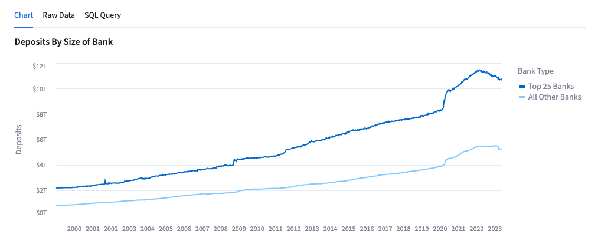
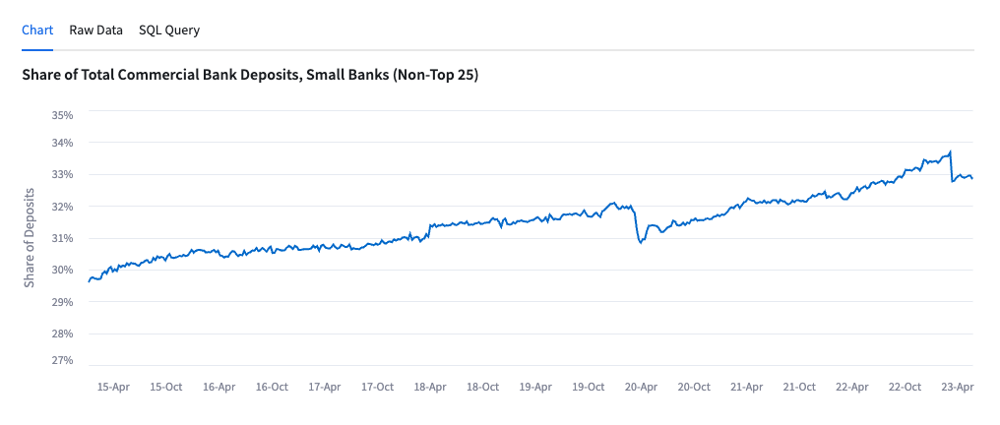
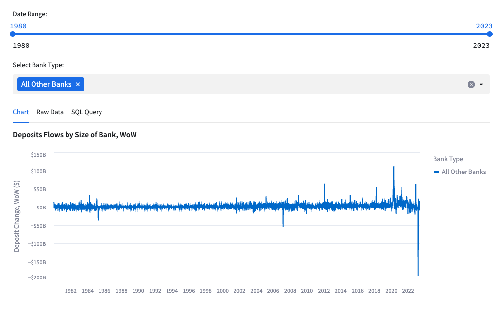
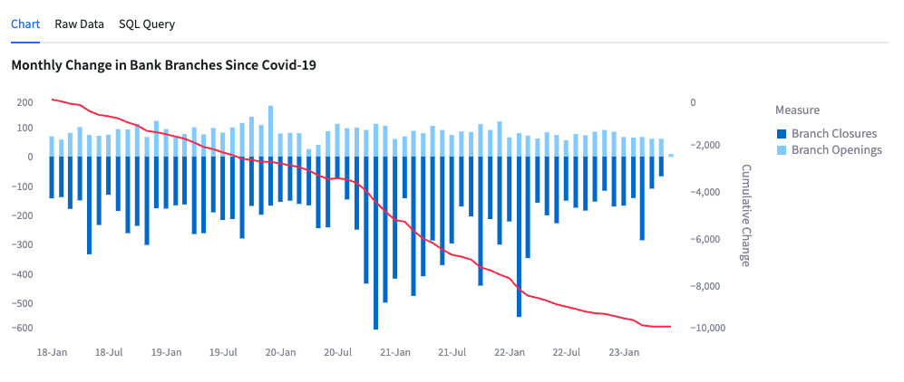
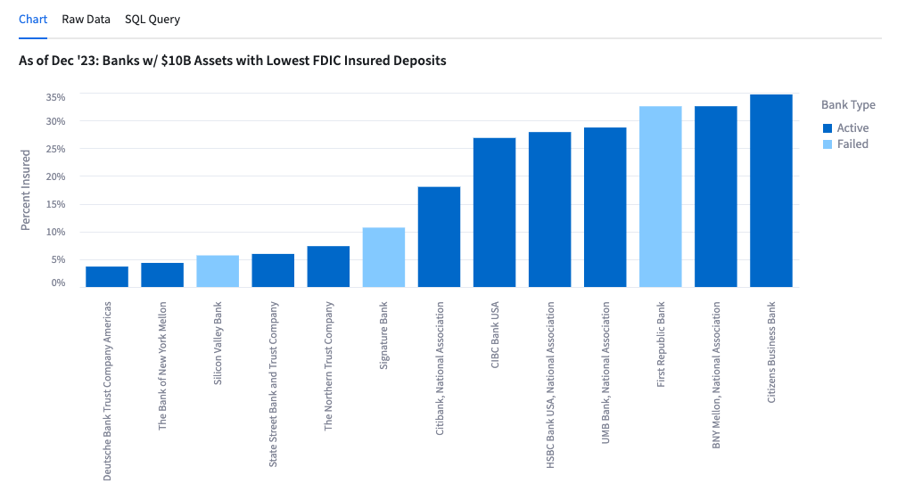
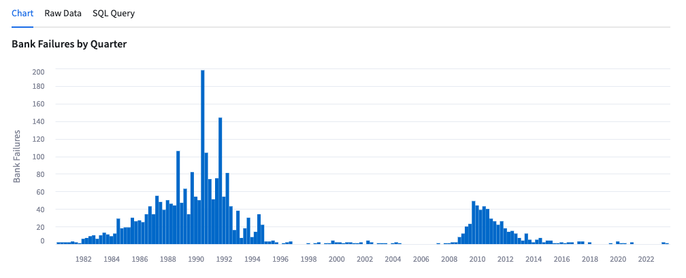
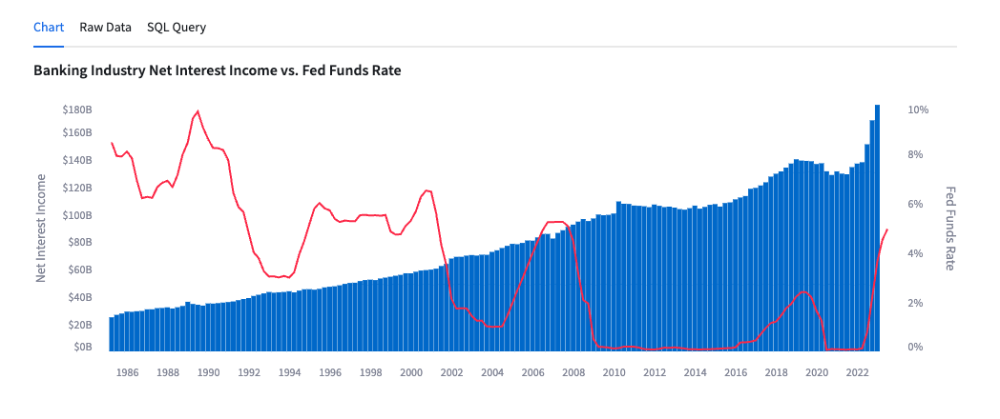
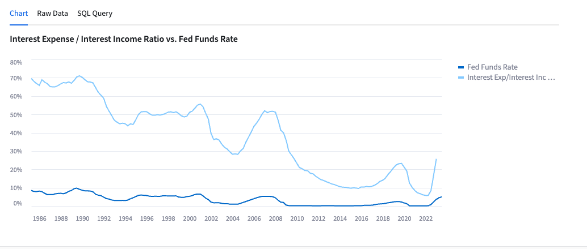

author: ashleynagaki, vskarine
id: getting_started_with_cybersyn_financial_and_economic_essentials_app
summary: How to access and use Cybersyn’s Financial & Economic Essentials App.
categories: Streamlit
environments: web
status: Published 
feedback link: https://github.com/Snowflake-Labs/sfguides/issues
tags: Getting Started, Data Science, Data Engineering, Twitter 

# Quickstart Guide: Cybersyn Financial & Economic Essentials App
<!-- ------------------------ -->
## Overview 
Duration: 2

In this guide, we will review how to access and use Cybersyn’s Financial & Economic Essentials App.

### What is a Snowflake Native App?
[Snowflake Native Apps](https://www.snowflake.com/native-apps/) are deployed by third party companies, like Cybersyn, through Snowflake Marketplace. Instead of customers having to copy data to apps, this technology enables data to be deployed and distributed directly through an app that lives inside an end users’ existing Snowflake account.

### What is Streamlit?
Streamlit is a pure Python [open source](https://github.com/streamlit/streamlit) application framework that enables developers to quickly and easily write, share, and deploy data applications. Learn more about [Streamlit](https://streamlit.io/).

### What you’ll get?
A Streamlit application built natively in Snowflake that is connected directly to a database. This application allows users to quickly demonstrate usage examples for the data and then copy them to query on the underlying data themselves. 

This data specifically focuses on the US banking system and respective financials and performance. The application includes data covering bank financials, locations, corporate structures, and more as well as key economic indicators such as employment (and unemployment) numbers, inflation metrics, and central bank interest rates.

The dataset combines data from following sources to give a holistic view of the current state of the US financial industry:
- Federal Deposit Insurance Corporation (FDIC)
- Federal Reserve Economic Data (FRED)
- Federal Financial Institutions Examination Council (FFIEC)
- Bureau of Labor Statistics (BLS)
- Consumer Financial Protection Bureau (CFPB)

### What you’ll Learn?
How to ‘Get’ a public, free Native App from Snowflake Marketplace

How to interact with Cybersyn’s Financial & Economic Essentials App in Snowflake

### Prerequisites
A [Snowflake account](https://signup.snowflake.com/)
- To ensure you can mount data from the Marketplace, login to your Snowflake account with the admin credentials that were created with the account in one browser tab (a role with ORGADMIN privileges is required for this step). Keep this tab open during the session.
  - Click on the Billing on the left side panel
  - Click on Terms and Billing
  - Read and accept terms to continue

<!-- ------------------------ -->
## Accessing the Application in Snowflake Marketplace
Duration: 4

After logging into your Snowflake account, access the [Cybersyn Financial & Economic Essentials App in the Marketplace](https://app.snowflake.com/marketplace/listing/GZTSZAS2KIU). 
- Click the Get button on the top right box on the listing
- Read and accept terms by clicking Get again 
  - Note: This data listing is available for free, at no additional charge. 
- The application is now available in your Snowflake instance, as the Financial & Economic Essentials App under Apps on the left hand side panel.
- The database is also now available in your Snowflake instance, as the Financial & Economic Essentials App database under Data on the left hand side pane. This includes all of the underlying data tables that you can query on directly

<!-- ------------------------ -->
## Walk-through of the App Functionality
Duration: 3

Access the Financial & Economic Essentials App in the Apps section in your Snowflake account. 

Cybersyn has developed this Streamlit application on our database for users to get example use cases and demo the underlying data tables. 

Each chart display includes the underlying raw data and a SQL query to copy and paste into your own Snowflake Worksheets. 

### Layout & Walkthrough
The includes a side panel navigation bar where you can flip through the following tabs: 
- Overview: Overview of the data included in the application with a case study with example charts showcasing data from the recent regional banking crisis from earlier in 2023 when Silicon Valley Bank shut down. 
- FRED Time Series: Chart of data sourced from FRED, a database of economic indicators published by the St Louis Federal Reserve from multiple government sources. Data includes consumer price index (CPI) inflation and monthly retail sales; as well as, financial-institution-specific data such as the flow of deposits for small and large banks, total bank liabilities, the outstanding balance of commercial real estate loans, and more. 
- CFPB Time Series: Data sourced from the Consumer Financial Protection Bureau (CFPB), on financial complaints in the US. Two charts: (1) by Company and (2) by Product. 
- FDIC Time Series: Chart of the data sourced from FDIC about locations of active and inactive banks, charter types, regulator information, and bank level total assets, FDIC insured deposits, return on equity, and more. 
- FFIEC Time Series: Chart of the data sourced from FFIEC on bank brand openings and closings.

### Summary of the Overview Charts
 
#### Chart 1: Deposits by Size of Bank

- This chart allows the user to see the US bank deposits broken down by Top 25 Banks and All Others since January 1999. 
- Data is sourced from [FRED](https://fred.stlouisfed.org/tags/series). 

#### Chart 2: Share of Total Commercial Bank Deposits, Small Banks (Non-Top 25)

- This chart shows the share of deposits help by the banks that are not in the top 25 US banks by total deposits. 
- Data is sourced from [FRED](https://fred.stlouisfed.org/tags/series). 

#### Chart 3: Deposit Flows by Size of Bank, WoW

- This chart shows the WoW deposit inflows and (outflows) for banks. 
- The chart can be filtered by date and the user can add in ‘Top 25 Banks’ and ‘All Other Banks’ to see the two breakdowns.
- Data is sourced from [FRED](https://fred.stlouisfed.org/tags/series).

#### Chart 4: Monthly Change in Bank Branches Since COVID-19

- This chart shows the monthly and cumulative change of bank branch openings and closures since January 2018. 
- Data is sourced from [FFIEC](https://www.ffiec.gov/npw/FinancialReport/DataDownload).

#### Chart 5: As of Dec '23: Banks w/ $10B Assets with Lowest FDIC Insured Deposits

- This chart shows the banks with lowest FDIC insured deposits as of December 2022. 
- Data is sourced from [FDIC](https://banks.data.fdic.gov/docs/).

#### Chart 6: Bank Failures by Quarter

- This chart shows the number of bank failures by quarter. 
- Data is sourced from [FFIEC](https://www.ffiec.gov/npw/FinancialReport/DataDownload).

#### Chart 7: Banking Industry Net Interest Income vs. Fed Funds Rate

- This chart shows net interest income by the bar charts against the left axis and the Fed Funds Rate in the line graph against the right axis since March 1985. 
- Data is sourced from [FRED](https://fred.stlouisfed.org/tags/series).

#### Chart 8: Interest Expense / Interest Income Ratio vs Fed Funds Rate

- This chart shows the ratio of Interest Expense to Interest Income and compares it to the Fed Funds Rate since March 1985.
- Data is sourced from [FRED](https://fred.stlouisfed.org/tags/series).

<!-- ------------------------ -->
## How to use the app to query the data
Duration: 3

Cybersyn has developed this Streamlit application on our database for users to get example use cases and demo the underlying data tables. Users can filter a chart then get the SQL query for the underlying database to easily access the raw data in their Snowflake Account.

### Step 1: Filter the data in the App
**Example**: FRED Time Series Tab
- Filter for
  - **Measure**: “Retail Sales: Jewelry Stores”
  - **Seasonally Adjusted**: “True”
  - **Units**: “USD”
  - **Years**: 2005 to 2023

### Step 2: Copy the SQL Query
**Example**: FRED Time Series Tab
- On the chart, click “SQL Query”
- Click on the Copy button  to copy the SQL code

### Step 3: Run the SQL Query
**Example**: On Comparisons by Year tab
- Click on the Open in worksheet button 
- Paste the SQL code into your worksheet
- Click the blue play button in the top right corner
- Now you have a query that you can modify and edit in a Snowflake Worksheet

### **Success! You have learned how to use the Cybersyn Financial & Economic Essentials App!**
