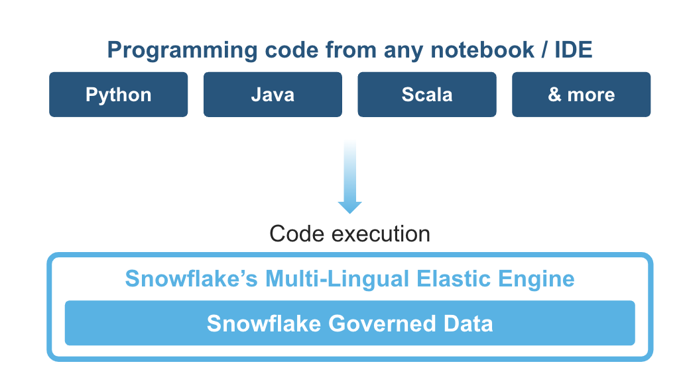
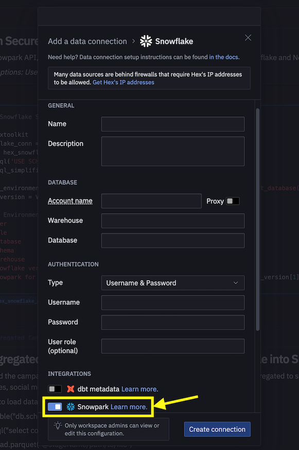
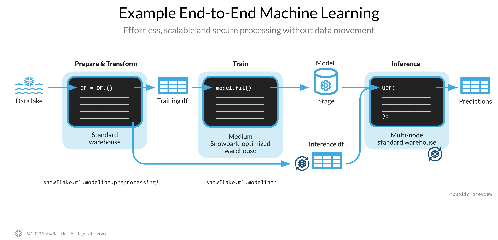
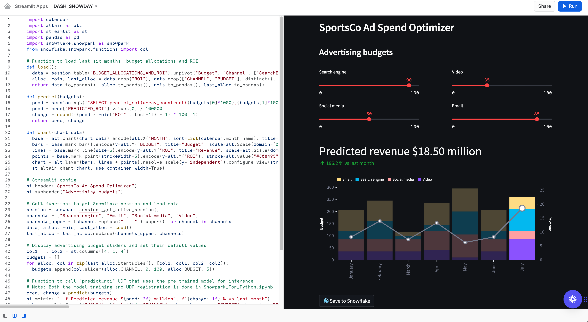

id: getting_started_with_dataengineering_ml_using_snowpark_python
summary: Getting Started with Data Engineering and ML using Snowpark for Python
categories: featured,getting-started,data-science-&-ml,data-engineering,app-development
environments: web
status: Published
feedback link: <https://github.com/Snowflake-Labs/sfguides/issues>
tags: Getting Started, Snowpark Python, Streamlit, scikit-learn, Data Engineering, Machine Learning
authors: Dash Desai

# Getting Started with Data Engineering and ML using Snowpark for Python
<!-- ------------------------ -->
## Overview

Duration: 5

By completing this guide, you will be able to go from raw data to an interactive application that can help organization optimize their advertising budget allocation.

Here is a summary of what you will be able to learn in each step by following this quickstart:

- **Setup Environment**: Use stages and tables to ingest and organize raw data from S3 into Snowflake
- **Data Engineering**: Leverage Snowpark for Python DataFrames to perform data transformations such as group by, aggregate, pivot, and join to prep the data for downstream applications.
- **Data Pipelines**: Use Snowflake Tasks to turn your data pipeline code into operational pipelines with integrated monitoring.  
- **Machine Learning**: Prepare data and run ML Training in Snowflake using Snowpark ML and deploy the model as a Snowpark User-Defined-Function (UDF).
- **Streamlit**: Build an interactive Streamlit application using Python (no web development experience required) to help visualize the ROI of different advertising spend budgets.

In case you are new to some of the technologies mentioned above, here’s a quick summary with links to documentation.

### What is Snowpark?

The set of libraries and runtimes in Snowflake that securely deploy and process non-SQL code, including Python, Java and Scala.

**Familiar Client Side Libraries** - Snowpark brings deeply integrated, DataFrame-style programming and OSS compatible APIs to the languages data practitioners like to use. It also includes the Snowpark ML API for more efficient ML modeling (public preview) and ML operations (private preview).

**Flexible Runtime Constructs** - Snowpark provides flexible runtime constructs that allow users to bring in and run custom logic. Developers can seamlessly build data pipelines, ML models, and data applications with User-Defined Functions and Stored Procedures.

Learn more about [Snowpark](https://www.snowflake.com/snowpark/).



### What is Snowpark ML?

Snowpark ML is a new library for faster and more intuitive end-to-end ML development in Snowflake. Snowpark ML has 2 APIs: Snowpark ML Modeling (in Public Preview) for model development and Snowpark ML Operations (in Private Preview) for model deployment.

This quickstart will focus on the Snowpark ML Modeling API, which scales out feature engineering and simplifies ML training execution in Snowflake.

### What is Streamlit?

Streamlit enables data scientists and Python developers to combine Streamlit's component-rich, open-source Python library with the scale, performance, and security of the Snowflake platform.

Learn more about [Streamlit](https://www.snowflake.com/en/data-cloud/overview/streamlit-in-snowflake/).

### What You Will Learn

- How to analyze data and perform data engineering tasks using Snowpark DataFrames and APIs
- How to use open-source Python libraries from curated Snowflake Anaconda channel
- How to train ML model using Snowpark ML in Snowflake
- How to create Scalar and Vectorized Snowpark Python User-Defined Functions (UDFs) for online and offline inference respectively
- How to create Snowflake Tasks to automate data pipelines
- How to create Streamlit application that uses the Scalar UDF for inference based on user input

### Prerequisites

- [Git](https://git-scm.com/book/en/v2/Getting-Started-Installing-Git) installed
- [Python 3.9](https://www.python.org/downloads/) installed
  - Note that you will be creating a Python environment with 3.9 in the **Get Started** step
- A Snowflake account with [Anaconda Packages enabled by ORGADMIN](https://docs.snowflake.com/en/developer-guide/udf/python/udf-python-packages.html#using-third-party-packages-from-anaconda). If you do not have a Snowflake account, you can register for a [free trial account](https://signup.snowflake.com/).
- A Snowflake account login with ACCOUNTADMIN role. If you have this role in your environment, you may choose to use it. If not, you will need to 1) Register for a free trial, 2) Use a different role that has the ability to create database, schema, tables, stages, tasks, user-defined functions, and stored procedures OR 3) Use an existing database and schema in which you are able to create the mentioned objects.

> aside positive
> IMPORTANT: Before proceeding, make sure you have a Snowflake account with Anaconda packages enabled by ORGADMIN as described [here](https://docs.snowflake.com/en/developer-guide/udf/python/udf-python-packages#getting-started).

<!-- ------------------------ -->
## Setup Environment

Duration: 15

### Create Tables, Load Data and Setup Stages

Log into [Snowsight](https://docs.snowflake.com/en/user-guide/ui-snowsight.html#) using your credentials to create tables, load data from Amazon S3, and setup Snowflake internal stages.

> aside positive
> IMPORTANT:
>
> - If you use different names for objects created in this section, be sure to update scripts and code in the following sections accordingly.
>
> - For each SQL script block below, select all the statements in the block and execute them top to bottom.

Run the following SQL commands to create the [warehouse](https://docs.snowflake.com/en/sql-reference/sql/create-warehouse.html), [database](https://docs.snowflake.com/en/sql-reference/sql/create-database.html) and [schema](https://docs.snowflake.com/en/sql-reference/sql/create-schema.html).

```sql
USE ROLE ACCOUNTADMIN;

CREATE OR REPLACE WAREHOUSE DASH_L;
CREATE OR REPLACE DATABASE DASH_DB;
CREATE OR REPLACE SCHEMA DASH_SCHEMA;

USE DASH_DB.DASH_SCHEMA;
```

Run the following SQL commands to create table **CAMPAIGN_SPEND** from data hosted on publicly accessible S3 bucket.

```sql
CREATE or REPLACE file format csvformat
  skip_header = 1
  type = 'CSV';

CREATE or REPLACE stage campaign_data_stage
  file_format = csvformat
  url = 's3://sfquickstarts/ad-spend-roi-snowpark-python-scikit-learn-streamlit/campaign_spend/';

CREATE or REPLACE TABLE CAMPAIGN_SPEND (
  CAMPAIGN VARCHAR(60), 
  CHANNEL VARCHAR(60),
  DATE DATE,
  TOTAL_CLICKS NUMBER(38,0),
  TOTAL_COST NUMBER(38,0),
  ADS_SERVED NUMBER(38,0)
);

COPY into CAMPAIGN_SPEND
  from @campaign_data_stage;
```

Run the following SQL commands to create table **MONTHLY_REVENUE** from data hosted on publicly accessible S3 bucket.

```sql
CREATE or REPLACE stage monthly_revenue_data_stage
  file_format = csvformat
  url = 's3://sfquickstarts/ad-spend-roi-snowpark-python-scikit-learn-streamlit/monthly_revenue/';

CREATE or REPLACE TABLE MONTHLY_REVENUE (
  YEAR NUMBER(38,0),
  MONTH NUMBER(38,0),
  REVENUE FLOAT
);

COPY into MONTHLY_REVENUE
  from @monthly_revenue_data_stage;
```

Run the following SQL commands to create table **BUDGET_ALLOCATIONS_AND_ROI** that holds the last six months of budget allocations and ROI.

```sql
CREATE or REPLACE TABLE BUDGET_ALLOCATIONS_AND_ROI (
  MONTH varchar(30),
  SEARCHENGINE integer,
  SOCIALMEDIA integer,
  VIDEO integer,
  EMAIL integer,
  ROI float
);

INSERT INTO BUDGET_ALLOCATIONS_AND_ROI (MONTH, SEARCHENGINE, SOCIALMEDIA, VIDEO, EMAIL, ROI)
VALUES
('January',35,50,35,85,8.22),
('February',75,50,35,85,13.90),
('March',15,50,35,15,7.34),
('April',25,80,40,90,13.23),
('May',95,95,10,95,6.246),
('June',35,50,35,85,8.22);
```

Run the following commands to create Snowflake [internal stages](https://docs.snowflake.com/en/user-guide/data-load-local-file-system-create-stage) for storing Stored Procedures, UDFs, and ML model files.

```sql
CREATE OR REPLACE STAGE dash_sprocs;
CREATE OR REPLACE STAGE dash_models;
CREATE OR REPLACE STAGE dash_udfs;
```

Optionally, you can also open [setup.sql](https://github.com/Snowflake-Labs/sfguide-ad-spend-roi-snowpark-python-streamlit-scikit-learn/blob/main/setup.sql) in Snowsight and run all SQL statements to create the objects and load data from AWS S3.

> aside positive
> IMPORTANT: If you use different names for objects created in this section, be sure to update scripts and code in the following sections accordingly.

<!-- ------------------------ -->
## Get Started

Duration: 8

This section covers cloning of the GitHub repository and setting up your Snowpark for Python environment.

### Clone GitHub Repository

The very first step is to clone the [GitHub repository](https://github.com/Snowflake-Labs/sfguide-ad-spend-roi-snowpark-python-streamlit-scikit-learn). This repository contains all the code you will need to successfully complete this QuickStart Guide.

Using HTTPS:

```shell
git clone https://github.com/Snowflake-Labs/sfguide-getting-started-dataengineering-ml-snowpark-python.git
```

OR, using SSH:

```shell
git clone git@github.com:Snowflake-Labs/sfguide-getting-started-dataengineering-ml-snowpark-python.git
```

### Snowpark for Python

To complete the **Data Engineering** and **Machine Learning** steps, you have the option to either install everything locally (option 1) or use Hex (option 2) as described below.

#### Option 1 -- Local Installation

**Step 1:** Download and install the miniconda installer from [https://conda.io/miniconda.html](https://conda.io/miniconda.html). *(OR, you may use any other Python environment with Python 3.9, for example, [virtualenv](https://virtualenv.pypa.io/en/latest/))*.

**Step 2:** Open a new terminal window and execute the following commands in the same terminal window.

**Step 3:** Create Python 3.9 conda environment called **snowpark-de-ml** by running the following command in the same terminal window

```python
conda create --name snowpark-de-ml -c https://repo.anaconda.com/pkgs/snowflake python=3.9
```

**Step 4:** Activate conda environment **snowpark-de-ml** by running the following command in the same terminal window

```python
conda activate snowpark-de-ml
```

**Step 5:** Install Snowpark Python, Snowpark ML, and other libraries in conda environment **snowpark-de-ml** from [Snowflake Anaconda channel](https://repo.anaconda.com/pkgs/snowflake/) by running the following command in the same terminal window

```python
conda install -c https://repo.anaconda.com/pkgs/snowflake snowflake-snowpark-python snowflake-ml-python pandas notebook cachetools
```

**Step 6:** Update [connection.json](https://github.com/Snowflake-Labs/sfguide-ml-model-snowpark-python-scikit-learn-streamlit/blob/main/connection.json) with your Snowflake account details and credentials.

Here's a sample ***connection.json*** based on the object names mentioned in **Setup Environment** step.

```json
{
  "account"   : "<your_account_identifier_goes_here>",
  "user"      : "<your_username_goes_here>",
  "password"  : "<your_password_goes_here>",
  "role"      : "ACCOUNTADMIN",
  "warehouse" : "DASH_L",
  "database"  : "DASH_DB",
  "schema"    : "DASH_SCHEMA"
}
```

> aside negative
> Note: For the **account** parameter above, specify your **account identifier** and do not include the snowflakecomputing.com domain name. Snowflake automatically appends this when creating the connection. For more details on that, [refer to the documentation](https://docs.snowflake.com/en/user-guide/admin-account-identifier.html).

#### Option 2 -- Use Hex

If you choose to use your existing [Hex](https://app.hex.tech/login) account or [create a free 30-day trial account](https://app.hex.tech/signup/quickstart-30), then Snowpark for Python is built-in so you don't have to create a Python environment and install Snowpark for Python along with other libraries locally on your laptop. This will enable you to complete **Data Engineering** and **Machine Learning** steps of this QuickStart Guide directly in Hex. (See the respective steps for details on loading the Data Engineering and Machine Learning notebooks in Hex.)

<!-- ------------------------ -->
## Data Engineering

Duration: 20

The Notebook linked below covers the following data engineering tasks.

1) Establish secure connection from Snowpark Python to Snowflake
2) Load data from Snowflake tables into Snowpark DataFrames
3) Perform Exploratory Data Analysis on Snowpark DataFrames
4) Pivot and Join data from multiple tables using Snowpark DataFrames
5) Automate data pipeline tasks using Snowflake Tasks

### Data Engineering Notebook in Jupyter or Visual Studio Code

To get started, follow these steps:

1) In a terminal window, browse to this folder and run `jupyter notebook` at the command line. (You may also use other tools and IDEs such Visual Studio Code.)

2) Open and run through the cells in [Snowpark_For_Python_DE.ipynb](https://github.com/Snowflake-Labs/sfguide-ad-spend-roi-snowpark-python-streamlit-scikit-learn/blob/main/Snowpark_For_Python_DE.ipynb)

> aside positive
> IMPORTANT: Make sure in the Jupyter notebook the (Python) kernel is set to ***snowpark-de-ml***-- which is the name of the environment created in **Clone GitHub Repository** step.

### Data Engineering Notebook in Hex

If you choose to use your existing [Hex](https://app.hex.tech/login) account or [create a free 30-day trial account](https://app.hex.tech/signup/quickstart-30), follow these steps to load the notebook and create a data connection to connect to Snowflake from Hex.

1) Import [Snowpark_For_Python_DE.ipynb](https://github.com/Snowflake-Labs/sfguide-ad-spend-roi-snowpark-python-streamlit-scikit-learn/blob/main/Snowpark_For_Python_DE.ipynb) as a Project in your account. For more information on importing, refer to the [docs](https://learn.hex.tech/docs/versioning/import-export).

2) Then, instead of using the [connection.json](https://github.com/Snowflake-Labs/sfguide-ml-model-snowpark-python-scikit-learn-streamlit/blob/main/connection.json) to connect to Snowflake, create a [Data Connection](https://learn.hex.tech/tutorials/connect-to-data/get-your-data#set-up-a-data-connection-to-your-database) and use that in the Data Engineering Notebook as shown below.



> aside negative
> Note: You can also create shared data connections for your projects and users in your workspace. For more details, refer to the [docs](https://learn.hex.tech/docs/administration/workspace_settings/workspace-assets#shared-data-connections).

3) Replace the following code snippet in the notebook

```python
connection_parameters = json.load(open('connection.json'))
session = Session.builder.configs(connection_parameters).create()
```

**with...**

```python
import hextoolkit
hex_snowflake_conn = hextoolkit.get_data_connection('YOUR_DATA_CONNECTION_NAME')
session = hex_snowflake_conn.get_snowpark_session()
session.sql('USE SCHEMA DASH_SCHEMA').collect()
```

<!-- ------------------------ -->
## Data Pipelines

You can also operationalize the data transformations in the form of automated data pipelines running in Snowflake.

In particular, in the [Data Engineering Notebook](https://github.com/Snowflake-Labs/sfguide-ad-spend-roi-snowpark-python-streamlit-scikit-learn/blob/main/Snowpark_For_Python_DE.ipynb), there's a section that demonstrates how to optionally build and run the data transformations as [Snowflake Tasks](https://docs.snowflake.com/en/user-guide/tasks-intro).

For reference purposes, here are the code snippets.

### **Root/parent Task**

This task automates loading campain spend data and performing various transformations.

```python
def campaign_spend_data_pipeline(session: Session) -> str:
  # DATA TRANSFORMATIONS
  # Perform the following actions to transform the data

  # Load the campaign spend data
  snow_df_spend_t = session.table('campaign_spend')

  # Transform the data so we can see total cost per year/month per channel using group_by() and agg() Snowpark DataFrame functions
  snow_df_spend_per_channel_t = snow_df_spend_t.group_by(year('DATE'), month('DATE'),'CHANNEL').agg(sum('TOTAL_COST').as_('TOTAL_COST')).\
      with_column_renamed('"YEAR(DATE)"',"YEAR").with_column_renamed('"MONTH(DATE)"',"MONTH").sort('YEAR','MONTH')

  # Transform the data so that each row will represent total cost across all channels per year/month using pivot() and sum() Snowpark DataFrame functions
  snow_df_spend_per_month_t = snow_df_spend_per_channel_t.pivot('CHANNEL',['search_engine','social_media','video','email']).sum('TOTAL_COST').sort('YEAR','MONTH')
  snow_df_spend_per_month_t = snow_df_spend_per_month_t.select(
      col("YEAR"),
      col("MONTH"),
      col("'search_engine'").as_("SEARCH_ENGINE"),
      col("'social_media'").as_("SOCIAL_MEDIA"),
      col("'video'").as_("VIDEO"),
      col("'email'").as_("EMAIL")
  )

  # Save transformed data
  snow_df_spend_per_month_t.write.mode('overwrite').save_as_table('SPEND_PER_MONTH')

# Register data pipelining function as a Stored Procedure so it can be run as a task
session.sproc.register(
  func=campaign_spend_data_pipeline,
  name="campaign_spend_data_pipeline",
  packages=['snowflake-snowpark-python'],
  is_permanent=True,
  stage_location="@dash_sprocs",
  replace=True)

campaign_spend_data_pipeline_task = """
CREATE OR REPLACE TASK campaign_spend_data_pipeline_task
    WAREHOUSE = 'DASH_L'
    SCHEDULE  = '3 MINUTE'
AS
    CALL campaign_spend_data_pipeline()
"""
session.sql(campaign_spend_data_pipeline_task).collect()
```

### **Child/dependant Task**

This task automates loading monthly revenue data, performing various transformations, and joining it with transformed campaign spend data.

```python
def monthly_revenue_data_pipeline(session: Session) -> str:
  # Load revenue table and transform the data into revenue per year/month using group_by and agg() functions
  snow_df_spend_per_month_t = session.table('spend_per_month')
  snow_df_revenue_t = session.table('monthly_revenue')
  snow_df_revenue_per_month_t = snow_df_revenue_t.group_by('YEAR','MONTH').agg(sum('REVENUE')).sort('YEAR','MONTH').with_column_renamed('SUM(REVENUE)','REVENUE')

  # Join revenue data with the transformed campaign spend data so that our input features (i.e. cost per channel) and target variable (i.e. revenue) can be loaded into a single table for model training
  snow_df_spend_and_revenue_per_month_t = snow_df_spend_per_month_t.join(snow_df_revenue_per_month_t, ["YEAR","MONTH"])

  # SAVE in a new table for the next task
  snow_df_spend_and_revenue_per_month_t.write.mode('overwrite').save_as_table('SPEND_AND_REVENUE_PER_MONTH')

# Register data pipelining function as a Stored Procedure so it can be run as a task
session.sproc.register(
  func=monthly_revenue_data_pipeline,
  name="monthly_revenue_data_pipeline",
  packages=['snowflake-snowpark-python'],
  is_permanent=True,
  stage_location="@dash_sprocs",
  replace=True)

monthly_revenue_data_pipeline_task = """
  CREATE OR REPLACE TASK monthly_revenue_data_pipeline_task
      WAREHOUSE = 'DASH_L'
      AFTER campaign_spend_data_pipeline_task
  AS
      CALL monthly_revenue_data_pipeline()
  """
session.sql(monthly_revenue_data_pipeline_task).collect()
```

> aside negative
> Note: In the ***monthly_revenue_data_pipeline_task*** above, notice the **AFTER campaign_spend_data_pipeline_task** clause which makes it a dependant task.

#### Start Tasks

Snowflake Tasks are not started by default so you need to execute the following statements to start/resume them.

```sql
session.sql("alter task monthly_revenue_data_pipeline_task resume").collect()
session.sql("alter task campaign_spend_data_pipeline_task resume").collect()
```

#### Suspend Tasks

If you resume the above tasks, suspend them to avoid unecessary resource utilization by executing the following commands.

```sql
session.sql("alter task campaign_spend_data_pipeline_task suspend").collect()
session.sql("alter task monthly_revenue_data_pipeline_task suspend").collect()
```

### Tasks Observability

These tasks and their [DAGs](https://docs.snowflake.com/en/user-guide/tasks-intro#label-task-dag) can be viewed in [Snowsight](https://docs.snowflake.com/en/user-guide/ui-snowsight-tasks#viewing-individual-task-graphs) as shown below.

---


---

### Error Notificatons For Tasks

You can also enable push notifications to a cloud messaging service when errors occur while tasks are being executed. For more information, please refer to the [documentation](https://docs.snowflake.com/en/user-guide/tasks-errors).

<!-- ------------------------ -->
## Machine Learning

Duration: 20

> aside negative
> PREREQUISITE: Successful completion of Data Engineering steps outlined in [Snowpark_For_Python_DE.ipynb](https://github.com/Snowflake-Labs/sfguide-ad-spend-roi-snowpark-python-streamlit-scikit-learn/blob/main/Snowpark_For_Python_DE.ipynb).

The Notebook linked below covers the following machine learning tasks.

1) Establish secure connection from Snowpark Python to Snowflake
2) Load features and target from Snowflake table into Snowpark DataFrame
3) Prepare features for model training
4) Train ML model using Snowpark ML on Snowflake
5) Create Scalar and Vectorized (aka Batch) [Python User-Defined Functions (UDFs)](https://docs.snowflake.com/en/developer-guide/snowpark/python/creating-udfs) for inference on new data points for online and offline inference respectively.

---



---

### Machine Learning Notebook in Jupyter or Visual Studio Code

To get started, follow these steps:

1) In a terminal window, browse to this folder and run `jupyter notebook` at the command line. (You may also use other tools and IDEs such Visual Studio Code.)

2) Open and run through the [Snowpark_For_Python_ML.ipynb](https://github.com/Snowflake-Labs/sfguide-ad-spend-roi-snowpark-python-streamlit-scikit-learn/blob/main/Snowpark_For_Python_ML.ipynb)

> aside positive
> IMPORTANT: Make sure in the Jupyter notebook the (Python) kernel is set to ***snowpark-de-ml*** -- which is the name of the environment created in **Clone GitHub Repository** step.

### Machine Learning Notebook in Hex

If you choose to use your existing [Hex](https://app.hex.tech/login) account or [create a free 30-day trial account](https://app.hex.tech/signup/quickstart-30), follow these steps to load the notebook and create a data connection to connect to Snowflake from Hex.

1) Import [Snowpark_For_Python_ML.ipynb](https://github.com/Snowflake-Labs/sfguide-ad-spend-roi-snowpark-python-streamlit-scikit-learn/blob/main/Snowpark_For_Python_ML.ipynb) as a Project in your account. For more information on importing, refer to the [docs](https://learn.hex.tech/docs/versioning/import-export).

2) Then, instead of using the [connection.json](https://github.com/Snowflake-Labs/sfguide-ml-model-snowpark-python-scikit-learn-streamlit/blob/main/connection.json) to connect to Snowflake, create a [Data Connection](https://learn.hex.tech/tutorials/connect-to-data/get-your-data#set-up-a-data-connection-to-your-database) and use that in the Machine Learning Notebook as shown below.


> aside negative
> Note: You can also create shared data connections for your projects and users in your workspace. For more details, refer to the [docs](https://learn.hex.tech/docs/administration/workspace_settings/workspace-assets#shared-data-connections).

3) Replace the following code snippet in the notebook

```python
connection_parameters = json.load(open('connection.json'))
session = Session.builder.configs(connection_parameters).create()
```

**with...**

```python
import hextoolkit
hex_snowflake_conn = hextoolkit.get_data_connection('YOUR_DATA_CONNECTION_NAME')
session = hex_snowflake_conn.get_snowpark_session()
session.sql('USE SCHEMA DASH_SCHEMA').collect()
```

<!-- ------------------------ -->
## Streamlit Application

Duration: 5

Follow these steps to build Streamlit application in Snowsight.

**Step 1.** Click on **Streamlit** on the left navigation menu

**Step 2.** Click on **+ Streamlit App** on the top right

**Step 3.** Enter **App name**

**Step 4.** Select **Warehouse** (X-Small) and **App location** (Database and Schema) where you'd like to create the Streamlit applicaton

**Step 5.** Click on **Create**

- At this point, you will be provided code for an example Streamlit application

**Step 6.** Replace sample application code displayed in the code editor on the left with the code provided in [Snowpark_Streamlit_Revenue_Prediction_SiS.py](https://github.com/Snowflake-Labs/sfguide-ad-spend-roi-snowpark-python-streamlit-scikit-learn/blob/main/Snowpark_Streamlit_Revenue_Prediction_SiS.py)

**Step 7.** Click on **Run** on the top right

If all goes well, you should see the application in Snowsight as shown below.

---



---

**Step 8.** Save data to Snowflake

In the application, adjust the advertising budget sliders to see the predicted ROI for those allocations. You can also click on **Save to Snowflake** button to save the current allocations and predicted ROI into BUDGET_ALLOCATIONS_AND_ROI Snowflake table.

<!-- ------------------------ -->
## Cleanup

If you started/resumed the two tasks `monthly_revenue_data_pipeline_task` and `campaign_spend_data_pipeline_task` as part of the **Data Engineering** or **Data Pipelines** sections, then it is important that you run the following commands to suspend those tasks in order to avoid unecessary resource utilization.

In Notebook using Snowpark Python API

```sql
session.sql("alter task campaign_spend_data_pipeline_task suspend").collect()
session.sql("alter task monthly_revenue_data_pipeline_task suspend").collect()
```

In Snowsight

```sql
alter task campaign_spend_data_pipeline_task suspend;
alter task monthly_revenue_data_pipeline_task suspend;
```

<!-- ------------------------ -->
## Conclusion And Resources

Duration: 3

Congratulations! You've successfully performed data engineering tasks and trained a Linear Regression model to predict future ROI (Return On Investment) of variable advertising spend budgets across multiple channels including Search, Video, Social Media, and Email using Snowpark for Python and scikit-learn. And then you created a Streamlit application that uses that model to generate predictions on new budget allocations based on user input.

We would love your feedback on this QuickStart Guide! Please submit your feedback using this [Feedback Form](https://forms.gle/XKd8rXPUNs2G1yM28).

### What You Learned

- How to analyze data and perform data engineering tasks using Snowpark DataFrames and APIs
- How to use open-source Python libraries from curated Snowflake Anaconda channel
- How to train ML model using Snowpark ML in Snowflake
- How to create Scalar and Vectorized Snowpark Python User-Defined Functions (UDFs) for online and offline inference respectively
- How to create Snowflake Tasks to automate data pipelining and (re)training of the model
- How to create Streamlit application that uses the Scalar UDF for inference

### Related Resources

- [Source Code on GitHub](https://github.com/Snowflake-Labs/sfguide-ad-spend-roi-snowpark-python-streamlit-scikit-learn)
- [Intro to Machine Learning with Snowpark ML](https://quickstarts.snowflake.com/guide/intro_to_machine_learning_with_snowpark_ml_for_python/index.html)
- [Advanced: Snowpark for Python Data Engineering Guide](https://quickstarts.snowflake.com/guide/data_engineering_pipelines_with_snowpark_python/index.html)
- [Advanced: Snowpark for Python Machine Learning Guide](https://quickstarts.snowflake.com/guide/getting_started_snowpark_machine_learning/index.html)
- [Snowpark for Python Developer Guide](https://docs.snowflake.com/en/developer-guide/snowpark/python/index.html)
- [Snowpark for Python API Reference](https://docs.snowflake.com/en/developer-guide/snowpark/reference/python/index.html)
