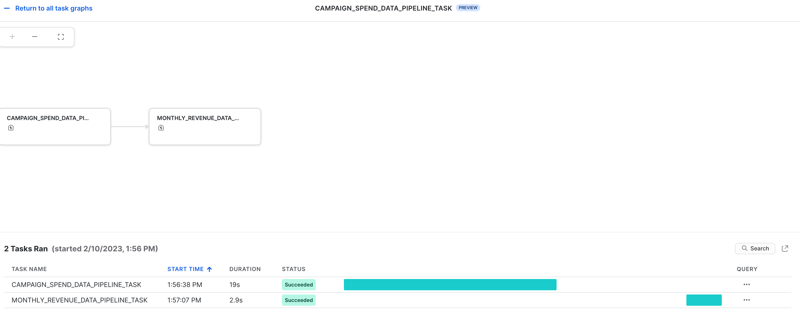
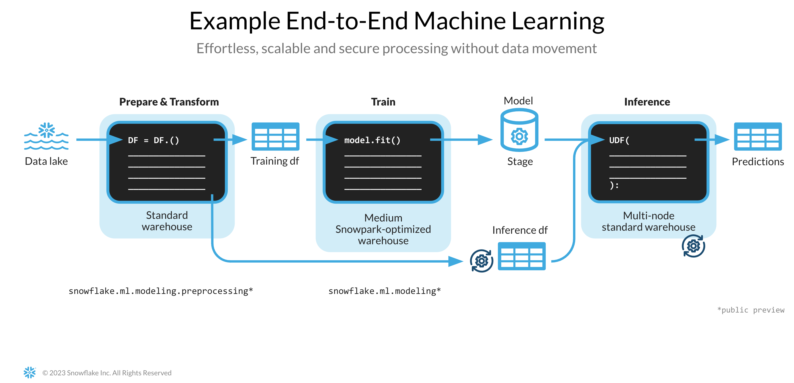
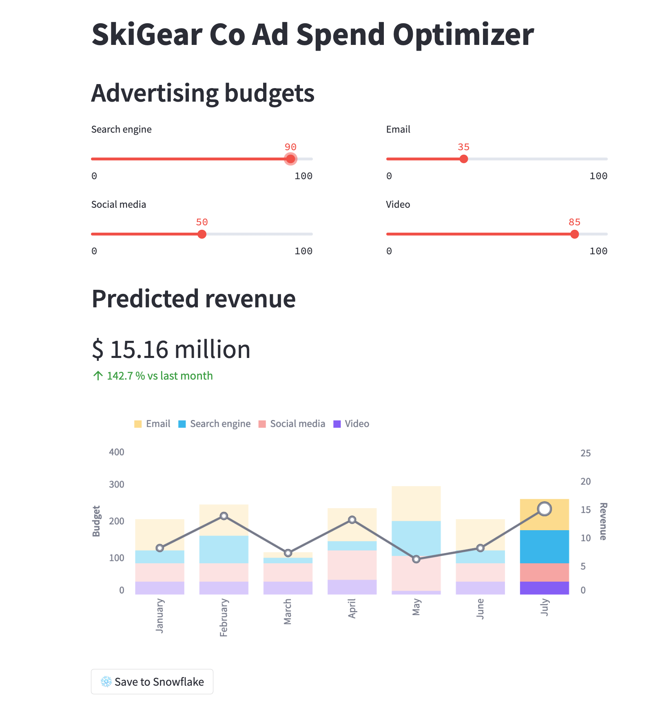
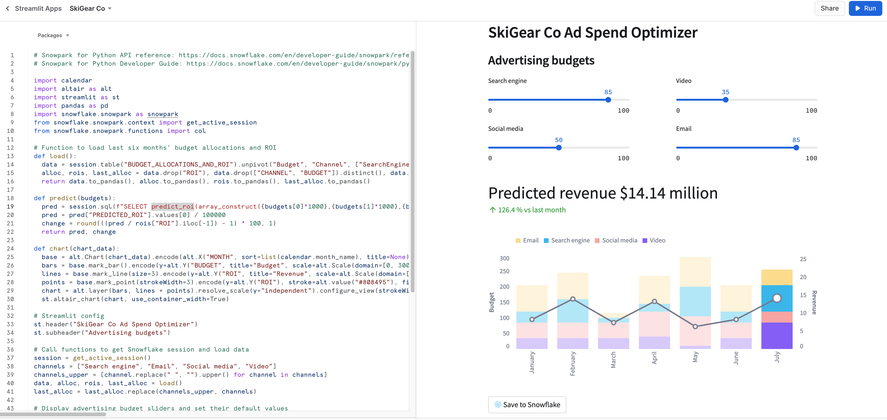

id: getting_started_with_dataengineering_ml_using_snowpark_python_es
summary: Introducción a la ingeniería de datos y al ML con Snowpark para Python 
categories: featured,getting-started,data-science-&-ml,data-engineering,app-development
environments: web
status: Published
feedback link: https://github.com/Snowflake-Labs/sfguides/issues
tags: Getting Started, Snowpark Python, Streamlit, scikit-learn, Data Engineering, Machine Learning, introducción, Snowpark para Python, ingeniería de datos, aprendizaje automático, es
authors: Dash Desai

# Introducción a la ingeniería de datos y al ML con Snowpark para Python
<!-- ------------------------ -->
## Descripción general

Duration: 5

Tras completar esta guía, serás capaz de pasar de datos sin procesar a una aplicación interactiva que podrá ayudar a tu organización a optimizar la asignación de presupuestos de publicidad.

A continuación, encontrarás un resumen de lo que podrás aprender en cada paso siguiendo esta quickstart guide:

- **Configuración del entorno**: usa las fases y las tablas para la ingesta de datos sin procesar de S3 en Snowflake y su organización.
- **Ingeniería de datos**: aprovecha DataFrames de Snowpark para Python para realizar transformaciones de datos como, por ejemplo, agruparlos, agregarlos, dinamizarlos y unirlos. Así, prepararás los datos para las aplicaciones downstream.
- **Flujos de datos**: utiliza Snowflake Tasks para convertir el código de los flujos de datos en flujos operativos con supervisión integrada.  
- **Aprendizaje automático**: prepara los datos y entrena los modelos de aprendizaje automático (machine learning, ML) en Snowflake con Snowpark ML e implementa el modelo como una función definida por el usuario (user-defined-function, UDF) de Snowpark.
- **Aplicación de Streamlit**: crea una aplicación interactiva usando Python (sin necesidad de tener experiencia en desarrollo web) para visualizar el retorno de la inversión (ROI) de diferentes presupuestos de gasto en publicidad.

En caso de que algunas de las tecnologías mencionadas anteriormente sean nuevas para ti, hemos preparado un breve resumen con enlaces a la documentación.

### ¿Qué es Snowpark?

El conjunto de bibliotecas y tiempos de ejecución de Snowflake para implementar y procesar de forma segura código que no sea SQL, como Python, Java o Scala.

**Bibliotecas conocidas del cliente**: Snowpark ofrece una programación completamente integrada de estilo DataFrame y API compatibles con OSS para los lenguajes que los profesionales de los datos prefieran. También incluye la Snowpark ML API para conseguir un modelado de ML (en vista previa pública) y unas operaciones de ML (en vista previa privada) más eficientes.

**Estructuras de tiempo de ejecución flexibles**: Snowpark proporciona constructos de tiempo de ejecución flexibles que permiten a los usuarios introducir y ejecutar la lógica personalizada. Los desarrolladores pueden crear flujos de datos, modelos de ML y aplicaciones de datos sin problemas gracias a las UDF y mediante procedimientos almacenados.

Obtén más información sobre [Snowpark](https://www.snowflake.com/es/data-cloud/snowpark/).


### ¿Qué es Snowpark ML?

Snowpark ML es una nueva biblioteca para lograr un desarrollo integral más rápido e intuitivo de ML en Snowflake. Snowpark ML tiene 2 API: Snowpark ML Modeling (en vista previa pública) para desarrollar modelos y Snowpark ML Operations (en vista previa privada) para implementarlos.

Esta quickstart guide se centrará en la Snowpark ML Modeling API, que escala horizontalmente la ingeniería de funciones y simplifica la ejecución del entrenamiento de ML en Snowflake.

### ¿Qué es Streamlit?

Streamlit es un marco de aplicación de lenguaje Python puro [de código abierto](https://github.com/streamlit/streamlit) que permite a los desarrolladores escribir, compartir e implementar aplicaciones de datos de forma rápida y sencilla. Más información sobre [Streamlit](https://streamlit.io/).

### Descubrirás

- cómo analizar datos y realizar tareas de ingeniería de datos utilizando DataFrames y las API de Snowpark;
- cómo utilizar bibliotecas de Python de código abierto del canal curado de Snowflake Anaconda;
- cómo entrenar modelos de ML con Snowpark ML en Snowflake;
- cómo crear UDF escalares y vectorizadas de Snowpark para Python para la inferencia en línea y sin conexión, respectivamente;
- cómo crear Snowflake Tasks para automatizar flujos de datos; y
- cómo crear una aplicación web con Streamlit que use UDF escalares para la inferencia en función de lo que introduzca el usuario.

### Requisitos previos

- [Git](https://git-scm.com/book/es/v2/Inicio---Sobre-el-Control-de-Versiones-Instalaci%C3%B3n-de-Git) debe estar instalado.
- [Python 3.9](https://www.python.org/downloads/) debe estar instalado.
  - Ten en cuenta que vas a crear un entorno Python con la versión 3.9 en el paso **Introducción**.
- Debes disponer de una cuenta de Snowflake con [paquetes de Anaconda habilitados por ORGADMIN](https://docs.snowflake.com/en/developer-guide/udf/python/udf-python-packages.html#using-third-party-packages-from-anaconda). Si no tienes una, puedes registrarte para obtener una [cuenta de prueba gratuita](https://signup.snowflake.com/).
- Debes iniciar sesión en una cuenta de Snowflake con rol ACCOUNTADMIN. Si tienes este rol en tu entorno, selecciónalo para usarlo. En el caso contrario, deberás: 1) registrarte para obtener una prueba gratuita; 2) utilizar un rol diferente que permita crear bases de datos, esquemas, tablas, fases, tareas, funciones definidas por el usuario y procedimientos almacenados, o 3) utilizar una base de datos y un esquema existentes en los que puedas crear los objetos mencionados.

> aside positive IMPORTANTE: Antes de comenzar, asegúrate de tener una cuenta de Snowflake con paquetes de Anaconda habilitados por ORGADMIN, tal y como se describe [aquí](https://docs.snowflake.com/en/developer-guide/udf/python/udf-python-packages#getting-started).

<!-- ------------------------ -->
## Configuración del entorno

Duration: 15

### Creación de tablas, carga de datos y configuración de fases

Inicia sesión en [Snowsight](https://docs.snowflake.com/en/user-guide/ui-snowsight.html#) con tus credenciales para crear tablas, cargar datos de Amazon S3 y configurar las fases internas de Snowflake.

> aside positive IMPORTANTE:
>
> - Si utilizas nombres diferentes para los objetos creados en esta sección, asegúrate de adaptar las secuencias de comandos y el código de las siguientes secciones en consecuencia.
>
> - Para cada bloque de secuencias de comandos de SQL que se muestra a continuación, selecciona todas las sentencias del bloque y ejecútalas de arriba a abajo.

Ejecuta los siguientes comandos SQL para crear el [almacén](https://docs.snowflake.com/en/sql-reference/sql/create-warehouse.html), la [base de datos](https://docs.snowflake.com/en/sql-reference/sql/create-database.html) y el [esquema](https://docs.snowflake.com/en/sql-reference/sql/create-schema.html).

```sql 
USE ROLE ACCOUNTADMIN;

CREATE OR REPLACE WAREHOUSE DASH_L; 
CREATE OR REPLACE DATABASE DASH_DB; 
CREATE OR REPLACE SCHEMA DASH_SCHEMA;

USE DASH_DB.DASH_SCHEMA; 
```

Ejecuta los siguientes comandos SQL para crear la tabla **CAMPAIGN_SPEND** con datos alojados en un cubo de S3 de acceso público.

```sql 
CREATE or REPLACE file format csvformat 
  skip_header = 1 
  type = 'CSV';

CREATE or REPLACE stage campaign_data_stage 
  file_format = csvformat 
  url = 's3://sfquickstarts/ad-spend-roi-snowpark-python-scikit-learn-streamlit/campaign_spend/';

CREATE or REPLACE TABLE CAMPAIGN_SPEND ( 
  CAMPAIGN VARCHAR(60), 
  CHANNEL VARCHAR(60), 
  DATE DATE, 
  TOTAL_CLICKS NUMBER(38,0), 
  TOTAL_COST NUMBER(38,0), 
  ADS_SERVED NUMBER(38,0) 
);

COPY into CAMPAIGN_SPEND 
  from @campaign_data_stage; 
```

Ejecuta los siguientes comandos SQL para crear la tabla **MONTHLY_REVENUE** con datos alojados en un cubo de S3 de acceso público.

```sql 
CREATE or REPLACE stage monthly_revenue_data_stage 
  file_format = csvformat 
  url = 's3://sfquickstarts/ad-spend-roi-snowpark-python-scikit-learn-streamlit/monthly_revenue/';

CREATE or REPLACE TABLE MONTHLY_REVENUE ( 
  YEAR NUMBER(38,0), 
  MONTH NUMBER(38,0), 
  REVENUE FLOAT 
);

COPY into MONTHLY_REVENUE 
  from @monthly_revenue_data_stage; 
```

Ejecuta los siguientes comandos SQL para crear la tabla **BUDGET_ALLOCATIONS_AND_ROI**, que aloja las asignaciones de presupuesto y ROI de los últimos seis meses.

```sql 
CREATE or REPLACE TABLE BUDGET_ALLOCATIONS_AND_ROI ( 
  MONTH varchar(30), 
  SEARCHENGINE integer, 
  SOCIALMEDIA integer, 
  VIDEO integer, 
  EMAIL integer, 
  ROI float 
)
COMMENT = '{"origin":"sf_sit-is", "name":"aiml_notebooks_ad_spend_roi", "version":{"major":1, "minor":0}, "attributes":{"is_quickstart":1, "source":"streamlit"}}';

INSERT INTO BUDGET_ALLOCATIONS_AND_ROI (MONTH, SEARCHENGINE, SOCIALMEDIA, VIDEO, EMAIL, ROI) VALUES 
('January',35,50,35,85,8.22), 
('February',75,50,35,85,13.90), 
('March',15,50,35,15,7.34), 
('April',25,80,40,90,13.23), 
('May',95,95,10,95,6.246), 
('June',35,50,35,85,8.22); 
```

Ejecuta los siguientes comandos para crear [fases internas](https://docs.snowflake.com/en/user-guide/data-load-local-file-system-create-stage) de Snowflake y almacenar procedimientos almacenados, UDF y archivos de modelos de ML.

```sql
CREATE OR REPLACE STAGE dash_sprocs;
CREATE OR REPLACE STAGE dash_models;
CREATE OR REPLACE STAGE dash_udfs;
```

De manera opcional, también puedes abrir [setup.sql](https://github.com/Snowflake-Labs/sfguide-ad-spend-roi-snowpark-python-streamlit-scikit-learn/blob/main/setup.sql) en Snowsight y ejecutar todas las sentencias de SQL para crear los objetos y cargar los datos de AWS S3.

> aside positive IMPORTANTE: Si utilizas nombres diferentes para los objetos creados en esta sección, asegúrate de adaptar las secuencias de comandos y el código de las siguientes secciones en consecuencia.

<!-- ------------------------ -->
## Introducción

Duration: 8

Esta sección incluye cómo clonar un repositorio de GitHub y cómo configurar tu entorno de Snowpark para Python.

### Clonación del repositorio de GitHub

El primer paso es clonar el [repositorio de GitHub](https://github.com/Snowflake-Labs/sfguide-ad-spend-roi-snowpark-python-streamlit-scikit-learn), que contiene todo el código que necesitarás para completar esta quickstart guide.

Con HTTPS:

```shell
git clone https://github.com/Snowflake-Labs/sfguide-getting-started-dataengineering-ml-snowpark-python.git
```

O con SSH:

```shell
git clone git@github.com:Snowflake-Labs/sfguide-getting-started-dataengineering-ml-snowpark-python.git
```

### Snowpark para Python

Para completar los pasos **Ingeniería de datos** y **Aprendizaje automático**, puedes instalar todo en el entorno local (opción 1) o utilizar Hex (opción 2), tal y como se describe a continuación.

> aside positive IMPORTANTE: Para ejecutar la **aplicación de Streamlit**, tendrás que crear un entorno de Python e instalar Snowpark para Python en el entorno local junto con otras bibliotecas, tal y como se describe en **Instalación local**.

#### Opción 1: Instalación local

Con esta opción podrás completar todos los pasos de la quickstart guide.

**Paso 1:** Descargar e instalar el instalador de Miniconda de [https://conda.io/miniconda.html](https://conda.io/miniconda.html). *(O, si lo prefieres, puedes usar cualquier otro entorno de Python con Python 3.9, como [virtualenv](https://virtualenv.pypa.io/en/latest/))*.

**Paso 2:** Abrir una nueva ventana del terminal y ejecutar los siguientes comandos en ella.

**Paso 3:** Crear un entorno conda de Python 3.9 con el nombre **snowpark-de-ml** mediante la ejecución del siguiente comando en la misma ventana del terminal.

```python
conda create --name snowpark-de-ml -c https://repo.anaconda.com/pkgs/snowflake python=3.9
```

**Paso 4:** Activar el entorno conda **snowpark-de-ml** ejecutando el siguiente comando en la misma ventana del terminal.

```python
conda activate snowpark-de-ml
```

**Paso 5:** Instalar Snowpark para Python junto con las demás librerías en el entorno conda **snowpark-de-ml** del [canal de Snowflake Anaconda](https://repo.anaconda.com/pkgs/snowflake/) ejecutando el siguiente comando en la ventana del terminal.

```python
conda install -c https://repo.anaconda.com/pkgs/snowflake snowflake-snowpark-python pandas notebook scikit-learn cachetools
```

**Paso 6:** Instalar la biblioteca Streamlit en el entorno conda **snowpark-de-ml** ejecutando el siguiente comando en la misma ventana del terminal.

```python
pip install streamlit
```

**Paso 7:** Instalar la biblioteca Snowpark ML en el entorno conda **snowpark-de-ml** ejecutando el siguiente comando en la misma ventana del terminal.

```python
pip install snowflake-ml-python
```

**Paso 9:** Actualizar [connection.json](https://github.com/Snowflake-Labs/sfguide-ml-model-snowpark-python-scikit-learn-streamlit/blob/main/connection.json) con los detalles y las credenciales de tu cuenta de Snowflake.

A continuación, puedes ver un ejemplo de ***connection.json*** basado en los nombres de los objetos mencionados en el paso **Entorno de configuración**.

```json
{
  "account"   : "<your_account_identifier_goes_here>",
  "user"      : "<your_username_goes_here>",
  "password"  : "<your_password_goes_here>",
  "role"      : "ACCOUNTADMIN",
  "warehouse" : "DASH_L",
  "database"  : "DASH_DB",
  "schema"    : "DASH_SCHEMA"
}
```

> aside negative Nota: Para el parámetro **account** que se menciona arriba, especifica tu **identificador de cuenta** y no incluyas el nombre del dominio snowflakecomputing.com. Snowflake lo añade de forma automática al crear la conexión. Para obtener más información al respecto, [consulta la documentación](https://docs.snowflake.com/en/user-guide/admin-account-identifier.html).

#### Opción 2: Hex

Si decides usar tu cuenta de [Hex](https://app.hex.tech/login) o [crear una cuenta de prueba gratuita de 30 días](https://app.hex.tech/signup/quickstart-30), Snowpark para Python está integrado para que no tengas que crear un entorno de Python ni instalarlo localmente en tu equipo junto con el resto de las bibliotecas. De esta forma, podrás completar los pasos **Ingeniería de datos** y **Aprendizaje automático** de esta quickstart guide directamente en Hex. (Consulta los pasos correspondientes para obtener más información sobre cómo cargar los cuadernos de ingeniería de datos y ML en Hex).

> aside positive IMPORTANTE: Para ejecutar la **aplicación de Streamlit**, tendrás que crear un entorno Python e instalar Snowpark para Python en el entorno local junto con otras bibliotecas, tal y como se ha descrito en **Instalación local**.

<!-- ------------------------ -->
## Ingeniería de datos

Duration: 20

Encontrarás a continuación el enlace a este cuaderno que incluye las siguientes tareas de ingeniería de datos:

1) Establecer una conexión segura entre Snowpark para Python y Snowflake. 
2) Cargar datos de tablas de Snowflake en DataFrames de Snowpark. 
3) Realizar análisis de datos de exploración en DataFrames de Snowpark. 
4) Dinamizar y unir datos de varias tablas con DataFrames de Snowpark. 
5) Automatizar tareas de flujos de datos con Snowflake Tasks.

### Cuaderno de ingeniería de datos en Jupyter o en Visual Studio Code

Para comenzar, sigue estos pasos:

1) En una ventana del terminal, navega hasta esta carpeta y ejecuta `jupyter notebook` en la línea de comandos. (También puedes usar otras herramientas y entornos de desarrollo integrado[integrated development environment, IDE] como Visual Studio Code).

2) Abre y ejecuta las celdas de [Snowpark_For_Python_DE.ipynb](https://github.com/Snowflake-Labs/sfguide-ad-spend-roi-snowpark-python-streamlit-scikit-learn/blob/main/Snowpark_For_Python_DE.ipynb)

> aside positive IMPORTANTE: Asegúrate de que el kernel (de Python) del cuaderno de Jupyter está configurado como ***snowpark-de-ml***, es decir, con el mismo nombre del entorno creado en el paso **Clonación del repositorio de GitHub**.

### Cuaderno de ingeniería de datos en Hex

Si decides usar tu cuenta de [Hex](https://app.hex.tech/login) o [crear una cuenta de prueba gratuita de 30 días](https://app.hex.tech/signup/quickstart-30), sigue estos pasos para cargar el cuaderno y crear una conexión de datos con el fin de conectarte a Snowflake desde Hex.

1) Importa [Snowpark_For_Python_DE.ipynb](https://github.com/Snowflake-Labs/sfguide-ad-spend-roi-snowpark-python-streamlit-scikit-learn/blob/main/Snowpark_For_Python_DE.ipynb) como un proyecto en tu cuenta. Para obtener más información sobre la importación, consulta la [documentación](https://learn.hex.tech/docs/versioning/import-export).

2) A continuación, en lugar de usar [connection.json](https://github.com/Snowflake-Labs/sfguide-ml-model-snowpark-python-scikit-learn-streamlit/blob/main/connection.json) para conectarte a Snowflake, crea una [conexión de datos](https://learn.hex.tech/tutorials/connect-to-data/get-your-data#set-up-a-data-connection-to-your-database) y utilízala en el cuaderno de ingeniería de datos tal y como se muestra a continuación:


> aside negative Nota: También puedes crear conexiones de datos compartidos para tus proyectos y usuarios en tu espacio de trabajo. Para obtener más información al respecto, consulta la [documentación](https://learn.hex.tech/docs/administration/workspace_settings/workspace-assets#shared-data-connections).

3) Sustituye el siguiente fragmento de código en el cuaderno

```python
connection_parameters = json.load(open('connection.json'))
session = Session.builder.configs(connection_parameters).create()
```

**por…**

```python
import hextoolkit
hex_snowflake_conn = hextoolkit.get_data_connection('YOUR_DATA_CONNECTION_NAME')
session = hex_snowflake_conn.get_snowpark_session()
session.sql('USE SCHEMA DASH_SCHEMA').collect()
```

<!-- ------------------------ -->
## Flujos de datos

También puedes hacer que las transformaciones de datos estén operativas en forma de flujos de datos automatizados que se ejecutan en Snowflake.

En concreto, en el [cuaderno de ingeniería de datos](https://github.com/Snowflake-Labs/sfguide-ad-spend-roi-snowpark-python-streamlit-scikit-learn/blob/main/Snowpark_For_Python_DE.ipynb), hay una sección en la que se muestra cómo se pueden crear y ejecutar las transformaciones de datos como con [Snowflake Tasks](https://docs.snowflake.com/en/user-guide/tasks-intro).

A modo de referencia, echa un vistazo a los fragmentos de código que se muestran a continuación.

### **Tarea raíz/principal**

Esta tarea automatiza la carga de datos de los gastos de la campaña y la realización de varias transformaciones.

```python 
def campaign_spend_data_pipeline(session: Session) -> str: 
  # DATA TRANSFORMATIONS 
  # Perform the following actions to transform the data

  # Load the campaign spend data 
  snow_df_spend_t = session.table('campaign_spend')

  # Transform the data so we can see total cost per year/month per channel using group_by() and agg() Snowpark DataFrame functions
   snow_df_spend_per_channel_t = snow_df_spend_t.group_by(year('DATE'), month('DATE'),'CHANNEL').agg(sum('TOTAL_COST').as_('TOTAL_COST')).\
      with_column_renamed('"YEAR(DATE)"',"YEAR").with_column_renamed('"MONTH(DATE)"',"MONTH").sort('YEAR','MONTH')

  # Transform the data so that each row will represent total cost across all channels per year/month using pivot() and sum() Snowpark DataFrame functions 
  snow_df_spend_per_month_t = snow_df_spend_per_channel_t.pivot('CHANNEL',['search_engine','social_media','video','email']).sum('TOTAL_COST').sort('YEAR','MONTH') 
  snow_df_spend_per_month_t = snow_df_spend_per_month_t.select( 
      col("YEAR"), 
      col("MONTH"), 
      col("'search_engine'").as_("SEARCH_ENGINE"), 
      col("'social_media'").as_("SOCIAL_MEDIA"), 
      col("'video'").as_("VIDEO"), 
      col("'email'").as_("EMAIL") 
  )

  # Save transformed data 
  snow_df_spend_per_month_t.write.mode('overwrite').save_as_table('SPEND_PER_MONTH')

# Register data pipelining function as a Stored Procedure so it can be run as a task
session.sproc.register( 
  func=campaign_spend_data_pipeline, 
  name="campaign_spend_data_pipeline", 
  packages=['snowflake-snowpark-python'], 
  is_permanent=True, 
  stage_location="@dash_sprocs", 
  replace=True)

campaign_spend_data_pipeline_task = """ 
CREATE OR REPLACE TASK campaign_spend_data_pipeline_task 
    WAREHOUSE = 'DASH_L' 
    SCHEDULE = '3 MINUTE' 
AS 
    CALL campaign_spend_data_pipeline() 
""" 
session.sql(campaign_spend_data_pipeline_task).collect() 
```

### **Tarea secundaria/dependiente**

Esta tarea automatiza la carga de datos de los ingresos mensuales, la realización de varias transformaciones y su unión con los datos de los gastos de la campaña.

```python 
def monthly_revenue_data_pipeline(session: Session) -> str: 
  # Load revenue table and transform the data into revenue per year/month using group_by and agg() functions 
  snow_df_spend_per_month_t = session.table('spend_per_month') 
  snow_df_revenue_t = session.table('monthly_revenue') 
  snow_df_revenue_per_month_t = snow_df_revenue_t.group_by('YEAR','MONTH').agg(sum('REVENUE')).sort('YEAR','MONTH').with_column_renamed('SUM(REVENUE)','REVENUE')

  # Join revenue data with the transformed campaign spend data so that our input features (i.e. cost per channel) and target variable (i.e. revenue) can be loaded into a single table for model training 
  snow_df_spend_and_revenue_per_month_t = snow_df_spend_per_month_t.join(snow_df_revenue_per_month_t, ["YEAR","MONTH"])

  # SAVE in a new table for the next task 
  snow_df_spend_and_revenue_per_month_t.write.mode('overwrite').save_as_table('SPEND_AND_REVENUE_PER_MONTH')

# Register data pipelining function as a Stored Procedure so it can be run as a task
session.sproc.register( 
  func=monthly_revenue_data_pipeline, 
  name="monthly_revenue_data_pipeline", 
  packages=['snowflake-snowpark-python'], 
  is_permanent=True, 
  stage_location="@dash_sprocs", 
  replace=True)

monthly_revenue_data_pipeline_task = """ 
  CREATE OR REPLACE TASK monthly_revenue_data_pipeline_task 
      WAREHOUSE = 'DASH_L' 
      AFTER campaign_spend_data_pipeline_task 
  AS 
      CALL monthly_revenue_data_pipeline() 
  """ 
session.sql(monthly_revenue_data_pipeline_task).collect() 
```

> aside negative Nota: Observa arriba, en ***monthly_revenue_data_pipeline_task***, que la cláusula **AFTER campaign_spend_data_pipeline_task** hace que sea una tarea dependiente.

#### Inicio de Tasks

Snowflake Tasks no se inicia por defecto. Debes ejecutar la siguiente sentencia para iniciar la función o reanudarla.

```sql
session.sql("alter task monthly_revenue_data_pipeline_task resume").collect()
session.sql("alter task campaign_spend_data_pipeline_task resume").collect()
```

#### Suspender tareas

Si reanudas las tareas anteriores, suspéndelas para evitar que se usen recursos innecesariamente. Para ello, ejecuta los siguientes comandos.

```sql
session.sql("alter task campaign_spend_data_pipeline_task suspend").collect()
session.sql("alter task monthly_revenue_data_pipeline_task suspend").collect()
```

### Observabilidad de tareas

Estas tareas y sus [grafos acíclicos dirigidos (directed acyclic graphs, DAG)](https://docs.snowflake.com/en/user-guide/tasks-intro#label-task-dag) se pueden ver en [Snowsight](https://docs.snowflake.com/en/user-guide/ui-snowsight-tasks#viewing-individual-task-graphs), como se muestra a continuación.

---



---

### Notificaciones de error de las tareas

También puedes habilitar el envío de notificaciones push a un servicio de mensajería en la nube cuando se produzca algún error en la ejecución de las tareas. Para obtener más información, consulta la [documentación](https://docs.snowflake.com/en/user-guide/tasks-errors).

<!-- ------------------------ -->
## Aprendizaje automático

Duration: 20

> aside negative SE REQUIERE haber completado correctamente los pasos de ingeniería de datos que se describen en [Snowpark_For_Python_DE.ipynb](https://github.com/Snowflake-Labs/sfguide-ad-spend-roi-snowpark-python-streamlit-scikit-learn/blob/main/Snowpark_For_Python_DE.ipynb).

En el enlace del cuaderno que encontrarás a continuación incluye las siguientes tareas de aprendizaje automático:

1) Establecer una conexión segura entre Snowpark para Python y Snowflake. 
2) Cargar funciones y destinos de Snowflake en DataFrames de Snowpark. 
3) Preparar las funciones para el entrenamiento de modelos. 
4) Entrenar modelos de ML con Snowpark ML en Snowflake. 
5) Crear [ UDF](https://docs.snowflake.com/en/developer-guide/snowpark/python/creating-udfs) escalares y vectorizadas (por lotes) de Python para inferir nuevos puntos de datos tanto en línea como sin conexión, respectivamente.

---



---

### Cuaderno de aprendizaje automático en Jupyter o Visual Studio Code

Para comenzar, sigue estos pasos:

1) En una ventana del terminal, navega hasta esta carpeta y ejecuta `jupyter notebook` en la línea de comandos. (También puedes usar otras herramientas e IDE como Visual Studio Code).

2) Abre y ejecuta[Snowpark_For_Python_ML.ipynb](https://github.com/Snowflake-Labs/sfguide-ad-spend-roi-snowpark-python-streamlit-scikit-learn/blob/main/Snowpark_For_Python_ML.ipynb)

> aside positive IMPORTANTE: Asegúrate de que el kernel (de Python) del cuaderno de Jupyter está configurado como ***snowpark-de-ml***, es decir, con el mismo nombre del entorno creado en el paso **Clonación del repositorio de GitHub**.

### Cuaderno de aprendizaje automático en Hex

Si decides usar tu cuenta de [Hex](https://app.hex.tech/login) o [crear una cuenta de prueba gratuita de 30 días](https://app.hex.tech/signup/quickstart-30), sigue estos pasos para cargar el cuaderno y crear una conexión de datos con el fin de conectarte a Snowflake desde Hex.

1) Importa [Snowpark_For_Python_ML.ipynb](https://github.com/Snowflake-Labs/sfguide-ad-spend-roi-snowpark-python-streamlit-scikit-learn/blob/main/Snowpark_For_Python_ML.ipynb) como un proyecto en tu cuenta. Para obtener más información sobre la importación, consulta la [documentación](https://learn.hex.tech/docs/versioning/import-export).

2) A continuación, en lugar de usar [connection.json](https://github.com/Snowflake-Labs/sfguide-ml-model-snowpark-python-scikit-learn-streamlit/blob/main/connection.json) para conectarte a Snowflake, crea una [conexión de datos](https://learn.hex.tech/tutorials/connect-to-data/get-your-data#set-up-a-data-connection-to-your-database) y utilízala en el cuaderno de aprendizaje automático tal y como se muestra a continuación:


> aside negative Nota: También puedes crear conexiones de datos compartidos para tus proyectos y usuarios en tu espacio de trabajo. Para obtener más información al respecto, consulta la [documentación](https://learn.hex.tech/docs/administration/workspace_settings/workspace-assets#shared-data-connections).

3) Sustituye el siguiente fragmento de código en el cuaderno

```python
connection_parameters = json.load(open('connection.json'))
session = Session.builder.configs(connection_parameters).create()
```

**por…**

```python
import hextoolkit
hex_snowflake_conn = hextoolkit.get_data_connection('YOUR_DATA_CONNECTION_NAME')
session = hex_snowflake_conn.get_snowpark_session()
session.sql('USE SCHEMA DASH_SCHEMA').collect()
```

<!-- ------------------------ -->
## Aplicación de Streamlit

Duration: 10

### Ejecución de la aplicación de Streamlit en el entorno local

En una ventana del terminal, ve a esta carpeta y ejecuta el siguiente comando para ejecutar la aplicación de Streamlit [Snowpark_Streamlit_Revenue_Prediction.py](https://github.com/Snowflake-Labs/sfguide-ad-spend-roi-snowpark-python-streamlit-scikit-learn/blob/main/Snowpark_Streamlit_Revenue_Prediction.py) localmente en tu ordenador.

```shell
streamlit run Snowpark_Streamlit_Revenue_Prediction.py
```

Si todo ha salido bien, deberías ver cómo se abre una ventana del navegador con la aplicación ya cargada, tal y como se muestra a continuación.

---



---

### Ejecución de la aplicación de Streamlit en Snowflake: Streamlit en Snowflake

Si has habilitado Streamlit en Snowflake (Streamlit-in-Snowflake, SiS) en tu cuenta, sigue estos pasos para ejecutar la aplicación en Snowsight en lugar de localmente en tu ordenador.

> aside negative IMPORTANTE: SiS se encuentra en vista previa privada a fecha de junio de 2023.***

  1) Haz clic en **Streamlit Apps** en el menú de navegación de la izquierda. 
  2) Haz clic en **+ Streamlit App** en la parte superior derecha. 
  3) Introduce el nombre de la aplicación en **App name**. 
  4) Selecciona **Warehouse** y **App location** (base de datos y esquema) donde desees crear la aplicación de Streamlit. 
  5) Haz clic en **Create**. 
  6) Llegado a este punto, se te proporcionará el código para crear una aplicación de Streamlit de ejemplo. Abre [Snowpark_Streamlit_Revenue_Prediction_SiS.py](https://github.com/Snowflake-Labs/sfguide-ad-spend-roi-snowpark-python-streamlit-scikit-learn/blob/main/Snowpark_Streamlit_Revenue_Prediction_SiS.py) y copia el código. Pégalo a continuación en la aplicación de Streamlit de ejemplo. 
  7) Haz clic en **Run** en la parte superior derecha para ejecutar la aplicación.

Si todo ha salido bien, deberías ver la aplicación en Snowsight, tal y como se muestra a continuación.

---



---

### Guardar datos en Snowflake

Ajusta el control deslizante del presupuesto de publicidad en las dos aplicaciones para ver el ROI previsto para esas asignaciones. También puedes hacer clic en el botón **Save to Snowflake** para guardar las asignaciones de ROI actuales y previstas en la tabla de Snowflake BUDGET_ALLOCATIONS_AND_ROI.

### Diferencias entre las dos aplicaciones de Streamlit

La principal diferencia entre la ejecución de la aplicación de Streamlit en un entorno local y en Snowflake (SiS) es la manera en la que se crea y se accede al objeto de sesión.

Al ejecutarla en un entorno local, se crearía y se accedería al nuevo objeto de sesión de la siguiente manera:

```python
# Function to create Snowflake Session to connect to Snowflake
def create_session(): 
    if "snowpark_session" not in st.session_state: 
        session = Session.builder.configs(json.load(open("connection.json"))).create() 
        st.session_state['snowpark_session'] = session 
    else: 
        session = st.session_state['snowpark_session'] 
    return session 
```

Al ejecutarla en Snowflake (SiS), se crearía el acceso al objeto de sesión actual de la siguiente manera:

```python
session = snowpark.session._get_active_session()
```

<!-- ------------------------ -->
## Limpieza

Si has empezado o reanudado las tareas `monthly_revenue_data_pipeline_task` y `campaign_spend_data_pipeline_task` como parte de las secciones **Ingeniería de datos** o **Flujos de datos**, es importante que ejecutes los siguientes comandos para suspender las tareas y, así, evitar que se usen recursos innecesariamente.

En el cuaderno con la Snowpark Python API

```sql
session.sql("alter task campaign_spend_data_pipeline_task suspend").collect()
session.sql("alter task monthly_revenue_data_pipeline_task suspend").collect()
```

En Snowsight

```sql
alter task campaign_spend_data_pipeline_task suspend;
alter task monthly_revenue_data_pipeline_task suspend;
```

<!-- ------------------------ -->
## Conclusiones y recursos

Duration: 3

¡Enhorabuena! Has realizado las tareas de ingeniería de datos y entrenado un modelo de regresión lineal para predecir el futuro ROI de los presupuestos de gasto en publicidad variable en varios canales, como búsqueda, vídeo, redes sociales y correo electrónico con Snowpark para Python y scikit-learn. Además, has creado una aplicación de Streamlit que utiliza ese modelo para generar predicciones en nuevas asignaciones de presupuesto en función de lo que introduzca el usuario.

Nos encantaría conocer tu opinión sobre esta quickstart guide. Puedes enviárnosla a través de este [formulario](https://forms.gle/XKd8rXPUNs2G1yM28).

### Qué has aprendido

- cómo analizar datos y realizar tareas de ingeniería de datos utilizando DataFrames y las API de Snowpark;
- cómo utilizar bibliotecas de Python de código abierto del canal curado de Snowflake Anaconda;
- cómo entrenar modelos de ML con Snowpark ML en Snowflake;
- cómo crear UDF escalares y vectorizadas de Snowpark para Python para la inferencia en línea y sin conexión, respectivamente;
- Cómo crear tareas de Snowflake Tasks para automatizar flujos de datos y (re)entrenar el modelo
- Cómo crear una aplicación web de Streamlit que utiliza UDF escalares para la inferencia

### Recursos relacionados

- [Código fuente en GitHub](https://github.com/Snowflake-Labs/sfguide-ad-spend-roi-snowpark-python-streamlit-scikit-learn)
- [Avanzado: Guía de ingeniería de datos de Snowpark para Python](https://quickstarts.snowflake.com/guide/data_engineering_pipelines_with_snowpark_python/index.html)
- [Avanzado: Guía de ML de Snowpark para Python](https://quickstarts.snowflake.com/guide/getting_started_snowpark_machine_learning/index.html)
- [Demos de Snowpark para Python](https://github.com/Snowflake-Labs/snowpark-python-demos/blob/main/README.md)
- [Guía de Snowpark para Python para desarrolladores](https://docs.snowflake.com/en/developer-guide/snowpark/python/index.html)
- [Streamlit Docs](https://docs.streamlit.io/)
