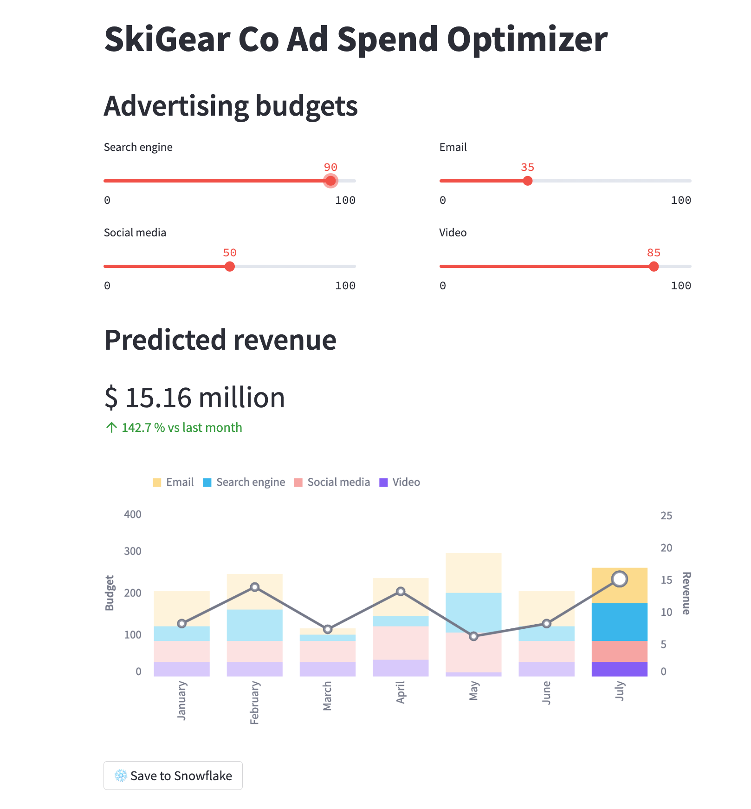

id: getting_started_with_dataengineering_ml_using_snowpark_python_it
summary: Getting Started with Data Engineering and ML using Snowpark for Python
categories: featured, getting-started, data-science-&-ml, data-engineering, app-development
environments: web
status: Published
feedback link: https://github.com/Snowflake-Labs/sfguides/issues
tags: Getting Started, Snowpark Python, Streamlit, scikit-learn, Data Engineering, Machine Learning, it  
authors: Dash Desai

# Guida introduttiva al data engineering e al machine learning con Snowpark per Python
<!-- ------------------------ -->
## Panoramica

Duration: 5

Dopo avere completato questa guida, sarai in grado di trasformare i dati grezzi in un’applicazione interattiva che può aiutare le organizzazioni a ottimizzare l’allocazione del loro budget pubblicitario.

Ecco un riepilogo di ciò che imparerai in ogni passaggio di questo quickstart:

- **Configurazione dell’ambiente**: utilizzare stage e tabelle per caricare e organizzare dati grezzi da S3 in Snowflake
- **Data engineering**: utilizzare i DataFrame di Snowpark per Python per eseguire trasformazioni dei dati come raggruppamento, aggregazione, pivot e join per preparare i dati per le applicazioni a valle.
- **Pipeline di dati**: utilizzare task di Snowflake per trasformare il codice delle pipeline di dati in pipeline operative con monitoraggio integrato.  
- **Machine Learning**: preparare i dati ed eseguire l’addestramento ML in Snowflake utilizzando Snowpark ML e distribuire il modello come Snowpark User Defined Function (UDF).
- **Applicazione Streamlit**: creare un’applicazione interattiva utilizzando Python (non richiede esperienza di sviluppo web) per aiutare a visualizzare il ROI di diversi budget per le spese pubblicitarie.

Se non hai familiarità con alcune delle tecnologie citate sopra, ecco un breve riepilogo con link alla documentazione.

### Che cos’è Snowpark?

Il set di librerie e runtime in Snowflake che consente di distribuire ed elaborare in modo sicuro codice non SQL, ad esempio Python, Java e Scala.

**Librerie lato client conosciute**: Snowpark consente agli esperti di dati di utilizzare i loro linguaggi preferiti con una programmazione profondamente integrata in stile DataFrame e API compatibili con OSS. Inoltre include la Snowpark ML API per eseguire in modo più efficiente modellazione ML (public preview) e operazioni ML (private preview).

**Costrutti runtime flessibili**: Snowpark fornisce costrutti runtime flessibili che consentono agli utenti di inserire ed eseguire logica personalizzata. Gli sviluppatori possono creare in modo fluido pipeline di dati, modelli ML e applicazioni basate sui dati utilizzando User Defined Function e stored procedure.

Scopri di più su [Snowpark](https://www.snowflake.com/snowpark/).


### Che cos’è Snowpark ML?

Snowpark ML è una nuova libreria che consente uno sviluppo ML end-to-end più rapido e intuitivo in Snowflake. Snowpark ML ha 2 API: Snowpark ML Modeling (in public preview) per lo sviluppo dei modelli e Snowpark ML Operations (in private preview) per la distribuzione dei modelli.

Questo quickstart si concentra sulla Snowpark ML Modeling API, che scala orizzontalmente il feature engineering e semplifica l’addestramento ML in Snowflake.

### Che cos’è Streamlit?

Streamlit è un framework per app [open source](https://github.com/streamlit/streamlit) basato su Python che consente agli sviluppatori di scrivere, condividere e distribuire applicazioni basate sui dati in modo rapido e semplice. Scopri di più su [Streamlit](https://streamlit.io/).

### Cosa imparerai

- Come analizzare i dati ed eseguire task di data engineering utilizzando DataFrame e API di Snowpark
- Come utilizzare le librerie Python open source del canale curato Snowflake Anaconda
- Come addestrare un modello ML utilizzando Snowpark ML in Snowflake
- Come creare Snowpark Python User Defined Function (UDF) scalari e vettorizzate, rispettivamente per l’inferenza online e offline
- Come creare task Snowflake per automatizzare le pipeline di dati
- Come creare un’applicazione web Streamlit che utilizza l’UDF scalare per l’inferenza in base all’input dell’utente

### Prerequisiti

- [Git](https://git-scm.com/book/en/v2/Getting-Started-Installing-Git) installato
- [Python 3.9](https://www.python.org/downloads/) installato
  - Nota che creerai un ambiente Python con la versione 3.9 nel passaggio **Operazioni iniziali**
- Account Snowflake con i [pacchetti Anaconda abilitati da ORGADMIN](https://docs.snowflake.com/en/developer-guide/udf/python/udf-python-packages.html#using-third-party-packages-from-anaconda). Se non hai un account Snowflake, puoi registrarti per una [prova gratuita](https://signup.snowflake.com/).
- Un login per l’account Snowflake con il ruolo ACCOUNTADMIN. Se hai questo ruolo nel tuo ambiente, puoi scegliere di utilizzarlo. In caso contrario, dovrai 1) registrarti per una prova gratuita, 2) utilizzare un ruolo diverso con la capacità di creare database, schemi, tabelle, stage, task, User Defined Function e stored procedure, oppure 3) usare un database e uno schema esistenti in cui puoi creare gli oggetti elencati.

> aside positive 
IMPORTANTE: prima di procedere, assicurati di avere un account Snowflake con i pacchetti Anaconda abilitati da ORGADMIN, come descritto [qui](https://docs.snowflake.com/en/developer-guide/udf/python/udf-python-packages#getting-started).

<!-- ------------------------ -->
## Configurazione dell’ambiente

Duration: 15

### Creare tabelle, caricare dati e configurare stage

Effettua l’accesso a [Snowsight](https://docs.snowflake.com/en/user-guide/ui-snowsight.html#) utilizzando le tue credenziali per creare tabelle, caricare dati da Amazon S3 e configurare gli stage interni di Snowflake.

> aside positive 
IMPORTANTE:
>
> - se utilizzi nomi diversi per gli oggetti creati in questa sezione, assicurati di aggiornare come necessario gli script e il codice nelle seguenti sezioni.
>
> - Per ogni blocco di script SQL riportato sotto, seleziona tutte le istruzioni del blocco ed eseguile dall’inizio alla fine.

Esegui questi comandi SQL per creare il [warehouse](https://docs.snowflake.com/en/sql-reference/sql/create-warehouse.html), il [database](https://docs.snowflake.com/en/sql-reference/sql/create-database.html) e lo [schema](https://docs.snowflake.com/en/sql-reference/sql/create-schema.html).

```sql 
USE ROLE ACCOUNTADMIN;

CREATE OR REPLACE WAREHOUSE DASH_L; 
CREATE OR REPLACE DATABASE DASH_DB; 
CREATE OR REPLACE SCHEMA DASH_SCHEMA;

USE DASH_DB.DASH_SCHEMA; 
```

Esegui questi comandi SQL per creare la tabella **CAMPAIGN_SPEND** dai dati archiviati nel bucket S3 pubblicamente accessibile.

```sql 
CREATE or REPLACE file format csvformat
  skip_header = 1 
  type = 'CSV';

CREATE or REPLACE stage campaign_data_stage
  file_format = csvformat 
  url = 's3://sfquickstarts/ad-spend-roi-snowpark-python-scikit-learn-streamlit/campaign_spend/';

CREATE or REPLACE TABLE CAMPAIGN_SPEND (
  CAMPAIGN VARCHAR(60), 
  CHANNEL VARCHAR(60), 
  DATE DATE, 
  TOTAL_CLICKS NUMBER(38,0), 
  TOTAL_COST NUMBER(38,0), 
  ADS_SERVED NUMBER(38,0) 
);

COPY into CAMPAIGN_SPEND 
  from @campaign_data_stage; 
```

Esegui i seguenti comandi SQL per creare la tabella **MONTHLY_REVENUE** dai dati archiviati nel bucket S3 pubblicamente accessibile.

```sql 
CREATE or REPLACE stage monthly_revenue_data_stage 
  file_format = csvformat 
  url = 's3://sfquickstarts/ad-spend-roi-snowpark-python-scikit-learn-streamlit/monthly_revenue/';

CREATE or REPLACE TABLE MONTHLY_REVENUE ( 
  YEAR NUMBER(38,0), 
  MONTH NUMBER(38,0), 
  REVENUE FLOAT 
);

COPY into MONTHLY_REVENUE 
  from @monthly_revenue_data_stage; 
```

Esegui i seguenti comandi SQL per creare la tabella **BUDGET_ALLOCATIONS_AND_ROI** che contiene le allocazioni del budget e il ROI degli ultimi sei mesi.

```sql 
CREATE or REPLACE TABLE BUDGET_ALLOCATIONS_AND_ROI (
  MONTH varchar(30), 
  SEARCHENGINE integer, 
  SOCIALMEDIA integer, 
  VIDEO integer, 
  EMAIL integer, 
  ROI float 
);

INSERT INTO BUDGET_ALLOCATIONS_AND_ROI (MONTH, SEARCHENGINE, SOCIALMEDIA, VIDEO, EMAIL, ROI) VALUES 
('January',35,50,35,85,8.22), 
('February',75,50,35,85,13.90), 
('March',15,50,35,15,7.34), 
('April',25,80,40,90,13.23), 
('May',95,95,10,95,6.246), 
('June',35,50,35,85,8.22); 
```

Esegui i seguenti comandi per creare [stage interni](https://docs.snowflake.com/en/user-guide/data-load-local-file-system-create-stage) di Snowflake in cui archiviare i file delle stored procedure, delle UDF e dei modelli ML.

```sql
CREATE OR REPLACE STAGE dash_sprocs;
CREATE OR REPLACE STAGE dash_models;
CREATE OR REPLACE STAGE dash_udfs;
```

Facoltativamente, puoi anche aprire [setup.sql](https://github.com/Snowflake-Labs/sfguide-ad-spend-roi-snowpark-python-streamlit-scikit-learn/blob/main/setup.sql) in Snowsight ed eseguire tutte le istruzioni SQL per creare gli oggetti e caricare i dati da AWS S3.

> aside positive 
IMPORTANTE: se utilizzi nomi diversi per gli oggetti creati in questa sezione, assicurati di aggiornare come necessario gli script e il codice nelle seguenti sezioni.

<!-- ------------------------ -->
## Operazioni iniziali

Duration: 8

Questa sezione spiega come clonare il repository GitHub e come configurare il tuo ambiente Snowpark per Python.

### Clonare il repository GitHub

Il primo passaggio è clonare il [repository GitHub](https://github.com/Snowflake-Labs/sfguide-ad-spend-roi-snowpark-python-streamlit-scikit-learn). Questo repository contiene tutto il codice che ti servirà per completare questo quickstart.

Usando HTTPS:

```shell
git clone https://github.com/Snowflake-Labs/sfguide-getting-started-dataengineering-ml-snowpark-python.git
```

OPPURE, usando SSH:

```shell
git clone git@github.com:Snowflake-Labs/sfguide-getting-started-dataengineering-ml-snowpark-python.git
```

### Snowpark per Python

Per completare i passaggi **Data Engineering** e **Machine Learning**, puoi scegliere se installare tutto localmente (opzione 1) oppure utilizzare Hex (opzione 2), come descritto di seguito.

> aside positive 
IMPORTANTE: per eseguire l’**applicazione Streamlit** dovrai creare un ambiente Python e installare localmente Snowpark per Python insieme ad altre librerie, come descritto in **Installazione locale**.

#### Opzione 1: Installazione locale

Questa opzione ti consentirà di eseguire tutti i passaggi di questo quickstart.

**Passaggio 1:** scarica e installa il programma di installazione miniconda da [https://conda.io/miniconda.html](https://conda.io/miniconda.html) *(OPPURE puoi usare qualsiasi altro ambiente Python con Python 3.9, ad esempio [virtualenv](https://virtualenv.pypa.io/en/latest/))*.

**Passaggio 2:** apri una nuova finestra Terminale ed esegui i seguenti comandi nella stessa finestra Terminale.

**Passaggio 3:** crea l’ambiente conda Python 3.9 chiamato **snowpark-de-ml** eseguendo il seguente comando nella stessa finestra Terminale

```python
conda create --name snowpark-de-ml -c https://repo.anaconda.com/pkgs/snowflake python=3.9
```

**Passaggio 4:** attiva l’ambiente conda **snowpark-de-ml** eseguendo il seguente comando nella stessa finestra Terminale

```python
conda activate snowpark-de-ml
```

**Passaggio 5:** installa Snowpark Python e le altre librerie nell’ambiente conda **snowpark-de-ml** dal [canale Snowflake Anaconda](https://repo.anaconda.com/pkgs/snowflake/) eseguendo il seguente comando nella stessa finestra Terminale

```python
conda install -c https://repo.anaconda.com/pkgs/snowflake snowflake-snowpark-python pandas notebook scikit-learn cachetools
```

**Passaggio 6:** installa la libreria Streamlit nell’ambiente conda **snowpark-de-ml** eseguendo il seguente comando nella stessa finestra Terminale

```python
pip install streamlit
```

**Passaggio 7:** installa la libreria Snowpark ML nell’ambiente conda **snowpark-de-ml** eseguendo il seguente comando nella stessa finestra Terminale

```python
pip install snowflake-ml-python
```

**Passaggio 9:** aggiorna [connection.json](https://github.com/Snowflake-Labs/sfguide-ml-model-snowpark-python-scikit-learn-streamlit/blob/main/connection.json) con i dettagli e le credenziali del tuo account Snowflake.

Ecco un esempio di ***connection.json*** basato sui nomi degli oggetti citati nel passaggio **Configurazione dell’ambiente**.

```json
{
  "account"   : "<your_account_identifier_goes_here>",
  "user"      : "<your_username_goes_here>",
  "password"  : "<your_password_goes_here>",
  "role"      : "ACCOUNTADMIN",
  "warehouse" : "DASH_L",
  "database"  : "DASH_DB",
  "schema"    : "DASH_SCHEMA"
}
```

> aside negative
Nota: per i parametri dell’**account** riportati sopra, specifica il tuo **ID account** senza includere il nome di dominio snowflakecomputing.com. Snowflake aggiunge automaticamente questo dominio quando crea la connessione. Per maggiori dettagli, [consulta la documentazione](https://docs.snowflake.com/en/user-guide/admin-account-identifier.html).

#### Opzione 2: Utilizza Hex

Se scegli di utilizzare il tuo account [Hex](https://app.hex.tech/login) esistente o di [creare un account di prova gratuita di 30 giorni](https://app.hex.tech/signup/quickstart-30), Snowpark per Python è integrato, quindi non dovrai creare un ambiente Python e installare localmente Snowpark per Python insieme alle altre librerie sul tuo laptop. Questo ti consentirà di completare i passaggi **Data Engineering** e **Machine Learning** di questo quickstart direttamente in Hex. (Vedi i rispettivi passaggi per i dettagli su come caricare i notebook di data engineering e di machine learning in Hex.)

> aside positive 
IMPORTANTE: per eseguire l’**applicazione Streamlit** dovrai creare un ambiente Python e installare Snowpark per Python insieme ad altre librerie localmente, come descritto sopra in **Installazione locale**.

<!-- ------------------------ -->
## Data Engineering

Duration: 20

Il notebook disponibile al link riportato sotto comprende le seguenti attività di data engineering.

1) Stabilire una connessione sicura da Snowpark Python a Snowflake
2) Caricare dati da tabelle Snowflake in DataFrame Snowpark
3) Eseguire analisi dei dati esplorativa su DataFrame Snowpark
4) Eseguire pivot e join di dati provenienti da più tabelle utilizzando DataFrame Snowpark
5) Automatizzare le attività della pipeline di dati utilizzando task di Snowflake

### Notebook di data engineering in Jupyter o Visual Studio Code

Per iniziare, segui questi passaggi:

1) In una finestra Terminale, spostati in questa cartella ed esegui `jupyter notebook` dalla riga di comando. (Puoi anche utilizzare altri strumenti e IDE, come Visual Studio Code.)

2) Apri ed esegui le celle in [Snowpark_For_Python_DE.ipynb](https://github.com/Snowflake-Labs/sfguide-ad-spend-roi-snowpark-python-streamlit-scikit-learn/blob/main/Snowpark_For_Python_DE.ipynb)

> aside positive 
IMPORTANTE: assicurati che nel notebook Jupyter il kernel (Python) sia impostato su ***snowpark-de-ml***, che è il nome dell’ambiente creato nel passaggio **Clonare il repository GitHub**.

### Notebook di data engineering in Hex

Se scegli di utilizzare il tuo account [Hex](https://app.hex.tech/login) esistente o di [creare un account di prova gratuita di 30 giorni](https://app.hex.tech/signup/quickstart-30), segui questi passaggi per caricare il notebook e creare una connessione dati a Snowflake da Hex.

1) Importa [Snowpark_For_Python_DE.ipynb](https://github.com/Snowflake-Labs/sfguide-ad-spend-roi-snowpark-python-streamlit-scikit-learn/blob/main/Snowpark_For_Python_DE.ipynb) come progetto nel tuo account. Per maggiori informazioni sull’importazione, consulta la [documentazione](https://learn.hex.tech/docs/versioning/import-export).

2) Quindi, invece di utilizzare [connection.json](https://github.com/Snowflake-Labs/sfguide-ml-model-snowpark-python-scikit-learn-streamlit/blob/main/connection.json) per la connessione a Snowflake, crea una [connessione dati](https://learn.hex.tech/tutorials/connect-to-data/get-your-data#set-up-a-data-connection-to-your-database) e utilizzala nel notebook di data engineering, come illustrato di seguito.


> aside negative
Nota: puoi anche creare connessioni dati condivise per i progetti e per gli utenti nella tua area di lavoro. Per maggiori dettagli, consulta la [documentazione](https://learn.hex.tech/docs/administration/workspace_settings/workspace-assets#shared-data-connections).

3) Sostituisci il seguente frammento di codice nel notebook

```python
connection_parameters = json.load(open('connection.json'))
session = Session.builder.configs(connection_parameters).create()
```

**con…**

```python
import hextoolkit
hex_snowflake_conn = hextoolkit.get_data_connection('YOUR_DATA_CONNECTION_NAME')
session = hex_snowflake_conn.get_snowpark_session()
session.sql('USE SCHEMA DASH_SCHEMA').collect()
```

<!-- ------------------------ -->
## Pipeline di dati

Puoi anche implementare le trasformazioni dei dati sotto forma di pipeline di dati automatizzate eseguite in Snowflake.

In particolare, il [notebook di data engineering](https://github.com/Snowflake-Labs/sfguide-ad-spend-roi-snowpark-python-streamlit-scikit-learn/blob/main/Snowpark_For_Python_DE.ipynb) contiene una sezione che dimostra come creare ed eseguire facoltativamente le trasformazioni dei dati come [task di Snowflake](https://docs.snowflake.com/en/user-guide/tasks-intro).

A scopo di riferimento, questi sono i frammenti di codice.

### **Task principale/parent**

Questo task automatizza il caricamento dei dati delle spese per la campagna e l’esecuzione di varie trasformazioni.

```python 
def campaign_spend_data_pipeline(session: Session) -> str: 
  # DATA TRANSFORMATIONS 
  # Perform the following actions to transform the data

  # Load the campaign spend data 
  snow_df_spend_t = session.table('campaign_spend')

  # Transform the data so we can see total cost per year/month per channel using group_by() and agg() Snowpark DataFrame functions 
  snow_df_spend_per_channel_t = snow_df_spend_t.group_by(year('DATE'), month('DATE'),'CHANNEL').agg(sum('TOTAL_COST').as_('TOTAL_COST')).
      with_column_renamed('"YEAR(DATE)"',"YEAR").with_column_renamed('"MONTH(DATE)"',"MONTH").sort('YEAR','MONTH')

  # Transform the data so that each row will represent total cost across all channels per year/month using pivot() and sum() Snowpark DataFrame functions 
  snow_df_spend_per_month_t = snow_df_spend_per_channel_t.pivot('CHANNEL',['search_engine','social_media','video','email']).sum('TOTAL_COST').sort('YEAR','MONTH') 
  snow_df_spend_per_month_t = snow_df_spend_per_month_t.select( 
      col("YEAR"), 
      col("MONTH"), 
      col("'search_engine'").as_("SEARCH_ENGINE"), 
      col("'social_media'").as_("SOCIAL_MEDIA"), 
      col("'video'").as_("VIDEO"), 
      col("'email'").as_("EMAIL") 
  )

  # Save transformed data 
  snow_df_spend_per_month_t.write.mode('overwrite').save_as_table('SPEND_PER_MONTH')

# Register data pipelining function as a Stored Procedure so it can be run as a task
session.sproc.register( 
    func=campaign_spend_data_pipeline, 
    name="campaign_spend_data_pipeline", 
    packages=['snowflake-snowpark-python'], 
    is_permanent=True, 
    stage_location="@dash_sprocs", 
    replace=True)

campaign_spend_data_pipeline_task = """ 
CREATE OR REPLACE TASK campaign_spend_data_pipeline_task 
    WAREHOUSE = 'DASH_L' 
    SCHEDULE = '3 MINUTE' 
AS 
    CALL campaign_spend_data_pipeline() 
""" 
session.sql(campaign_spend_data_pipeline_task).collect() 
```

### **Task secondario/child**

Questo task automatizza il caricamento dei dati dei ricavi mensili, l’esecuzione di varie trasformazioni dei dati e il join di questi dati con i dati di spesa della campagna trasformati.

```python 
def monthly_revenue_data_pipeline(session: Session) -> str: 
  # Load revenue table and transform the data into revenue per year/month using group_by and agg() functions 
  snow_df_spend_per_month_t = session.table('spend_per_month') 
  snow_df_revenue_t = session.table('monthly_revenue') 
  snow_df_revenue_per_month_t = snow_df_revenue_t.group_by('YEAR','MONTH').agg(sum('REVENUE')).sort('YEAR','MONTH').with_column_renamed('SUM(REVENUE)','REVENUE')

  # Join revenue data with the transformed campaign spend data so that our input features (i.e. cost per channel) and target variable (i.e. revenue) can be loaded into a single table for model training 
  snow_df_spend_and_revenue_per_month_t = snow_df_spend_per_month_t.join(snow_df_revenue_per_month_t, ["YEAR","MONTH"])

  # SAVE in a new table for the next task 
  snow_df_spend_and_revenue_per_month_t.write.mode('overwrite').save_as_table('SPEND_AND_REVENUE_PER_MONTH')

# Register data pipelining function as a Stored Procedure so it can be run as a task
session.sproc.register( 
    func=monthly_revenue_data_pipeline, 
    name="monthly_revenue_data_pipeline", 
    packages=['snowflake-snowpark-python'], 
    is_permanent=True, 
    stage_location="@dash_sprocs", 
    replace=True)

monthly_revenue_data_pipeline_task = """ 
  CREATE OR REPLACE TASK monthly_revenue_data_pipeline_task 
      WAREHOUSE = 'DASH_L' 
      AFTER campaign_spend_data_pipeline_task 
  AS 
      CALL monthly_revenue_data_pipeline()
  """ 
session.sql(monthly_revenue_data_pipeline_task).collect() 
```

> aside negative
Nota: nel task ***monthly_revenue_data_pipeline_task*** riportato sopra, nota la clausola **AFTER campaign_spend_data_pipeline_task**, che lo rende un task secondario.

#### Avviare i task

I task di Snowflake non vengono avviati di default, quindi è necessario eseguire la seguente istruzione per avviarli/riprenderli.

```sql
session.sql("alter task monthly_revenue_data_pipeline_task resume").collect()
session.sql("alter task campaign_spend_data_pipeline_task resume").collect()
```

#### Sospendere i task

Se riprendi i task riportati sopra, sospendili per evitare un utilizzo superfluo delle risorse eseguendo i seguenti comandi.

```sql
session.sql("alter task campaign_spend_data_pipeline_task suspend").collect()
session.sql("alter task monthly_revenue_data_pipeline_task suspend").collect()
```

### Osservabilità dei task

Questi task e i relativi [DAG](https://docs.snowflake.com/en/user-guide/tasks-intro#label-task-dag) possono essere visualizzati in [Snowsight](https://docs.snowflake.com/en/user-guide/ui-snowsight-tasks#viewing-individual-task-graphs) come illustrato di seguito.

---


---

### Notifiche di errore per i task

Puoi anche abilitare le notifiche push verso un servizio di messaggistica cloud quando si verificano errori durante l’esecuzione dei task. Per maggiori informazioni, consulta la [documentazione](https://docs.snowflake.com/en/user-guide/tasks-errors).

<!-- ------------------------ -->
## Machine Learning

Duration: 20

> aside negative
PREREQUISITO: completamento dei passaggi di data engineering descritti in [Snowpark_For_Python_DE.ipynb](https://github.com/Snowflake-Labs/sfguide-ad-spend-roi-snowpark-python-streamlit-scikit-learn/blob/main/Snowpark_For_Python_DE.ipynb).

Il notebook disponibile al link qui sotto comprende le seguenti attività di machine learning.

1) Stabilire una connessione sicura da Snowpark Python a Snowflake
2) Caricare caratteristiche e target da una tabella Snowflake in un DataFrame di Snowpark
3) Preparare le caratteristiche per l’addestramento del modello
4) Addestrare un modello ML utilizzando Snowpark ML su Snowflake
5) Creare [Python User Defined Function (UDF)](https://docs.snowflake.com/en/developer-guide/snowpark/python/creating-udfs) scalari e vettorizzate (dette anche batch) per l’inferenza su nuovi punti dati, rispettivamente online e offline.

---


---

### Notebook di machine learning in Jupyter or Visual Studio Code

Per iniziare, segui questi passaggi:

1) In una finestra Terminale, spostati in questa cartella ed esegui `jupyter notebook` dalla riga di comando. (Puoi anche utilizzare altri strumenti e IDE, come Visual Studio Code.)

2) Apri ed esegui [Snowpark_For_Python_ML.ipynb](https://github.com/Snowflake-Labs/sfguide-ad-spend-roi-snowpark-python-streamlit-scikit-learn/blob/main/Snowpark_For_Python_ML.ipynb)

> aside positive 
IMPORTANTE: assicurati che nel notebook Jupyter il kernel (Python) sia impostato su ***snowpark-de-ml***, che è il nome dell’ambiente creato nel passaggio **Clonare il repository GitHub**.

### Notebook di machine learning in Hex

Se scegli di utilizzare il tuo account [Hex](https://app.hex.tech/login) esistente o di [creare un account di prova gratuita di 30 giorni](https://app.hex.tech/signup/quickstart-30), segui questi passaggi per caricare il notebook e creare una connessione dati a Snowflake da Hex.

1) Importa [Snowpark_For_Python_ML.ipynb](https://github.com/Snowflake-Labs/sfguide-ad-spend-roi-snowpark-python-streamlit-scikit-learn/blob/main/Snowpark_For_Python_ML.ipynb) come progetto nel tuo account. Per maggiori informazioni sull’importazione, consulta la [documentazione](https://learn.hex.tech/docs/versioning/import-export).

2) Quindi, invece di utilizzare [connection.json](https://github.com/Snowflake-Labs/sfguide-ml-model-snowpark-python-scikit-learn-streamlit/blob/main/connection.json) per la connessione a Snowflake, crea una [connessione dati](https://learn.hex.tech/tutorials/connect-to-data/get-your-data#set-up-a-data-connection-to-your-database) e utilizzala nel notebook di machine learning, come illustrato di seguito.


> aside negative
Nota: puoi anche creare connessioni dati condivise per i progetti e per gli utenti nella tua area di lavoro. Per maggiori dettagli, consulta la [documentazione](https://learn.hex.tech/docs/administration/workspace_settings/workspace-assets#shared-data-connections).

3) Sostituisci il seguente frammento di codice nel notebook

```python
connection_parameters = json.load(open('connection.json'))
session = Session.builder.configs(connection_parameters).create()
```

**con…**

```python
import hextoolkit
hex_snowflake_conn = hextoolkit.get_data_connection('YOUR_DATA_CONNECTION_NAME')
session = hex_snowflake_conn.get_snowpark_session()
session.sql('USE SCHEMA DASH_SCHEMA').collect()
```

<!-- ------------------------ -->
## Applicazione Streamlit

Duration: 10

### Eseguire l’app Streamlit localmente

In una finestra Terminale, spostati in questa cartella ed esegui il seguente comando per lanciare l’applicazione Streamlit [Snowpark_Streamlit_Revenue_Prediction.py](https://github.com/Snowflake-Labs/sfguide-ad-spend-roi-snowpark-python-streamlit-scikit-learn/blob/main/Snowpark_Streamlit_Revenue_Prediction.py) localmente sul tuo computer.

```shell
streamlit run Snowpark_Streamlit_Revenue_Prediction.py
```

Se non si verificano problemi, dovrebbe aprirsi una finestra del browser con l’app caricata, come illustrato sotto.

---



---

### Eseguire l’app Streamlit in Snowflake -- Streamlit-in-Snowflake (SiS)

Se nel tuo account è abilitato SiS, segui questi passaggi per eseguire l’applicazione in Snowsight anziché localmente sul tuo computer.

> aside negative
IMPORTANTE: a giugno 2023, SiS è in private preview.\*\**

  1) Fai clic su **Streamlit Apps** nel menu di navigazione sulla sinistra
2) Fai clic su **\+ Streamlit App** in alto a destra
3) Inserisci il nome dell’app in **App name**
4) Seleziona **Warehouse** e **App location** (database e schema) dove desideri creare l’applicazione Streamlit
5) Fai clic su **Create**
6) A questo punto ti verrà fornito il codice per un’applicazione Streamlit di esempio. Ora apri [Snowpark_Streamlit_Revenue_Prediction_SiS.py](https://github.com/Snowflake-Labs/sfguide-ad-spend-roi-snowpark-python-streamlit-scikit-learn/blob/main/Snowpark_Streamlit_Revenue_Prediction_SiS.py), copia il codice e incollalo nell’applicazione Streamlit di esempio.
 7) Fai clic su **Run** in alto a destra

Se non si verificano problemi, dovrebbe comparire l’app illustrata di seguito in Snowsight.

---


---

### Salvare dati in Snowflake

In entrambe le applicazioni, regola i cursori del budget pubblicitario per vedere il ROI previsto per le diverse allocazioni. Puoi anche fare clic sul pulsante **Save to Snowflake** per salvare le allocazioni correnti e il ROI previsto corrispondente nella tabella Snowflake BUDGET_ALLOCATIONS_AND_ROI.

### Differenze tra le due app Streamlit

La differenza principale tra l’app Streamlit eseguita localmente e in Snowflake (SiS) è il modo in cui si crea e si accede all’oggetto Sessione.

Quando l’app viene eseguita localmente, si crea e si accede al nuovo oggetto Sessione in questo modo:

```python
# Function to create Snowflake Session to connect to Snowflake
def create_session(): 
    if "snowpark_session" not in st.session_state: 
        session = Session.builder.configs(json.load(open("connection.json"))).create() 
        st.session_state['snowpark_session'] = session 
    else: 
        session = st.session_state['snowpark_session'] 
    return session 
```

Quando l’app viene eseguita in Snowflake (SiS), si accede all’oggetto Sessione corrente in questo modo:

```python
session = snowpark.session._get_active_session()
```

<!-- ------------------------ -->
## Pulizia

Se hai avviato/ripreso i due task `monthly_revenue_data_pipeline_task` e `campaign_spend_data_pipeline_task` nelle sezioni **Data Engineering** o **Pipeline di dati**, è importante eseguire i seguenti comandi per sospendere tali task, in modo da evitare un utilizzo superfluo delle risorse.

In Notebook utilizzando la Snowpark Python API

```sql
session.sql("alter task campaign_spend_data_pipeline_task suspend").collect()
session.sql("alter task monthly_revenue_data_pipeline_task suspend").collect()
```

In Snowsight

```sql
alter task campaign_spend_data_pipeline_task suspend;
alter task monthly_revenue_data_pipeline_task suspend;
```

<!-- ------------------------ -->
## Conclusione e risorse

Duration: 3

Congratulazioni! Hai eseguito attività di data engineering e addestrato un modello di regressione lineare per prevedere il ROI futuro di diversi budget per le spese pubblicitarie su più canali, tra cui ricerca, video, social media ed email, utilizzando Snowpark per Python e scikit-learn. Poi hai creato un’applicazione Streamlit che utilizza tale modello per generare previsioni sulle nuove allocazioni del budget in base all’input dell’utente.

Vogliamo conoscere la tua opinione su questo quickstart! Inviaci i tuoi commenti utilizzando questo [modulo di feedback](https://forms.gle/XKd8rXPUNs2G1yM28).

### Che cosa hai imparato

- Come analizzare i dati ed eseguire task di data engineering utilizzando DataFrame e API di Snowpark
- Come utilizzare le librerie Python open source del canale curato Snowflake Anaconda
- Come addestrare un modello ML utilizzando Snowpark ML in Snowflake
- Come creare Snowpark Python User Defined Function (UDF) scalari e vettorizzate, rispettivamente per l’inferenza online e offline
- Come creare task di Snowflake per automatizzare la pipeline di dati e il (ri)addestramento del modello
- Come creare un’applicazione web Streamlit che utilizza l’UDF scalare per l’inferenza

### Risorse correlate

- [Codice sorgente su GitHub](https://github.com/Snowflake-Labs/sfguide-ad-spend-roi-snowpark-python-streamlit-scikit-learn)
- [Avanzato: Snowpark per Python - Guida al data engineering](https://quickstarts.snowflake.com/guide/data_engineering_pipelines_with_snowpark_python/index.html)
- [Avanzato: Snowpark per Python - Guida al machine learning](https://quickstarts.snowflake.com/guide/getting_started_snowpark_machine_learning/index.html)
- [Snowpark per Python - Demo](https://github.com/Snowflake-Labs/snowpark-python-demos/blob/main/README.md)
- [Snowpark per Python - Guida allo sviluppo](https://docs.snowflake.com/en/developer-guide/snowpark/python/index.html)
- [Documentazione Streamlit](https://docs.streamlit.io/)
