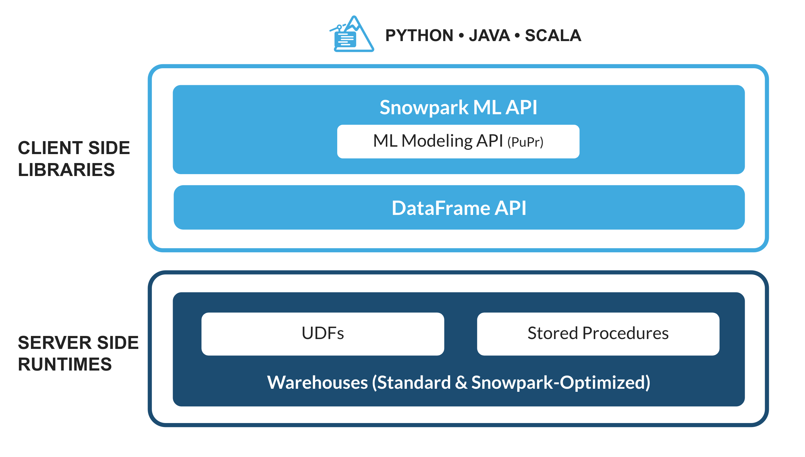
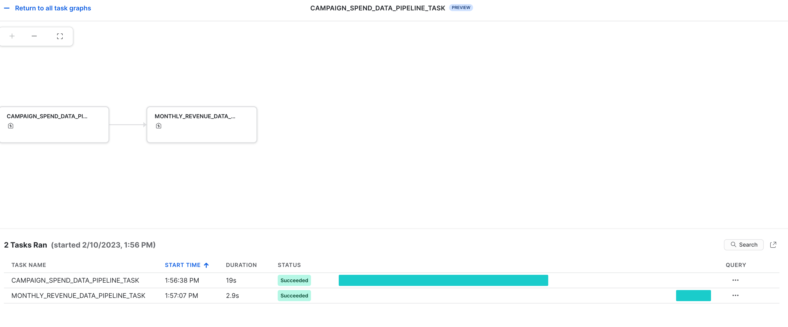
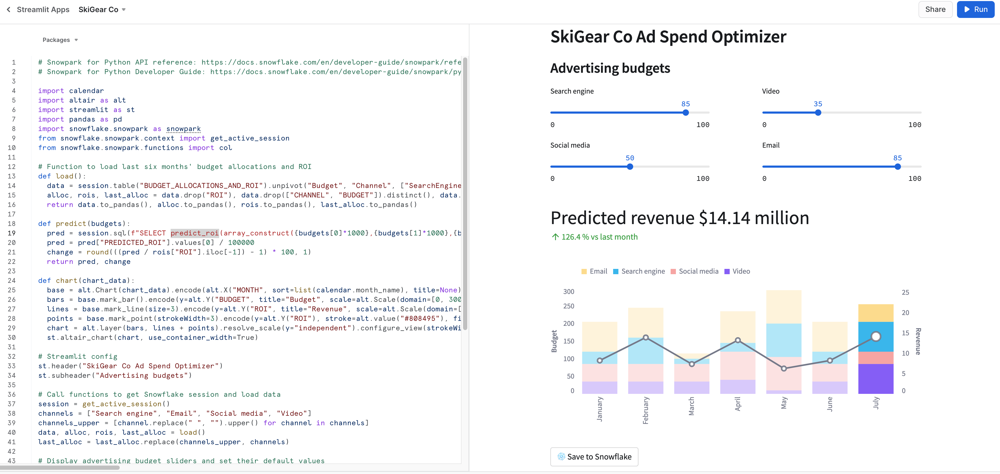

authors: Dash Desai
id: getting_started_with_dataengineering_ml_using_snowpark_python_kr
summary: Getting Started with Data Engineering and ML using Snowpark for Python
categories: featured,getting-started,data-science-&-ml,data-engineering,app-development
environments: web
status: Published
feedback link: https://github.com/Snowflake-Labs/sfguides/issues/
tags: Getting Started, kr, Snowpark Python, Streamlit, scikit-learn, Data Engineering, Machine Learning

# Snowpark for Python를 사용하여 데이터 엔지니어링 및 ML 시작하기

<!-- ------------------------ -->
## 개요

Duration: 5

이 가이드를 완료하면 가공 전 데이터를 조직이 광고 예산 할당을 최적화하는 데 도움을 줄 수 있는 인터랙티브 애플리케이션으로 만들 수 있습니다.

다음은 이 Quickstart를 따라할 때 각 단계에서 배울 수 있는 내용의 요약입니다.

- **설정 환경**: 가공 전 데이터를 S3에서 Snowflake로 집계하고 정리하기 위해 스테이지 및 테이블을 사용합니다.
- **데이터 엔지니어링**: 다운스트림 애플리케이션을 위한 데이터를 준비하기 위해 그룹화, 집계, 피벗 및 조인과 같은 데이터 변환 작업을 수행하는 데 Snowpark for Python DataFrame을 활용합니다.
- **데이터 파이프라인**: 통합 모니터링으로 데이터 파이프라인 코드를 운영 파이프라인으로 바꾸기 위해 Snowflake 작업을 사용합니다.
- **머신러닝**: 데이터를 준비하고, Snowpark ML을 사용하여 Snowflake에서 ML 훈련을 실행하고, Snowpark 사용자 정의 함수(UDF)로 모델을 배포합니다.
- **Streamlit 애플리케이션**: 다양한 광고 지출 예산 ROI를 시각화하는 데 도움이 되기 위해 Python을 사용하여 인터랙티브 애플리케이션을 구축합니다(웹 개발 환경 경험 필요 없음).

앞서 언급한 일부 기술을 사용한 적이 없을 경우, 설명서와 연결된 링크를 포함한 짧은 요약은 다음과 같습니다.

### Snowpark란 무엇일까요?

Python, Java 및 Scala를 비롯한 비 SQL 코드를 안전하게 배포하고 처리하는 Snowflake의 라이브러리 및 런타임 세트입니다.

**익숙한 클라이언트 측 라이브러리** - Snowpark는 심층적으로 통합된 DataFrame 스타일의 프로그래밍 및 OSS 호환 가능 API를 데이터 실무자가 선호하는 언어로 가져옵니다. 또한, 여기에는 더 효율적인 ML 모델링(공개 미리 보기) 및 ML 작업(비공개 미리 보기)을 위한 Snowpark ML API가 포함됩니다.

**유연한 런타임 구조** - Snowpark는 사용자가 사용자 정의 로직을 가져와 실행할 수 있도록 하는 유연한 런타임 구조를 제공합니다. 개발자는 사용자 정의 함수 및 저장 프로시저를 사용하여 원활하게 데이터 파이프라인, ML 모델 및 데이터 애플리케이션을 구축할 수 있습니다.

[Snowpark](https://www.snowflake.com/snowpark/)에 대해 자세히 알아보십시오.



### Snowpark ML이란 무엇일까요?

Snowpark ML은 Snowflake에서의 더 빠르고 직관적인 엔드 투 엔드 ML 개발을 위한 새로운 라이브러리입니다. Snowpark ML에는 2개의 API가 있습니다. 모델 개발을 위한 Snowpark ML Modeling(공개 미리 보기 상태)과 모델 배포를 위한 Snowpark ML Operations(비공개 미리 보기 상태)입니다.

이 Quickstart는 피처 엔지니어링의 규모를 확장하고 Snowflake에서의 ML 훈련 실행을 간소화하는 Snowpark ML Modeling API를 집중적으로 다룹니다.

### Streamlit이란 무엇일까요?

Streamlit은 개발자가 데이터 애플리케이션을 빠르고 쉽게 작성하고, 공유하고, 배포할 수 있도록 하는 순수한 Python [오픈 소스](https://github.com/streamlit/streamlit) 애플리케이션 프레임워크입니다. [Streamlit](https://streamlit.io/)에 대해 자세히 알아보십시오.

### 학습할 내용

- Snowpark DataFrame 및 API를 사용하여 데이터를 분석하고 데이터 엔지니어링 작업 수행하기
- 생성된 Snowflake Anaconda 채널에서 오픈 소스 Python 라이브러리 사용하기
- Snowflake에서 Snowpark ML을 사용하여 ML 모델 훈련하기
- 온라인 및 오프라인 추론 각각을 위해 Scalar 및 벡터화된 Snowpark Python 사용자 정의 함수(UDF) 생성하기
- 데이터 파이프라인을 자동화하기 위해 Snowflake 작업 생성하기
- 사용자 입력에 따라 추론을 위해 Scalar UDF를 사용하는 Streamlit 웹 애플리케이션 생성하기

### 사전 필요 조건 및 지식

- [Git](https://git-scm.com/book/en/v2/Getting-Started-Installing-Git) 설치
- [Python 3.9](https://www.python.org/downloads/) 설치
  - **시작하기** 단계에서 3.9로 Python 환경을 생성하게 됩니다.
- Snowflake 계정([ORGADMIN이 활성화한 Anaconda 패키지](https://docs.snowflake.com/ko/developer-guide/udf/python/udf-python-packages.html#using-third-party-packages-from-anaconda) 포함) Snowflake 계정이 없다면 [무료 평가판 계정](https://signup.snowflake.com/)을 위해 등록할 수 있습니다.
- Snowflake 계정 로그인(ACCOUNTADMIN 역할 포함) 환경에 이 역할이 있다면 이를 사용해도 됩니다. 이 역할이 없다면 1) 무료 평가판을 위해 등록하거나, 2) 데이터베이스, 스키마, 테이블, 스테이지, 작업, 사용자 정의 함수 및 저장 프로시저를 생성할 수 있는 다른 역할을 사용하거나, 3) 언급된 객체를 생성할 수 있는 기존 데이터베이스 및 스키마를 사용해야 합니다.

> aside positive 중요: 계속하기 전에 [여기](https://docs.snowflake.com/ko/developer-guide/udf/python/udf-python-packages#getting-started)에서 설명한 대로 ORGADMIN이 활성화한 Anaconda 패키지가 포함된 Snowflake 계정을 보유하고 있는지 확인하십시오.

<!-- ------------------------ -->
## 설정 환경

Duration: 15

### 테이블 생성, 데이터 로드 및 스테이지 설정

테이블을 생성하고, Amazon S3에서 데이터를 로드하고, Snowflake 내부 스테이지를 설정하기 위해 자격 증명을 사용하여 [Snowsight](https://docs.snowflake.com/ko/user-guide/ui-snowsight.html#)에 로그인합니다.

> aside positive 중요:
> 
> - 이 섹션에서 생성한 객체에 다른 이름을 사용한다면 다음 섹션에서 이에 맞춰 스크립트를 업데이트하고 코딩해야 합니다.
> 
> - 아래에 있는 각 SQL 스크립트 블록을 위해 해당 블록에서 모든 문을 선택하고 위에서 아래로 이를 실행합니다.

[웨어하우스](https://docs.snowflake.com/ko/sql-reference/sql/create-warehouse.html), [데이터베이스](https://docs.snowflake.com/ko/sql-reference/sql/create-database.html) 및 [스키마](https://docs.snowflake.com/ko/sql-reference/sql/create-schema.html)를 생성하기 위해 다음 SQL 명령을 실행합니다.

```sql
USE ROLE ACCOUNTADMIN;

CREATE OR REPLACE WAREHOUSE DASH_L;
CREATE OR REPLACE DATABASE DASH_DB;
CREATE OR REPLACE SCHEMA DASH_SCHEMA;

USE DASH_DB.DASH_SCHEMA;
```

공개적으로 액세스할 수 있는 S3 버킷에서 호스팅한 데이터에서 **CAMPAIGN_SPEND** 테이블을 생성하기 위해 다음 SQL 명령을 실행합니다.

```sql
CREATE or REPLACE file format csvformat
  skip_header = 1
  type = 'CSV';

CREATE or REPLACE stage campaign_data_stage
  file_format = csvformat
  url = 's3://sfquickstarts/ad-spend-roi-snowpark-python-scikit-learn-streamlit/campaign_spend/';

CREATE or REPLACE TABLE CAMPAIGN_SPEND (
  CAMPAIGN VARCHAR(60), 
  CHANNEL VARCHAR(60),
  DATE DATE,
  TOTAL_CLICKS NUMBER(38,0),
  TOTAL_COST NUMBER(38,0),
  ADS_SERVED NUMBER(38,0)
);

COPY into CAMPAIGN_SPEND
  from @campaign_data_stage;
```

공개적으로 액세스할 수 있는 S3 버킷에서 호스팅한 데이터에서 **MONTHLY_REVENUE** 테이블을 생성하기 위해 다음 SQL 명령을 실행합니다.

```sql
CREATE or REPLACE stage monthly_revenue_data_stage
  file_format = csvformat
  url = 's3://sfquickstarts/ad-spend-roi-snowpark-python-scikit-learn-streamlit/monthly_revenue/';

CREATE or REPLACE TABLE MONTHLY_REVENUE (
  YEAR NUMBER(38,0),
  MONTH NUMBER(38,0),
  REVENUE FLOAT
);

COPY into MONTHLY_REVENUE
  from @monthly_revenue_data_stage;
```

지난 6개월 동안의 예산 할당 및 ROI를 포함하는 **BUDGET_ALLOCATIONS_AND_ROI** 테이블을 생성하기 위해 다음 SQL 명령을 실행합니다.

```sql
CREATE or REPLACE TABLE BUDGET_ALLOCATIONS_AND_ROI (
  MONTH varchar(30),
  SEARCHENGINE integer,
  SOCIALMEDIA integer,
  VIDEO integer,
  EMAIL integer,
  ROI float
);

INSERT INTO BUDGET_ALLOCATIONS_AND_ROI (MONTH, SEARCHENGINE, SOCIALMEDIA, VIDEO, EMAIL, ROI)
VALUES
('January',35,50,35,85,8.22),
('February',75,50,35,85,13.90),
('March',15,50,35,15,7.34),
('April',25,80,40,90,13.23),
('May',95,95,10,95,6.246),
('June',35,50,35,85,8.22);
```

저장 프로시저, UDF 및 ML 모델 파일 저장을 위한 Snowflake [내부 스테이지](https://docs.snowflake.com/ko/user-guide/data-load-local-file-system-create-stage)를 생성하기 위해 다음 명령을 실행합니다.

```sql
CREATE OR REPLACE STAGE dash_sprocs;
CREATE OR REPLACE STAGE dash_models;
CREATE OR REPLACE STAGE dash_udfs;
```

선택적으로 객체를 생성하고 AWS S3에서 데이터를 로드하기 위해 Snowsight에서 [setup.sql](https://github.com/Snowflake-Labs/sfguide-ad-spend-roi-snowpark-python-streamlit-scikit-learn/blob/main/setup.sql)을 열고 모든 SQL 문을 실행할 수 있습니다.

> aside positive 중요: 이 섹션에서 생성한 객체에 다른 이름을 사용한다면 다음 섹션에서 이에 맞춰 스크립트를 업데이트하고 코딩해야 합니다.

<!-- ------------------------ -->
## 시작하기

Duration: 8

이 섹션에서는 GitHub 리포지토리 복제 및 Snowpark for Python 환경 설정을 다룹니다.

### GitHub 리포지토리 복제

첫 번째 단계는 [GitHub 리포지토리](https://github.com/Snowflake-Labs/sfguide-ad-spend-roi-snowpark-python-streamlit-scikit-learn)를 복제하는 것입니다. 이 리포지토리에는 이 Quickstart 가이드를 성공적으로 완료하는 데 필요한 모든 코드가 포함되어 있습니다.

HTTPS 사용:

```shell
git clone https://github.com/Snowflake-Labs/sfguide-getting-started-dataengineering-ml-snowpark-python.git
```

또는 SSH 사용:

```shell
git clone git@github.com:Snowflake-Labs/sfguide-getting-started-dataengineering-ml-snowpark-python.git
```

### Snowpark for Python

**데이터 엔지니어링** 및 **머신러닝** 단계를 완료하려면 모든 것을 로컬에서 설치(옵션 1)하거나 아래에서 설명하는 대로 Hex를 사용(옵션 2)해야 합니다.

> aside positive 중요: **Streamlit 애플리케이션**을 실행하려면 Python 환경을 생성하고 **로컬 설치**에서 설명하는 대로 로컬에서 Snowpark for Python과 다른 라이브러리를 설치해야 합니다.

#### 옵션 1 -- 로컬 설치

이 옵션을 통해 이 Quickstart 가이드의 모든 단계를 완료할 수 있습니다.

**1단계:** [https://conda.io/miniconda.html](https://conda.io/miniconda.html)에서 Miniconda 설치 프로그램을 다운로드 및 설치합니다. *(Python 3.9를 포함한 다른 모든 Python 환경(예: [virtualenv](https://virtualenv.pypa.io/en/latest/))을 사용할 수도 있습니다.)*

**2단계:** 새로운 터미널 창을 열고 동일한 터미널 창에서 다음 명령을 실행합니다.

**3단계:** 동일한 터미널 창에서 다음 명령을 실행하여 **snowpark-de-ml**이라는 Python 3.9 Conda 환경을 생성합니다.

```python
conda create --name snowpark-de-ml -c https://repo.anaconda.com/pkgs/snowflake python=3.9
```

**4단계:** 동일한 터미널 창에서 다음 명령을 실행하여 **snowpark-de-ml**이라는 Conda 환경을 활성화합니다.

```python
conda activate snowpark-de-ml
```

**5단계:** 동일한 터미널 창에서 다음 명령을 실행하여 [Snowflake Anaconda 채널](https://repo.anaconda.com/pkgs/snowflake/)의 **snowpark-de-ml** Conda 환경에서 Snowpark Python 및 다른 라이브러리를 설치합니다.

```python
conda install -c https://repo.anaconda.com/pkgs/snowflake snowflake-snowpark-python pandas notebook scikit-learn cachetools
```

**6단계:** 동일한 터미널 창에서 다음 명령을 실행하여 **snowpark-de-ml** Conda 환경에서 Streamlit 라이브러리를 설치합니다.

```python
pip install streamlit
```

**7단계:** 동일한 터미널 창에서 다음 명령을 실행하여 **snowpark-de-ml** Conda 환경에서 Snowpark ML 라이브러리를 설치합니다.

```python
pip install snowflake-ml-python
```

**9단계:** Snowflake 계정 세부 정보와 자격 증명으로 [connection.json](https://github.com/Snowflake-Labs/sfguide-ml-model-snowpark-python-scikit-learn-streamlit/blob/main/connection.json)을 업데이트합니다.

다음은 **설정 환경** 단계에서 언급된 객체 이름을 기반으로 한 샘플 ***connection.json***입니다.

```json
{
  "account"   : "<your_account_identifier_goes_here>",
  "user"      : "<your_username_goes_here>",
  "password"  : "<your_password_goes_here>",
  "role"      : "ACCOUNTADMIN",
  "warehouse" : "DASH_L",
  "database"  : "DASH_DB",
  "schema"    : "DASH_SCHEMA"
}
```

> aside negative 참고: 위 **계정** 매개변수에는 **계정 식별자**를 지정하고 snowflakecomputing.com 도메인 이름을 포함시키지 않습니다. 연결을 생성할 때 Snowflake가 이 값을 자동으로 추가합니다. 이에 대한 상세 정보는 [설명서를 참조하십시오](https://docs.snowflake.com/ko/user-guide/admin-account-identifier.html).

#### 옵션 2 -- Hex 사용

기존 [Hex](https://app.hex.tech/login) 계정을 사용하거나 [30일 무료 평가판 계정을 생성](https://app.hex.tech/signup/quickstart-30)하기로 결정했다면 Snowpark for Python이 내장되어 있기에 Python 환경을 생성하고 노트북을 사용하여 로컬에서 Snowpark for Python과 다른 라이브러리를 설치할 필요가 없습니다. 이렇게 하면 이 Quickstart 가이드의 **데이터 엔지니어링** 및 **머신러닝** 단계를 Hex에서 바로 완료할 수 있습니다. (Hex에서 데이터 엔지니어링 및 머신러닝 노트북을 로드하는 것에 대한 세부 정보는 각 단계를 참조하십시오.)

> aside positive 중요: **Streamlit 애플리케이션**을 실행하려면 Python 환경을 생성하고 위 **로컬 설치**에서 설명하는 대로 로컬에서 Snowpark for Python과 다른 라이브러리를 설치해야 합니다.

<!-- ------------------------ -->
## 데이터 엔지니어링

Duration: 20

아래에 링크가 연결된 노트북은 다음 데이터 엔지니어링 작업을 다룹니다.

1) Snowpark Python에서 Snowflake로 보안 연결 설정
2) Snowflake 테이블에서 Snowpark DataFrame으로 데이터 로드
3) Snowpark DataFrame에서 탐색적 데이터 분석 수행
4) Snowpark DataFrame을 사용하여 여러 테이블의 데이터를 피벗 및 결합
5) Snowflake 작업을 사용하여 데이터 파이프라인 작업 자동화

### Jupyter 또는 Visual Studio Code의 데이터 엔지니어링 노트북

시작하려면 다음 단계를 따릅니다.

1) 터미널 창에서 이 폴더를 검색하고 명령줄에서 `jupyter notebook`을 실행합니다. (다른 도구 및 Visual Studio Code와 같은 IDE를 사용해도 됩니다.)

2) 열고 [Snowpark_For_Python_DE.ipynb](https://github.com/Snowflake-Labs/sfguide-ad-spend-roi-snowpark-python-streamlit-scikit-learn/blob/main/Snowpark_For_Python_DE.ipynb)의 셀을 통해 실행합니다.

> aside positive 중요: Jupyter 노트북에서 (Python) 커널이 ***snowpark-de-ml***--로 설정되어 있는지 확인합니다. 이는 **GitHub 리포지토리 복제** 단계에서 생성된 환경 이름입니다.

### Hex의 데이터 엔지니어링 노트북

기존 [Hex](https://app.hex.tech/login) 계정을 사용하거나 [30일 무료 평가판 계정을 생성](https://app.hex.tech/signup/quickstart-30)하기로 결정했다면 노트북을 로드하기 위해 다음 단계에 따라 Hex에서 Snowflake와 연결하기 위한 데이터 연결을 생성합니다.

1) 계정에서 프로젝트로 [Snowpark_For_Python_DE.ipynb](https://github.com/Snowflake-Labs/sfguide-ad-spend-roi-snowpark-python-streamlit-scikit-learn/blob/main/Snowpark_For_Python_DE.ipynb)를 가져옵니다. 가져오기에 대한 상세 정보는 [설명서](https://learn.hex.tech/docs/versioning/import-export)를 참조하십시오.

2) 그런 다음 Snowflake와 연결하기 위해 [connection.json](https://github.com/Snowflake-Labs/sfguide-ml-model-snowpark-python-scikit-learn-streamlit/blob/main/connection.json)을 사용하는 대신 [데이터 연결](https://learn.hex.tech/tutorials/connect-to-data/get-your-data#set-up-a-data-connection-to-your-database)을 생성하고 이를 아래와 같이 데이터 엔지니어링 노트북에서 사용합니다.


> aside negative 참고: 작업 영역에 있는 프로젝트와 사용자를 위해 공유 데이터 연결을 생성할 수도 있습니다. 상세 정보는 [설명서](https://learn.hex.tech/docs/administration/workspace_settings/workspace-assets#shared-data-connections)를 참조하십시오.

3) 노트북에서 다음 코드 조각을

```python
connection_parameters = json.load(open('connection.json'))
session = Session.builder.configs(connection_parameters).create()
```

**다음으로 바꿉니다.**

```python
import hextoolkit
hex_snowflake_conn = hextoolkit.get_data_connection('YOUR_DATA_CONNECTION_NAME')
session = hex_snowflake_conn.get_snowpark_session()
session.sql('USE SCHEMA DASH_SCHEMA').collect()
```

<!-- ------------------------ -->
## 데이터 파이프라인

또한, Snowflake에서 실행되는 자동화 데이터 파이프라인 형식으로 데이터 변환을 조작할 수 있습니다.

특히 [데이터 엔지니어링 노트북](https://github.com/Snowflake-Labs/sfguide-ad-spend-roi-snowpark-python-streamlit-scikit-learn/blob/main/Snowpark_For_Python_DE.ipynb)에는 선택적으로 [Snowflake 작업](https://docs.snowflake.com/ko/user-guide/tasks-intro)으로 데이터 변환을 구축하고 실행하는 방법을 보여주는 섹션이 있습니다.

다음은 참조를 위한 코드 조각입니다.

### **루트 또는 상위 작업**

이 작업은 캠페인 지출 데이터를 로드하고 다양한 변환을 수행하는 것을 자동화합니다.

```python
def campaign_spend_data_pipeline(session: Session) -> str:
  # DATA TRANSFORMATIONS
  # Perform the following actions to transform the data

  # Load the campaign spend data
  snow_df_spend_t = session.table('campaign_spend')

  # Transform the data so we can see total cost per year/month per channel using group_by() and agg() Snowpark DataFrame functions
  snow_df_spend_per_channel_t = snow_df_spend_t.group_by(year('DATE'), month('DATE'),'CHANNEL').agg(sum('TOTAL_COST').as_('TOTAL_COST')).\
      with_column_renamed('"YEAR(DATE)"',"YEAR").with_column_renamed('"MONTH(DATE)"',"MONTH").sort('YEAR','MONTH')

  # Transform the data so that each row will represent total cost across all channels per year/month using pivot() and sum() Snowpark DataFrame functions
  snow_df_spend_per_month_t = snow_df_spend_per_channel_t.pivot('CHANNEL',['search_engine','social_media','video','email']).sum('TOTAL_COST').sort('YEAR','MONTH')
  snow_df_spend_per_month_t = snow_df_spend_per_month_t.select(
      col("YEAR"),
      col("MONTH"),
      col("'search_engine'").as_("SEARCH_ENGINE"),
      col("'social_media'").as_("SOCIAL_MEDIA"),
      col("'video'").as_("VIDEO"),
      col("'email'").as_("EMAIL")
  )

  # Save transformed data
  snow_df_spend_per_month_t.write.mode('overwrite').save_as_table('SPEND_PER_MONTH')

# Register data pipelining function as a Stored Procedure so it can be run as a task
session.sproc.register(
  func=campaign_spend_data_pipeline,
  name="campaign_spend_data_pipeline",
  packages=['snowflake-snowpark-python'],
  is_permanent=True,
  stage_location="@dash_sprocs",
  replace=True)

campaign_spend_data_pipeline_task = """
CREATE OR REPLACE TASK campaign_spend_data_pipeline_task
    WAREHOUSE = 'DASH_L'
    SCHEDULE  = '3 MINUTE'
AS
    CALL campaign_spend_data_pipeline()
"""
session.sql(campaign_spend_data_pipeline_task).collect()
```

### **하위 또는 종속 작업**

이 작업은 월별 수익 데이터를 로드하고, 다양한 변환을 수행하고, 이를 변환된 캠페인 지출 데이터와 결합하는 것을 자동화합니다.

```python
def monthly_revenue_data_pipeline(session: Session) -> str:
  # Load revenue table and transform the data into revenue per year/month using group_by and agg() functions
  snow_df_spend_per_month_t = session.table('spend_per_month')
  snow_df_revenue_t = session.table('monthly_revenue')
  snow_df_revenue_per_month_t = snow_df_revenue_t.group_by('YEAR','MONTH').agg(sum('REVENUE')).sort('YEAR','MONTH').with_column_renamed('SUM(REVENUE)','REVENUE')

  # Join revenue data with the transformed campaign spend data so that our input features (i.e. cost per channel) and target variable (i.e. revenue) can be loaded into a single table for model training
  snow_df_spend_and_revenue_per_month_t = snow_df_spend_per_month_t.join(snow_df_revenue_per_month_t, ["YEAR","MONTH"])

  # SAVE in a new table for the next task
  snow_df_spend_and_revenue_per_month_t.write.mode('overwrite').save_as_table('SPEND_AND_REVENUE_PER_MONTH')

# Register data pipelining function as a Stored Procedure so it can be run as a task
session.sproc.register(
  func=monthly_revenue_data_pipeline,
  name="monthly_revenue_data_pipeline",
  packages=['snowflake-snowpark-python'],
  is_permanent=True,
  stage_location="@dash_sprocs",
  replace=True)

monthly_revenue_data_pipeline_task = """
  CREATE OR REPLACE TASK monthly_revenue_data_pipeline_task
      WAREHOUSE = 'DASH_L'
      AFTER campaign_spend_data_pipeline_task
  AS
      CALL monthly_revenue_data_pipeline()
  """
session.sql(monthly_revenue_data_pipeline_task).collect()
```

> aside negative 참고: 위 ***monthly_revenue_data_pipeline_task***에서 **AFTER campaign_spend_data_pipeline_task** 절은 이를 종속 작업으로 만듭니다.

#### 작업 시작

Snowflake 작업은 기본값으로 시작되지 않으므로 시작 또는 다시 시작하려면 다음 문을 실행해야 합니다.

```sql
session.sql("alter task monthly_revenue_data_pipeline_task resume").collect()
session.sql("alter task campaign_spend_data_pipeline_task resume").collect()
```

#### 작업 일시 중단

위 작업을 다시 시작하는 경우, 다음 명령을 실행하여 불필요한 리소스 사용을 없애기 위해 이를 일시 중단합니다.

```sql
session.sql("alter task campaign_spend_data_pipeline_task suspend").collect()
session.sql("alter task monthly_revenue_data_pipeline_task suspend").collect()
```

### 작업 관측 가능성

이러한 작업과 [DAG](https://docs.snowflake.com/ko/user-guide/tasks-intro#label-task-dag)는 아래와 같이 [Snowsight](https://docs.snowflake.com/ko/user-guide/ui-snowsight-tasks#viewing-individual-task-graphs)에서 확인할 수 있습니다.

---



---

### 작업의 오류 알림

작업이 실행되고 있는 동안 오류가 발생할 때를 위해 클라우드 메시지 서비스에 푸시 알림을 활성화할 수도 있습니다. 자세한 내용은 [설명서](https://docs.snowflake.com/ko/user-guide/tasks-errors)를 참조하십시오.

<!-- ------------------------ -->
## 머신러닝

Duration: 20

> aside negative 사전 필요 조건 및 지식: [Snowpark_For_Python_DE.ipynb](https://github.com/Snowflake-Labs/sfguide-ad-spend-roi-snowpark-python-streamlit-scikit-learn/blob/main/Snowpark_For_Python_DE.ipynb)에서 설명한 데이터 엔지니어링 단계를 성공적을 완료해야 합니다.

아래에 링크가 연결된 노트북은 다음 머신러닝 작업을 다룹니다.

1) Snowpark Python에서 Snowflake로 보안 연결 설정
2) Snowflake 테이블에서 Snowpark DataFrame으로 피처 및 대상 로드
3) 모델 훈련을 위한 피처 준비
4) Snowflake에서 Snowpark ML을 사용하여 ML 모델 훈련
5) 온라인 및 오프라인 추론 각각을 위해 새로운 데이터 요소에 대한 추론을 위한 스칼라 및 벡터화된(일괄이라고도 함) [Python 사용자 정의 함수(UDF)](https://docs.snowflake.com/ko/developer-guide/snowpark/python/creating-udfs) 생성

---


---

### Jupyter 또는 Visual Studio Code의 머신러닝 노트북

시작하려면 다음 단계를 따릅니다.

1) 터미널 창에서 이 폴더를 검색하고 명령줄에서 `jupyter notebook`을 실행합니다. (다른 도구 및 Visual Studio Code와 같은 IDE를 사용해도 됩니다.)

2) 열고 [Snowpark_For_Python_ML.ipynb](https://github.com/Snowflake-Labs/sfguide-ad-spend-roi-snowpark-python-streamlit-scikit-learn/blob/main/Snowpark_For_Python_ML.ipynb)를 통해 실행합니다.

> aside positive 중요: Jupyter 노트북에서 (Python) 커널이 ***snowpark-de-ml*** --로 설정되어 있는지 확인합니다. 이는 **GitHub 리포지토리 복제** 단계에서 생성된 환경 이름입니다.

### Hex의 머신러닝 노트북

기존 [Hex](https://app.hex.tech/login) 계정을 사용하거나 [30일 무료 평가판 계정을 생성](https://app.hex.tech/signup/quickstart-30)하기로 결정했다면 노트북을 로드하기 위해 다음 단계에 따라 Hex에서 Snowflake와 연결하기 위한 데이터 연결을 생성합니다.

1) 계정에서 프로젝트로 [Snowpark_For_Python_ML.ipynb](https://github.com/Snowflake-Labs/sfguide-ad-spend-roi-snowpark-python-streamlit-scikit-learn/blob/main/Snowpark_For_Python_ML.ipynb)를 가져옵니다. 가져오기에 대한 상세 정보는 [설명서](https://learn.hex.tech/docs/versioning/import-export)를 참조하십시오.

2) 그런 다음 Snowflake와 연결하기 위해 [connection.json](https://github.com/Snowflake-Labs/sfguide-ml-model-snowpark-python-scikit-learn-streamlit/blob/main/connection.json)을 사용하는 대신 [데이터 연결](https://learn.hex.tech/tutorials/connect-to-data/get-your-data#set-up-a-data-connection-to-your-database)을 생성하고 이를 아래와 같이 머신러닝 노트북에서 사용합니다.


> aside negative 참고: 작업 영역에 있는 프로젝트와 사용자를 위해 공유 데이터 연결을 생성할 수도 있습니다. 상세 정보는 [설명서](https://learn.hex.tech/docs/administration/workspace_settings/workspace-assets#shared-data-connections)를 참조하십시오.

3) 노트북에서 다음 코드 조각을

```python
connection_parameters = json.load(open('connection.json'))
session = Session.builder.configs(connection_parameters).create()
```

**다음으로 바꿉니다.**

```python
import hextoolkit
hex_snowflake_conn = hextoolkit.get_data_connection('YOUR_DATA_CONNECTION_NAME')
session = hex_snowflake_conn.get_snowpark_session()
session.sql('USE SCHEMA DASH_SCHEMA').collect()
```

<!-- ------------------------ -->
## Streamlit 애플리케이션

Duration: 10

### 로컬에서 Streamlit 앱 실행

터미널 창에서 이 폴더를 검색하고 컴퓨터의 로컬에서 [Snowpark_Streamlit_Revenue_Prediction.py](https://github.com/Snowflake-Labs/sfguide-ad-spend-roi-snowpark-python-streamlit-scikit-learn/blob/main/Snowpark_Streamlit_Revenue_Prediction.py) Streamlit 애플리케이션을 실행하기 위해 다음 명령을 실행합니다.

```shell
streamlit run Snowpark_Streamlit_Revenue_Prediction.py
```

모두 것이 정상적이라면 아래와 같이 로드된 앱과 더불어 브라우저 창이 나타납니다.

---


---

### Snowflake에서 Streamlit 앱 실행 -- SiS(Streamlit in Snowflake)

계정에서 SiS가 활성화되어 있다면 컴퓨터의 로컬 대신 Snowsight에서 애플리케이션을 실행하기 위해 다음 단계를 따릅니다.

> aside negative 중요: 2023년 6월 기준으로 SiS는 비공개 미리 보기 단계에 있습니다.***

1) 왼쪽 탐색 메뉴에서 **Streamlit Apps**를 클릭합니다
2) 오른쪽 상단에서 **+ Streamlit App**을 클릭합니다
3) **앱 이름**을 입력합니다
4) Streamlit 애플리케이션을 생성하고자 하는 **Warehouse** 및 **App locaton**(데이터베이스 및 스키마)를 선택합니다
5) **Create**를 클릭합니다.
6) 이제 예시 Streamlit 애플리케이션을 위한 코드가 제공됩니다. 이제 [Snowpark_Streamlit_Revenue_Prediction_SiS.py](https://github.com/Snowflake-Labs/sfguide-ad-spend-roi-snowpark-python-streamlit-scikit-learn/blob/main/Snowpark_Streamlit_Revenue_Prediction_SiS.py)를 열고 코드를 복사하여 예시 Streamlit 애플리케이션에 붙여넣습니다.
7) 오른쪽 상단에 있는 **Run**을 클릭합니다

모든 것이 정상적이라면 아래와 같이 Snowsight에 다음 앱에 나타납니다.

---



---

### Snowflake에 데이터 저장

두 가지 애플리케이션에서 이러한 할당의 예상 ROI를 확인하기 위해 광고 예산 슬라이더를 조정합니다. **Save to Snowflake** 버튼을 클릭하여 현재 할당과 예상 ROI를 BUDGET_ALLOCATIONS_AND_ROI Snowflake 테이블에 저장할 수 있습니다.

### 두 가지 Streamlit 앱의 차이점

Streamlit 애플리케이션을 로컬에서 실행하는 것과 Snowflake(SiS)에서 실행하는 것의 근본적인 차이점은 Session 객체를 생성하고 액세스하는 방법입니다.

로컬에서 실행하면 새로운 Session 객체를 다음과 같이 생성하고 액세스합니다.

```python
# Function to create Snowflake Session to connect to Snowflake
def create_session():
    if "snowpark_session" not in st.session_state:
        session = Session.builder.configs(json.load(open("connection.json"))).create()
        st.session_state['snowpark_session'] = session
    else:
        session = st.session_state['snowpark_session']
    return session
```

Snowflake(SiS)에서 실행하면 현재 Session 객체에 다음과 같이 액세스합니다.

```python
session = snowpark.session._get_active_session()
```

<!-- ------------------------ -->
## 정리

**데이터 엔지니어링** 또는 **데이터 파이프라인** 섹션의 일환으로 `monthly_revenue_data_pipeline_task` 및 `campaign_spend_data_pipeline_task` 작업 2개를 시작했거나 다시 시작한 경우, 불필요한 리소스 사용을 없애려면 이러한 작업을 일시 중단하기 위해 다음의 명령을 실행하는 것이 중요합니다.

노트북에서 Snowpark Python API 사용

```sql
session.sql("alter task campaign_spend_data_pipeline_task suspend").collect()
session.sql("alter task monthly_revenue_data_pipeline_task suspend").collect()
```

Snowsight에서

```sql
alter task campaign_spend_data_pipeline_task suspend;
alter task monthly_revenue_data_pipeline_task suspend;
```

<!-- ------------------------ -->
## 결론 및 리소스

Duration: 3

축하합니다! 성공적으로 데이터 엔지니어링 작업을 수행하고 Snowpark for Python 및 scikit-learn을 사용하여 검색, 동영상, 소셜 미디어 및 이메일을 포함한 여러 채널에 걸쳐 다양한 광고 지출 예산의 향후 ROI(투자 수익)를 예측하기 위해 선형 회귀 모델을 학습시키셨습니다. 그런 다음 이러한 모델을 사용하여 사용자 입력에 따라 새로운 예산 할당에 대한 예측을 생성하는 Streamlit 애플리케이션을 생성했습니다.

이 Quickstart에 대한 피드백을 공유해 주시면 감사하겠습니다! 이 [피드백 양식](https://forms.gle/XKd8rXPUNs2G1yM28)을 사용하여 피드백을 제출해 주십시오.

### 학습한 내용

- Snowpark DataFrame 및 API를 사용하여 데이터를 분석하고 데이터 엔지니어링 작업 수행하기
- 생성된 Snowflake Anaconda 채널에서 오픈 소스 Python 라이브러리 사용하기
- Snowflake에서 Snowpark ML을 사용하여 ML 모델 훈련하기
- 온라인 및 오프라인 추론 각각을 위해 Scalar 및 벡터화된 Snowpark Python 사용자 정의 함수(UDF) 생성하기
- 데이터 파이프라인을 자동화하고 모델을 (재)학습시키기 위해 Snowflake 작업 생성하기
- 추론을 위해 Scalar UDF를 사용하는 Streamlit 웹 애플리케이션 생성하기

### 관련 리소스

- [GitHub의 소스 코드](https://github.com/Snowflake-Labs/sfguide-ad-spend-roi-snowpark-python-streamlit-scikit-learn)
- [Advanced:  Snowpark for Python Data Engineering Guide](/guide/data_engineering_pipelines_with_snowpark_python_kr/index.html)
- [Advanced: Snowpark for Python Machine Learning Guide](https://quickstarts.snowflake.com/guide/getting_started_snowpark_machine_learning/index.html)
- [Snowpark for Python 데모](https://github.com/Snowflake-Labs/snowpark-python-demos/blob/main/README.md)
- [Snowpark for Python 개발자 가이드](https://docs.snowflake.com/ko/developer-guide/snowpark/python/index.html)
- [Streamlit 설명서](https://docs.streamlit.io/)
