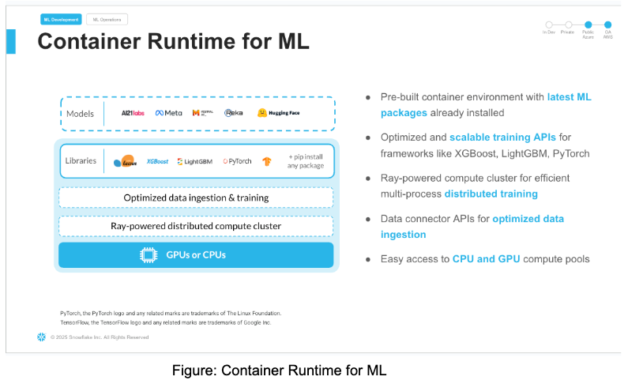
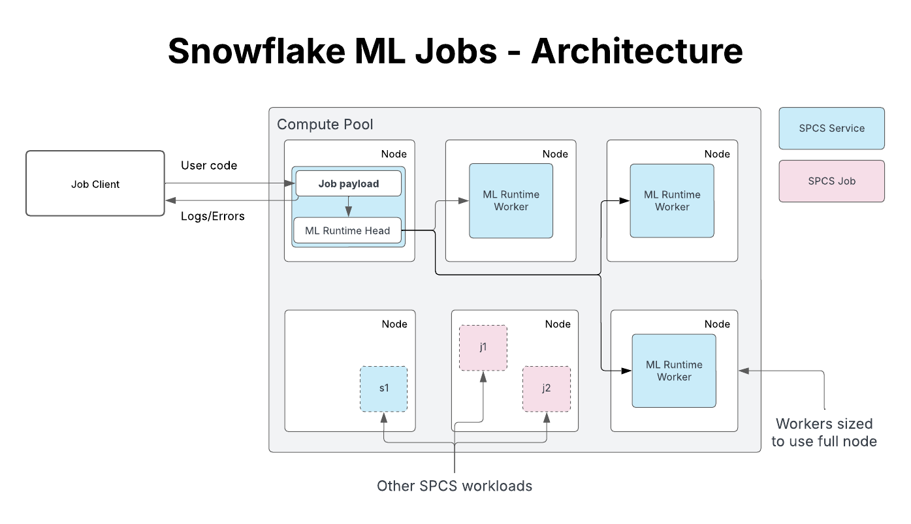
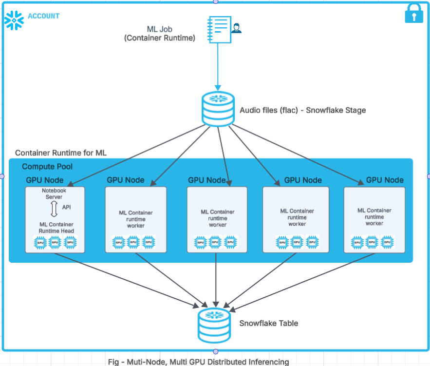

author: Dharmendra Shavkani
id: getting_started_with_distributed_multi_node_multi_gpu_audio_transcription_with_snowflake_ml_container_runtime
summary: This guide will provide step-by-step details for using multi-node multi-gpu audio transcription with snowflake ml container runtime
categories: ML Container Runtime
environments: web
status: Published 
feedback link: https://github.com/Snowflake-Labs/sfguides/issues
tags: Getting Started, Data Science, Data Engineering, Twitter 

# **Distributed Multi-Node and Multi GPU Audio Transcription with Snowflake ML Container Runtime**
<!-- ------------------------ -->
## Overview 

Duration: 10

In this Quickstart guide, we will walk through how to use [Container Runtime](https://docs.snowflake.com/en/developer-guide/snowflake-ml/container-runtime-ml) in [Snowflake ML](http://www.snowflake.com/ml) to perform Multi-Node, Multi-GPU audio transcription at limitless scale over multiple audio files.

### What is Snowflake ML?

[Snowflake ML](https://www.snowflake.com/en/data-cloud/snowflake-ml/) is the integrated set of capabilities for end-to-end machine learning in a single platform on top of your governed data. Data scientists and ML engineers can easily and securely develop and productionize scalable features and models without any data movement, silos or governance tradeoffs.

### What is Container Runtime?

[Container Runtime](https://docs.snowflake.com/en/developer-guide/snowflake-ml/container-runtime-ml) gives you a flexible container infrastructure that supports building and operationalizing a wide variety of resource-intensive ML workflows entirely within Snowflake. 

Container Runtime is a set of preconfigured customizable environments built for machine learning on Snowpark Container Services, covering interactive experimentation and batch ML workloads such as model training, hyperparameter tuning, batch inference and fine tuning. They include the most popular machine learning and deep learning frameworks. Container Runtime also provides flexibility the ability to pip install any open-source package of choice.

### What is Snowflake Notebooks on Container Runtime?

[Snowflake Notebooks on Container Runtime](https://docs.snowflake.com/en/user-guide/ui-snowsight/notebooks-on-spcs)  are a powerful IDE option for building ML models at scale in [Snowflake ML](https://www.snowflake.com/en/data-cloud/snowflake-ml/). 

Snowflake Notebooks are natively built into Snowsight, and provide everything you need for interactive development, cell by cell execution of Python, Markdown and SQL code. By using Snowflake Notebooks one can increase the productivity since it simplifies connecting to the data and using popular OSS libraries for ML use cases. Notebooks on Container Runtime offer a robust environment with a comprehensive repository of pre-installed CPU and GPU machine learning packages and frameworks, significantly reducing the need for package management and dependency troubleshooting. This allows you to quickly get started with your preferred frameworks and even import models from external sources. Additionally, you can use pip to install any custom package as needed. The runtime also features an optimized data ingestion layer and provides a set of powerful APIs for training and hyperparameter tuning. These APIs extend popular ML packages, enabling you to train models efficiently within Snowflake. At the core of this solution is a Ray-powered distributed compute cluster, giving you seamless access to both CPU and GPU resources. This ensures high performance and optimal infrastructure usage without the need for complex setup or configuration, allowing you to focus solely on your machine learning workloads.

Key Features:

* Managed Environment: Focus on your ML projects without the overhead of managing underlying infrastructure.  
* Scalability: Leverage distributed computing resources to efficiently handle large datasets and complex computations.  
* Integration: Seamlessly combine with Snowflake's ML operations for a cohesive workflow.  
* Flexibility: While common ML packages come pre-installed, you have the option to install custom packages as needed.



### What is Container Runtime’s architecture?



### What APIs does Container Runtime have to support Unstructured Data Processing?

Container Runtime for ML provides several APIs to handle unstructured data, such as images, text and binary files, from Snowflake Stage and process it in Snowflake's Container Runtime using [Ray Data](https://docs.ray.io/en/latest/data/data.html). These APIs enable efficient unstructured data processing and analysis without the need for complex data movement or transformation. At the time of writing this quickstart, Container Runtime for ML has the following APIs for handling unstructured data:

1. Reading into Snowflake:   
   1. SFStageImageDatasource \- This class allows us to load images from Snowflake Stage and pass them forward for distributed processing with Container Runtime for ML.  
   2. SFStageTextDatasource \- This class allows us to load text from Snowflake Stage and use them in downstream distributed calls.  
   3. SFStageBinaryFileDataSource \- This class allows us to read content from Snowflake stage as binary files and use them in downstream processors.  
2. Writing to Snowflake:   
   1. SnowflakeTableDatasink \- This class provides snowflake specific [Ray data sink APIs](https://docs.ray.io/en/latest/data/api/doc/ray.data.Datasink.html) to allow customers write the processed dataset into a snowflake table

In this quickstart, we will be using SFStageBinaryFileDataSource and SnowflakeTableDatasink class.

### What model are we using for audio transcription?

Whisper is a state-of-the-art model for automatic speech recognition (ASR) and speech translation, proposed in the paper [Robust Speech Recognition via Large-Scale Weak Supervision](https://huggingface.co/papers/2212.04356) by Alec Radford et al. from OpenAI. Trained on \>5M hours of labeled data, Whisper demonstrates a strong ability to generalise to many datasets and domains in a zero-shot setting.

Whisper large-v3 has the same architecture as the previous [large](https://huggingface.co/openai/whisper-large) and [large-v2](https://huggingface.co/openai/whisper-large-v2) models, except for the following minor differences:

1. The spectrogram input uses 128 Mel frequency bins instead of 80  
2. A new language token for Cantonese

See details here for the [model](https://huggingface.co/openai/whisper-large-v3)



Prerequisites

* A Snowflake Account. Sign up for a 30-day [free trial account](https://signup.snowflake.com/), if required.

* Foundational knowledge of Data Science workflows

* (Optional) Completed [Getting Started with Snowflake Notebook Container Runtime](https://quickstarts.snowflake.com/guide/notebook-container-runtime/index.html#0)

What You'll Build

* A Snowflake Notebook that runs Distributed Multi-Node, Multi-GPU Audio Transcription in ML Container Runtime

## Setup Environment
<!-- ------------------------ -->
Duration: 5

This section will walk you through creating various objects. The repository with the source code can be found [here](https://github.com/Snowflake-Labs/sfguide-distributed-multi-node-multi-gpu-audio-transcription-with-snowflake-ml-container-runtime).

Initial Setup

Complete the following steps to setup your account:

* Download the Snowflake Objects creation file “step0\_setup.sql”  from this [link](https://github.com/Snowflake-Labs/sfguide-distributed-multi-node-multi-gpu-audio-transcription-with-snowflake-ml-container-runtime/blob/main/step0_setup.sql). 

* Roles required to execute commands in file are SYSADMIN and ACCOUNTADMIN.

* In Snowsight navigate to Worksheets, click "+" in the top-right corner to create a new Worksheet, and choose "SQL Worksheet".

* Paste the contents from the downloaded file “step0\_setup.sql”  in the worksheet

* Run all the commands to create Snowflake objects (database, schema, warehouse, compute pools and external access integration).


## Audio Processing Setup
<!-- ------------------------ -->
Duration: 10

This notebook linked below covers the creation of snowflake objects and data loading from a third-party dataset (Audio Files) into snowflake stage. **Be sure to comply with the dataset's licensing terms and usage guidelines.**

**Audio Processing Setup Notebook**

To get started, follow these steps: 

* Download the notebook “Audio Processing \- Setup.ipynb” from this [link](https://github.com/Snowflake-Labs/sfguide-distributed-multi-node-multi-gpu-audio-transcription-with-snowflake-ml-container-runtime/blob/main/Audio%20Processing%20-%20Setup.ipynb)

* Navigate to Snowsight and change role to **SYSADMIN**

* Navigate to **Projects** \> **Notebooks** in Snowsight

* On the top right, click on **Notebook** down arrow and select **Import .ipynb** file from the dropdown menu

* Create a new notebook “Audio Processing \- Setup.ipynb” with the following settings

 * For the Notebook Location, select MULTINODE\_MULTIGPU\_MYDB database and AUDIO\_TRANSCRIPTION\_SCH schema

  * Select Warehouse – ML\_MODEL\_WH

  * Python Environment \- Run On Container

  * Runtime \- Snowflake ML Runtime CPU 1.0

  * Compute Pool \- AUDIO\_PROCESSING\_CP\_DATA\_DOWNLOAD

  * Click on **Create Button**

    


* Click the three dots in the top right \> Notebook Settings  
* Enable the ALLOW\_ALL\_INTEGRATION and click SAVE.


* Run cells in the notebook\!

* Notebook will download the audio files from LibriSpeech ASR corpus as noted here: [https://www.openslr.org/resources/12](https://www.openslr.org/resources/12). The notebook also puts these audio files in a snowflake internal stage named AUDIO\_FILES\_STAGE.


Note: - "Please note, if you duplicate this notebook you will have to manually enable ALLOW_ALL_INTEGRATION again"

## Audio Transcription
<!-- ------------------------ -->
Duration: 10

This Notebook linked below demonstrates the distributed inferencing of audio files on Snowflake ML Container Runtime using multiple nodes and multiple GPUs.

In this notebook, we will be using SFStageBinaryFileDataSource and SnowflakeTableDatasink class. The signature of these two classes are as below:

```py
class SFStageBinaryFileDataSource(
    stage_location: str,
    database: Optional[str] = None,
    schema: Optional[str] = None,
    file_pattern: Optional[str] = None,
    local_path: Optional[str] = None,
)
```

* stage\_location:. Stage path  
* database: Database name. Defaults to notebook session's current database   
* schema: Schema name. Defaults to notebook session's current database   
* file\_pattern: The file pattern to filter the files in the stage. It supports Unix shell-style wildcards. Example: "\*.flac" will match all files with .png extension Default is to include all files under stage\_location  
* local\_path: The local path to save the files if you choose to. Defaults to None. None means the file will not be saved to the local disk and the consumption will be through the content file\_binary. Note, in a multi-node cluster, this is not recommended, since files will be only available in the main node. 

```py
from snowflake.ml.ray.datasink import SnowflakeTableDatasink

datasink = SnowflakeTableDatasink(
    table_name="MY_TABLE",
    database = "MY_DB",
    schema = "MY_SCHEMA",
    auto_create_table=True,
    override=True,
)

# Write a processed dataset back to a snowflake table
# For example take the Text API processing example above
label_dataset.write_datasink(datasink, concurrency=4)
# Now you can query the table in `MY_DB.MY_SCHEMA.MY_TABLE'
```


**Audio Processing and Distributed Inferencing Notebook**

To get started, follow these steps:

* Download the notebook “Audio Processing \- Distributed Inferencing.ipynb” from this [link](https://github.com/Snowflake-Labs/sfguide-distributed-multi-node-multi-gpu-audio-transcription-with-snowflake-ml-container-runtime/blob/main/Audio%20Processing%20-%20Distributed%20Inferencing.ipynb)

* Navigate to Snowsight and change role to **SYSADMIN**

* Navigate to **Projects** \> **Notebooks** in Snowsight

* On the top right, click on **Notebook** down arrow and select **Import .ipynb** file from the dropdown menu

* Create a new notebook with the following settings

  * For the Notebook Location, select MULTINODE\_MULTIGPU\_MYDB database and AUDIO\_TRANSCRIPTION\_SCH schema

  * Select Warehouse – ML\_MODEL\_WH

  * Python Environment \- Run On Container

  * Runtime \- Snowflake ML Runtime GPU 1.0

  * Compute Pool \- AUDIO\_PROCESSING\_CP\_GPU\_NV\_S\_5\_NODES

  * Click on **Create Button**


* Click the three dots in the top right \> Notebook Settings  
* Enable the ALLOW\_ALL\_INTEGRATION and click SAVE.


* Run cells in the notebook\!

      Lets break down step by step in the notebook

- Create a Ray cluster and scale upto 5 nodes.  
- Configure logging for Ray Cluster and do necessary setups for the Ray Cluster  
- Verify the Audio files in the stage uploaded during Step 3\.  
- Download the whisper model from OpenAI for distributed inferencing of the audio files  
- Run distributed inference on the multi-node, multi-GPU audio transcription  
- Write data to the Snowflake table using Snowflake APIs.


Note: "Please note, if you duplicate this notebook you will have to manually enable ALLOW_ALL_INTEGRATION again"

## Value Proposition
<!-- ------------------------ -->
Duration: 5

Snowflake ML Container Runtime offers significant value for distributed multi-node, multi-GPU audio transcription. Here are the key benefits:

**Leveraging Powerful Models**: Utilizes state-of-the-art models like Whisper for accurate audio transcription.

**GPU Acceleration**: Supports GPU machine types for faster processing, demonstrated by the example using 5 GPU_NV_S nodes.

**Cost-Effectiveness**: The demo processed approximately 2700 audio files in just 2 minutes using 5 Small GPU nodes on AWS (specifically GPU_NV_S compute family), each costing 0.57 credits/hour. The cost is derived from the Credit Consumption Table 1 (d) highlighted [here](https://www.snowflake.com/legal-files/CreditConsumptionTable.pdf)

**Minimal Credit Consumption**: This resulted in a very low cost of only (2/60) * 0.57 = 0.019 credits per node, so 0.095 credits for 5 nodes or $0.285 to transcribe 2700 audio files (based on $3 per credit).

**Speed**: Rapid transcription of a large number of files, significantly reducing processing time.

**Scalability**: Handles large datasets and complex computations efficiently using distributed computing resources.

**Managed Environment**: Eliminates the overhead of managing underlying infrastructure, allowing users to focus on ML projects.
Integration: Seamlessly combines with Snowflake's ML operations for a cohesive workflow.

**Flexibility**: Pre-installed common ML packages with the option to install custom packages as needed.

**Unstructured Data Processing**: APIs like SFStageBinaryFileDataSource and SnowflakeTableDatasink enable efficient handling of audio files from Snowflake Stage.


## Conclusion and Resources

In conclusion, running Container Runtime in Snowflake ML and Snowflake Notebooks Container Runtime offers a robust and flexible infrastructure for managing large-scale, advanced data science and machine learning workflows directly within Snowflake. With the ability to install external packages and choose optimal compute resources, including GPU machine types, Container Runtime provides a more versatile environment suited to the needs of data science and ML teams.

Ready for more? After you complete this quickstart, you can try one of the following more advanced quickstarts:

* [Build an End-to-End ML Workflow in Snowflake](https://quickstarts.snowflake.com/guide/end-to-end-ml-workflow/index.html?index=..%2F..index#1)  
* [Scale Embeddings with Snowflake Notebooks on Container Runtime](https://quickstarts.snowflake.com/guide/scale-embeddings-with-snowflake-notebooks-on-container-runtime/index.html?index=..%2F..index#0)  
* [Getting Started with Running Distributed PyTorch Models on Snowflake](https://quickstarts.snowflake.com/guide/getting-started-with-running-distributed-pytorch-models-on-snowflake/#0).  
* [Defect Detection Using Distributed PyTorch With Snowflake Notebooks](https://quickstarts.snowflake.com/guide/defect_detection_using_distributed_pyTorch_with_snowflake_notebooks/index.html?index=..%2F..index#0)

What You Learned

* The key features of Snowflake Notebooks with Container Runtime in [Snowflake ML](http://www.snowflake.com/ml) to perform Multi-Node, Multi-GPU audio transcription at limitless scale over multiple audio files.

Related Quickstarts

* [Train an XGBoost model with GPUs in Snowflake Notebooks](https://quickstarts.snowflake.com/guide/train-an-xgboost-model-with-gpus-using-snowflake-notebooks/index.html#0)  
* [Defect Detection Using Distributed PyTorch With Snowflake Notebooks](https://quickstarts.snowflake.com/guide/defect_detection_using_distributed_pyTorch_with_snowflake_notebooks)  
* [Scale Embeddings with Snowflake Notebooks on Container Runtime](https://quickstarts.snowflake.com/guide/scale-embeddings-with-snowflake-notebooks-on-container-runtime)  
* [Getting Started with Running Distributed PyTorch Models on Snowflake](https://quickstarts.snowflake.com/guide/getting-started-with-running-distributed-pytorch-models-on-snowflake/)  
* [Getting Started with Snowflake ML](https://quickstarts.snowflake.com/guide/intro_to_machine_learning_with_snowpark_ml_for_python/#0)

Related Resources

* [Documentation: Container Runtime for ML](https://docs.snowflake.com/en/developer-guide/snowflake-ml/container-runtime-ml)  
* [Documentation: Snowflake Model Registry](https://docs.snowflake.com/en/developer-guide/snowflake-ml/model-registry/overview)  
* [Documentation: Model Serving in SPCS](https://docs.snowflake.com/en/developer-guide/snowflake-ml/model-registry/container)  
* [Intro Quickstart: Getting Started with Snowflake Notebook Container Runtime](https://quickstarts.snowflake.com/guide/notebook-container-runtime/index.html#0)  
* [Snowflake ML Webpage](https://www.snowflake.com/en/data-cloud/snowflake-ml/)
* [Documentation](https://docs.snowflake.com/LIMITEDACCESS/snowsight-notebooks/ui-snowsight-notebooks-runtime)