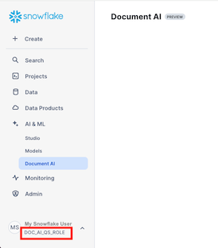
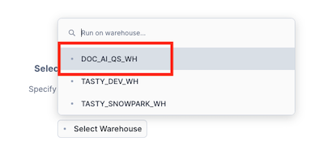
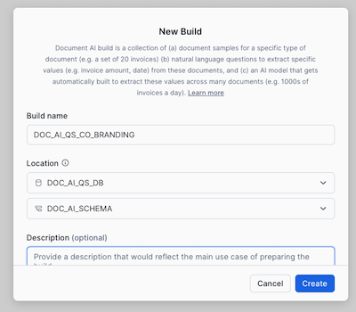
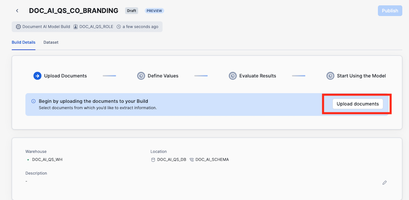
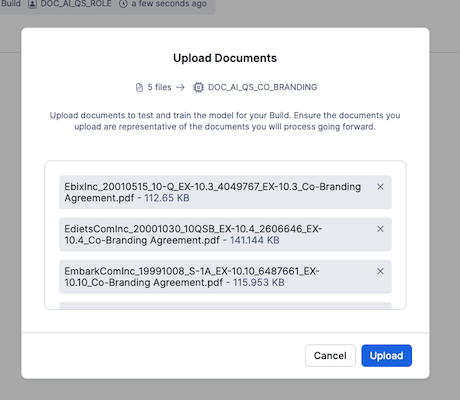
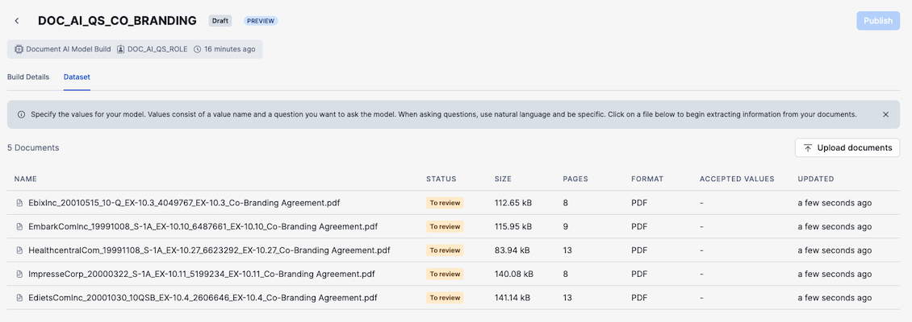
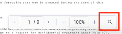
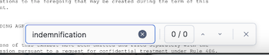
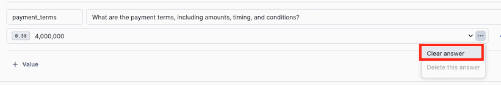
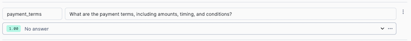

author: Mats Stellwall
id: getting_started_with_document_ai
summary: This is a sample Snowflake Guide
<!--- Categories below should be hyphenated, i.e., Getting-Started. Do not leave blank. Visit site for available categories. -->
categories: Getting-Started
environments: web
status: Published 
feedback link: https://github.com/Snowflake-Labs/sfguides/issues
tags: Getting Started, Data Science, Data Engineering, Twitter 

# Getting Started with Document AI
<!-- ------------------------ -->
## Overview 
Duration: 1

Please use [this markdown file](https://raw.githubusercontent.com/Snowflake-Labs/sfguides/master/site/sfguides/sample.md) as a template for writing your own Snowflake Quickstarts. This example guide has elements that you will use when writing your own guides, including: code snippet highlighting, downloading files, inserting photos, and more. 

It is important to include on the first page of your guide the following sections: Prerequisites, What you'll learn, What you'll need, and What you'll build. Remember, part of the purpose of a Snowflake Guide is that the reader will have **built** something by the end of the tutorial; this means that actual code needs to be included (not just pseudo-code).

The rest of this Snowflake Guide explains the steps of writing your own guide. 

### What You’ll Learn 
- how to create a Document AI project
- how use a published Document AI project to build a data pipeline
- how to build a Streamlit application for verifying documents

### Prerequisites
- [Git](https://git-scm.com/book/en/v2/Getting-Started-Installing-Git) installed
    > aside positive
    >
    >Download the [git repo](https://github.com/Snowflake-Labs/)
- A Snowflake account. If you do not have a Snowflake account, you can register for a [free trial account](https://signup.snowflake.com/).
- A Snowflake account login with a role that has the ability to create database, schema, tables, stages, user-defined functions, and stored procedures. If not, you will need to register for a free trial or use a different role.

### What You’ll Build 
This QuickStart will help you in getting started with Document AI.

You will use documents from the [Contract Understanding Atticus Dataset (CUAD) v1](https://zenodo.org/records/4595826) in order to ...

<!-- ------------------------ -->
## Setup the Snowflake enviroment
Duration: 2

### Overview
You will use Snowsight, the Snowflake web interface, to:
- Create Snowflake objects (i.e warehouse, database, schema, etc..)

### Step 1: Creating Objects
Run the following SQL commands in a SQL worksheet to create the [warehouse](https://docs.snowflake.com/en/sql-reference/sql/create-warehouse.html), [database](https://docs.snowflake.com/en/sql-reference/sql/create-database.html), [schema](https://docs.snowflake.com/en/sql-reference/sql/create-schema.html)...

```SQL
USE ROLE ACCOUNTADMIN;

-- CREATE A DOC AI ROLE TO BE USED FOR THE QUICKSTART
CREATE ROLE doc_ai_qs_role;
GRANT DATABASE ROLE SNOWFLAKE.DOCUMENT_INTELLIGENCE_CREATOR TO ROLE doc_ai_qs_role;

-- CREATE A WAREHOUSE TO BE USED
CREATE WAREHOUSE doc_ai_qs_wh;

-- GIVE THE doc_ai_qs_role ROLE ACCESS TO THE WAREHOUSE
GRANT USAGE, OPERATE, MODIFY ON WAREHOUSE doc_ai_qs_wh TO ROLE doc_ai_qs_role;

-- CREATE DATABASE AND SCHEMA TO BE USED, GIVE THE doc_ai_qs_role ACCESS
CREATE DATABASE doc_ai_qs_db;
CREATE SCHEMA doc_ai_qs_db.doc_ai_schema;

GRANT CREATE SCHEMA, MODIFY, USAGE ON DATABASE doc_ai_qs_db TO ROLE doc_ai_qs_role;
GRANT  CREATE STAGE, CREATE STREAM, CREATE TABLE, CREATE TASK, CREATE VIEW, USAGE ON SCHEMA doc_ai_qs_db.doc_ai_schema TO ROLE doc_ai_qs_role;

-- GRANT THE ROLE POSSIBILITY TO CREATE DOCUMENT AI PROJECT IN THE SCHEMA
GRANT CREATE SNOWFLAKE.ML.DOCUMENT_INTELLIGENCE ON SCHEMA doc_ai_qs_db.doc_ai_schema TO ROLE doc_ai_qs_role;

GRANT EXECUTE TASK ON ACCOUNT TO ROLE doc_ai_qs_role;

-- SCHEMA FOR THE STREAMLIT APP
CREATE SCHEMA doc_ai_qs_db.streamlit_schema;

GRANT CREATE STAGE, CREATE STREAMLIT, USAGE ON SCHEMA doc_ai_qs_db.streamlit_schema TO ROLE doc_ai_qs_role;

GRANT ROLE doc_ai_qs_role TO USER <YOUR USER>;
```

These can also be found in the **setup.sql** file.

We are now ready to start.

<!-- ------------------------ -->
## Build a Document AI model
Duration: 2

In Snowsight make sure you have changed the role to DOC_AI_QS_ROLE, you can see the active role in under your users name in the bottom left corner.  


### Create a Document AI build
1. Navigate to Document AI by clicking on **AI & ML** and then **Document AI**
2. Select the doc_ai_qs_wh warehouse  

3. Click on **+ Build** and set the name, database and schema as below.
   * Build name: DOC_AI_QS_CO_BRANDING
   * Locations: 
     * DOC_AI_QS_DB
     * DOC_AI_SCHEMA  
  
4. Click on **Create**

### Upload documents

1. Click on **Upload documents** to start the process of uploading documents  
  
2. Click on **Uploads documents** and add the documents in the **training_documents** folder and click **Upload**  
  
3. Once the documents are processed click on the first in the list, EbixInc_20010515_10-Q_EX-10.3_4049767_EX-10.3_Co-Branding Agreement.pdf, to start specify values  
  

### Specify values

1. Click on **+ Value** and start adding the value names and questions from the table below   

| VALUE NAME | QUESTION |
|------------|----------|
| effective_date | What is the effective date of the agreement? |
| parties | Who are the parties involved in the agreement? |
| duration | What is the duration of the agreement? |
| notice_period | What is the notice period for termination? |
| indemnification_clause | Is there an indemnification clause? |
| renewal_options | Are there any renewal options or conditions mentioned? |
| force_majeure | Is there a force majeure clause? |
| payment_terms | What are the payment terms, including amounts, timing, and conditions? |  

2. Once all values are defined click on **Accept and review next**
3. If a value is missing or for example it is a **No** for a value, you can verify if it is correct by searching for the term in the document  
  
  
4. Step through all documents and verify the values and for the document EdietsComInc_20001030_10QSB_EX-10.4_2606646_EX-10.4_Co-Branding Agreement.pdf the payment_terms is not correct since it is a chedule, so it should be cleared which is done by clicking on **...** next to the value and choose **Clear answer**  
  
  
5. Ince done with all documents click **Accept and close** and then click on **Publish**

<table>
    <thead>
        <tr>
            <th colspan="2"> **The table header** </th>
        </tr>
    </thead>
    <tbody>
        <tr>
            <td>The table body</td>
            <td>with two columns</td>
        </tr>
    </tbody>
</table>

<!-- ------------------------ -->
## Images, Videos, and Surveys, and iFrames
Duration: 2

Look at the [markdown source for this guide](https://raw.githubusercontent.com/Snowflake-Labs/sfguides/master/site/sfguides/sample.md) to see how to use markdown to generate these elements. 

### Images


### Videos
Videos from youtube can be directly embedded:
<video id="KmeiFXrZucE"></video>

### Inline Surveys
<form>
  <name>How do you rate yourself as a user of Snowflake?</name>
  <input type="radio" value="Beginner">
  <input type="radio" value="Intermediate">
  <input type="radio" value="Advanced">
</form>

### Embed an iframe


<!-- ------------------------ -->
## Conclusion
Duration: 1

At the end of your Snowflake Guide, always have a clear call to action (CTA). This CTA could be a link to the docs pages, links to videos on youtube, a GitHub repo link, etc. 

If you want to learn more about Snowflake Guide formatting, checkout the official documentation here: [Formatting Guide](https://github.com/googlecodelabs/tools/blob/master/FORMAT-GUIDE.md)

### What we've covered
- creating steps and setting duration
- adding code snippets
- embedding images, videos, and surveys
- importing other markdown files