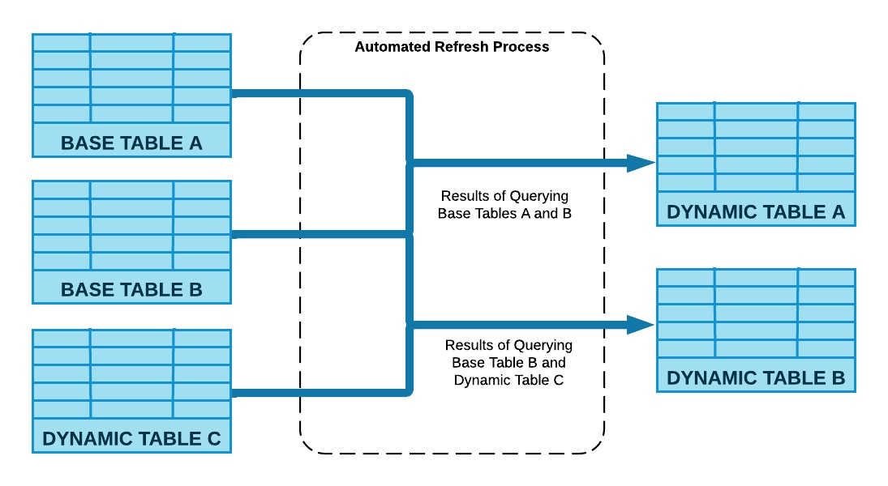
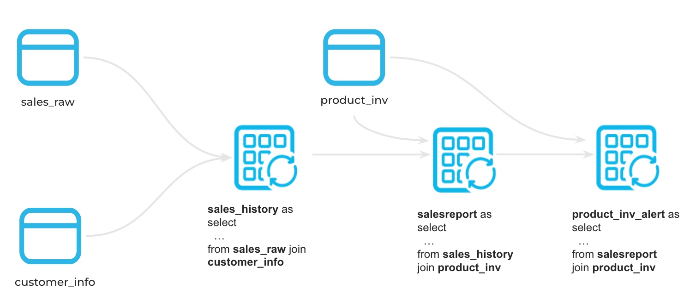
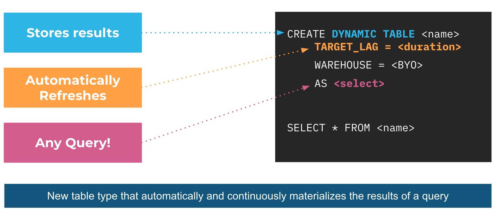
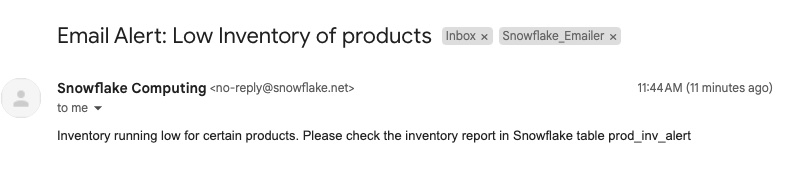
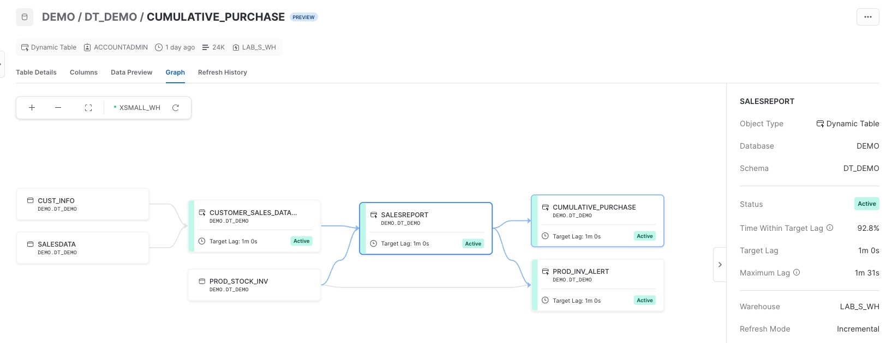

author: Parag Jain
id: getting_started_with_dynamic_tables
summary: Getting Started with Snowflake Dynamic Tables
<!--- Categories below should be hyphenated, i.e., Getting-Started. Do not leave blank. Visit site for available categories. -->
categories: Getting-Started
environments: web
status: Published 
feedback link: https://github.com/Snowflake-Labs/sfguides/issues
tags: Getting Started, Dynamic Tables, Data Engineering, Data Pipeline 

# Getting Started with Snowflake Dynamic Tables
<!-- ------------------------ -->
## Overview 
Duration: 2

Dynamic tables are new declarative way of defining your data pipeline in Snowflake. It's a new kind of Snowflake table which is defined as a query and continually and automatically materializes the result of that query as a table. Dynamic Tables can join and aggregate across multiple source objects and incrementally update results as sources change. 

Dynamic Tables can also be chained together to create a DAG for more complex data pipelines. 



Dynamic Tables are the building blocks for continuous data pipelines. They are the easiest way to build data transformation pipelines in snowflake across batch and streaming use cases. 

In this quickstart we will build a change data capture (CDC) pipeline and data validation using Dynamic tables. We will also look at some of the built in features around [Dynamic tables](https://docs.snowflake.com/user-guide/dynamic-tables-about).

### Prerequisites
- Use of the [Snowflake free 30-day trial environment](https://trial.snowflake.com) or your own Snowflake environment
- Basic knowledge of SQL, database concepts, and objects
- Familiarity with JSON semi-structured data

### What You’ll Learn 
- How to create a declarative data pipeline DAG using Dynamic tables
- How to pause and resume the data pipeline
- How to monitor Dynamic tables for continous data pipeline
- How to automate the data validation process using Dynamic tables
- How to setup data quality check alerts

### What You’ll Need 
- A [Snowflake](https://trial.snowflake.com) Account 

### What You’ll Build 
- A continous data pipeline using Dynamic tables
- Data validation automation and alerts

<!-- ------------------------ -->
## Setup
Duration: 4

- **Problem Statement**

We are data engineers at an online retail company, where a wide array of products are sold. In this role, we collect customer purchase and product sales data, initially storing it in a raw data table. Our primary tasks involve creating a continous data pipeline for generating sales reports and validate the data for an alert system to notify the team of potential low inventory levels for specific products

- **Data Pipeline Architecture**



- **Sample data**: 

We will use python "Faker" library to generate some test data required for this project. In order to run this python code we will buiild and use [Python UDTF](https://docs.snowflake.com/en/developer-guide/snowpark/python/creating-udtfs)

We are going to build our lab in a database call "demo" and schema name "dt_demo", so go to your Snowflake account and open a worksheet and write or paste this code. Feel free to use any database if "demo" database is already in use or you don't have access to it.

Open a new worksheet and call it setup

```
CREATE DATABASE IF NOT EXISTS DEMO;
CREATE SCHEMA DEMO.DT_DEMO;
```

Once the database is created, we will create 3 UDTF to generate our source data. First table is **cust_info** and insert 1000 customers into it using this new Python UDTF.

```
create or replace function gen_cust_info(num_records number)
returns table (custid number(10), cname varchar(100), spendlimit number(10,2))
language python
runtime_version=3.8
handler='CustTab'
packages = ('Faker')
as $$
from faker import Faker
import random

fake = Faker()
# Generate a list of customers  

class CustTab:
    # Generate multiple customer records
    def process(self, num_records):
        customer_id = 1000 # Starting customer ID                 
        for _ in range(num_records):
            custid = customer_id + 1
            cname = fake.name()
            spendlimit = round(random.uniform(1000, 10000),2)
            customer_id += 1
            yield (custid,cname,spendlimit)

$$;

create or replace table cust_info as select * from table(gen_cust_info(1000)) order by 1;

```

Next table is **prod_stock_inv** and insert 100 products inventory into it using this new Python UDTF.

```
create or replace function gen_prod_inv(num_records number)
returns table (pid number(10), pname varchar(100), stock number(10,2), stockdate date)
language python
runtime_version=3.8
handler='ProdTab'
packages = ('Faker')
as $$
from faker import Faker
import random
from datetime import datetime, timedelta
fake = Faker()

class ProdTab:
    # Generate multiple product records
    def process(self, num_records):
        product_id = 100 # Starting customer ID                 
        for _ in range(num_records):
            pid = product_id + 1
            pname = fake.catch_phrase()
            stock = round(random.uniform(500, 1000),0)
            # Get the current date
            current_date = datetime.now()
            
            # Calculate the maximum date (3 months from now)
            min_date = current_date - timedelta(days=90)
            
            # Generate a random date within the date range
            stockdate = fake.date_between_dates(min_date,current_date)

            product_id += 1
            yield (pid,pname,stock,stockdate)

$$;

create or replace table prod_stock_inv as select * from table(gen_prod_inv(100)) order by 1;
```

Next table is **salesdata** to store raw product sales by customer and purchase date 


```
create or replace function gen_cust_purchase(num_records number,ndays number)
returns table (custid number(10), purchase variant)
language python
runtime_version=3.8
handler='genCustPurchase'
packages = ('Faker')
as $$
from faker import Faker
import random
from datetime import datetime, timedelta

fake = Faker()

class genCustPurchase:
    # Generate multiple customer purchase records
    def process(self, num_records,ndays):       
        for _ in range(num_records):
            c_id = fake.random_int(min=1001, max=1999)
            
            #print(c_id)
            customer_purchase = {
                'custid': c_id,
                'purchased': []
            }
            # Get the current date
            current_date = datetime.now()
            
            # Calculate the maximum date (days from now)
            min_date = current_date - timedelta(days=ndays)
            
            # Generate a random date within the date range
            pdate = fake.date_between_dates(min_date,current_date)
            
            purchase = {
                'prodid': fake.random_int(min=101, max=199),
                'quantity': fake.random_int(min=1, max=5),
                'purchase_amount': round(random.uniform(10, 1000),2),
                'purchase_date': pdate
            }
            customer_purchase['purchased'].append(purchase)
            
            #customer_purchases.append(customer_purchase)
            yield (c_id,purchase)

$$;


select * from table(gen_cust_purchase(10,1));
create or replace table salesdata as select * from table(gen_cust_purchase(10000,10));
```

This completes our sample data stored in raw base tables. In real world, you will load this data into Snowflake either using COPY COMMAND, connectors, Snowpipe or [Snowpipe Streaming](https://docs.snowflake.com/en/user-guide/data-load-snowpipe-streaming-overview)

Check if there is data in all 3 raw tables -

```
-- customer information table, each customer has spending limits
select * from cust_info limit 10;

-- product stock table, each product has stock level from fulfilment day

select * from prod_stock_inv limit 10;

-- sales data for products purchsaed online by various customers
select * from salesdata limit 10;
```


<!-- ------------------------ -->
## Build data pipeline using Dynamic Tables
Duration: 7

With Dynamic Tables, customers provide a query, and Snowflake automatically materializes the results of that query. 

That means, instead of creating a separate target table and writing code to transform source data and update the data in that table, you can define the target table as a Dynamic Table, specifying the query that performs the transformation and just forget about the scheduling and orchestration. 

The user specifies a minimum acceptable freshness in the result (target lag), and Snowflake automatically tries to meet that target, further enhancing the flexibility and control data engineers can have over their pipelines without the normally associated complexity.



Ok great! lets create our first Dynamic Table. For this we will extract the sales information from the **salesdata** table and join it with **customer information** to build the **customer_sales_data_history** note that we are extracting raw json data and transforming it into meaningful columns and data type

```
CREATE OR REPLACE DYNAMIC TABLE customer_sales_data_history
    LAG='DOWNSTREAM'
    WAREHOUSE=lab_s_wh
AS
select 
    s.custid as customer_id,
    c.cname as customer_name,
    s.purchase:"prodid"::number(5) as product_id,
    s.purchase:"purchase_amount"::number(10) as saleprice,
    s.purchase:"quantity"::number(5) as quantity,
    s.purchase:"purchase_date"::date as salesdate
from
    cust_info c inner join salesdata s on c.custid = s.custid
;
```

Looking good, we will see what **DOWNSTREAM** means here in just a minute. lets run some quick sanity checks and hydrate this table by manually refreshing the DT.

```
alter dynamic table customer_sales_data_history refresh;

-- quick sanity check
select * from customer_sales_data_history limit 10;
select count(*) from customer_sales_data_history;
```

Now, lets combine these results with product table and create a SCD TYPE 2 transformation using window function "LEAD", it gives us the subsequent rows in the same result set to build a TYPE 2 transformation.

```
CREATE OR REPLACE DYNAMIC TABLE salesreport
    LAG = '1 MINUTE'
    WAREHOUSE=lab_s_wh
AS
    Select
        t1.customer_id,
        t1.customer_name, 
        t1.product_id,
        p.pname as product_name,
        t1.saleprice,
        t1.quantity,
        (t1.saleprice/t1.quantity) as unitsalesprice,
        t1.salesdate as CreationTime,
        customer_id || '-' || t1.product_id  || '-' || t1.salesdate AS CUSTOMER_SK,
        LEAD(CreationTime) OVER (PARTITION BY t1.customer_id ORDER BY CreationTime ASC) AS END_TIME
    from 
        customer_sales_data_history t1 inner join prod_stock_inv p 
        on t1.product_id = p.pid
       
;

-- Refresh Manually or wait for a minute
-- alter dynamic table salesreport refresh;

```

Wait for a minute to check the results in the salesreport table or refresh the DT manually.

```
select * from salesreport limit 10;
select count(*) from salesreport;
```

So, we just created a DAG using Dynamic Tables. It runs whenever there is data in the upstream pipeline(raw base tables), this is made possible by setting the LAG to "DOWNSTREAM". Dynamic tables lag or target lag can defined in terms of time or dependency [referred from other dynamic tables](https://docs.snowflake.com/en/user-guide/dynamic-tables-refresh#understanding-target-lag)

<!-- ------------------------ -->
## Usecase: data validation using Dynamic table

The DAG that we created above will build our data pipeline but there are many use cases of DT, like creating data validation checks or data quality etc. In our data set, we want to know if a product is running low on inventory, lets say less than 10%

```
CREATE OR REPLACE DYNAMIC TABLE PROD_INV_ALERT
    LAG = '1 MINUTE'
    WAREHOUSE=LAB_S_WH
AS
    SELECT 
        S.PRODUCT_ID, 
        S.PRODUCT_NAME,CREATIONTIME AS LATEST_SALES_DATE,
        STOCK AS BEGINING_STOCK,
        SUM(S.QUANTITY) OVER (PARTITION BY S.PRODUCT_ID ORDER BY CREATIONTIME) TOTALUNITSOLD, 
        (STOCK - TOTALUNITSOLD) AS UNITSLEFT,
        ROUND(((STOCK-TOTALUNITSOLD)/STOCK) *100,2) PERCENT_UNITLEFT,
        CURRENT_TIMESTAMP() AS ROWCREATIONTIME
    FROM SALESREPORT S JOIN PROD_STOCK_INV ON PRODUCT_ID = PID
    QUALIFY ROW_NUMBER() OVER (PARTITION BY PRODUCT_ID ORDER BY CREATIONTIME DESC) = 1
;

alter dynamic table prod_inv_alert refresh;

```
Now lets check if there are any products that has low inventory

```
-- check products with low inventory and alert
select * from prod_inv_alert where percent_unitleft < 10;
```
[Snowflake Alerts](https://docs.snowflake.com/en/user-guide/alerts) are now in Preview. This can help you send email alerts to your product procurement and inventory team to restock the required product.

```

CREATE NOTIFICATION INTEGRATION IF NOT EXISTS
    notification_emailer
    TYPE=EMAIL
    ENABLED=TRUE
    ALLOWED_RECIPIENTS=('first.last@company.com')
    COMMENT = 'email integration to update on low product inventory levels'
;

CREATE OR REPLACE ALERT alert_new_rows
  WAREHOUSE = my_warehouse
  SCHEDULE = '1 MINUTE'
  SCHEDULE = '1 MINUTE'
  IF (EXISTS (
      SELECT *
      FROM prod_inv_alert
      WHERE percent_unitleft < 10 and ROWCREATIONTIME > SNOWFLAKE.ALERT.LAST_SUCCESSFUL_SCHEDULED_TIME()
  ))
  THEN CALL SYSTEM$SEND_EMAIL(
                'notification_emailer', -- notification integration to use
                'first.last@company.com', -- Email
                'Email Alert: Low Inventory of products', -- Subject
                'Inventory running low for certain products. Please check the inventory report in Snowflake table prod_inv_alert' -- Body of email
);

-- Alerts are pause by default, so lets resume it first
ALTER ALERT alert_low_inv RESUME;

```



These alerts will only run if there is new data in the dynamic table (low inventory products). So, its super easy to manage and maintain alerts in Snowflake on live data. 

You can monitor, resume or pause alerts.

```
-- Monitor alerts in detail
SHOW ALERTS;

SELECT *
FROM
  TABLE(INFORMATION_SCHEMA.ALERT_HISTORY(
    SCHEDULED_TIME_RANGE_START
      =>dateadd('hour',-1,current_timestamp())))
WHERE
    NAME = 'ALERT_LOW_INV'
ORDER BY SCHEDULED_TIME DESC;

-- Suspend Alerts
ALTER ALERT alert_low_inv SUSPEND;

```

<!-- ------------------------ -->
## Monitor Dynamic Tables: Cost, DAG and Dashboard
Duration: 4


Snowflake makes it easier to monitor your data pipeline.

You can also monitor Dynamic Tables using the DYNAMIC_TABLE_REFRESH_HISTORY() function in INFORMATION_SCHEMA. This is sample SQL for dynamic tables in our data pipeline

```
SELECT * 
FROM 
    TABLE(INFORMATION_SCHEMA.DYNAMIC_TABLE_REFRESH_HISTORY())
WHERE 
    NAME IN ('SALESREPORT','CUSTOMER_SALES_DATA_HISTORY','PROD_INV_ALERT','CUMULATIVE_PURCHASE')
    -- AND REFRESH_ACTION != 'NO_DATA'
ORDER BY 
    DATA_TIMESTAMP DESC, REFRESH_END_TIME DESC LIMIT 10;
```

You can use Snowsight GUI to visualize and monitor the directed acyclic graph (DAG) of your pipeline. Go to **Data > Databases > DEMO > DT_DEMO > Dynamic Tables**

From Snowsight you can monitor Dynamic Table DAG, refresh history, preview data, refresh mode, columns and table ddl etc



### Cost

Dynamic tables incur cost in three ways: [details here](https://docs.snowflake.com/en/user-guide/dynamic-tables-cost)
- Storage: DT materializes the results and saves it just like a noraml snoflake tables
- Cloud service compute: You will only incur this if daily cloud service cost is over 10% of your bill (very very rare)
- Warehouse compute cost: this is associated with the warehouse you use with Dynamic Table. This is only used if there is data to be processed upstream from base tables

Dynamic tables require a virtual warehouse to perform updates. Snowflake recommends testing dynamic tables using dedicated warehouses in order to understand related costs.

### Monitor


<!------------->
## logical pause


<!-- ------------------------ -->
## Images, Videos, and Surveys, and iFrames
Duration: 2

Look at the [markdown source for this guide](https://raw.githubusercontent.com/Snowflake-Labs/sfguides/master/site/sfguides/sample.md) to see how to use markdown to generate these elements. 

### Images


### Videos
Videos from youtube can be directly embedded:
<video id="KmeiFXrZucE"></video>

### Inline Surveys
<form>
  <name>How do you rate yourself as a user of Snowflake?</name>
  <input type="radio" value="Beginner">
  <input type="radio" value="Intermediate">
  <input type="radio" value="Advanced">
</form>

### Embed an iframe


<!-- ------------------------ -->
## Conclusion
Duration: 1

At the end of your Snowflake Guide, always have a clear call to action (CTA). This CTA could be a link to the docs pages, links to videos on youtube, a GitHub repo link, etc. 

If you want to learn more about Snowflake Guide formatting, checkout the official documentation here: [Formatting Guide](https://github.com/googlecodelabs/tools/blob/master/FORMAT-GUIDE.md)

### What we've covered
- creating steps and setting duration
- adding code snippets
- embedding images, videos, and surveys
- importing other markdown files