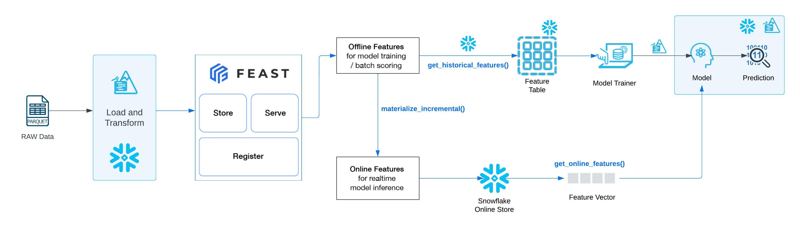
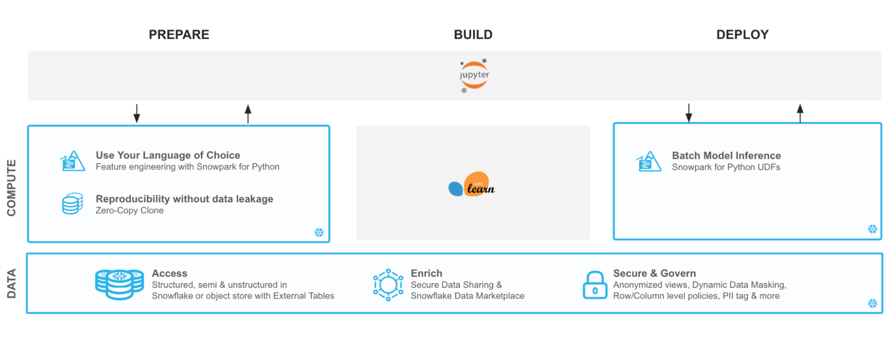

author: Rishu Saxena
id: getting_started_with_feast_snowflake
summary: This is a guide to assist users to setup Feast feature store with Snowflake for both online and offline feature stores.
categories: Getting-Started
environments: web
status: Published 
feedback link: https://github.com/Snowflake-Labs/sfguides/issues
tags: Getting Started, Data Science, Data Engineering, Twitter 

# Getting Started with Snowpark for Python and Feast
<!-- ------------------------ -->
## Overview
Duration: 6

In this guide, we'll be walking you through how to setup the integration between [Feast](https://docs.feast.dev/) and Snowflake to use Snowflake as the batch engine to perform push-down processing of data to create offline feature store. We will also be using Snowflake as an online feature store, however, configuration of Feast could be updated to easily use any Feast supported database for online feature serving. 

For both offline and online feature generation, all the operations would be pushed down on Snowflake where the source data exists. You will be able to leverage Snowflake's scalable compute to process large volumes of data and serve the features for various use cases without moving the data out of Snowflake, unless explicitly specified.



In this guide, we will be:
1. Setting up your python environment to run Snowpark Python
2. Loading and transforming data into Snowflake using Snowpark
3. Setting up Feast with Snowflake
4. Using Snowpark and Feast to walk through an end-to-end Machine Learning use case.


The source code for this quickstart is available on [GitHub](https://github.com/Snowflake-Labs/sfguide-getting-started-snowpark-python-feast).


### Prerequisites
- Working knowledge of [Python](https://www.udemy.com/course/data-analysis-with-python-and-pandas/)
- Familiarity with [Snowflake](https://quickstarts.snowflake.com/guide/getting_started_with_snowflake/index.html#0)
- Familiarity with Git/GitHub
- Familiarity with [Snowpark Python](https://quickstarts.snowflake.com/guide/getting_started_snowpark_machine_learning/index.html?index=..%2F..index#0)
- Familiarity with [Feast feature store concepts](https://docs.feast.dev/getting-started/architecture-and-components/overview) and [Feast feature store architecture](https://docs.feast.dev/getting-started/architecture-and-components/overview)

### What You’ll Learn 

1. Loading and transforming data using Snowpark Python
2. Setting up Feast to use Snowflake as the batch engine, online store and offline store
3. Use Offline store to create training dataset
4. Train the model using the offline feature store
5. Use online store to extract a feature vector and unit test the model inference
6. Perform Model validation
7. Deploy the model on Snowflake for batch inference
8. Perform batch scoring of data using the deployed model 

### What You’ll Need 
- A Snowflake Account with [Anaconda Integration enabled by ORGADMIN](https://docs.snowflake.com/en/developer-guide/udf/python/udf-python-packages.html#using-third-party-packages-from-anaconda) - if you do not already have a Snowflake account, you can register for a [free trial account](https://signup.snowflake.com/)
- A Snowflake login with the `ACCOUNTADMIN` role. If you have this role in your corporate environment, you may choose to use it directly. If not, you will either need to (1) register for a free trial account above, (2) use a different role that has the ability to create and use a database, schema and tables, and UDFs (edit the `config.py` file and Jupyter notebooks to use this alternative role), OR (3) use an existing database and schema in which you can create tables and UDFs (edit the `config.py` file and notebook to use that role, database, and schema). If you're confused, it is best to just sign up for a free Enterprise-level trial account via the link above.
- Python 3.8
- Jupyter Notebook
- ADMIN access on your working machine to install Snowpark, Feast and required dependencies.

### What You’ll Build 
You will build an end-to-end data science workflow leveraging Snowpark for Python to load, clean and prepare data, Feast to use the data and create online and offline feature stores utilising Snowflake infrastructure for required data processing, build a model using offline store, and lastly, deploy our trained model in Snowflake using Python UDF for inference.

<!-- ------------------------ -->
## Use-Case: Predicting Customer Churn
Duration: 2

You are part of a team of data engineers and data scientists at a Telecom company that has been tasked to reduce customer churn using a machine learning based solution. 

To build this, you have access to customer demographic and billing data. Using Snowpark, we will ingest, analyse and transform this data to train a model that will then be deployed inside Snowflake to score new data. 



With Snowflake, it is easy to make all relevant data instantly accessible to your machine learning models whether it is for training or inference. For this guide, we are going to do all of our data and feature engineering with Snowpark for Python but users can choose to work with SQL or any of the other Snowpark supported languages including Java and Scala without the need for separate environments. 

To streamline your path to production, we will learn how to bring trained models (whether trained inside Snowflake or in an external environment) to run directly inside Snowflake as a UDF bringing models where the data and data pipelines live. 

<!-- ------------------------ -->
## Setup - Snowpark Python
Duration: 5

Let's set up the Python environment necessary to run this quickstart:

1. First, clone the source code for this repo to your local environment:
```bash
git clone https://github.com/Snowflake-Labs/sfguide-getting-started-snowpark-python-feast.git
cd sfguide-getting-started-snowpark-python-feast/
```

### Snowpark Python via Anaconda
2. If you are using [Anaconda](https://www.anaconda.com/python-r-distribution?utm_campaign=python&utm_medium=online-advertising&utm_source=google&utm_content=anaconda-download&gclid=Cj0KCQjwnNyUBhCZARIsAI9AYlFtPjClvSFJ8hUR4_IAtlQiDbNOm1QwqIzwf_bQvduX_OmrS8wtz5QaAhi8EALw_wcB) on your local machine, create a conda env for this quickstart:
```bash
conda env create -f jupyter_env.yml
conda activate getting_started_snowpark_python
```

Conda will automatically install `snowflake-snowpark-python` and all other dependencies for you.

3. Once Snowpark is installed, create a kernel for Jupyter:
```bash
python -m ipykernel install --user --name=getting_started_snowpark_python
```

4. Now, launch Jupyter Notebook on your local machine:
```bash
jupyter notebook
```

5. Open the `config.py` file located in the cloned git repository and modify with your account, username, and password information:

Now, you are ready to get started with the notebooks. For the first and the third notebooks, make sure that you select the `getting_started_snowpark_python` kernel when running. You can do this by navigating to: `Kernel -> Change Kernel` and selecting `getting_started_snowpark_python` after launching each Notebook.

### Apple M1
There is a known issue with running Snowpark Python on Apple M1 chips due to memory handling in pyOpenSSL.
Please refer to the Snowpark documentation to solve this issue:
[Issue with running Snowpark Python on Apple M1 chips](https://docs.snowflake.com/en/developer-guide/snowpark/python/setup.html#prerequisites)

<!-- ------------------------ -->
## Load Data Using Snowpark Python Client API
Duration: 10

**Persona**: DBA/Platform Administrator/Data Engineer

**What You'll Do**: 
- Establish the Snowpark Python session
- Create the database, schema, and warehouses needed for the remainder of the lab
- Load raw parquet data into Snowflake using Snowpark Python
- Process raw data into tables. This transformed data will be used as source for Feast Feature Store.

Open up the [`01-Load-Data-with-Snowpark`](https://github.com/Snowflake-Labs/sfguide-getting-started-snowpark-python-feast/blob/main/01-Load-Data-with-Snowpark.ipynb) Jupyter notebook and run each of the cells to explore loading and transforming data with Snowpark Python.

<!-- ------------------------ -->
## Setup - Feast on Snowflake
Duration: 20

**Persona**: ML Engineer/Data Scientist 

**What You'll Do**: 
- Install and Setup Feast on Snowflake
- Unit your Feast integration by creating Online and Offline Feature Stores

Open up the [`02-Install-and-Setup-Feast-Feature-Store`](https://github.com/Snowflake-Labs/sfguide-getting-started-snowpark-python-feast/blob/main/02-Install-and-Setup-Feast-Feature-Store.ipynb) Jupyter notebook.

**Note:** 
1. There are required setup instructions in this notebook that require a terminal CLI for execution. In this notebook, you will be toggling between your notebook and the terminal window. Do not skip any instructions to ensure a successful setup. 
2. Feast repository is installed on your machine, that is used to setup this guide, as part of this setup.

<!-- ------------------------ -->
## Build and Deploy ML Model using Snowpark Python and Feast
Duration: 15

**Persona**: Data Scientist/ML Engineer

**What You'll Do**: 
- Generate training dataset using offline feature store
- Train a model using the training dataset
- Materialize the online feature store
- Unit test the model using Feature vector generated using Online Feature Store
- Perform model validation
- Deploy the model into Snowflake for inference using Snowpark Python UDFs and SQL

Open up the [`03-Snowpark-UDF-Deployment`](https://github.com/Snowflake-Labs/sfguide-getting-started-snowpark-python-feast/blob/main/03-Snowpark-UDF-Deployment.ipynb) Jupyter notebook and run each of the cells to train a model and deploy it for in-Snowflake inference using Snowpark Python UDFs

<!-- ------------------------ -->
## Conclusion
Duration: 2

Through this Quickstart we were able to experience how Feast could be setup to utilise Snowflake as processing engine to create offline as well as offline feature stores. You experienced push down processing for the generation of offline and online features. This is particularly useful when you are dealing with very large datasets. Here’s what you were able to complete:

- Load and transform data via Snowpark
- Setup up Feast on Snowflake
- Use Offline feature store to generate training dataset
- Materialise online feature store and use feature vector to unit test the trained model
- Deploy a trained machine learning model in Snowflake as Python UDF
- Run an inference using both Python as well as SQL language

For more information on Snowpark Python, and Machine Learning in Snowflake, check out the following resources:
- [Snowpark Python Developer Guide](https://docs.snowflake.com/en/developer-guide/snowpark/python/index.html)
- [Snowpark Python API Docs](https://docs.snowflake.com/en/developer-guide/snowpark/reference/python/index.html)

For more information on Feast on Snowflake, check out the following resources:
- [Running Feast with Snowflake](https://docs.feast.dev/how-to-guides/feast-snowflake-gcp-aws)
