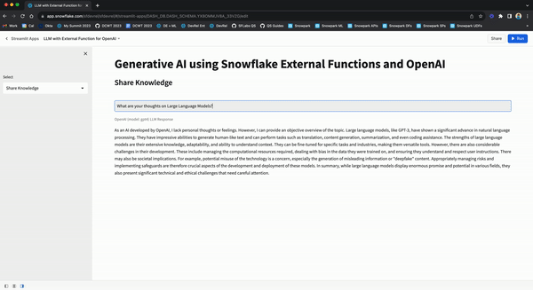
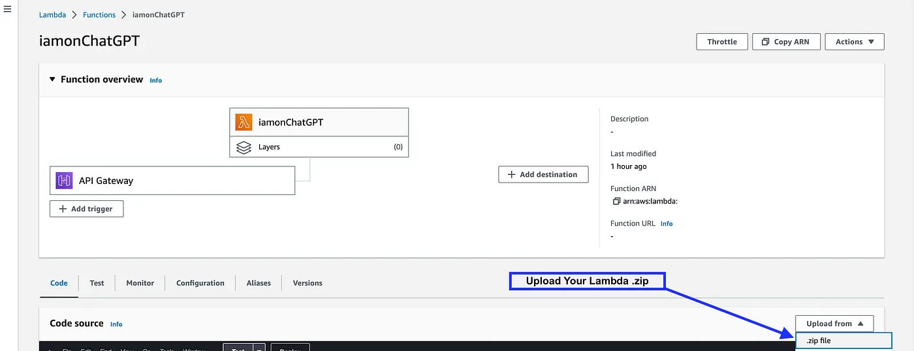
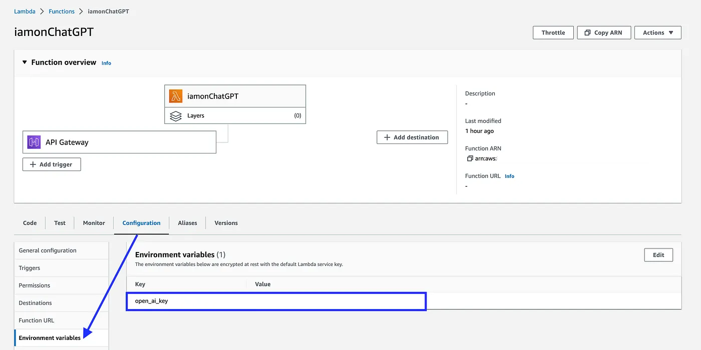
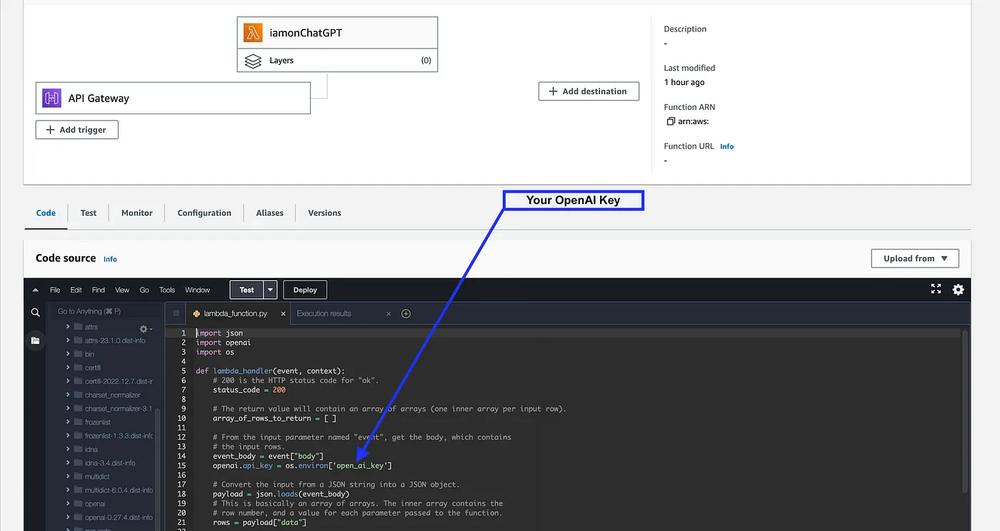
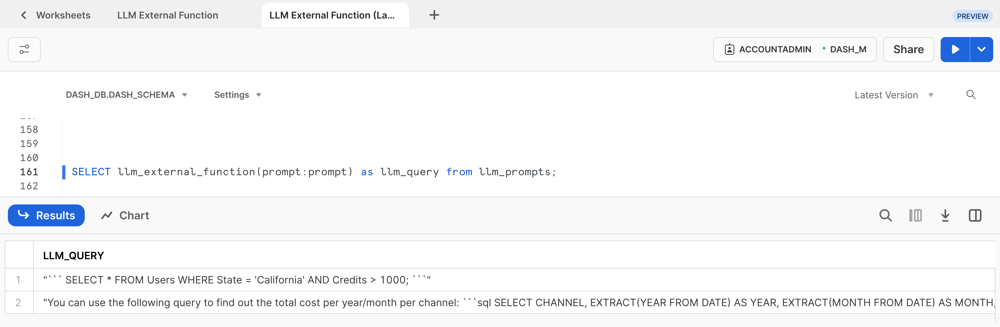
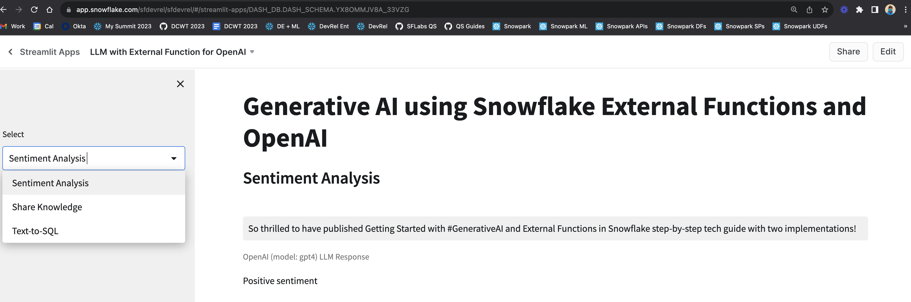
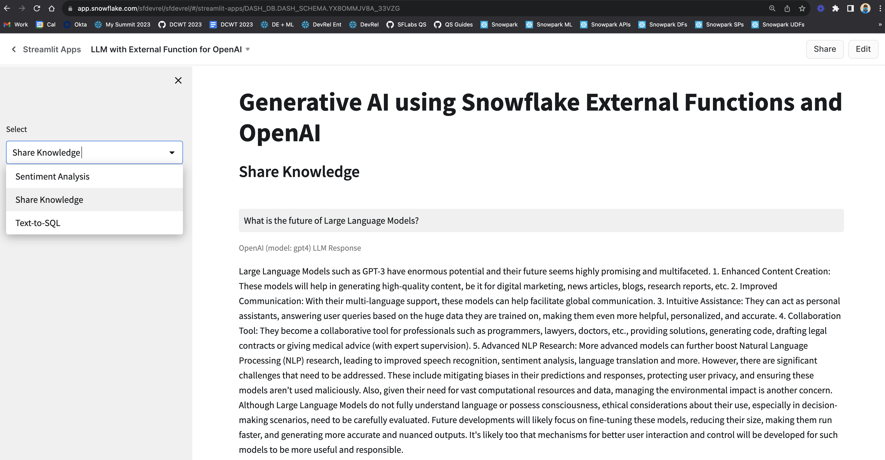
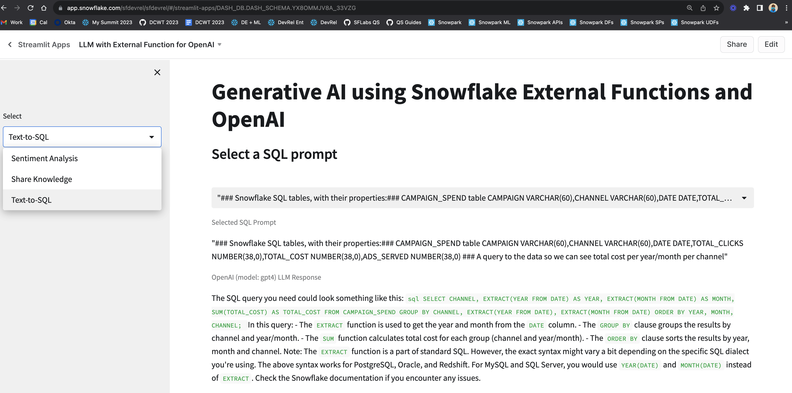

id: getting_started_with_generative_ai_snowflake_external_functions
summary: Getting Started with Generative AI in Snowflake and Streamlit
categories: featured,getting-started,app-development
environments: web
status: Published
feedback link: <https://github.com/Snowflake-Labs/sfguides/issues>
tags: Getting Started, Generative AI, Snowflake External Access, Snowflake External Functions, OpenAI
authors: Dash Desai

# Getting Started with Generative AI in Snowflake and Streamlit
<!-- ------------------------ -->
## Overview

Duration: 5

By completing this guide, you will be able to deploy different implementations of integrating Large Language Models (LLMs) such as OpenAI using External Access and External Functions in Snowflake.



**Implementation 1: Use External Access from Snowpark**

In this implementation, we will use [External Access](https://docs.snowflake.com/en/developer-guide/external-network-access/external-network-access-overview) to securely connect to the OpenAI API from [Snowpark](https://docs.snowflake.com/en/developer-guide/snowpark/index), the set of libraries and runtimes in Snowflake that run non-SQL code, including Python, Java and Scala. External Access provides flexibility to reach public internet endpoints from the Snowpark sandbox without any additional infrastructure setup.

**Implementation 2: Use AWS API Gateway**

In this implementation, we will use AWS API Gateway as a proxy for calling OpenAI API from Snowflake and then create an external function in Snowflake that uses the AWS API Gateway to directly call and interact with OpenAI API.

**Implementation 3: Use AWS Lambda**

In this implementation, we will wrap the OpenAI API in a AWS Lambda function which can then be accessed via external function in Snowflake.

**Differences and Similarities between AWS API Gateway and AWS Lambda implementations**

Here are some key differences and similarities between the two implementations.

* Using the AWS API Gateway as a proxy (without a Lambda function) is the simplest and quickest way to call public APIs from Snowflake; not just OpenAI API as highlighted in this blog.
* The use of Lambda function enables the creation of an abstraction layer with the ability to embed custom logic/code. For example, you could wrap multiple APIs and use the same external function in Snowflake to call them based on a parameter passed into the Lambda function.
* In both cases, you can call the external function for use cases like generating SQL based on natural language, performing sentiment analysis on Tweets, or any other LLM-powered use case, directly from Snowflake. **IMP NOTE**: Depending on how you construct the prompts, your data could be leaving Snowflake and beyond its security and governance perimeter so please be mindful of that.
* The other thing to consider is [Amazon API Gateway pricing](https://aws.amazon.com/api-gateway/pricing/) and [AWS Lambda pricing](https://aws.amazon.com/lambda/pricing/).

### What You Will Learn

* How to use External Access to securely connect to the OpenAI API from Snowpark
* How to use AWS API Gateway as a proxy for calling OpenAI API from Snowflake
* How to wrap OpenAI API in a AWS Lambda function which can be accessed via external function in Snowflake

### Prerequisites

* A Snowflake account - [Sign-in or create a free trial account](https://signup.snowflake.com/)
* A OpenAI account - [Sign-in or create an account](https://openai.com/)
  * [OpenAI API Key](https://platform.openai.com/account/api-keys)
* AWS Account

<!-- ------------------------ -->
## Use External Access

Duration: 10

In this implementation, we will use External Access to securely connect to the OpenAI API from Snowpark Python.

### Step 1

Create a [Secret](https://docs.snowflake.com/en/sql-reference/sql/create-secret) object in Snowflake to securely store your OpenAI API key.

```sql
CREATE OR REPLACE SECRET dash_open_ai_api
 TYPE = GENERIC_STRING
 SECRET_STRING = 'YOUR_OPENAI_API_KEY';
```

### Step 2

Create a [Network Rule](https://docs.snowflake.com/en/sql-reference/sql/create-network-rule) object in Snowflake.

```sql
CREATE OR REPLACE NETWORK RULE dash_apis_network_rule
 MODE = EGRESS
 TYPE = HOST_PORT
 VALUE_LIST = ('api.openai.com');
```

### Step 3

Create a [External Access Integration](https://docs.snowflake.com/en/sql-reference/sql/create-external-access-integration) object in Snowflake.

```sql
CREATE OR REPLACE EXTERNAL ACCESS INTEGRATION dash_external_access_int
 ALLOWED_NETWORK_RULES = (dash_apis_network_rule)
 ALLOWED_AUTHENTICATION_SECRETS = (dash_open_ai_api)
 ENABLED = true;
```

### Step 4

Create Snowpark Python function in Snowflake

```sql
CREATE OR REPLACE FUNCTION CHATGPT_4(query varchar)
RETURNS STRING
LANGUAGE PYTHON
RUNTIME_VERSION = 3.9
HANDLER = 'complete_me'
EXTERNAL_ACCESS_INTEGRATIONS = (dash_external_access_int)
SECRETS = ('openai_key' = dash_open_ai_api)
PACKAGES = ('openai')
AS
$$
import _snowflake
import openai
def complete_me(QUERY):
    openai.api_key = _snowflake.get_generic_secret_string('openai_key')
    messages = [{"role": "user", "content": QUERY}]
    model="gpt-4"
    response = openai.ChatCompletion.create(model=model,messages=messages,temperature=0,)    
    return response.choices[0].message["content"]
$$;
```

### **Call Function in Snowflake**

Assuming you have completed all the prerequites, calling the function is as simple as follow:

#### **Example 1**

```sql
SELECT CHATGPT_4('Describe Snowflake external access to a non-technical user') as chatgpt_4_response;
```

***Sample response:*** *"Snowflake external access is like a secure door that allows specific, approved outside sources to access and interact with your Snowflake data. This could be other software applications or services that need to use the data stored in Snowflake for various tasks. 
This access is controlled by strict security measures to ensure only authorized users or systems can access the data. It's similar to how you might use a key or passcode to unlock your front door, allowing only trusted individuals to enter your home."*

#### **Example 2**

```sql
SELECT CHATGPT_4('What do you think of the Data Cloud World Tour') as chatgpt_4_response;
```

***Sample response:*** *As an artificial intelligence, I don't have personal opinions. However, I can tell you that the Data Cloud World Tour is generally well-regarded for providing valuable insights into the latest trends and best practices in data management, analytics, and cloud technology. It offers opportunities for networking and learning from industry experts."*

<!-- ------------------------ -->
## Use AWS API Gateway

Duration: 20

### Step 1

Download [CloudFormation Template (CFT)](https://github.com/Snowflake-Labs/sfguide-getting-started-with-generative-ai-snowflake-external-functions-streamlit/blob/main/openai_aws_api_gateway/AWS_API_Gateway_CFT.yml).

### Step 2

In the YAML file, search for **openAIAPIKey** in the template and replace "<Your_OPENAI_API_KEY>" with your OpenAI API Key.

### Step 3

In your AWS Management Console, [create a CloudFormation stack](https://docs.aws.amazon.com/AWSCloudFormation/latest/UserGuide/cfn-console-create-stack.html) using the CFT you downloaded and updated in steps 1 and 2.

### Step 4

Once the CloudFormation stack has been successfully created:

* Create [API Integration](https://docs.snowflake.com/en/sql-reference/external-functions-creating-aws-common-api-integration) object in Snowflake
* Set up a [trust relationship](https://docs.snowflake.com/en/sql-reference/external-functions-creating-aws-common-api-integration-proxy-link) between Snowflake and IAM (Identity and Access Management) role **openAIAPIGatewayRole** created using the CFT.

For reference purposes, here's what the API Integration SQL should look like:

```sql
CREATE API INTEGRATION AWS_OPENAI_INTEGRATION
API_PROVIDER = 'AWS_API_GATEWAY'
API_AWS_ROLE_ARN = 'arn:aws:iam::xxxxxxxxxx:role/openAIAPIGatewayRole'
API_ALLOWED_PREFIXES = ('https://xxxxxxxxxx.execute-api.us-west-1.amazonaws.com/main/v1/completions')
ENABLED = true;
```

And here's what the Policy Document for setting up trust relationship should look like:

```json
{
    "Version": "2012-10-17",
    "Statement": [
        {
            "Effect": "Allow",
            "Principal": {
                "AWS": "arn:aws:sts::xxxxxxxxxx:assumed-role/openAIAPIGatewayRole/snowflake"
            },
            "Action": "execute-api:Invoke",
            "Resource": "arn:aws:execute-api:us-west-1:xxxxxxxxxx:1dhzbxau2m/*"
        }
    ]
}
```

### Step 5

Create [request and response translators](https://docs.snowflake.com/en/sql-reference/external-functions-translators) in Snowsight for the OpenAI API as shown below.

```sql
CREATE OR REPLACE FUNCTION OPENAI_COMPLETIONS_REQUEST_TRANSLATOR("EVENT" OBJECT)
RETURNS OBJECT
LANGUAGE JAVASCRIPT
AS '
return {"body": {
"model": "text-davinci-003",
"prompt": EVENT.body.data[0][1],
"temperature": 0,
"max_tokens": 100,
"top_p": 1,
"frequency_penalty": 0.0,
"presence_penalty": 0.0
}
};';
```

```sql
CREATE OR REPLACE FUNCTION OPENAI_COMPLETIONS_RESPONSE_TRANSLATOR("EVENT" OBJECT)
RETURNS OBJECT
LANGUAGE JAVASCRIPT
AS '
let array_of_rows_to_return = [[0, EVENT.body]];
return {"body": {"data": array_of_rows_to_return}};
';
```

Learn more about [OpenAI's Completions API](https://platform.openai.com/docs/api-reference/completions).

### Step 6

The final step is to create the external function using the API integration and request/response translator objects created in previous steps.

For your reference, here's what the SQL should look like for creating the external function:

```sql
CREATE OR REPLACE EXTERNAL FUNCTION OPENAI_EXT_FUNC("QUESTION" VARCHAR(16777216))
RETURNS VARIANT
API_INTEGRATION = "AWS_OPENAI_INTEGRATION"
MAX_BATCH_ROWS = 100
REQUEST_TRANSLATOR = OPENAI_COMPLETIONS_REQUEST_TRANSLATOR
RESPONSE_TRANSLATOR = OPENAI_COMPLETIONS_RESPONSE_TRANSLATOR
AS 'https://xxxxxxxxxx.execute-api.us-west-1.amazonaws.com/main/v1/completions';
```

> aside positive
> IMPORTANT: Depending on your current user role in Snowflake, you may need to grant usage of this function to the role like so GRANT USAGE ON FUNCTION OPENAI_EXT_FUNC(VARCHAR) TO <ROLE_NAME>;

### **Call External Function in Snowflake**

Assuming everything has gone well so far, calling the external function to invoke OpenAI API via API Gateway is as simple as follows:

#### **Example 1**

```sql
select OPENAI_EXT_FUNC('Classify this sentiment: OpenAI is Awesome!')::VARIANT:choices[0]:text as response;
```

***Sample response:*** *"Positive"*

#### **Example 2**

```sql
select OPENAI_EXT_FUNC('Create a SQL statement to find all users who live in California and have over 1000 credits')::VARIANT:choices[0]:text as response;
```

***Sample response:*** *"SELECT * FROM users WHERE state = 'California' AND credits > 1000;"*

#### **Example 3**

```sql
select OPENAI_EXT_FUNC('### Snowflake SQL tables, with their properties:### CAMPAIGN_SPEND table CAMPAIGN VARCHAR(60),CHANNEL VARCHAR(60),DATE DATE,TOTAL_CLICKS NUMBER(38,0),TOTAL_COST NUMBER(38,0),ADS_SERVED NUMBER(38,0) ### A query to the data so we can see total cost per year/month per channel')::VARIANT:choices[0]:text as response;
```

***Sample response:*** *"SELECT YEAR(DATE) AS YEAR, MONTH(DATE) AS MONTH, CHANNEL, SUM(TOTAL_COST) AS TOTAL_COST FROM CAMPAIGN_SPEND GROUP BY YEAR(DATE), MONTH(DATE),CHANNEL ORDER BY YEAR, MONTH, CHANNEL;"*

<!-- ------------------------ -->
## Use AWS Lambda

Duration: 20

For this implementation, you can leverage some of the existing objects you may have already created in the first implementation (AWS API Gateway), but assuming you want to keep the two implementations and environments separate, here are the steps that will get you up and running.

First I’d recommend that you set up the environment to create and test a simple external function using Lambda on AWS. For that, follow these very detailed instructions.

* [Planning an External Function for AWS](https://docs.snowflake.com/en/sql-reference/external-functions-creating-aws-planning.html)
* [Creating an External Function for AWS Using the AWS Management Console](https://docs.snowflake.com/en/sql-reference/external-functions-creating-aws-ui)
* [Calling an External Function for AWS](https://docs.snowflake.com/en/sql-reference/external-functions-creating-aws-call.html)
* [Troubleshooting External Functions for AWS](https://docs.snowflake.com/en/sql-reference/external-functions-creating-aws-troubleshooting.html)

After you have successfully created and tested your external function with Lambda on AWS as per the instructions outlined above, follow steps below to wrap OpenAI API in your AWS Lambda function.

> aside negative
> NOTE: This implementation uses the latest **gpt4** model along with the new [Chat Completions API](https://platform.openai.com/docs/guides/gpt/chat-completions-api).

### Step 1

Clone [GitHub repo](https://github.com/Snowflake-Labs/sfguide-getting-started-with-generative-ai-snowflake-external-functions-streamlit/tree/main).

### Step 2

* On your local machine where you have cloned the repo, browse to the folder **openai_llm_lambda_function_wrapper**. This folder contains OpenAI Python Library installed via pip and the custom Lambda function code that wraps OpenAI API.

* Then create a .zip of the contents of **openai_llm_lambda_function_wrapper** folder on your local machine.

> aside positive
> IMPORTANT: Make sure you create the .zip of the contents and not at the root level.

### Step 3

Browse to your Lambda Function in AWS Management Console and upload the .zip file as shown below.



### Step 4

Click on **Configuration** > **Environment variables** and add a new **Key** called ***open_ai_key*** and add your OpenAI API Key as **Value** as shown below.



This ***open_ai_key*** environment variable is referenced in the Lambda function as shown below.



### **Call External Function in Snowflake**

Let's first create a sample table and insert some example prompts.

```sql
CREATE or REPLACE TABLE llm_prompts (
prompt variant
);

INSERT INTO llm_prompts
select parse_json(column1) as prompt
from values
('{"prompt":"Create a SQL statement to find all users who live in California and have over 1000 credits"}'),
('{"prompt": "### Snowflake SQL tables, with their properties:### CAMPAIGN_SPEND table CAMPAIGN VARCHAR(60),CHANNEL VARCHAR(60),DATE DATE,TOTAL_CLICKS NUMBER(38,0),TOTAL_COST NUMBER(38,0),ADS_SERVED NUMBER(38,0) ### A query to the data so we can see total cost per year/month per channel"}');
```

> aside positive
> IMPORTANT: In the following SQL statement examples, replace **llm_external_function** with the name of the function that you created in [Create the External Function for AWS in Snowflake](https://docs.snowflake.com/en/sql-reference/external-functions-creating-aws-common-ext-function) step.

#### **Example 1**

Execute the following SQL statement to call the external function for each prompt in the above table.

```sql
SELECT prompt,llm_external_function(prompt:prompt) as llm_query 
from llm_prompts;
```

If all goes well, you should see output similar to the one shown below:



#### **Example 2**

Now let’s assume you have a Snowflake table named CAMPAIGN_SPEND with the following columns:

```sql
CAMPAIGN VARCHAR(60)
CHANNEL VARCHAR(60)
DATE DATE
TOTAL_CLICKS NUMBER(38,0)
TOTAL_COST NUMBER(38,0)
ADS_SERVED NUMBER(38,0)
```

In that case, you can provide a verbose prompt like so:

```"### Snowflake SQL table with their properties:
### CAMPAIGN_SPEND table CAMPAIGN VARCHAR(60),CHANNEL VARCHAR(60),DATE DATE,
TOTAL_CLICKS NUMBER(38,0),TOTAL_COST NUMBER(38,0),ADS_SERVED NUMBER(38,0) 
### A query to the data so we can see total cost per year/month per channel"
```

***Sample response:*** *"Sure, here's a simple query that will provide total spend per year, per month, and per channel: SELECT CHANNEL, EXTRACT (YEAR FROM DATE) as YEAR, EXTRACT (MONTH FROM DATE) as MONTH, SUM(TOTAL_COST) as TOTAL_SPEND FROM CAMPAIGN_SPEND GROUP BY CHANNEL, YEAR, MONTH ORDER BY YEAR, MONTH, CHANNEL; This query performs a simple aggregation operation on the CAMPAIGN_SPEND table, grouping the data by the channel and the year and month of the DATE attribute. The SUM function computes the total cost for each such group, and ORDER BY clause orders the output by Year, Month, and Channel. Make sure to replace CAMPAIGN_SPEND with the actual table name you are using."*

<!-- ------------------------ -->
## Streamlit Application

Duration: 5

If you have Streamlit in Snowflake (currently in Preview) enabled, then follow these steps to create and run the Streamlit application in Snowsight.

**Step 1.** Click on **Streamlit** on the left navigation menu

**Step 2.** Click on **+ Streamlit App** on the top right

**Step 3.** Enter **App name**

**Step 4.** Select **Warehouse** (X-Small) and **App location** (Database and Schema) where you'd like to create the Streamlit applicaton

**Step 5.** Click on **Create**

- At this point, you will be provided code for an example Streamlit application

**Step 6.** Replace sample application code displayed in the code editor on the left with the code provided in [streamlit.py](https://github.com/Snowflake-Labs/sfguide-getting-started-with-generative-ai-snowflake-external-functions-streamlit/blob/main/streamlit_sis.py)

**Step 7.** Click on **Run** on the top right

**Step 8.** Select one of the options from the sidebar **Sentiment Analysis**, **Share Knowledge**, or **Text-to-SQL** and enter your prompt on the right to get a response.

If all goes well, you should see the app in Snowsight as shown below with sample prompts and responses.



---



---



<!-- ------------------------ -->
## Conclusion And Resources

Congratulations! You've successfully deployed different implementations of integrating Large Language Models (LLMs) such as OpenAI using External Access and External Functions in Snowflake.

We would love your feedback on this QuickStart Guide! Please submit your feedback using this [Feedback Form](https://docs.google.com/forms/d/e/1FAIpQLScZHo42elucqHYG4SVobJ6qMbpxhbM8GWDK3QgOC-QNcb2XMA/viewform).

### What You Learned

* How to use External Access to securely connect to the OpenAI API from Snowpark
* How to use AWS API Gateway as a proxy for calling OpenAI API from Snowflake
* How to wrap OpenAI API in a AWS Lambda function which can be accessed via external function in Snowflake

### Related Resources

* [Demo on Snowflake Demo Hub](https://developers.snowflake.com/demos/generative-ai-llm-snowflake/)
* [External Access in Snowflake](https://docs.snowflake.com/en/developer-guide/external-network-access/external-network-access-overview)
* [External Functions in Snowflake](https://docs.snowflake.com/en/sql-reference/external-functions)
* [API Integration in Snowflake](https://docs.snowflake.com/en/sql-reference/external-functions-creating-aws-common-api-integration)
* [Request and Response Translators in Snowflake](https://docs.snowflake.com/en/sql-reference/external-functions-translators)
* [OpenAI's Completions API](https://platform.openai.com/docs/api-reference/completions)
