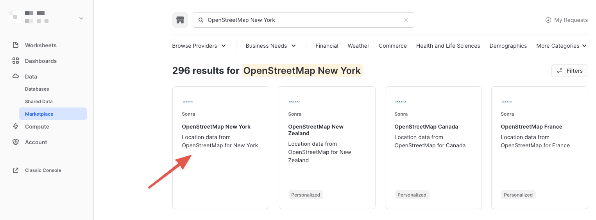
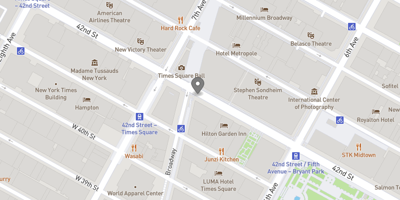
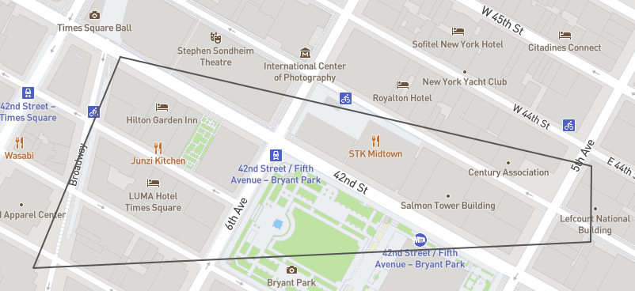
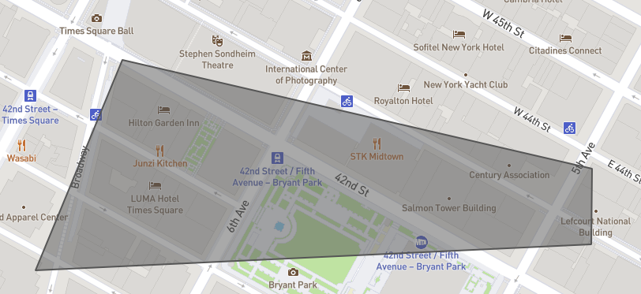
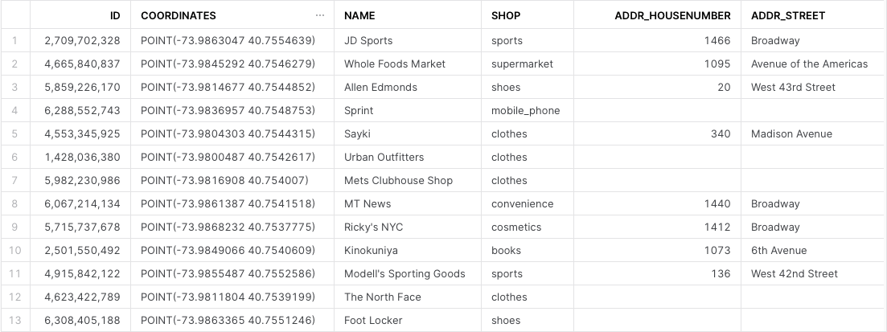
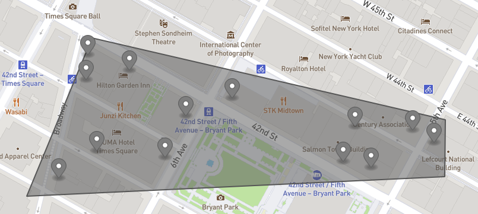

summary: 지리 공간 데이터 활용기
id: getting_started_with_geospatial_geography_kr
categories: Getting Started
environments: web
status: Hidden
feedback link: https://github.com/Snowflake-Labs/sfguides/issues
tags: 스노우플레이크 시작하기, SQL, Geospatial, kr
author: Kevin McGinley

# 지리 공간 데이터 활용기

<!-- ------------------------ -->
## 개요

Duration: 10

Snowflake의 지리 공간 쿼리 기능은 지리 공간 오브젝트를 대상으로 계산을 분석, 구성 및 실행하는 데 사용할 수 있는 데이터 타입과 특화된 쿼리 기능의 조합을 기반으로 구축되었습니다. 이 가이드에서는 `GEOGRAPHY` 데이터 타입을 소개하며 여러분이 Snowflake에서 지원하는 지리 공간 형식을 이해할 수 있도록 돕습니다. 또한 Snowflake Marketplace에서 가져온 샘플 지리 공간 데이터 세트에 다양한 함수를 사용하는 방법을 안내합니다.

### 사전 필요 조건 및 지식

- 짧은 [Snowflake 소개](https://www.youtube.com/watch?v=fEtoYweBNQ4&ab_channel=SnowflakeInc.) 동영상
- Snowflake [데이터 로딩 기본 사항](https://www.youtube.com/watch?v=us6MChC8T9Y&ab_channel=SnowflakeInc.) 동영상

### 학습할 내용

- Snowflake Marketplace에서 지리 공간 데이터 습득 방법
- `GEOGRAPHY` 데이터 타입 해석 방법
- `GEOGRAPHY`가 표현될 수 있는 다양한 형식을 이해하는 방법
- 지리 공간 데이터 언로드/로드 방법
- 쿼리에서 지리 공간 함수 파서, 생성자 및 계산 사용 방법
- 지리 공간 조인 수행 방법

### 필요한 것

- 지원되는 Snowflake [브라우저](https://docs.snowflake.com/en/user-guide/setup.html)
- [Snowflake 평가판](https://signup.snowflake.com/) 등록
  - 또는 `ACCOUNTADMIN` 역할이나 `IMPORT SHARE` 권한을 가진 기존 Snowflake 계정에 대한 액세스 보유
- [geojson.io](https://geojson.io) 또는 [WKT Playground](https://clydedacruz.github.io/openstreetmap-wkt-playground/) 웹 사이트에 대한 액세스

### 구축할 것

- 뉴욕의 관심 지점과 관련된 샘플 사용 사례.

<!-- ------------------------ -->
## Marketplace 데이터 습득

Duration: 20

이 가이드의 첫 단계는 Snowflake 지리 공간 기능의 기본 사항을 탐색하기 위해 자유롭게 사용할 수 있는 지리 공간 데이터 세트를 습득하는 것입니다. 이 데이터를 습득할 최적의 장소는 Snowflake Marketplace입니다!

### Snowflake의 Preview 웹 UI에 액세스

[app.snowflake.com](https://app.snowflake.com)

처음으로 새로운 Preview Snowflake UI에 로그인하는 것이라면 평가판을 습득할 때 받았던 여러분의 계정 이름 또는 계정 URL 입력을 요청하는 프롬프트가 나타납니다. 계정 URL에는 여러분의 [계정 이름](https://docs.snowflake.com/en/user-guide/connecting.html#your-snowflake-account-name)과 잠재적으로 지역이 포함되어 있습니다.

`Sign-in`을 클릭하면 여러분의 사용자 이름과 암호를 요청하는 프롬프트가 나타납니다.

Positive
: 처음으로 새로운 Preview Snowflake UI에 로그인하는 것이 아니라면 'Select an account to sign into' 프롬프트와 그 아래에 나열된 여러분의 계정을 위한 버튼이 나타나야 합니다. 액세스하고자 하는 계정을 클릭하면 여러분의 사용자 이름과 암호(또는 기타 인증 메커니즘)를 요청하는 프롬프트가 나타납니다.

### 계정 권한 확장

새로운 Preview Snowflake 웹 인터페이스는 다양한 기능을 제공하지만 지금은 여러분의 현재 역할을 기본값인 `SYSADMIN`에서 `ACCOUNTADMIN`으로 전환합니다. 이 권한 확장을 통해 Snowflake Marketplace 목록에서 공유 데이터베이스를 생성할 수 있습니다.

Positive : `ACCOUNTADMIN` 역할이 없다면 대신 `IMPORT SHARE` 권한을 가진 역할로 전환합니다.


### 가상 웨어하우스 생성(필요할 경우)

쿼리를 실행할 가상 웨어하우스에 대한 액세스가 아직 없다면 가상 웨어하우스를 하나 생성해야 합니다.

- 창 왼쪽에 있는 메뉴를 사용하여 `Compute > Warehouses` 화면으로 이동합니다
- 창 오른쪽 상단에 있는 큰 파란색 `+ Warehouse` 버튼을 클릭합니다
- 아래 화면에서 보이는 것처럼 X-Small Warehouse를 생성합니다


`Suspend After (min)` 필드를 1분으로 변경하여 컴퓨팅 크레딧이 낭비되지 않도록 합니다.

### Snowflake Marketplace에서 데이터 습득

이제 Snowflake Marketplace에서 샘플 지리 공간 데이터를 습득할 수 있습니다.

- 창 왼쪽에 있는 메뉴를 사용하여 `Data > Marketplace` 화면으로 이동합니다
- 검색 창에서 `OpenStreetMap New York`을 검색합니다
- `Sonra OpenStreetMap New York` 타일(목록에서 첫 타일)을 클릭합니다



- 목록으로 이동했다면 큰 파란색 `Get Data` 버튼을 클릭합니다

Negative
: `Get Data` 화면에서 여러분이 아직 사용자 프로필을 완료하지 않았다면 `user profile` 완료를 요청하는 프롬프트가 나타날 수 있습니다. 아래 스크린샷에서 보이는 링크를 클릭합니다. 프로필 화면에 이름과 이메일 주소를 입력하고 파란색 `Save` 버튼을 클릭합니다. `Get Data` 화면으로 되돌아오게 됩니다.


- `Get Data` 화면에서 데이터베이스 이름을 기본값에서 더 짧은 `OSM_NEWYORK`으로 변경합니다. 모든 추후 지침에서는 데이터베이스의 이름을 이것으로 가정합니다.


축하드립니다! 방금 Snowflake Marketplace의 목록에서 공유 데이터베이스를 생성했습니다. 큰 파란색 `Query Data` 버튼을 클릭하고 이 가이드의 다음 단계로 이동합니다.

<!-- ------------------------ -->
## 지리 공간 형식에 대한 이해

Duration: 20

이전 섹션의 마지막 단계에서 워크시트 편집기를 새로운 Snowflake UI에서 열었습니다. Marketplace 목록에서 정의된 샘플 쿼리에서 가져온 몇몇 사전 정의된 쿼리가 포함되어 있었습니다. 이 가이드에서는 어떠한 쿼리도 실행하지만 추후에 실행해 보십시오. 대신 새로운 워크시트 편집기를 열고 다양한 쿼리를 실행하여 `GEOGRAPHY` 데이터 타입이 Snowflake에서 어떻게 작동하는지 이해해 보겠습니다.

### 새로운 워크시트 열기 및 웨어하우스 선택

- 창 오른쪽 상단에 있는 큰 더하기(+) 버튼을 클릭합니다. 이 버튼은 새로운 창이나 탭을 엽니다. 열리지 않는다면 여러분의 브라우저 팝업 차단 설정에 따라 창/탭을 열기 위해 브라우저에서 이를 허용해야 할 수 있습니다.
- 새로운 창에서 `ACCOUNTADMIN` 및 `MY_WH`(또는 여러분이 지정한 웨어하우스 이름)가 브라우저 창의 오른쪽 상단에 있는 큰 더하기(+) 버튼 옆 상자에서 선택되었는지 확인합니다.
- 오브젝트 브라우저의 왼쪽에서 `OSM_NEWYORK` 데이터베이스, `NEW_YORK` 스키마 및 `Views` 그룹화를 확장하여 이 공유 데이터베이스에서 여러분의 보유하고 있는 액세스의 다양한 뷰를 확인합니다. 데이터 공급자는 이 목록에서 데이터베이스 뷰만 공유하기로 결정했습니다. 이 가이드에 걸쳐 이러한 일부 뷰를 사용하겠습니다.

이제 일부 쿼리를 실행할 준비가 되었습니다.

### GEOGRAPHY 데이터 타입

Snowflake의 `GEOGRAPHY` 데이터 타입은 모든 포인트를 평면이 아닌 구형 지구의 경도와 위도로 취급한다는 점에서 기타 지리 공간 데이터베이스의 `GEOGRAPHY` 데이터 타입과 비슷합니다. 이는 기타 지리 공간 타입(예: `GEOMETRY`)과의 중요한 차이점입니다. 그러나 이 가이드에서는 이러한 차이점을 다루지 않습니다. Snowflake의 명세에 대한 자세한 정보는 [여기](https://docs.snowflake.com/en/sql-reference/data-types-geospatial.html)에서 찾을 수 있습니다.

다음 쿼리를 실행하여 `GEOGRAPHY` 열을 보유하고 있는 공유 데이터베이스의 뷰 중 하나를 살펴보겠습니다. 아래 SQL을 여러분의 워크시트 편집기에 복사하여 붙여넣습니다. 커서를 실행하고자 하는 쿼리 텍스트 부근(주로 시작 또는 끝)에 올려놓고 브라우저 창 오른쪽 상단에 있는 파란색 'Play' 버튼을 클릭하거나 `CTRL+Enter` 또는 `CMD+Enter`(Windows 또는 Mac)를 눌러 쿼리를 실행합니다.

```
// Set the working database schema
use schema osm_newyork.new_york;
```

[USE SCHEMA](https://docs.snowflake.com/en/sql-reference/sql/use-schema.html) 명령은 여러분의 추후 쿼리를 위해 활성 database.schema를 설정합니다. 따라서 여러분의 오브젝트는 자격을 완벽하게 갖출 필요가 없습니다.

```
// Describe the v_osm_ny_shop_electronics view 
desc view v_osm_ny_shop_electronics;
```

[DESC 또는 DESCRIBE](https://docs.snowflake.com/en/sql-reference/sql/desc.html) 명령은 여러분에게 뷰 정의를 보여줍니다. 여기에는 열, 데이터 타입 및 기타 관련 세부 정보가 포함되어 있습니다. `coordinates` 열은 `GEOGRAPHY` 타입으로 정의됩니다. 이는 다음 단계에서 집중적으로 다룰 열입니다.

### GEOGRAPHY 출력 형식 보기

Snowflake는 3가지 기본 지리 공간 형식과 이러한 형식의 2가지 추가 변형을 지원합니다. 기본 지리 공간 형식:

- **GeoJSON**: 지리 공간 데이터를 나타내기 위한 JSON 기반 표준
- **WKT \& EWKT**: 지리 공간 데이터와 해당 형식의 'Extended' 변형을 나타내기 위한 'Well Known Text' 문자열 형식
- **WKB \& EWKB**: 바이너리 지리 공간 데이터와 해당 형식의 'Extended' 변형을 나타내기 위한 'Well Known Binary' 형식

이러한 형식은 수집(이러한 형식을 포함하는 파일은 `GEOGRAPHY` 형식의 열로 로드될 수 있음), 쿼리 결과 디스플레이 및 새로운 파일로의 데이터 언로딩을 위해 지원됩니다. Snowflake가 어떻게 숨겨진 데이터를 저장하는지 걱정할 필요는 없습니다. 대신 데이터가 여러분에게 표시되거나 `GEOGRAPHY_OUTPUT_FORMAT`이라는 세션 변수의 값을 통해 파일로 언로드되는 방법을 고려해야 합니다.

아래 쿼리를 실행하여 현재 형식이 GeoJSON인지 확인합니다.

```
// Set the output format to GeoJSON
alter session set geography_output_format = 'GEOJSON';
```

[ALTER SESSION](https://docs.snowflake.com/en/sql-reference/sql/alter-session.html) 명령을 통해 현재 사용자 세션(이 경우 `GEOGRAPHY_OUTPUT_FORMAT`)을 위한 매개 변수를 설정할 수 있습니다. 이 매개 변수의 기본값은 `'GEOJSON'`이기에 일반적으로는 해당 형식을 원한다면 이 명령을 실행하지 않아도 됩니다. 그러나 이 가이드에서는 다음 쿼리가 `'GEOJSON'` 출력으로 실행됨을 확실시 하고자 합니다.

이제 다음 쿼리를 `V_OSM_NY_SHOP_ELECTRONICS` 뷰와 비교하여 실행합니다.

```
// Query the v_osm_ny_shop_electronics view for rows of type 'node' (long/lat points)
select coordinates, name from v_osm_ny_shop_electronics where type = 'node' limit 25;
```

결과 세트에서 `coordinates` 열을 확인하고 어떻게 포인트의 JSON 표현을 표시하는지 확인합니다. 다음과 비슷하게 나타나야 합니다.

```json
{   "coordinates": [     -7.390351649999999e+01,     4.074499730000000e+01   ],   "type": "Point" }
```

쿼리 결과의 `coordinates` 열에 있는 셀을 클릭하면 JSON 표현은 쿼리 창 오른쪽에 있는 셀 패널에 표시됩니다. 또한 해당 JSON 텍스트(아래 스크린샷 참고)를 복사할 수 있는 버튼이 포함되어 있습니다. 이 기능은 추후 연습에서 사용하겠습니다.


이제 다음 쿼리를 실행합니다.

```
// Query the v_osm_ny_shop_electronics view for rows of type 'way' (a collection of many points)
select coordinates, name from v_osm_ny_shop_electronics where type = 'way' limit 25;
```

쿼리 결과의 `coordinates` 열에 있는 셀을 클릭합니다. 셀 패널에서 JSON이 어떻게 JSON 배열에 있는 더 많은 포인트를 통해 확장되는지를 확인하십시오. 이는 단일 포인트의 지리 공간 표현과 여러 포인트 표현 간의 차이점을 보여줍니다.

이제 동일하지만 다른 형식을 가진 쿼리를 확인하겠습니다. 다음 쿼리를 실행합니다.

```
// Set the output format to WKT
alter session set geography_output_format = 'WKT';
```

이전 쿼리 2개를 다시 실행합니다. 각 실행 시 `coordinates` 열에 있는 셀을 클릭하고 출력을 살펴봅니다.

```
select coordinates, name from v_osm_ny_shop_electronics where type = 'node' limit 25;
select coordinates, name from v_osm_ny_shop_electronics where type = 'way' limit 25;
```

WKT는 GeoJSON과 다르게 보이며 훨씬 더 읽기 좋습니다. 여기에서 아래 예시 출력에서 표시된 [지리 공간 오브젝트 유형](https://docs.snowflake.com/en/sql-reference/data-types-geospatial.html#geospatial-object-types)을 훨씬 더 명확하게 볼 수 있습니다.

```console
// An example of a POINT
POINT(-74.0266511 40.6346599)
// An example of a POLYGON
POLYGON((-74.339971 43.0631175,-74.3397734 43.0631363,-74.3397902 43.0632306,-74.3399878 43.0632117,-74.339971 43.0631175))
```

Positive
: 이 가이드에서는 다양한 지리 공간 오브젝트 유형을 사용하고 이를 사용함에 따라 추후 섹션에서 더 자세하게 설명합니다.

마지막으로 WKB 출력을 확인하겠습니다. 다음 쿼리를 실행합니다.

```
// Set the output format to WKB
alter session set geography_output_format = 'WKB';
```

2개의 쿼리를 다시 실행하고 실행할 때마다 `coordinates` 열에 있는 셀을 클릭합니다.

```
select coordinates, name from v_osm_ny_shop_electronics where type = 'node' limit 25;
select coordinates, name from v_osm_ny_shop_electronics where type = 'way' limit 25;
```

인간 독자는 WKB를 이해할 수 없습니다. 바이너리 값의 길이 외에는 `POINT`와 `POLYGON`의 차이를 알기란 어렵습니다. 그러나 이 형식은 다음 섹션에서 확인할 수 있듯이 데이터 로드/언로드에 유용합니다.

<!-- ------------------------ -->
## 데이터 언로드/로드

Duration: 20

다양한 출력 형식을 이해했으니 electronics 뷰에서 새로운 파일을 생성한 다음 이러한 파일을 `GEOGRAPHY` 데이터 타입을 가진 새로운 테이블로 로드할 수 있습니다. 또한 지리 공간 _파서_ 및 _생성자_의 첫 예를 마주하게 됩니다.

### 쿼리에서 새로운 WKB 파일 생성

이 단계에서는 Snowflake의 [COPY INTO 위치](https://docs.snowflake.com/en/sql-reference/sql/copy-into-location.html)를 사용하여 쿼리의 출력을 가져오고 파일을 로컬 [사용자 스테이지](https://docs.snowflake.com/en/user-guide/data-load-local-file-system-create-stage.html#user-stages)에서 생성하겠습니다. 출력 형식이 WKB로 설정되어 있기에 해당 테이블의 지리 공간 열은 새로운 파일에서 WKB 형식으로 나타납니다.

Negative
: WKB 형식은 파일 내 단순성을 위해 여기에서 선택되었습니다. 구분 기호, 공백 또는 기타 특수 문자가 없는 WKB는 단일 영숫자 문자열이기에 파일에 지리 공간 데이터를 저장하는 데 훌륭합니다. 실제 사용 사례에서 기타 형식을 사용하지 말아야 한다는 의미는 아닙니다. 그러나 WKB는 이 가이드에서 여러분의 작업을 훨씬 더 쉽게 만듭니다.

다음 쿼리를 다시 실행하여 WKB 출력 형식을 사용하고 있는지 확인합니다.

```
alter session set geography_output_format = 'WKB';
```

`COPY` 명령의 구조에 익숙하지 않다면 아래 코드 메모에서 electronics 뷰의 일부 열과 모든 행을 복사하는 첫 쿼리의 코드를 분석합니다.

```
// Define the write location (@~/ = my user stage) and file name for the file 
copy into @~/osm_ny_shop_electronics_all.csv 
// Define the query that represents the data output
from (select id,coordinates,name,type from v_osm_ny_shop_electronics) 
// Indicate the comma-delimited file format and tell it to double-quote strings
file_format=(type=csv field_optionally_enclosed_by='"') 
// Tell Snowflake to write one file and overwrite it if it already exists
single=true overwrite=true;
```

위 쿼리를 실행하면 848개의 행이 언로드되었음을 나타내는 출력이 나타나야 합니다.

출력 쿼리와 파서에 일부 필터를 추가하는 아래에 있는 두 번째 언로드 쿼리를 실행합니다.

```
copy into @~/osm_ny_shop_electronics_points.csv 
from (
  select id,coordinates,name,type,st_x(coordinates),st_y(coordinates) 
  from v_osm_ny_shop_electronics where type='node'
) file_format=(type=csv field_optionally_enclosed_by='"') 
single=true overwrite=true;
```

이 쿼리에서 `ST_X` 및 `ST_Y` 파서는 `GEOGRAPHY POINT` 오브젝트에서 경도와 위도를 추출합니다. 이러한 파서는 단일 포인트만 입력으로 허용하기에 여러분은 쿼리를 `type = 'node'`로 필터링해야 했습니다. Snowflake에서 'x' 좌표는 언제나 경도이며 'y'좌표는 언제나 위도입니다. 또한 추후 생성자에서 확인할 수 있듯이 경도가 항상 먼저 나열됩니다.

### 사용자 스테이징된 파일 LIST 및 쿼리

이제 여러분의 사용자 스테이지에 2개의 파일이 있어야 합니다. [LIST](https://docs.snowflake.com/en/sql-reference/sql/list.html) 명령을 실행하여 파일이 해당 위치에 존재하는지 확인합니다. 'osm' 문자열은 'osm'으로 시작하는 파일만 표시되도록 명령에 요청하는 필터의 역할을 수행합니다.

```
list @~/osm;
```

아래 '$' 표기법을 사용해 단순한 파일을 스테이지에서 바로 쿼리하여 파일에 있는 구분된 각각의 열을 나타낼 수 있습니다. 이 경우 Snowflake는 이를 쉼표로 구분된 CSV라고 가정합니다. 다음 쿼리를 실행합니다.

```
select $1,$2,$3,$4 from @~/osm_ny_shop_electronics_all.csv;
```

파일을 생성한 방식으로 인해 두 번째 열에서는 WKB 지리 공간 데이터를 큰따옴표로 표시합니다. 이는 `GEOGRAPHY` 데이터 타입으로 바로 로드되지 않기에 여러분이 추가적으로 파일 형식을 정의해야 합니다. 아래에 있는 각각의 쿼리를 실행하여 해당 데이터베이스에 로컬 데이터베이스와 새로운 파일 형식을 생성합니다. 또한 여러분의 `GEOGRAPHY` 출력 형식을 WKT로 다시 전환하여 추후 쿼리 가독성을 개선하겠습니다.

```
// Create a new local database
create or replace database geocodelab;
// Change your working schema to the public schema in that database
use schema geocodelab.public;
// Create a new file format in that schema
create or replace file format geocsv type = 'csv' field_optionally_enclosed_by='"';
// Set the output format back to WKT
alter session set geography_output_format = 'WKT';
```

이제 파일 형식을 사용하여 스테이지의 'all' 파일을 쿼리합니다.

```
select $1,TO_GEOGRAPHY($2),$3,$4 
from @~/osm_ny_shop_electronics_all.csv 
(file_format => 'geocsv');
```

Snowflake에 WKB 바이너리 문자열을 지리 공간 데이터로 해석하고 `GEOGRAPHY` 타입을 구성하도록 지시하는 `TO_GEOGRAPHY` 생성자의 사용을 확인하십시오. WKT 출력 형식을 통해 이 표현을 보다 읽기 좋은 형태로 확인할 수 있습니다. 다음과 같은 2개의 쿼리를 실행하여 이 파일을 이제 `GEOGRAPHY` 형식의 열을 포함하는 테이블로 로드할 수 있습니다.

```
// Create a new 'all' table in the current schema
create or replace table electronics_all 
(id number, coordinates geography, name string, type string);
// Load the 'all' file into the table
copy into electronics_all from @~/osm_ny_shop_electronics_all.csv 
file_format=(format_name='geocsv');
```

848개의 행이 성공적으로 테이블에 로드되었으며 0개의 오류가 나타나야 합니다.

이제 기타 'points' 파일을 다루겠습니다. 앞서 `ST_X` 및 `ST_Y`를 사용하여 이 파일에 이산 경도와 위도를 생성했습니다. 다양한 열에 있는 이러한 값을 포함한 데이터를 수신하는 일이 종종 발생합니다. 또한 `ST_MAKEPOINT` 생성자를 사용하여 2개의 이산 위도와 경도 열을 하나의 `GEOGRAPHY` 형식의 열로 결합할 수 있습니다. 다음 쿼리를 실행합니다.

```
select $1,ST_MAKEPOINT($5,$6),$3,$4,$5,$6 
from @~/osm_ny_shop_electronics_points.csv 
(file_format => 'geocsv');
```

Negative
: `ST_MAKEPOINT`에서는 위도가 먼저 나열되어 있습니다. 일반적으로 '경도 위도'라고 말함에도 불구하고 위도를 경도 앞에 배치하여 Snowflake에서 지리 공간 POINT 오브젝트를 나타냅니다.

이제 테이블을 생성하고 'points' 파일을 해당 테이블로 로드합니다. 이러한 2개의 쿼리를 실행합니다.

```
// Create a new 'points' table in the current schema
create or replace table electronics_points 
(id number, coordinates geography, name string, type string, 
long number(38,7), lat number(38,7));
// Load the 'points' file into the table
copy into electronics_points from (
  select $1,ST_MAKEPOINT($5,$6),$3,$4,$5,$6 
  from @~/osm_ny_shop_electronics_points.csv
) file_format=(format_name='geocsv');
```

728개의 행이 성공적으로 테이블에 로드되었으며 0개의 오류가 나타나야 합니다.

Positive
: 'all' 파일 로드 문에서는 파일에 로드할 쿼리를 지정할 필요가 없었습니다. 이미 Snowflake에서 지원하는 지리 공간 형식을 가진 파일에 열이 있고 해당 값을 `GEOGRAPHY` 형식의 열에 로드했을 때, Snowflake가 자동으로 여러분을 위해 지리 공간을 구성하기 때문입니다. 그러나 'points' 파일에서는 변환 쿼리를 사용하여 지리 공간 생성자 함수로 2개의 이산 열을 단일 `GEOGRAPHY` 열로 구성해야 합니다.

이 섹션을 마무리하기 위해 다음과 같은 2개의 쿼리를 사용하여 최근 로드된 테이블을 쿼리할 수 있습니다.

```
select * from electronics_all;
select * from electronics_points;
```

<!-- ------------------------ -->
## 계산 및 더 많은 생성자

Duration: 20

`GEOGRAPHY` 데이터 타입의 작동 방법과 다양한 출력 형식을 가진 데이터 지리 공간 표현의 모습에 대한 기본 사항을 이해했습니다. 이제 여러분이 일부 질문에 답하기 위해 일부 지리 공간 쿼리를 실행해야 하는 시나리오를 진행할 시간입니다.

Positive
: 다음 3개 섹션의 시나리오는 가상 비즈니스 설정에서 지리 공간 데이터가 사용되는 방식보다는 사람이 자신의 휴대폰에서 지도 애플리케이션을 사용하는 방법과 더 유사합니다. 지리 공간 데이터는 매우 다양한 방식으로 업계에 걸쳐 사용되기에 모든 업계의 공감대를 형성할 수 있는 실제와 같은 비즈니스 시나리오를 만드는 대신 이 가이드를 진행하는 사람이 이 가이드 및 쿼리와 더 많은 공감대를 형성할 수 있도록 의도적으로 이렇게 만들어졌습니다.

시나리오를 시작하기 전에 활성 스키마를 공유 데이터베이스로 다시 전환하고 다른 웹 사이트를 사용하여 쿼리 결과를 시각화할 것이기에 출력 형식이 GeoJSON 또는 WKT인지 확인합니다. 어떤 출력을 선택할지는 여러분의 개인 선호도에 달려 있습니다. WKT는 일반인이 읽기에 더 쉽지만 GeoJSON이 확실히 더 많이 사용됩니다. GeoJSON 시각화 도구로 포인트, 라인 및 도형을 더 쉽게 확인할 수 있기에 이 가이드에서는 GeoJSON을 위한 출력을 선보입니다.

또한 지금부터 이전에 다뤘던 SQL 문과 함수에는 해당 가이드의 코드 메모 또는 텍스트에서 설명했던 사용법이 더 이상 적용되지 않습니다. 다음 쿼리 2개를 실행합니다.

```
use schema osm_newyork.new_york;
// Run just one of the below queries based on your preference
alter session set geography_output_format = 'GEOJSON';
alter session set geography_output_format = 'WKT';
```

### 시나리오

현재 여러분이 뉴욕 타임스퀘어 주변에 있는 아파트에 거주하고 있다고 가정하겠습니다. Best Buy와 주류 판매점을 방문하여 쇼핑하고 커피숍에서 커피를 구매해야 합니다. 여러분의 현재 위치를 기준으로 이러한 심부름을 수행하기 위해 가장 가까운 매장이나 가게가 어디인가요? 또한 이러한 매장이나 가게가 전체적으로 방문하기에 가장 이상적인가요? 이동하는 동안 방문할 수 있는 다른 가게가 있나요?

여러분의 현재 위치를 나타내는 쿼리를 실행하며 시작합니다. 이 위치는 해당 가이드를 위해 지도에서 위치를 클릭하면 위도와 경도를 반환하는 웹 사이트를 사용하여 사전에 선택되었습니다. 다음 쿼리를 실행합니다.

```
select to_geography('POINT(-73.986226 40.755702)');
```

이 쿼리에는 `from` 절이 없기에 단순한 `select` 문에 `GEOGRAPHY` 오브젝트를 구성할 수 있습니다.

Negative
: `POINT(-73.986226 40.755702)`는 이미 WKT 형식의 지리 오브젝트입니다. 따라서 이를 다시 변환할 필요가 없었습니다. 그러나 `TO_GEOGRAPHY`를 사용하여 단순한 지리 오브젝트를 구성하는 가장 기본적인 방법을 선보이는 것이 중요했습니다.

- 반환된 데이터 셀을 클릭하고 오른쪽 셀 패널에 있는 Copy 버튼을 클릭하여 앞서 선보였던 메서드를 사용해 `POINT` 오브젝트를 복사합니다.
- [geojson.io](https://geojson.io) 또는 [WKT Playground](https://clydedacruz.github.io/openstreetmap-wkt-playground/) 웹 사이트로 이동하고 텍스트 상자의 콘텐츠를 지웁니다.
- 여러분의 `POINT` 오브젝트를 텍스트 상자에 붙여넣습니다(그리고 WKT Playground를 위해 `PLOT SHAPE` 클릭).
- 지도 확대/축소 제어(+/- 버튼)를 사용하고 뉴욕 인근이 더 많이 보일 때까지 축소(-) 버튼을 클릭합니다. 아래 스크린샷과 비슷하게 나타나야 합니다. 그러나 여러분의 브라우저 창 크기와 지도를 얼마나 축소하는지에 따라 더 많은 지역이 보일 수 있습니다.



위 이미지에서 어두운 회색 지도 위치 아이콘은 `POINT` 오브젝트 위치를 나타냅니다. 이제 여러분이 어디에 있는지 알 수 있습니다!

### 가장 가까운 위치 찾기

다음 단계에서는 쿼리를 실행하여 위에서 보이는 여러분의 현재 위치에서 가장 가까운 Best Buy, 주류 판매점 및 커피숍을 찾아보겠습니다. 이러한 쿼리는 매우 비슷하며 다음과 같이 여러 작업을 수행합니다.

- 하나는 electronics 뷰를 쿼리하며 다른 2개는 food \& beverages 뷰를 쿼리합니다. 적절한 필터를 적용하여 찾고자 하는 것을 찾습니다.
- 모든 쿼리는 `where` 절에서 `ST_DWITHIN` 함수를 사용하여 지정한 거리 밖에 있는 매장을 걸러 냅니다. 함수는 2개의 포인트와 1개의 거리를 사용하여 2개의 포인트가 지정된 거리보다 짧거나 동일한지 결정합니다. 만약 그렇다면 `true`를 반환하고 그렇지 않으면 `false`를 반환합니다. 이 함수에서는 각 뷰의 `coordinates` 열을 사용하여 모든 Best Buy, 주류 판매점 또는 커피숍을 스캔하겠습니다. 또한 이를 여러분의 현재 위치인 `POINT`와 비교하겠습니다. 이는 앞서 사용했던 `ST_MAKEPOINT`를 사용하여 구성하게 됩니다. 그런 다음 거리값으로 약 1마일인 1,600미터를 사용하겠습니다.
  - 위 쿼리에서 `ST_DWITHIN(...) = true` 구문은 가독성을 위해 사용되었지만 필터 작동에는 `= true`가 필요하지 않습니다. `= false` 조건이 필요할 경우에는 필요합니다.
- 모든 쿼리는 또한 `ST_DISTANCE` 함수를 사용합니다. 이는 실제로 여러분에게 2개의 포인트 사이의 거리를 나타내는 값을 미터로 제공합니다. `order by` 및 `limit` 절을 결합하면 가장 짧은 거리나 가장 가까운 행만을 반환하는 데 도움이 됩니다.
  - 또한 여러분의 현재 위치 포인트를 위해 `ST_DISTANCE`에서는 앞서 `ST_DWITHIN`에서 사용했던 `ST_MAKEPOINT` 생성자가 아닌 `TO_GEOGRAPHY` 생성자를 사용합니다. 이는 `ST_MAKEPOINT`가 특별히 `POINT` 오브젝트를 생성하는 `TO_GEOGRAPHY`가 범용 생성자임을 여러분에게 보여주기 위한 것입니다. 그러나 이 상황에서는 동일한 출력으로 귀결됩니다. 종종 지리 공간 오브젝트를 구성하는 하나 이상의 유효한 접근 방법이 있습니다.

다음 쿼리(첫 번째 쿼리에 위와 비슷한 메모가 있음)를 실행합니다.

```
// Find the closest Best Buy
select id, coordinates, name, addr_housenumber, addr_street, 
// Use st_distance to calculate the distance between your location and Best Buy
st_distance(coordinates,to_geography('POINT(-73.986226 40.755702)'))::number(6,2) 
as distance_meters 
from v_osm_ny_shop_electronics 
// Filter just for Best Buys
where name = 'Best Buy' and 
// Filter for Best Buys that are within about a US mile (1600 meters)
st_dwithin(coordinates,st_makepoint(-73.986226, 40.755702),1600) = true 
// Order the results by the calculated distance and only return the lowest
order by 6 limit 1;

// Find the closest liquor store
select id, coordinates, name, addr_housenumber, addr_street, 
st_distance(coordinates,to_geography('POINT(-73.986226 40.755702)'))::number(6,2) 
as distance_meters 
from v_osm_ny_shop_food_beverages 
where shop = 'alcohol' and 
st_dwithin(coordinates,st_makepoint(-73.986226, 40.755702),1600) = true 
order by 6 limit 1;

// Find the closest coffee shop
select id, coordinates, name, addr_housenumber, addr_street, 
st_distance(coordinates,to_geography('POINT(-73.986226 40.755702)'))::number(6,2) 
as distance_meters 
from v_osm_ny_shop_food_beverages 
where shop = 'coffee' and 
st_dwithin(coordinates,st_makepoint(-73.986226, 40.755702),1600) = true 
order by 6 limit 1;
```

각각의 경우 쿼리는 `POINT` 오브젝트를 반환합니다. 아직 이를 사용하지는 않겠지만 이제 여러분은 원하는 결과를 반환하는 쿼리를 보유하고 있습니다. 그러나 이러한 포인트가 서로 어떻게 관련되어 있는지 쉽게 시각화할 수 있다면 정말 좋겠습니다.

### 포인트를 라인으로 수집

이 섹션의 다음 단계에서는 `ST_COLLECT`를 사용하여 포인트를 '수집'하고 `ST_MAKELINE` 생성자로 `LINESTRING` 오브젝트를 만들어보겠습니다. 그런 다음 geojson.io에서 이 라인을 시각화할 수 있습니다.

- 쿼리의 첫 단계는 위 단계에서 실행한 쿼리를 결합하는 CTE(공용 테이블 식) 쿼리를 생성하는 것입니다(`coordinates` 및 `distance_meters` 열만 유지). 이 CTE는 4개의 행 출력(여러분의 현재 위치 행 1개, Best Buy 위치 행 1개, 주류 판매점 행 1개, 커피숍 행 1개)을 생성합니다.
- 그런 다음 `ST_COLLECT`를 사용하여 `coordinates` 열에 있는 이러한 4개의 행을 단일 지리 공간 오브젝트인 `MULTIPOINT`로 집계합니다. 이 오브젝트 유형은 그룹으로 묶인 것 외에는 서로 연결되어 있지 않은 것으로 해석되는 `POINT` 오브젝트의 컬렉션입니다. 시각화 도구는 이러한 포인트를 연결하지는 않고 단순히 표시합니다. 따라서 다음 단계에서는 이러한 포인트를 라인으로 만들어보겠습니다.

다음 쿼리를 실행하고 출력을 살펴봅니다.

```
// Create the CTE 'locations'
with locations as (
(select to_geography('POINT(-73.986226 40.755702)') as coordinates, 
0 as distance_meters)
union all
(select coordinates, 
st_distance(coordinates,to_geography('POINT(-73.986226 40.755702)'))::number(6,2) 
as distance_meters from v_osm_ny_shop_electronics 
where name = 'Best Buy' and 
st_dwithin(coordinates,st_makepoint(-73.986226, 40.755702),1600) = true 
order by 2 limit 1)
union all
(select coordinates, 
st_distance(coordinates,to_geography('POINT(-73.986226 40.755702)'))::number(6,2) 
as distance_meters from v_osm_ny_shop_food_beverages 
where shop = 'alcohol' and 
st_dwithin(coordinates,st_makepoint(-73.986226, 40.755702),1600) = true 
order by 2 limit 1)
union all
(select coordinates, 
st_distance(coordinates,to_geography('POINT(-73.986226 40.755702)'))::number(6,2) 
as distance_meters from v_osm_ny_shop_food_beverages 
where shop = 'coffee' and 
st_dwithin(coordinates,st_makepoint(-73.986226, 40.755702),1600) = true 
order by 2 limit 1))
// Query the CTE result set, aggregating the coordinates into one object
select st_collect(coordinates) as multipoint from locations;
```

다음으로 수행해야 하는 작업은 포인트 세트를 입력으로 사용하고 이를 `LINESTRING` 오브젝트로 변환하는 `ST_MAKELINE`을 사용하여 해당 `MULTIPOINT` 오브젝트를 `LINESTRING` 오브젝트로 변환하는 것입니다. `MULTIPOINT`는 가정된 연결이 없는 포인트를 보유한 반면 `LINESTRING`에 있는 포인트는 나타나는 순서대로 연결되었다고 해석됩니다. `ST_MAKELINE`으로 피드하기 위해 포인트 컬렉션이 필요하기에 위 `ST_COLLECT` 단계를 수행했습니다. 또한 위 쿼리를 대상으로 수행해야 하는 유일한 작업은 `ST_LINESTRING`의 `ST_COLLECT`를 다음과 같이 래핑하는 것입니다.

```
select st_makeline(st_collect(coordinates),to_geography('POINT(-73.986226 40.755702)'))
```

Positive
: 여러분의 현재 위치 포인트를 이미 위 `MULTIPOINT` 컬렉션에서 첫 포인트로 포함시켰는데 왜 라인에서 추가 포인트로 추가되었는지 궁금해하실 수 있습니다. 추후에 이유를 알아볼 테니 계속해서 진행하십시오. 그러나 쇼핑을 끝낸 후 여러분의 뉴욕 아파트로 돌아갈 계획은 논리적으로 말이 됩니다.

실행할 전체 쿼리(메모 제외)는 다음과 같습니다.

```
with locations as (
(select to_geography('POINT(-73.986226 40.755702)') as coordinates, 
0 as distance_meters)
union all
(select coordinates, 
st_distance(coordinates,to_geography('POINT(-73.986226 40.755702)'))::number(6,2) 
as distance_meters from v_osm_ny_shop_electronics 
where name = 'Best Buy' and 
st_dwithin(coordinates,st_makepoint(-73.986226, 40.755702),1600) = true 
order by 2 limit 1)
union all
(select coordinates, 
st_distance(coordinates,to_geography('POINT(-73.986226 40.755702)'))::number(6,2) 
as distance_meters from v_osm_ny_shop_food_beverages 
where shop = 'alcohol' and 
st_dwithin(coordinates,st_makepoint(-73.986226, 40.755702),1600) = true 
order by 2 limit 1)
union all
(select coordinates, 
st_distance(coordinates,to_geography('POINT(-73.986226 40.755702)'))::number(6,2) 
as distance_meters from v_osm_ny_shop_food_beverages 
where shop = 'coffee' and 
st_dwithin(coordinates,st_makepoint(-73.986226, 40.755702),1600) = true 
order by 2 limit 1))
select st_makeline(st_collect(coordinates),to_geography('POINT(-73.986226 40.755702)'))
as linestring from locations;
```

위 쿼리에서 결과 셀을 복사하여 geojson.io에 붙여넣습니다. 다음과 같이 나타나야 합니다.


이런! 위 이미지에서는 다양한 가게가 여러분의 기존 위치를 기준으로 서로 다른 세 가지 방향에 있습니다. 많이 걸어야겠습니다. 다행히도 미터로 라인의 길이를 계산하는 `LINESTRING` 오브젝트를 대상으로 `ST_DISTANCE` 함수를 래핑하여 얼마나 많이 걸어야 하는지 확인할 수 있습니다. 다음 쿼리를 실행합니다.

```
with locations as (
(select to_geography('POINT(-73.986226 40.755702)') as coordinates, 
0 as distance_meters)
union all
(select coordinates, 
st_distance(coordinates,to_geography('POINT(-73.986226 40.755702)'))::number(6,2) 
as distance_meters from v_osm_ny_shop_electronics 
where name = 'Best Buy' and 
st_dwithin(coordinates,st_makepoint(-73.986226, 40.755702),1600) = true 
order by 2 limit 1)
union all
(select coordinates, 
st_distance(coordinates,to_geography('POINT(-73.986226 40.755702)'))::number(6,2) 
as distance_meters from v_osm_ny_shop_food_beverages 
where shop = 'alcohol' and 
st_dwithin(coordinates,st_makepoint(-73.986226, 40.755702),1600) = true 
order by 2 limit 1)
union all
(select coordinates, 
st_distance(coordinates,to_geography('POINT(-73.986226 40.755702)'))::number(6,2) 
as distance_meters from v_osm_ny_shop_food_beverages 
where shop = 'coffee' and 
st_dwithin(coordinates,st_makepoint(-73.986226, 40.755702),1600) = true 
order by 2 limit 1))
// Feed the linestring into an st_length calculation
select st_length(st_makeline(st_collect(coordinates),
to_geography('POINT(-73.986226 40.755702)')))
as length_meters from locations;
```

우와! 2,120미터에 달합니다!

Negative
: 이 거리는 사람이 거리를 걷는 방식이 아닌 새가 하늘을 나는 방식을 기반으로 한 경로를 나타냅니다. 이 연습의 목적은 도보 길 찾기를 생성하는 것이 아닌 Snowflake에서 지리 공간 데이터 및 함수를 사용하여 다양한 데이터를 분석하고, 구성하고, 계산할 방법을 선보이는 것입니다.

이제 다음 섹션으로 이동하여 여러분의 쇼핑을 최적화할 방법을 알아보겠습니다.

<!-- ------------------------ -->
## 조인

Duration: 10

이전 섹션에서는 가장 가까운 Best Buy, 주류 판매점 및 커피숍을 찾기 위한 모든 쿼리가 여러분의 타임스퀘어 아파트와 얼마나 가까운지를 기반으로 했습니다. 그러나 예를 들어 Best Buy와 더 가까운 주류 판매점 및 또는 커피숍이 있는지 확인하는 것이 더 효율적이지 않을까요? 테이블 조인의 지리 공간 함수를 사용하여 이를 확인할 수 있습니다.

### Best Buy와 더 가까운 가게가 있나요?

여러분의 쿼리에서 지금까지 다음과 같은 2개의 뷰를 사용했습니다. `v_osm_ny_shop_electronics` 뷰는 Best Buy와 같은 매장을 목록으로 나열하며 `v_osm_ny_shop_food_beverage` 뷰는 주류 판매점과 커피숍을 목록으로 나열합니다. 전자와 가까운 곳에 있는 후자를 찾기 위해 이러한 2개의 테이블을 조인하겠습니다. 새로운 쿼리에는 몇몇 변경 사항이 적용됩니다.

- electronics 뷰는 뷰에서 가져온 알려진 Best Buy 매장의 ID 값을 사용하여 알려진 Best Buy 매장에 대한 필터를 적용할 쿼리에서 기본 뷰의 역할을 수행합니다.
- `JOIN` 절 대신 일반적인 `a.key = b.key` 외래 키 조건을 사용하여 `ST_DWITHIN` 함수는 조인 조건의 역할을 수행합니다(앞서 언급했던 `= true` 부분을 포함시킬 필요가 없다는 내용 참조).
- `ST_DISTANCE` 계산은 이제 Best Buy 좌표와 food \& beverage 뷰의 기타 모든 좌표를 사용하여 Best Buy와 가장 가까운 주류 판매점과 커피숍 위치를 결정합니다.

다음 쿼리 2개(첫 쿼리에만 메모 포함)를 실행합니다.

```
// Join to electronics to find a liquor store closer to Best Buy
select fb.id,fb.coordinates,fb.name,fb.addr_housenumber,fb.addr_street,
// The st_distance calculation uses coordinates from both views
st_distance(e.coordinates,fb.coordinates) as distance_meters 
from v_osm_ny_shop_electronics e 
// The join is based on being within a certain distance
join v_osm_ny_shop_food_beverages fb on st_dwithin(e.coordinates,fb.coordinates,1600) 
// Hard-coding the known Best Buy id below
where e.id = 1428036403 and fb.shop = 'alcohol' 
// Ordering by distance and only showing the lowest
order by 6 limit 1;

// Join to electronics to find a coffee shop closer to Best Buy
select fb.id,fb.coordinates,fb.name,fb.addr_housenumber,fb.addr_street,
st_distance(e.coordinates,fb.coordinates) as distance_meters 
from v_osm_ny_shop_electronics e 
join v_osm_ny_shop_food_beverages fb on st_dwithin(e.coordinates,fb.coordinates,1600) 
where e.id = 1428036403 and fb.shop = 'coffee' 
order by 6 limit 1;
```

각 쿼리의 결과를 보았을 때 첫 쿼리는 Best Buy와 더 가까운 다른 주류 판매점을 찾았지만, 두 번째 쿼리는 여러분의 기존 검색과 동일한 커피숍을 반환했습니다. 따라서 여러분은 가능한 만큼 최적화했습니다.

Negative
: 선택된 Best Buy의 ID는 위 쿼리에 하드 코드되어 동적으로 가장 가까운 Best Buy를 계산하기 위한 하위 쿼리를 도입하는 대신 쿼리를 읽기 쉽도록 유지하고 이러한 쿼리의 조인 절에 집중할 수 있도록 합니다. 이러한 하위 쿼리는 더 읽기 어렵고 길이가 더 긴 쿼리를 생성했을 것입니다.

Positive
: 자세히 알아보고 싶으시다면 이 시나리오의 조인에서 사용할 수 있는 기타 가능한 관계 함수를 [여기](https://docs.snowflake.com/en/sql-reference/functions-geospatial.html)에서 읽어보십시오.

### 새로운 Linestring 계산

이제 주류 판매점에 더 나은 옵션이 있다는 것을 알게 되었으니 위 주류 판매점 쿼리로 기존 linestring 쿼리를 대체하여 다른 오브젝트를 생성합니다. 시각화를 위해 공용 구조체의 문 순서가 변경되었으며 이는 오브젝트의 포인트 순서에 영향을 줍니다.

```
with locations as (
(select to_geography('POINT(-73.986226 40.755702)') as coordinates, 
0 as distance_meters)
union all
(select coordinates, 
st_distance(coordinates,to_geography('POINT(-73.986226 40.755702)'))::number(6,2) 
as distance_meters 
from v_osm_ny_shop_food_beverages 
where shop = 'coffee' and 
st_dwithin(coordinates,st_makepoint(-73.986226, 40.755702),1600) = true 
order by 2 limit 1)
union all
(select fb.coordinates, st_distance(e.coordinates,fb.coordinates) as distance_meters 
from v_osm_ny_shop_electronics e 
join v_osm_ny_shop_food_beverages fb on st_dwithin(e.coordinates,fb.coordinates,1600) 
where e.id = 1428036403 and fb.shop = 'alcohol' 
order by 2 limit 1)
union all
(select coordinates, 
st_distance(coordinates,to_geography('POINT(-73.986226 40.755702)'))::number(6,2) 
as distance_meters 
from v_osm_ny_shop_electronics 
where name = 'Best Buy' and 
st_dwithin(coordinates,st_makepoint(-73.986226, 40.755702),1600) = true 
order by 2 limit 1))
select st_makeline(st_collect(coordinates),
to_geography('POINT(-73.986226 40.755702)')) as linestring from locations;
```

위 쿼리에서 결과 셀을 복사하여 geojson.io에 붙여넣습니다. 다음과 같이 나타나야 합니다.



훨씬 더 낫습니다! 더 효율적인 쇼핑 경로처럼 보입니다. 다음 쿼리를 실행하여 새로운 거리를 확인합니다.

```
with locations as (
(select to_geography('POINT(-73.986226 40.755702)') as coordinates, 
0 as distance_meters)
union all
(select coordinates, 
st_distance(coordinates,to_geography('POINT(-73.986226 40.755702)'))::number(6,2) 
as distance_meters 
from v_osm_ny_shop_food_beverages 
where shop = 'coffee' and 
st_dwithin(coordinates,st_makepoint(-73.986226, 40.755702),1600) = true 
order by 2 limit 1)
union all
(select fb.coordinates, st_distance(e.coordinates,fb.coordinates) as distance_meters 
from v_osm_ny_shop_electronics e 
join v_osm_ny_shop_food_beverages fb on st_dwithin(e.coordinates,fb.coordinates,1600) 
where e.id = 1428036403 and fb.shop = 'alcohol' 
order by 2 limit 1)
union all
(select coordinates, 
st_distance(coordinates,to_geography('POINT(-73.986226 40.755702)'))::number(6,2) 
as distance_meters 
from v_osm_ny_shop_electronics 
where name = 'Best Buy' and 
st_dwithin(coordinates,st_makepoint(-73.986226, 40.755702),1600) = true 
order by 2 limit 1))
select st_length(st_makeline(st_collect(coordinates),
to_geography('POINT(-73.986226 40.755702)'))) 
as length_meters from locations;
```

좋습니다! 약 583미터 또는 1/3마일이 줄어든 1,537미터입니다. 2개의 shop 뷰를 합쳐 여러분의 경로를 최적화하기 위해 또 다른 테이블의 오브젝트와 가장 가까운 하나의 테이블에서 오브젝트를 찾을 수 있었습니다. 이제 보다 최적화된 경로를 보유하고 있으니 이동하는 동안 다른 가게에 들를 수 있을까요? 다음 섹션으로 이동하여 확인해 보겠습니다.

<!-- ------------------------ -->
## 추가 계산 및 생성자

Duration: 15

이전 섹션에서 생성했던 `LINESTRING` 오브젝트는 깔끔하고 멋진 4면을 가진 폴리곤처럼 보입니다. 곧 알게 되겠지만 `POLYGON`은 여러분이 구성하고 작업할 수 있는 또 다른 지리 공간 오브젝트 유형입니다. `LINESTRING`을 도형의 테두리로 생각했을 때 `POLYGON`은 도형 자체가 채워진 버전입니다. `POLYGON`에 대한 중요한 부분은 시작점에서 끝나야 한다는 것입니다. 반면에 `LINESTRING`은 시작점으로 돌아올 필요가 없습니다.

Positive
: 이전 섹션에서 여러분의 타임스퀘어 아파트 위치를 `LINESTRING`의 시작과 끝에 추가했던 것을 기억하시나요? 쇼핑이 끝난 후 집으로 되돌아가는 논리적인 설명과 더불어 해당 포인트는 시작과 끝에 복제되었습니다. 따라서 여러분은 이 섹션에서 `POLYGON`을 구성할 수 있습니다!

### 폴리곤 구성

`POLYGON` 구성에는 `ST_MAKELINE`과 같이 `ST_MAKEPOLYGON` 함수를 사용합니다. 유일한 차이점은 `ST_MAKELINE`은 포인트로부터 라인을 만들지만 `ST_MAKEPOLYGON`은 라인으로부터 폴리곤을 만든다는 것입니다. 따라서 라인을 구성했던 이전 쿼리를 대상으로 수행해야 할 유일한 작업은 다음과 같이 `ST_MAKEPOLYGON`으로 해당 구성을 래핑하는 것입니다.

```
select st_makepolygon(st_makeline(st_collect(coordinates),
to_geography('POINT(-73.986226 40.755702)')))
```

이는 개별 포인트에서 포인트 컬렉션, 라인, 폴리곤까지 구성 과정을 묘사하는 데 큰 도움이 됩니다. 다음 쿼리를 실행하여 폴리곤을 생성합니다.

```
with locations as (
(select to_geography('POINT(-73.986226 40.755702)') as coordinates, 
0 as distance_meters)
union all
(select coordinates, 
st_distance(coordinates,to_geography('POINT(-73.986226 40.755702)'))::number(6,2) 
as distance_meters 
from v_osm_ny_shop_food_beverages 
where shop = 'coffee' and 
st_dwithin(coordinates,st_makepoint(-73.986226, 40.755702),1600) = true 
order by 2 limit 1)
union all
(select fb.coordinates, st_distance(e.coordinates,fb.coordinates) as distance_meters 
from v_osm_ny_shop_electronics e 
join v_osm_ny_shop_food_beverages fb on st_dwithin(e.coordinates,fb.coordinates,1600) 
where e.id = 1428036403 and fb.shop = 'alcohol' 
order by 2 limit 1)
union all
(select coordinates, 
st_distance(coordinates,to_geography('POINT(-73.986226 40.755702)'))::number(6,2) 
as distance_meters 
from v_osm_ny_shop_electronics 
where name = 'Best Buy' and 
st_dwithin(coordinates,st_makepoint(-73.986226, 40.755702),1600) = true 
order by 2 limit 1))
select st_makepolygon(st_makeline(st_collect(coordinates),
to_geography('POINT(-73.986226 40.755702)'))) as polygon from locations;
```

위 쿼리에서 결과 셀을 복사하여 geojson.io에 붙여넣습니다. 다음과 같이 나타나야 합니다.



또한 앞서 `ST_DISTANCE`를 사용하여 `LINESTRING`의 거리를 계산했던 것과 같이 라인 구성 주위를 래핑했던 것과 동일한 방식으로 폴리곤 구성 주위를 래핑하는 `ST_PERIMETER`를 사용하여 `POLYGON`의 둘레를 계산할 수 있습니다. 다음 쿼리를 실행하여 둘레를 계산합니다.

```
with locations as (
(select to_geography('POINT(-73.986226 40.755702)') as coordinates, 
0 as distance_meters)
union all
(select coordinates, 
st_distance(coordinates,to_geography('POINT(-73.986226 40.755702)'))::number(6,2) 
as distance_meters 
from v_osm_ny_shop_food_beverages 
where shop = 'coffee' and 
st_dwithin(coordinates,st_makepoint(-73.986226, 40.755702),1600) = true 
order by 2 limit 1)
union all
(select fb.coordinates, st_distance(e.coordinates,fb.coordinates) as distance_meters 
from v_osm_ny_shop_electronics e 
join v_osm_ny_shop_food_beverages fb on st_dwithin(e.coordinates,fb.coordinates,1600) 
where e.id = 1428036403 and fb.shop = 'alcohol' 
order by 2 limit 1)
union all
(select coordinates, 
st_distance(coordinates,to_geography('POINT(-73.986226 40.755702)'))::number(6,2) 
as distance_meters 
from v_osm_ny_shop_electronics 
where name = 'Best Buy' and 
st_dwithin(coordinates,st_makepoint(-73.986226, 40.755702),1600) = true 
order by 2 limit 1))
select st_perimeter(st_makepolygon(st_makeline(st_collect(coordinates),
to_geography('POINT(-73.986226 40.755702)')))) as perimeter_meters from locations;
```

좋습니다! 해당 쿼리는 앞서 반환되었던 `LINESTRING`의 거리와 같이 1,537미터를 반환했습니다. 이는 `POLYGON`의 둘레가 `POLYGON`을 구성하는 `LINESTRING`과 동일한 거리이기 때문입니다.

### 폴리곤 내에서 가게 찾기

이 가이드에서의 마지막 활동은 이전 단계에서 생성했던 `POLYGON` 내에 존재하는 `v_osm_ny_shop` 뷰 내에서 모든 유형의 가게를 찾는 것입니다. 이는 주요 목적지로 가는 경로 도중에 방문할 수 있는 모든 매장을 여러분에게 제공합니다. 이를 달성하기 위해 `POLYGON`을 구축하는 쿼리를 대상으로 수행할 작업은 다음과 같습니다.

- `POLYGON`은 그 자체로 결과 세트이기에 이 쿼리를 또 다른 CTE에서 래핑하겠습니다. 이를 통해 폴리곤을 단일 엔터티로 더 깔끔하게 조인에서 참조할 수 있습니다. 이 CTE의 이름을 `search_area`라고 지정하겠습니다.
- 그런 다음 `ST_DWITHIN`과는 다른 `ST_WITHIN` 함수를 사용하여 `v_osm_ny_shop`을 `search area` CTE로 조인하겠습니다. `ST_WITHIN` 함수는 하나의 지리 공간 오브젝트를 사용하고 또 다른 지리 공간 오브젝트에 완벽하게 속하는지 결정합니다. 속한다면 `true`를 반환하고 그렇지 않다면 `false`를 반환합니다. 해당 쿼리에서 이는 `v_osm_ny_shop`에 있는 어떠한 행이 `search_area` CTE에 완벽히 속하는지 결정합니다.

다음 쿼리를 실행하여 폴리곤 내부에 어떤 가게가 있는지 확인하십시오.

```
// Define the outer CTE 'search_area'
with search_area as (
with locations as (
(select to_geography('POINT(-73.986226 40.755702)') as coordinates, 
0 as distance_meters)
union all
(select coordinates, 
st_distance(coordinates,to_geography('POINT(-73.986226 40.755702)'))::number(6,2) 
as distance_meters 
from v_osm_ny_shop_food_beverages 
where shop = 'coffee' and 
st_dwithin(coordinates,st_makepoint(-73.986226, 40.755702),1600) = true 
order by 2 limit 1)
union all
(select fb.coordinates, 
st_distance(e.coordinates,fb.coordinates) as distance_meters 
from v_osm_ny_shop_electronics e 
join v_osm_ny_shop_food_beverages fb on st_dwithin(e.coordinates,fb.coordinates,1600) 
where e.id = 1428036403 and fb.shop = 'alcohol' 
order by 2 limit 1)
union all
(select coordinates, 
st_distance(coordinates,to_geography('POINT(-73.986226 40.755702)'))::number(6,2) 
as distance_meters 
from v_osm_ny_shop_electronics 
where name = 'Best Buy' and 
st_dwithin(coordinates,st_makepoint(-73.986226, 40.755702),1600) = true 
order by 2 limit 1))
select st_makepolygon(st_makeline(st_collect(coordinates),
to_geography('POINT(-73.986226 40.755702)'))) as polygon from locations)
select sh.id,sh.coordinates,sh.name,sh.shop,sh.addr_housenumber,sh.addr_street 
from v_osm_ny_shop sh 
// Join v_osm_ny_shop to the 'search_area' CTE using st_within
join search_area sa on st_within(sh.coordinates,sa.polygon);
```

아래와 같이 13개의 결과(가독성을 위해 아래에서는 WKT 출력으로 표시됨)가 나타나야 합니다.



또한 마지막 단계에서 생성했던 `POLYGON`과 더불어 `POLYGON` 내부에 있는 모든 가게를 위한 `POINT`를 포함한 단일 지리 공간 오브젝트를 구성하겠습니다. 하나의 그룹화로 모든 지리 공간 오브젝트의 조합을 보유할 수 있는 지리 공간 타입인 이 단일 오브젝트는 `GEOMETRYCOLLECTION`으로 알려져 있습니다. 이 오브젝트를 생성하려면 다음을 수행해야 합니다.

- `POLYGON` 쿼리를 폴리곤 내부에 있는 가게를 찾는 위 쿼리와 결합하는 CTE를 생성합니다. 단순성을 위해 후자 쿼리에 필요한 `coordinates` 열만 유지합니다. 이 CTE는 `POLYGON`을 위한 행 1개와 `POLYGON` 내부에 있는 각각의 개별 가게 `POINT`를 위한 행 13개를 생성합니다.
- `ST_COLLECT`를 사용하여 위 14개의 행(`POLYGON` 1개, `POINTS` 13개)을 단일 `GEOMETRYCOLLECTION`으로 집계합니다.

다음 쿼리를 실행합니다.

```
// Define the outer CTE 'final_plot'
with final_plot as (
// Get the original polygon
(with locations as (
(select to_geography('POINT(-73.986226 40.755702)') as coordinates, 
0 as distance_meters)
union all
(select coordinates, 
st_distance(coordinates,to_geography('POINT(-73.986226 40.755702)'))::number(6,2) 
as distance_meters 
from v_osm_ny_shop_food_beverages 
where shop = 'coffee' and 
st_dwithin(coordinates,st_makepoint(-73.986226, 40.755702),1600) = true 
order by 2 limit 1)
union all
(select fb.coordinates, 
st_distance(e.coordinates,fb.coordinates) as distance_meters 
from v_osm_ny_shop_electronics e 
join v_osm_ny_shop_food_beverages fb on st_dwithin(e.coordinates,fb.coordinates,1600) 
where e.id = 1428036403 and fb.shop = 'alcohol' 
order by 2 limit 1)
union all
(select coordinates, 
st_distance(coordinates,to_geography('POINT(-73.986226 40.755702)'))::number(6,2) 
as distance_meters 
from v_osm_ny_shop_electronics 
where name = 'Best Buy' and 
st_dwithin(coordinates,st_makepoint(-73.986226, 40.755702),1600) = true 
order by 2 limit 1))
select st_makepolygon(st_makeline(st_collect(coordinates),
to_geography('POINT(-73.986226 40.755702)'))) as polygon from locations)
union all
// Find the shops inside the polygon
(with search_area as (
with locations as (
(select to_geography('POINT(-73.986226 40.755702)') as coordinates, 
0 as distance_meters)
union all
(select coordinates, 
st_distance(coordinates,to_geography('POINT(-73.986226 40.755702)'))::number(6,2) 
as distance_meters 
from v_osm_ny_shop_food_beverages 
where shop = 'coffee' and 
st_dwithin(coordinates,st_makepoint(-73.986226, 40.755702),1600) = true 
order by 2 limit 1)
union all
(select fb.coordinates, 
st_distance(e.coordinates,fb.coordinates) as distance_meters 
from v_osm_ny_shop_electronics e 
join v_osm_ny_shop_food_beverages fb on st_dwithin(e.coordinates,fb.coordinates,1600) 
where e.id = 1428036403 and fb.shop = 'alcohol' 
order by 2 limit 1)
union all
(select coordinates, 
st_distance(coordinates,to_geography('POINT(-73.986226 40.755702)'))::number(6,2) 
as distance_meters 
from v_osm_ny_shop_electronics 
where name = 'Best Buy' and 
st_dwithin(coordinates,st_makepoint(-73.986226, 40.755702),1600) = true 
order by 2 limit 1))
select st_makepolygon(st_makeline(st_collect(coordinates),
to_geography('POINT(-73.986226 40.755702)'))) as polygon from locations)
select sh.coordinates 
from v_osm_ny_shop sh 
join search_area sa on st_within(sh.coordinates,sa.polygon)))
// Collect the polygon and shop points into a geometrycollection
select st_collect(polygon) from final_plot;
```

위 쿼리에서 결과 셀을 복사하여 geojson.io에 붙여넣습니다. 다음과 같이 나타나야 합니다.



Positive
: 이러한 마지막 몇몇 쿼리가 길거나 반복적이라고 느끼실 수 있습니다. 그러나 이 가이드의 목적은 과정에 걸쳐 각 단계가 어떻게 진행되는지 묘사하여 이렇게 더 길고 복잡한 쿼리를 구축하는 과정을 안내하는 것입니다. 함수가 결합될 수 있는 방법을 이해하면 Snowflake 지리 공간 기능을 사용하여 수행할 수 있는 고급 작업을 이해하는 데 도움이 됩니다!

<!-- ------------------------ -->
## 결론

Duration: 5

이 가이드에서는 Snowflake Marketplace에서 지리 공간 데이터를 습득하고, `GEOGRAPHY` 데이터 타입과 관련 형식의 작동 방법을 알아보고, 지리 공간 데이터가 포함된 데이터 파일을 생성하고, `GEOGRAPHY` 형식의 열을 가진 새로운 테이블에 이러한 파일을 로드하고, 단일 테이블과 조인을 포함한 여러 테이블에서 파서, 생성자, 변환 및 계산 함수를 사용하여 지리 공간 데이터를 쿼리했습니다. 그런 다음 새롭게 구성된 지리 공간 오브젝트를 geojson.io 또는 WKT Playground와 같은 도구로 시각화할 수 있는 방법을 확인했습니다.

이제 더 방대한 Snowflake [지리 공간 지원](https://docs.snowflake.com/en/sql-reference/data-types-geospatial.html)과 [지리 공간 함수](https://docs.snowflake.com/en/sql-reference/functions-geospatial.html)를 탐색할 준비가 되었습니다.

### 다룬 내용

- Snowflake Marketplace에서 공유 데이터베이스 습득 방법
- `GEOGRAPHY` 데이터 타입과 `GeoJSON`, `WKT`, `EWKT`, `WKB`, `EWKB` 형식 및 전환 방법.
- 지리 공간 데이터를 포함한 데이터 파일 언로드 및 로드 방법.
- `ST_X` 및 `ST_Y`와 같은 파서 사용 방법.
- `TO_GEOGRAPHY`, `ST_MAKEPOINT`, `ST_MAKELINE` 및`ST_MAKEPOLYGON`과 같은 생성자 사용 방법.
- `ST_COLLECT`와 같은 변환 사용 방법.
- `ST_DISTANCE`, `ST_LENGTH` 및 `ST_PERIMETER`와 같은 측정 계산 수행 방법.
- `ST_DWITHIN` 및 `ST_WITHIN`과 같은 관계 계산 수행 방법.