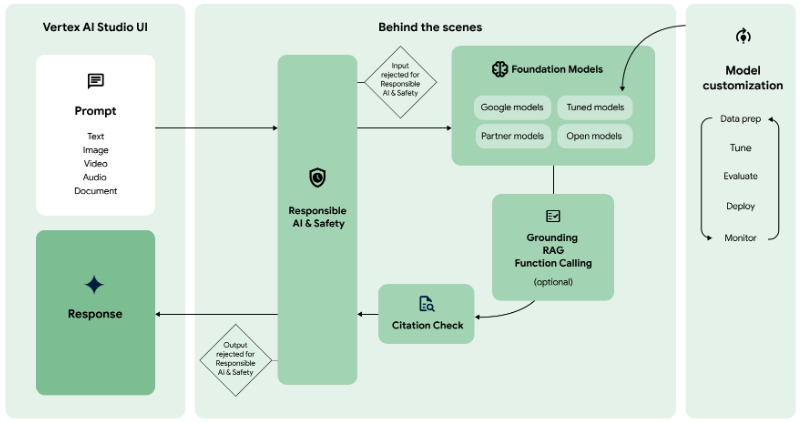
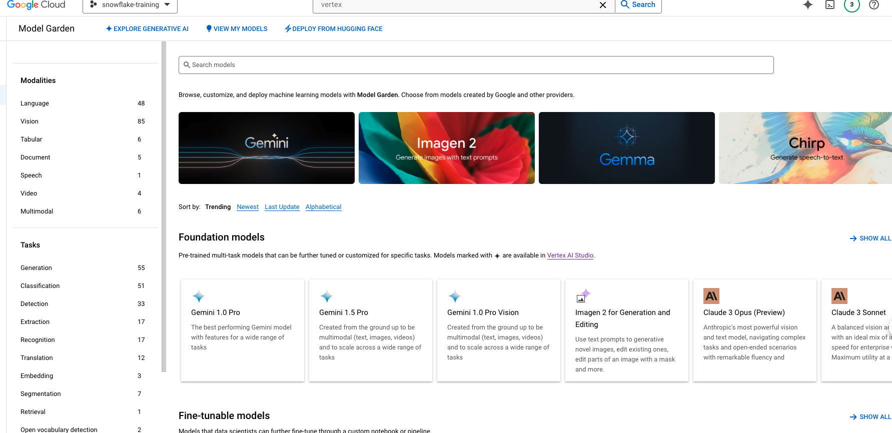
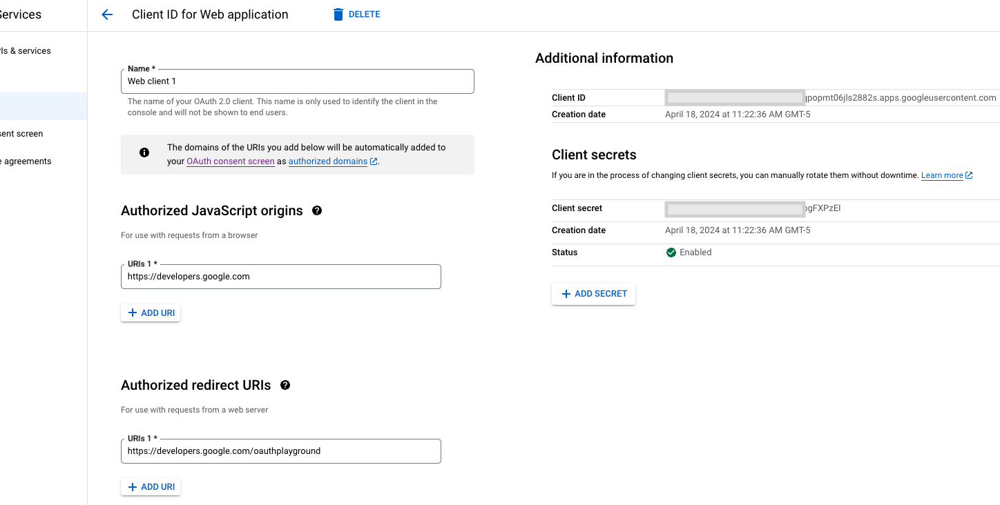
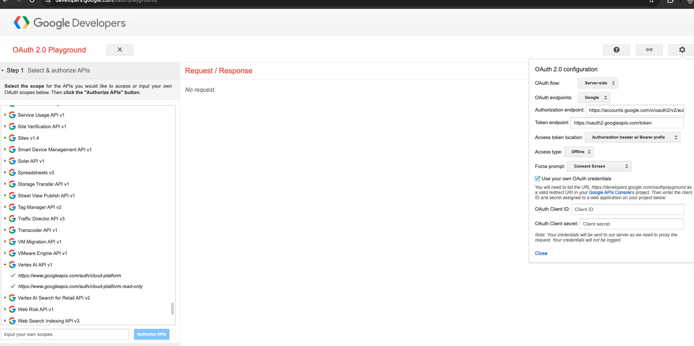
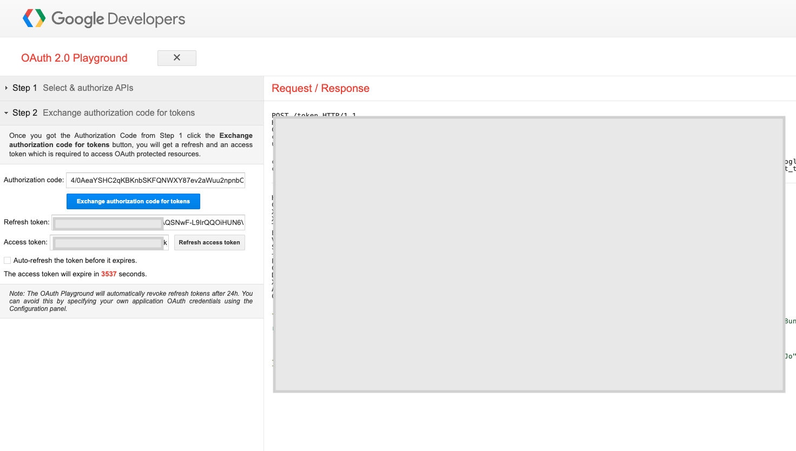

author: marzillo-snow
id: getting_started_with_google_and_snowflake_for_genAI
summary: This is a quickstart for using Snowflake with Google for Generative AI
categories: getting-started,data-science-&-ml,data-engineering,app-development
environments: web
status: Hidden 
feedback link: https://github.com/Snowflake-Labs/sfguides/issues
tags: Getting Started, Data Science, Data Engineering, LLM, GenAI, Google, GCP, Streamlit

# Getting Started with Google, Snowflake and Streamlit for Generative AI
<!-- ------------------------ -->
## Overview

Duration: 10

In this quickstart we will build a Streamlit application that leverages Snowpark External Access in Snowflake with Google Palm to analyze customer reviews.

In summary this is what you will do:
- Set up environments in both Snowflake and GCP
- Create a function that leverages Snowpark External Access to make a call to GCP Generative AI models.
- Create a Streamlit app that leverages the above function to generate responses using data from Snowflake and prompts.

### What is Generative AI?

Generative AI is a category of artificial intelligence techniques that enable machines to create new, original content, such as text, images, or music, by learning from existing data. These models, often based on neural networks, generate content by understanding patterns and structures in the training data and then producing novel examples that resemble what they have learned. Generative AI has applications in various fields, including natural language processing, computer vision, and creative arts.

### Using Generative AI with Google Cloud
Generative AI on Vertex AI  gives you access to many large generative AI models so you can evaluate, tune, and deploy them for use in your AI-powered applications. This page gives you an overview of the generative AI workflow on Vertex AI, the features and models that are available, and directs you to resources for getting started.

The below diagram shows how to use Google Cloud fot Generative AI.



### What is Snowflake?
Snowflake is a cloud-based data warehousing solution that allows businesses to store and analyze large volumes of data efficiently. It separates storage and compute functionalities, enabling users to scale resources independently and pay only for what they use. Snowflake supports a wide range of data workloads, including data warehousing, data lakes, and data engineering, and offers robust data sharing capabilities across different cloud platforms.

### What is Streamlit?
Streamlit is a Python library that makes it easy to create and share custom web apps for machine learning and data science. In just a few minutes you can build and deploy powerful data apps.

### Pre-requisites
- Familiarity with [Snowflake](https://quickstarts.snowflake.com/guide/getting_started_with_snowflake/index.html#0) and a Snowflake account
with Access to [Streamlit](https://streamlit.io/) in your Snowflake account.
- [Google Cloud Account](https://cloud.google.com/) with Vertex AI.
- Familiarity with the Python programming language.

### What you’ll build
We will build an efficient architecture all within Snowflake that will access product urls and images in Snowflake and pass that data to a a Google Cloud to generate a response. The architecture will look like this


### Use Case

This use case will leverage sample customer reviews to allow users to analyze them leveraging Generative AI. This quickstart was inspired by the demo built by the venerable Alex Ross. Details on the use case covered in this blog [here](https://cloudydata.substack.com/p/snowflake-and-vertex-ai-foundational)

<!-- ------------------------ -->

## Google Environment

Duration: 10

For this quickstart you will need a Google Cloud account with a Vertex AI service enabled. Users can create a trial Google Cloud account [here](cloud.google.com). There be a cost to run this lab, but if there is it will be nominal.

Once you have your Google Cloud account you will need to create a project then enable the Vertex AI service. Once in the Vertex AI service you can select the model garden tab the left menu bar to view the models available in Vertex AI. For this lab we will be using the Palm Bison model for text generation.



Once you have the Vertex AI service enabled in your Google Cloud Project head to "APIs and Services", click "Create Credentials" select "OAuth Client ID" then provide any name you would like and generate the client id. Note the Client ID and Client Secret.



Now, go to https://developers.google.com/oauthplayground/ scroll down to the left menu bar, select "Vertex AI API..." and select both options. Click on the settings gear menu in the top right, select "Use your own OAuth credentials" and enter the Client ID and Secret from the previous step. Close the settings. Click "Authorize APIs".




Click "Exchange authorization code for tokens" and note the "Refresh Token".




<!-- ------------------------ -->
## Snowflake Environment

Duration: 10

Open a SQL Worksheet (from the Projects tab) in the Snowflake UI and Copy and paste the below code into your Snowflake worksheet, this will create a table with customer reviews. For the sake of the quickstart we are using the ACCOUNTADMIN role, but in practice you will likely want to use a different, organization specific role.


```sql
--create database and warehouse
use role accountadmin;
CREATE OR REPLACE WAREHOUSE HOL_WH WITH WAREHOUSE_SIZE='X-SMALL';
CREATE DATABASE DEMOS;
CREATE SCHEMA VERTEX;

--create stage
USE DATABASE DEMOS;
USE SCHEMA VERTEX;
CREATE OR REPLACE STAGE CUSTOMER_REVIEWS_STAGE
URL='s3://hol-qs-bucket/'
FILE_FORMAT = (TYPE = 'csv');

--create loan_one table
CREATE OR REPLACE TABLE REVIEWS
  (ID STRING,
   RATING STRING,
   REVIEW STRING,
   CUSTOMER_NAME STRING,
   REVIEW_DATA DATE);

COPY INTO REVIEWS FROM @CUSTOMER_REVIEWS_STAGE/Customer_Reviews.csv
FILE_FORMAT = (TYPE = 'CSV' FIELD_OPTIONALLY_ENCLOSED_BY = '"' ESCAPE_UNENCLOSED_FIELD = '\\' SKIP_HEADER = 1) ON_ERROR = 'CONTINUE';

select top 10 * from REVIEWS;
```

<!-- ------------------------ -->
## Snowpark External Access to call OpenAI

Duration: 10

Now we will work through the below code in a new Snowflake SQL worksheet. This code creates several objects that allows Snowflake to access Vertex models via a stored procedure and function that leverage a network rule and a Snowpark External Access object that allows Snowflake to securely make requests to Vertex AI (or any other external service).

You will have to replace several values that you previously noted as well as your Google deployment region and Google Project ID.

```sql
--Snowflake External Access + Vertex GenAI API Demo
--This demo shows how to use External Access in Snowflake to call the Vertex GenAI Palm2 LLM: https://cloud.google.com/vertex-ai/generative-ai/docs/model-reference/text
--Author Alex Ross, Senior Sales Engineer, Snowflake
--Last Modified 16th April 2024

--Create demo database/schema
USE ROLE ACCOUNTADMIN;
USE DATABASE DEMOS;
USE SCHEMA VERTEX;

--Create Security Integration For GCP OAuth
--Visit https://console.cloud.google.com/apis/credentials to generate OAuth 2.0 Client IDs
CREATE OR REPLACE SECURITY INTEGRATION vertex_access_integration
  TYPE = API_AUTHENTICATION
  AUTH_TYPE = OAUTH2
  OAUTH_CLIENT_ID = '<CLIENT ID>'
  OAUTH_CLIENT_SECRET = '<CLIENT SECRET>'
  OAUTH_TOKEN_ENDPOINT = 'https://oauth2.googleapis.com/token'
  OAUTH_AUTHORIZATION_ENDPOINT = 'https://accounts.google.com/o/oauth2/auth'
  OAUTH_ALLOWED_SCOPES = ('https://www.googleapis.com/auth/cloud-platform', 'https://<GOOGLE REGION>-aiplatform.googleapis.com')
  ENABLED = TRUE;
GRANT ALL ON INTEGRATION vertex_access_integration to ROLE PUBLIC;

--Create Secret to hold GCP OAuth refresh token
--Visit https://developers.google.com/oauthplayground/ to generate OAuth refresh token using client ID and secret 
CREATE OR REPLACE SECRET vertex_oauth_token
TYPE = OAUTH2
API_AUTHENTICATION = vertex_access_integration
OAUTH_REFRESH_TOKEN ='<REFRESH TOKEN>';
GRANT USAGE ON SECRET vertex_oauth_token to role PUBLIC;
GRANT READ ON SECRET vertex_oauth_token to role PUBLIC;

--Create Network Rule to allow connectivity with Google API endpoints
CREATE OR REPLACE NETWORK RULE gcp_apis_network_rule
  MODE = EGRESS
  TYPE = HOST_PORT
  VALUE_LIST = ('<GOOGLE REGION>-aiplatform.googleapis.com','oauth2.googleapis.com','accounts.google.com','www.googleapis.com:443');
  
--Create The External Access Integration
CREATE OR REPLACE EXTERNAL ACCESS INTEGRATION GCP_APIS_ACCESS_INTEGRATION
  ALLOWED_NETWORK_RULES = (gcp_apis_network_rule)
  ALLOWED_AUTHENTICATION_SECRETS = (vertex_oauth_token)
  ENABLED = true;
GRANT ALL ON INTEGRATION GCP_APIS_ACCESS_INTEGRATION TO ROLE PUBLIC;

--Create SP to handle Rest API call to Vertex GenAI endpoint
--Returns a string response based on prompt and parameters provided to the SP 
CREATE OR REPLACE PROCEDURE GET_VERTEX_TEXT_GENERATION("PROMPT" VARCHAR(16777216), "TEMPERATURE" FLOAT, "MAX_OUTPUT_TOKENS" NUMBER(38,0), "TOP_P" FLOAT, "TOP_K" FLOAT)
RETURNS VARCHAR(16777216)
LANGUAGE PYTHON
RUNTIME_VERSION = '3.8'
PACKAGES = ('snowflake-snowpark-python','requests')
HANDLER = 'get_text_generation'
EXTERNAL_ACCESS_INTEGRATIONS = (GCP_APIS_ACCESS_INTEGRATION)
SECRETS = ('cred'=VERTEX_OAUTH_TOKEN)
EXECUTE AS OWNER
AS '
import _snowflake
import requests
import json

def get_text_generation(session, prompt, temperature, max_output_tokens, top_p, top_k):
    PROJECT_ID=''<GOOGLE PROJECT ID>''
    LOCATION=''<GOOGLE REGION>>''
    token = _snowflake.get_oauth_access_token(''cred'')
    url = f''https://{LOCATION}-aiplatform.googleapis.com/v1/projects/{PROJECT_ID}/locations/{LOCATION}/publishers/google/models/text-bison:predict''
    d = {''instances'':[{''prompt'': prompt}],
         ''parameters'':{''temperature'': temperature,
                ''maxOutputTokens'': max_output_tokens,
                ''topK'': top_k,
                ''topP'': top_p
            }
        }
    h = {
            ''Authorization'': ''Bearer '' + token,
            ''Content-Type'': ''application/json; charset=utf-8''
        }

    try:
        response = requests.post(url, data=json.dumps(d), headers=h)
        data = response.json()
        return data[''predictions''][0][''content'']
    except:
        return requests.post(url, data=json.dumps(d), headers=h).json()
 
';

call get_vertex_text_generation('why is snowflake the best data platform?',0.2,256,0.95,2); --Test SP is working as expected

--Create a UDF to handle Rest API call to Vertex GenAI endpoint
--This UDF is designed to be used to analyse a customer review
--Returns a variant/json response based on prompt and parameters provided to the UDF 
CREATE OR REPLACE FUNCTION GET_VERTEX_REVIEW_SENTIMENT_UDF("PROMPT" VARCHAR(16777216), "TEMPERATURE" FLOAT, "MAX_OUTPUT_TOKENS" NUMBER(38,0), "TOP_P" FLOAT, "TOP_K" FLOAT)
RETURNS VARIANT
LANGUAGE PYTHON
RUNTIME_VERSION = '3.8'
PACKAGES = ('snowflake-snowpark-python','requests')
HANDLER = 'GET_VERTEX_REVIEW_SENTIMENT'
EXTERNAL_ACCESS_INTEGRATIONS = (GCP_APIS_ACCESS_INTEGRATION)
SECRETS = ('cred'=VERTEX_OAUTH_TOKEN)
AS '
import _snowflake
import requests
import json

def GET_PREPROMPT():
    preprompt = ''For the given review, return a JSON object that has the fields sentiment, explanation, summary, and product. Acceptable values for sentiment are Positive or Negative. The explanation field contains text that explains the sentiment. The summary field contains a single sentence summarizing the review in under 10 words. The product field contains the name or type of product purchased if it has been included in the review. DO NOT INCLUDE BACKTICKS IN THE RESPONSE. Review: ''
    return preprompt

def GET_VERTEX_REVIEW_SENTIMENT(prompt, temperature, max_output_tokens, top_p, top_k):
    PROJECT_ID=''<GOOGLE PROJECT ID>''
    LOCATION=''<GOOGLE REGION>''
    token = _snowflake.get_oauth_access_token(''cred'')
    url = f''https://{LOCATION}-aiplatform.googleapis.com/v1/projects/{PROJECT_ID}/locations/{LOCATION}/publishers/google/models/text-bison:predict''
    d = {''instances'':[{''prompt'': GET_PREPROMPT() + prompt}],
         ''parameters'':{''temperature'': temperature,
                ''maxOutputTokens'': max_output_tokens,
                ''topK'': top_k,
                ''topP'': top_p
            }
        }
    h = {
            ''Authorization'': ''Bearer '' + token,
            ''Content-Type'': ''application/json; charset=utf-8''
        }

    try:
        response = requests.post(url, data=json.dumps(d), headers=h)
        data = response.json()
        return json.loads(data[''predictions''][0][''content''])
    except:
        return requests.post(url, data=json.dumps(d), headers=h).json()
';
GRANT USAGE ON FUNCTION GET_VERTEX_REVIEW_SENTIMENT_UDF(VARCHAR(16777216), FLOAT, NUMBER(38,0), FLOAT, FLOAT) TO ROLE PUBLIC;

select GET_VERTEX_REVIEW_SENTIMENT_UDF('This is a shoe I will wear with black dress pants or jeans when I need comfort and a little style, but I am not impressed. This is a very flimsy shoe with little support at all. Unlike any other shoes I''ve purchased in the past. It looks nice, but it''s not comfortable.',0.2,256,0.95,2) as RESPONSE; --Test UDF
```

<!-- ------------------------ -->

----START HERE-------
## Build Streamlit App - With data in Snowflake 

Duration: 10

Now that we have our OpenAI function, let’s build our App.

Go back to the main account view by clicking ‘<- Worksheets’ and then select ‘Streamlit’.

Make sure that you’re still using the ‘ACCOUNTADMIN’ role and then create a new Streamlit app, which should open the app editor directly. You can access this app from the Streamlit view, but make sure to use the same role and that the app is in the same RETAIL_HOL database where the link table and the image stage are located. You can name the app whatever you would like, something like "Wardrobe Recommender" is appropriate.

Once the app is created paste the below code into the app code and click 'Run' in order to create the Streamlit App!

```python
# Import python packages
import streamlit as st
import base64
import pandas as pd
from snowflake.snowpark.context import get_active_session
	
# Keeping pandas from truncating long strings
pd.set_option('display.max_colwidth', 1000)

# Get the current credentials
session = get_active_session()

# access underlying snowflake tables
# let participants define this?-----------
clothing_link_df = session.table("clothing_link").to_pandas()
clothing_links = clothing_link_df['LINKS']

# Write directly to the app
st.title("Wardrobe Recommender")

# Add some cosmetic headers
st.caption("Using Azure OpenAI with Snowflake to recommend wardrobes")

default_prompt = 'Please review the provided image and recommend the top three links from the provided list that this person would most likely want to wear. Display the complete url for the link in your response as it is provided in the request.'
with st.expander("Adjust system prompt"):
    system = st.text_area("System instructions", value=default_prompt).replace("'","")
st.markdown('------') 

# widget for image filter
selected_image = st.selectbox(
    'Select an image',
     session.sql("SELECT RELATIVE_PATH FROM DIRECTORY(@image_stage)"))

image_string = session.sql(f"""select GET_PRESIGNED_URL(@image_stage, '{selected_image}')""").collect()[0][0]
st.image(image_string)

# Use the job description to write the job to a table and run the function against it:
if(st.button('Ask ChatGPT')):
    result = session.sql(f"""SELECT chatgpt_image('{system}','{clothing_links}','{image_string}')""").collect()
    st.header('Answer')
    st.write(result[0][0].replace('"','')) 
```

Once you have the app created you can adjust the prompt in the app and change the image selected in order to generate new recommendations. 


<!-- ------------------------ -->
## Test Prompt Engineering (OPTIONAL)

Duration: 5

Prompt engineering for a language model involves crafting your questions or prompts in a way that maximizes the effectiveness and accuracy of the responses you receive. Here are some simple guidelines to help you with prompt engineering:

**Be Clear and Specific:** The more specific your prompt, the better. Clearly define what you're asking for. If you need information on a specific topic, mention it explicitly.

**Provide Context:** If your question builds on particular knowledge or a specific scenario, provide that context. This helps the model understand the frame of reference and respond more accurately.

**Use Direct Questions:** Phrase your prompts as direct questions if you're looking for specific answers. This approach tends to yield more focused responses.

**Break Down Complex Queries:** If you have a complex question, break it down into smaller, more manageable parts. This can help in getting more detailed and precise answers.

**Specify the Desired Format:** If you need the information in a particular format (like a list, a summary, a detailed explanation), mention this in your prompt.

**Avoid Ambiguity:** Try to avoid ambiguous language. The clearer you are, the less room there is for misinterpretation.

**Sequential Prompts for Follow-ups:** If you're not satisfied with an answer or need more information, use follow-up prompts that build on the previous ones. This helps in maintaining the context and getting more refined answers.

**Experiment and Iterate:** Don’t hesitate to rephrase or adjust your prompts based on the responses you get. Sometimes a slight change in wording can make a big difference.

**Consider the Model's Limitations:** Remember that the model may not have the latest information, and it cannot browse the internet or access personal data unless explicitly provided in the prompt.

**Ethical Use:** Always use the model ethically. Avoid prompts that are harmful, biased, or violate privacy or legal guidelines.

Let’s look at how we can experiment and iterate on the prompt that we provided to the LLM function in Streamlit. Go back to the previous step and test out different prompt strategies to see if you can improve the accuracy of the response.

Consider the above concepts and also consider this pointed [guide to prompting](https://github.com/VILA-Lab/ATLAS/blob/main/data/README.md)

(it is required that you try the prompt in principal #6 🙂)

<!-- ------------------------ -->
## Conclusion  And Resources

Duration: 5

Congratulations! You've successfully built your first Streamlit App with OpenAI. After setting up our Azure and Snowflake and environments we built two primary things: a UDF that utilizes Snowpark External Access to make a call to an OpenAI model and a Streamlit app that leverages that function to make a simple and useful app that can be shared within an organization. With these two, easy to build, Snowflake features we expect customers to see value quickly when using Snowflake and OpenAI!

### What You Learned

- How to set up a Snowflake and Azure / OpenAI environment to integrate the two platforms.
- How to build a Snowpark External Access integration to call OpenAI.
- How to build a Streamlit app that calls OpenAI leveraging tabular and image data from Snowflake.
- How to build your first Generative AI App with image data in Snowflake!


### Related resources 
- [RBAC with External Services](https://www.youtube.com/watch?v=fALb8SosA_U)

- [Prompting](https://github.com/VILA-Lab/ATLAS/blob/main/data/README.md)

- [Streamlit](https://streamlit.io/)

- [Azure OpenAI](https://azure.microsoft.com/en-us/products/ai-services/openai-service)

If you have any questions, reach out to your Snowflake account team!
