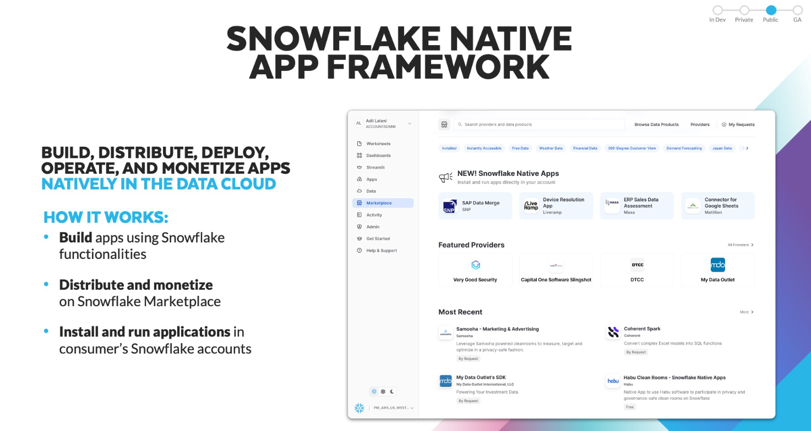
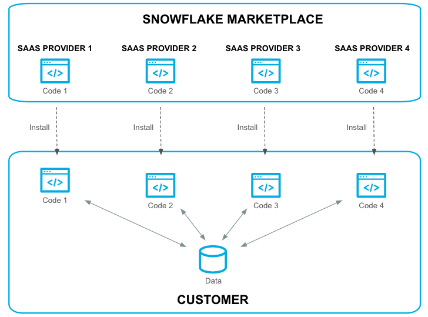
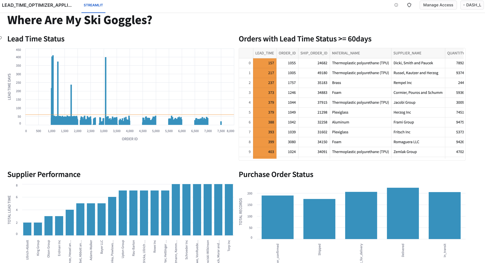

author: Daniel Myers
id: getting_started_with_native_apps
summary: Follow this tutorial to get up and running with your first Snowflake Native Application
categories: Getting-Started
environments: web
status: Published 
feedback link: https://github.com/Snowflake-Labs/sfguides/issues
tags: Getting Started, Data Science, Data Engineering, Native Apps 

# Getting Started with Snowflake Native Apps
<!-- ------------------------ -->
## Overview 
Duration: 3



In this tutorial you will get up and running with developing your first Snowflake Native Application. 

Snowflake Native Applications provide developers a way to package applications for consumption by other Snowflake users. The Snowflake Marketplace is a central place for Snowflake users to discover and install Snowflake Native Applications. 

We will be building a Snowflake Native Application used for inventory and supply chain management. In this scenario, we have various suppliers of raw material and our native app will use `order data`, `shipping data`, and `site recovery data` to intelligently determine the following:

- **Lead Time Status:** bar chart to demonstrate real-time overview of the lead time status of the raw material procurement process.
- **Raw Material Inventory:** bar/table view of  inventory levels of the raw materials 
- **Purchase Order Status:** pie chart display the status of all the purchase orders (shipped, in transit; completed)
- **Supplier Performance:** bar chart group by supplier measuring the lead time, quality, and cost of raw materials delivered by each supplier


### Prerequisites
- Snowflake Trial Account
- Beginner Python knowledge


### What You’ll Learn 
- Native apps concepts
- Native Apps deployment
- Native Apps sharing and Marketplace Listing


### What You’ll Need 
- [VSCode](https://code.visualstudio.com/download) Installed

### What You’ll Build 
- A Snowflake Native Application

<!-- ------------------------ -->
## Architecture & Concepts
Duration: 2

Snowflake Native Apps are a new way to build data intensive applications. Snowflake Native Apps benefit from running *inside* Snowflake and can be installed from the Snowflake Marketplace similar to installing an app on a smart phone. Snowflake Native Apps can read and write data to a user's database (when given permission to do so). Snowflake Native Apps can even bring in new data to their users, providing new insights. 

When discussing Snowflake Native Apps, we have two groups `Providers` and `Consumers`. When developing and publishing a Snowflake Native App, you are a Provider. 

- **Snowflake Native App Providers:** these are the developers of the Native App. The developer or company publishing a Native App to the Snowflake Marketplace is a App Provider.

- **Snowflake Native App Consumer:** these are the users of a Native App. When a user installs a Native App from the Snowflake Marketplace they are a consumer of the Native App.

The diagram below demonstrates this model:
 


<!-- ------------------------ -->
## Clone Sample Repo & Directory Structure
Duration: 3

To create our Snowflake Native Application, we will first clone the starter project by running this command:

```bash
git clone https://github.com/Snowflake-Labs/sfguide-getting-started-with-native-apps.git
```

If you do not have git installed, you can also download the code directly from [GitHub](https://github.com/Snowflake-Labs/sfguide-getting-started-with-native-apps/archive/refs/heads/main.zip) and extract it to a local folder.

This repository contains all of our starter code for our native app. Throughout the rest of this tutorial we will be modifying various parts of the code to add functionality and drive a better understanding of what is happening at each step in the process.


Let's explore the directory structure:

```plaintext
|-- repos
    |-- .gitignore
    |-- LICENSE
    |-- app
        |-- data
        |   |-- order_data.csv
        |   |-- shipping_data.csv
        |   |-- site_recovery_data.csv
        |-- src
        |   |-- manifest.yml
        |   |-- libraries
        |   |   |-- environment.yml
        |   |   |-- procs.py
        |   |   |-- streamlit.py
        |   |   |-- udf.py
        |   |-- scripts
        |       |-- setup.sql
        |-- test
            |-- Test_App_Locally.sql
```

There are two main directories that we will be using:

`src`

- the `src` directory is used to store all of our various source code including stored procedures, user defined functions (UDFs), our streamlit application, and even our installation script `setup.sql`.

`test`

- the `test` directory contains both our sample data used for seeding our application tests, and our test script `Test_App_Locally.sql`

<!-- ------------------------ -->
## Manifest.yml
Duration: 3

The `manifest.yml` file is an important aspect of a Snowflake Native App. This file defines some metadata about the app, configuration options, and provides references to different artifacts of the application.

Let's take a look at the one provided in the GitHub repository:

```
#version identifier
manifest_version: 1

version:
  name: V1
  label: Version One
  comment: The first version of the application

#artifacts that are distributed from this version of the package
artifacts:
  setup_script: scripts/setup.sql
  default_streamlit: app_instance_schema.streamlit
  extension_code: true

#runtime configuration for this version
configuration:
  log_level: debug
  trace_level: off

references:
  - order_table:
      label: "Orders Table" 
      description: "Select table"
      privileges:
        - SELECT
      object_type: Table 
      multi_valued: false 
      register_callback: app_instance_schema.update_reference 
  - site_recovery_table:
      label: "Site Recovery Table" 
      description: "Select table"
      privileges:
        - SELECT
      object_type: Table 
      multi_valued: false 
      register_callback: app_instance_schema.update_reference

```

`manifest_version`

- this is the Snowflake defined manifest file version. If there are new configuration options or additions, the version number will change.

`version`

- this is a user-defined version for the application. This version identifier is used when creating the app package.

`artifacts`

- this contains options and definitions for where various parts of our package is located. In particular the `setup_script` option is required.

`configuration`

- this is used to define what logging we want to use in our application. During development we will want a log level of `debug`. 

`references`

-  this part of the manifest file contains all the references to Snowflake objects that the Native App needs access to. The Native App Consumer will grant access to the objects when installing or using the application. We will use this in our native app to gain access to the `order_table` and `site_recovery_table`. 

<!-- ------------------------ -->
## Update UDF.py
Duration: 3

To add some new functionality to our application we will modify `UDF.py`. This is the python file we use to create all our User Defined Functions (UDFs).

```python
def cal_distance(lat1,lon1,lat2,lon2):
   import math
   radius = 3959 # miles == 6371 km
   dlat = math.radians(lat2-lat1)
   dlon = math.radians(lon2-lon1)
   a = math.sin(dlat/2) * math.sin(dlat/2) + math.cos(math.radians(lat1)) \
        * math.cos(math.radians(lat2)) * math.sin(dlon/2) * math.sin(dlon/2)
   c = 2 * math.atan2(math.sqrt(a), math.sqrt(1-a))
   d = radius * c
   return dw

# process_supply_day + duration + recovery_weeks * 7 (days)
def cal_lead_time(i,j,k):
   return i + j + k

```

> aside positive
> 
> You can import any package in the `https://repo.anaconda.com/pkgs/snowflake` channel from [Anaconda](https://docs.conda.io/en/latest/miniconda.html)

Let's add a new function that simply outputs "Hello World!"

To do this, copy and paste the code below into `UDF.py`

```python
def hello_world():
   return "Hello World!"
```

In the next step, we will expose this function to Consumers by adding it to our installation script.


<!-- ------------------------ -->
## Edit Installation Script
Duration: 3

The installation script `setup.sql` defines all Snowflake Objects used within the application. This script runs every time a user installs the application into their environment. 

We will use this file to expose our new `hello_world` python UDF.

```
-- ==========================================
-- This script runs when the app is installed 
-- ==========================================

-- Create Application Role and Schema
create application role if not exists app_instance_role;
create or alter versioned schema app_instance_schema;

-- Share data
create or replace view app_instance_schema.MFG_SHIPPING as select * from shared_content_schema.MFG_SHIPPING;

-- Create Streamlit app
create or replace streamlit app_instance_schema.streamlit from '/libraries' main_file='streamlit.py';

-- Create UDFs
create or replace function app_instance_schema.cal_lead_time(i int, j int, k int)
returns float
language python
runtime_version = '3.8'
packages = ('snowflake-snowpark-python')
imports = ('/libraries/udf.py')
handler = 'udf.cal_lead_time';

create or replace function app_instance_schema.cal_distance(slat float,slon float,elat float,elon float)
returns float
language python
runtime_version = '3.8'
packages = ('snowflake-snowpark-python','pandas','scikit-learn==1.1.1')
imports = ('/libraries/udf.py')
handler = 'udf.cal_distance';

-- Create Stored Procedure
create or replace procedure app_instance_schema.billing_event(number_of_rows int)
returns string
language python
runtime_version = '3.8'
packages = ('snowflake-snowpark-python')
imports = ('/libraries/procs.py')
handler = 'procs.billing_event';

create or replace procedure app_instance_schema.update_reference(ref_name string, operation string, ref_or_alias string)
returns string
language sql
as $$
begin
  case (operation)
    when 'ADD' then
       select system$set_reference(:ref_name, :ref_or_alias);
    when 'REMOVE' then
       select system$remove_reference(:ref_name, :ref_or_alias);
    when 'CLEAR' then
       select system$remove_all_references();
    else
       return 'Unknown operation: ' || operation;
  end case;
  return 'Success';
end;
$$;

-- Grant usage and permissions on objects
grant usage on schema app_instance_schema to application role app_instance_role;
grant usage on function app_instance_schema.cal_lead_time(int,int,int) to application role app_instance_role;
grant usage on procedure app_instance_schema.billing_event(int) to application role app_instance_role;
grant usage on function app_instance_schema.cal_distance(float,float,float,float) to application role app_instance_role;
grant SELECT on view app_instance_schema.MFG_SHIPPING to application role app_instance_role;
grant usage on streamlit app_instance_schema.streamlit to application role app_instance_role;
grant usage on procedure app_instance_schema.update_reference(string, string, string) to application role app_instance_role;
```

Let's add the following code snippet to our `setup.sql` script:

```python
create or replace function app_instance_schema.hello_world()
returns string
language python
runtime_version = '3.8'
packages = ('snowflake-snowpark-python')
imports = ('/libraries/udf.py')
handler = 'udf.hello_world';

grant usage on function app_instance_schema.hello_world() to application role app_instance_role;
```

<!-- ------------------------ -->
## Create App Package
Duration: 2

A Snowflake Application Package is conceptually similar to that of an application installer for a desktop computer (like `.msi` for Windows or `.pkg` for Mac). An app package for Snowflake contains all the material used to install the application later, including the setup scripts. In fact, we will be using this app package in future steps to test our app!

Now that we've modified our project files locally, lets create the Snowflake Application Package so we can upload our project:

To create an application package:

1. Login to your Snowflake account and navigate to `Apps`
2. In the top navigation, click `Packages`
3. Click `+ App Package`
4. Type `NATIVE_APP_QUICKSTART_PACKAGE` for the package name.
5. Select `Distribute to accounts in your organization`

Alternatively, you can use the SQL statement below to do the same thing:

```
-- #########################################
-- PACKAGE SETUP
-- #########################################

CREATE APPLICATION PACKAGE IDENTIFIER('"NATIVE_APP_QUICKSTART_PACKAGE"') COMMENT = '' DISTRIBUTION = 'INTERNAL';
```

Now that we have our `package` created, we need to create our `stage`. To do this, run the following code:

```
-- when we create an app package, snowflake creates a database with the same name. This database is what we use to store all of our packaged snowflake objects.
USE DATABASE NATIVE_APP_QUICKSTART_PACKAGE;

CREATE OR REPLACE SCHEMA NATIVE_APP_QUICKSTART_SCHEMA;
USE SCHEMA NATIVE_APP_QUICKSTART_SCHEMA;

-- we will upload our project files here, directly into our app package
CREATE OR REPLACE STAGE NATIVE_APP_QUICKSTART_STAGE 
	DIRECTORY = ( ENABLE = true ) 
	COMMENT = '';
```

Now that both the `package` and `stage` have been created, you can upload files to Snowflake using the web interface. To do this:

1. Login to your Snowflake account and navigate to `Data -> Databases`
2. Select `NATIVE_APP_QUICKSTART_PACKAGE` -> `NATIVE_APP_QUICKSTART_SCHEMA` -> `Stages` -> `NATIVE_APP_QUICKSTART_STAGE`
3. Click the `+ Files` button in the top right.

> aside negative
>
> **Note**
> It is important that you match the local directory structure with the directory structure of your stage. This is because `manifest.yml` and `setup.sql` use relative path references. Prepend `v1/` to all directories created for this tutorial. For example, when uploading `udf.py`, the path should read `v1/libraries/udf.py`.


<!-- ------------------------ -->
## Upload Provider Data to Snowflake
Duration: 2

Now, let's create a database that we will use to store our data. The manufacturer will be supplying the shipping data with the Native Application via data sharing.

In the SQL below, we will be using `NATIVE_APP_QUICKSTART_DB` for our Producer data.

```
CREATE OR REPLACE WAREHOUSE NATIVE_APP_QUICKSTART_WH WAREHOUSE_SIZE=SMALL INITIALLY_SUSPENDED=TRUE;

-- this database is used to store our data
CREATE OR REPLACE DATABASE NATIVE_APP_QUICKSTART_DB;
USE DATABASE NATIVE_APP_QUICKSTART_DB;

CREATE OR REPLACE SCHEMA NATIVE_APP_QUICKSTART_SCHEMA;
USE SCHEMA NATIVE_APP_QUICKSTART_SCHEMA;

CREATE OR REPLACE TABLE MFG_SHIPPING (
  order_id NUMBER(38,0), 
  ship_order_id NUMBER(38,0),
  status VARCHAR(60),
  lat FLOAT,
  lon FLOAT,
  duration NUMBER(38,0)
);

-- Load app/data/shipping_data.csv using Snowsight

```

### Using the Snowflake Web UI  

 To upload our data we can use the Snowflake UI:

1. Login to your Snowflake account and navigate to `Data -> Databases`
2. Select `NATIVE_APP_QUICKSTART_DB` -> `NATIVE_APP_QUICKSTART_SCHEMA` -> `Tables` 
3. From there, select table `MFG_SHIPPING` and upload the corresponding `.csv` file from the downloaded repository:
   1. Select `Load Data` in the top right
   2. Select `NATIVE_APP_QUICKSTART_WH` for the warehouse
   3. Click `Browse` and select the corresponding `.csv` file, Click `Next`
   4. Select `Delimited Files (CSV or TSV)` for the File Format
   5. For `Field optionally enclosed by` select `Double quotes`
   6. Click `Next`, repeat for each table. 

### Add Data to the Application Package

In order for the shipping data to be available to the application consumer, it will be added to the application package.

In the SQL below, the data is added to a share in the application package as a view and select is granted on the data.

```sql
-- ################################################################
-- Create SHARED_CONTENT_SCHEMA to share in the application package
-- ################################################################
use database NATIVE_APP_QUICKSTART_PACKAGE;
create schema shared_content_schema;

use schema shared_content_schema;
create or replace view MFG_SHIPPING as select * from NATIVE_APP_QUICKSTART_DB.NATIVE_APP_QUICKSTART_SCHEMA.MFG_SHIPPING;

grant usage on schema shared_content_schema to share in application package NATIVE_APP_QUICKSTART_PACKAGE;
grant reference_usage on database NATIVE_APP_QUICKSTART_DB to share in application package NATIVE_APP_QUICKSTART_PACKAGE;
grant select on view MFG_SHIPPING to share in application package NATIVE_APP_QUICKSTART_PACKAGE;
```

<!-- ------------------------ -->
## Create App Package Version
Duration: 4

We've now created our Application `package`, uploaded our project files to our `stage`, and created a mocked Consumer database with sample data. 

From here, we will create our first Application Package Version. You can have multiple versions available 

To view our App Package in the Snowflake UI:

1. Login to your Snowflake account and navigate to `Apps`
2. In the top navigation, click `Packages`
3. Click `NATIVE_APP_QUICKSTART_PACKAGE`

Now let's add our first version using our previously uploaded code.

1. Click `Add first version`.
2. Type `V1` for the version name.
3. Select `NATIVE_APP_QUICKSTART_PACKAGE` for the database.
4. Select `NATIVE_APP_QUICKSTART_STAGE` for the stage.
5. Select `v1` for the directory.

Alternatively, you can add this new version via SQL like this:

```
ALTER APPLICATION PACKAGE "NATIVE_APP_QUICKSTART_PACKAGE" ADD VERSION "V1" USING '@NATIVE_APP_QUICKSTART_PACKAGE.NATIVE_APP_QUICKSTART_SCHEMA.NATIVE_APP_QUICKSTART_STAGE/v1' LABEL = ''

ALTER APPLICATION PACKAGE "NATIVE_APP_QUICKSTART_PACKAGE" SET DEFAULT RELEASE DIRECTIVE VERSION = "V1" PATCH = 0
```


<!-- ------------------------ -->
## Upload Test Data to Snowflake
Duration: 2

The model used in this scenario is that each Native App Consumer will bring their own supply chain data (orders and site recovery). The Native App will use the consumer's data to perform it's calculations. 

In the SQL below, we will be using `NATIVE_APP_QUICKSTART_DB` for our Consumer testing data.

```
USE WAREHOUSE NATIVE_APP_QUICKSTART_WH;

-- this database is used to store our data
USE DATABASE NATIVE_APP_QUICKSTART_DB;

USE SCHEMA NATIVE_APP_QUICKSTART_SCHEMA;

CREATE OR REPLACE TABLE MFG_ORDERS (
  order_id NUMBER(38,0), 
  material_name VARCHAR(60),
  supplier_name VARCHAR(60),
  quantity NUMBER(38,0),
  cost FLOAT,
  process_supply_day NUMBER(38,0)
);

-- Load app/data/orders_data.csv using Snowsight

CREATE OR REPLACE TABLE MFG_SITE_RECOVERY (
  event_id NUMBER(38,0), 
  recovery_weeks NUMBER(38,0),
  lat FLOAT,
  lon FLOAT
);

-- Load app/data/site_recovery_data.csv using Snowsight
```

### Using the Snowflake Web UI  

 To upload our test data we can use the Snowflake UI:

1. Login to your Snowflake account and navigate to `Data -> Databases`
2. Select `NATIVE_APP_QUICKSTART_DB` -> `NATIVE_APP_QUICKSTART_SCHEMA` -> `Tables` 
3. From there, select each table (`MFG_ORDERS`, `MFG_SITE_RECOVERY` ) and upload the corresponding `.csv` file from the cloned repository:
   1. Select `Load Data` in the top right
   2. Select `NATIVE_APP_QUICKSTART_WH` for the warehouse
   3. Click `Browse` and select the corresponding `.csv` file, Click `Next`
   4. Select `Delimited Files (CSV or TSV)` for the File Format
   5. For `Field optionally enclosed by` select `Double quotes`
   6. Click `Next`, repeat for each table. 

<!-- ------------------------ -->
## Test Application
Duration: 3

To test this application, let's run the following:

```
-- ################################################################
-- TEST APP LOCALLY
-- ################################################################

USE DATABASE NATIVE_APP_QUICKSTART_DB;
USE SCHEMA NATIVE_APP_QUICKSTART_SCHEMA;

-- This executes "setup.sql" linked in the manifest.yml; This is also what gets executed when installing the app
CREATE APPLICATION NATIVE_APP_QUICKSTART_APP FROM application package NATIVE_APP_QUICKSTART_PACKAGE using version V1 patch 0;
-- For example, CREATE APPLICATION LEAD_TIME_OPTIMIZER_APP FROM application package LEAD_TIME_OPTIMIZER_PKG using version V1 patch 0;

-- At this point you should see and run the app NATIVE_APP_QUICKSTART_APP listed under Apps
SHOW APPLICATION PACKAGES;
```

<!-- ------------------------ -->
## Run the Streamlit App
Duration: 1

Now you can run the Streamlit Application! To run this yourself, navigate to the `Apps` tab in Snowflake. From there, you will see your new application.

Upon running the application, you will see this:




<!-- ------------------------ -->
## Conclusion & Next Steps
Duration: 1

Congratulations, you have now developed your first Snowflake Native Application! As next steps and to learn more, checkout additional documentation at [docs.snowflake.com](https://docs.snowflake.com) and demos of other Snowflake Native Apps at [developers.snowflake.com/demos](https://developers.snowflake.com/demos).

### What we've covered
- Prepare data to be included in your application.
- Create an application package that contains the data and business logic of your application.
- Share data with an application package.
- Add business logic to an application package.
- Test the application locally.
- View and test the application in Snowsight.

