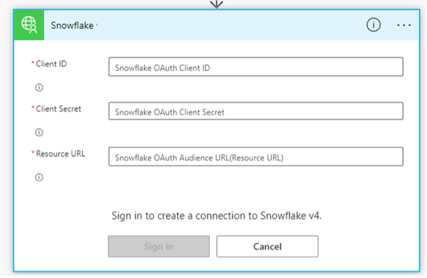
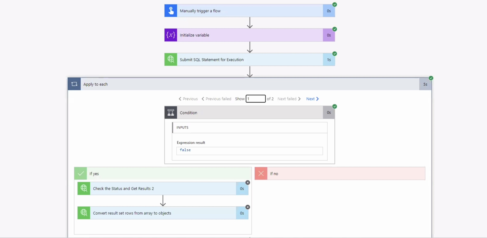

author: marzillo-snow
id: power_apps_snowflake
summary: This is a quickstart for using Microsoft Power Platform, Power Apps, Power Automate and Snowflake
categories: Getting-Started, data-engineering, microsoft, power-apps, power-platform, snowflake
environments: web
status: Published 
feedback link: https://github.com/Snowflake-Labs/sfguides/issues
tags: Getting Started, Data Engineering, Microsoft, Power Apps, Power Platform, Power Automate

# Getting Started with Power Apps and Snowflake
<!-- ------------------------ -->
## Overview 
Duration: 5

### Power Apps

Microsoft Power Apps and Power Automate are part of the Microsoft Power Platform, a suite of tools designed to empower organizations to create custom applications and automate workflows with minimal coding effort. Power Apps is a low-code development platform that enables users to build custom web and mobile applications using a drag-and-drop interface and pre-built templates. It offers seamless integration with various data sources and other Microsoft services, making it a powerful tool for businesses to create tailored solutions without the need for extensive development resources.

Power Automate, formerly known as Microsoft Flow, is a cloud-based service that enables users to automate repetitive tasks and create complex workflows across multiple applications and services. With its intuitive graphical interface and wide range of connectors, users can design and implement automation processes that streamline operations and improve overall efficiency.

### Snowflake

Snowflake is a cloud-based data warehousing and analytics platform that allows organizations to store, process, and analyze massive amounts of structured and semi-structured data. It provides a scalable and fully managed services that support diverse data types, making it an ideal choice for businesses looking to harness the power of their data. Snowflake's unique multi-cluster shared architecture separates storage, compute, and services, allowing users to scale resources independently, while offering robust security, seamless data sharing, and near-instant elasticity. Its platform-agnostic approach and support for various programming languages enable seamless integration with a wide range of tools and applications, making it a versatile solution for data-driven enterprises.

### Power Apps and Snowflake Integration

The Power Apps connector is a wrapper around the Snowflake SQL API that allows users of both platforms to read and write data to and from Snowflake from their Power Automate flows.

### Prerequisites
- Familiarity with [Snowflake](https://quickstarts.snowflake.com/guide/getting_started_with_snowflake/index.html#0) and a Snowflake account
- Familiarity with [PowerApps](https://learn.microsoft.com/en-us/power-apps/powerapps-overview) and a power apps account
- You must have a premium Power Apps license

### You'll Learn
- Configure a connection between Power Automate and Snowflake
- Run a simple query from Power Automate to query Snowflake data

### What You’ll Need 
- A free [Snowflake Account](https://signup.snowflake.com/)
- A Power Apps account [PowerApps](https://learn.microsoft.com/en-us/power-apps/powerapps-overview)


### What You’ll Build 
A Power Apps and Power Automate flow that will query data from a snowflake table.

<!-- ------------------------ -->
## Set Up Snowflake Environment
Duration: 5

The first thing we will do is create a database and warehouse in your Snowflake environment. Run the below code in a Snowflake worksheet.
```sql
use role accountadmin;

CREATE OR REPLACE WAREHOUSE HOL_WH WITH WAREHOUSE_SIZE='X-SMALL';

CREATE OR REPLACE DATABASE HOL_DB;

GRANT USAGE ON WAREHOUSE hol_wh TO ROLE public;
grant usage on database hol_db to role public;
grant usage on schema hol_db.public to role public;
grant select on table hol_db.public.rockers_table to role public;
```

### Load data
Now we will create a simple table in this database that we will query from the Power Apps connector. Run the below code in a Snowflake worksheet.

```sql
use role accountadmin;
use database HOL_DB;
use warehouse HOL_WH;
CREATE TABLE rockers_table (
  id INT,
  name VARCHAR(50),
  age INT
);

INSERT INTO rockers_table (id, name, age)
VALUES (1, 'Jimi Hendrix', 27),
       (2, 'Janis Joplin', 27),
       (3, 'Elvis Presley', 42),
       (4, 'Freddie Mercury', 45),
       (5, 'Whitney Houston', 48),
       (6, 'Michael Jackson', 50),
       (7, 'Prince', 57),
       (8, 'Amy Winehouse', 27),
       (9, 'Kurt Cobain', 27),
       (10, 'John Lennon', 40);
```

*for this quickstart we will use the ACCOUNTADMIN role to create the Snowflake environment, but in practice you will likely want to use another role when creating databases, tables and warehouses.

<!-- ------------------------ -->
## Set up Azure AD (Entra ID) authentication for Snowflake 
Duration: 15

Now we need to set up an app registration for Active Directory (Entra ID) OAuth, which will establish trust between your power app and Azure AD. This allows you to define and manage permissions and ensures only authorized users to access your application.

1.	In [Step 1: Configure the OAuth Resource in Azure AD](https://docs.snowflake.com/en/user-guide/oauth-azure#configure-the-oauth-resource-in-azure-ad), follow steps 1-10 and define the scope as SESSION:ROLE-ANY by following these [instructions](https://docs.snowflake.com/en/user-guide/oauth-azure#using-any-role-with-external-oauth).
2.	In [Step 2: Create an OAuth Client in Azure AD](https://docs.snowflake.com/en/user-guide/oauth-azure#create-an-oauth-client-in-azure-ad), follow steps 1-13.
3.	Navigate to Authentication -> Platform configurations -> Add a platform -> Add "https://global.consent.azure-apim.net/redirect" -> Click Save. Ensure that the redirect URL is set in the Snowflake OAuth Client and not the Snowflake OAuth Resource.
4.	Go to the resource created in Step 1 and go to Expose an API -> Add a client application -> Add your APPLICATION_CLIENT_ID from earlier in step 3 above -> Click Save
5.	Follow [Step 3: Collect Azure AD Information for Snowflake](https://docs.snowflake.com/en/user-guide/oauth-azure#collect-azure-ad-information-for-snowflake) entirely.
6.	If you have already established a connection using the Snowflake certified connector, Update existing security integration in Snowflake.  
```sql
ALTER SECURITY INTEGRATION <existing integration name>
set external_oauth_audience_list = ('<existing power bi audience list url>', '< Application ID URI from Step 1>')
```

If you are establishing a new connection Create new security integration in Snowflake by following the below steps. Make sure you've set your role as ACCOUNTADMIN before executing the query.
a)	In Microsoft Azure, go to your Snowflake OAuth Resource app and click on Endpoints. 

b)	To get the AZURE_AD_ISSUER in line 5, copy the link in the Federation metadata document field and open the link in a new tab. Copy the entityID link which should something look like this: https://sts.windows.net/90288a9b-97df-4c6d-b025-95713f21cef9/. Paste it into the query and make sure you have a / before the last quotation mark and that you keep the quotation marks. 

c)	To get the Keys URL in line 6, copy the link in the OpenID Connect metadata document field and open the link in a new tab. Copy the jwks_uri which should look something like this: https://login.microsoftonline.com/90288a9b-97df-4c6d-b025-95713f21cef9/discovery/v2.0/keys. Paste it into the query and make sure you keep the quotation marks.

d)	Replace the Audience List URL in line 7 with Application ID URI from Step 1. Keep the quotation marks.

e)	If your Snowflake account uses the same email address as your Microsoft Azure account, then replace login_name in line 9 with email_address. If not, keep it as is and do not type in your login name. Keep the quotation marks.

```sql
CREATE SECURITY INTEGRATION <integration name>
        type = external_oauth
        enabled = true
        external_oauth_type = azure
        external_oauth_issuer = '<AZURE_AD_ISSUER>'     
        external_oauth_jws_keys_url = '< https://login.windows.net/common/discovery/keys >'
        external_oauth_audience_list = ('<Application ID URI from registered resource app in Azure>')
        external_oauth_token_user_mapping_claim = 'upn'
        external_oauth_snowflake_user_mapping_attribute = 'login_name'
        external_oauth_any_role_mode = 'ENABLE';
```

``sql
### Update existing security integration in Snowflake
ALTER SECURITY INTEGRATION <existing integration name>
set external_oauth_audience_list = ('< Application ID URI from Step 1>');
```

<!-- ------------------------ -->

## Build Power Automate Flow
Duration: 15

From the Power Apps homescreen access the apps in the top left and click on Power Automate.


On the Power Automate screen click on the 'My Flow' menu item on the left then "New Flow" and then "Instant Cloud Flow". Select Power Apps as your trigger, name the flow and then create.


Now, it's time to build the connector! First click on "New Step" and the search bar search for "Snowflake" and select the "Submit SQL Statement for Execution" BUT first you will have to authenticate through the security integration establishing a connection to Snowflake:

While creating the connection in power platform, use the credentials as shown in below snapshot.
a)	Client Id: Snowflake OAuth Client ID from registered Client app in Azure
b)	Client Secret: Snowflake OAuth Client secret from registered Client app in Azure
c)	Resource URL: Application ID URI from registered Resource app in Azure



Once connected, you will populate the below information to query from Snowflake.

for each of the parameters in the Snowflake connector please populate as such:
```bash
Instance: <Snowflake host> (it should resemble: sn00111.central-us.azure.snowflakecomputing.com, do not include the "https://")
statement: select name, age from rockers_table;
database: HOL_DB
schema: PUBLIC
warehouse: HOL_DB
role: PUBLIC
```

Next, create a "New Step" and select the action "Convert result set rows from arrays to objects" and complete the activity parameters with the options below. Selected from the box on the left of the activity.

```bash
Row Type: rowType
Data: data
```

When completing the parameters for the "Convert result set rows from arrays to objects" make certain that you're selecting the items from the Dynamic Content options rather then simply typing the values. 


Lastly, and the "Response" action. Your flow should now look like this:


Click "save" in the top right corner then once saved click "test". Move through the prompts to run the Flow: select Manually, "Save & Test" then "Run Flow" then "Done". Within several seconds you should have successfully run the flow and it shoult look like this:


### Things to look out for
- If you're getting a username and password error make sure that you use the forward slash at the end the external_oauth_issuer parameter value
- Similarly you may explore changing the external_oauth_snowflake_user_mapping_attribute value to "email_name" as that value in your user profile will match the email address in your Power Apps account. 
- Make sure the you're getting the tenant id from your Power Apps account and not your Azure account as they don't always match.
- If you're not seeing the Snowflake actions in your options double check your Power Automate Environment and make sure you're using an environment where the Snowflake connector is available.
- When returning larger datasets from Snowflake (varies based on the length and width of the data, but typically more than several hundred rows of data) partitioning occurs and users will have to set up an "apply to each" flow in order to stitch the results together. This flow can be set up in a matter of minutes and will resemble the flow below.



<!-- ------------------------ -->
## Conclusion and Next Steps
Duration: 5

This quickstart will get you started with creating a simple power apps flow that connects to Snowflake and queries a table. From here you can use the connector in many different flows with different power apps activities to read data from and write data to Snowflake see here for more details: [Power-Apps](https://learn.microsoft.com/en-us/power-automate/getting-started). Additionally, users can utilize Azure Active Directory and SSO to create a user that links to the security integration to for power apps. [AAD-SSO](https://docs.snowflake.com/en/user-guide/oauth-powerbi#getting-started)

### Potential Use Cases for the Snowflake Power Apps

- Build data apps using the connector to share dashboard/analytics for your marketing campaign with Sales or other business users.
- Build an app to check the NextBest Offer or LTV of a customer to avoid churn.
- Build an app that will allow a user to execute queries from Teams chat against their Snowflake environment.
