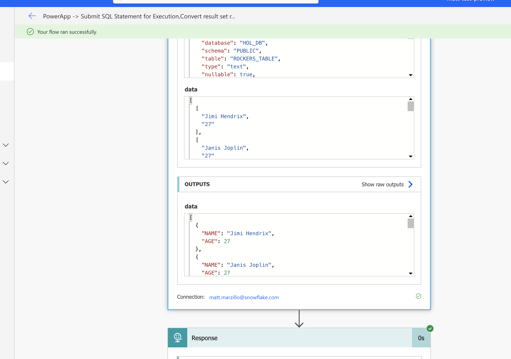

author: chandra-snow
id: power_apps_snowflake
summary: This is a quickstart for using Microsoft Power Platform, Power Apps, Power Automate and Snowflake
categories: Getting-Started, data-engineering, microsoft, power-apps, power-platform, snowflake
environments: web
status: Published 
feedback link: https://github.com/Snowflake-Labs/sfguides/issues
tags: Getting Started, Data Engineering, Microsoft, Power Apps, Power Platform, Power Automate

# Getting Started with Power Apps and Snowflake
<!-- ------------------------ -->
## Overview 
Duration: 15

### Power Apps

Microsoft Power Apps and Power Automate are part of the Microsoft Power Platform, a suite of tools designed to empower organizations to create custom applications and automate workflows with minimal coding effort. Power Apps is a low-code development platform that enables users to build custom web and mobile applications using a drag-and-drop interface and pre-built templates. It offers seamless integration with various data sources and other Microsoft services, making it a powerful tool for businesses to create tailored solutions without the need for extensive development resources.

Power Automate, formerly known as Microsoft Flow, is a cloud-based service that enables users to automate repetitive tasks and create complex workflows across multiple applications and services. With its intuitive graphical interface and wide range of connectors, users can design and implement automation processes that streamline operations and improve overall efficiency.

### Snowflake

Snowflake is a cloud-based data warehousing and analytics platform that allows organizations to store, process, and analyze massive amounts of structured and semi-structured data. It provides a scalable and fully managed services that support diverse data types, making it an ideal choice for businesses looking to harness the power of their data. Snowflake's unique multi-cluster shared architecture separates storage, compute, and services, allowing users to scale resources independently, while offering robust security, seamless data sharing, and near-instant elasticity. Its platform-agnostic approach and support for various programming languages enable seamless integration with a wide range of tools and applications, making it a versatile solution for data-driven enterprises.

### Power Apps and Snowflake Integration

The Power Apps connector is a wrapper around the Snowflake SQL API that allows users of both platforms to read and write data to and from Snowflake from their Power Automate flows.

### Prerequisites
- Familiarity with [Snowflake](https://quickstarts.snowflake.com/guide/getting_started_with_snowflake/index.html#0) and a Snowflake account
- Familiarity with [PowerApps](https://learn.microsoft.com/en-us/power-apps/powerapps-overview) and a power apps account
- You must have a premium Power Apps license

### You'll Learn
- Configure a connection between Power Automate and Snowflake
- Run a simple query from Power Automate to query Snowflake data

### What You’ll Need 
- A free [Snowflake Account](https://signup.snowflake.com/?utm_cta=quickstarts_)
- A Power Apps account [PowerApps](https://learn.microsoft.com/en-us/power-apps/powerapps-overview)


### What You’ll Build 
Load customer data into Snowflake and train a Clustering Model, run a PowerAutomate flow to call the model to segment the customers and then visualize the segments in PowerAutomate. 

<!-- ------------------------ -->
## Set Up Snowflake Environment
Duration: 15
### Create Snowflake Objects 

The first thing we will do is create a database and warehouse in your Snowflake environment. Run the below code in a Snowflake worksheet.
```sql
USE ROLE accountadmin;

CREATE OR REPLACE WAREHOUSE HOL_WH WITH WAREHOUSE_SIZE='X-SMALL';

CREATE OR REPLACE DATABASE HOL_DB;

GRANT USAGE ON WAREHOUSE hol_wh TO ROLE public;
grant usage on database hol_db to role public;
grant usage on schema hol_db.public to role public;
grant select on table hol_db.public.customer_presegments to role public;
```

### Load data
Now we will create a simple table in this database that we will query from the Power Apps connector. Run the below code in a Snowflake worksheet.

```sql
USE ROLE sysadmin;
USE DATABASE HOL_DB;
USE WAREHOUSE HOL_WH;
CREATE OR REPLACE TABLE CUSTOMER_PRESEGMENT (
	ID NUMBER(38,0),
	AGE NUMBER(38,0),
	GENDER VARCHAR(16777216),
	INCOME NUMBER(38,0),
	SPENDING_SCORE NUMBER(38,0),
	MEMBERSHIP_YEARS NUMBER(38,0),
	PURCHASE_FREQUENCY NUMBER(38,0),
	PREFERRED_CATEGORY VARCHAR(16777216),
	LAST_PURCHASE_AMOUNT NUMBER(38,2)
);
```
### Get Sample data and scripts from Azure Blob -> Shankar, Nithin  
1. Download the data file, notebook and the sql files - or can we reference it from Ext Stage.
2. Login to Snowflake Account and go to Data -> Databases -> HOL_DB
3. Select table CUSTOMER_PRESEGMENT and click Load Data 

4. Accept the defaults and complete loading data.


<!-- ------------------------ -->
## Setup PowerApps Environment 
### Set up Azure AD (Entra ID) authentication for Snowflake 
Duration: 15

Now we need to set up an app registration for Active Directory (Entra ID) OAuth, which will establish trust between your power app and Azure AD. This allows you to define and manage permissions and ensures only authorized users to access your application.

For the purposes of this demo, we will create a Service Principal Authentication and the steps are provided
in the document below. [MAKE SURE YOU FOLLOW SERVICE PRINCIPAL AUTH]

https://learn.microsoft.com/en-us/connectors/snowflakev2/#supported-capabilities-for-power-apps

<!-- ------------------------ -->
### Build a PowerApp
Duration: 15

After you have configured PowerApps Connector to Snowflake, go to Power Apps 
1. Click Tables -> Create Virtual Table 

2. Select Connection that you have setup in prior step, click NEXT
3. You should now see the table CUSTOMER_PRESEGMENT, click NEXT
4. On Configuration screen, click Next and click FINISH on the last screen.
5. Now, you see that age is -21 for person with ID2, click the pencil to make changes and save.

5. Click Apps, click [Start with a page design]
6. Select a dataverse table, and search CUSTOMER_PRESEGMENT and click Create App
8. Save the app as Marketing Segments.  
9. Click the Play button.
10. As a marketer you notice the customers aren't segmented.  

<!-- ------------------------ -->

### Lets look at the clustering Model and deploy it 
Typically your datascience teams develop and deploy the models, and you can invoke them. 
1. Connect to Snowflake 
2. Click Projects -> Notebook , dropdown and upload the notebook you downloaded earlier. 
3. Click the RunALL button in the top right. 


### Build a PowerAutomate Flow -> Shankar, Nithin 
Let's build a PowerAutomate Flow that calls Snowflake Stored Procedure that runs a clustering ML model on the data.
1. Launch PowerAutomate
2. Click Create new flow -> Create from blank
3. In the canvas -> click New step 
5. Search "Snowflake" and select "Submit SQL Statement for Execution" as shown 
 
6. Let's add the following parameters 
	Instance - your Snowflake account URL(without https)
	statement - CALL segmentize('CUSTOMER_PRESEGMENT','CUSTOMER_SEGMENT_V'); 
	database - HOL_DB
	schema - PUBLIC 
	warehouse - HOL_WH
	role  - sysadmin
7. Save it as Call_Segmentize_Flow 
		
		

### Update PowerApp to invoke your Flow -> Shankar, Nithin  
1. Put a Button in the Powerapp banner
2. Let's name it Segmentize, and on Action - Invoke the flow. 
3. Publish the App 
4. Now you can see Market Segment information updated for all rows. 


<!-- ------------------------ -->
## Conclusion and Next Steps
Duration: 5

This quickstart will get you started with creating a simple power apps flow that connects to Snowflake and queries a table. From here you can use the connector in many different flows with different power apps activities to read data from and write data to Snowflake see here for more details: [Power-Apps](https://learn.microsoft.com/en-us/power-automate/getting-started). Additionally, users can utilize Azure Active Directory and SSO to create a user that links to the security integration to for power apps. [AAD-SSO](https://docs.snowflake.com/en/user-guide/oauth-powerbi#getting-started)


Once connected, you will populate the below information to query from Snowflake.

for each of the parameters in the Snowflake connector please populate as such:
```bash
Instance: <Snowflake host> (it should resemble: sn00111.central-us.azure.snowflakecomputing.com, do not include the "https://")
statement: select name, age from rockers_table;
database: HOL_DB
schema: PUBLIC
warehouse: HOL_DB
role: PUBLIC
```

Next, create a "New Step" and select the action "Convert result set rows from arrays to objects" and complete the activity parameters with the options below. Selected from the box on the left of the activity.

```bash
Row Type: rowType
Data: data
```

When completing the parameters for the "Convert result set rows from arrays to objects" make certain that you're selecting the items from the Dynamic Content options rather then simply typing the values. 


Lastly, and the "Response" action. Your flow should now look like this:


Click "save" in the top right corner then once saved click "test". Move through the prompts to run the Flow: select Manually, "Save & Test" then "Run Flow" then "Done". Within several seconds you should have successfully run the flow and it shoult look like this:



### Things to look out for
- If you're getting a username and password error make sure that you use the forward slash at the end the external_oauth_issuer parameter value
- Similarly you may explore changing the external_oauth_snowflake_user_mapping_attribute value to "email_name" as that value in your user profile will match the email address in your Power Apps account. 
- Make sure the you're getting the tenant id from your Power Apps account and not your Azure account as they don't always match.
- If you're not seeing the Snowflake actions in your options double check your Power Automate Environment and make sure you're using an environment where the Snowflake connector is available.
- When returning larger datasets from Snowflake (varies based on the length and width of the data, but typically more than several hundred rows of data) partitioning occurs and users will have to set up an "apply to each" flow in order to stitch the results together. This flow can be set up in a matter of minutes and will resemble the flow below.


<!-- ------------------------ -->
## Conclusion and Next Steps
Duration: 5

This quickstart will get you started with creating a simple power apps flow that connects to Snowflake and queries a table. From here you can use the connector in many different flows with different power apps activities to read data from and write data to Snowflake see here for more details: [Power-Apps](https://learn.microsoft.com/en-us/power-automate/getting-started). Additionally, users can utilize Azure Active Directory and SSO to create a user that links to the security integration to for power apps. [AAD-SSO](https://docs.snowflake.com/en/user-guide/oauth-powerbi#getting-started)

### Potential Use Cases for the Snowflake Power Apps

- Build data apps using the connector to share dashboard/analytics for your marketing campaign with Sales or other business users.
- Build an app to check the NextBest Offer or LTV of a customer to avoid churn.
- Build an app that will allow a user to execute queries from Teams chat against their Snowflake environment.
