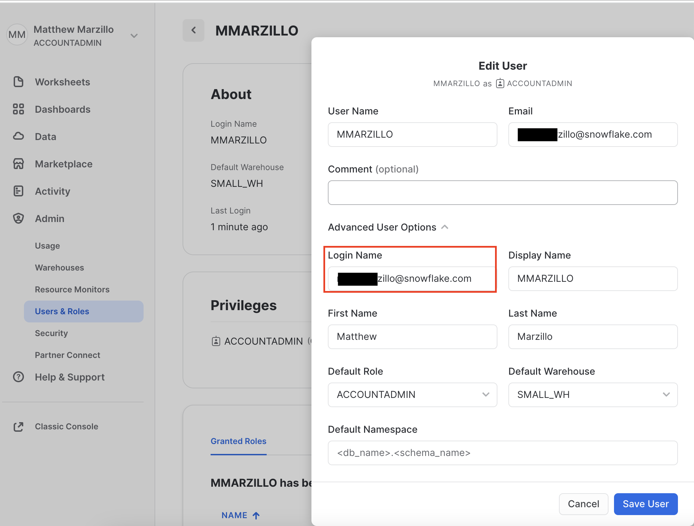

author: marzillo-snow
id: power_apps_snowflake
summary: This is a quickstart for using Microsoft Power Platform, Power Apps, Power Automate and Snowflake
categories: Getting-Started, data-engineering, microsoft, power-apps, power-platform, snowflake
environments: web
status: Published 
feedback link: https://github.com/Snowflake-Labs/sfguides/issues
tags: Getting Started, Data Engineering, Microsoft, Power Apps, Power Platform, Power Automate

# Getting Started with Power Apps and Snowflake
<!-- ------------------------ -->
## Overview 
Duration: 5

### Power Apps

Microsoft Power Apps and Power Automate are part of the Microsoft Power Platform, a suite of tools designed to empower organizations to create custom applications and automate workflows with minimal coding effort. Power Apps is a low-code development platform that enables users to build custom web and mobile applications using a drag-and-drop interface and pre-built templates. It offers seamless integration with various data sources and other Microsoft services, making it a powerful tool for businesses to create tailored solutions without the need for extensive development resources.

Power Automate, formerly known as Microsoft Flow, is a cloud-based service that enables users to automate repetitive tasks and create complex workflows across multiple applications and services. With its intuitive graphical interface and wide range of connectors, users can design and implement automation processes that streamline operations and improve overall efficiency.

### Snowflake

Snowflake is a cloud-based data warehousing and analytics platform that allows organizations to store, process, and analyze massive amounts of structured and semi-structured data. It provides a scalable and fully managed services that support diverse data types, making it an ideal choice for businesses looking to harness the power of their data. Snowflake's unique multi-cluster shared architecture separates storage, compute, and services, allowing users to scale resources independently, while offering robust security, seamless data sharing, and near-instant elasticity. Its platform-agnostic approach and support for various programming languages enable seamless integration with a wide range of tools and applications, making it a versatile solution for data-driven enterprises.

### Power Apps and Snowflake Integration

The Power Apps connector is a wrapper around the Snowflake SQL API that allows users of both platforms to read and write data to and from Snowflake from their Power Automate flows.

### Prerequisites
- Familiarity with [Snowflake](https://quickstarts.snowflake.com/guide/getting_started_with_snowflake/index.html#0) and a Snowflake account
- Familiarity with [PowerApps](https://learn.microsoft.com/en-us/power-apps/powerapps-overview) and a power apps account
- You must have a premium Power Apps license

### You'll Learn
- Configure a connection between Power Automate and Snowflake
- Run a simple query from Power Automate to query Snowflake data

### What You’ll Need 
- A free [Snowflake Account](https://signup.snowflake.com/)
- A Power Apps account [PowerApps](https://learn.microsoft.com/en-us/power-apps/powerapps-overview)


### What You’ll Build 
A Power Apps and Power Automate flow that will query data from a snowflake table.

<!-- ------------------------ -->
## Set Up Snowflake Environment
Duration: 5

The first thing we will do is create a database and warehouse in your Snowflake environment. Run the below code in a Snowflake worksheet.
```sql
use role accountadmin;

CREATE OR REPLACE WAREHOUSE HOL_WH WITH WAREHOUSE_SIZE='X-SMALL';

CREATE OR REPLACE DATABASE HOL_DB;

GRANT USAGE ON WAREHOUSE hol_wh TO ROLE public;
grant usage on database hol_db to role public;
grant usage on schema hol_db.public to role public;
grant select on table hol_db.public.rockers_table to role public;
```

### Load data
Now we will create a simple table in this database that we will query from the Power Apps connector. Run the below code in a Snowflake worksheet.

```sql
use role accountadmin;
use database HOL_DB;
use warehouse HOL_WH;
CREATE TABLE rockers_table (
  id INT,
  name VARCHAR(50),
  age INT
);

INSERT INTO rockers_table (id, name, age)
VALUES (1, 'Jimi Hendrix', 27),
       (2, 'Janis Joplin', 27),
       (3, 'Elvis Presley', 42),
       (4, 'Freddie Mercury', 45),
       (5, 'Whitney Houston', 48),
       (6, 'Michael Jackson', 50),
       (7, 'Prince', 57),
       (8, 'Amy Winehouse', 27),
       (9, 'Kurt Cobain', 27),
       (10, 'John Lennon', 40);
```

*for this quickstart we will use the ACCOUNTADMIN role to create the Snowflake environment, but in practice you will likely want to use another role when creating databases, tables and warehouses.

<!-- ------------------------ -->
## Create Security Integration in Snowflake
Duration: 10

Copy and paste the below security integration in a Snowflake worksheet. Everything will be left as is other than populating the tenant id for the external_oauth_issuer paramater. This will come from your Power Apps environment

```sql
create or replace security integration powerapps
       type = external_oauth
       enabled = true
       external_oauth_type = azure 
       external_oauth_issuer = 'https://sts.windows.net/<tenant id>/'     
       external_oauth_jws_keys_url = 'https://login.windows.net/common/discovery/keys'
       external_oauth_audience_list = ('https://analysis.windows.net/powerbi/connector/Snowflake','https://analysis.windows.net/powerbi/connector/snowflake')
       external_oauth_token_user_mapping_claim = 'upn'
       external_oauth_snowflake_user_mapping_attribute = 'login_name'
       external_oauth_any_role_mode = 'ENABLE';
```

To find your Power Apps tenant id you will go to your Power Apps environment, click the settings gear button in the top right, click "Session Details" then copy the "Tenant ID" value and paste it into the code from above where <tenant id> is tagged.


For this integration we are using 'login_name' as the mapping attribute. You will want go to your users and roles in the admin section of your Snowflake environment and make sure that there is exactly one user where the login name matches the username (likely an email address) in your Power Apps environment. It must match exactly and is case sensitive. The user must also have a default warehouse and a default role.


This security integration is the same as setting up a Power BI integration [PowerBI](https://docs.snowflake.com/en/user-guide/oauth-powerbi#getting-started)

<!-- ------------------------ -->
## Build Power Automate Flow
Duration: 15

From the Power Apps homescreen access the apps in the top left and click on Power Automate.


On the Power Automate screen click on the 'My Flow' menu item on the left then "New Flow" and then "Instant Cloud Flow". Select Power Apps as your trigger, name the flow and then create.


Now, it's time to build the connector! First click on "New Step" and the search bar search for "Snowflake" and select the "Submit SQL Statement for Executiuon" for each of the parameters in the Snowflake connector please populate as such:
```bash
Instance: <Snowflake host> (it should resemble: sn00111.central-us.azure.snowflakecomputing.com, do not include the "https://")
statement: select name, age from rockers_table;
database: HOL_DB
schema: PUBLIC
warehouse: HOL_DB
role: PUBLIC
```

Next, create a "New Step" and select the action "Convert result set rows from arrays to objects" and complete the activity parameters with the options below. Selected from the box on the left of the activity.

```bash
Row Type: rowType
Data: data
```

When completing the parameters for the "Convert result set rows from arrays to objects" make certain that you're selecting the items from the Dynamic Content options rather then simply typing the values. 


Lastly, and the "Response" action. Your flow should now look like this:


Click "save" in the top right corner then once saved click "test". Move through the prompts to run the Flow: select Manually, "Save & Test" then "Run Flow" then "Done". Within several seconds you should have successfully run the flow and it shoult look like this:


### Things to look out for
- If you're getting a username and password error make sure that you the forward slash at the end the external_oauth_issuer parameter value
- Similarly you may explore changing the external_oauth_snowflake_user_mapping_attribute value to "email_name" as that value in your user profile will match the email address in your Power Apps account. 
- Make sure the you're getting the tenant id from your Power Apps account and not your Azure account as they don't always match.
- If you're not seeing the Snowflake actions in your options double check your Power Automate Environment and make sure you're using an environment where the Snowflake connector is available.


<!-- ------------------------ -->
## Conclusion and Next Steps
Duration: 5

This quickstart will get you started with creating a simple power apps flow that connects to Snowflake and queries a table. From here you can use the connector in many different flows with different power apps activities to read data from and write data to Snowflake see here for more details: [Power-Apps](https://learn.microsoft.com/en-us/power-automate/getting-started). Additionally, users can utilize Azure Active Directory and SSO to create a user that links to the security integration to for power apps. [AAD-SSO](https://docs.snowflake.com/en/user-guide/oauth-powerbi#getting-started)

### Potential Use Cases for the Snowflake Power Apps

- Build data apps using the connector to share dashboard/analytics for your marketing campaign with Sales or other business users.
- Build an app to check the NextBest Offer or LTV of a customer to avoid churn.
- Build an app that will allow a user to execute queries from Teams chat against their Snowflake environment.
