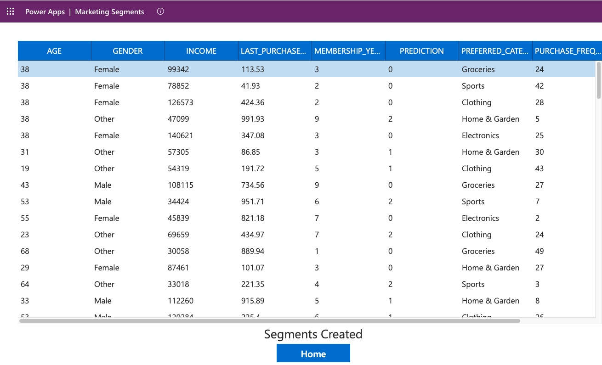

author: chandra-snow
id: power_apps_snowflake
summary: This is a quickstart for using Microsoft Power Platform, Power Apps, Power Automate and Snowflake
categories: Getting-Started, data-engineering, microsoft, power-apps, power-platform, snowflake
environments: web
status: Published 
feedback link: https://github.com/Snowflake-Labs/sfguides/issues
tags: Getting Started, Data Engineering, Microsoft, Power Apps, Power Platform, Power Automate
Date: 3/23/25

# Getting Started with Power Apps and Snowflake
Duration: 45

<!-- ------------------------ -->
## Overview 
Join Snowflake and Microsoft for an quickstart to build a PowerApps App that can access retail customer data as virtual table, do a writeback, trigger a segmentation flow using PowerAutomate without making a copy of the data. We will use the PowerApps connector from Microsoft premium connectors marketplace, which is a wrapper around the Snowflake SQL API that allows you to read and write data to Snowflake databases, and execute any stored procedures.

### Power Apps
Microsoft Power Apps and Power Automate are part of the Microsoft Power Platform, a suite of tools designed to empower organizations to create custom applications and automate workflows with minimal coding effort. 

### Snowflake
Snowflake is a cloud-based data platform that allows organizations to store, process, and analyze massive amounts of structured and semi-structured data. It provides a scalable and fully managed services that support diverse data types, making it an ideal choice for businesses looking to harness the power of their data. 

### You'll Learn
- Using Power Platform to read and write to Snowflake. 
- Leveraging Snowflake ML in Power Apps 

### What You’ll Need 
- A free [Snowflake Account](https://signup.snowflake.com/?utm_cta=quickstarts_)
- A Power Apps account [PowerApps](https://www.microsoft.com/en-us/power-platform/products/power-apps/)
- You must have a premium Power Apps license 
- Use your existing Company Entra ID, or [sign-up](https://signup.microsoft.com/get-started/signup?products=FAF849AB-BD30-42B2-856C-8F1EDC230CE9)  


### What You’ll Build 
- Load customer data into Snowflake tables. 
- Configure a connection between PowerPlatform and Snowflake.
- Use PowerApps to build a model app, access Snowflake tables to read and writeback.
- Use Snowflake Notebook to create a Machine Learning model. 
- Invoke model predictions using PowerAutomate. 

<!-- ------------------------ -->
## Set Up Snowflake Environment
Duration: 15
### Create Snowflake Objects 

The first thing we will do is create a database and warehouse in your Snowflake environment. 

```sql
USE ROLE accountadmin;

CREATE OR REPLACE WAREHOUSE HOL_WH WITH WAREHOUSE_SIZE='X-SMALL';

CREATE OR REPLACE DATABASE HOL_DB;

GRANT USAGE ON WAREHOUSE hol_wh TO ROLE public;
grant usage on database hol_db to role public;
grant usage on schema hol_db.public to role public;

-- Create a Table with the columns suggested below 
USE ROLE accountadmin;
USE DATABASE hol_db;
USE WAREHOUSE hol_wh;
CREATE OR REPLACE TABLE CUSTOMER_PRESEGMENT (
	ID NUMBER(38,0),
	AGE NUMBER(38,0),
	GENDER VARCHAR(16777216),
	INCOME NUMBER(38,0),
	SPENDING_SCORE NUMBER(38,0),
	MEMBERSHIP_YEARS NUMBER(38,0),
	PURCHASE_FREQUENCY NUMBER(38,0),
	PREFERRED_CATEGORY VARCHAR(16777216),
	LAST_PURCHASE_AMOUNT NUMBER(38,2)
);
GRANT ALL ON SCHEMA  hol_db.public TO ROLE ANALYST;

```

### Get Sample data and scripts 
1. Download the data for the demo [sample data file](scripts/customer_segmentation_data.csv) 
2. Login to Snowflake Account and go to Data -> Databases -> HOL_DB
3. Select table CUSTOMER_PRESEGMENT and click Load Data 

4. Accept the defaults and complete loading data.

<!-- ------------------------ -->
## Setup PowerApps Environment 
<a id="Azure_Setup"></a>
### Set up Azure AD (Entra ID) authentication for Snowflake 
Duration: 15

Now we need to set up an app registration for Active Directory (Entra ID) OAuth, which will establish trust between your Power Platform and Snowflake. This allows you to define and manage permissions and ensures only authorized users to access your application.

For the purposes of this demo, we will create a  **MAKE SURE YOU FOLLOW SERVICE PRINCIPAL AUTH** Authentication and the steps are provided
in the document below. 

https://learn.microsoft.com/en-us/connectors/snowflakev2/#supported-capabilities-for-power-apps or 
you can download and run the automation scripts in Azure CLI as an admin 

[Script-for-Windows Users](/scripts/AppCreationAndConfigLatest_win.ps1) | 
[Script-for-Mac Users](/scripts/AppCreationAndConfigLatest_Mac.ps1)

<!-- ------------------------ -->
### Build a PowerApp and connect to Snowflake data
Duration: 15

After you have configured PowerApps Connector to Snowflake, go to Power Apps 
1. Click Tables -> Create Virtual Table 
	

2. Select Connection that you have setup in prior step, click NEXT
	

3. You should now see the table CUSTOMER_PRESEGMENT, click NEXT

4. On Configuration screen, click Next and click FINISH on the last screen.

5. Now, you see that age is negative for ID1 and ID2, click the pencil to make changes and save.


6. Click Apps, click [Start with a page design]

7. Select a dataverse table, and search CUSTOMER_PRESEGMENT and click Create App

8. Save the app as Marketing Segments.  

9. Click the Play button.
	
	
10. As a marketer you notice the customers aren't segmented as there is no segment field. 

<!-- ------------------------ -->

## Snowflake Segmentation ML Model  
### Lets look at the clustering Model and deploy it 
Typically your datascience teams trains and deploy the ML models, and you can invoke them. 
1. Download the Customer Segmentation Notebook [Jupyter ipynb](scripts/customer_segmentation.ipynb) 

2. Connect to Snowflake: Projects -> Notebook

3. Import the notebook you downloaded earlier by clicking import .ipynb file
	

4. Click on packages, and make sure you add the packages listed in the screenshot

	

5. Click the RunALL button or click START and execute individual cell. 

6. Create a Procedure to Invoke Model Predictions by running below SQL in a worksheet 
	[storedproc](scripts/segment_storedproc.sql)


### Build a PowerAutomate Flow
Let's build a PowerAutomate Flow to call stored procedure you created and run the model.
1. Launch PowerAutomate

2. Click My flows -> + New Flow  -> Instant Cloud Flow

3. Give a name Call_Segmentize and select "When Power Apps calls a flow (V2)" for Choose how to trigger this flow 
   

4. In the canvas -> click New step 

5. Search "Snowflake" and select "Submit SQL Statement for Execution" as shown 
	 
6. Let's add the following parameters 
	- Instance - your Snowflake account URL(***WITHOUT https***)
	- Body/statement - CALL segmentize('CUSTOMER_PRESEGMENT','CUSTOMER_SEGMENTS'); (*** Advanced Parameters ***)
	- database - HOL_DB
	- schema - PUBLIC 
	- warehouse - HOL_WH
	- role  - ANALYST
	
	Make sure to set connection to the one you created [above](#set-up-azure-ad-entra-id-authentication-for-snowflake) 	
	

7. Run the flow and ensure it completes successfully. 
		
		
### Update PowerApp to invoke your Flow 
1. Put a button called Segmentize in the CUSTOMER_PRESEGMENT screen.
	

2. Click Tables -> Create Virtual Tables and select CUSTOMER_SEGMENTS 
	

3. Let's create another screen (name: Trigger_Success) to indicate when the flow is completed. 

4. You can choose "Header and Table" or "Blank: for the screen type, we will connect new view named CUSTOMER_SEGMENTS which has the PREDICTION field. 
	![show_segments] (assets/segment_show.png) (*** You may see data because you tested the flow ***)
5. Go back the CUSTOMER_PRESEGMENT screen, click the segmentize button and in the Properties->Advanced table 
   pick ONSELECT action and enter (Call_Segmentize.Run(); Navigate(Trigger_Success))
   
6. Now you can see PREDICTION column in the CUSTOMER_SEGMENTS view displayed. 
   

### Reset the Demo 
``` sql
DROP DATABASE hol_db;
DROP WAREHOUSE hol_wh;
```
<!-- ------------------------ -->
## Conclusion and Next Steps
Duration: 5

This quickstart will get you started with creating a simple power apps flow that connects to Snowflake and queries a table. From here you can use the connector in many different flows with different power apps activities to read data from and write data to Snowflake see here for more details: [Power-Apps](https://learn.microsoft.com/en-us/power-platform/). 


### Things to look out for
- Use Service Principal based Authentication and test the connection with a PowerAutomate flow for troubleshooting
- Make sure you have set the role, default_namespace, default_warehouse, login_name are set are set for the service_principal user. 
- If you're not seeing the Snowflake actions in your options double check your Power Automate Environment and make sure you're using an environment where the Snowflake connector is available.

<!-- ------------------------ -->
### Potential Use Cases for the Snowflake Power Apps

- Build data apps using the connector to share dashboard/analytics for your marketing campaign with Sales or other business users.
- Build an app to check the NextBest Offer or LTV of a customer to avoid churn.
- Build an app that will allow a user to execute queries from Teams chat against their Snowflake environment.
