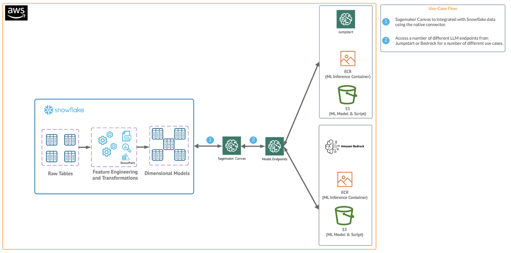
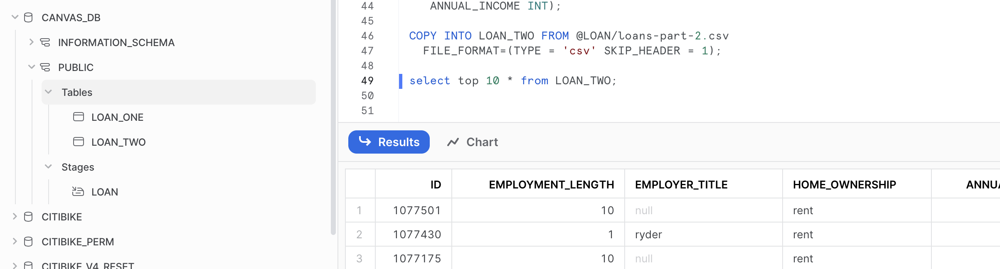
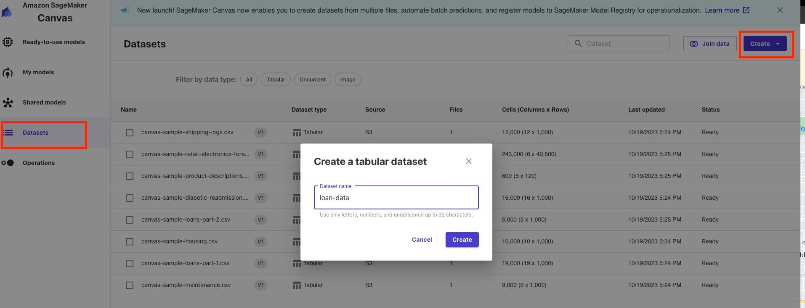
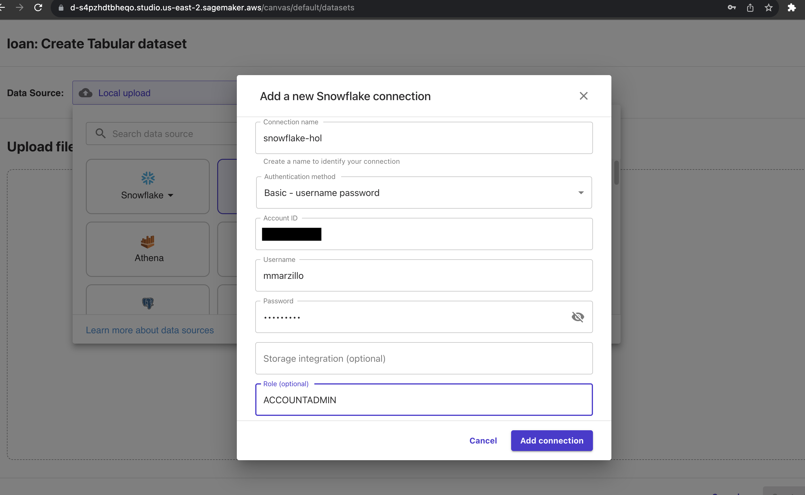
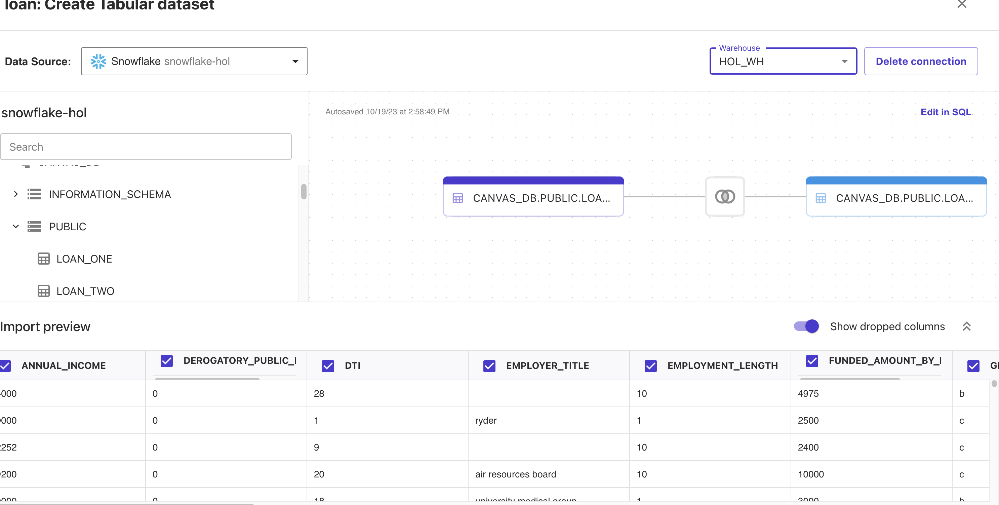

author: marzillo-snow
id: getting_started_with_sagemaker_canvas_with_snowflake_for_genai
summary: This is a qucikstart for using Sagemaker with Canvas for Generative AI
categories: getting-started,data-science-&-ml,data-engineering,app-development, gen-ai, llms, aws, sagemaker, canvas
environments: web
status: Published 
feedback link: https://github.com/Snowflake-Labs/sfguides/issues
tags: Getting Started, Data Science, Data Engineering, Generative AI, LLM, AWS

# Getting Started with Canvas and Snowflake for Generative AI Use Cases
<!-- ------------------------ -->
## Overview 
Duration: 10

Amazon SageMaker is a fully managed machine learning service. With SageMaker, data scientists and developers can quickly and easily build and train machine learning models, and then directly deploy them into a production-ready hosted environment. It provides an integrated Jupyter authoring notebook instance for easy access to your data sources for exploration and analysis, so you don't have to manage servers. 

SageMaker Canvas is a visual interface that simplifies the process of building, training, and deploying machine learning models. It allows users to construct and manage machine learning workflows through a drag-and-drop interface, making it easier to create and iterate on machine learning models without writing extensive code. 

Additionally, Canvas now has native integrations with AWS generative ai services like Sagemaker Jumpstart and Bedrock. 

This quickstart is designed to serve as an introduction for using Snowflake with Canvas and generative ai services.

### Prerequisites
- Familiarity with [Snowflake](https://quickstarts.snowflake.com/guide/getting_started_with_snowflake/index.html#0) and a Snowflake account
- Familiarity with SageMaker and an AWS account
- Familiarity with Canvas and a Canvas Service available in Sagemaker

### You'll Learn
- How to get started with Sagemaker Canvas
- Using Snowflake with Sagemaker Canvas
- Using generative ai with Snowflake data in Canvas

### What You’ll Need 
- A free [Snowflake Account](https://signup.snowflake.com/)
- [AWS Account](https://aws.amazon.com/premiumsupport/knowledge-center/create-and-activate-aws-account/)
- The AWS account should be a sandbox account with open network policies or you you should [create a VPC](https://docs.aws.amazon.com/vpc/latest/userguide/working-with-vpcs.html) in the same region as the Snowflake account
- In the VPC [create subnets](https://docs.aws.amazon.com/vpc/latest/userguide/VPC_Internet_Gateway.html) in a few AZs with an internet gateway to allow egress traffic to the internet by using a routing table and security group for outbound traffic

### What You’ll Build 
You will build a Canvas flow that leverages Snowflake data and AWS generative ai capabilities
- Connect to Snowflake data from Canvas
- Utilize generative AI capabilities in Sagemaker Canvas

The end-to-end workflow will look like this:


<!-- ------------------------ -->
## Use Case
Duration: 5

In this use case you will build a binary model based on the 'Loan Fraud Prediction' dataset from Kaggle and [AWS](https://catalog.us-east-1.prod.workshops.aws/workshops/80ba0ea5-7cf9-4b8c-9d3f-1cd988b6c071/en-US/1-use-cases/4-finserv). Also, Important to note that you can always supplement your data with Snowflake Marketplace data.

<!-- ------------------------ -->
## Set Up Snowflake Environment
Duration: 5

The first thing we will do is create a database and warehouse in your Snowflake environment. Run the below code in a Snowflake worksheet.
```sql
--create database and warehouse
use role accountadmin;
CREATE OR REPLACE WAREHOUSE HOL_WH WITH WAREHOUSE_SIZE='X-SMALL';
CREATE OR REPLACE DATABASE CANVAS_DB;

--create stage
USE DATABASE CANVAS_DB;
CREATE OR REPLACE STAGE LOAN
URL='s3://loan-data-snowflake-qs/'
FILE_FORMAT = (TYPE = 'csv');

--create loan_one table
CREATE OR REPLACE TABLE LOAN_ONE
  (ID NUMBER,
   LOAN_STATUS STRING,
   LOAN_AMOUNT NUMBER,
   FUNDED_AMOUNT_BY_INVESTORS NUMBER,
   LOAN_TERM NUMBER,
   INTEREST_RATE NUMBER,
   INSTALLMENT NUMBER,
   GRADE STRING,
   SUB_GRADE STRING,
   VERIFICATION_STATUS STRING,
   ISSUED_ON DATE,
   PURPOSE STRING,
   DTI NUMBER,
   INQUIRIES_LAST_SIX_MONTHS NUMBER,
   OPEN_CREDIT_LINES NUMBER,
   DEROGATORY_PUBLIC_RECORDS NUMBER,
   REVOLVING_LINE_UTILIZATION_RATE NUMBER,
   TOTAL_CREDIT_LINES NUMBER);

COPY INTO LOAN_ONE FROM @LOAN/loans-part-1.csv
  FILE_FORMAT=(TYPE = 'csv' FIELD_DELIMITER = ',' SKIP_HEADER = 1);

select top 10 * from LOAN_ONE;

--Create loand_two table
CREATE OR REPLACE TABLE LOAN_TWO
  (ID NUMBER,
   EMPLOYMENT_LENGTH NUMBER,
   EMPLOYER_TITLE STRING,
   HOME_OWNERSHIP STRING,
   ANNUAL_INCOME INT);

COPY INTO LOAN_TWO FROM @LOAN/loans-part-2.csv
  FILE_FORMAT=(TYPE = 'csv' SKIP_HEADER = 1);

select top 10 * from LOAN_TWO;
```

What you have done here is copied over two files from an open S3 bucket and created two new tables inside of a new database in Snowflake. We will access these tables from Canvas to explore them with generative ai capabilities.

Your Snowflake environment should look like this:


<!-- ------------------------ -->
## Set Up Sagemaker Canvas
Duration: 10

Open up your Sagemaker Canvas application and click on the datasets blade on the left side then click create in the upper left and select a tabular dataset then name the dataset "loan-data" and click create.


Navigate to the Data Source menu at the top left and select Snowflake as the data source you will then populate your Snowflake AccountID and utilize username and password to connect to Snowflake. The connection should look similar to this.


Note: We used a simple username and password to authenticate, but users may want to consider additional options to such as Oauth which is supported by Canvas to Snowflake 
[Canvas Oauth](https://docs.aws.amazon.com/sagemaker/latest/dg/canvas-setting-up-oauth.html)

Canvas has this great interface with the Snowflake connection where you can perform joins and transformations on your Snowflake data pushing down the compute and preparing the dataset for analysis.

Go ahead and selection the "HOL_WH" warehouse from the Warehouse dropdown then find the LOAN_ONE and LOAN_TWO tables in CANVAS_DB.PUBLIC and drag and drop them into the workspace. Canvas will recognize that the tables will be joined on the ID field. For transformations this all that we will be doing in this lab, but you can check out [this link](https://docs.aws.amazon.com/sagemaker/latest/dg/canvas-prepare-data.html) to learn about all of the data prep functionality inside of Canvas. Additionally, you scroll down to the preview and look at the exploratory capabilities in Canvas

Your workspace should look something like this:



Click on "Create Dataset" and now you've created a Canvas dataset!
<!-- ------------------------ -->'
## Talking to your data
Duration: 5


<!-- ------------------------ -->
## Conclusion and Additional Considerations
Duration: 5

This quickstart is just that, a quick way to get you started with using SageMaker with Snowflake and Snowpark. For enterprise uses, data scientists and developers will want to consider additional details. Most important is considering the tracking of the mlops lineage from data to model to deployment. A more mature architecture will include the additional steps below which include the registration of the data and the model.


### What We covered
- Connecting to Snowflake data from Sagemaker Canvas
- Utilizing GenAI functionality in Canvas with Snowflake data to generate insights

### Additional Considerations
- There are some great blogs on Medium regarding Snowpark, SageMaker and using Snowflake with AWS.

- [Snowpark for python with SageMaker](https://medium.com/snowflake/using-snowpark-for-python-with-amazon-sagemaker-44ec7fdb4381)

- [Operationalizing Snowpark](https://medium.com/snowflake/operationalizing-snowpark-python-part-one-892fcb3abba1)

- [AWS and Snowflake](https://aws.amazon.com/financial-services/partner-solutions/snowflake/)

If you have any questions, reach out to your Snowflake account team!