author: Yogitha Chilukuri
id: getting_started_with_search_optimization
summary: This is a sample Snowflake Guide
categories: getting-started
environments: web
status: Published 
feedback link: https://github.com/Snowflake-Labs/sfguides/issues
tags: Getting Started, Data Engineering, Search Optimization, Search, Query acceleration, performance, speed 

# Getting started with Search Optimization

<!-- ------------------------ -->
## Overview 
Duration: 10

Are you looking to significantly improve the performance of point lookup queries and certain analytical queries that require fast access to records? Search Optimization Service will help you achieve exactly that. 

We create optimized search access paths for the columns in your tables. We take advantage of those optimized paths in addition to other processing enhancements to reduce the number of micro partitions scanned and hence speed up the queries. 

For example, in the picture below, we have a query that is trying to find all rows where the name is Martin in a table. If Search Optimization is enabled, it helps identify ***the micro partitions that don't contain ‘Martin’ in the name column*** and reduces the number of partitions to be scanned. In this particular example, it reduces the number of partitions to be scanned from 15 to 1.


### Prerequisites
A basic knowledge of how to run and monitor queries in the Snowflake Web UI. 

### What you’ll learn
- How to acquire a suitable dataset from Snowflake Marketplace
- How to enable Search Optimization
- What the performance impact of enabling Search Optimization on different queries is

### What You'll Need
- A supported [browser](https://docs.snowflake.com/en/user-guide/setup.html)
- A Snowflake account with the Enterprise Edition 
  - Sign-up using [Snowflake Trial](https://signup.snowflake.com/) 
  ***OR***
  - Get access to an existing Snowflake Enterprise Edition account with the `ACCOUNTADMIN` role or the `IMPORT SHARE` privilege

### What You’ll Build 
Performant queries that explore the data from wikidata datasource. Wikidata is a free, collaborative, multilingual knowledge graph.  It is a document-oriented database, focused on items, which represent any kind of topic, concept, or object. More information can be found at https://en.wikipedia.org/wiki/Wikidata


Negative: The Marketplace data used in this guide changes from time-to-time, and your query results may be slightly different than indicated in this guide. Additionally, the Snowflake UI changes periodically as well, and instructions/screenshots may be out of date.

---

<!-- ------------------------ -->
## Setup Snowflake Account and Virtual Warehouse 
Duration: 5

The first step in the guide is to set up or log into Snowflake and set up a virtual warehouse if necessary. 

### Access Snowflake's Web UI

[app.snowflake.com](https://app.snowflake.com)

**If this is the first time you are logging into the Snowflake UI**, you will be prompted to enter your account name or account URL that you were given when you acquired a trial. The account URL contains your account name and potentially the region. Click `Sign-in` and you will be prompted for your user name and password.

**If this is not the first time you are logging into the Snowflake UI**, you should see a `Select an account to sign into` prompt and a button for your account name listed below it. Click the account you wish to access and you will be prompted for your user name and password (or another authentication mechanism).

### Switch to the appropriate role

The Snowflake web interface has a lot to offer, but for now, switch your current role from the default `SYSADMIN` to `ACCOUNTADMIN`. 


This will allow you to create shared databases from Snowflake Marketplace listings. If you don't have the `ACCOUNTADMIN` role, switch to a role with `IMPORT SHARE` privileges instead.

---

## Create a Virtual Warehouse (if needed)
Duration: 2

***If you don't already have access to a Virtual Warehouse to run queries***, you will need to create one.

- Navigate to the Compute > Warehouses screen using the menu on the left side of the window
- Click the big blue + Warehouse button in the upper right of the window
- Create a Small Warehouse as shown in the screen below

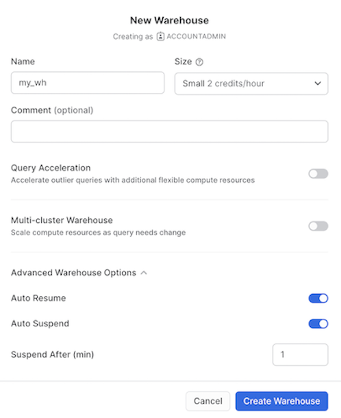

Be sure to change the `Suspend After (min) field` to 1 min to avoid wasting compute credits.

***If you already have access to a Virtual Warehouse to run queries***, make sure to scale it up or down to `Small` Warehouse for this guide.

---

## Acquiring Data from Snowflake Marketplace
Duration: 2

The next step is to acquire data that has all data types supported by Search Optimization. The best place to acquire this data is the Snowflake Marketplace.

- Navigate to the `Marketplace` screen using the menu on the left side of the window
- Search for `Wikidata`  in the search bar
- Find and click the `Util Wikidata` tile

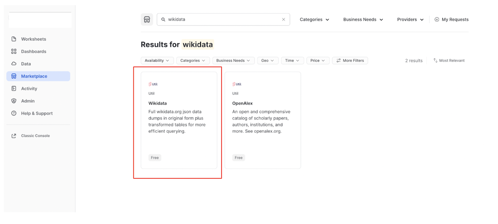

- Once in the listing, click the big blue Get Data button

On the `Get Data` screen, you may be prompted to complete your user profile if you have not done so before. Enter your name and email address into the profile screen and click the blue `Save` button. You will be returned to the `Get Data` screen.

Congratulations! You have just created a shared database named `WIKIDATA` from a listing on the Snowflake Marketplace. Click the big blue `Query Data` button and advance to the next step in the guide.

---

## Data Setup
Duration: 10

The prior section opened a worksheet editor in the new Snowflake UI with a few pre-populated queries that came from the sample queries defined in the Marketplace listing. You are not going to run any of these queries in this guide, but you are welcome to run them later. 


### Understanding the data

You are going to first copy over two of the tables from `WIKIDATA` (the database that you just imported) into a new database (we will call it `WIKI_SO`). 

This is necessary as 
- You wouldn’t have the privileges to set up Search Optimization on the shared `WIKIDATA` database  
- It will allow you to run the same query on both search optimized (in `WIKI_SO` database) and non search optimized tables (in `WIKIDATA` database) to compare the performance of Search Optimization.

The first table we will use is `wikidata_original`, it has information about the wikidata articles such as description, label etc. There are ***96.9 million rows*** in this table. 

The second table is `entity_is_subclass_of`, which contains the information about subclass categories like subclass id and subclass name. It is a smaller table and has ***~3.3 million rows***. 

To further understand the relationship between these two tables, consider the following 	query, where we are exploring an entity with Id `Q1968` (which is a Formula One article)

```
SELECT o.label, e.subclass_of_name
    FROM
        entity_is_subclass_of as e
    JOIN wikidata_original as o
    ON e.entity_id = o.id
WHERE
    e.entity_id = 'Q1968'; -- Formula One article

```

The result looks like this:

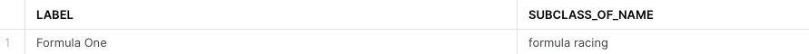

So, Id `Q1968` is an article about `Formula One` (`LABEL`) and this entity rightly belongs to the subclass `Formula Racing` (`SUBCLASS_OF_NAME`). 

### Copy the required tables into a new database

Now let’s copy over the above two tables into a new database before we enable Search Optimization on them. 

Before we run the queries to do so, let’s create a new worksheet named `Search Optimization Guide` by clicking the `+ icon` on the left navigation bar. Throughout this guide, we will run  the queries on the search optimized tables in the `Search Optimization Guide` worksheet.

Run the query below in the `Search Optimization Guide` worksheet:

```
CREATE DATABASE wiki_so;
CREATE SCHEMA experiments;

//Note: Substitute my_wh with your warehouse name if different
ALTER WAREHOUSE my_wh set warehouse_size='4x-large';

//This query will run in ~90 seconds.
CREATE TABLE wiki_so.experiments.wikidata_original AS (SELECT * FROM wikidata.wikidata.wikidata_original);

//This query will run in ~7 seconds.
CREATE TABLE wiki_so.experiments.entity_is_subclass_of AS (SELECT * FROM wikidata.wikidata.entity_is_subclass_of);

//Note: Substitute my_wh with your warehouse name if different
ALTER WAREHOUSE my_wh set warehouse_size='small';
```

### Enable Search Optimization

Now let’s enable Search Optimization for the `wikidata_original` table in the newly created `WIKI_SO` Database (`Search Optimization Guide` Worksheet). We can either enable Search Optimization on the whole table or enable it for a few columns depending on the queries we want to accelerate. 

For this guide, let’s selectively enable Search optimization for a few columns:

```
// Defining Search Optimization on VARCHAR fields
ALTER TABLE wikidata_original ADD SEARCH OPTIMIZATION ON EQUALITY(id, label, description);

// Defining Search Optimization on VARCHAR fields optimized for Wildcard search
ALTER TABLE wikidata_original ADD SEARCH OPTIMIZATION ON SUBSTRING(description);

// Defining Search Optimization on VARIANT field
ALTER TABLE wikidata_original ADD SEARCH OPTIMIZATION ON EQUALITY(labels);
```

### Ensure Search Optimization first time indexing is complete

Now, let’s verify that Search Optimization is enabled and the backend process has finished indexing our data. It will take about 2 minutes for that to happen as the optimized search access paths are being built for these columns by Snowflake. 

Run the below query against the newly created database (`WIKI_SO`)

```
DESCRIBE SEARCH OPTIMIZATION ON wikidata_original;
```
It would return a result like below:

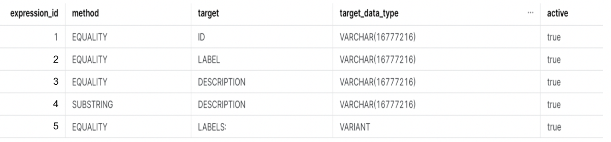


Make sure that all the rows have the `active` column set to `true` before proceeding further in this guide.

Now you are all set up to run some queries and dive deep into Search Optimization. 

We have intentionally enabled Search Optimization for `wikidata_original` table and not `entity_is_subclass_of` table for this guide.

> **_NOTE:_** 
Please note that the results, query time, partitions or bytes scanned might differ when you run the queries in comparison to the values noted below as the data gets refreshed monthly in the above two tables. 

---
## Equality and Wildcard Search
Duration: 10

Now let’s build some queries and observe how Search Optimization helps optimize them. 

To start off, we have already enabled Search Optimization on the `LABEL` and `DESCRIPTION` fields for equality and substring predicates respectively in the previous section.

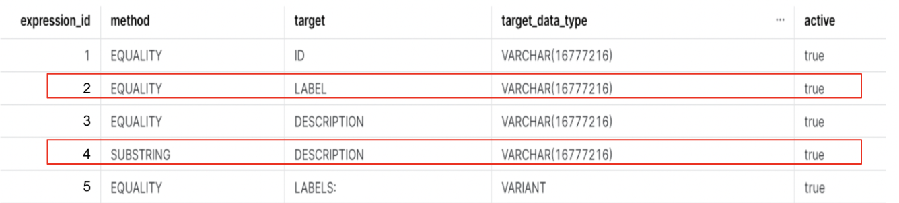

> **_NOTE:_** \
If you wish to run the queries below on both databases (`WIKIDATA` and `WIKI_SO`) to evaluate performance impact, please make sure to run the commands below before you switch from one database to another. This will ensure that no cached results (hot or warm) are used. \
\
ALTER SESSION SET USE_CACHED_RESULT = false; \
ALTER WAREHOUSE my_wh SUSPEND;

Now, let’s say you want to find all the articles about the `iPhone` which have the words `wikimedia or page` in the description (in that order). The query would look like:

```
SELECT * 
  FROM wikidata_original
  WHERE 
    label= 'iPhone' AND 
    description ILIKE '%wikimedia%page%';
```

| **Without search optimization** | **With Search Optimization**|
|-----------------------------|-------------------------|
| It takes 28 seconds to run the query on the table without search optimization. the other interesting aspect is, **almost all partitions** need to be scanned. also you will note that ~23.01GB data is scanned. Following are the full statistics 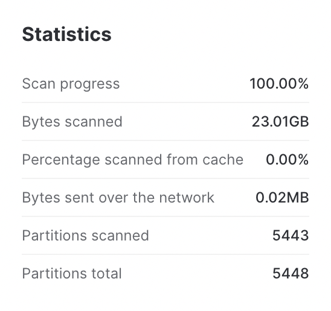 | On the other hand, the query takes 5.7 seconds on the search optimized table. you will notice that **only 7 partitions** of the total 5413 partitions are scanned. in addition only 31.79MB of the data needs to be scanned.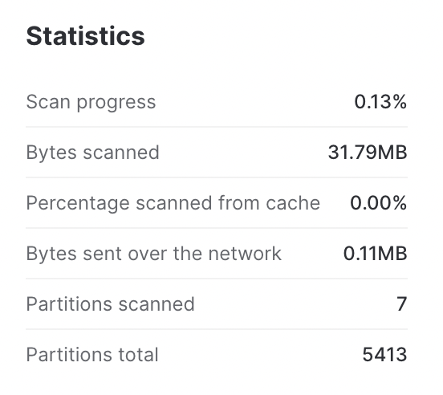 |

*Looking at the numbers side by side, we know that Search Optimization has definitely improved the query performance.*

|                                      | **Without Search Optimization**  | **With Search Optimization** | **Performance Impact** |
|--------------------------------------|------------------------------|--------------------------|--------------------|
| **Query run time**                   | 28 seconds                   | 5.7 seconds              |**79.64% improvement** in query speed  |
| **Percentage of partitions scanned** | 99.91%                       |0.13%                     |**99.78% less partitions** scanned     |
| **Bytes scanned**                    |23.01GB                       |31.79MB                   |**99.86% less data** scanned           |

Let’s look at another example. Say, you want to find all articles which have the words `blog post` in their description, following would be the query to do so:

```
SELECT * 
  FROM wikidata_original 
  WHERE 
    description ILIKE '%blog post%';
```
| **Without search optimization** | **With Search Optimization**|
|-----------------------------|-------------------------|
| The query runs for 23 seconds and **ALL partitions** are scanned. Also, 10.60GB of data is scanned. See the picture below for full details. | On the other hand, the query runs in 8.7 seconds on the Search Optimized table. You’ll also notice that **only 347 partitions** of the total 5413 partitions are scanned. In addition 4.09GB of the data was scanned.  See the picture below for full details.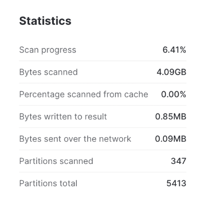 |

*As you can see from the **Performance Impact** column above, using Search Optimization allows us to make significant improvements in query performance.*

|                                      | **Without Search Optimization**  | **With Search Optimization** | **Performance Impact** |
|--------------------------------------|------------------------------|--------------------------|--------------------|
| **Query run time**                   | 23 seconds                   | 8.7 seconds              |**62.17% improvement** in query speed  |
| **Percentage of partitions scanned** | 100%                       |6.41%                     |**99.59% less partitions** scanned     |
| **Bytes scanned**                    |10.60GB                       |4.09GB                  |**61.42% less data** scanned           |

Want to learn more? You can refer to our external documentations for benefitting from Search Optimization for queries with [ Equality Predicates](https://docs.snowflake.com/en/user-guide/search-optimization-service.html#equality-or-in-predicates) and [Wildcards](https://docs.snowflake.com/en/user-guide/search-optimization-service.html#substrings-and-regular-expressions)

---

## Searching in Variant data
Duration: 5

In this section, let’s search in the variant data and analyze how Search Optimization helps in these cases. 

> **_NOTE:_**  
 If you wish to run the queries below on both databases (`WIKIDATA` and `WIKI_SO`) to evaluate performance impact, please make sure to run the commands below before you switch from one database to another. This will ensure that no cached results (hot or warm) are used. \
 \
ALTER SESSION SET USE_CACHED_RESULT = false;\
ALTER WAREHOUSE my_wh SUSPEND;


To start off, we have already enabled Search Optimization on the `Labels` field which is an unstructured JSON.


Let’s say you want to find all entries where the label is set to `National Doughnut Day` in the `English version` of the article. To do so, you can run the following query:

```
SELECT * 
  FROM wikidata_original 
  WHERE labels:en:value = 'National Doughnut Day';
```
The above query returns **2 rows out of 96.9 million rows**. 

| **Without search optimization** | **With Search Optimization**|
|-----------------------------|-------------------------|
| The query runs for 42 seconds on the shared database. You will also see that **ALL partitions** need to be scanned. In addition, ~83.38GB of data was scanned. 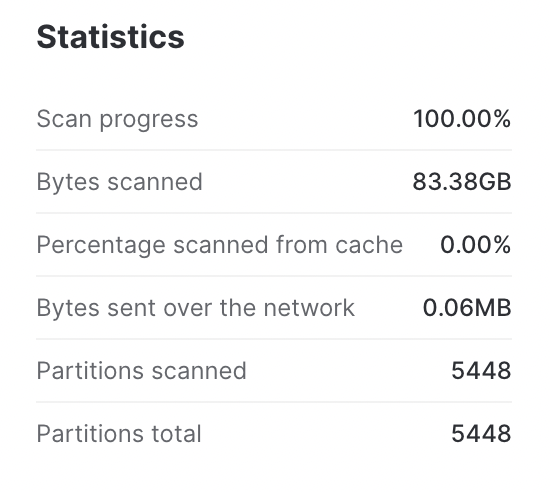 | On the other hand, it takes 5.2 seconds to run the same query on the search optimized table. You will also notice that **only 5 partitions** of the total 5413 partitions are scanned. In addition only 94.25MB of the data was scanned.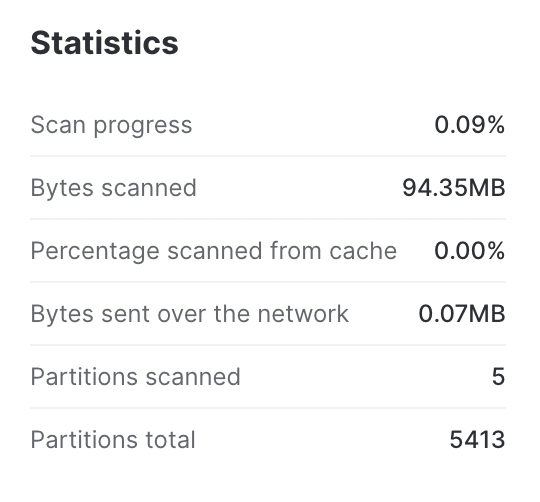 |

*From the **Performance Impact** column below, we see that using Search Optimization allows us to make significant improvements in query performance*

|                                      | **Without Search Optimization**  | **With Search Optimization** | **Performance Impact** |
|--------------------------------------|------------------------------|--------------------------|--------------------|
| **Query run time**                   | 42 seconds                   | 5.2 seconds              |**87.62% improvement** in query speed  |
| **Percentage of partitions scanned** | 100%                       |0.09%                     |**99.91% less partitions** scanned     |
| **Bytes scanned**                    |83.38GB                       |94.35MB                   |**99.80% less data** scanned           |

Want to learn more? You can refer to our external documentations for [benefitting from Search Optimization for queries on Variant Data](https://docs.snowflake.com/en/user-guide/search-optismization-service.html#fields-in-variant-columns)

----

## Accelerating Joins
Duration: 5

The search optimization service can improve the performance of queries that join a small table with a large table. 

> **_NOTE:_** \
In data warehousing, the large table is often referred to as the fact table. The small table is referred to as the dimension table. The rest of this topic uses these terms when referring to the large table and the small table in the join.

To enable the search optimization service to improve the performance of joins, you need to add Search Optimization to the fact table (the larger of the two tables).
In addition, the dimension table (the smaller of the two tables) should have few distinct values. In our guide, `wikidata_original` is the fact table whereas `entity_is_subclass_of` is the dimension table.

Let’s say you want to find out the Subclass ID of all articles related to `‘Formula One’`. 
Say we know the following entity ids in the wikidata_original table mapping to ‘Formula One’ articles are => `'Q1437617','Q8564669','Q1968' and 'Q5470299'`

So, the query to find the `‘Formula One’` subclass Ids would look like below:

```
SELECT *  
  FROM entity_is_subclass_of AS e 
  JOIN wikidata_original AS o ON (e.subclass_of_name = o.label)
  WHERE e.entity_id IN ('Q1437617','Q8564669','Q1968','Q5470299') ;
```

> **_NOTE:_** \
If you wish to run the queries below on both databases (`WIKIDATA` and `WIKI_SO`) to evaluate performance impact, please make sure to run the commands below before you switch from one database to another. This will ensure that no cached results (hot or warm) are used. \
\
ALTER SESSION SET USE_CACHED_RESULT = false; \
ALTER WAREHOUSE my_wh SUSPEND;

| **Without search optimization** | **With Search Optimization**|
|-----------------------------|-------------------------|
| It takes ~43 seconds and scans nearly **ALL partitions** and about 64.64GB of data to find the resulting Subclass ID. See the picture below for full details. 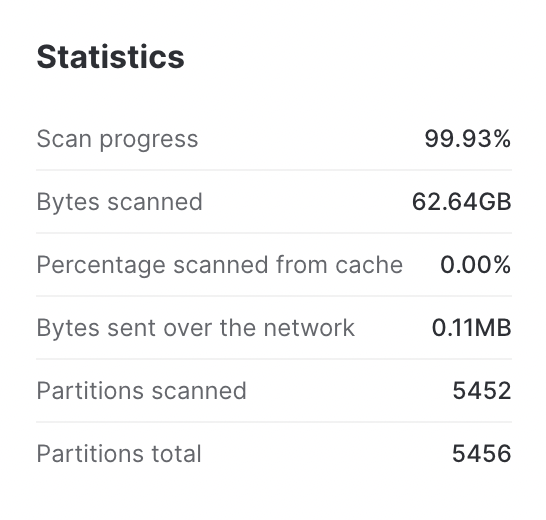 | On the other hand, the query on the search optimized table, returns the result (subclass_of_id => Q1199515) in 4.4 seconds. Also, only a small portion of data is scanned to find the answer (**12 partitions** and 99.30MB of data is scanned). |

*If we compare the statistics side by side, we can observe that Search Optimization greatly optimized the JOIN query.*

|                                      | **Without Search Optimization**  | **With Search Optimization** | **Performance Impact** |
|--------------------------------------|------------------------------|--------------------------|--------------------|
| **Query run time**                   | 43 seconds                   | 4.4 seconds              |**92.09% improvement** in query speed  |
| **Percentage of partitions scanned** | 99.92%                       |0.22%                     |**99.70% less partitions** scanned     |
| **Bytes scanned**                    |62.64GB                       |99.30MB                   |**99.84% less data** scanned           |

Want to learn more? You can refer to our external documentations for [benefitting from Search Optimization for JOIN queries](https://docs.snowflake.com/en/user-guide/search-optimization-service.html#enabling-the-search-optimization-service-to-improve-the-performance-of-joins)

----

## Queries that are not benefitting from Search Optimization

Not all queries benefit from Search Optimization. One such example is the following query to get all entries that have description with the words wikimedia and page in that order. The query would look like:

```
SELECT * 
  FROM WIKIDATA_ORIGINAL 
  WHERE description ILIKE '%wikimedia%page%';
```

The following query returns **1.4 Million rows**. As shown in the snapshot below, ***only 1 out of the 5413 partitions is skipped*** when you run the query on the search optimized `wikimedia_original` table in our newly created `WIKI_SO` database . 

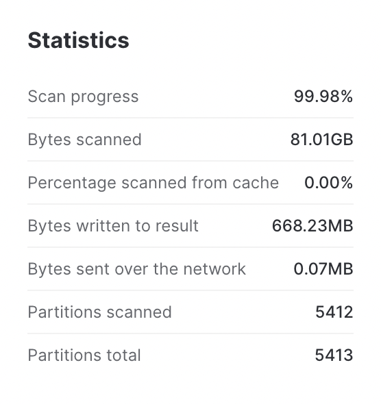

**Such queries aren’t benefitted from Search Optimization as the number of partitions that can be skipped by Search Optimization Service are very minimal.**

----

## Conclusion
Duration: 1

In this guide, we have covered how to acquire a shared database from Snowflake Marketplace, how to enable Search Optimization on specific columns and analyze the performance improvements in queries with Search Optimization enabled. 

You are now ready to explore the larger world of Snowflake [Search Optimizaitn Service](https://docs.snowflake.com/en/user-guide/search-optimization-service.html)
