author: Sigma Computing -- Shawn Namdar, Partner Engineer
id: getting_started_with_sigma
summary: This is a guide to setting up Sigma on top of Snowflake and visualizing some sample data.
categories: Getting Started
environments: web
status: Published 
feedback link: https://github.com/Snowflake-Labs/sfguides/issues
tags: Getting Started, Analytics, Data Engineering, BI, Business Intelligence, Sigma, Sigma Computing, Snowflake, Dashboarding, Visualization, Analysis, Excel, Spreadsheet 

# Sigma Workbooks Quickstart
<!-- ------------------------ -->
## Lab Overview 
Duration: 3

This entry-level lab introduces you to the user interface and basic capabilities of both Snowflake and Sigma, and how to use both solutions to build analytics. It is designed specifically for use with the Snowflake, free 30-day trial at https://trial.snowflake.com and the Sigma, free 14-day trial available within the Snowflake free trial on Snowflake Partner Connect. When done with the lab you should be ready to load your own data into Snowflake, analyze and visualize it with Sigma.

### What You’ll Learn 
The exercises in this lab will walk you through the steps to: 
- Create databases, tables, stages and warehouses
- Load structured and semi-structured data
- Use Partner Connect to start up a free Sigma trial account connected to Snowflake
- Explore and analyze data and turn it into visualizations and dashboards

### What You'll Need 
- A Snowflake free 30-day trial environment: [https://trial.snowflake.com](https://trial.snowflake.com)
- Download .SQL file: [https://sigma-snowflake-vhol.s3-us-west-1.amazonaws.com/sql/sigma_vhol.sql](https://sigma-snowflake-vhol.s3-us-west-1.amazonaws.com/sql/sigma_vhol.sql)

### What You'll Build
By walking through this lab you will:
- Sign up for a Snowflake free trial and load the instance with some sample data
- Create a Sigma free trial through Snowflake Partner Connect
- Build a Sigma Dataset that models the sample data in Snowflake
- Build a polished Sigma Workbook that analyzes the sample data  

<!-- ------------------------ -->
## Prepare Your Snowflake Lab Environment
Duration: 3

### Steps to Prepare Your Lab Environment
1. If not yet done, register for a Snowflake free 30-day trial at [https://trial.snowflake.com](https://trial.snowflake.com) 

    - You will have different Snowflake editions (Standard, Enterprise, e.g.), cloud providers (GCP, AWS, or Azure), and Regions (US Central, Europe West, e.g.) Available to you. We suggest you select the cloud provider and region which is physically closest to you and your data, and select the Enterprise edition so you can leverage advanced capabilities that are not available in the Standard Edition.

    - After registering, you will receive an email with an activation link and your Snowflake account URL. Bookmark this URL for easy, future access. After activation, you will create a username and password. Write down these credentials.

2. Click [here](https://sigma-snowflake-vhol.s3-us-west-1.amazonaws.com/sql/sigma_vhol.sql) and download the “sigma_vhol.sql” file to your local machine. This file contains pre-written SQL commands and we will use this file later in the lab.

<!-- ------------------------ -->
## The Snowflake User Interface
Duration: 10

### Logging Into the Snowflake User Interface (UI)
Open a browser window and enter the URL of your Snowflake 30-day trial environment. You should see the login screen below. Enter your unique credentials to log in.

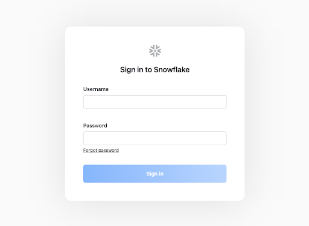

### Navigating the Snowflake Snowsight UI
First let’s get you acquainted with Snowflake! This section covers the basic components of the user interface to help you orient yourself. We will move top to bottom on the left panel of the UI.

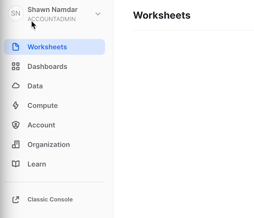

- The **Worksheets** tab provides an interface for submitting SQL queries, performing DDL and DML operations and viewing results as your queries/operations complete. 

- The **Dashboard** tab provides a view of your snowsight dashboards that have been created. These dashboards are a good way to provide quick administrative insights for your snowflake instance.

- The **Data** tab expands into three sub categories: Databases, Shared Data, and Marketplace.

    - The **Databases** sub-tab shows information about the databases you have created or have privileges to access. You can create, clone, drop, or transfer ownership of databases as well as load data (limited) in the UI. Notice several databases already exist in your environment. However, we will not be using these in this lab. 

    - The **Shared Data** sub-tab is where data sharing can be configured to easily and securely share Snowflake table(s) among separate Snowflake accounts or external users, without having to create a second copy of the table data. At the end of this lab is a module on data sharing.

    - The **Marketplace** sub-tab loads the Snowflake Data Marketplace, a place where you can access third party datasets.

- The **Compute** tab expands into three sub categories: History, Warehouses, and Resource Monitors.

    - The **History** sub-tab allows you to view the details of all queries executed in the last 14 days in the Snowflake account.

    - The **Warehouses** sub-tab is where you set up and manage compute resources (virtual warehouses) to load or query data in Snowflake. Note a warehouse called “COMPUTE_WH (XS)” already exists in your environment. 

    - The **Resource Monitors** sub-tab allows you to build and review resource monitors. These are useful for managing compute costs.

- From the **Worksheet** tab when you click the “+ Worksheet” button in the top right a new worksheet will be opened.

- In the left pane is the database objects browser which enables users to explore all databases, schemas, tables, and views accessible by the role selected for a worksheet. The bottom pane shows results of queries and operations. 

- The various windows on this page can be resized by moving the small sliders on them.  And if during the lab you need more room to work in the worksheet, collapse the database objects browser in the left pane. Many of the screenshots in this guide will have this database object browser closed.

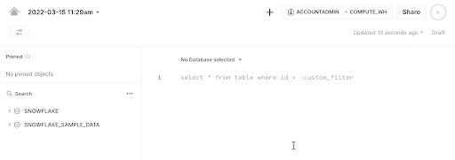

- At the top left of the page click on the downward facing arrow next to the worksheet name, select “Import SQL from File”, then browse to the “sigma_vhol.sql” file you downloaded in the prior module and select “Open”. All of the SQL commands you need to run for the remainder of this lab will now appear on the new worksheet. **Do not run any of the SQL commands yet**. We will come back to them later in the lab and execute them one at a time.

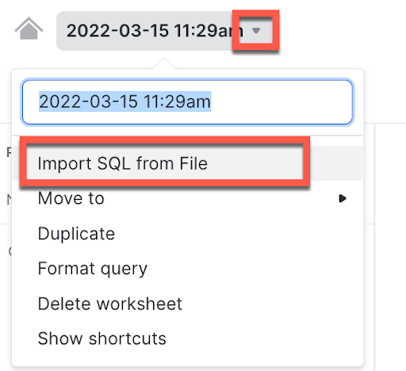

<!-- ------------------------ -->
## Provisioning Sigma
Duration: 5

### Provisioning Sigma via Partner Connect 

1. In the top ribbon of the Snowflake UI, click on the Partner Connect icon. From here you can automatically connect your Snowflake account with our partner applications available for a free trial. Click on the Sigma tile on the first row to start our new Sigma free trial.

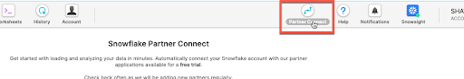

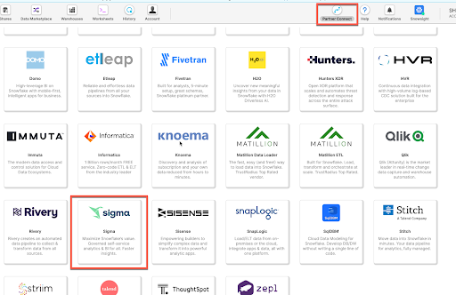

  - Sigma is the only cloud analytics and BI platform purpose-built as software-as-a service for Snowflake. Sigma offers a spreadsheet-like interface anyone can use to explore, analyze, and visualize data at unlimited scale.

  - In this section we will provision a Sigma account (called an organization). Sigma is an Elite Snowflake BI Partner and a free trial of Sigma is available via the Snowflake PartnerConnect which is within the Snowflake UI

  - **Direct Connection to Snowflake**  
  Sigma is unique versus many other BI products in that Sigma is fully-managed SaaS, offers a direct connection to Snowflake , and pushes all queries to Snowflake for execution. Benefits of this include:

    - Data accessed by Sigma is always live and accurate

    - Unlimited query speed and scale as Sigma leverages the compute resources of Snowflake. Queries across up to hundreds of billions of rows are performant.

    - Stronger security and governance as data never leaves Snowflake and it is easy to control permissions via a single point of access. 

  - With many other BI products, data is extracted out of Snowflake to local desktops/servers for analysis which leads to stale data, limited scale and speed, and security issues with extracts scattered across many desktops and file shares.

  - You will see a dialog box that will show you the objects that will be created in your account.  We will be using the PC_SIGMA_WH warehouse and the PC_SIGMA_ROLE for this lab.  These are automatically created for you as part of the LAUNCH.

  - Please do not select any databases.  We will be giving the correct permissions later in the lab. 

2. Click “Connect”.

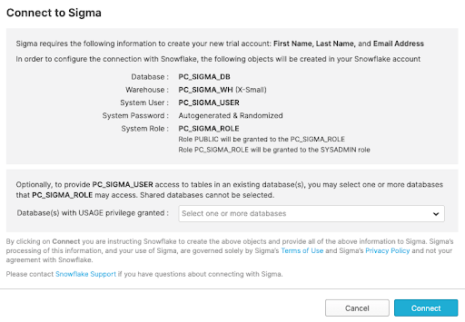

3. Now click “Activate” which will open a new tab.

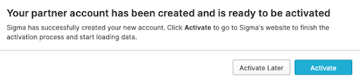

4. A new tab for connecting to Sigma will pop-up in your web browser. Please leave the tab in place as we will come back to it later when we begin working with Sigma.

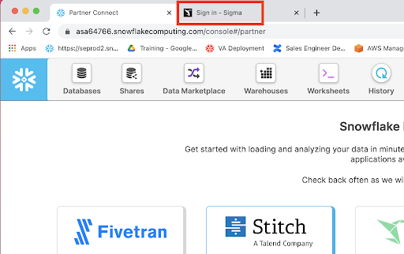

<!-- ------------------------ -->
## Preparing & Loading Data into Snowflake
Duration: 15

### The Lab Story
This Snowflake and Sigma lab will be done as part of a theoretical real-world “story” to help you better understand why we are performing the steps in this lab and in the order they appear. 

Throughout this lab we will be working with some common sales data from our fictitious physical retail company ‘Plugs Electronics’. This data includes order and SKU numbers, product name, price, store name and region, and customer data. Some of this data is structured and some is JSON semi-structured.

We will load this data into Snowflake and highlight some Snowflake capabilities. Via Snowflake PartnerConnect, we will then connect Sigma, a business intelligence platform, to Snowflake to then run some analytics on the data and turn it into several charts to form a dashboard.

### Create a Database & Table
1. Go back to the Snowflake UI and click on the Worksheets tab. Per prior step, ensure the SQL text from the “sigma_vhol.sql” file has been loaded into the worksheet.

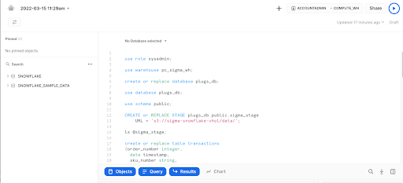

2. As you can see from the SQL we loaded into our worksheet, a worksheet can have more than one command in it.  SQL commands are delimited by semicolons.  In order to run a single command, all you have to do is click anywhere on the line/command you would like to execute, then click on the "Play" button.  

3. At this point, we are ready to click and "Play" on each line in our worksheet in order to get our Snowflake environment setup for our Sigma users.  Some of the steps will repeat things we have already executed in this lab, via the UI.  For the next few steps click on each line in the worksheet and run the command.  Each step in the lab guide has a description of what the command is doing.

**Warning**
In this lab, never check the “All Queries” box at the top of the worksheet. We want to run SQL queries one at a time in a specific order; not all at once.

4. use role sysadmin;
This will set the context of the WORKSHEET, to use the role of SYSADMIN, when we "Play" the command. We do not want to be in the role ACCOUNTADMIN any more.

5. use warehouse pc_sigma_wh;
Sets the PC_SIGMA_WH to be used for commands run in the WORKSHEET.  As you can see by the (XS) to the right of the warehouse name, that an extra small warehouse is being used for this lab.  An XS translates to a single node cluster for our virtual warehouse. [Here is a link to Snowflake’s doc](https://docs.snowflake.com/en/user-guide/warehouses-overview.html#warehouse-size) covering warehouses in detail.

6. create or replace database plugs_db;
Creates a database named PLUGS_DB in our account.  It also automatically sets the context for the worksheet to use .  

7. use database plugs_db;
Specifies to use the plugs_db database for the session

8. use schema public;
Sets the context of the WORKSHEET to use the  schema.

9. CREATE or REPLACE STAGE plugs_db.public.sigma_stage URL = 's3://sigma-snowflake-vhol/data/';
Creates an external stage in Snowflake that points to an external S3 bucket that has the data files we would like to use for the lab.

10. ls @sigma_stage;
Lists all the contents of the stage that was just created.

### Loading Data Into Snowflake
FYI the data we will be using is demo data for a fictitious physical retailer called “Plugs Electronics. This data has been exported and pre-staged for you in an AWS s3 bucket in the us-west-1 (N California) region. There are two files.

The first data file is “Plugs Transactions.csv” includes order and SKU numbers, product name, price, store name and region, and customer data. It is in comma-delimited format with double quote enclosing and a single header line. The data represents 4.7m rows and 1k MB total size. Below is a partial screenshot of the Plugs structured data CSV file:

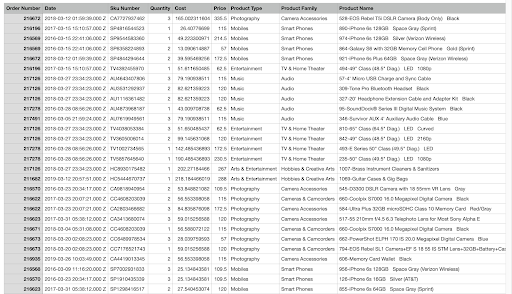

1. create or replace table transactions  
(order_number integer,  
  date timestamp,  
  sku_number string,  
  quantity integer,  
  cost integer,  
  price integer,  
  product_type string, 
  product_family string,  
  product_name string,  
  store_name string,  
  store_key integer,  
  store_region string,  
  store_state string,  
  store_city string,  
  store_latitude integer,  
  store_longitude integer,  
  customer_name string,  
  cust_key integer);

2. create file format "PLUGS_DB"."PUBLIC".COMMA_DELIMITED  
TYPE = 'CSV'  
COMPRESSION = 'AUTO'  
FIELD_DELIMITER = ','  
RECORD_DELIMITER = '\n'  
SKIP_HEADER = 1  
FIELD_OPTIONALLY_ENCLOSED_BY = 'NONE'  
TRIM_SPACE = FALSE  
ERROR_ON_COLUMN_COUNT_MISMATCH = TRUE  
ESCAPE = 'NONE'  
ESCAPE_UNENCLOSED_FIELD = '\134'  
DATE_FORMAT = 'AUTO'  
TIMESTAMP_FORMAT = 'AUTO'  
NULL_IF = ('\\N');  
)  
We have data files in our stage as shown in the previous list (ls).  These files have certain formats that need to be defined in Snowflake in order for the data to be loaded properly.  In this case we are creating a FILE FORMAT named COMMA_DELIMITED that is specifying that the data in the file is delimited by commas, has been compressed, has a record delimiter of newline character ‘\n’, has a first row record that has column names that needs to be skipped, etc.  More information regarding file formats can be found [here](https://docs.snowflake.com/en/sql-reference/sql/create-file-format.html). 

3. copy into transactions from @sigma_stage/Plugs_Transactions.csv FILE_FORMAT = ( FORMAT_NAME = 'COMMA_DELIMITED' );  
This copies the data from our Plugs_Transactions.csv file and loads into our transactions table.  A SELECT COUNT(*) from the table will show we loaded 4,709,568 rows into the table.

4. create or replace table Customer (cust_key integer, cust_json variant);  
This creates our customer table for the second data file, or “Plugs_Customers.csv” which is composed of structured data and semi-structured data. It consists of Plugs Electronics customer information including age group and age, civil status, address, gender,if they are in the loyalty program, and more. It is also staged on AWS where the data represents 5k rows and 1.9 MB total size. 

The cust_json column is defined as VARIANT.  We use the variant data type to store json, parquet, orc, avro, and xml as they are semi-structured data, you can find more information on this [here](https://docs.snowflake.com/en/sql-reference/data-types-semistructured.html#variant).  We are able to store the data without applying structure, then use SQL with path notation to immediately start querying our semi-structured data asi-is.  Sigma’s integration with Snowflake generates SQL with path notation so that you do not have to write the SQL yourself.  This will be shown later on in the lab.

A partial screenshot of the file is:

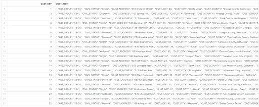

**SEMI-STRUCTURED DATA**
Snowflake can easily load and query [semi-structured data](https://docs.snowflake.com/en/user-guide/semistructured-intro.html), such as JSON, Parquet, or Avro, without transformation. This is important because an increasing amount of business-relevant data being generated today is semi-structured, and many traditional data warehouses cannot easily load and query this sort of data. With Snowflake it is easy!

5. copy into customer from @sigma_stage/Plugs_Customers.csv FILE_FORMAT = ( FORMAT_NAME = 'COMMA_DELIMITED' );  
Loads data from our stage into our customer table.  The copy will load 4,972 rows into the table.  We recommend doing a select * from customer; to see how the semi-structured data differs from the structured cust_key column.  In the diagram below, we clicked in the general area on the second row of the cust_json column in the answer set, highlighted by the red box.  The UI then popped open the Details dialog box showing the contents (key value pairs) of the JSON.

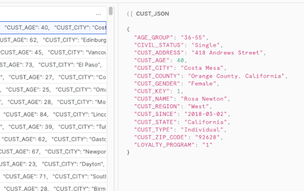

6. grant usage on database PLUGS_DB to role PC_SIGMA_ROLE;  
Snowflake access rights are based [upon role based access control (RBAC)](https://docs.snowflake.com/en/user-guide/security-access-control-overview.html).  We now need to allow the PC_SIGMA_ROLE to use the plugs_db database.

7. grant usage on schema PLUGS_DB.PUBLIC to role PC_SIGMA_ROLE;  
We now allow the PC_SIGMA_ROLE to use the plugs_db.public schema.

8. grant SELECT on TABLE PLUGS_DB.PUBLIC.TRANSACTIONS to role PC_SIGMA_ROLE;  
Grant SELECT access on the transactions table to the pc_sigma_role.

9. grant select on TABLE PLUGS_DB.PUBLIC.CUSTOMER to role PC_SIGMA_ROLE;  
Grant SELECT access on the CUSTOMER table to the pc_sigma_role.

10. use role PC_SIGMA_ROLE;  
We completed granting access to the tables and data to the PC_SIGMA_ROLE, that will allow a user to now start reporting on the data from Sigma using this role.  This command will now set the context of the UI so that we are now using this role so that we can confirm Sigma will be able to access the data.

11. select * from customer;  
A select count(*) from the customer table should complete successfully.  If not, please go back and re-run the prior steps of this module.  Note, you will have to switch the context of the UI back to SYSADMIN before re-running the steps.

12. select count(*) from transactions;  
This will confirm that the PC_SIGMA_ROLE has access to the customer table as well.

<!-- ------------------------ -->
## Using Sigma for Analysis & Visualizations
Duration: 10

### Start Working With Sigma
Your Snowflake account has now been set up with the data that will be used by Sigma to create an workbook. In order to get started with Sigma, please click on the tab that was opened in your browser when we clicked the launch button from Partner Connect.

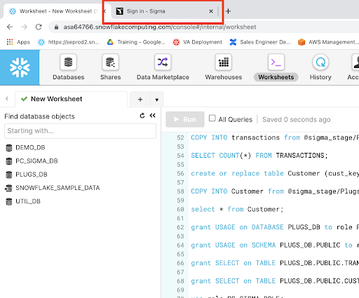

1. Navigating to the Sigma tab in your browser will bring you to the Sigma dialog box to complete your Sigma Partner Connect setup.  Use a company name of your choosing, or something unique like your first initial plus last name for your ‘made up’ company url.  Click on “Continue”.

2. Next enter your name and password and click “Create”.

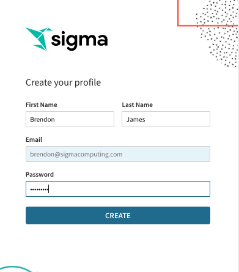

3. If you are utilizing IP white listing  in Snowflake (most likely not applicable if you just signed up for a free Snowflake trial) [you can read more about that here](https://docs.snowflake.com/en/user-guide/network-policies.html#creating-network-policies), these are the URLs you would need to add to the white listing .  Click “Get Started Using Sigma”.

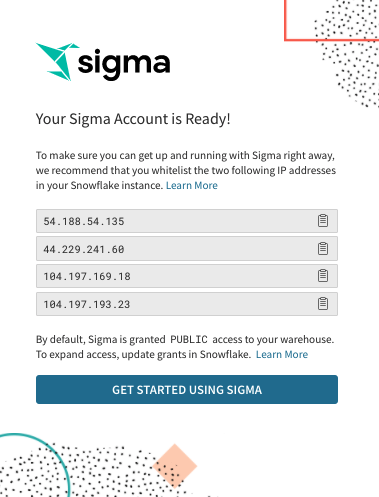

### Sigma UI Orientation

1. You now should see the home page for Sigma.

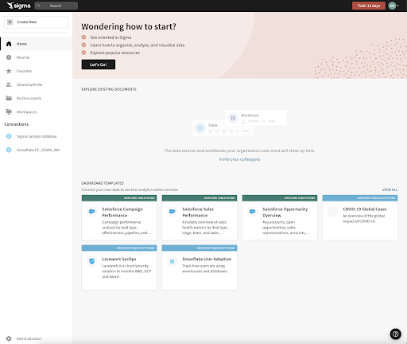

2. At the bottom left of the page are connections to Snowflake databases. There should be two showing. Click on the lower connection called “Snowflake PC_Sigma_WH” which is the virtual warehouse we created in prior steps. Click on the connection.

3. On the resulting page, click one of the two blue “Add Permission” buttons.

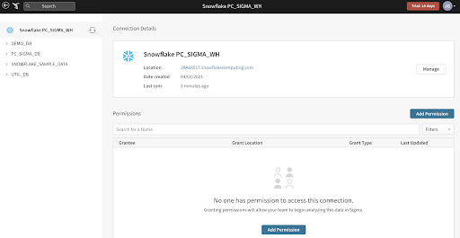

4. Click into the bar that says “Search for members or teams” and a drop down appears. Select “All Members (Team)” so all users of Sigma have write access to this database. Then click the blue “Save” button.

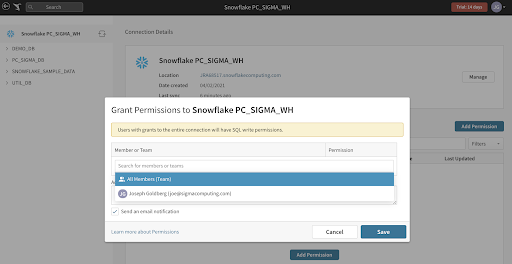

5. If you expand the Plugs_DB database you will be able to see our two tables that were loaded into Snowflake.

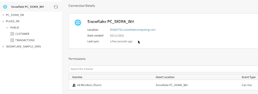

<!-- ------------------------ -->
## Modeling The Data
Duration: 10

### Create a Sigma Dataset
Sigma’s Datasets are a flexible way to build centralized data definitions and guide data exploration. Sigma balances administrative control with the freedom to find, add, and trust new data. Datasets function as sources of data for Workbooks.

Sigma has the ability to join tables, other datasets, csv uploads, or your own SQL inside of datasets. In this section we will go over how to join tables to build a dataset as well as how to work with semi structured json data within the Sigma UI.

1. At the top left of the Sigma UI click on the small crane icon to go to the home page.

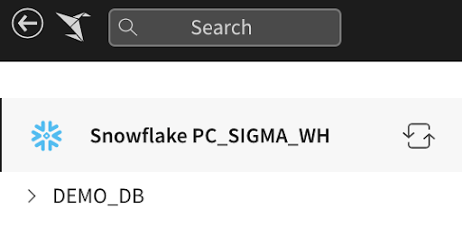

2. Let’s create a new Dataset and connect it to the “Sigma Sample Dataset”. Click on the “Create New” at the top left of the page and then select “Dataset”.

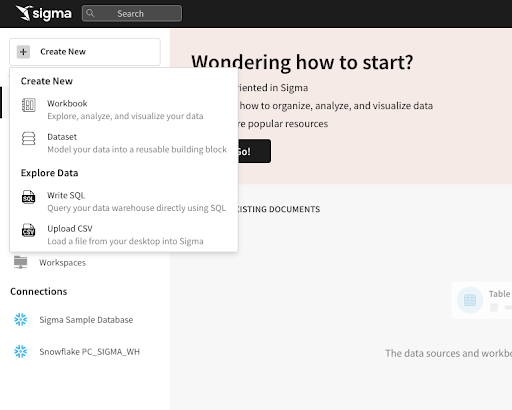

3. On the next page we need to select a data source for the new Dataset. Under the “Table” option, click the blue “Select” button.

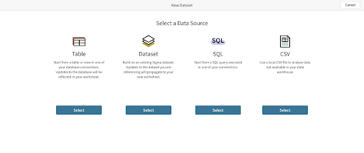

4. On the left of the page ensure that “Snowflake PC_Sigma_WH” is selected in the Connection drop-down. Then expand the “Plugs_DB” and select the “Transactions” table.  You will get a preview of the table.  Next click ‘Get Started’ in the upper right hand corner to begin our data modeling.

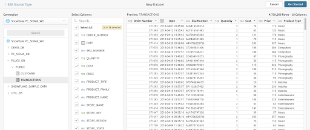

5. On the top bar first select “Worksheet”, then navigate to the database symbol in the top right and select it, finally select the “+” symbol below the database symbol.

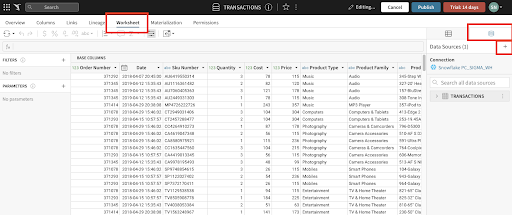

6. On the next page we need to select a data source for us to join the “Transactions” table. Under the “Table” option, click the blue “Select” button.

7. Navigate and select the “Customer” table under the “Plugs_DB database”.  Here you can select which columns you want to bring into the worksheet.  We will leave both columns selected.  Click Next.

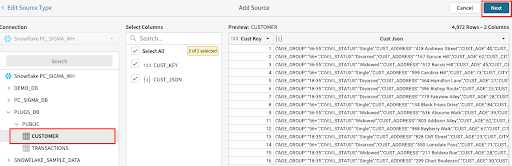

8. Here you now have many options to decide how you would like to bring in the data.  Sigma will do its best to infer the correct join columns based on data type as well as the names of the columns.  You can select the type of join you wish to perform, the columns you wish to join to and optionally you can use formulas or multiple join keys if necessary. In this case we will select a Left Join and the join key will remain “CUST_KEY” for both tables.  Click Done.

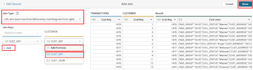

9. Sigma has now joined the tables as defined, and pulls in the fields that we selected.  You will notice that Sigma can natively identify variant data types based on the icon of the column for Cust JSON.  What this allows us to do is quickly pull out the key values pairs in that json very quickly. Select the dropdown from the Cust Json header and select ‘Extract Columns’.

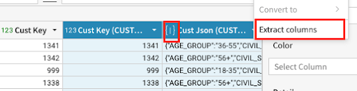

10. Next we can select the key value pairs we wish to pull out.  Select the fields ‘AGE_GROUP’, ‘CUST_GENDER’, and ‘LOYALTY_PROGRAM’ and Click Confirm.

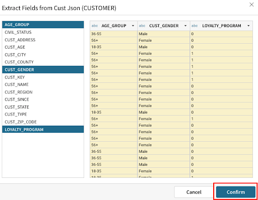

11. Now that we have joined the tables and extracted the JSON data we can publish our dataset by clicking the blue “Publish” button in the top right and start our analysis.

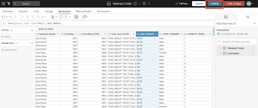

<!-- ------------------------ -->
## Accessing The Data
Duration: 5

### Sigma Workbook
1. At the top left of the Sigma UI click on the small crane icon to go to the home page.

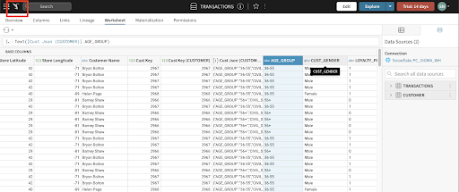

2. We are now back on the Sigma home page. Let’s now create a new Workbook and connect it to the Dataset that we just created. Click on the “Create Workbook” at the top left of the page.

3. On the next page we need to select a data source for the new workbook. On the left hand side first select the “Table” option, then select “Tables and Datasets”.

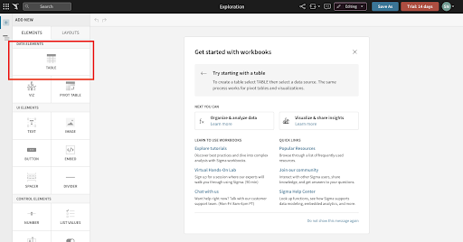

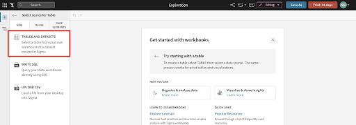

4. On the resulting page select “My Documents” this is where our Dataset that we just created was saved.

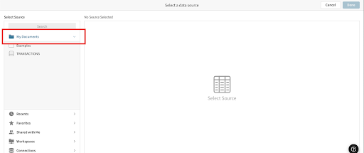

5. On the left of the page expand the select the “Transactions” Dataset.  You will get a preview of the data.  Next click ‘Done’ in the upper right hand corner to begin our analysis.

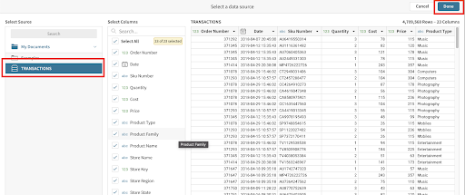

6. Notice how Sigma has a spreadsheet like interface that makes it easy to quickly get a glimpse of what data we have and allows for rapid development of workbooks and datasets.  The average business user can use our workbooks to explore data and self-serve in a governed and secure way.

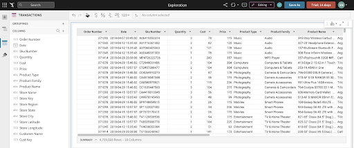

**Spreadsheet-like Interface**
Sigma is unique in empowering users to do analysis in an interface they already know and love: the spreadsheet. It also uses familiar functions found in spreadsheets. No need for SQL knowledge as the Sigma interface automatically, and behind the scenes, converts all user actions into optimized SQL. This interface helps speed up user adoption and success, especially with non-technical business users.

<!-- ------------------------ -->

## Analyzing The Data
Duration: 18

### Sigma Workbook Analysis
Today we will be looking at our fictitious company Plugs Electronics data. It contains the retail transactions from our stores across the country as well as some attributes around our customers making the purchase. We will create some calculations, join tables, parse json, and build some visualizations with the ultimate goal of creating and embedding a dashboard for our Regional Sales Managers to get insights into the performance of their stores.

1. First, if you select the column header above the “Cost” column and select “Add New Column”.

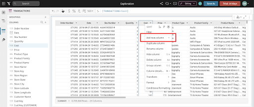

2. This will take us to the formula bar where we can write formulas.  Lets type the function “[Quantity] * [Cost]” and click enter to get our Cost of Goods Sold. Double click the column header to rename the column to “COGS”.  We can also use the quick select $ left of the formula bar to format the column as a currency.

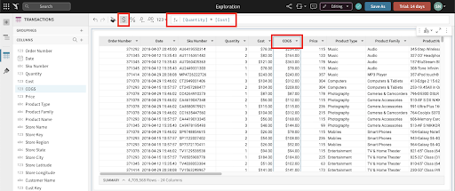

3. This was a simple function, but if you click on the “ƒx” icon to the left of the formula bar, you can see a full list of all [the functions Sigma supports](https://help.sigmacomputing.com/hc/en-us/categories/360002442993-Function-Index).  Sigma also provides helpful tooltips and autocomplete within the formula bar to help guide users how to use the functions.

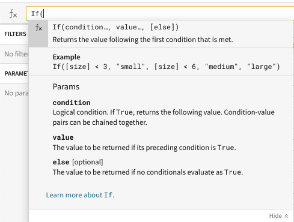

4. Every action we take in Sigma produces machine generated ANSI compliant SQL that is pushed down to Snowflake ensuring the data is secure and up to date at all times.  Sigma never extracts from, or modifies data in, the cloud data source. You can see the queries we are generating by clicking the dropdown next to the refresh button on the top right and selecting “Query History”.

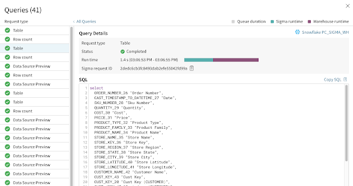

5. Next, if you select the column header above the “Price” column and select “Add New Column”.

6. This will take us to the function bar where we can write formulas.  Lets type the function “[Quantity] * [Price]” and click enter to get our Revenue. Double click the column header to rename the column to “Revenue”. We can also use the quick select $ icon at the top to quickly format as a currency.

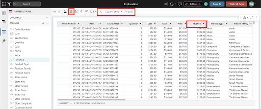

7. Let's add one more column next to Revenue by selecting the column header and click “Add New Column”.

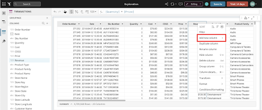

8. This will take us to the function bar where we can write formulas.  Lets type the function “[Revenue] - [COGS]” and click enter to get our Profit. Double click the column header to rename the column to “Profit”.

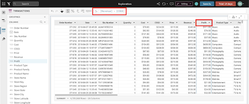

**Note:** All workbooks are considered purely exploratory until you, as their creator, actively save their first version. This means you have one central location to start both your ad hoc analysis and reporting. Once you begin exploring your data, you can choose to leave the unsaved workbook behind, or you can save it and continue to build it out as a report.

### Create Visualizations
It is often easier to spot trends, outliers, or insights which lead to further questions when viewing data in a visualization.  Sigma makes it easy to create visualizations of your data while also enabling you to dig into the data that makes up that visualization.  

1. Start the creation of a visualization by selecting the table that we just built, then click the “Create child element” icon on its top right corner and select “Visualization” to start creating a new chart.

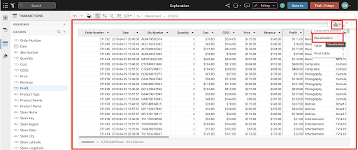

2. This will add a Visualization below our table.  In the left-hand bar you will see a dropdown that lists all of the supported visualizations.

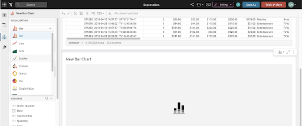

3. Select the bar chart.  On the X-Axis click the plus button and add our “Store State” column.  Notice you can search here for the column you wish to add.

4. We can also drag values onto the Axes instead of using the add button.  If we look at our columns on the bottom, find the “Profit” column and drag it under the Y-Axis. The value will automatically aggregate and become “Sum of Profit”.

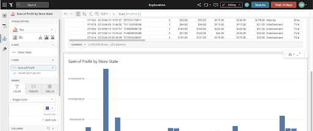

5. Under the X-Axis header, click the dropdown next to “Store State” and go to Sort then “Sum of Profit”. This will put the x-axis in ascending order. Click it one more time to swap to descending order.

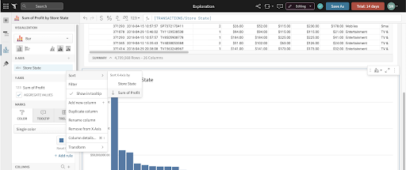

6. Now let's look at our sales over time to get an understanding of how we are trending.  Another way to create a new chart is by selecting the ‘+’ icon on the top left panel next to the ‘Page Elements’ title.  Click on the ‘+’ icon to get a list of elements that we can add to our canvas and choose ‘Viz’.

7. After selecting the ‘Viz’ icon, you will be prompted to select a source to use for that ‘viz’.  You can see tabs for selecting:
  - **In Use:** sources that are currently being used by other elements in the workbook.
  - **New:** a new source that could be a table, dataset, SQL, or uploaded CSV.
  - **Page Elements:** Any data elements already in the workbook, such as the bar chart we created or the table.
From the In Use tab select the Workbook Element “TRANSACTIONS”

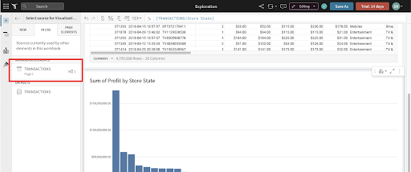

8. Click the visualization dropdown and select “Line”. Next, drag the “Date” column into the X-Axis. (Optionally, add it using the ‘+’ icon next to the x-axis.)

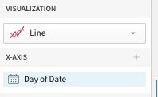

9. Notice that Sigma has defaulted to change the aggregation to “Day” as the title now reads “Day of Date”.  We can change this aggregation at any time using the dropdown next to the field name, and selecting a new aggregation level under the “Truncate date” submenu. Let's change the aggregation level to be “Month”.

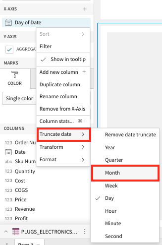

10. Next we can place our “Revenue” column on the Y-Axis to see our revenue over time. Again, Sigma has automatically summed the revenue to the monthly level.

11. We now have a line graph with revenue by month. Let's add some more detail by breaking the series out by store region. To do this add “STORE_REGION” to the color grouping section in the left sidebar.

12. Let's create one more visualization around our customer, and regions.  Again, select the “+”  icon on the top left of the screen and then select “Viz”.

13. For the data source, go to the In Use tab and select the Workbook Element “TRANSACTIONS”.

14. Next drag “Product Family” to the X-axis, and “Cust Key” to the Y axis. Click the dropdown on the  “Cust Key” value under the Y-axis, go to “Set aggregate”, and change the aggregation to “CountDistinct”.

15. Let's break out our customers by region. To do that drag “Store Region” to the color section. Then, unstack the bars by changing the bar chart clustering option right below the chart type drop-down.

16. Finally let's create a pivot table around our customer demographics.  Again, select the “+”  icon on the top left of the screen and then select “Viz”.

17. For the data source, go to the In Use tab and select the Workbook Element “TRANSACTIONS”.

18. Next drag “Product Family” to the Pivot Rows, “CUST_Gender” to the Pivot Columns, and “Profit” to the Values section.

19. We now have a breakdown of our profit by product family and customer gender. Now that we have built out our workbook let’s go ahead and save it. Click the blue “Save As” button in the top right and name your report.

<!-- ------------------------ -->
## Finalizing The Workbook
Duration: 8

### Create Filters
1. Next, let's add a filter to this data. We will do this by adding a control element to our canvas.  Controls enable interactions with the chart such as filter the charts when in use. Clicking the “+” icon on the upper left hand pane next to “Page Elements”, select “Date Range”.  This will add a Date Range control to the canvas.

  We will also see options for other Control Elements:
  - **Number Range:** creating a range of values you wish to look at
  - **List Values:** create a list of values for users to choose from
  - **Text Box:** allow users to input free form text
  - **Switch:** allow users to filter on Boolean (true/false) values
  - **Drill Down:** specify specific drill paths

2. After adding the “Date Range” control, let’s drag it to the top of the page and update the control_id to say “Date-Range” and update the control label to say “Select a Date Range”

3. Next we need to tell the control which elements we want the control to apply to.  Clicking on the filter control, we have some options in the left hand pane.  Select “Targets”.  Then select “Add Target”.
Next click on “Add Target” and select the “Transactions” data source.

4. One additional way to create a page control is by starting with a filter. Sigma can easily start with a filter and convert the filter to  a page control.
To try this out, right click on the drop down next to the column “Store State” and select the “Filter” option from the menu

5. A new filter will be added to the top of the page.

6. Click on the Kebab menu to the right of the “Store State” Filter and select “Convert to Page Control”

7. The filter will be added as a Page Control to the canvas. Move it to the same level as the Date Range control element by clicking and holding on the double kebab menu at the top right, and dragging it to the right of the Date Range filter

8. Since this filter started out with a target, there is no need to add one. However, if there were additional data elements on the page that you want this filter to control, now would be the time to add those elements as targets.

### Cleaning Up The Canvas
1. To start, let's move our base data table to another page. This is done by selecting the options button (the three-dots icon) in the top right of the table and clicking on “Move to page” -> “New page”.

2. Lets also rename page 1 to “Visuals” and page 2 to “Data” by double clicking on their existing names.

3. Next, let's move our other charts and filters around on the “Visuals” page.  
Hover over the line chart until you see a hand icon appear.  We can grab this chart and move it to the right hand side of our bar chart.  You can also resize any of the charts to make them fit as you need.

4. Next, let’s give this dashboard some context for our users.  Using text elements, we can give the page a title, as well as descriptions to let users know what this dashboard is used for.

Click the “+” icon on the upper left-hand pane below the Sigma logo, then select “Text”. This will add a text box to the canvas.

You will also notice other UI elements available to you here:
- Image: upload images or link to URLs to show an image on the canvas
- Button: use buttons to navigate to other workbooks, websites, or download the workbook as a PDF
- Embed: embed other websites or applications into your workbook
- Spacer: used to add space between elements on the canvas
- Divider: used to create hard divisions between sections of the canvas

5. Drag the text box to the top of the canvas and enter the text “Sales Performance”.  Set the text style to be “Large Heading.” You can also adjust the font, color, and sizing as you see fit. If you’d like to add  a description as well, you can enter that under the title

6. Finally, let’s go ahead and click “Publish” to save our work.

<!-- ------------------------ -->
## Conclusion
Duration: 3

In this lab we went through the process of setting up up a Snowflake free trial, and a Sigma free trial through Snowflake partner connect. We leveraged an [external stage](https://docs.snowflake.com/en/user-guide/data-load-overview.html#external-stages) in Snowflake to copy data into tables. Finally we did some light modeling, and an analysis resulting in a “Sales Performance” dashboard.

The seamless transition from Snowflake to Sigma enables data professionals to iterate quickly and with ease. This sets Sigma up uniquely to not only provide a robust client facing tool but also a great sand box for data engineers to profile and experiment with freshly landed data in Snowflake.

### What we've covered
- Signing up for a Snowflake free trial 
- Loading sample data into Snowflake
- Signing up for a Sigma free trial through Snowflake Partner Connect
- Building a Sigma Dataset that models the sample data in Snowflake
- Building a polished Sigma Workbook that analyzes the sample data  

### Helpful Resources
- Help Center including Documentation: [https://help.sigmacomputing.com/hc/en-us](https://help.sigmacomputing.com/hc/en-us)
- Sigma Blog: [https://www.sigmacomputing.com/blog/](https://www.sigmacomputing.com/blog/)
- Resources and Case Studies: [https://www.sigmacomputing.com/resources/](https://www.sigmacomputing.com/resources/)

