summary: This is a broad introduction of Snowflake and covers how to login, run queries, and load data.
id: getting_started_with_snowflake
categories: Getting Started
environments: web
status: Published
feedback link: https://github.com/Snowflake-Labs/sfguides/issues
tags: Getting Started, Data Science, Data Engineering

# Getting Started with Snowflake - Zero to Snowflake

<!-- ------------------------ -->

## Overview

Duration: 2

Welcome to Snowflake! This entry-level guide designed for database and data warehouse administrators and architects will help you navigate the Snowflake interface and introduce you to some of our core capabilities. [Sign up for a free 30-day trial of Snowflake](https://trial.snowflake.com) and follow along with this lab exercise. Once we cover the basics you’ll be ready to start processing your own data and diving into Snowflake’s more advanced features like a pro.

### Free Virtual Hands-on Lab
This Snowflake Guide is available as a free, instructor-led Virtual Hands on Lab. [Sign up for the VHOL today](https://www.snowflake.com/virtual-hands-on-lab/).

### Prerequisites:

- Use of the [Snowflake free 30-day trial environment](https://trial.snowflake.com)
- Basic knowledge of SQL, database concepts, and objects
- Familiarity with CSV comma-delimited files and JSON semi-structured data

### What You'll Learn:

- how to create stages, databases, tables, views, and warehouses
- how to load structured and semi-structured data
- how to query data including joins between tables
- how to clone objects
- how to undo user errors
- how to create roles and users, and grant them privileges
- how to securely and easily share data with other accounts

<!-- ------------------------ -->

## Prepare Your Lab Environment

Duration: 2

### Steps to Prepare Your Lab Environment

If you haven’t already, register for a [Snowflake free 30-day trial](https://trial.snowflake.com).

The Snowflake edition (Standard, Enterprise, Business Critical, e.g.), cloud provider (AWS, Azure, e.g.), and Region (US East, EU, e.g.) do not matter for this lab. We suggest you select the region which is physically closest to you and the Enterprise Edition, our most popular offering. After registering, you will receive an email with an activation link and your Snowflake account URL.


<!-- ------------------------ -->

## The Snowflake ​User Interface & Lab Story

Duration: 8

Negative
: **About the screen captures, sample code, and environment**
Screen captures in this lab depict examples and results that may vary slightly from what you see when you complete the exercises.

### Logging Into the Snowflake User Interface (UI)

Open a browser window and enter the URL of your Snowflake 30-day trial environment that was sent with your registration email.

You should see the login screen below​. Enter the username and password used for registration.


**Close any Welcome Boxes and Tutorials**

You may see welcome and helper boxes appear when you log in for the first time. Also an “Enjoy your free trial...” ribbon at the top of the screen. Minimize and close these boxes.

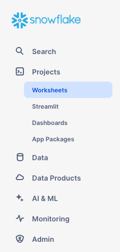

### Navigating the Snowflake UI

Let’s get you acquainted with Snowflake! This section covers the basic components of the user interface. We will move left to right from the top of the UI.

The navigation bar allows you to switch between the different areas of Snowflake:

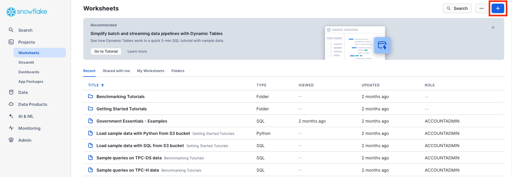

The **​Databases​** tab shows information about the databases you have created or have permission to access. You can create, clone, drop, or transfer ownership of databases, as well as load data in the UI. Notice that several databases already exist in your environment. However, we will not be using these in this lab.

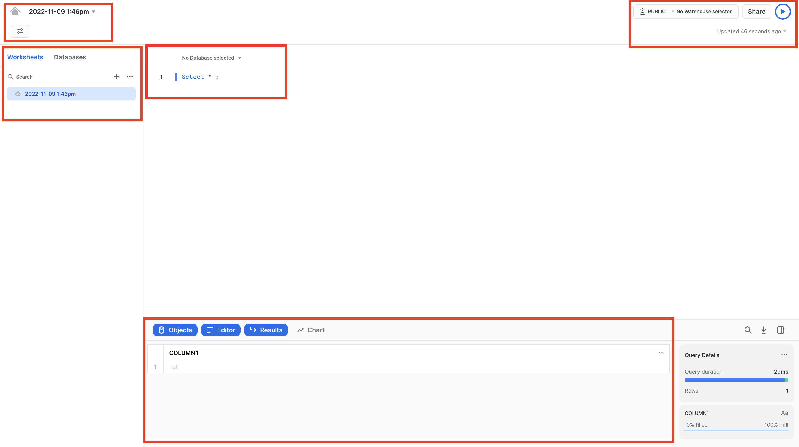

The ​**Shares**​ tab is where data sharing can be configured to easily and securely share Snowflake tables among separate Snowflake accounts or external users, without having to create a copy of the data. We will cover data sharing in Section 10.

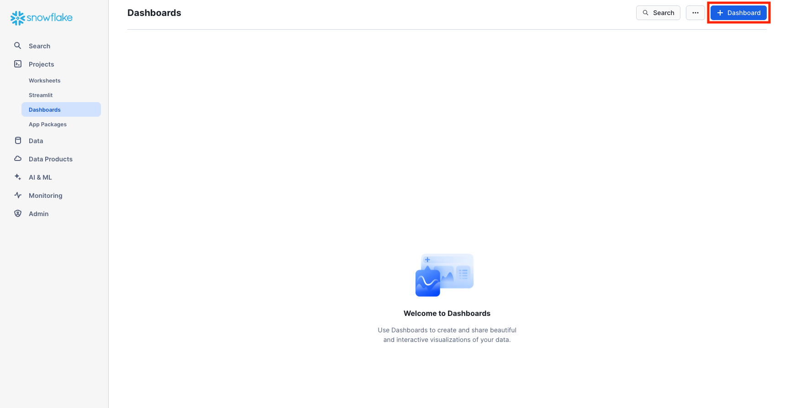

The **​Warehouses​** tab is where you set up and manage compute resources known as virtual warehouses to load or query data in Snowflake. A warehouse called COMPUTE_WH (XL) already exists in your environment.


The ​**Worksheets​** tab provides an interface for submitting SQL queries, performing DDL and DML operations, and viewing results as your queries or operations complete. The default Worksheet 1 appears when this tab is accessed.

The left pane contains the database objects browser which enables users to explore all databases, schemas, tables, and views accessible by the role selected for a worksheet. The bottom pane displays the results of queries and operations.

The various sections of this page can be resized by adjusting their sliders. If during the lab you need more room in the worksheet, collapse the database objects browser in the left pane. Many of the screenshots in this guide will keep this section closed.

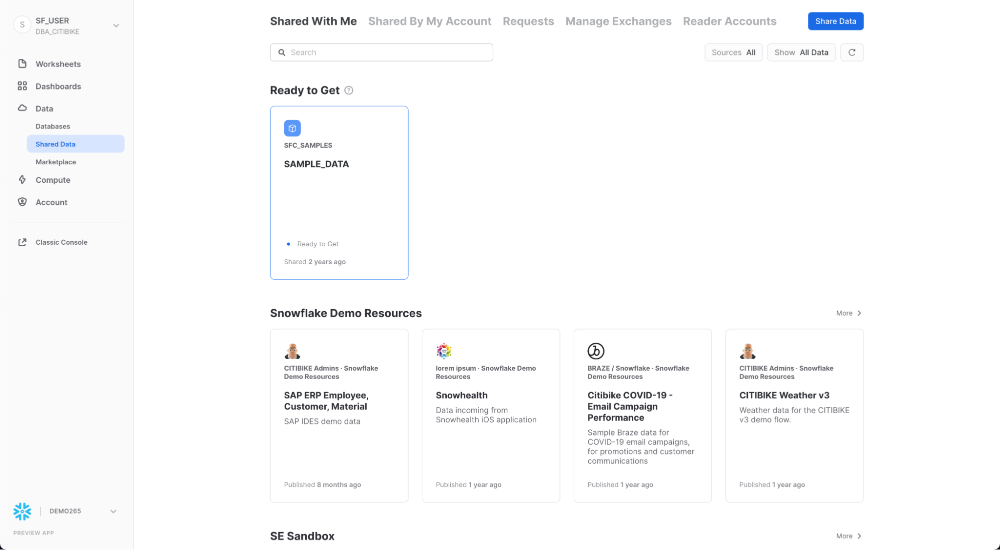


Negative
: **Worksheets vs the UI**
Many of the configurations for this lab will be executed via the pre-written SQL within this worksheet to save time. These configurations could also be done via the UI in a less technical manner, but would take more time.

The **History** tab allows you to view the details of all queries executed in the last 14 days from your Snowflake account. Click on a Query ID to drill into it for more information.


Clicking on your username in the top right of the UI allows you to change your password, roles, and preferences. Snowflake has several system defined roles. You are currently in the default role of `SYSADMIN` and will stay in this role for the majority of the lab.


Negative
: **SYSADMIN**
The `SYSADMIN` (aka System Administrator) role has privileges to create warehouses, databases, and other objects in an account.
In a real-world environment, you would use different roles for the tasks in this lab, and assign roles to your users. We will cover more on Snowflake access control in Section 9 and you can find additional information in the [Snowflake documentation](https://docs.snowflake.net/manuals/user-guide/security-access-control.html).

### The Lab Story

This lab is based on the analytics team at Citi Bike, a real, citywide bike sharing system in New York City, USA. The team wants to run analytics on data from their internal transactional systems to better understand their riders and how to best serve them.

We will first load structured .csv data from rider transactions into Snowflake. Later we will work with open-source, semi-structured JSON weather data to determine if there is any correlation between the number of bike rides and the weather.

<!-- ------------------------ -->

## Preparing to Load Data

Duration: 14

Let’s start by preparing to load the structured Citi Bike rider transaction data into Snowflake.

This section will walk you through the steps to:

- create a database and table
- create an external stage
- create a file format for the data

Negative
: **Getting Data into Snowflake**
There are many ways to get data into Snowflake from many locations including the COPY command, Snowpipe auto-ingestion, external connectors, or third-party ETL/ELT products. For more information on getting data into Snowflake, see the [Snowflake documentation](https://docs.snowflake.net/manuals/user-guide-data-load.html).
We are manually using the COPY command and S3 storage for instructional purposes. A customer would more likely use an automated process or ETL product.

The data we will be using is bike share data provided by Citi Bike NYC. The data has been exported and pre-staged for you in an Amazon AWS S3 bucket in the US-EAST region. The data consists of information about trip times, locations, user type, gender, age, etc. On AWS S3, the data represents 61.5M rows, 377 objects, and 1.9GB compressed.

Below is a snippet from one of the Citi Bike CSV data files:

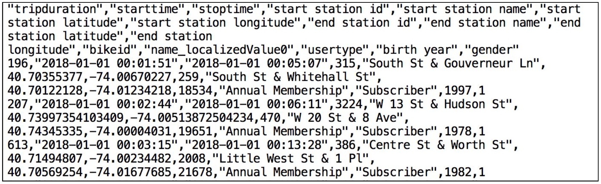

It is in comma-delimited format with double quote enclosing and a single header line. This will come into play later in this section as we configure the Snowflake table which will store this data.

### Create a Database and Table

First, let’s create a database called `CITIBIKE` that will be used for loading the structured data.

Navigate to the Databases tab. Click Create, name the database `CITIBIKE`, then click Finish.

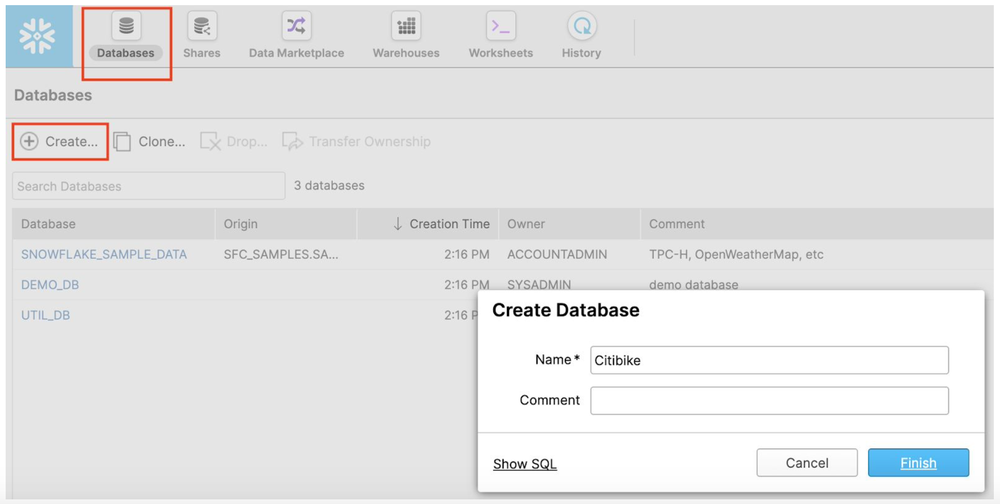

Now navigate to the Worksheets tab. You should see an empty worksheet. You can copy the SQL from each step below and paste it here to run.

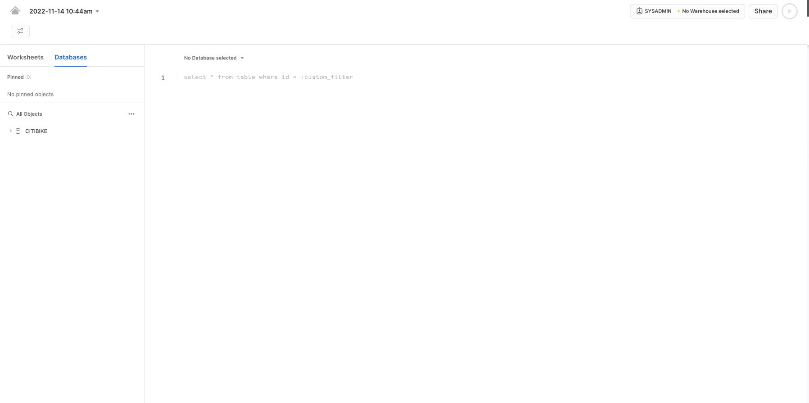

We need to set the context appropriately within the worksheet. In the top right, click on the drop-down arrow next to the Context section to show the worksheet context menu. Here we control what elements the user can see and run from each worksheet. We are using the UI here to set the context. Later in the lab we will accomplish this via SQL commands within the worksheet.

Select the following context settings:
Role: `SYSADMIN`
Warehouse: `COMPUTE_WH (XL)`
Database: `CITIBIKE`
Schema = `PUBLIC`


Negative
: **Data Definition Language (DDL) operations are free!**
All the DDL operations we have done so far do not require compute resources, so we can create all our objects for free.

Next we’ll create a table called TRIPS that will be used for loading the comma-delimited data. We will use the UI within the Worksheets tab to run the DDL that creates the table. Copy the SQL text below into your worksheet:

```SQL
create or replace table trips
(tripduration integer,
starttime timestamp,
stoptime timestamp,
start_station_id integer,
start_station_name string,
start_station_latitude float,
start_station_longitude float,
end_station_id integer,
end_station_name string,
end_station_latitude float,
end_station_longitude float,
bikeid integer,
membership_type string,
usertype string,
birth_year integer,
gender integer);
```

Negative
: **Many Options to Run Commands.**
SQL commands can be executed through the UI, via the Worksheets tab, using our SnowSQL command line tool, with a SQL editor of your choice via ODBC/JDBC, or through our Python or Spark connectors.
As mentioned earlier, in this lab we will run operations via pre-written SQL in the worksheet as opposed to using the UI to save time.

Run the query by placing your cursor anywhere in the command and clicking the blue Run button at the top of the page. Or use the keyboard shortcut Ctrl/Cmd+Enter.

Negative
: **Warning**
Never check the All Queries box at the top of the worksheet for this lab. We want to run SQL queries one at a time in a specific order, not all at once.

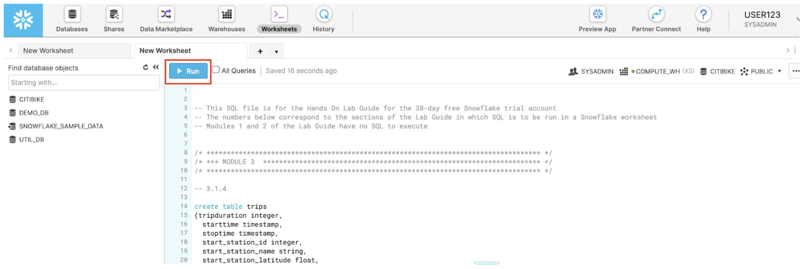

If you highlighted the entire SQL text of the command and ran it, a confirmation box asking “Do you want to run the following queries?” should appear. Click the blue Run button in the box. In the future you can continue using this confirmation box or check the “Don’t ask me again (All Worksheets)” option.

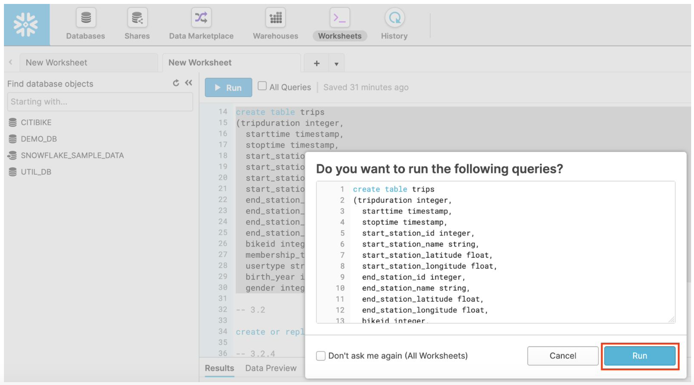

Verify that your TRIPS table has been created. At the bottom of the worksheet you should see a Results section displaying a “Table TRIPS successfully created” message.

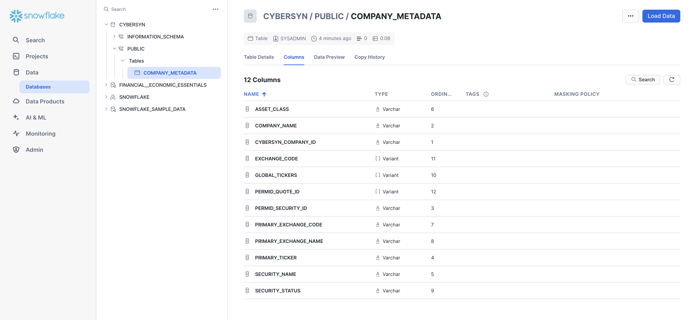

Navigate to the Databases tab and click on the CITIBIKE database link. You should see your newly created TRIPS table. If you do not see the databases, expand your browser as they may be hidden.

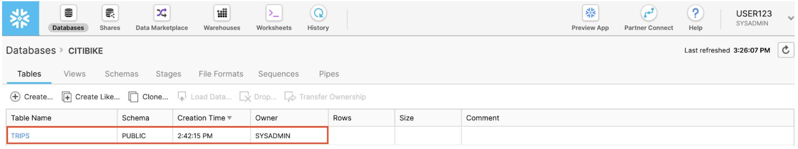

Click on the TRIPS hyperlink to see the table structure you just configured.

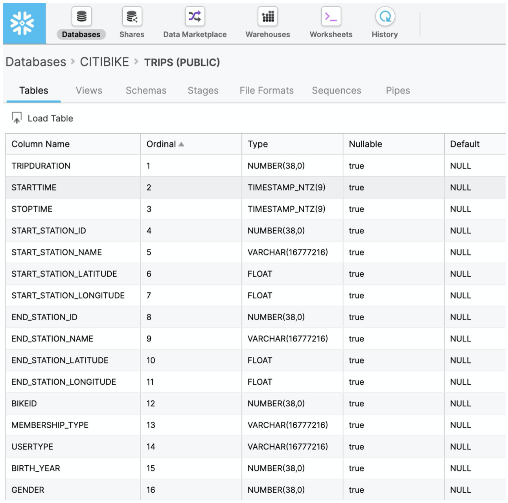

### Create an External Stage

We are working with structured, comma-delimited data that has already been staged in a public, external S3 bucket. Before we can use this data, we first need to create a Stage that specifies the location of our external bucket.

Positive
: For this lab we are using an AWS-East bucket. To prevent data egress/transfer costs in the future, you should select a staging location from the same cloud provider and region as your Snowflake environment.

From the Databases tab, click on the `CITIBIKE` database, select Stages, then Create...

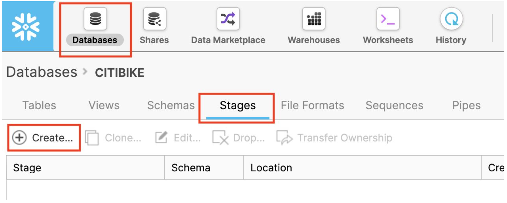

Select the option for Existing Amazon S3 Location and click Next.

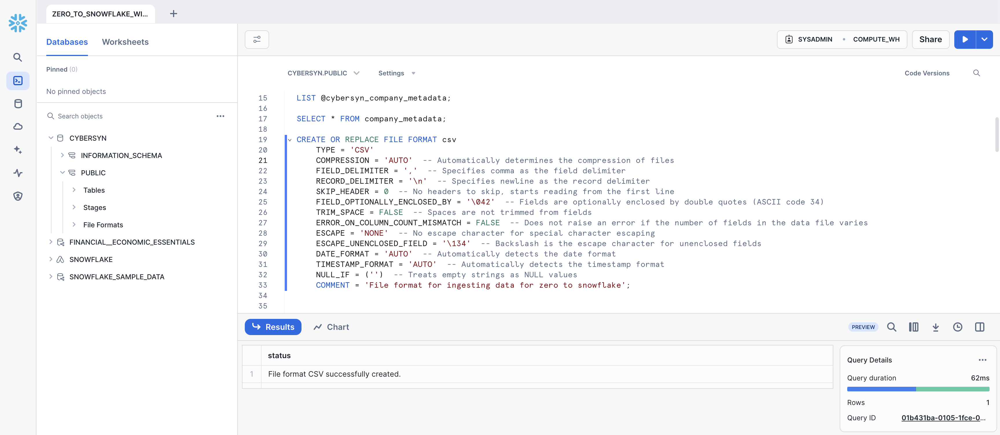

On the Create Stage box, enter the following settings, then click Finish.

Name: `citibike_trips`
Schema Name: `PUBLIC`
URL: `s3://snowflake-workshop-lab/citibike-trips`

Positive
: The S3 bucket for this lab is public so you can leave the key fields empty. Such buckets will likely require key information in the future.

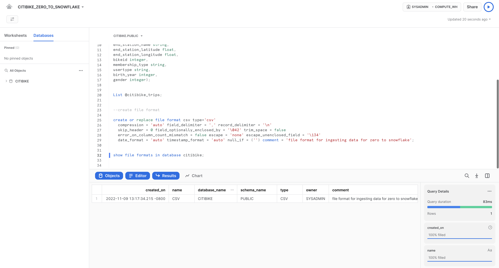

Now let’s take a look at the contents of the `citibike_trips` stage. Navigate to the Worksheets tab, then execute the following statement:

```SQL
list @citibike_trips;
```

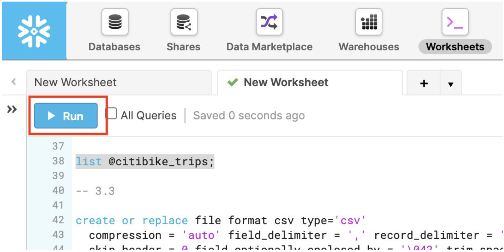

You should see the output in the Results window in the bottom pane:

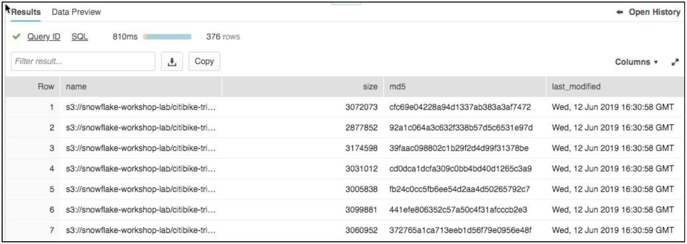

### Create a File Format

Before we can load the data into Snowflake, we have to create a File Format that matches the data structure.

From the Databases tab, click on the `CITIBIKE` database hyperlink. Select File Formats and Create.

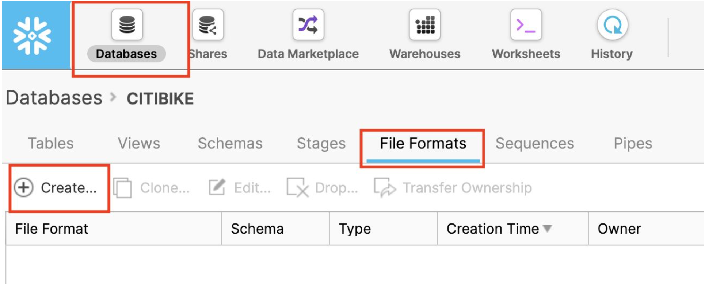

On the resulting page we create a file format. In the box that appears, leave all the default settings as-is but make the changes below:

Name: `CSV`
Field optionally enclosed by: Double Quote
Null string: <Delete the existing text in this field so it is empty>
[ ] Error on Column Count Mismatch: <uncheck this box>

If you do not see the “Error on Column Count Mismatch” box, scroll down in the dialogue box.

When you are done, the box should look like:

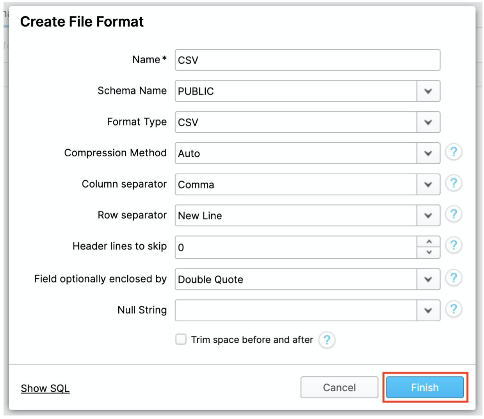

Click Finish to create the file format.

<!-- ------------------------ -->

## Loading Data

Duration: 10

In this section, we will use a data warehouse and the COPY command to initiate bulk loading of structured data into the Snowflake table we just created.

### Resize and Use a Warehouse for Data Loading

Compute power is needed for loading data. Snowflake’s compute nodes are called virtual warehouses and they can be dynamically sized up or out according to workload, whether the workload is loading data, running a query, or performing a DML operation. Each workload can have its own data warehouse so there is no resource contention.

Navigate to the Warehouses tab. This is where you can view all of your existing warehouses, as well as analyze their usage trends.

Note the Create... option at the top is where you can quickly add a new warehouse. However, we want to use the existing warehouse COMPUTE_WH included in the 30-day trial environment.

Click on the row of this COMPUTE_WH warehouse (not the blue hyperlink that says COMPUTE_WH) and highlight the entire row. Then click on the Configure... text above it to see the configuration details of the COMPUTE_WH. We will use this warehouse to load in the data from AWS S3.

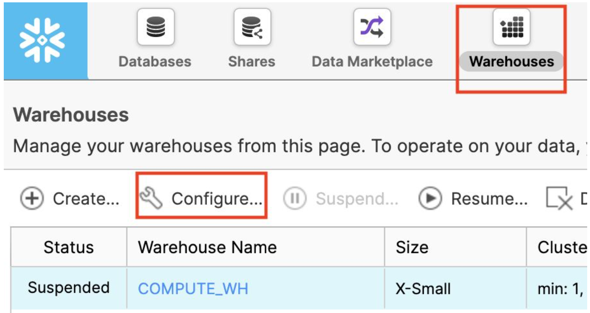

Let’s walk through the settings of this warehouse and learn some of Snowflake’s unique functionality.

Positive
: If you do not have a Snowflake edition of Enterprise or higher, you will NOT see the Maximum Clusters or Scaling Policy configurations from the screenshot below. Multi-clustering is not used in this lab, but we will discuss it as a key capability of Snowflake.

- The Size drop-down is where the capacity of the warehouse is selected. For larger data loading operations or more compute-intensive queries, a larger warehouse is needed. The sizes translate to underlying compute nodes, either AWS EC2 or Azure Virtual Machines. The larger the size, the more compute resources from the cloud provider are allocated to that warehouse. As an example, the 4-XL option allocates 128 nodes. This sizing can be changed up or down at any time with a simple click.

- If you have Snowflake’s Enterprise Edition or higher you will see the Maximum Clusters section. This is where you can set up a single warehouse to be multi-cluster up to 10 clusters. As an example, if a 4-XL warehouse was assigned a maximum cluster size of 10, it could scale up to be 1280 (128 \* 10) AWS EC2 or Azure VM nodes powering that warehouse...and it can do this in seconds! Multi-cluster is ideal for concurrency scenarios, such as many business analysts simultaneously running different queries using the same warehouse. In this use case, the various queries can be allocated across multiple clusters to ensure they run quickly.

- The final sections allow you to automatically suspend the warehouse so it stops itself when not in use and no credits are needlessly consumed. There is also an option to automatically resume a suspended warehouse so when a new workload is assigned to it, it will automatically start back up. This functionality enables Snowflake’s efficient “pay only for what you use” billing model which allows customers to scale their resources when necessary and automatically scale down or turn off what is not needed, nearly eliminating idle resources.

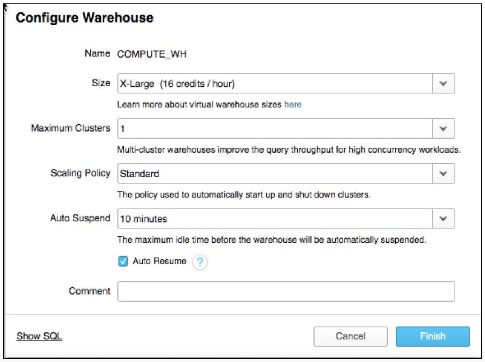

Negative
: **Snowflake Compute vs Other Warehouses**
Many of the warehouse and compute capabilities we just covered, such as the ability to create, scale up, scale out, and auto-suspend/resume warehouses are all simple in Snowflake and can be done in seconds. For on-premise data warehouses these capabilities are very difficult, if not impossible, as they require significant physical hardware, over-provisioning of hardware for workload spikes, significant configuration work, and additional challenges. Even other cloud data warehouses cannot scale up and out like Snowflake without significantly more configuration work and time.

Negative
: **Warning - Watch Your Spend!**
During or after this lab you should not do the following without good reason or you may burn through your $400 of free credits more quickly than desired:

- Disable auto-suspend. If auto-suspend is disabled, your warehouses will continue to run and consume credits even when not in use.
- Use a warehouse size that is excessive given the workload. The larger the warehouse, the more credits are consumed.

We are going to use this data warehouse to load the structured data into Snowflake. However, we are first going to decrease the size of the warehouse to reduce the compute power it contains. In later steps we will note the time this load takes and re-do the same load operation with a larger warehouse, observing its faster load time.

Change the Size of this data warehouse from X-Large to Small. Then click the Finish button.

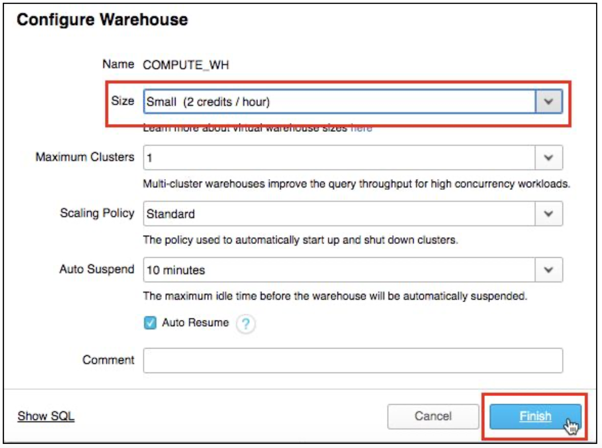

### Load the Data

Now we can run a COPY command to load the data into the `TRIPS` table we created earlier.

Navigate back to the Worksheets tab. In the top right of the worksheet, make sure the context is correct with these settings:

Role: `SYSADMIN`
Warehouse: `COMPUTE_WH (S)`
Database: `CITIBIKE`
Schema = `PUBLIC`


Execute the following statements in the worksheet to load the staged data into the table. This may take up to 30 seconds.

```SQL
copy into trips from @citibike_trips
file_format=CSV;
```

In the Results window, you should see the status of the load:

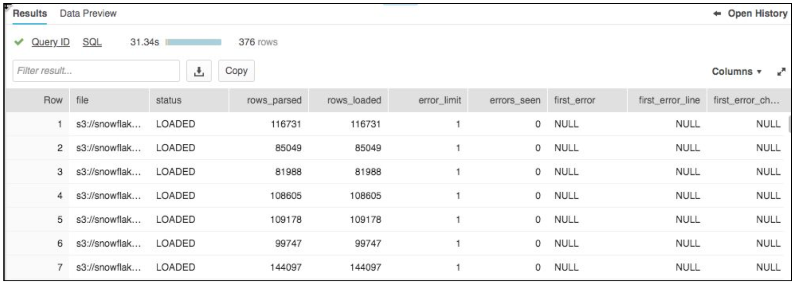

Once the load is done, at the bottom right of the worksheet click on the small arrow next to the Open History text to show the history of Snowflake operations performed in that worksheet.

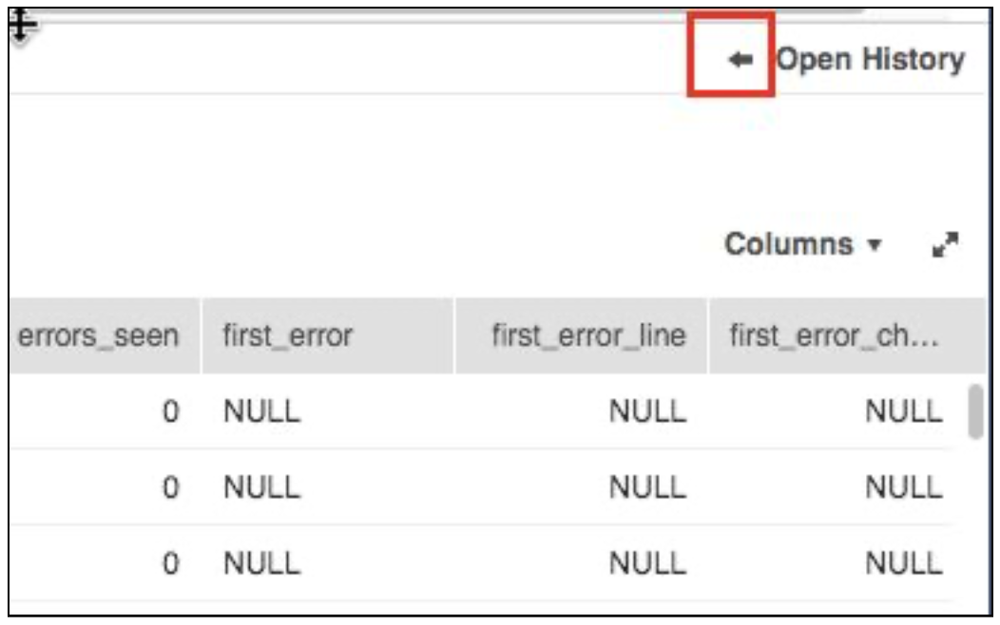

In the History window see the `copy into trips from @citibike_trips file_format=CSV;` SQL query you just ran and note the duration, bytes scanned, and rows. Use the slider on the left side of the pane to expand it if needed.

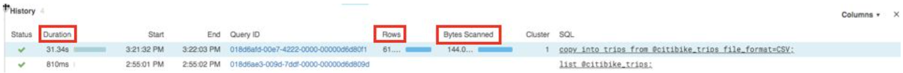

Go back to the worksheet to clear the table of all data and metadata by using the TRUNCATE TABLE command.

```SQL
truncate table trips;
```

Open the worksheet context menu, then click on Resize to increase the warehouse to size Large and click Finish. This warehouse is four times larger than the Small size.

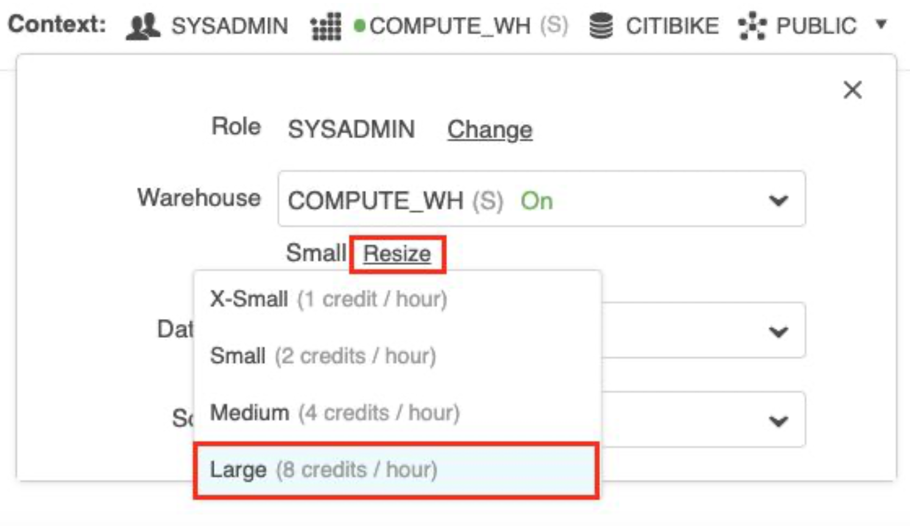

Go back to the worksheet and execute the following statement to load the same data again.

```SQL
copy into trips from @citibike_trips
file_format=CSV;
```

Once the load is done, at the bottom of the worksheet in the History window compare the times between the two loads. The load using the Large warehouse was significantly faster.

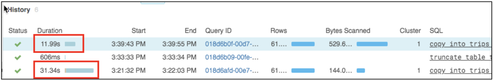

### 4.3 Create a New Warehouse for Data Analytics

Going back to the lab story, let’s assume the Citi Bike team wants to eliminate resource contention between their data loading/ETL workloads and the analytical end users using BI tools to query Snowflake. As mentioned earlier, Snowflake can easily do this by assigning different, appropriately-sized warehouses to various workloads. Since Citi Bike already has a warehouse for data loading, let’s create a new warehouse for the end users running analytics. We will use this warehouse to perform analytics in the next section.

Navigate to the Warehouses tab, click Create…, and name the new warehouse `ANALYTICS_WH` with size Large. If you have Snowflake’s Enterprise Edition or higher, you will see a setting for Maximum Clusters. Set this to 1.

Leave the other settings at their defaults. It should look like:

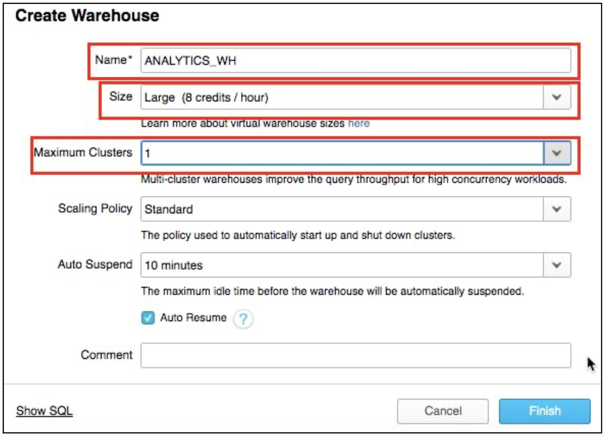

Click on the Finish button to create the warehouse.

<!-- ------------------------ -->

## Analytical Queries, Results Cache, Cloning

Duration: 8

In the previous exercises, we loaded data into two tables using Snowflake’s bulk loader `COPY` command and the warehouse `COMPUTE_WH`. Now we are going to take on the role of the analytics users at Citi Bike who need to query data in those tables using the worksheet and the second warehouse `ANALYTICS_WH`.

Negative
: **Real World Roles and Querying**
Within a real company, analytics users would likely have a different role than SYSADMIN. To keep the lab simple we are going to stay with the SYSADMIN role for this section.
Additionally, querying would typically be done with a business intelligence product like Tableau, Looker, PowerBI, etc. For more advanced analytics, data science tools like Datarobot, Dataiku, AWS Sagemaker or many others could query Snowflake. Any technology that leverages JDBC/ODBC, Spark or Python can run analytics on the data in Snowflake. To keep this lab simple, all queries are being done via the Snowflake worksheet.

### Execute SELECT Statements and Result Cache

Go to the Worksheets tab. Within the worksheet, verify your context is the following:

Role: `SYSADMIN`
Warehouse: `ANALYTICS_WH (L)`
Database: `CITIBIKE`
Schema = `PUBLIC`

Run the query below to see a sample of the trips data:

```SQL
select * from trips limit 20;
```

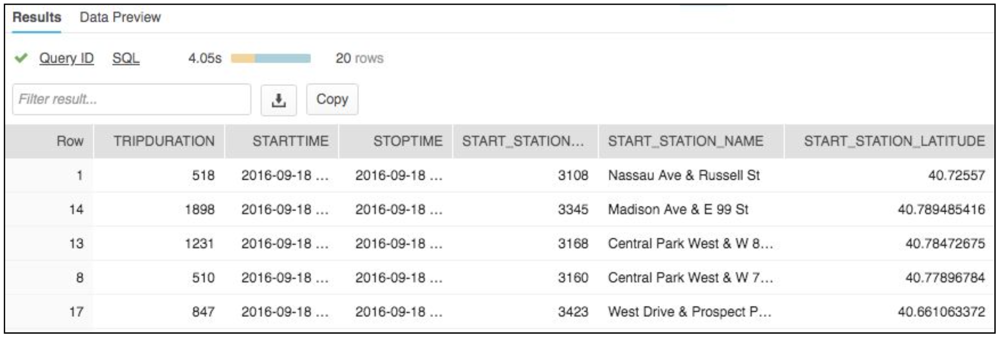

First let’s look at some basic hourly statistics on Citi Bike usage. Run the query below in the worksheet. It will show for each hour the number of trips, average trip duration, and average trip distance.

```SQL
select date_trunc('hour', starttime) as "date",
count(*) as "num trips",
avg(tripduration)/60 as "avg duration (mins)",
avg(haversine(start_station_latitude, start_station_longitude, end_station_latitude, end_station_longitude)) as "avg distance (km)"
from trips
group by 1 order by 1;
```

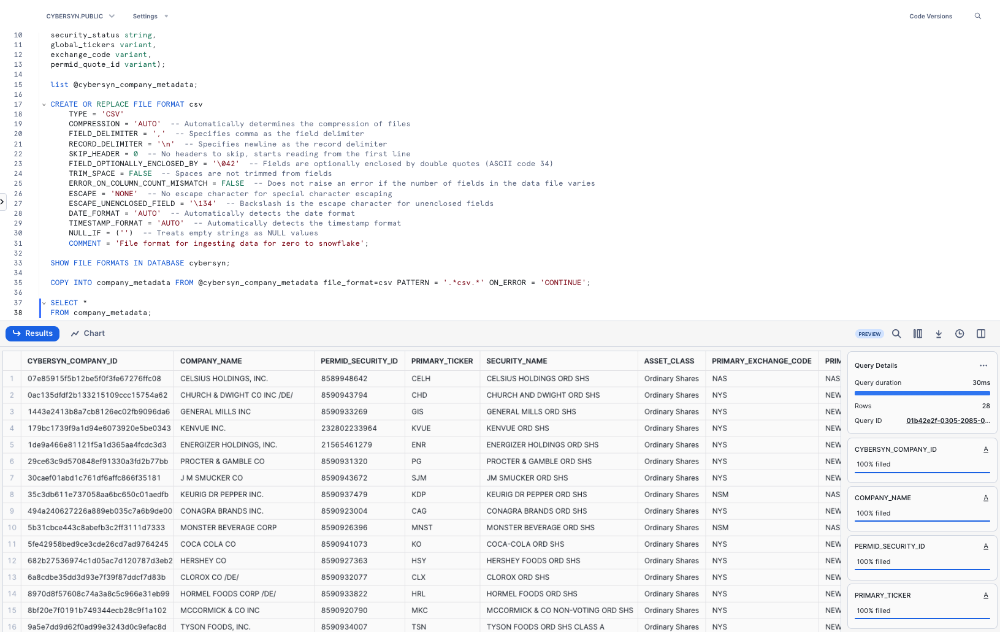

Snowflake has a result cache that holds the results of every query executed in the past 24 hours. These are available across warehouses, so query results returned to one user are available to any other user on the system who executes the same query, provided the underlying data has not changed. Not only do these repeated queries return extremely fast, but they also use no compute credits.

Let’s see the result cache in action by running the exact same query again.

```SQL
select date_trunc('hour', starttime) as "date",
count(*) as "num trips",
avg(tripduration)/60 as "avg duration (mins)",
avg(haversine(start_station_latitude, start_station_longitude, end_station_latitude, end_station_longitude)) as "avg distance (km)"
from trips
group by 1 order by 1;
```

In the History window note that the second query runs significantly faster because the results have been cached.

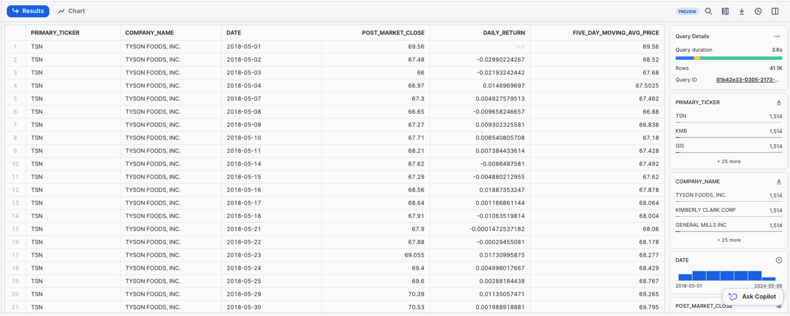

Next, let's run this query to see which months are the busiest:

```SQL
select
monthname(starttime) as "month",
count(*) as "num trips"
from trips
group by 1 order by 2 desc;
```

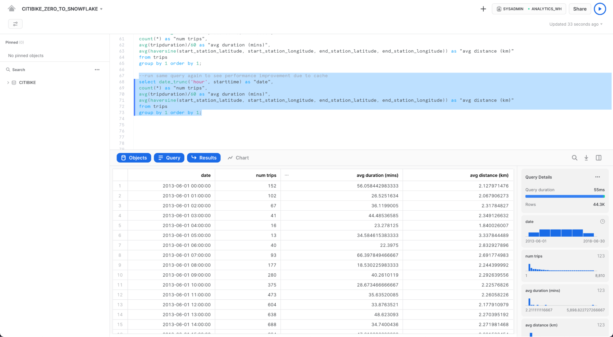

### Clone a Table

Snowflake allows you to create clones, also known as “zero-copy clones” of tables, schemas, and databases in seconds. A snapshot of data present in the source object is taken when the clone is created, and is made available to the cloned object. The cloned object is writable and independent of the clone source. Therefore changes made to either the source object or the clone object are not included in the other.

A popular use case for zero-copy cloning is to clone a production environment for use by Development & Testing to test and experiment without adversely impacting the production environment and eliminating the need to set up and manage two separate environments.

Negative
: **Zero-Copy Cloning**
A massive benefit of zero-copy cloning is that the underlying data is not copied. Only the metadata and pointers to the underlying data change. Hence they are “zero-copy” and storage requirements are not doubled when the data is cloned. Most data warehouses cannot do this, but for Snowflake it is easy!

Run the following command in the worksheet to create a development (dev) table:

```SQL
create table trips_dev clone trips
```

If closed, expand the database objects browser on the left of the worksheet. Click the small Refresh button in the left-hand panel and expand the object tree under the CITIBIKE database. Verify that you can see a new table under the CITIBIKE database named TRIPS_DEV. The development team now can do whatever they want with this table, including delete it, without impacting the TRIPS table or any other object.

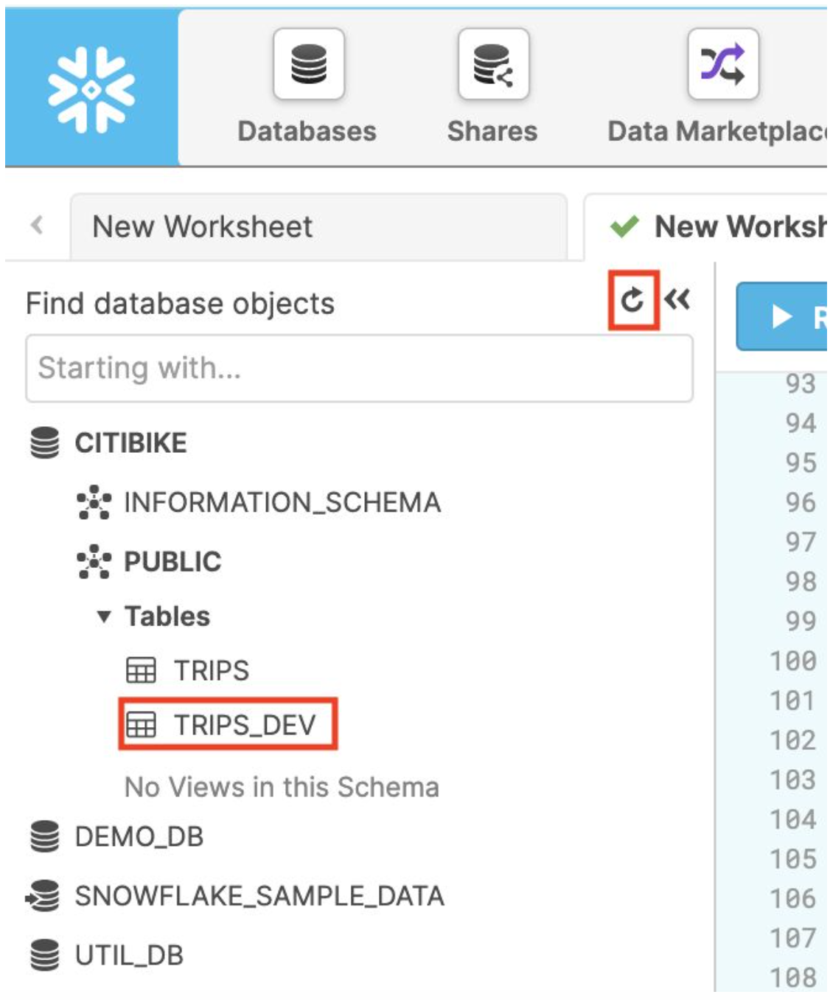

<!-- ------------------------ -->

## Working With Semi-Structured Data, Views, JOIN

Duration: 16

Positive
: The first steps in this section will review how to load data, but we will do most of it via SQL in the worksheet instead of through the UI.

Going back to the lab’s example, the Citi Bike analytics team wants to determine how weather impacts ride counts. To do this, in this section we will:

- Load weather data in JSON format held in a public S3 bucket
- Create a View and query the semi-structured data using SQL dot notation
- Run a query that joins the JSON data to the previously loaded `TRIPS` data
- Analyze the weather and ride count data to determine their relationship

The JSON data consists of weather information provided by OpenWeatherMap detailing the historical conditions of New York City from 2016-07-05 to 2019-06-25. It is also staged on AWS S3 where the data consists of 57.9k rows, 61 objects, and 2.5MB compressed. The raw JSON in GZ files and in a text editor looks like:

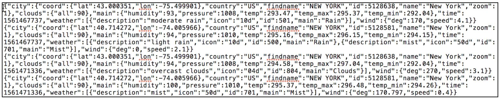

Negative
: **SEMI-STRUCTURED DATA**
Snowflake can easily load and query semi-structured data such as JSON, Parquet, or Avro without transformation. This is important because an increasing amount of business-relevant data being generated today is semi-structured, and many traditional data warehouses cannot easily load and query such data. Snowflake makes it easy!

### Create a Database and Table

First, via the worksheet, let’s create a database called `WEATHER` that will be used for storing the unstructured data.

```SQL
create database weather;
```

Set the context appropriately within the worksheet.

```SQL
use role sysadmin;
use warehouse compute_wh;
use database weather;
use schema public;
```

Next, let’s create a table called `JSON_WEATHER_DATA` that will be used for loading the JSON data. In the worksheet, run the SQL text below. Snowflake has a special column type called `VARIANT` which will allow us to store the entire JSON object and eventually query it directly.

```SQL
create table json_weather_data (v variant);
```

Negative
: **Semi-Structured Data Magic**
The VARIANT data type allows Snowflake to ingest semi-structured data without having to pre-define the schema.

Verify that your table `JSON_WEATHER_DATA` has been created. At the bottom of the worksheet you should see a Results section which says “Table JSON_WEATHER_DATA successfully created.”

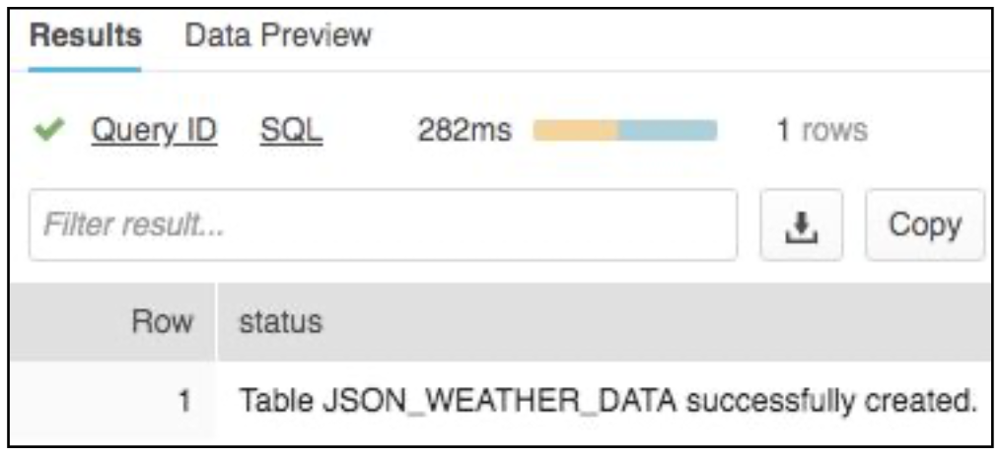

Navigate to the Databases tab and click on the `WEATHER` database link. You should see your newly created `JSON_WEATHER_DATA` table.

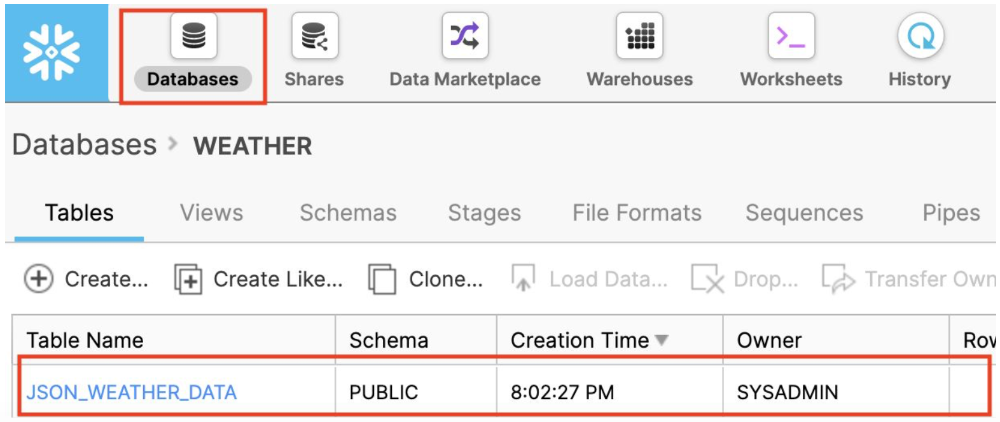

### Create an External Stage

Via the worksheet create a stage from where the unstructured data is stored on AWS S3.

```SQL
create stage nyc_weather
url = 's3://snowflake-workshop-lab/weather-nyc';
```

Now let’s take a look at the contents of the `nyc_weather` stage. Navigate to the Worksheets tab. Execute the following statement with a `LIST` command to display the list of files:

```SQL
list @nyc_weather;
```

You should see the output in the Results window in the bottom pane with many gz files from S3:

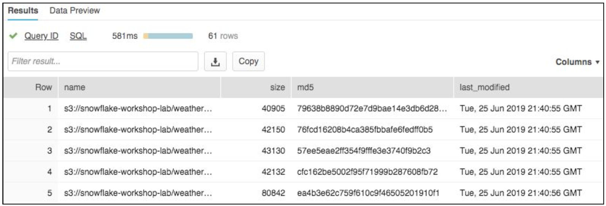

### Loading and Verifying the Unstructured Data

For this section, we will use a warehouse to load the data from the S3 bucket into the Snowflake table we just created.

Via the worksheet, run a `COPY` command to load the data into the `JSON_WEATHER_DATA` table we created earlier.

Note how in the SQL command we can specify a `FILE FORMAT` object inline. In the previous section where we loaded structured data, we had to define a file format in detail. Because the JSON data here is well formatted, we are able to use default settings and simply specify the JSON type.

```SQL
copy into json_weather_data
from @nyc_weather
file_format = (type=json);
```

Take a look at the data that has been loaded.

```SQL
select * from json_weather_data limit 10;
```

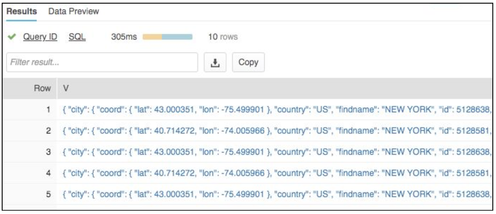

Click on one of the values. Notice how the data is stored in raw JSON. Click Done when finished.

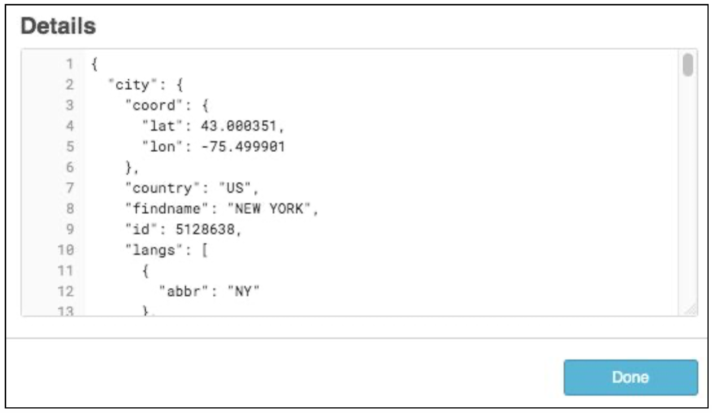

### Create a View and Query Semi-Structured Data

Let’s look at how Snowflake allows us to create a view and also query the JSON data directly using SQL.

Negative
: **Views & Materialized Views**
A View allows the result of a query to be accessed as if it were a table. Views can help present data to end users in a cleaner manner, limit what end users can view in a source table, and write more modular SQL.
There are also Materialized Views in which SQL results are stored as though the results were a table. This allows faster access, but requires storage space. Materialized Views can be accessed with Snowflake’s Enterprise Edition or higher.

Run the following command from the Worksheets tab. It will create a view of the unstructured JSON weather data in a columnar view so it is easier for analysts to understand and query. The city_id 5128638 corresponds to New York City.

```SQL
create view json_weather_data_view as
select
v:time::timestamp as observation_time,
v:city.id::int as city_id,
v:city.name::string as city_name,
v:city.country::string as country,
v:city.coord.lat::float as city_lat,
v:city.coord.lon::float as city_lon,
v:clouds.all::int as clouds,
(v:main.temp::float)-273.15 as temp_avg,
(v:main.temp_min::float)-273.15 as temp_min,
(v:main.temp_max::float)-273.15 as temp_max,
v:weather[0].main::string as weather,
v:weather[0].description::string as weather_desc,
v:weather[0].icon::string as weather_icon,
v:wind.deg::float as wind_dir,
v:wind.speed::float as wind_speed
from json_weather_data
where city_id = 5128638;
```

SQL dot notation `v.city.coord.lat` is used in this command to pull out values at lower levels within the JSON hierarchy. This allows us to treat each field as if it were a column in a relational table.

The new view should appear just under the table `json_weather_data` at the top left of the UI. You may need to expand or refresh the database objects browser in order to see it.

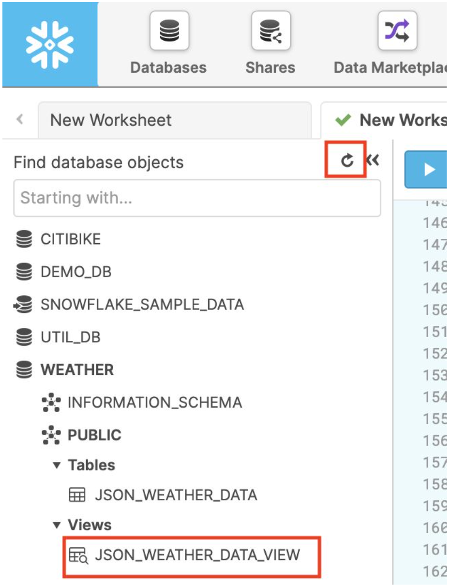

Via the worksheet, verify the view with the following query. Notice the results look just like a regular structured data source. Your result set may have different observation_time values.

```SQL
select * from json_weather_data_view
where date_trunc('month',observation_time) = '2018-01-01'
limit 20;
```

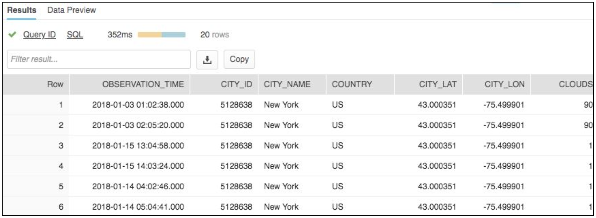

### Use a Join Operation to Correlate Against Data Sets

We will now join the JSON weather data to our `CITIBIKE.PUBLIC.TRIPS` data to answer our original question of how weather impacts the number of rides.

Run the command below to join `WEATHER` to `TRIPS` and count the number of trips associated with certain weather conditions .

Positive
: Since we are still in a worksheet use the `WEATHER` database as default. We will fully qualify our reference to the `TRIPS` table by providing its database and schema name.


```SQL
select weather as conditions
,count(*) as num_trips
from citibike.public.trips
left outer join json_weather_data_view
on date_trunc('hour', observation_time) = date_trunc('hour', starttime)
where conditions is not null
group by 1 order by 2 desc;
```

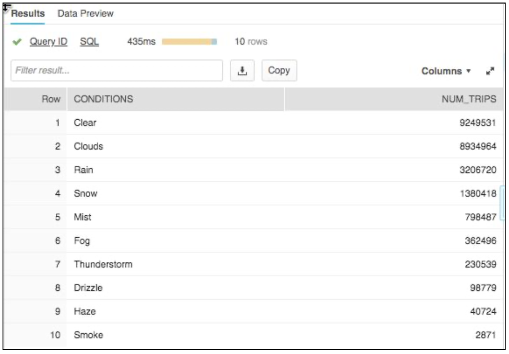

The initial goal was to determine if there was any correlation between the number of bike rides and the weather by analyzing both ridership and weather data. Per the table above we have a clear answer. As one would imagine, the number of trips is significantly higher when the weather is good!

<!-- ------------------------ -->

## Using Time Travel

Duration: 6

Snowflake’s Time Travel capability enables historical data access at any point within a pre-configurable period of time. The default window is 24 hours and with Snowflake’s Enterprise Edition it can be up to 90 days. Most data warehouses cannot offer this functionality, but - you guessed it - Snowflake makes it easy!

Some useful applications include:

- Restoring data-related objects such as tables, schemas, and databases that may have been deleted
- Duplicating and backing up data from key points in the past
- Analyzing data usage and manipulation over specified periods of time

### Drop and Undrop a Table

First let’s see how we can restore data objects that have been accidentally or intentionally deleted.

From the worksheet, run the following DROP command to remove the json_weather_data table:

```SQL
drop table json_weather_data;
```

Run a SELECT statement on the json_weather_data table. In the Results pane you should see an error because the underlying table has been dropped.

```SQL
select * from json_weather_data limit 10;
```

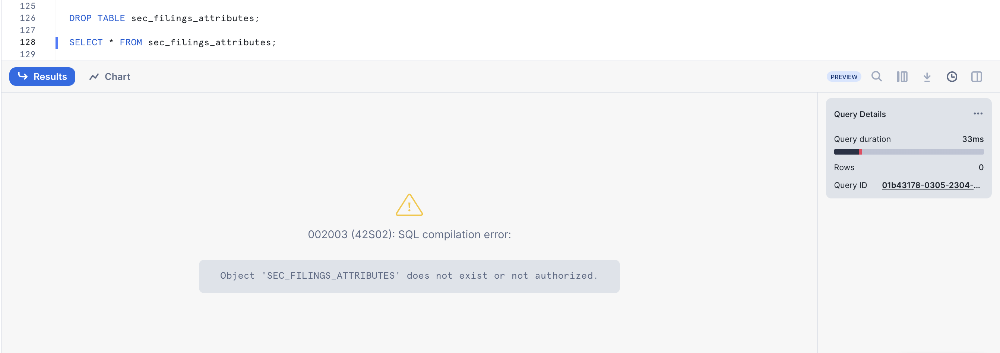

Now restore the table:

```SQL
undrop table json_weather_data;
```

The json_weather_data table should be restored.

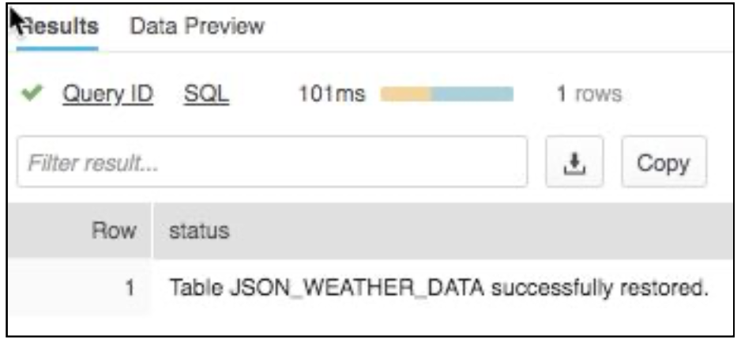

### Roll Back a Table

Let’s roll back a table to a previous state to fix an unintentional DML error that replaces all the station names in the `CITIBIKE` database’s `TRIPS` table with the word “oops.”

First make sure your worksheet has the proper context:

```SQL
use role sysadmin;
use warehouse compute_wh;
use database citibike;
use schema public;
```

Run the following command to replace all of the station names in the table with the word “oops”.

```SQL
update trips set start_station_name = 'oops';
```

Now run a query that returns the top 20 stations by number of rides. Notice that the station names result is only one row.

```SQL
select
start_station_name as "station",
count(*) as "rides"
from trips
group by 1
order by 2 desc
limit 20;
```


Normally we would need to scramble and hope we have a backup lying around. In Snowflake, we can simply run commands to find the query ID of the last UPDATE command and store it in a variable called $QUERY_ID.

```SQL
set query_id =
(select query_id from table(information_schema.query_history_by_session (result_limit=>5))
where query_text like 'update%' order by start_time limit 1);
```

Re-create the table with the correct station names:

```SQL
create or replace table trips as
(select * from trips before (statement => $query_id));
```

Run the SELECT statement again to verify that the station names have been restored:

```SQL
select
start_station_name as "station",
count(*) as "rides"
from trips
group by 1
order by 2 desc
limit 20;
```


<!-- ------------------------ -->

## Role-Based Access Controls, Account Usage, and Account Admin

Duration: 8

In this section we will explore aspects of Snowflake’s role-based access control (RBAC), such as creating a new role and granting it specific permissions. We will also cover the `ACCOUNTADMIN` (Account Administrator) role.

To continue with the Citi Bike story, let’s assume a junior DBA has joined Citi Bike and we want to create a new role for them with less privileges than the system-defined, default role of `SYSADMIN`.

Negative
: **Role-Based Access Control**
Snowflake offers very powerful and granular RBAC that dictates what objects and capabilities a user can access, and what level of access they have. For more detail, check out the [Snowflake documentation](https://docs.snowflake.net/manuals/user-guide/security-access-control.html).

### Create a New Role and Add a User

In the worksheet switch to the `ACCOUNTADMIN` role to create a new role. `ACCOUNTADMIN` encapsulates the `SYSADMIN` and `SECURITYADMIN` system-defined roles. It is the top-level role in the system and should be granted only to a limited number of users in your account. In the worksheet, run:

```SQL
use role accountadmin;
```

Notice at the top right of the worksheet the context has changed to the role `ACCOUNTADMIN`

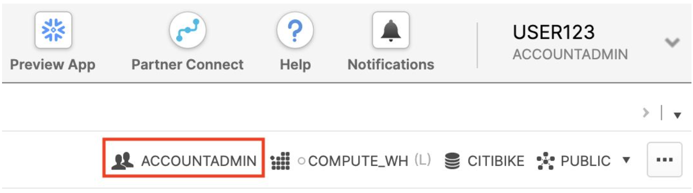

In order for any role to function, we need at least one user assigned to it. So let’s create a new role called `junior_dba` and assign your username to it. Your username appears at the top right of the UI. In the screenshot below it is `USER123`.


Create the role and add your username to it:

```SQL
create role junior_dba;
grant role junior_dba to user YOUR_USER_NAME_GOES HERE;
```

Positive
: If you tried to perform this operation while in a role like `SYSADMIN`, it would fail due to insufficient privileges. The `SYSADMIN` role by default cannot create new roles or users.

Change your worksheet context to the new `junior_dba` role:

```SQL
use role junior_dba;
```

At the top right of the worksheet, note that the context has changed to reflect the `junior_dba` role.

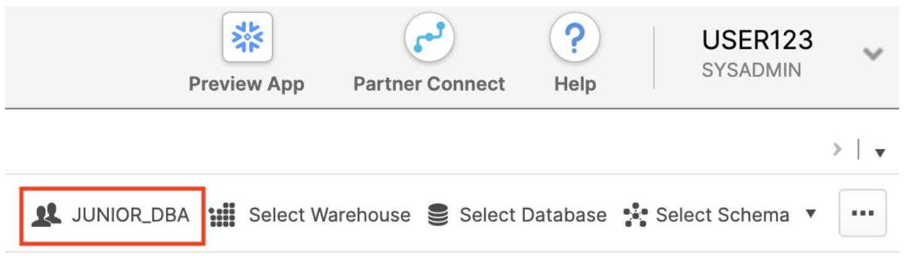

On the left side of the UI in the database object browser pane the `CITIBIKE` and `WEATHER` databases no longer appear. This is because the `junior_dba` role does not have access to view them.

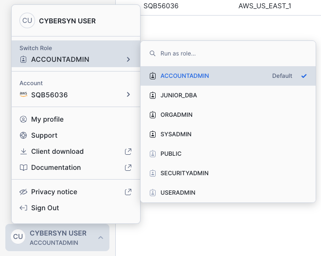

Switch back to the `ACCOUNTADMIN` role and grant the `junior_dba` the ability to view and use the `CITIBIKE` and `WEATHER` databases:

```SQL
use role accountadmin;
grant usage on database citibike to role junior_dba;
grant usage on database weather to role junior_dba;
```

Switch to the `junior_dba` role:

```SQL
use role junior_dba;
```

Note that the `CITIBIKE` and `WEATHER` databases now appear. Try clicking the refresh icon if they do not.

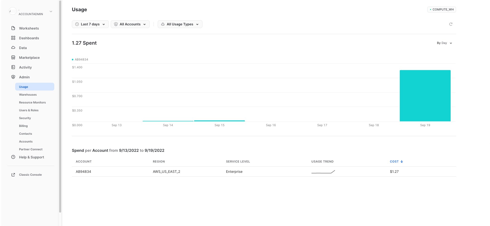

### Account Administrator View

Let’s change our security role to `ACCOUNTADMIN` to see other parts of the UI accessible only to this role.

In the top right corner of the UI, click on your username to show the User Preferences menu. Go to Switch Role, then select the `ACCOUNTADMIN` role.

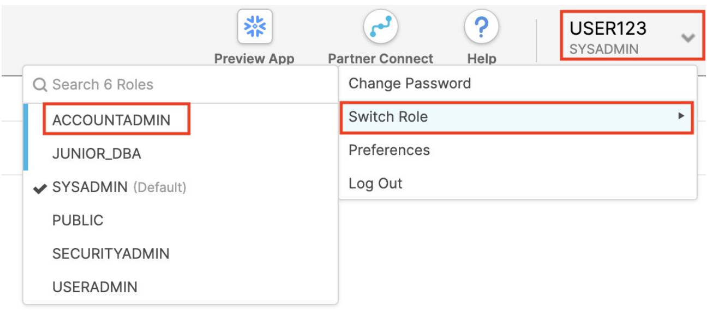

Negative
: **Roles in User Preference vs Worksheet**
We just changed the security role for the session in the user preference menu. This is different from the worksheet context menu where we assign a role that is applied to that specific worksheet. Also, the session security role can simultaneously be different from the role used in a worksheet.

Notice at the top of the UI you will now see a sixth tab called Account that you can only view in the `ACCOUNTADMIN` role.

Click on this Account tab. Towards the top of the page click on Usage. Here you can find information on credits, storage, and daily or hourly usage for each warehouse, including cloud services. Select a day to review its usage.

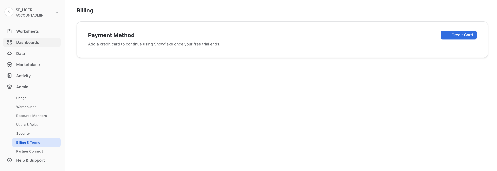

To the right of Usage is Billing where you can add a credit card and continue beyond your free trial’s $400 of credits. Further to the right is information on Users, Roles, and Resource Monitors. The latter set limits on your account's credit consumption so you can appropriately monitor and manage your credits.

Stay in the `ACCOUNTADMIN` role for the next section.

<!-- ------------------------ -->

## Secure Data Sharing & Data Marketplace

Duration:12

Snowflake enables data access between accounts through shares. Shares are created by data providers and imported by data consumers, either through their own Snowflake account or a provisioned Snowflake Reader account. The consumer could be an external entity or a different internal business unit that is required to have its own unique Snowflake account.

With Secure Data Sharing:

- There is only one copy of the data that lives in the data provider’s account
- Shared data is always live, real-time, and immediately available to consumers
- Providers can establish revocable, fine-grained access to shares
- Data sharing is simple and safe, especially compared to older data sharing methods which were often manual and insecure, involving the transfer of large `.csv` files across the internet

Positive
: To share data across regions or cloud providers you must set up replication. This is outside the scope of the lab, but more information can be found in [this Snowflake article](https://www.snowflake.com/trending/what-is-data-replication).

Snowflake uses secure data sharing to provide account usage data and sample data sets with all Snowflake accounts. In this capacity, Snowflake acts as the provider of the data and all other accounts act as consumers.

Secure data sharing also powers the Snowflake Data Marketplace, which is available to all Snowflake customers and allows you to discover and access third-party datasets from numerous data providers and SaaS vendors. Again in this example the data doesn’t leave the provider’s account and you can use the datasets without any transformation.

### See Existing Shares

Click on the blue Snowflake logo at the very top left of the UI. On the left side of the page in the database object browser, notice the database `SNOWFLAKE_SAMPLE_DATA`. The small arrow on the database icon indicates this is a share.


At the top right of the UI, verify that you are in the `ACCOUNTADMIN` role. Navigate to the Shares tab and notice you are looking at your Inbound Secure Shares. There are two shares provided by Snowflake. One contains your account usage and the other has sample data. This is data sharing in action - your Snowflake account is a consumer of data shared by Snowflake!

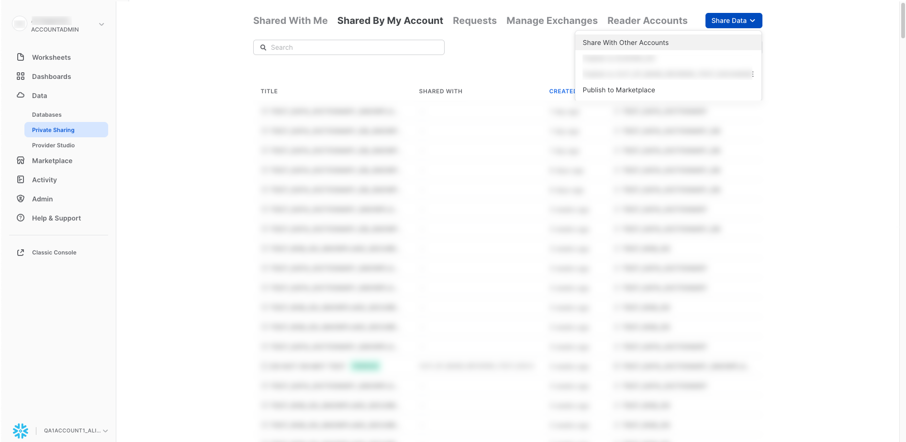

### Create an Outbound Share

Let’s go back to the Citi Bike story and assume we are the Account Administrator for Snowflake at Citi Bike. We have a trusted partner who wants to analyze the data in our TRIPS database on a near real-time basis. This partner also has their own Snowflake account in our region. So let’s use Snowflake Data Sharing to allow them to access this information.

Navigate to the Shares tab. Further down on the page click on the Outbound button.

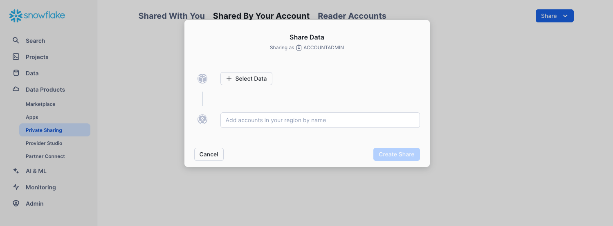

Click the Create button and fill in the following fields:

Secure Share Name: `TRIPS_SHARE`
Database: `CITIBIKE`
Tables & Views: `CITIBIKE` > `PUBLIC` > `TRIPS`.

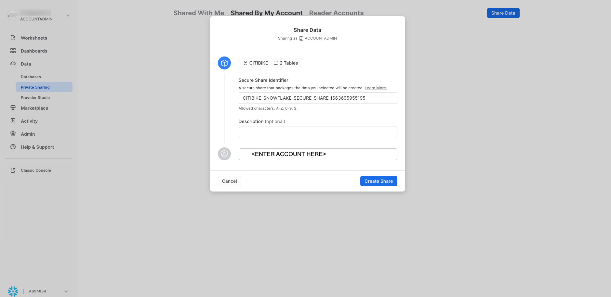

Click Apply then Create.

Note that the window indicates the secure share was created successfully.

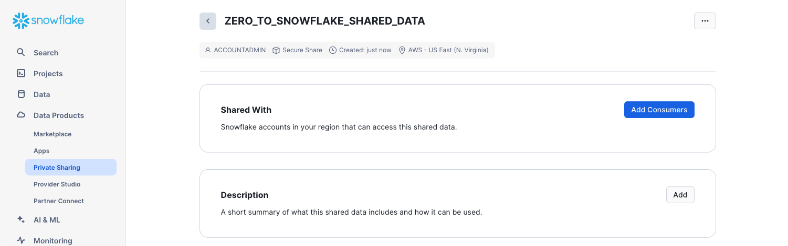

Realistically, the Citi Bike Account Administrator would click on the Next: Add Consumers button to input their partner’s Snowflake account name and type. We will stop here for the purposes of this lab.

Click on the Done button at the bottom of the box.

Note this page now shows the TRIPS_SHARE secure share. It only took seconds to give other accounts access to data in Snowflake in a secure manner with no copies of the data required!

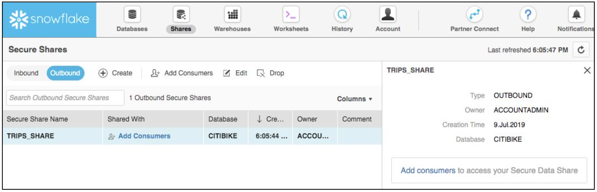

Snowflake provides several ways to securely share data without compromising confidentiality. You can share not only tables and views, but also Secure Views, Secure UDFs (User Defined Functions), and Secure Joins. For more details on how to use these methods for sharing data while preventing access to sensitive information, see the [Snowflake documentation](https://docs.snowflake.com/en/user-guide/data-sharing-secure-views.html).

### Snowflake Data Marketplace

Navigate to the Data Marketplace tab.

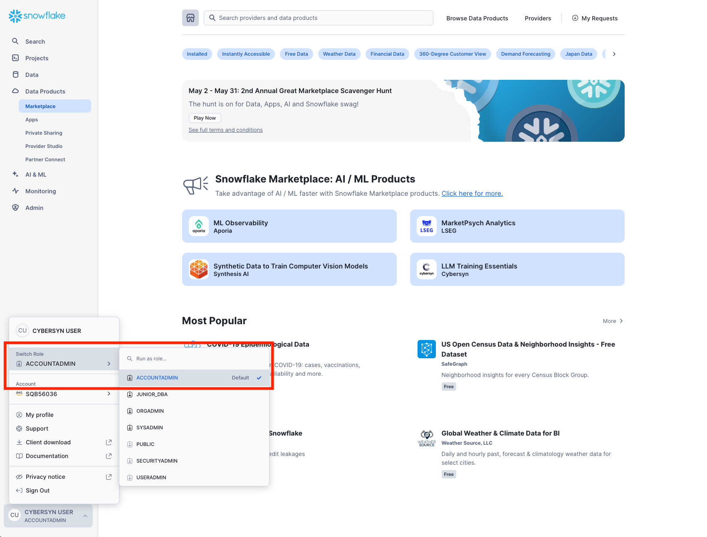

Select “Explore the Snowflake Data Marketplace.” If it’s your first time using the Data Marketplace the following login screens will appear:

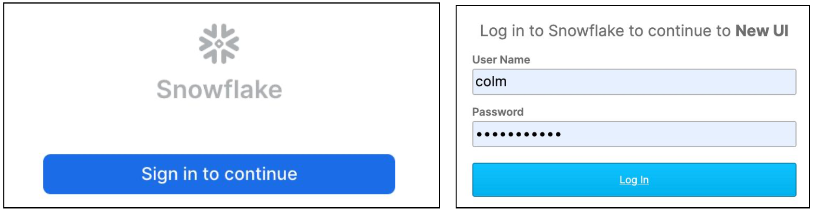

Enter your credentials to access the Snowflake Data Marketplace.

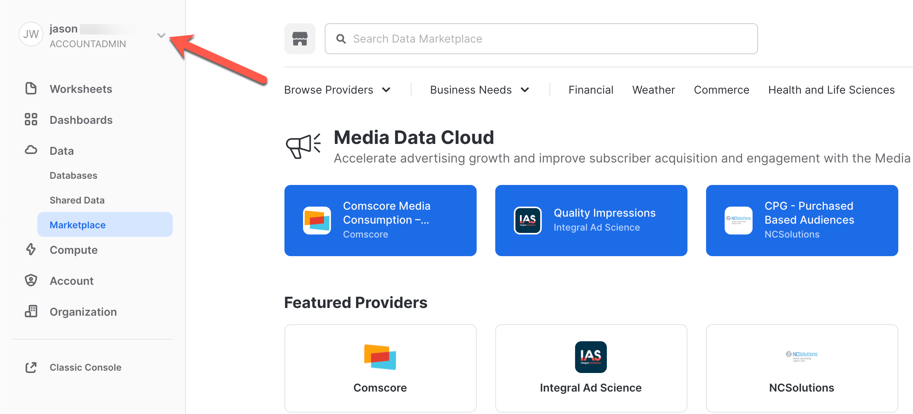

The search bar in the top right allows you to query for a listing or data provider. The left hand side menu shows the categories of data available in the Data Marketplace. Select the Health category.

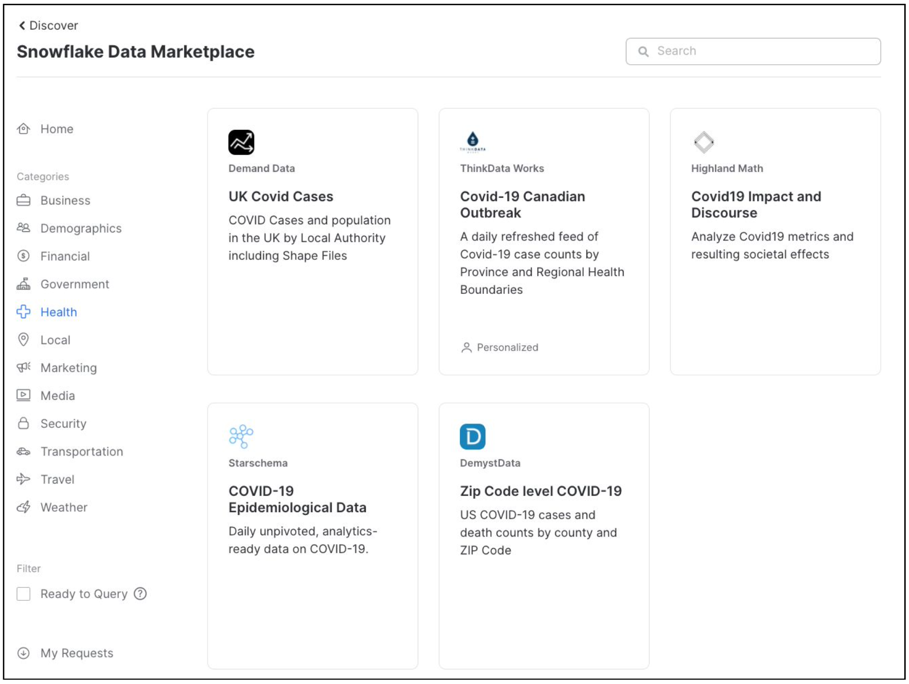

Today we will use Starschema’s COVID-19 Epidemiological Data. Make sure you are in the `ACCOUNTADMIN` role.

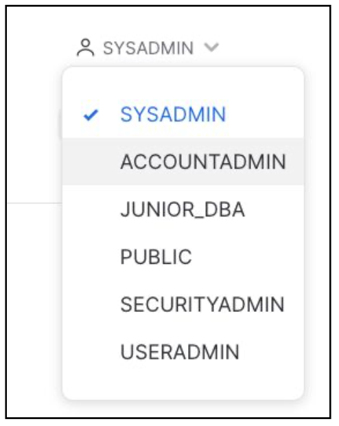

Here you can select the data and click on the Get Data button to access this information within your Snowflake Account.

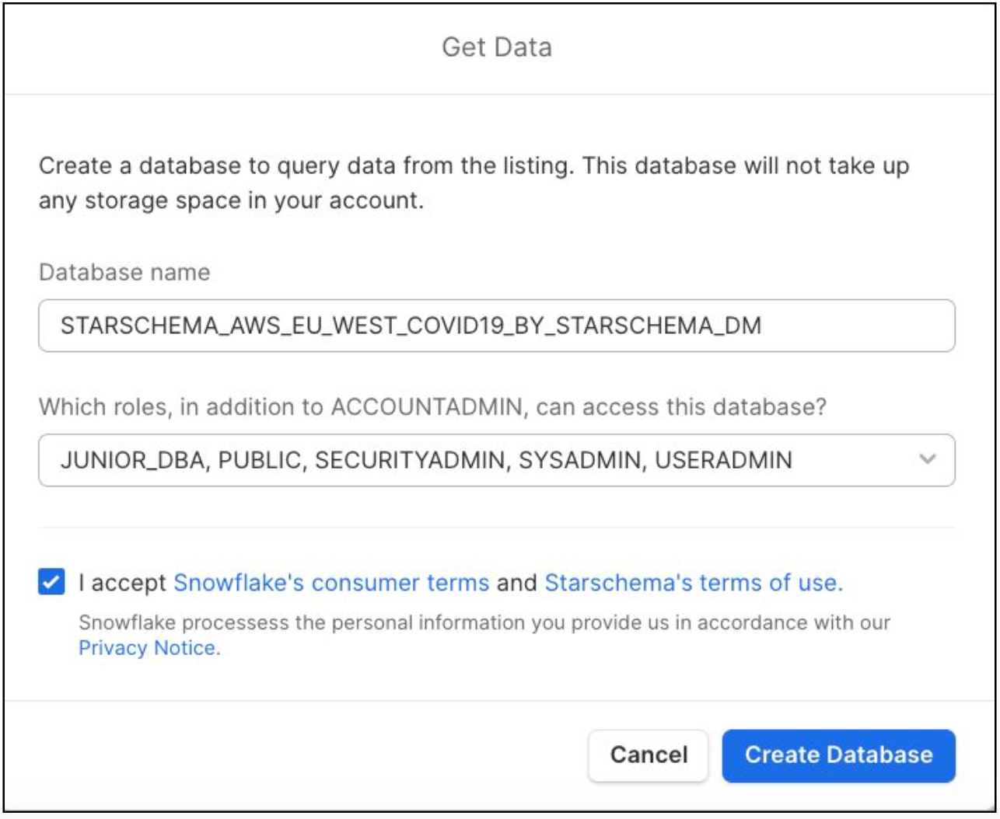

Select all the roles, accept the terms of use, then click Create Database.

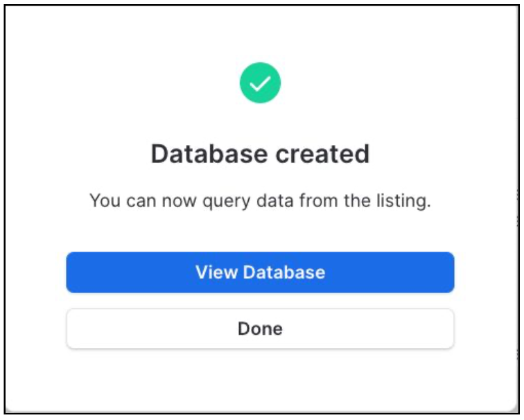

Now click View Database.


Two schemas are available - `INFORMATION_SCHEMA` and `PUBLIC`. Click `PUBLIC` to see the available tables.

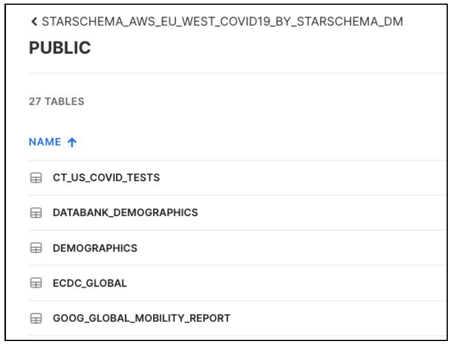

Type JHU in the search bar to view all tables with data sourced from [John Hopkins University](https://www.jhu.edu/)

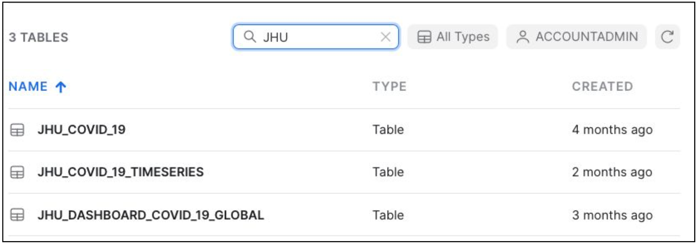

The refresh button on the right will refresh all the objects in the schema.

Further to the right you will see the Database Details including the owner of the share, number of tables and views in this database, source, share name, and data provider.

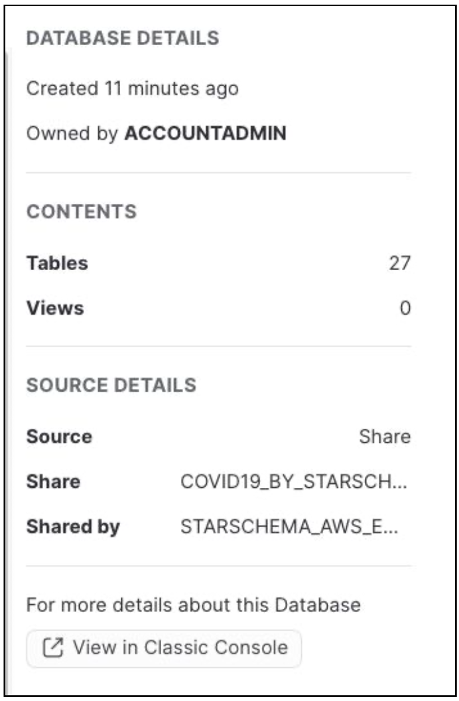

You have now successfully subscribed to the COVID-19 dataset from StarSchema which is updated daily with global COVID data. Note that we didn’t have to create databases, tables, views, or an ETL process. We simply can search for and access shared data from the Snowflake Data Marketplace.


<!-- ------------------------ -->

## Resetting Your Snowflake Environment

Duration: 2

If you would like to reset your environment by deleting all the objects created as part of this lab, run the SQL below in a worksheet.

First set the worksheet context:

```SQL
use role accountadmin;
use warehouse compute_wh;
use database weather;
use schema public;
```

Then run this SQL to drop all the objects we created in the lab:

```SQL
drop share if exists trips_share;
drop database if exists citibike;
drop database if exists weather;
drop warehouse if exists analytics_wh;
drop role if exists junior_dba;
```

<!-- ------------------------ -->

## Conclusion & Next Steps

Duration: 2

Congratulations on completing this introductory lab exercise! You’ve mastered the Snowflake basics and are ready to apply these fundamentals to your own data. Be sure to reference this guide if you ever need a refresher.

We encourage you to continue with your free trial by loading your own sample or production data and by using some of the more advanced capabilities of Snowflake not covered in this lab. 
### Additional Resources:

- Read the [Definitive Guide to Maximizing Your Free Trial](https://www.snowflake.com/test-driving-snowflake-the-definitive-guide-to-maximizing-your-free-trial/) document
- Attend a [Snowflake virtual or in-person event](https://www.snowflake.com/about/events/) to learn more about our capabilities and customers
- [Join the Snowflake community](https://community.snowflake.com/s/topic/0TO0Z000000wmFQWAY/getting-started-with-snowflake)
- [Sign up for Snowflake University](https://community.snowflake.com/s/article/Getting-Access-to-Snowflake-University)
- [Contact our Sales Team](https://www.snowflake.com/free-trial-contact-sales/) to learn more

### What we've covered:

- how to create stages, databases, tables, views, and warehouses
- how to load structured and semi-structured data
- how to query data including joins between tables
- how to clone objects
- how to undo user errors
- how to create roles and users, and grant them privileges
- how to securely and easily share data with other accounts