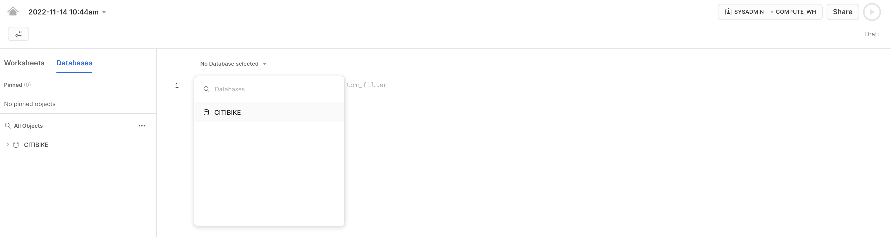
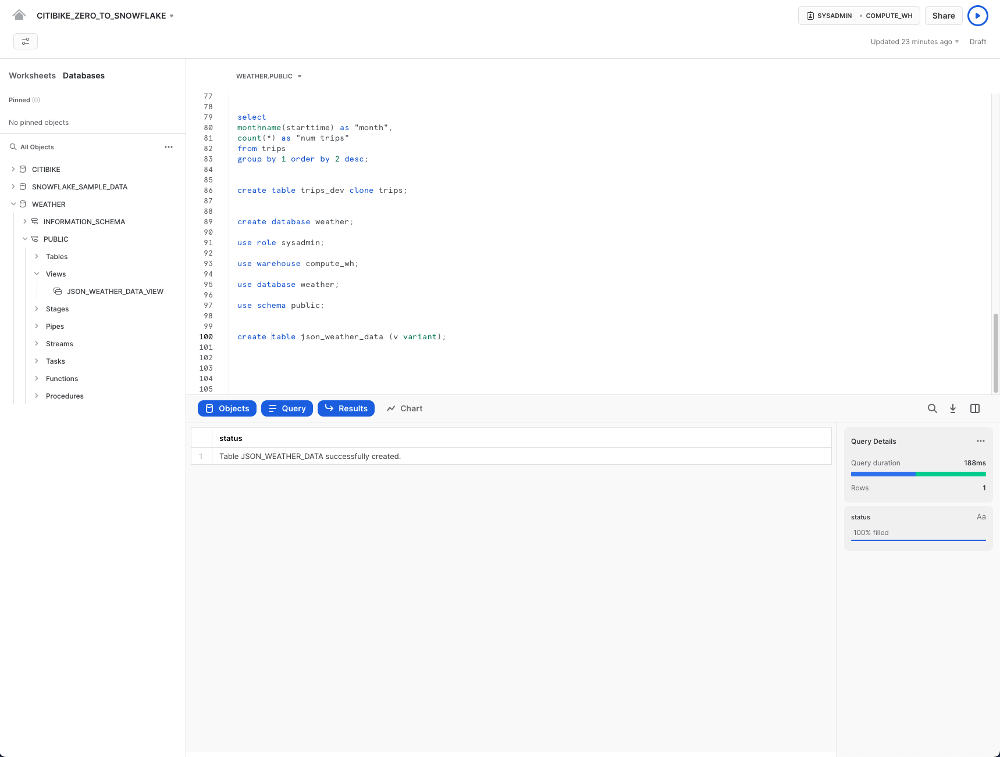
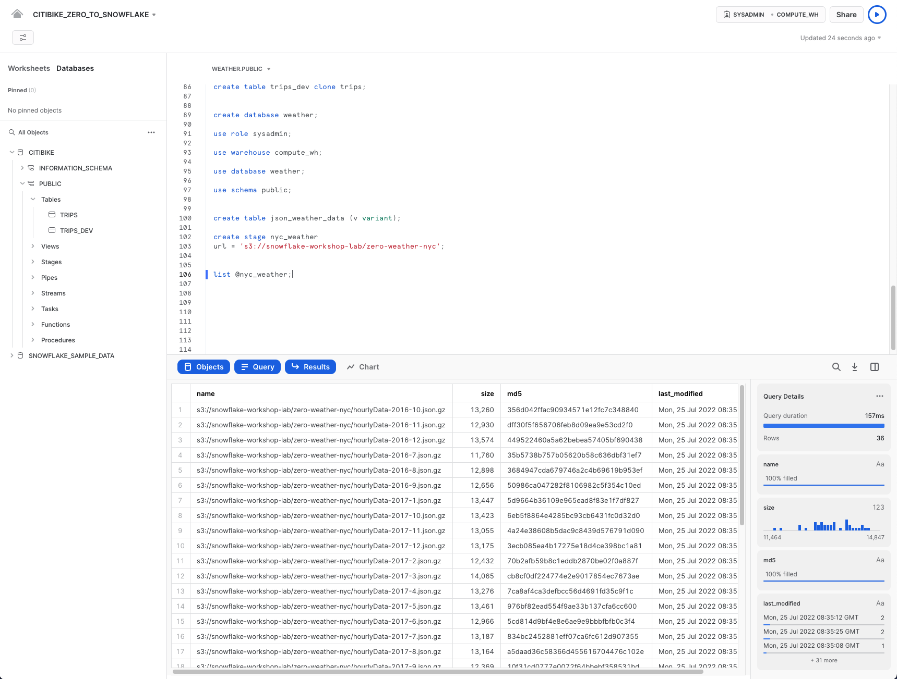
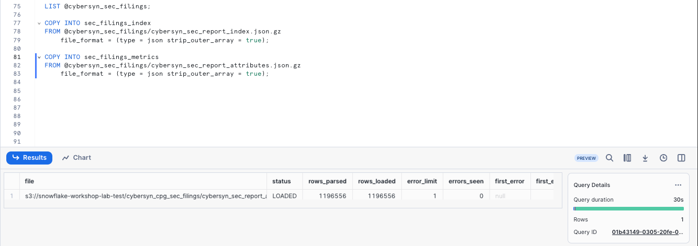
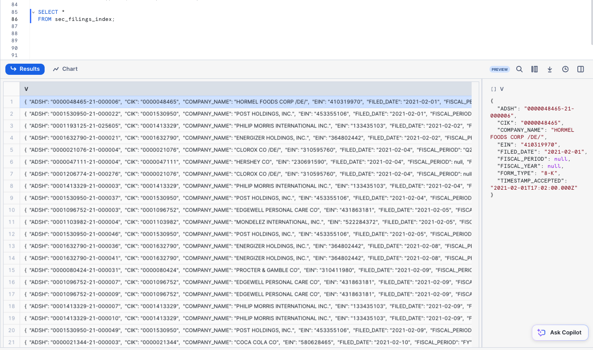
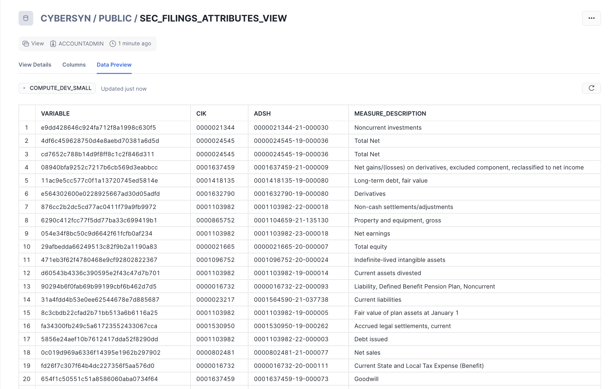
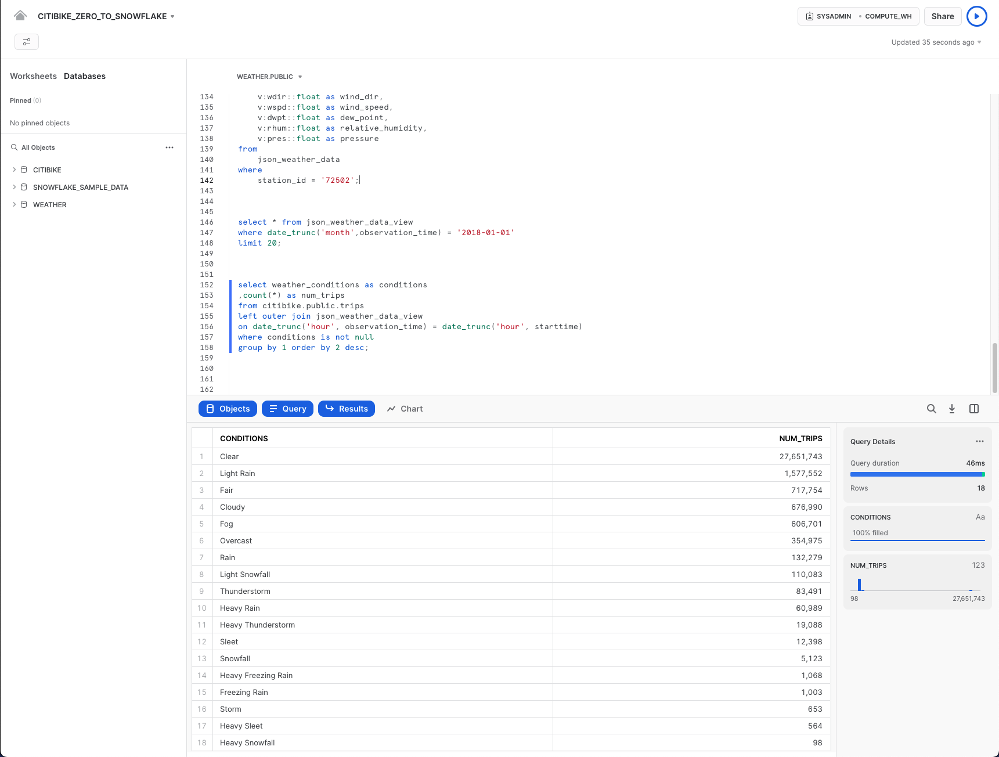

<!-- dash to recreate -->

Now navigate to the **Worksheets** tab. You should see the worksheet we created in step 3.


<!-- dash to recreate -->

We need to set the context appropriately within the worksheet. In the upper right corner of the worksheet, click the box to the left of the **Share** button to show the context menu. Here we control the elements you can see and run from each worksheet. We are using the UI here to set the context. Later in the lab, we will accomplish the same thing via SQL commands within the worksheet.

Select the following context settings:

Role: `SYSADMIN`
Warehouse: `COMPUTE_WH`


<!-- dash to recreate -->

Next, in the drop-down for the database, select the following context settings:

Database: `COMPANY_DATA`
Schema = `CYBERSYN`
<!-- dash, can this be changed from public to cybersyn to align with our naming in the listing? -->


<!-- dash to recreate -->

> aside negative
> 
>  **Data Definition Language (DDL) operations are free!**
All the DDL operations we have done so far do not require compute resources, so we can create all our objects for free.

To make working in the worksheet easier, let's rename it. In the top left corner, double-click the worksheet name, which is the timestamp when the worksheet was created, and change it to `CYBERSYN_ZERO_TO_SNOWFLAKE`.

Next we create a table called `COMPANY_METADATA` to use for loading the comma-delimited data. Instead of using the UI, we use the worksheet to run the DDL that creates the table. Copy the following SQL text into your worksheet:

```SQL
create or replace table company_metadata
(tripduration integer,
starttime timestamp,
stoptime timestamp,
start_station_id integer,
start_station_name string,
start_station_latitude float,
start_station_longitude float,
end_station_id integer,
end_station_name string,
end_station_latitude float,
end_station_longitude float,
bikeid integer,
membership_type string,
usertype string,
birth_year integer,
gender integer);
```

> aside negative
> 
>  **Many Options to Run Commands.**
SQL commands can be executed through the UI, via the **Worksheets** tab, using our SnowSQL command line tool, with a SQL editor of your choice via ODBC/JDBC, or through our other connectors (Python, Spark, etc.).
As mentioned earlier, to save time, we are performing most of the operations in this lab via pre-written SQL executed in the worksheet as opposed to using the UI.

Run the query by placing your cursor anywhere in the SQL text and clicking the blue **Play/Run** button in the top right of the worksheet. Or use the keyboard shortcut [Ctrl]/[Cmd]+[Enter].

Verify that your TRIPS table has been created. At the bottom of the worksheet you should see a Results section displaying a "Table TRIPS successfully created" message.


Navigate to the **Databases** tab by clicking the **HOME** icon in the upper left corner of the worksheet. Then click **Data** > **Databases**. In the list of databases, click `CITIBIKE` > `PUBLIC` > **TABLES** to see your newly created `TRIPS` table. If you don't see any databases on the left, expand your browser because they may be hidden.


Click `TRIPS` and the **Columns** tab to see the table structure you just created.


### Create an External Stage

We are working with structured, comma-delimited data that has already been staged in a public, external S3 bucket. Before we can use this data, we first need to create a Stage that specifies the location of our external bucket.

> aside positive
> 
>  For this lab we are using an AWS-East bucket. To prevent data egress/transfer costs in the future, you should select a staging location from the same cloud provider and region as your Snowflake account.

From the **Databases** tab, click the `CITIBIKE` database and `PUBLIC` schema. Click the **Create** button, then **Stage** > **Amazon S3**.


In the "Create Securable Object" dialog that opens, replace the following values in the SQL statement:

`<stage_name>`: `citibike_trips`

`<url>`: `s3://snowflake-workshop-lab/citibike-trips-csv/`

**Note:** Make sure to include the final forward slash (`/`) at the end of the URL or you will encounter errors later when loading data from the bucket.
Also ensure you have removed 'credentials = (...)' statement which is not required. You can also comment it out like the picture below by using '--'. The create stage command should resemble the below picture or not include the 3rd line.

> aside positive
> 
>  The S3 bucket for this lab is public so you can leave the credentials options in the statement empty. In a real-world scenario, the bucket used for an external stage would likely require key information.


Now let's take a look at the contents of the `citibike_trips` stage. Navigate back to the **Worksheets** tab and open the 'CITIBIKE_ZERO_TO_SNOWFLAKE' worksheet we made, add the following SQL statement below the previous code as shown in the below picture and then execute:

```SQL
list @citibike_trips;
```

In the results in the bottom pane, you should see the list of files in the stage:


### Create a File Format

Before we can load the data into Snowflake, we have to create a file format that matches the data structure. In the worksheet, add the below command and execute to create the file format:

```SQL
--create file format
create or replace file format csv type='csv'
  compression = 'auto' field_delimiter = ',' record_delimiter = '\n'
  skip_header = 0 field_optionally_enclosed_by = '\042' trim_space = false
  error_on_column_count_mismatch = false escape = 'none' escape_unenclosed_field = '\134'
  date_format = 'auto' timestamp_format = 'auto' null_if = ('') comment = 'file format for ingesting data for zero to snowflake';
```


Verify that the file format has been created with the correct settings by executing the following command:

```SQL
--verify file format is created
show file formats in database company_data;
```

The file format created should be listed in the result:


<!-- ------------------------ -->

## Working with Semi-Structured Data, Views, & Joins

Duration: 16

> aside positive
> 
>  This section requires loading additional data and, therefore, provides a review of data loading while also introducing loading semi-structured data.

Going back to the lab's example, the Citi Bike analytics team wants to determine how weather impacts ride counts. To do this, in this section, we will:

- Load weather data in semi-structured JSON format held in a public S3 bucket.
- Create a view and query the JSON data using SQL dot notation.
- Run a query that joins the JSON data to the previously loaded `TRIPS` data.
- Analyze the weather and ride count data to determine their relationship.

The JSON data consists of weather information provided by *MeteoStat* detailing the historical conditions of New York City from 2016-07-05 to 2019-06-25. It is also staged on AWS S3 where the data consists of 75k rows, 36 objects, and 1.1MB compressed. If viewed in a text editor, the raw JSON in the GZ files looks like:


> aside negative
> 
>  **SEMI-STRUCTURED DATA**
Snowflake can easily load and query semi-structured data such as JSON, Parquet, or Avro without transformation. This is a key Snowflake feature because an increasing amount of business-relevant data being generated today is semi-structured, and many traditional data warehouses cannot easily load and query such data. Snowflake makes it easy!

### Create a New Database and Table for the Data

First, in the worksheet, let's create a database named `WEATHER` to use for storing the semi-structured JSON data.

```SQL
create database weather;
```

Execute the following USE commands to set the worksheet context appropriately:

```SQL
use role sysadmin;

use warehouse compute_wh;

use database weather;

use schema public;
```

> aside positive
> 
>  **Executing Multiple Commands** Remember that you need to execute each command individually. However, you can execute them in sequence together by selecting all of the commands and then clicking the **Play/Run** button (or using the keyboard shortcut).

Next, let's create a table named `JSON_WEATHER_DATA` to use for loading the JSON data. In the worksheet, execute the following CREATE TABLE command:

```SQL
create table json_weather_data (v variant);
```

Note that Snowflake has a special column data type called `VARIANT` that allows storing the entire JSON object as a single row and eventually query the object directly.

> aside negative
> 
>  **Semi-Structured Data Magic**
The VARIANT data type allows Snowflake to ingest semi-structured data without having to predefine the schema.

In the results pane at the bottom of the worksheet, verify that your table, `JSON_WEATHER_DATA`, was created:



### Create Another External Stage

In the `CITIBIKE_ZERO_TO_SNOWFLAKE` worksheet, use the following command to create a stage that points to the bucket where the semi-structured JSON data is stored on AWS S3:

```SQL
create stage nyc_weather
url = 's3://snowflake-workshop-lab/zero-weather-nyc';
```

Now let's take a look at the contents of the `nyc_weather` stage. Execute the following LIST command to display the list of files:

```SQL
list @nyc_weather;
```

In the results pane, you should see a list of `.gz` files from S3:



### Load and Verify the Semi-structured Data

In this section, we will use a warehouse to load the data from the S3 bucket into the `JSON_WEATHER_DATA` table we created earlier.

In the `CITIBIKE_ZERO_TO_SNOWFLAKE` worksheet, execute the COPY command below to load the data.

Note that you can specify a `FILE FORMAT` object inline in the command. In the previous section where we loaded structured data in CSV format, we had to define a file format to support the CSV structure. Because the JSON data here is well-formed, we are able to simply specify the JSON type and use all the default settings:

```SQL
copy into json_weather_data
from @nyc_weather 
    file_format = (type = json strip_outer_array = true);
```

Verify that each file has a status of `LOADED`:




Now, let's take a look at the data that was loaded:

```SQL
select * from json_weather_data limit 10;
```

Click any of the rows to display the formatted JSON in the right panel:



To close the display in the panel and display the query details again, click the **X** (Close) button that appears when you hover your mouse in the right corner of the panel.


### Create a View and Query Semi-Structured Data

Next, let's look at how Snowflake allows us to create a view and also query the JSON data directly using SQL.

> aside negative
> 
>  **Views & Materialized Views**
A view allows the result of a query to be accessed as if it were a table. Views can help present data to end users in a cleaner manner, limit what end users can view in a source table, and write more modular SQL.
Snowflake also supports materialized views in which the query results are stored as though the results are a table. This allows faster access, but requires storage space. Materialized views can be created and queried if you are using Snowflake Enterprise Edition (or higher).

Run the following command to create a columnar view of the semi-structured JSON weather data so it is easier for analysts to understand and query. The ``72502`` value for ``station_id`` corresponds to Newark Airport, the closest station that has weather conditions for the whole period.

```SQL
// create a view that will put structure onto the semi-structured data
create or replace view json_weather_data_view as
select
    v:obsTime::timestamp as observation_time,
    v:station::string as station_id,
    v:name::string as city_name,
    v:country::string as country,
    v:latitude::float as city_lat,
    v:longitude::float as city_lon,
    v:weatherCondition::string as weather_conditions,
    v:coco::int as weather_conditions_code,
    v:temp::float as temp,
    v:prcp::float as rain,
    v:tsun::float as tsun,
    v:wdir::float as wind_dir,
    v:wspd::float as wind_speed,
    v:dwpt::float as dew_point,
    v:rhum::float as relative_humidity,
    v:pres::float as pressure
from
    json_weather_data
where
    station_id = '72502';
```

SQL dot notation `v:temp` is used in this command to pull out values at lower levels within the JSON object hierarchy. This allows us to treat each field as if it were a column in a relational table.

The new view should appear as `JSON_WEATHER_DATA` under `WEATHER` > `PUBLIC` > **Views** in the object browser on the left. You may need to expand or refresh the objects browser in order to see it.



Verify the view with the following query: 

```SQL
select * from json_weather_data_view
where date_trunc('month',observation_time) = '2018-01-01'
limit 20;
```

Notice the results look just like a regular structured data source. Your result set may have different `observation_time` values:


### Use a Join Operation to Correlate Against Data Sets

We will now join the JSON weather data to our `CITIBIKE.PUBLIC.TRIPS` data to answer our original question of how weather impacts the number of rides.

Run the query below to join `WEATHER` to `TRIPS` and count the number of trips associated with certain weather conditions:

> aside positive
> 
>  Because we are still in the worksheet, the `WEATHER` database is still in use. You must, therefore, fully qualify the reference to the `TRIPS` table by providing its database and schema name.


```SQL
select weather_conditions as conditions
,count(*) as num_trips
from citibike.public.trips
left outer join json_weather_data_view
on date_trunc('hour', observation_time) = date_trunc('hour', starttime)
where conditions is not null
group by 1 order by 2 desc;
```



The initial goal was to determine if there was any correlation between the number of bike rides and the weather by analyzing both ridership and weather data. Per the results above we have a clear answer. As one would imagine, the number of trips is significantly higher when the weather is good!