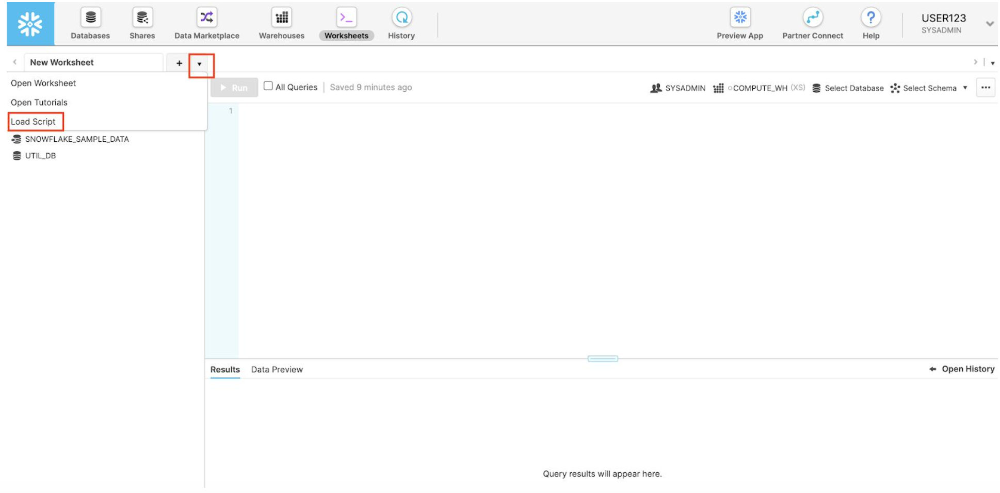
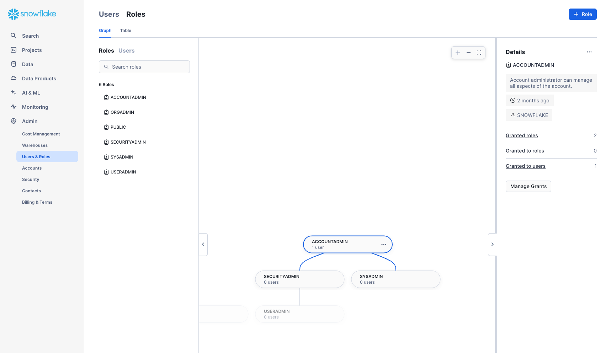
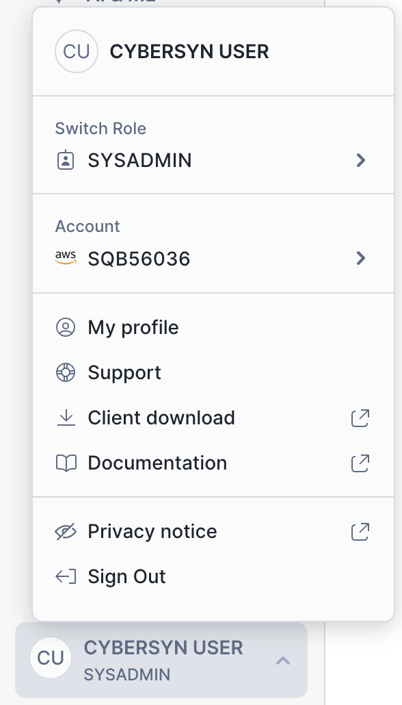

summary: This is a broad introduction of Snowflake and covers how to login, run queries, and load data.
id: getting_started_with_snowflake
categories: featured,getting-started
environments: web
status: Published
feedback link: https://github.com/Snowflake-Labs/sfguides/issues
tags: Getting Started, Data Science, Data Engineering

# Getting Started with Snowflake - Zero to Snowflake
<!-- ------------------------ -->

## Overview

Duration: 2

Welcome to Snowflake! This entry-level guide designed for database and data warehouse administrators and architects will help you navigate the Snowflake interface and introduce you to some of our core capabilities. [Sign up for a free 30-day trial of Snowflake](https://trial.snowflake.com) and follow along with this lab exercise. Once we cover the basics, you'll be ready to start processing your own data and diving into Snowflake's more advanced features like a pro.

### Free Virtual Hands-on Lab

This Snowflake Guide is available as a free, instructor-led Virtual Hands on Lab. [Sign up for the VHOL today](https://www.snowflake.com/virtual-hands-on-lab/).

### Prerequisites:

- Use of the [Snowflake free 30-day trial environment](https://trial.snowflake.com)
- Basic knowledge of SQL, database concepts, and objects
- Familiarity with CSV comma-delimited files and JSON semi-structured data

### What You'll Learn:

- How to create stages, databases, tables, views, and virtual warehouses.
- How to load structured and semi-structured data.
- How to consume Cybersyn data from the Snowflake Data Marketplace.
- How to perform analytical queries on data in Snowflake, including joins between tables.
- How to clone objects.
- How to undo user errors using Time Travel.
- How to create roles and users, and grant them privileges.
- How to securely and easily share data with other accounts.

### Data You'll Use:
<!-- Meghan to provide Cybersyn data overview -->

<!-- ------------------------ -->

## Prepare Your Lab Environment

Duration: 2

If you haven't already, register for a [Snowflake free 30-day trial](https://signup.snowflake.com/developers). The rest of the sections in this lab assume you are using a new Snowflake account created by registering for a trial.

The Snowflake edition (Standard, Enterprise, Business Critical, etc.), cloud provider (AWS, Azure, GCP), and Region (US East, EU, etc.) you use for this lab, do not matter. However, we suggest you select the region that is physically closest to you and Enterprise, our most popular offering, as your Snowflake edition.

After registering, you will receive an email with an activation link and URL for accessing your Snowflake account.

### Logging into the Snowflake User Interface (UI)

Open a browser window and enter the URL of your Snowflake 30-day trial environment that was sent with your registration email.

You should see the following login dialog​. Enter the username and password that you specified during the registration:

<!-- ------------------------ -->

## The Snowflake ​User Interface

Duration: 8

> aside negative
> 
>  **About the screenshots, sample code, and environment**
Screenshots in this lab depict examples; results may vary slightly from what you see when you complete the exercises.

### Navigating the Snowflake UI

Let's get you acquainted with Snowflake! This section covers the basic components of the user interface. We will move from top to bottom on the left-hand side margin.

#### Worksheets

The ​**Worksheets​** tab provides an interface for submitting SQL queries, performing DDL and DML operations, and viewing results as your queries or operations complete. A new worksheet is created by clicking **+ Worksheet** on the top right.

The top left corner contains the following:

- **Home** icon: Use this to get back to the main console/close the worksheet.
- **Worksheet_name** drop-down: The default name is the timestamp when the worksheet was created. Click the timestamp to edit the worksheet name. The drop-down also displays additional actions you can perform for the worksheet.
- **Manage filters** button: Custom filters are special keywords that resolve as a subquery or list of values.

The top right corner contains the following:

- **Context** box: This lets Snowflake know which role and warehouse to use during this session. It can be changed via the UI or SQL commands.
- **Share** button: Open the sharing menu to share to other users or copy the link to the worksheet.
- **Play/Run** button: Run the SQL statement where the cursor currently is or multiple selected statements.

The middle pane contains the following:

- Drop-down at the top for setting the database/schema/object context for the worksheet.
- General working area where you enter and execute queries and other SQL statements. 

The middle-left panel contains the following:
- **Worksheets** tab: Use this tab to quickly select and jump between different worksheets
- **Databases** tab: Use this tab to view all of the database objects available to the current role
- **Search** bar: database objects browser which enables you to explore all databases, schemas, tables, and views accessible by the role currently in use for the worksheet. 

The bottom pane displays the results of queries and other operations. Also includes 4 options (**Object**, **Query**, **Result**, **Chart**) that open/close their respective panels on the UI. **Chart** opens a visualization panel for the returned results. More on this later.

The various panes on this page can be resized by adjusting their sliders. If you need more room in the worksheet, collapse the database objects browser in the left panel. Many of the screenshots in this guide keep this panel closed.

> aside negative
> 
>  **Worksheets vs the UI**
Most of the exercises in this lab are executed using pre-written SQL within this worksheet to save time. These tasks can also be done via the UI, but would require navigating back-and-forth between multiple UI tabs.

#### Dashboards

The **Dashboards** tab allows you to create flexible displays of one or more charts (in the form of tiles, which can be rearranged). Tiles and widgets are produced by executing SQL queries that return results in a worksheet. Dashboards work at a variety of sizes with minimal configuration.

#### Databases

Under **Data**, the **Databases**​ tab shows information about the databases you have created or have permission to access. You can create, clone, drop, or transfer ownership of databases, as well as load data in the UI. Notice that a database already exists in your environment. However, we will not be using it in this lab.

#### Private Shared Data

Also under **Data**, the **Private Shared Data** tab is where data sharing can be configured to easily and securely share Snowflake tables among separate Snowflake accounts or external users, without having to create a copy of the data. We will cover data sharing in Section 10.

#### Marketplace

<!-- victoria ^ -->

The **Marketplace** tab is where any Snowflake customer can browse and consume data sets made available by providers. There are two types of shared data: Public and Personalized. Public data is free data sets available for querying instantaneously. Personalized data requires reaching out to the provider of data for approval of sharing data.
<!-- victoria - get content from Meghan -->

#### Query History

Under **Activity** there are two tabs **Query History** and **Copy History**:

- **Query History** is where previous queries are shown, along with filters that can be used to hone results (user, warehouse, status, query tag, etc.). View the details of all queries executed in the last 14 days from your Snowflake account. Click a query ID to drill into it for more information.
- **Copy History** shows the status of copy commands run to ingest data into Snowflake.

#### Warehouses

Under **Admin**, the **​Warehouses​** tab is where you set up and manage compute resources known as virtual warehouses to load or query data in Snowflake. A warehouse called COMPUTE_WH already exists in your environment.

#### Resource Monitors

Under **Admin**, the **Resource Monitors** tab shows all the resource monitors that have been created to control the number of credits that virtual warehouses consume. For each resource monitor, it shows the credit quota, type of monitoring, schedule, and actions performed when the virtual warehouse reaches its credit limit.

#### Roles

Under **Admin**, the **Roles** sub-tab of the **Users and Roles** tab shows a list of the roles and their hierarchies. Roles can be created, reorganized, and granted to users in this tab. The roles can also be displayed in tabular/list format by selecting the **Table** sub-tab.

#### Users

Also under **Admin** tab, the **Users** sub-tab of the **Users and Roles** tab shows a list of users in the account, default roles, and owner of the users. For a new account, no records are shown because no additional roles have been created. Permissions granted through your current role determine the information shown for this tab. To see all the information available on the tab, switch your role to ACCOUNTADMIN.

Clicking on your username in the top right of the UI allows you to change your password, roles, and preferences. Snowflake has several system defined roles. You are currently in the default role of `SYSADMIN` and will stay in this role for the majority of the lab.

> aside negative
> 
>  **SYSADMIN**
The `SYSADMIN` (aka System Administrator) role has privileges to create warehouses, databases, and other objects in an account.
In a real-world environment, you would use different roles for the tasks in this lab, and assign roles to your users. We will cover more on roles and Snowflake's access control model in Section 9 and you can find additional information in the [Snowflake documentation](https://docs.snowflake.net/manuals/user-guide/security-access-control.html).

<!-- ------------------------ -->

## Data Lab: Preparing Data

Duration: 14
<!-- dash to advise on changed durations from rework? -->

### The Lab Story
You are a university researcher that wants to study stock performance of major consumer goods (CPG) companies in the US. This lab combines Nasdaq's daily stock price data with SEC company filings to understand how stocks react to certain reports.

We will start by collecting data from three different sources:
1. Load company metadata `.csv` file.
2. Load SEC filings, which are in a semi-structured JSON format.
3. Use the Snowflake Marketplace to find free stock price data from Cybersyn.

### Loading Data into Snowflake
Let's start by preparing to load structured `.csv` data into Snowflake.

The data we are using is company metadata provided by Cybersyn. The data has been exported and pre-staged for you in an Amazon AWS S3 bucket in the US-EAST region. The data details the consumer goods companies we are evaluating 
<!-- trip times, locations, user type, gender, age, etc. On AWS S3, the data represents 61.5M rows, 377 objects, and 1.9GB compressed. victoria --> 
. _(The full dataset is available for free [here](https://app.snowflake.com/marketplace/listing/GZTSZAS2KF7).)_

> aside negative
> 
>  **Getting Data into Snowflake**
There are many ways to get data into Snowflake from many locations including the COPY command, Snowpipe auto-ingestion, external connectors, or third-party ETL/ELT solutions. For more information on getting data into Snowflake, see the [Snowflake documentation](https://docs.snowflake.net/manuals/user-guide-data-load.html).
For the purposes of this lab, we use the COPY command and AWS S3 storage to load data manually. In a real-world scenario, you would more likely use an automated process or ETL solution.

Below is a snippet from consumer goods CSV data files:
<!-- victoria -->

It is in comma-delimited format with a single header line and double quotes enclosing all string values, including the field headings in the header line. This will come into play later in this section as we configure the Snowflake table to store this data.

<!-- ------------------------ -->

## Conclusion & Next Steps

Duration: 2

Congratulations on completing this introductory lab exercise! You've mastered the Snowflake basics and are ready to apply these fundamentals to your own data. Be sure to reference this guide if you ever need a refresher.

We encourage you to continue with your free trial by loading your own sample or production data and by using some of the more advanced capabilities of Snowflake not covered in this lab.

### Additional Resources:

- Learn more about the [Snowsight](https://docs.snowflake.com/en/user-guide/ui-snowsight.html#using-snowsight) docs.
- Read the [Definitive Guide to Maximizing Your Free Trial](https://www.snowflake.com/test-driving-snowflake-the-definitive-guide-to-maximizing-your-free-trial/) document.
- Attend a [Snowflake virtual or in-person event](https://www.snowflake.com/about/events/) to learn more about our capabilities and customers.
- Join the [Snowflake Community](https://community.snowflake.com/s/topic/0TO0Z000000wmFQWAY/getting-started-with-snowflake).
- Sign up for [Snowflake University](https://community.snowflake.com/s/article/Getting-Access-to-Snowflake-University).
- Contact our [Sales Team](https://www.snowflake.com/free-trial-contact-sales/) to learn more.
- [Cybersyn data on the Snowflake Marketplace](https://app.snowflake.com/marketplace/listings/Cybersyn%2C%20Inc)
- [Cybersyn Data Catalog](https://app.cybersyn.com/data_catalog/?utm_source=Snowflake+Quickstart&utm_medium=organic&utm_campaign=Snowflake+Quickstart)

### What we've covered:

- How to create stages, databases, tables, views, and virtual warehouses.
- How to load structured and semi-structured data.
- How to consume Cybersyn data from the Snowflake Data Marketplace.
- How to perform analytical queries on data in Snowflake, including joins between tables.
- How to clone objects.
- How to undo user errors using Time Travel.
- How to create roles and users, and grant them privileges.
- How to securely and easily share data with other accounts.