id: getting_started_with_snowflake_and_aws_kdf
summary: This guide will walk you through how to apply a data-intensive approach to real-time data using Snowpipe Streaming and Amazon Data Firehose (ADF).
categories: getting-started
environments: web
status: Published
feedback link: https://github.com/Snowflake-Labs/sfguides/issues
tags: Getting Started, Amazon Data Firehose, Streaming, Snowpipe Streaming, SnowSQL
authors: James Sun

# Getting Started with Snowflake and [Amazon Data Firehose](https://aws.amazon.com/firehose/) (ADF)
<!---------------------------->
## Overview
Duration: 5

Snowflake's Snowpipe streaming capabilities are designed for rowsets with variable arrival frequency.
It focuses on lower latency and cost for smaller data sets. This helps data workers stream rows into Snowflake
without requiring files with a more attractive cost/latency profile.

Here are some of the use cases that can benefit from this integration:
- IoT time-series data ingestion
- CDC streams from OLTP systems 
- Log ingestion from SIEM systems
- Ingestion into ML feature stores 

In our demo, we will use real-time commercial flight data over the San Francisco Bay Area from the [Opensky Network](https://opensky-network.org) to illustrate the solution leveraging
the [native integration](https://aws.amazon.com/about-aws/whats-new/2024/01/stream-data-snowflake-kinesis-data-firehose-snowpipe-streaming-preview/) between Snowflake and [ADF (Amazon Data Firehose)](https://aws.amazon.com/firehose/).

The architecture diagram below shows the deployment. A Linux 
EC2 instance (jumphost) will be provisioned in the subnet of an AWS VPC. 
The Linux jumphost will host the data producer that ingests real-time flight data into the Firehose delivery stream.

The data producer calls the data sources' REST API and receives time-series data in JSON format. This data is then ingested into the Firehose delivery stream and delivered to a Snowflake table.
The data in Snowflake table can be visualized in real-time with [AMG (Amazon Managed Grafana)](https://aws.amazon.com/grafana/) and [Streamlit](https://streamlit.io)
The historical data can also be analyzed by BI tools like [Amazon Quicksight](https://aws.amazon.com/quicksight/?trk=56601b48-df3f-4cb4-9ef7-9f52efa1d0b8&sc_channel=ps&ef_id=Cj0KCQiA_bieBhDSARIsADU4zLebWWM6ZmxRODjR9Xlc7ztNm5JGwqEMSi0EjCLZ9CXYa1YvXL3LMYYaAnV_EALw_wcB:G:s&s_kwcid=AL!4422!3!629393324770!!!g!!).
Please note that in the demo, we are not demonstrating the visualization aspect. We will have a future Quickstart demo that focuses on visualization.

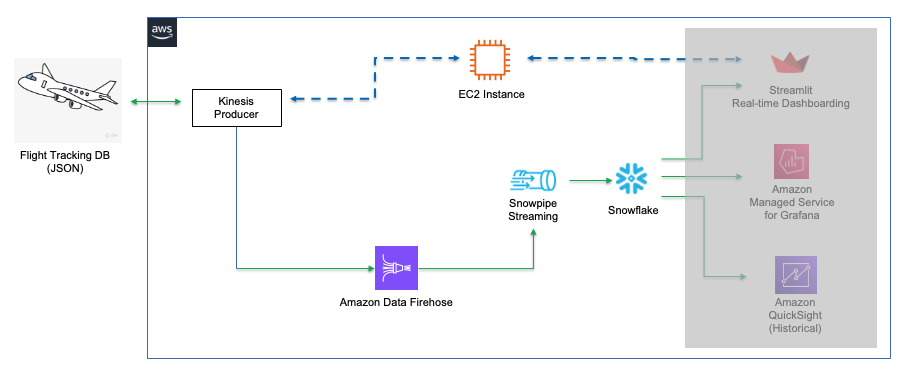

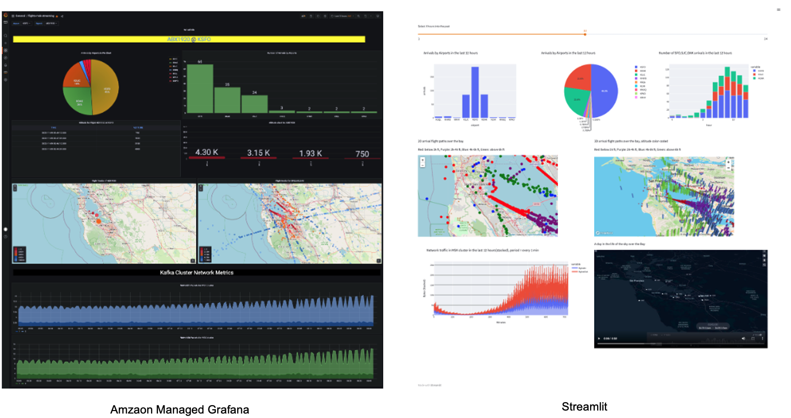

### Prerequisites

- Familiarity with Snowflake, basic SQL knowledge, Snowsight UI and Snowflake objects
- Familiarity with AWS Services (e.g. EC2, ADF, etc), Networking and the Management Console
- Basic knowledge of Python and Linux shell scripting

### What You'll Need Before the Lab

To participate in the virtual hands-on lab, attendees need the following resources.

- A [Snowflake Enterprise Account on preferred AWS region](https://signup.snowflake.com/) with `ACCOUNTADMIN` access
- An [AWS Account](https://aws.amazon.com/premiumsupport/knowledge-center/create-and-activate-aws-account/) with `Administrator Access`
- Create your own VPC and subnets (This is optional if you have an existing VPC with subnets you can leverage.
  - In the AWS account, [create a VPC](https://docs.aws.amazon.com/vpc/latest/userguide/working-with-vpcs.html), preferably in the same region as the Snowflake account
  - In the VPC, [create subnets](https://docs.aws.amazon.com/vpc/latest/userguide/working-with-subnets.html) and attach an [internet gateway](https://docs.aws.amazon.com/vpc/latest/userguide/VPC_Internet_Gateway.html) to allow egress traffic to the internet by using a routing table and security group for outbound traffic.
  Note that the subnets can be public or private, for private subnets, you will need to attach a [NAT gateway](https://docs.aws.amazon.com/vpc/latest/userguide/vpc-nat-gateway.html) to allow egress traffic to the internet. Public subnets are sufficient for this lab.
  - If you have decided to create your own VPC/subnets, for your convenience, click [here](https://console.aws.amazon.com/cloudformation/home?region=us-west-2#/stacks/new?stackName=MSK-Snowflake-VPC&templateURL=https://snowflake-corp-se-workshop.s3.us-west-1.amazonaws.com/VHOL_Snowflake_Snowpipe_Streaming_MSK/MyFullVPC-2pub-2priv.json) to deploy a VPC with a pair of public and private subnets, internet gateway and NAT gateway for you. 
Note that you must have network administrator permissions to deploy these resources. 

### What You'll Learn

- Using [ADF (Amazon Data Firehose)](https://aws.amazon.com/firehose/)
- Connecting to EC2 instances with [Amazon System Session Manager](https://docs.aws.amazon.com/systems-manager/latest/userguide/session-manager.html), this is an alternative
to SSH if your instance is in a private subnet
- Using [SnowSQL](https://docs.snowflake.com/en/user-guide/snowsql.html), the command line client for connecting to Snowflake to execute SQL queries and perform all DDL and DML operations, including loading data into and unloading data out of database tables.
- Using Snowflake to query tables populated with time-series data

### What You'll Build

- Create an [ADF delivery stream](https://docs.aws.amazon.com/firehose/latest/dev/basic-create.html)
- Setup `Direct Put` as the source for the ADF delivery stream
- Setup `Snowflake` as the destination for the ADF delivery stream
- Secure the connection between Snowflake and ADF with [Privatelink](https://aws.amazon.com/privatelink)
- A Snowflake database and table for hosting real-time flight data

<!---------------------------->
## Provision a Linux jumphost in AWS
Duration: 10

#### 1. Create an EC2 instance
First, click [here](https://console.aws.amazon.com/cloudformation/home?region=us-west-2#/stacks/new?stackName=ADF-Snowflake&templateURL=https://snowflake-corp-se-workshop.s3.us-west-1.amazonaws.com/VHOL_Snowflake_KDF/kdf-bastion.json)
to launch an EC2 instance(jumphost). Note the default AWS region is `us-west-2 (Oregon)`, at the time of writing this quickstart, three regions are available
for this integration preview: `us-east-1`, `us-west-2`, and `eu-west-1`.

For `Subnet1`, in the drop-down menu, pick an existing subnet, it can be either public or private subnets depending on the network layout of your VPC. 

For `InstanceSecurityGroupId`, we recommend using the default security group in your VPC, if you do not have the default security group, create one on your own before moving forward.

Click Next at the Create stack page. Set the Stack name or modify the default value to customize it to your identity.

See below sample screen capture for reference.

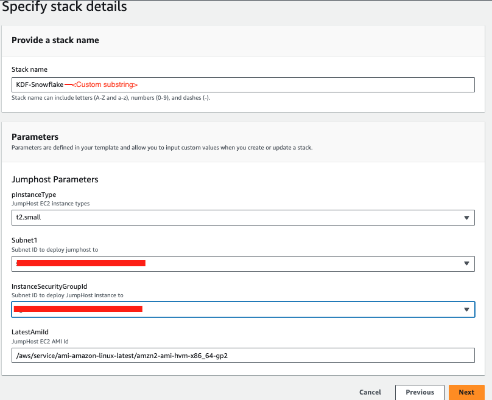

Leave everything as default in the `Configure stack options` page and click `Next`.
In the `Review` page, click `Submit`.

In about 5 minutes, the Cloudformation template provisions a Linux EC2 instance in the subnet you selected. We will then use it to run the ADF producer for data ingestion.

#### 2. Configure the Linux session for timeout and default shell

In this step we need to connect to the EC2 instance in order to ingest the real-time data.

Go to the AWS [Systems Manager](https://us-west-2.console.aws.amazon.com/systems-manager/home) console in the same region where you setup the EC2 instance,
Click `Session Manager` on the left pane.


Next, we will set the preferred shell as bash.

Click the `Preferences` tab.
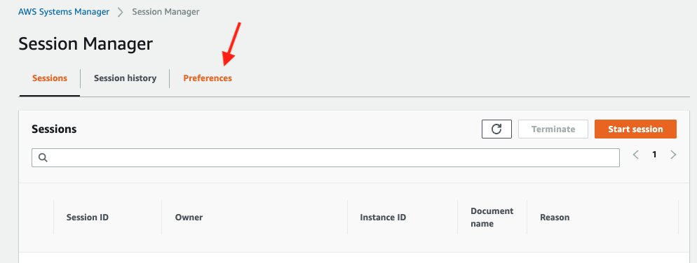

Click the `Edit` button.


Go to `General preferences` section, type in 60 minutes for idle session timeout value.

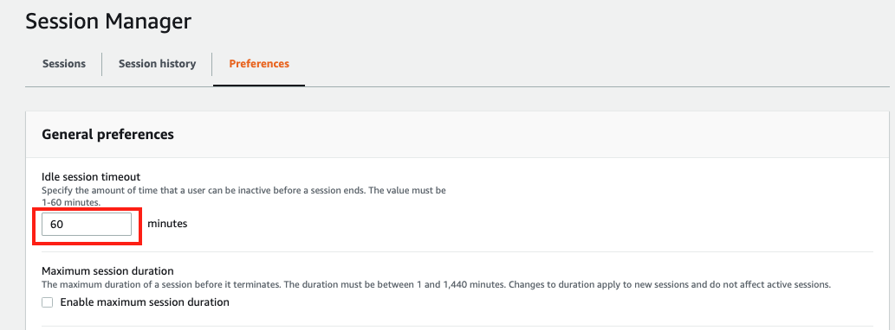

Further scroll down to `Linux shell profile` section, and type in `/bin/bash` before clicking `Save` button.

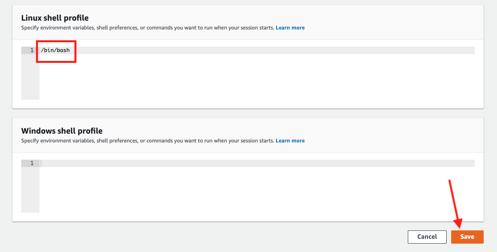


#### 3. Connect to the Linux EC2 instance console
Now go back to the `Session` tab and click the `Start session` button.
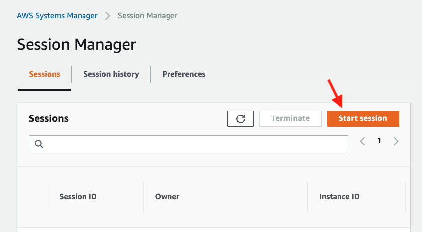

Now you should see the EC2 instance created by the Cloudformation template under `Target instances`.
Its name should be `<Cloudformation stack name>-jumphost`, select it and click `Start session`.


#### 4. Create a key-pair to be used for authenticating with Snowflake
Create a key pair in AWS Session Manager console by executing the following commands. You will be prompted to give an encryption password, remember 
this phrase, you will need it later.

```commandline
cd $HOME
openssl genrsa 2048 | openssl pkcs8 -topk8 -inform PEM -out rsa_key.p8
```
See below example screenshot:


Next we will create a public key by running following commands. You will be prompted to type in the phrase you used in above step.
```
openssl rsa -in rsa_key.p8 -pubout -out rsa_key.pub
```
see below example screenshot:


Next we will print out the public and private key string in a correct format that we can use for configuration later.
```
grep -v KEY rsa_key.pub | tr -d '\n' | awk '{print $1}' > pub.Key
cat pub.Key

grep -v KEY rsa_key.p8 | tr -d '\n' | awk '{print $1}' > priv.Key
cat priv.Key
```
see below example screenshot:

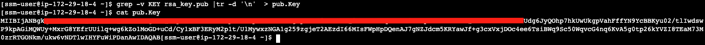

<!---------------------------->
## Prepare the Snowflake cluster for streaming
Duration: 15

#### 1. Creating user, role, and database
First login to your Snowflake account as a power user with ACCOUNTADMIN role. 
Then run the following SQL commands in a worksheet to create a user, database and the role that we will use in the lab.

```
-- Set default value for multiple variables
-- For purpose of this workshop, it is recommended to use these defaults during the exercise to avoid errors
-- You should change them after the workshop
SET PWD = 'Test1234567';
SET USER = 'STREAMING_USER';
SET DB = 'ADF_STREAMING_DB';
SET WH = 'ADF_STREAMING_WH';
SET ROLE = 'ADF_STREAMING_RL';

USE ROLE ACCOUNTADMIN;

-- CREATE USERS
CREATE USER IF NOT EXISTS IDENTIFIER($USER) PASSWORD=$PWD  COMMENT='STREAMING USER';

-- CREATE ROLES
CREATE OR REPLACE ROLE IDENTIFIER($ROLE);

-- CREATE DATABASE AND WAREHOUSE
CREATE DATABASE IF NOT EXISTS IDENTIFIER($DB);
USE IDENTIFIER($DB);
CREATE OR REPLACE WAREHOUSE IDENTIFIER($WH) WITH WAREHOUSE_SIZE = 'SMALL';

-- GRANTS
GRANT CREATE WAREHOUSE ON ACCOUNT TO ROLE IDENTIFIER($ROLE);
GRANT ROLE IDENTIFIER($ROLE) TO USER IDENTIFIER($USER);
GRANT OWNERSHIP ON DATABASE IDENTIFIER($DB) TO ROLE IDENTIFIER($ROLE);
GRANT USAGE ON WAREHOUSE IDENTIFIER($WH) TO ROLE IDENTIFIER($ROLE);

-- SET DEFAULTS
ALTER USER IDENTIFIER($USER) SET DEFAULT_ROLE=$ROLE;
ALTER USER IDENTIFIER($USER) SET DEFAULT_WAREHOUSE=$WH;

-- RUN FOLLOWING COMMANDS TO FIND YOUR ACCOUNT IDENTIFIER, COPY IT DOWN FOR USE LATER
-- IT WILL BE SOMETHING LIKE <organization_name>-<account_name>
-- e.g. ykmxgak-wyb52636

WITH HOSTLIST AS 
(SELECT * FROM TABLE(FLATTEN(INPUT => PARSE_JSON(SYSTEM$allowlist()))))
SELECT REPLACE(VALUE:host,'.snowflakecomputing.com','') AS ACCOUNT_IDENTIFIER
FROM HOSTLIST
WHERE VALUE:type = 'SNOWFLAKE_DEPLOYMENT_REGIONLESS';
```

Please write down the Account Identifier, we will need it later.
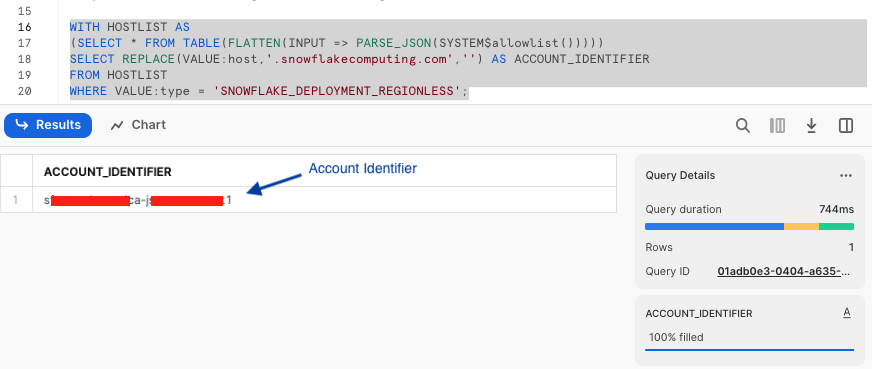

Next we need to configure the public key for the streaming user to access Snowflake programmatically.

First, in the Snowflake worksheet, replace `<pubKey>` with the content of the file `/home/ssm-user/pub.Key` (see `step 4` by clicking on `section #2 Create a provisioned Kafka cluster and a Linux jumphost in AWS` in the left pane) in the following SQL command and execute.
```commandline
use role accountadmin;
alter user streaming_user set rsa_public_key='<pubKey>';
```
See below example screenshot:

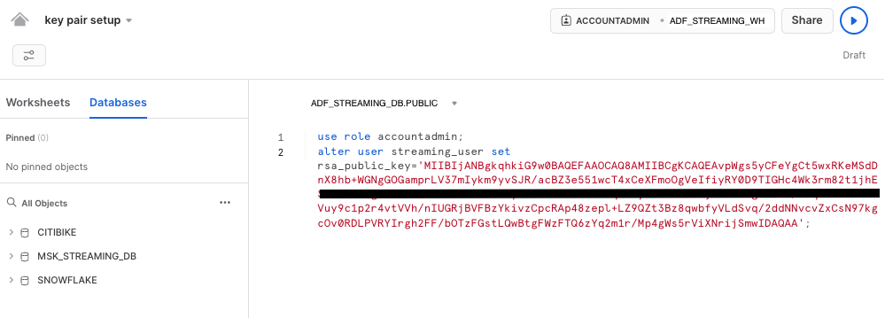

Now logout of Snowflake, sign back in as the default user `streaming_user` we just created with the associated password (default: Test1234567).
Run the following SQL commands in a worksheet to create a schema (e.g. `ADF_STREAMING_SCHEMA`) in the default database (e.g. `ADF_STREAMING_DB`):

```commandline
SET DB = 'ADF_STREAMING_DB';
SET SCHEMA = 'ADF_STREAMING_SCHEMA';

USE IDENTIFIER($DB);
CREATE OR REPLACE SCHEMA IDENTIFIER($SCHEMA);
```

#### 2. Install SnowSQL (optional but highly recommended)

[SnowSQL](https://docs.snowflake.com/en/user-guide/snowsql.html) is the command line client for connecting to Snowflake to execute SQL queries and perform all DDL and DML operations, including loading data into and unloading data out of database tables.

To install SnowSQL. Execute the following commands on the Linux Session Manager console:
```commandline
curl https://sfc-repo.snowflakecomputing.com/snowsql/bootstrap/1.2/linux_x86_64/snowsql-1.2.24-linux_x86_64.bash -o /tmp/snowsql-1.2.24-linux_x86_64.bash
echo -e "~/bin \n y" > /tmp/ans
bash /tmp/snowsql-1.2.24-linux_x86_64.bash < /tmp/ans

```
See below example screenshot:

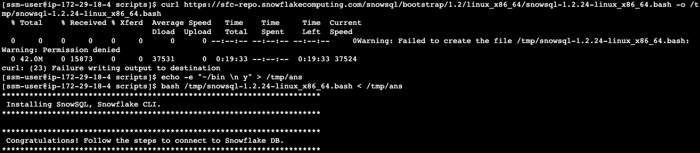

Next set the environment variable for Snowflake Private Key Phrase:
```commandline
export SNOWSQL_PRIVATE_KEY_PASSPHRASE=<key phrase you set up when running openssl previously>
```
Note that you should add the command above in the ~/.bashrc file to preserve this environment variable across sessions.
```commandline
echo "export SNOWSQL_PRIVATE_KEY_PASSPHRASE=$SNOWSQL_PRIVATE_KEY_PASSPHRASE" >> ~/.bashrc
```

Now you can execute this command to interact with Snowflake:
```commandline
$HOME/bin/snowsql -a <The Account Identifier that you recorded earlier> -u streaming_user --private-key-path $HOME/rsa_key.p8 -d adf_streaming_db -s adf_streaming_schema
```
See below example screenshot:

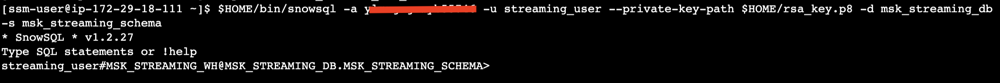

Type `Ctrl-D` to get out of SnowSQL session.

You can edit the [`~/.snowsql/config`](https://docs.snowflake.com/en/user-guide/snowsql-config.html#snowsql-config-file) file to set default parameters and eliminate the need to specify them every time you run snowsql.

At this point, the Snowflake setup is complete.

<!---------------------------->
## Create an ADF delivery stream
Duration: 15

In this step, we are going to create an ADF delivery stream for data streaming.

Navigate to the [ADF console](https://console.aws.amazon.com/firehose/home?streams) and click `Create delivery stream`.

In the `Source` section, select `Direct PUT` from the drop-down menu.

In the `Destination` section, select `Snowflake` from the drop-down menu.

Type in a name for the delivery stream.

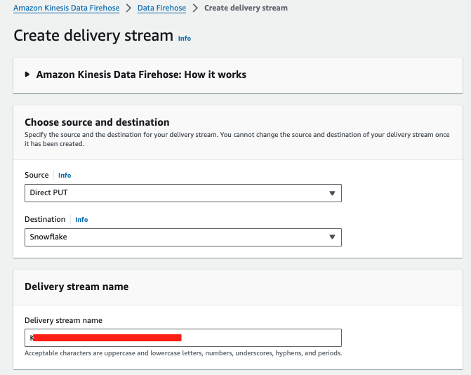

For `Snowflake account URL`, run this SQL command in your Snowflake account to obtain the value:
```
with PL as
(SELECT * FROM TABLE(FLATTEN(INPUT => PARSE_JSON(SYSTEM$GET_PRIVATELINK_CONFIG()))) where key = 'privatelink-account-url')
SELECT concat('https://'|| REPLACE(VALUE,'"','')) AS PRIVATE_LINK_VPCE_ID
from PL;
```

e.g. `https://xyz12345.us-west-2.privatelink.snowflakecomputing.com`

Note here we are going to use Amazon PrivateLink to secure the communication between Snowflake and ADF, so the
URL is a private endpoint with `privatelink` as a substring. Alternatively, you can use the public endpoint without 
the `privatelink` substring, e.g. `https://xyz12345.us-west-2.snowflakecomputing.com`, if this is the case, leave the `VPCE ID` field blank below.

For `User`, type in `STREAMING_USER`.

For `Private key`, go back to your EC2 console in Systems Manager and run
```commandline
cat ~/priv.key
```
Copy the output string and paste into the `Private key` field.

For `Passphrase`, type in the phrase you used when generating the public key with openssl earlier.

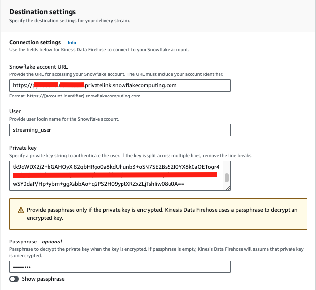

For `Role`, select `Use custom Snowflake role` and type in `ADF_STREAMING_RL`.

For `VPCE ID`, run the following SQL command in your Snowflake account to obtain the value.
```commandline
with PL as
(SELECT * FROM TABLE(FLATTEN(INPUT => PARSE_JSON(SYSTEM$GET_PRIVATELINK_CONFIG()))) where key = 'privatelink-vpce-id')
SELECT REPLACE(VALUE,'"','') AS PRIVATE_LINK_VPCE_ID
from PL;
```

For `Snowflake database`, type in `ADF_STREAMING_DB`.

For `Snowflake Schema`, type in `ADF_STREAMING_SCHEMA`.

For `Snowflake table`, type in `ADF_STREAMING_TBL`.

For `Data loading options for your Snowflake table`, select `Use JSON keys as table column names`.

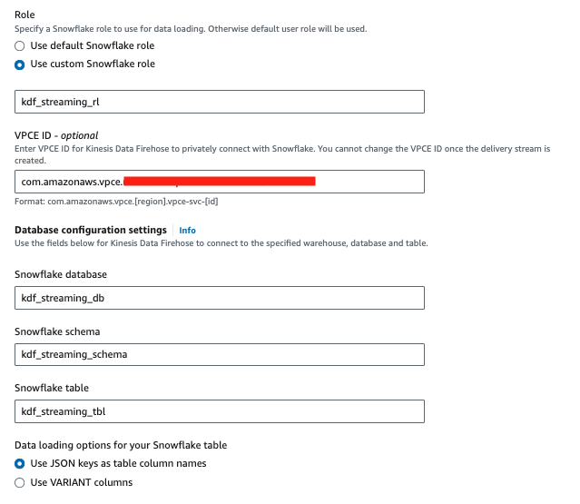

For `S3 backup bucket`, pick an existing S3 bucket where you want to save the logs or error messages. [Create a S3 bucket](https://docs.aws.amazon.com/AmazonS3/latest/userguide/create-bucket-overview.html) if you don't have one.

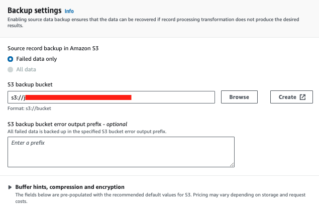

Leave everything else as default and click `Create delivery stream`.

Your delivery stream will be generated in about 5 minutes.

<!---------------------------->
## Ingest and Query data in Snowflake
Duration: 10

Now, switch back to the Snowflake console and make sure that you signed in as the default user `streaming_user`. 
The data should have been streamed into a table, ready for further processing.

#### 1. Create a destination table in Snowflake

Run the following SQL command to create the table `ADF_STREAMING_TBL` we specified when provisioning
the delivery stream. Note that here we use varchar type for most of the columns, we will
generate a view later to transform them into the correct types.

```commandline
use ADF_STREAMING_DB;
use schema ADF_STREAMING_SCHEMA;
create or replace TABLE ADF_STREAMING_TBL (
	ORIG VARCHAR(20),
	UTC NUMBER(38,0),
	ALT VARCHAR(20),
	ICAO VARCHAR(20),
	LON VARCHAR(20),
	ID VARCHAR(20),
	DEST VARCHAR(20),
	LAT VARCHAR(20)
);
```
#### 2. Ingest real-time data 

Go to the EC2 console, and run the following command.
```commandline
python3 /tmp/adf-producer.py <ADF delivery stream name>
```
The Python script gets the raw flight data from a [real-time source](http://ecs-alb-1504531980.us-west-2.elb.amazonaws.com:8502/opensky) and streams into the delivery stream.
You should see the flight data being ingested continuously to the ADF delivery stream in json format.

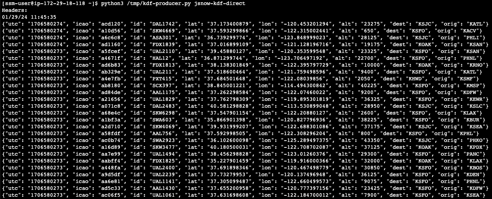

#### 3. Query the raw data in Snowflake
To verify that data has been streamed into Snowflake, execute the following SQL commands.

Now run the following query on the table.
```
select * from adf_streaming_tbl;
```

Here is the screen capture of the sample output.

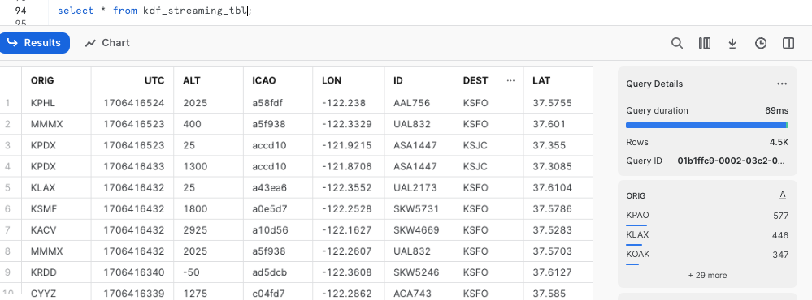


#### 2. Convert the raw data table into a view with correct data types
Now execute the following SQL command.

```commandline
create or replace view flights_vw
  as select
    utc::timestamp_ntz ts_utc,
    CONVERT_TIMEZONE('UTC','America/Los_Angeles',ts_utc::timestamp_ntz) as ts_pt,
    alt::integer alt,
    dest::string dest,
    orig::string orig,
    id::string id,
    icao::string icao,
    lat::float lat,
    lon::float lon,
    st_geohash(to_geography(ST_MAKEPOINT(lon, lat)),12) geohash,
    year(ts_pt) yr,
    month(ts_pt) mo,
    day(ts_pt) dd,
    hour(ts_pt) hr
FROM adf_streaming_tbl;
```

The SQL command creates a view, convert timestamps to different time zones, and use Snowflake's [Geohash function](https://docs.snowflake.com/en/sql-reference/functions/st_geohash.html)  to generate geohashes that can be used in time-series visualization tools such as Grafana.

Let's query the view `flights_vw` now.
```commandline
select * from flights_vw;
```

As a result, you will see a nicely structured output with columns derived from the JSONs at the [source](http://ecs-alb-1504531980.us-west-2.elb.amazonaws.com:8502/opensky).
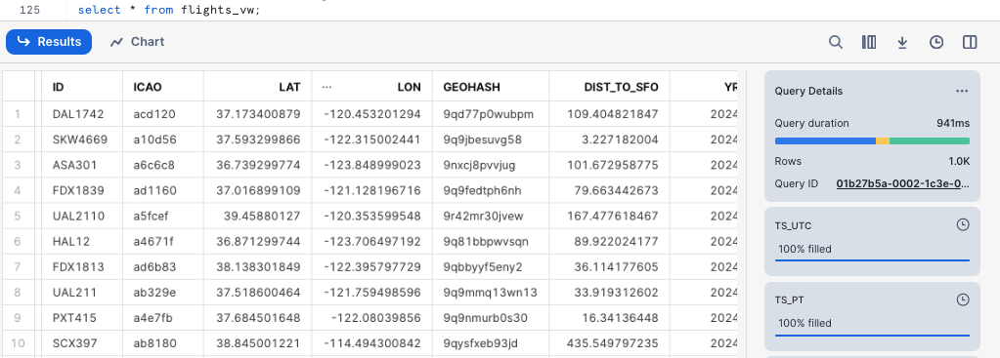

<!---------------------------->
## Conclusions
Duration: 5

In this lab, we built a demo to show how to ingest real-time data using Amazon Data Firehose with low latency. We demonstrated this using an ADF
connector on an EC2 instance. Alternatively, if you have infrastructure supported by either [Amazon EKS](https://aws.amazon.com/eks/) or
[Amazon ECS](https://aws.amazon.com/ecs/), you can use them to host your containerized ADF producers as well.

For those of you who are interested in learning more about how to build sleek dashboards for monitoring the live flight data, please navigate to this
[quickstart](https://quickstarts.snowflake.com/guide/getting_started_with_amg_and_streamlit_on_real-time_dashboarding/) to continue.

Related Resources

- [Unleashing the Full Potential of Real-Time Streaming with Amazon Kinesis Data Firehose and Snowpipe Streaming](https://medium.com/snowflake/unleashing-the-full-potential-of-real-time-streaming-with-amazon-kinesis-data-firehose-and-snowpipe-0283fb599364#Snowflake)
- [Amazon Data Firehose (ADF)](https://aws.amazon.com/firehose/)
- [Snowpipe Streaming Demystified](https://medium.com/snowflake/snowpipe-streaming-demystified-e1ee385c6d9c)
- [Getting Started with Amazon Managed Service for Grafana and Streamlit On Real-time Dashboarding](https://quickstarts.snowflake.com/guide/getting_started_with_amg_and_streamlit_on_real-time_dashboarding/)
- [Getting started with Snowflake](https://quickstarts.snowflake.com/)
- [Snowflake on AWS Marketplace](https://aws.amazon.com/marketplace/seller-profile?id=18d60ae8-2c99-4881-a31a-e74770d70347)
- [Snowflake for Data Sharing](https://www.snowflake.com/Workloads/data-sharing/)
- [Snowflake Marketplace](https://www.snowflake.com/en/data-cloud/marketplace/)


