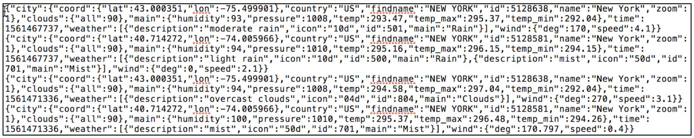
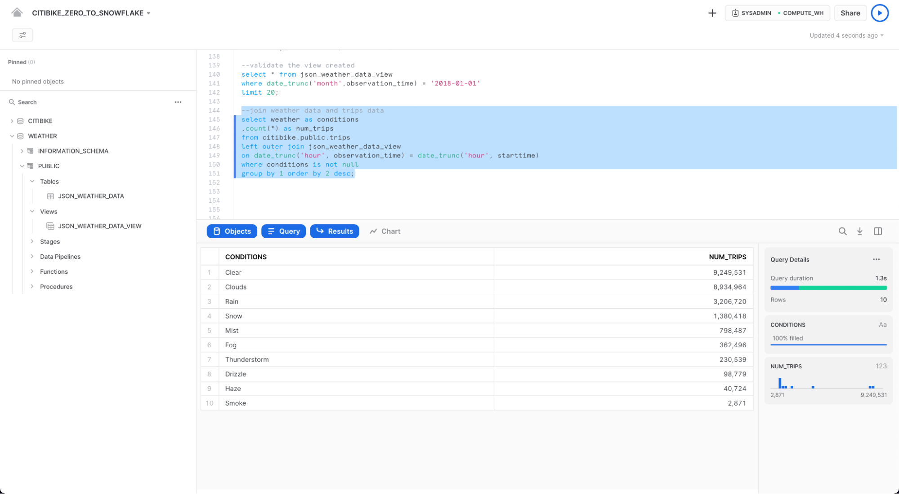

summary: This is a broad introduction of Snowflake and covers how to login, run queries, and load data.
id: getting_started_with_snowflake
categories: Getting Started
environments: web
status: Published
feedback link: https://github.com/Snowflake-Labs/sfguides/issues
tags: Getting Started, Data Science, Data Engineering


# Getting Started with Snowflake - Zero to Snowflake


<!-- ------------------------ -->

## Overview

Duration: 2

Welcome to Snowflake! This entry-level guide designed for database and data warehouse administrators and architects will help you navigate the Snowflake interface and introduce you to some of our core capabilities. [Sign up for a free 30-day trial of Snowflake](https://trial.snowflake.com) and follow along with this lab exercise. Once we cover the basics, you'll be ready to start processing your own data and diving into Snowflake's more advanced features like a pro.

### Free Virtual Hands-on Lab

This Snowflake Guide is available as a free, instructor-led Virtual Hands on Lab. [Sign up for the VHOL today](https://www.snowflake.com/virtual-hands-on-lab/).

### Prerequisites:

- Use of the [Snowflake free 30-day trial environment](https://trial.snowflake.com)
- Basic knowledge of SQL, database concepts, and objects
- Familiarity with CSV comma-delimited files and JSON semi-structured data

### What You'll Learn:

- How to create stages, databases, tables, views, and virtual warehouses.
- How to load structured and semi-structured data.
- How to perform analytical queries on data in Snowflake, including joins between tables.
- How to clone objects.
- How to undo user errors using Time Travel.
- How to create roles and users, and grant them privileges.
- How to securely and easily share data with other accounts.
- How to consume datasets in the Snowflake Data Marketplace.

<!-- ------------------------ -->

## Prepare Your Lab Environment

Duration: 2

If you haven't already, register for a [Snowflake free 30-day trial](https://trial.snowflake.com). The rest of the sections in this lab assume you are using a new Snowfflake account created by registering for a trial.

The Snowflake edition (Standard, Enterprise, Business Critical, etc.) and cloud provider (AWS, Azure, GCP), and Region (US East, EU, etc.) you use for this lab do not matter. However, we suggest you select the region that is physically closest to you and Enterprise, our most popular offering, as your Snowflake edition.

After registering, you will receive an email with an activation link and URL for accessing your Snowflake account.


<!-- ------------------------ -->

## The Snowflake ​User Interface & Lab Story

Duration: 8

Negative
: **About the screenshots, sample code, and environment**
Screenshots in this lab depict examples and results that may vary slightly from what you see when you complete the exercises.

### Logging into the Snowflake User Interface (UI)

Open a browser window and enter the URL of your Snowflake 30-day trial environment that was sent with your registration email.

You should see the following login dialog​. Enter the username and password that you specified during the registration:


### Navigating the Snowflake UI

Let's get you acquainted with Snowflake! This section covers the basic components of the user interface. We will move from top to bottom on the left-hand side margin.


#### Worksheets


The ​**Worksheets​** tab provides an interface for submitting SQL queries, performing DDL and DML operations, and viewing results as your queries or operations complete. A new worksheet is created by clicking **+ Worksheet** on the top right.


The top left corner contains the following:

- **Home** icon: Use this to get back to the main console/close the worksheet.
- **Worksheet_name** drop-down: The default name is the timestamp when the worksheet was created. Click the timestamp to edit the worksheet name. The drop-down also displays additional actions you can perform for the worksheet.
- **Manage filters** button: Custom filters are special keywords that resolve as a subquery or list of values.

The top right corner contains the following:

- **+** button: This creates a new worksheet.
- **Context** box: This lets Snowflake know which role and warehouse to use during this session. It can be changed via the UI or SQL commands.
- **Share** button: Open the sharing menu to share to other users or copy the link to the worksheet.
- **Play/Run** button: Run the SQL statement where the cursor currently is or multiple selected statements.

The middle pane contains the following:

- Drop-down at the top for setting the database/schema/object context for the worksheet.
- General working area where you enter and execute queries and other SQL statements. 

The middle-left panel contains the database objects browser which enables you to explore all databases, schemas, tables, and views accessible by the role currently in use for the worksheet. 

The bottom pane displays the results of queries and other operations. Also includes 4 options (**Object**, **Query**, **Result**, **Chart**) that open/close their respective panels on the UI. **Chart** opens a visualization panel for the returned results. More on this later.

The various panes on this page can be resized by adjusting their sliders. If you need more room in the worksheet, collapse the database objects browser in the left panel. Many of the screenshots in this guide keep this panel closed.


Negative
: **Worksheets vs the UI**
Most of the exercises in this lab are executed using pre-written SQL within this worksheet to save time. These tasks can also be done via the UI, but would require navigating back-and-forth between multiple UI tabs.


#### Dashboards


The **Dashboards** tab allows you to create flexible displays of one or more charts (in the form of tiles, which can be rearranged). Tiles and widgets are produced by executing SQL queries that return results in a worksheet. Dashboards work at a variety of sizes with minimal configuration.


#### Databases


Under **Data**, the **Databases**​ tab shows information about the databases you have created or have permission to access. You can create, clone, drop, or transfer ownership of databases, as well as load data in the UI. Notice that a database already exists in your environment. However, we will not be using it in this lab.


#### Shared Data


Also under **Data**, the **Shared Data** tab is where data sharing can be configured to easily and securely share Snowflake tables among separate Snowflake accounts or external users, without having to create a copy of the data. We will cover data sharing in Section 10.


#### Marketplace


**Marketplace**, the last tab under **Data**, is where any Snowflake customer can browse and consume data sets made available by providers. There are two types of shared data: Public and Personalized. Public data is free data sets available for querying instantaneously. Personalized data requires reaching out to the provider of data for approval of sharing data.


#### History


Under **Compute**, the **History** tab shows the following:

- **Queries** is where previous queries are shown, along with filters that can be used to hone results (user, warehouse, status, query tag, etc.). View the details of all queries executed in the last 14 days from your Snowflake account. Click a query ID to drill into it for more information.
- **Copies** shows the status of copy commands run to ingest data into Snowflake.


#### Warehouses


Also under **Compute**, the **​Warehouses​** tab is where you set up and manage compute resources known as virtual warehouses to load or query data in Snowflake. A warehouse called COMPUTE_WH (XS) already exists in your environment.


#### Resource Monitors


**Resource Monitors**, the last tab under **Compute**, shows all the resource monitors that have been created to control the number of credits that virtual warehouses consume. For each resource monitor, it shows the credit quota, type of monitoring, schedule, and actions performed when the virtual warehouse reaches its credit limit.


#### Roles


Under **Account**, the **Roles** tab shows a list of the roles and their hierarchies. Roles can be created, reorganized, and granted to users in this tab. The roles can also be displayed in tablular/list format by clicking **Table** at the top of the page.


#### Users


Also under **Account** tab, the **Users** tab shows a list of users in the account, default roles, and owner of the users. For a new account, no records are shown because no additional roles have been created. Permissions granted through your current role determine the information shown for this tab. To see all the information available on the tab, switch your role to ACCOUNTADMIN.


Clicking on your username in the top right of the UI allows you to change your password, roles, and preferences. Snowflake has several system defined roles. You are currently in the default role of `SYSADMIN` and will stay in this role for the majority of the lab.

Negative
: **SYSADMIN**
The `SYSADMIN` (aka System Administrator) role has privileges to create warehouses, databases, and other objects in an account.
In a real-world environment, you would use different roles for the tasks in this lab, and assign roles to your users. We will cover more on roles and Snowflake's access control model in Section 9 and you can find additional information in the [Snowflake documentation](https://docs.snowflake.net/manuals/user-guide/security-access-control.html).

### The Lab Story

This lab is based on the analytics team at Citi Bike, a real, citywide bike sharing system in New York City, USA. The team wants to run analytics on data from their internal transactional systems to better understand their riders and how to best serve them.

We will first load structured `.csv` data from rider transactions into Snowflake. Later we will work with open-source, semi-structured JSON weather data to determine if there is any correlation between the number of bike rides and the weather.


<!-- ------------------------ -->

## Preparing to Load Data

Duration: 14

Let's start by preparing to load the structured Citi Bike rider transaction data into Snowflake.

This section walks you through the steps to:

- Create a database and table.
- Create an external stage.
- Create a file format for the data.

Negative
: **Getting Data into Snowflake**
There are many ways to get data into Snowflake from many locations including the COPY command, Snowpipe auto-ingestion, external connectors, or third-party ETL/ELT solutions. For more information on getting data into Snowflake, see the [Snowflake documentation](https://docs.snowflake.net/manuals/user-guide-data-load.html).
For the purposes of this lab, we use the COPY command and AWS S3 storage to load data manually. In a real-world scenario, you would more likely use an automated process or ETL solution.

The data we will be using is bike share data provided by Citi Bike NYC. The data has been exported and pre-staged for you in an Amazon AWS S3 bucket in the US-EAST region. The data consists of information about trip times, locations, user type, gender, age, etc. On AWS S3, the data represents 61.5M rows, 377 objects, and 1.9GB compressed.

Below is a snippet from one of the Citi Bike CSV data files:


It is in comma-delimited format with a single header line and double quotes enclosing all string values, including the field headings in the header line. This will come into play later in this section as we configure the Snowflake table to store this data.

### Create a Database and Table

First, let's create a database called `CITIBIKE` to use for loading the structured data.

Navigate to the **Databases** tab. Click **Create**, name the database `CITIBIKE`, then click **CREATE**.


Now navigate to the **Worksheets** tab. You should see the worksheet we created in step 3.


We need to set the context appropriately within the worksheet. In the upper right corner of the worksheet, click the box next to the **+** to show the context menu. Here we control the elements you can see and run from each worksheet. We are using the UI here to set the context. Later in the lab, we will accomplish the same thing via SQL commands within the worksheet.

Select the following context settings:

Role: `SYSADMIN`
Warehouse: `COMPUTE_WH`


Next, in the drop-down for the database, select the following context settings:

Database: `CITIBIKE`
Schema = `PUBLIC`


Negative
: **Data Definition Language (DDL) operations are free!**
All the DDL operations we have done so far do not require compute resources, so we can create all our objects for free.

To make working in the worksheet easier, let's rename it. In the top left corner, click the worksheet name, which is the timestamp when the worksheet was created, and change it to `CITIBIKE_ZERO_TO_SNOWFLAKE`.

Next we create a table called `TRIPS` to use for loading the comma-delimited data. Instead of using the UI, we use the worksheet to run the DDL that creates the table. Copy the following SQL text into your worksheet:

```SQL
create or replace table trips
(tripduration integer,
starttime timestamp,
stoptime timestamp,
start_station_id integer,
start_station_name string,
start_station_latitude float,
start_station_longitude float,
end_station_id integer,
end_station_name string,
end_station_latitude float,
end_station_longitude float,
bikeid integer,
membership_type string,
usertype string,
birth_year integer,
gender integer);
```

Negative
: **Many Options to Run Commands.**
SQL commands can be executed through the UI, via the **Worksheets** tab, using our SnowSQL command line tool, with a SQL editor of your choice via ODBC/JDBC, or through our other connectors (Python, Spark, etc.).
As mentioned earlier, to save time, we are performing most of the operations in this lab via pre-written SQL executed in the worksheet as opposed to using the UI.

Run the query by placing your cursor anywhere in the SQL text and clicking the blue **Play/Run** button in the top right of the worksheet. Or use the keyboard shortcut [Ctrl]/[Cmd]+[Enter].

Verify that your TRIPS table has been created. At the bottom of the worksheet you should see a Results section displaying a "Table TRIPS successfully created" message.


Navigate to the **Databases** tab by clicking the **HOME** icon in the upper left corner of the worksheet. Then click **Data** > **Databases**. In the list of databases, click `CITIBIKE` > `PUBLIC` > **TABLES** to see your newly created `TRIPS` table. If you don't see any databases on the left, expand your browser because they may be hidden.


Click `TRIPS` and the **Columns** tab to see the table structure you just created.


### Create an External Stage

We are working with structured, comma-delimited data that has already been staged in a public, external S3 bucket. Before we can use this data, we first need to create a Stage that specifies the location of our external bucket.

Positive
: For this lab we are using an AWS-East bucket. To prevent data egress/transfer costs in the future, you should select a staging location from the same cloud provider and region as your Snowflake account.

From the **Databases** tab, click the `CITIBIKE` database and `PUBLIC` schema. In the **Stages** tab, click the **Create** buttion, then **Stage** > **Amazon S3**.


In the "Create Securable Object" dialog that opens, replace the following values in the SQL statement:

`stage_name`: `citibike_trips`

`url`: `s3://snowflake-workshop-lab/citibike-trips/`

**Note:** Make sure to include the final forward slash (`/`) at the end of the URL or you will encounter errors later when loading data from the bucket.

Positive
: The S3 bucket for this lab is public so you can leave the credentials options in the statement empty. In a real-world scenario, the bucket used for an external stage would likely require key information.


Now let's take a look at the contents of the `citibike_trips` stage. Navigate to the **Worksheets** tab and execute the following SQL statement:

```SQL
list @citibike_trips;
```

In the results in the bottom pane, you should see the list of files in the stage:


### Create a File Format

Before we can load the data into Snowflake, we have to create a file format that matches the data structure.

In the worksheet, run the following command to create the file format:

```SQL
--create file format

create or replace file format csv type='csv'
  compression = 'auto' field_delimiter = ',' record_delimiter = '\n'
  skip_header = 0 field_optionally_enclosed_by = '\042' trim_space = false
  error_on_column_count_mismatch = false escape = 'none' escape_unenclosed_field = '\134'
  date_format = 'auto' timestamp_format = 'auto' null_if = ('') comment = 'file format for ingesting data for zero to snowflake';
```


Verify that the file format has been created with the correct settings by executing the following command:

```SQL
--verify file format is created

show file formats in database citibike;
```

The file format created should be listed in the result:
 


<!-- ------------------------ -->

## Loading Data

Duration: 10

In this section, we will use a virtual warehouse and the COPY command to initiate bulk loading of structured data into the Snowflake table we created in the last section.

### Resize and Use a Warehouse for Data Loading

Compute resources are needed for loading data. Snowflake's compute nodes are called virtual warehouses and they can be dynamically sized up or out according to workload, whether you are loading data, running a query, or performing a DML operation. Each workload can have its own warehouse so there is no resource contention.

Navigate to the **Warehouses** tab (under **Compute**). This is where you can view all of your existing warehouses, as well as analyze their usage trends.

Note the **+ Warehouse** option in the upper right corner of the top. This is where you can quickly add a new warehouse. However, we want to use the existing warehouse COMPUTE_WH included in the 30-day trial environment.

Click the row of the `COMPUTE_WH` warehouse. Then click the **...** (dot dot dot) in the upper right corner text above it to see the actions you can perform on the warehouse. We will use this warehouse to load the data from AWS S3.


Click **Edit** to walk through the options of this warehouse and learn some of Snowflake's unique functionality.

Positive
: If this account isn't using Snowflake Enterprise Edition (or higher), you will not see the **Mode** or **Clusters** options shown in the screenshot below. The multi-cluster warehouses feature is not used in this lab, but we will discuss it as a key capability of Snowflake.


- The **Size** drop-down is where the capacity of the warehouse is selected. For larger data loading operations or more compute-intensive queries, a larger warehouse is recommended. The sizes translate to the underlying compute resources provisioned from the cloud provider (AWS, Azure, or GCP) where your Snowflake account is hosted. It also determines the number of credits consumed by the warehouse for each full hour it runs. The larger the size, the more compute resources from the cloud provider are allocated to the warehouse and the more credits it consumes. For example, the `4X-Large` setting consumes 128 credits for each full hour. This sizing can be changed up or down at any time with a simple click.

- If you are using Snowflake Enterprise Edition (or higher) and the **Multi-cluster Warehouse** option is enabled, you will see additional options. This is where you can set up a warehouse to use multiple clusters of compute resources, up to 10 clusters. For example, if a `4X-Large` multi-cluster warehouse is assigned a maximum cluster size of 10, it can scale out to 10 times the compute resources powering that warehouse...and it can do this in seconds! However, note that this will increase the number of credits consumed by the warehouse to 1280 if all 10 clusters run for a full hour (128 credits/hour x 10 clusters). Multi-cluster is ideal for concurrency scenarios, such as many business analysts simultaneously running different queries using the same warehouse. In this use case, the various queries are allocated across multiple clusters to ensure they run quickly.

- Under **Advanced Warehouse Options**, the options allow you to automatically suspend the warehouse when not in use so no credits are needlessly consumed. There is also an option to automatically resume a suspended warehouse so when a new workload is sent to it, it automatically starts back up. This functionality enables Snowflake's efficient "pay only for what you use" billing model which allows you to scale your resources when necessary and automatically scale down or turn off when not needed, nearly eliminating idle resources.

Negative
: **Snowflake Compute vs Other Data Warehouses**
Many of the virtual warehouse and compute capabilities we just covered, such as the ability to create, scale up, scale out, and auto-suspend/resume virtual warehouses are easy to use in Snowflake and can be done in seconds. For on-premise data warehouses, these capabilities are much more difficult, if not impossible, as they require significant physical hardware, over-provisioning of hardware for workload spikes, and significant configuration work, as well as additional challenges. Even other cloud-based data warehouses cannot scale up and out like Snowflake without significantly more configuration work and time.

**Warning - Watch Your Spend!**
During or after this lab, you should be careful about performing the following actions without good reason or you may burn through your $400 of free credits more quickly than desired:

- Do not disable auto-suspend. If auto-suspend is disabled, your warehouses continues to run and consume credits even when not in use.
- Do not use a warehouse size that is excessive given the workload. The larger the warehouse, the more credits are consumed.

We are going to use this virtual warehouse to load the structured data in the CSV files (stored in the AWS S3 bucket) into Snowflake. However, we are first going to change the size of the warehouse to increase the compute resources it uses. After the load, note the time taken and then, in a later step in this section, we will re-do the same load operation with an even larger warehouse, observing its faster load time.

Change the **Size** of this data warehouse from `X-Small` to `Small`. then click the **Save Warehouse** button:


### Load the Data

Now we can run a COPY command to load the data into the `TRIPS` table we created earlier.

Navigate back to the `CITIBIKE_ZERO_TO_SNOWFLAKE` worksheet in the **Worksheets** tab. Make sure the worksheet context is correctly set:

Role: `SYSADMIN`
Warehouse: `COMPUTE_WH`
Database: `CITIBIKE`
Schema = `PUBLIC`


Execute the following statements in the worksheet to load the staged data into the table. This may take up to 30 seconds.

```SQL
copy into trips from @citibike_trips file_format=csv PATTERN = '.*csv.*' ;
```

In the result pane, you should see the status of each file that was loaded. Once the load is done, in the **Query Details** pane on the bottom right, you can scroll through the various statuses, error statistics, and visualizations for the last statement executed:


Next, navigate to the **History** tab by clicking the **Home** icon and then **Compute** > **History**. Select the query at the top of the list, which should be the COPY INTO statement that was last executed. Note the steps taken by the query to execute, query details, most expensive nodes, and additional statistics.


Now let's reload the `TRIPS` table with a larger warehouse to see the impact the additional compute resources have on the loading time.

Go back to the worksheet and use the TRUNCATE TABLE command to clear the table of all data and metadata:

```SQL
truncate table trips;
```

Verify that the table is empty by running the following command:

```SQL
--verify table is clear
select * from trips limit 10;
```

The result should show "Query produced no results".

Change the warehouse size to `large` using the following ALTER WAREHOUSE:
 
```SQL
--change warehouse size from small to large (4x)
alter warehouse compute_wh set warehouse_size='large';
```

Verify the change using the following SHOW WAREHOUSES:

```SQL
--load data with large warehouse
show warehouses;
```


The size can also be changed using the UI by clicking on the worksheet context box, then the **Configure** (3-line) icon on the right side of the context box, and changing `Small` to `Large` in the **Size** drop-down:


Execute the same COPY INTO statement as before to load the same data again:

```SQL
copy into trips from @citibike_trips
file_format=CSV;
```


Once the load is done, navigate back to the **Queries** page (**Home** icon > **Compute** > **History** > **Queries**). Compare the times of the two COPY INTO commands. The load using the `Large` warehouse was significantly faster.

### Create a New Warehouse for Data Analytics

Going back to the lab story, let's assume the Citi Bike team wants to eliminate resource contention between their data loading/ETL workloads and the analytical end users using BI tools to query Snowflake. As mentioned earlier, Snowflake can easily do this by assigning different, appropriately-sized warehouses to various workloads. Since Citi Bike already has a warehouse for data loading, let's create a new warehouse for the end users running analytics. We will use this warehouse to perform analytics in the next section.

Navigate to the **Compute** > **Warehouses** tab, click **+ Warehouse**, and name the new warehouse `ANALYTICS_WH` and set the size to `Large`.

If you are using Snowflake Enterprise Edition (or higher) and **Multi-cluster Warehouses** is enabled, you will see additional settings:

- Make sure **Max Clusters** is sset to `1`.
- Leave all the other settings at their defaults.


Click the **Create Warehouse** button to create the warehouse.


<!-- ------------------------ -->

## Working with Queries, the Results Cache, & Cloning

Duration: 8

In the previous exercises, we loaded data into two tables using Snowflake's COPY bulk loader command and the `COMPUTE_WH` virtual warehouse. Now we are going to take on the role of the analytics users at Citi Bike who need to query data in those tables using the worksheet and the second warehouse `ANALYTICS_WH`.

Negative
: **Real World Roles and Querying**
Within a real company, analytics users would likely have a different role than SYSADMIN. To keep the lab simple, we are going to stay with the SYSADMIN role for this section.
Additionally, querying would typically be done with a business intelligence product like Tableau, Looker, PowerBI, etc. For more advanced analytics, data science tools like Datarobot, Dataiku, AWS Sagemaker or many others can query Snowflake. Any technology that leverages JDBC/ODBC, Spark, Python, or any of the other supported programmatic interfaces can run analytics on the data in Snowflake. To keep this lab simple, all queries are being executed via the Snowflake worksheet.

### Execute Some Queries

Go to the **CITIBIKE_ZERO_TO_SNOWFLAKE** worksheet and change the warehouse to use the new warehouse you created in the last section. Your worksheet context should be the following:

Role: `SYSADMIN`
Warehouse: `ANALYTICS_WH (L)`
Database: `CITIBIKE`
Schema = `PUBLIC`


Run the following query to see a sample of the `trips` data:

```SQL
select * from trips limit 20;
```


Now, let's look at some basic hourly statistics on Citi Bike usage. Run the query below in the worksheet. For each hour, it shows the number of trips, average trip duration, and average trip distance.

```SQL
select date_trunc('hour', starttime) as "date",
count(*) as "num trips",
avg(tripduration)/60 as "avg duration (mins)",
avg(haversine(start_station_latitude, start_station_longitude, end_station_latitude, end_station_longitude)) as "avg distance (km)"
from trips
group by 1 order by 1;
```


### Use the Result Cache

Snowflake has a result cache that holds the results of every query executed in the past 24 hours. These are available across warehouses, so query results returned to one user are available to any other user on the system who executes the same query, provided the underlying data has not changed. Not only do these repeated queries return extremely fast, but they also use no compute credits.

Let's see the result cache in action by running the exact same query again.

```SQL
select date_trunc('hour', starttime) as "date",
count(*) as "num trips",
avg(tripduration)/60 as "avg duration (mins)",
avg(haversine(start_station_latitude, start_station_longitude, end_station_latitude, end_station_longitude)) as "avg distance (km)"
from trips
group by 1 order by 1;
```

In the **Query Details** pane on the right, note that the second query runs significantly faster because the results have been cached.


### Execute Another Query

Next, let's run the following query to see which months are the busiest:

```SQL
select
monthname(starttime) as "month",
count(*) as "num trips"
from trips
group by 1 order by 2 desc;
```


### Clone a Table

Snowflake allows you to create clones, also known as "zero-copy clones" of tables, schemas, and databases in seconds. When a clone is created, Snowflake takes a snapshot of data present in the source object and makes it available to the cloned object. The cloned object is writable and independent of the clone source. Therefore, changes made to either the source object or the clone object are not included in the other.

A popular use case for zero-copy cloning is to clone a production environment for use by Development & Testing teams to test and experiment without adversely impacting the production environment and eliminating the need to set up and manage two separate environments.

Negative
: **Zero-Copy Cloning**
A massive benefit of zero-copy cloning is that the underlying data is not copied. Only the metadata and pointers to the underlying data change. Hence, clones are “zero-copy" and storage requirements are not doubled when the data is cloned. Most data warehouses cannot do this, but for Snowflake it is easy!

Run the following command in the worksheet to create a development (dev) table clone of the `trips` table:

```SQL
create table trips_dev clone trips;
```

Click the three dots (**...**) in the left pane and select **Refresh**. Expand the object tree under the `CITIBIKE` database and verify that you see a new table named `trips_dev`. Your Development team now can do whatever they want with this table, including updating or deleting it, without impacting the `trips` table or any other object.


<!-- ------------------------ -->

## Working with Semi-Structured Data, Views, & Joins

Duration: 16

Positive
: This section requires loading additional data and, therefore, provides a review of data loading while also introducing loading semi-structured data.

Going back to the lab's example, the Citi Bike analytics team wants to determine how weather impacts ride counts. To do this, in this section, we will:

- Load weather data in semi-structured JSON format held in a public S3 bucket.
- Create a view and query the JSON data using SQL dot notation.
- Run a query that joins the JSON data to the previously loaded `TRIPS` data.
- Analyze the weather and ride count data to determine their relationship.

The JSON data consists of weather information provided by OpenWeatherMap detailing the historical conditions of New York City from 2016-07-05 to 2019-06-25. It is also staged on AWS S3 where the data consists of 57.9k rows, 61 objects, and 2.5MB compressed. If viewed in a text editor, the raw JSON in the GZ files looks like:



Negative
: **SEMI-STRUCTURED DATA**
Snowflake can easily load and query semi-structured data such as JSON, Parquet, or Avro without transformation. This is a key Snowflake feature because an increasing amount of business-relevant data being generated today is semi-structured, and many traditional data warehouses cannot easily load and query such data. Snowflake makes it easy!

### Create a New Database and Table for the Data

First, in the worksheet, let's create a database named `WEATHER` tto use for storing the semi-structured JSON data.

```SQL
create database weather;
```

Execute the following USE commands to set the worksheet context appropriately:

```SQL
use role sysadmin;

use warehouse compute_wh;

use database weather;

use schema public;
```

Positive
: **Executing Multiple Commands** Remember that you need to execute each command individually. However, you can execute them in sequence together by selecting all of the commands and then clicking the **Play/Run** button (or using the keyboard shortcut).

Next, let's create a table named `JSON_WEATHER_DATA` to use for loading the JSON data. In the worksheet, execute the following CREATE TABLE command:

```SQL
create table json_weather_data (v variant);
```

Note that Snowflake has a special column data type called `VARIANT` that allows storing the entire JSON object as a single row and eventually query the object directly.

Negative
: **Semi-Structured Data Magic**
The VARIANT data type allows Snowflake to ingest semi-structured data without having to predefine the schema.

In the results pane at the bottom of the worksheet, verify that your table, `JSON_WEATHER_DATA`, was created:


### Create Another External Stage

In the `CITIBIKE_ZERO_TO_SNOWFLAKE` worksheet, use the following command to create a stage that points to the bucket where the semi-structured JSON data is stored on AWS S3:

```SQL
create stage nyc_weather
url = 's3://snowflake-workshop-lab/weather-nyc';
```

Now let's take a look at the contents of the `nyc_weather` stage. Execute the following LIST command to display the list of files:

```SQL
list @nyc_weather;
```

In the results pane, you should see a list of `.gz` files from S3:


### Load and Verify the Semi-structured Data

In this section, we will use a warehouse to load the data from the S3 bucket into the `JSON_WEATHER_DATA` table we created earlier.

In the `CITIBIKE_ZERO_TO_SNOWFLAKE` worksheet, execute the COPY command below to load the data.

Note that you can specify a `FILE FORMAT` object inline in the command. In the previous section where we loaded structured data in CSV format, we had to define a file format to support the CSV structure. Because the JSON data here is well-formed, we are able to simply specify the JSON type and use all the default settings:

```SQL
copy into json_weather_data
from @nyc_weather
file_format = (type=json);
```

Verify that each file has a status of `LOADED`:


Now, let's take a look at the data that was loaded:

```SQL
select * from json_weather_data limit 10;
```

Click any of the rows to display the formated JSON in the right panel:


To close the display in the panel and display the query details again, click the **X** (Close) button that appears when you hover your mouse in the right corner of the panel.

### Create a View and Query Semi-Structured Data

Next, let's look at how Snowflake allows us to create a view and also query the JSON data directly using SQL.

Negative
: **Views & Materialized Views**
A view allows the result of a query to be accessed as if it were a table. Views can help present data to end users in a cleaner manner, limit what end users can view in a source table, and write more modular SQL.
Snowflake also supports materialized views in which the query results are stored as though the results are a table. This allows faster access, but requires storage space. Materialized views can be created and queried if you are using Snowflake Enterprise Edition (or higher).

Run the following command to create a columnar view of the semi-structured JSON weather data so it is easier for analysts to understand and query. The ``5128638`` value for ``city_id`` corresponds to New York City.

```SQL
create view json_weather_data_view as
select
v:time::timestamp as observation_time,
v:city.id::int as city_id,
v:city.name::string as city_name,
v:city.country::string as country,
v:city.coord.lat::float as city_lat,
v:city.coord.lon::float as city_lon,
v:clouds.all::int as clouds,
(v:main.temp::float)-273.15 as temp_avg,
(v:main.temp_min::float)-273.15 as temp_min,
(v:main.temp_max::float)-273.15 as temp_max,
v:weather[0].main::string as weather,
v:weather[0].description::string as weather_desc,
v:weather[0].icon::string as weather_icon,
v:wind.deg::float as wind_dir,
v:wind.speed::float as wind_speed
from json_weather_data
where city_id = 5128638;
```

SQL dot notation `v:city.coord.lat` is used in this command to pull out values at lower levels within the JSON object hierarchy. This allows us to treat each field as if it were a column in a relational table.

The new view should appear as `JSON_WEATHER_DATA` under `WEATHER` > `PUBLIC` > **Views** in the object browser on the left. You may need to expand or refresh the objects browser in order to see it.


Verify the view with the following query: 

```SQL
select * from json_weather_data_view
where date_trunc('month',observation_time) = '2018-01-01'
limit 20;
```

Notice the results look just like a regular structured data source. Your result set may have different `observation_time` values:


### Use a Join Operation to Correlate Against Data Sets

We will now join the JSON weather data to our `CITIBIKE.PUBLIC.TRIPS` data to answer our original question of how weather impacts the number of rides.

Run the query below to join `WEATHER` to `TRIPS` and count the number of trips associated with certain weather conditions:

Positive
: Because we are still in the worksheet, the `WEATHER` database is still in use. You must, therefore, fully qualify the reference to the `TRIPS` table by providing its database and schema name.


```SQL
select weather as conditions
,count(*) as num_trips
from citibike.public.trips
left outer join json_weather_data_view
on date_trunc('hour', observation_time) = date_trunc('hour', starttime)
where conditions is not null
group by 1 order by 2 desc;
```



The initial goal was to determine if there was any correlation between the number of bike rides and the weather by analyzing both ridership and weather data. Per the results above we have a clear answer. As one would imagine, the number of trips is significantly higher when the weather is good!


<!-- ------------------------ -->

## Using Time Travel

Duration: 6

Snowflake's powerful Time Travel feature enables accessing historical data, as well as the objects storing the data, at any point within a period of time. The default window is 24 hours and, if you are using Snowflake Enterprise Edition,   can be increased up to 90 days. Most data warehouses cannot offer this functionality, but - you guessed it - Snowflake makes it easy!

Some useful applications include:

- Restoring data-related objects such as tables, schemas, and databases that may have been deleted.
- Duplicating and backing up data from key points in the past.
- Analyzing data usage and manipulation over specified periods of time.

### Drop and Undrop a Table

First let's see how we can restore data objects that have been accidentally or intentionally deleted.

In the `CITIBIKE_ZERO_TO_SNOWFLAKE` worksheet, run the following DROP command to remove the `JSON_WEATHER_DATA` table:

```SQL
drop table json_weather_data;
```

Run a query on the table:

```SQL
select * from json_weather_data limit 10;
```

In the results pane at the bottom, you should see an error because the underlying table has been dropped:


Now, restore the table:

```SQL
undrop table json_weather_data;
```

The json_weather_data table should be restored. Verify by running the following query:

```SQL 
--verify table is undropped

select * from json_weather_data_view limit 10;
```


### Roll Back a Table

Let's roll back the `TRIPS` table in the `CITIBIKE` database to a previous state to fix an unintentional DML error that replaces all the station names in the table with the word "oops".

First, run the following SQL statements to switch your worksheet to the proper context:

```SQL
use role sysadmin;

use warehouse compute_wh;

use database citibike;

use schema public;
```

Run the following command to replace all of the station names in the table with the word "oops":

```SQL
update trips set start_station_name = 'oops';
```

Now, run a query that returns the top 20 stations by number of rides. Notice that the station names result contains only one row:

```SQL
select
start_station_name as "station",
count(*) as "rides"
from trips
group by 1
order by 2 desc
limit 20;
```


Normally we would need to scramble and hope we have a backup lying around.

In Snowflake, we can simply run a command to find the query ID of the last UPDATE command and store it in a variable named `$QUERY_ID`.

```SQL
set query_id =
(select query_id from table(information_schema.query_history_by_session (result_limit=>5))
where query_text like 'update%' order by start_time limit 1);
```

Use Time Travel to recreate the table with the correct station names:

```SQL
create or replace table trips as
(select * from trips before (statement => $query_id));
```

Run the previous query again to verify that the station names have been restored:

```SQL
select
start_station_name as "station",
count(*) as "rides"
from trips
group by 1
order by 2 desc
limit 20;
```


<!-- ------------------------ -->

## Working with Roles, Account Admin, & Account Usage

Duration: 8

In this section, we will explore aspects of Snowflake's access control security model, such as creating a role and granting it specific permissions. We will also explore other usage of the ACCOUNTADMIN (Account Administrator) role, which was briefly introduced earlier in the lab.

Continuing with the lab story, let's assume a junior DBA has joined Citi Bike and we want to create a new role for them with less privileges than the system-defined, default role of SYSADMIN.

Negative
: **Role-Based Access Control**
Snowflake offers very powerful and granular access control that dictates the objects and functionality a user can access, as well as the level of access they have. For more details, check out the [Snowflake documentation](https://docs.snowflake.net/manuals/user-guide/security-access-control.html).

### Create a New Role and Add a User

In the `CITIBIKE_ZERO_TO_SNOWFLAKE` worksheet, switch to the ACCOUNTADMIN role to create a new role. ACCOUNTADMIN encapsulates the SYSADMIN and SECURITYADMIN system-defined roles. It is the top-level role in the account and should be granted only to a limited number of users.

In the `CITIBIKE_ZERO_TO_SNOWFLAKE` worksheet, run the following command:

```SQL
use role accountadmin;
```

Notice that, in the top right of the worksheet, the context has changed to ACCOUNTADMIN:


Before a role can be used for access control, at least one user must be assigned to it. So let's create a new role named `JUNIOR_DBA` and assign it to your Snowfalke user. To complete this task, you need to know your username, which is the name you used to log in to the UI.

Use the following commands to create the role and assign it to you. Before you run the GRANT ROLE command, replace `YOUR_USERNAME_GOES_HERE` with your username:

```SQL
create role junior_dba;

grant role junior_dba to user YOUR_USERNAME_GOES HERE;
```

Positive
: If you try to perform this operation while in a role such as SYSADMIN, it would fail due to insufficient privileges. By default (and design), the SYSADMIN role cannot create new roles or users.

Change your worksheet context to the new `JUNIOR_DBA` role:

```SQL
use role junior_dba;
```

In the top right of the worksheet, notice that the context has changed to reflect the `JUNIOR_DBA` role.


Also, in the database object browser panel on the left, the `CITIBIKE` and `WEATHER` databases no longer appear. This is because the `JUNIOR_DBA` role does not have privileges to access them.

Switch back to the ACCOUNTADMIN role and grant the `JUNIOR_DBA` the USAGE privilege required to view and use the `CITIBIKE` and `WEATHER` databases:

```SQL
use role accountadmin;

grant usage on database citibike to role junior_dba;

grant usage on database weather to role junior_dba;
```

Switch to the `JUNIOR_DBA` role:

```SQL
use role junior_dba;
```

Notice that the `CITIBIKE` and `WEATHER` databases now appear in the database object browser panel on the left. If they don't appear, try clicking **...** in the panel, then clicking **Refresh**.


### View the Account Administrator UI

Let's change our access control role back to `ACCOUNTADMIN` to see other areas of the UI accessible only to this role. However, to perform this task, use the UI instead of the worksheet.

First, click the **Home** icon in the top left corner of the worksheet. Then, in the top left corner of the UI, click your name to display the user preferences menu. In the menu, go to **Switch Role** and select ACCOUNTADMIN.


Negative
: **Roles in User Preference vs Worksheet**
Why did we use the user preference menu to change the role instead of the worksheet? The UI session and each worksheet have their own separate roles. The UI session role controls the elements you can see and acceess in the UI, whereas the worksheet role controls only the objects and actions you can access within the role.

Notice that once you switch the UI session to the ACCOUNTADMIN role, new tabs are available under **Account**.


#### Usage


The **Usage** tab shows the following, each with their own page:

- **Orgamization**: Credit usaged across all the accounts in your organization.
- **Consumption**: Credits consumed by the virtual warehouses in the current account.
- **Storage**: Average amount of data stored in all databases, internal stages, and Snowflake Failsafe in the current account for the past month.
- **Transfers**: Average amount of data transferred out of the region (for the current account) into other regions for the past month.

The filters in the top right corner of each page can be used to break down the usage/consumption/etc. visualizations by different measures.


#### Security


The **Security** tab contains network policies created for the Snowflake account. New network policies can be created by selecting “+ Network Policy” at the top right hand side of the page.


#### Billing


The **Billing** tab contains the payment method for the account:

- If you are a Snowflake contract customer, the tab shows the name associated with your contract information.
- If you are an on-demand Snowflake customer, the tab shows the credit card used to pay month-to-month, if one has been entered. If no credit card is on file, you can add one to continue using Snowflake when your trial ends.

For the next section, stay in the ACCOUNTADMIN role for the UI session.


<!-- ------------------------ -->

## Sharing Data Securely & the Data Marketplace
Duration:12

Snowflake enables data access between accounts through the secure data sharing features. Shares are created by data providers and imported by data consumers, either through their own Snowflake account or a provisioned Snowflake Reader account. The consumer can be an external entity or a different internal business unit that is required to have its own unique Snowflake account.

With secure data sharing:

- There is only one copy of the data that lives in the data provider's account.
- Shared data is always live, real-time, and immediately available to consumers.
- Providers can establish revocable, fine-grained access to shares.
- Data sharing is simple and safe, especially compared to older data sharing methods, which were often manual and insecure, such as transferring large `.csv` files across the internet.

Positive
: **Cross-region & cross-cloud data sharing** To share data across regions or cloud platforms, you must set up replication. This is outside the scope of this lab, but more information is available in [this Snowflake article](https://www.snowflake.com/trending/what-is-data-replication).

Snowflake uses secure data sharing to provide account usage data and sample data sets to all Snowflake accounts. In this capacity, Snowflake acts as the data provider of the data and all other accounts.

Secure data sharing also powers the Snowflake Data Marketplace, which is available to all Snowflake customers and allows you to discover and access third-party datasets from numerous data providers and SaaS vendors. Again, in this data sharing model, the data doesn't leave the provider's account and you can use the datasets without any transformation.


### View Existing Shares

In the home page, navigate to **Data** > **Databases**. In the list of databases, look at the **SOURCE** column. You should see two databases with `Local` in the column. These are the two databases we created previously in the lab. The other database, `SNOWFLAKE`, shows `Share` in the column, indicating it's shared from a provider.


### Create an Outbound Share

Let's go back to the Citi Bike story and assume we are the Account Administrator for Snowflake at Citi Bike. We have a trusted partner who wants to analyze the data in our `TRIPS` database on a near real-time basis. This partner also has their own Snowflake account in the same region as our account. So let's use secure data sharing to allow them to access this information.

Navigate to **Data** > **Shared Data**, then click **Shared by My Account** at the top of the tab. Click the **Share Data** button in the top right corner and select **Share with Other Accounts**:


Click **+ Data** and navigate to the `CITIBIKE` database and `PUBLIC` schema. Select the 2 tables we created in the schema and click the **Done** button:


The default name of the share is a generic name with a random numeric value appended. Edit the default name to a more descriptive value that will help identify the share in the future (e.g. `ZERO_TO_SNOWFLAKE_SHARED_DATA`. You can also add a comment.

In a real-world scenario, the Citi Bike Account Administrator would next add one or more consumer accounts to the share, but we'll stop here for the purposes of this lab.

Click the **Create Share** button at the bottom of the dialog:


The dialog closes and the page shows the secure share you created:


You can add consumers, add/change the description, and edit the objects in the share at any time. In the page, click the **<** button next to the share name to return to the **Share with Other Accounts** page:


We've demonstrated how it only takes seconds to give other accounts access to data in your Snowflake account in a secure manner with no copying or transferring of data required!

Snowflake provides several ways to securely share data without compromising confidentiality. In addition to tables, you can share secure views, secure UDFs (user-defined functions), and other secure objects. For more details about using these methods to share data while preventing access to sensitive information, see the [Snowflake documentation](https://docs.snowflake.com/en/user-guide/data-sharing-secure-views.html).

### Snowflake Data Marketplace

Make sure you're using the ACCOUNTADMIN role and, under **Data**, navigate to the **Marketplace** tab:


#### Find a listing

The search box at the top allows you to search for a listings. The drop-down lists to the right of the search box let you filter data listings by Provider, Business Needs, and Category.

Type `COVID` in the search box, scroll through the results, and select **COVID-19 Epidemiological Data** (provided by Starschema).

  

In the **COVID-19 Epidemiological Data** page, you can learn more about the dataset and see some usage example queries. When you're ready, click the **Get Data** button to make this information available within your Snowflake account:


Review the information in the dialog and glick **Get Data** again:


You can now click **Done** or choose to run the sample queries provided by Starschema:


If you chose **Query Data**, a new worksheet opens in a new browser tab/window:

1. Select the query you want to run (or place your cursor in the query text).
2. Click the **Run/Play** button (or use the keyboard shortcut).
3. You can view the data results in the bottom pane.
4. When you are done running the sample queries, click the **Home** icon in the upper left corner.


Next:

1. Click **Data** > **Databases**
2. Click the `COVID19_BY_STARSCHEMA_DM` database.
3. You can see details about the schemas, tables, and views that are available to query.


That's it! You have now successfully subscribed to the COVID-19 dataset from Starschema, which is updated daily with global COVID data. Notice we didn't have to create databases, tables, views, or an ETL process. We simply searched for and accessed shared data from the Snowflake Data Marketplace.

Positive
To learn more about how to use the new worksheet interface, go to the [Snowsight Docs](https://docs.snowflake.com/en/user-guide/ui-snowsight.html#using-snowsight)


<!-- ------------------------ -->

## Resetting Your Snowflake Environment
Duration: 2

If you would like to reset your environment by deleting all the objects created as part of this lab, run the SQL statements in a worksheet.

First, ensure you are using the ACCOUNTADMIN role in the worksheet:

```SQL
use role accountadmin;
```

Then, run the following SQL commands to drop all the objects we created in the lab:

```SQL
drop share if exists zero_to_snowflake_shared_data;
-- If necessary, replace "zero_to_snowflake-shared_data" with the name you used for the share

drop database if exists citibike;

drop database if exists weather;

drop warehouse if exists analytics_wh;

drop role if exists junior_dba;
```


<!-- ------------------------ -->

## Conclusion & Next Steps

Duration: 2

Congratulations on completing this introductory lab exercise! You've mastered the Snowflake basics and are ready to apply these fundamentals to your own data. Be sure to reference this guide if you ever need a refresher.

We encourage you to continue with your free trial by loading your own sample or production data and by using some of the more advanced capabilities of Snowflake not covered in this lab.

### Additional Resources:

- Learn more about the [Snowsight](https://docs.snowflake.com/en/user-guide/ui-snowsight.html#using-snowsight) docs.
- Read the [Definitive Guide to Maximizing Your Free Trial](https://www.snowflake.com/test-driving-snowflake-the-definitive-guide-to-maximizing-your-free-trial/) document.
- Attend a [Snowflake virtual or in-person event](https://www.snowflake.com/about/events/) to learn more about our capabilities and customers.
- Join the [Snowflake Community](https://community.snowflake.com/s/topic/0TO0Z000000wmFQWAY/getting-started-with-snowflake).
- Sighn up for [Snowflake University](https://community.snowflake.com/s/article/Getting-Access-to-Snowflake-University).
- Contact our [Sales Team](https://www.snowflake.com/free-trial-contact-sales/) to learn more.

### What we've covered:

- How to create stages, databases, tables, views, and virtual warehouses.
- How to load structured and semi-structured data.
- How to perform analytical queries on data in Snowflake, including joins between tables.
- How to clone objects.
- How to undo user errors using Time Travel.
- How to create roles and users, and grant them privileges.
- How to securely and easily share data with other accounts.
- How to consume datasets in the Snowflake Data Marketplace.
