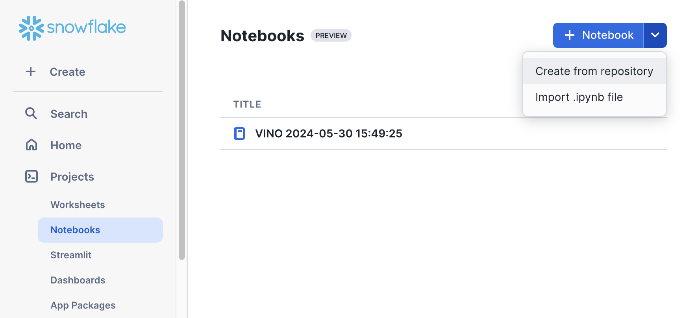

id: getting_started_with_snowflake_notebooks
summary: This guide provides the instructions on how to get started with your first Snowflake Notebook.
categories: featured,getting-started
environments: web
status: Published
feedback link: <https://github.com/Snowflake-Labs/sfguides/issues>
tags: Getting Started, Snowflake Notebooks
authors: Vino Duraisamy, Doris Lee

# A Getting Started Guide With Snowflake Notebooks
<!-- ------------------------ -->
## Overview

Duration: 5

Snowflake Notebooks offer an interactive, cell-based programming environment for Python and SQL. With a Snowflake Notebook, you can perform exploratory data analysis, experiment with feature engineering for machine learning, and perform other data science tasks within Snowflake.

You can write and execute code, visualize results, and tell the story of your analysis all in one place.

* Explore and experiment with data already in Snowflake, or upload new data to Snowflake from local files, external cloud storage, or datasets from the Snowflake Marketplace.
* Write SQL or Python code and quickly compare results with cell-by-cell development and execution.
* Interactively visualize your data using embedded Streamlit visualizations and other libraries like Altair, Matplotlib, or seaborn.
* Contextualize results and make notes about different results with Markdown cells.
* Keep your data fresh by relying on the default behavior to run a cell and all modified cells preceding it or debug your notebook by running it cell-by-cesll.
* Run your notebook on a schedule. See Schedule your Snowflake Notebook to run.
* Make use of the role-based access control and other data governance functionality available in Snowflake to allow other users with the same role to view and collaborate on the notebook.

In this guide, we will learn how to get started with your first notebook project!

### Prerequisites

- A [Snowflake](https://signup.snowflake.com/) account. Sign up for a [30-day free trial](https://signup.snowflake.com/) account, if required.
- Access to download an IPython Notebook from [Snowflake notebooks demo repo](https://github.com/Snowflake-Labs/snowflake-demo-notebooks/tree/main)

<!-- ------------------------ -->
## Setup

Duration: 5

You can create a Snowflake Notebook directly from the Snowsight UI or upload an existing IPython Notebook to Snowflake.

In this example, we will upload an existing notebook from [Snowflake Notebooks demo repo](https://github.com/Snowflake-Labs/snowflake-demo-notebooks/tree/main) into a Snowflake account.

- Download [this](https://github.com/Snowflake-Labs/snowflake-demo-notebooks/blob/main/My%20First%20Notebook%20Project/My%20First%20Notebook%20Project.ipynb) notebook.
- Login to Snowsight UI, and navigate to `Projects` -> `Worksheets`. Select `import .ipynb file` option and upload the above notebook to your Snowflake account.



### Create Table and Load Data

Run these SQL statements in a SQL worksheet to create `call_transcripts` table and load data. 

```sql
CREATE or REPLACE file format csvformat
  SKIP_HEADER = 1
  FIELD_OPTIONALLY_ENCLOSED_BY = '"'
  type = 'CSV';

CREATE or REPLACE stage call_transcripts_data_stage
  file_format = csvformat
  url = 's3://sfquickstarts/misc/call_transcripts/';

CREATE or REPLACE table CALL_TRANSCRIPTS ( 
  date_created date,
  language varchar(60),
  country varchar(60),
  product varchar(60),
  category varchar(60),
  damage_type varchar(90),
  transcript varchar
);

COPY into CALL_TRANSCRIPTS
  from @call_transcripts_data_stage;
```

<!-- ------------------------ -->
## Snowflake Cortex

Duration: 5

Given the data in `call_transcripts` table, let’s see how we can use Snowflake Cortex. It offers access to industry-leading AI models, without requiring any knowledge of how the AI models work, how to deploy LLMs, or how to manage GPU infrastructure.

### Translate
Using Snowflake Cortex function **snowflake.cortex.translate** we can easily translate any text from one language to another. Let’s see how easy it is to use this function….

```sql
select snowflake.cortex.translate('wie geht es dir heute?','de_DE','en_XX');
```

Executing the above SQL should generate ***"How are you today?"***

Now let’s see how you can translate call transcripts from German to English in batch mode using just SQL.

```sql
select transcript,snowflake.cortex.translate(transcript,'de_DE','en_XX') from call_transcripts where language = 'German';
```

### Sentiment Score
Now let’s see how we can use **snowflake.cortex.sentiment** function to generate sentiment scores on call transcripts. 

*Note: Score is between -1 and 1; -1 = most negative, 1 = positive, 0 = neutral*

```sql
select transcript, snowflake.cortex.sentiment(transcript) from call_transcripts where language = 'English';
```

### Summarize

Now that we know how to translate call transcripts in English, it would be great to have the model pull out the most important details from each transcript so we don’t have to read the whole thing. Let’s see how **snowflake.cortex.summarize** function can do this and try it on one record.

```sql
select transcript,snowflake.cortex.summarize(transcript) from call_transcripts where language = 'English' limit 1;
```

<!-- ------------------------ -->
## Snowflake Arctic

Duration: 5

### Prompt Engineering
Being able to pull out the summary is good, but it would be great if we specifically pull out the product name, what part of the product was defective, and limit the summary to 200 words. 

Let’s see how we can accomplish this using the **snowflake.cortex.complete** function.

```sql
SET prompt = 
'### 
Summarize this transcript in less than 200 words. 
Put the product name, defect and summary in JSON format. 
###';

select snowflake.cortex.complete('snowflake-arctic',concat('[INST]',$prompt,transcript,'[/INST]')) as summary
from call_transcripts where language = 'English' limit 1;
```

Here we’re selecting the Snowflake Arctic model and giving it a prompt telling it how to customize the output. Sample response:

```json
{
    "product": "XtremeX helmets",
    "defect": "broken buckles",
    "summary": "Mountain Ski Adventures received a batch of XtremeX helmets with broken buckles. The agent apologized and offered a replacement or refund. The customer preferred a replacement, and the agent expedited a new shipment of ten helmets with functioning buckles to arrive within 3-5 business days."
}
```

<!-- ------------------------ -->
## Streamlit Application

Duration: 9

To put it all together, let's create a Streamlit application in Snowflake.

### Setup

**Step 1.** Click on **Streamlit** on the left navigation menu

**Step 2.** Click on **+ Streamlit App** on the top right

**Step 3.** Enter **App name**

**Step 4.** Select **Warehouse** (X-Small) and **App location** (Database and Schema) where you'd like to create the Streamlit applicaton

**Step 5.** Click on **Create**

- At this point, you will be provided code for an example Streamlit application

**Step 6.** Replace the entire sample application code on the left with the following code snippet.

```python
import streamlit as st
from snowflake.snowpark.context import get_active_session

st.set_page_config(layout='wide')
session = get_active_session()

def summarize():
    with st.container():
        st.header("JSON Summary With Snowflake Arctic")
        entered_text = st.text_area("Enter text",label_visibility="hidden",height=400,placeholder='For example: customer call transcript')    
        if entered_text:
            entered_text = entered_text.replace("'", "\\'")
            prompt = f"Summarize this transcript in less than 200 words. Put the product name, defect if any, and summary in JSON format: {entered_text}"
            cortex_prompt = "'[INST] " + prompt + " [/INST]'"
            cortex_response = session.sql(f"select snowflake.cortex.complete('snowflake-arctic', {cortex_prompt}) as response").to_pandas().iloc[0]['RESPONSE']
            st.json(cortex_response)

def translate():
    supported_languages = {'German':'de','French':'fr','Korean':'ko','Portuguese':'pt','English':'en','Italian':'it','Russian':'ru','Swedish':'sv','Spanish':'es','Japanese':'ja','Polish':'pl'}
    with st.container():
        st.header("Translate With Snowflake Cortex")
        col1,col2 = st.columns(2)
        with col1:
            from_language = st.selectbox('From',dict(sorted(supported_languages.items())))
        with col2:
            to_language = st.selectbox('To',dict(sorted(supported_languages.items())))
        entered_text = st.text_area("Enter text",label_visibility="hidden",height=300,placeholder='For example: call customer transcript')
        if entered_text:
          entered_text = entered_text.replace("'", "\\'")
          cortex_response = session.sql(f"select snowflake.cortex.translate('{entered_text}','{supported_languages[from_language]}','{supported_languages[to_language]}') as response").to_pandas().iloc[0]['RESPONSE']
          st.write(cortex_response)

def sentiment_analysis():
    with st.container():
        st.header("Sentiment Analysis With Snowflake Cortex")
        entered_text = st.text_area("Enter text",label_visibility="hidden",height=400,placeholder='For example: customer call transcript')
        if entered_text:
          entered_text = entered_text.replace("'", "\\'")
          cortex_response = session.sql(f"select snowflake.cortex.sentiment('{entered_text}') as sentiment").to_pandas()
          st.caption("Score is between -1 and 1; -1 = Most negative, 1 = Positive, 0 = Neutral")  
          st.write(cortex_response)

page_names_to_funcs = {
    "JSON Summary": summarize,
    "Translate": translate,
    "Sentiment Analysis": sentiment_analysis,
}

selected_page = st.sidebar.selectbox("Select", page_names_to_funcs.keys())
page_names_to_funcs[selected_page]()
```

### Run

To run the application, click on **Run** located at the top right corner. If all goes well, you should see the application running as shown below.


> aside positive
> Note: Besides Snowflake Arctic you can also use [other supported LLMs in Snowflake](https://docs.snowflake.com/en/user-guide/snowflake-cortex/llm-functions#availability) with `snowflake.cortex.complete` function.

<!-- ------------------------ -->
## Conclusion And Resources

Duration: 1

Congratulations! You've successfully completed the Getting Started with Snowflake Arctic quickstart guide. 

> aside positive
> Note: Besides Snowflake Arctic you can also use [other supported LLMs in Snowflake](https://docs.snowflake.com/en/user-guide/snowflake-cortex/llm-functions#availability) with `snowflake.cortex.complete` function.

### What You Learned

- How to build a Streamlit application that uses Snowflake Arctic for custom tasks like summarizing long-form text into JSON formatted output.

### Related Resources

- [Snowflake Cortex: Overview](https://docs.snowflake.com/en/user-guide/snowflake-cortex/overview)
- [Snowflake Cortex: LLM Functions](https://docs.snowflake.com/user-guide/snowflake-cortex/llm-functions)
- [Snowflake Cortex: ML Functions](https://docs.snowflake.com/en/guides-overview-ml-functions)
- [Snowflake Arctic: Hugging Face](https://huggingface.co/Snowflake/snowflake-arctic-instruct)
- [Snowflake Arctic: Cookbooks](https://www.snowflake.com/en/data-cloud/arctic/cookbook/)
- [Snowflake Arctic: Benchmarks](https://www.snowflake.com/blog/arctic-open-efficient-foundation-language-models-snowflake/)
- [Snowflake Arctic: GitHub repo](https://github.com/Snowflake-Labs/snowflake-arctic)
