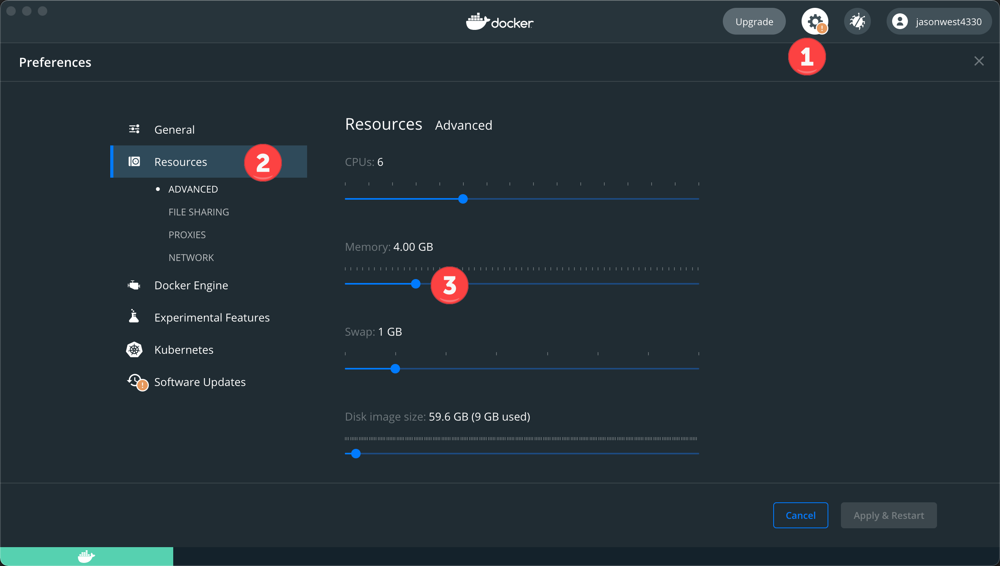
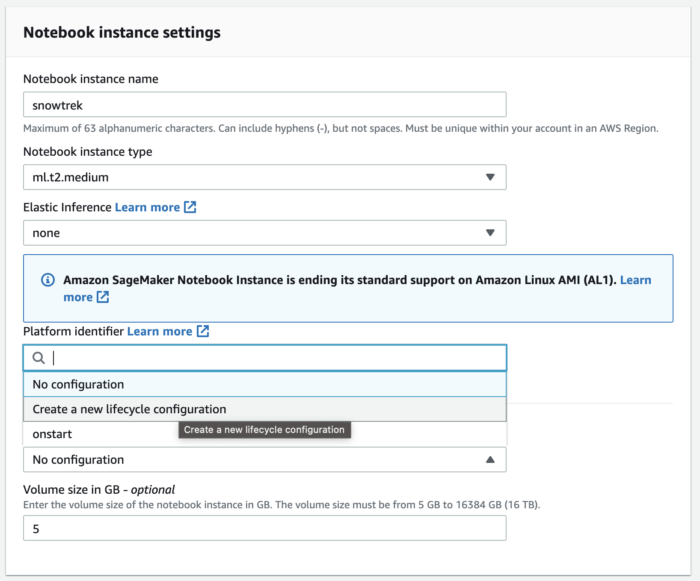
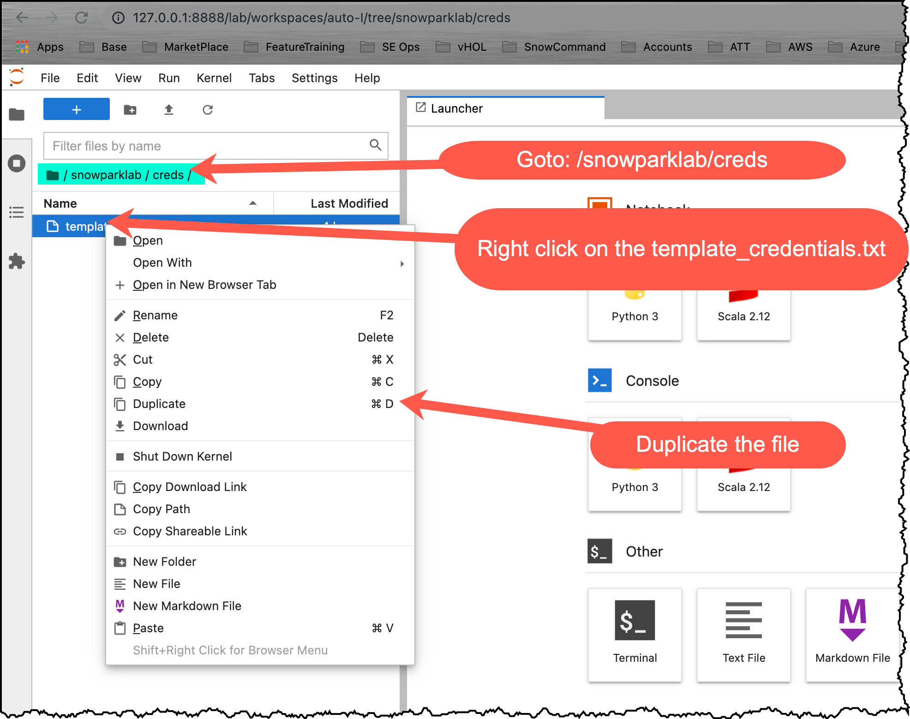
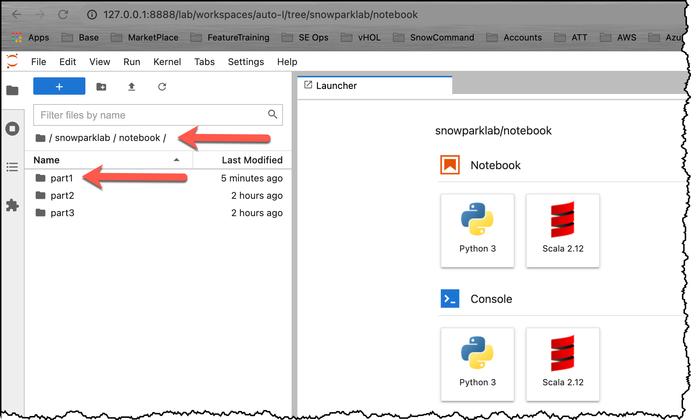
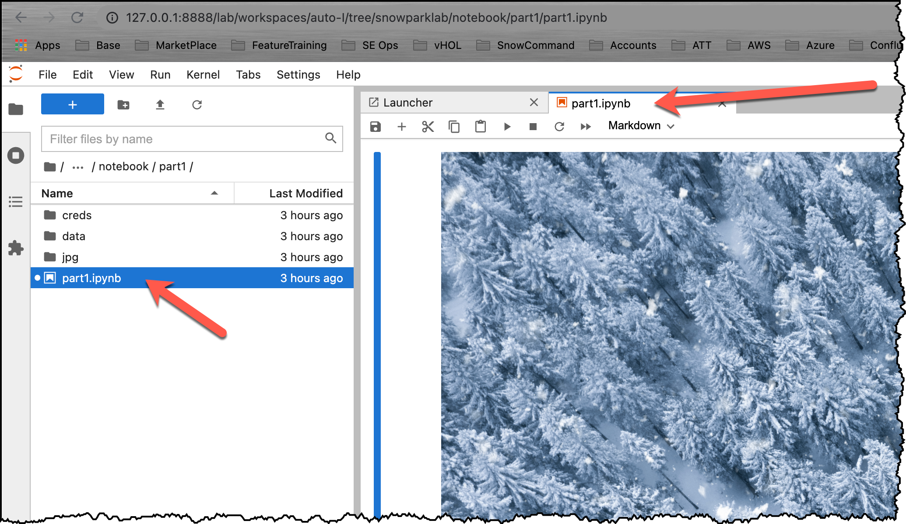
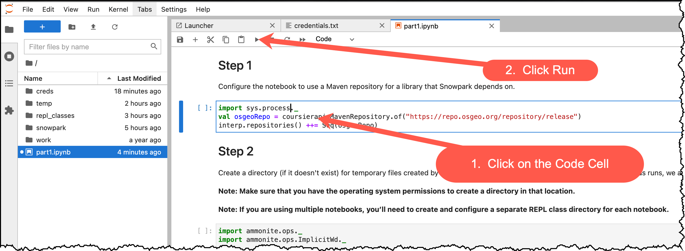
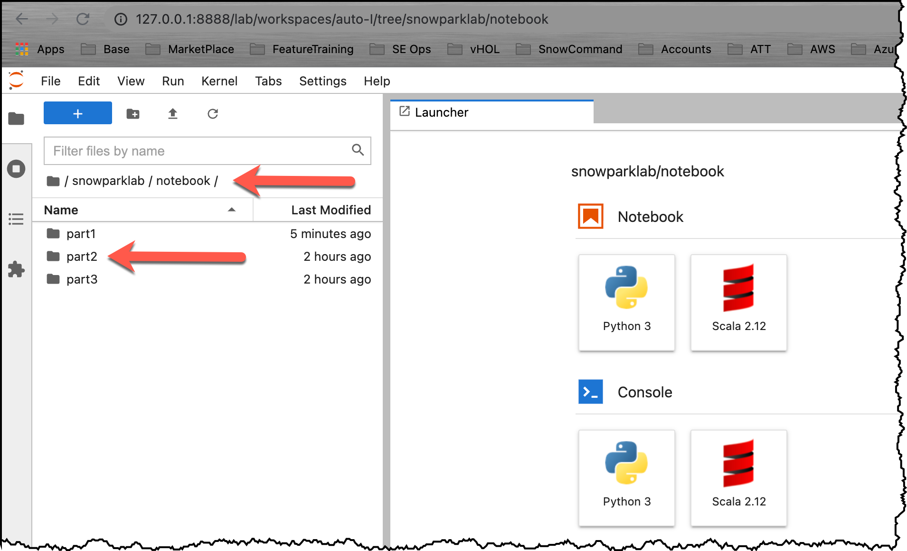
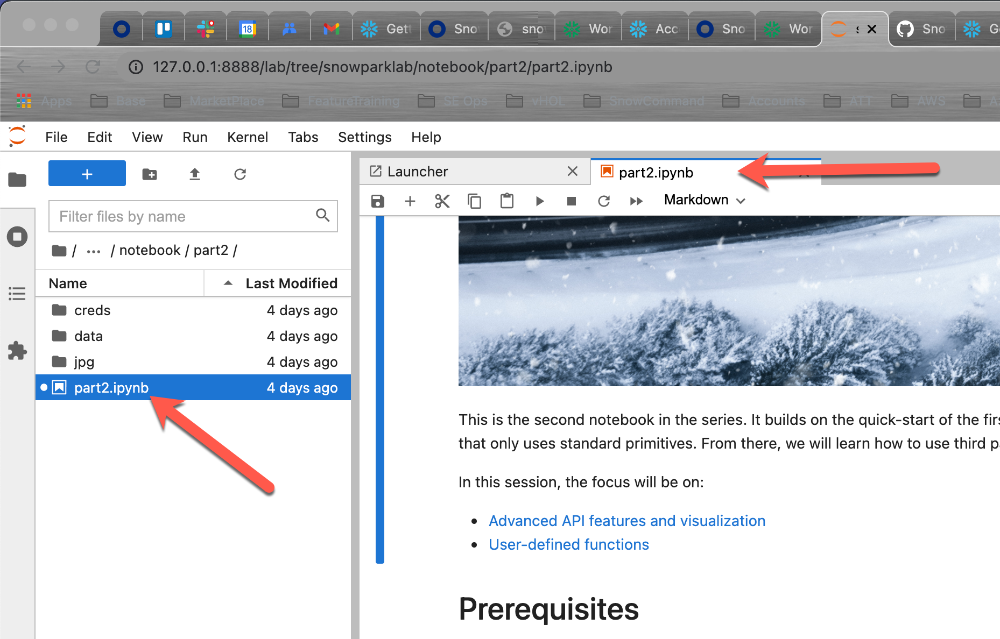
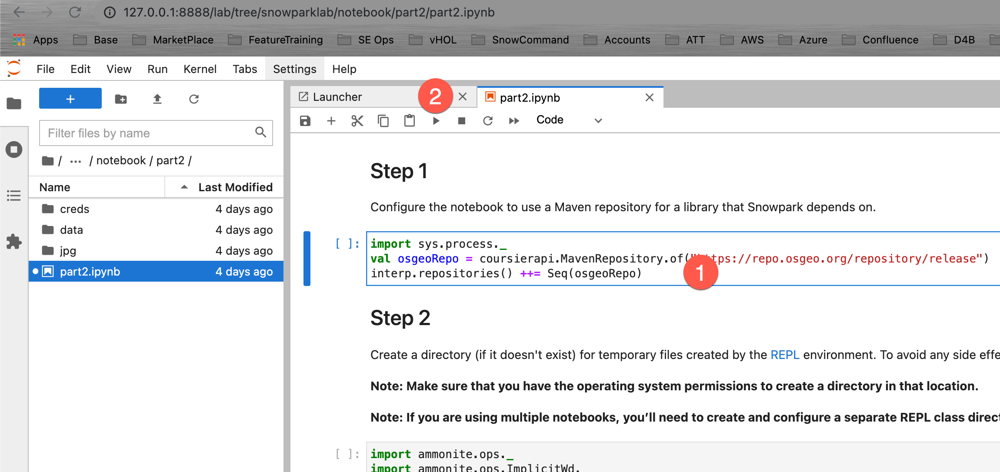
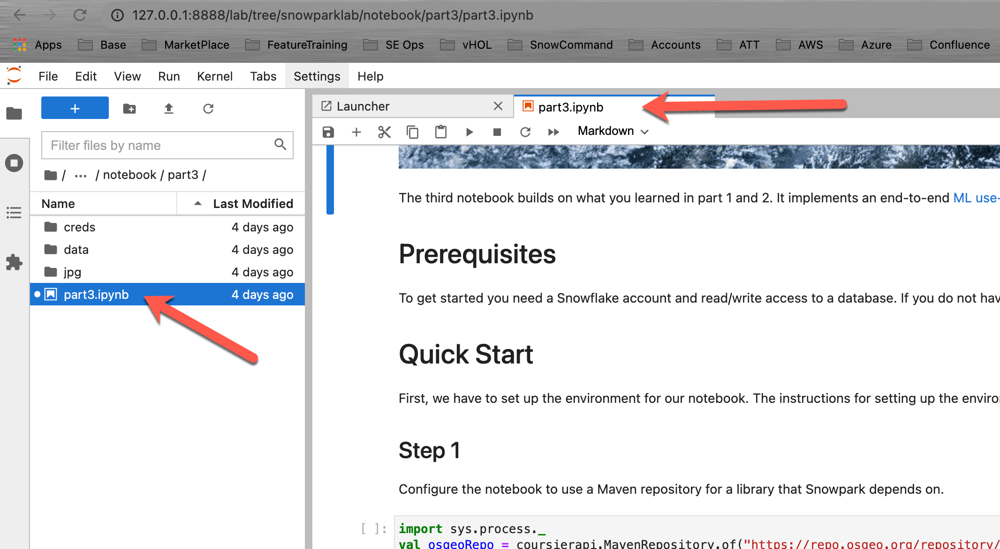

id: getting_started_with_snowpark_dataframe_api_kr
summary: Snowpark에서 Jupyter Notebook을 시작하고 DataFrame API를 사용하는 방법을 알아보십시오.
categories: undefined
environments: web
status: Hidden
feedback link: https://github.com/Snowflake-Labs/sfguides/issues
tags: 스노우플레이크 시작하기, 데이터 과학, Snowpark, 데이터 엔지니어링, kr
authors: Robert Fehrmann

# Snowpark 및 DataFrame API 시작하기

<!-- ------------------------ -->
## 개요

Duration: 3

이 프로젝트에서는 2021년 Snowflake Summit에서 [공개 미리 보기](https://www.snowflake.com/blog/welcome-to-snowpark-new-data-programmability-for-the-data-cloud/)를 위해 Snowflake가 발표한 새로운 제품 기능인 [Snowpark](https://docs.snowflake.com/ko/developer-guide/snowpark/index.html)에서 Jupyter Notebook을 시작하는 방법을 선보입니다. 이 자습서에서는 무한한 정확성, 감정 분석 및 머신 러닝을 통해 ELT 처리와 같이 명확한 실제 비즈니스 문제와 더불어 유리수를 포함한 수학과 같이 다양한 문제를 해결하는 방법을 알아보겠습니다.

Snowpark는 Jupyter Notebook만이 아닌 다양한 IDE와 작동합니다. 여러분이 즐겨 사용하는 개발 환경 설정 방법에 대한 지침은 [Snowpark를 위한 개발 환경 설정](https://docs.snowflake.com/ko/developer-guide/snowpark/setup.html) 아래에 있는 Snowpark 설명서에서 찾을 수 있습니다.

### Snowpark

Snowpark는 Snowflake를 위한 새로운 개발자 프레임워크입니다. 이는 개발자가 즐겨 사용하는 언어로 심층적으로 통합된 DataFrame 방식의 프로그래밍과 더 많은 데이터 사용 사례를 쉽게 확장하는 데 도움이 되는 함수를 제공합니다. 모두 Snowflake 내에서 실행됩니다. Snowpark 지원은 Scala API, Java UDF 및 외부 함수에서 시작합니다.

Snowpark를 통해 개발자는 DataFrame과 같은 익숙한 구성을 사용하여 프로그래밍할 수 있으며 UDF를 통해 복잡한 변환 로직을 가져올 수 있습니다. 그런 다음 Snowflake의 처리 엔진과 바로 비교해 실행하여 데이터 클라우드의 모든 성능과 확장성 특성을 활용할 수 있습니다.

Snowpark는 개발자가 과거에 데이터 기반 솔루션을 설계하고 코딩했던 방법에 여러 이점을 제공합니다.

1. 다양한 데이터 사용자를 동일한 데이터 플랫폼으로 데려와 아키텍처와 데이터 파이프라인을 단순화합니다. 또한 데이터를 이동하지 않은 채로 동일한 데이터와 비교하여 처리합니다.

2. Snowflake의 유연한 성능 엔진으로 성능, 안정성 및 확장성을 통해 실행하여 데이터 파이프라인 워크로드를 가속화합니다.

3. 관리되는 서비스와 제로에 가까운 유지 관리로 유지 관리 및 간접비를 제거합니다.

4. 단일 플랫폼을 사용하여 유지할 단일 거버넌스 프레임워크와 단일 정책 세트를 생성합니다.

5. Snowpark를 위해 Java/Scala 런타임 내부에서 실행할 수 있는 라이브러리에 대한 모든 제어를 보유한 관리자가 있는 매우 안전한 환경을 제공합니다.

다음 자습서에서는 이러한 이점을 중점적으로 다루며 여러분의 환경에서 Snowpark를 경험할 수 있도록 합니다.

### 사전 필요 조건 및 지식:

이 [리포지토리](https://github.com/Snowflake-Labs/sfguide_snowpark_on_jupyter)는 여러 부분으로 구성되어 있습니다. 각 부분에는 특정 집중 영역을 가진 노트북이 있습니다. 이 시리즈의 모든 노트북에는 Scala 커널을 포함한 Jupyter Notebook 환경이 필요합니다.

모든 노트북은 완전 독립형입니다. 이는 데이터 세트 처리 및 분석에 Snowflake 계정만 있으면 된다는 것을 의미합니다.  Snowflake 계정이 없다면 [무료 평가판](https://signup.snowflake.com/)에 등록할 수 있습니다. 신용 카드도 필요하지 않습니다.

- [Snowflake 30일 무료 평가판 환경](https://trial.snowflake.com) 사용
- 이 시리즈의 모든 노트북에는 Scala 커널을 포함한 Jupyter Notebook 환경이 필요합니다.
  - 아직 해당 환경 유형에 대한 액세스가 없다면 아래 지침에 따라 로컬에서 Jupyter를 실행하거나 AWS 클라우드에서 실행하십시오.
- 여러분이 즐겨 사용하는 개발 환경 설정 방법에 대한 지침은 [Snowpark를 위한 개발 환경 설정](https://docs.snowflake.com/ko/developer-guide/snowpark/setup.html) 아래에 있는 Snowpark 설명서에서 찾을 수 있습니다.

### 학습할 내용

- [Part 1](https://github.com/Snowflake-Labs/sfguide_snowpark_on_jupyter/blob/main/notebook/part1/part1.ipynb)
  
  이 시리즈의 첫 노트북은 Snowpark DataFrame API에 대한 빠른 시작 가이드와 소개를 제공합니다. 노트북은 환경(REPL) 설정 단계와 Snowpark에 대한 종속성을 해결하는 방법을 설명합니다. 단순한 'Hello World' 예시를 진행한 후 Snowflake DataFrame API, 프로젝션, 필터 및 조인에 대해 알아보겠습니다.

- [Part 2](https://github.com/Snowflake-Labs/sfguide_snowpark_on_jupyter/blob/main/notebook/part2/part2.ipynb)
  
  이 시리즈의 두 번째 노트북은 첫 부분의 빠른 시작을 기반으로 구축됩니다. 샘플 데이터베이스의 TPCH 데이터 세트를 사용하여 이는 Snowpark DataFrame API에서 집계와 피벗 함수를 사용하는 방법을 선보입니다. 그런 다음 UDF를 소개하고 표준 프리미티브만을 사용하는 독립 UDF 구축 방법을 소개합니다. 여기에서부터 무한한(무한한 유효 숫자) 정확성을 가진 숫자의 수학과 같은 훨씬 더 복잡한 작업을 수행하기 위해 타사 Scala 라이브러리를 사용하는 방법과 임의의 문자열에서 감정 분석을 수행하는 방법을 배우게 됩니다.

- [Part 3](https://github.com/Snowflake-Labs/sfguide_snowpark_on_jupyter/blob/main/notebook/part3/part3.ipynb)
  
  세 번째 노트북은 첫 번째와 두 번째 부분에서 배웠던 내용을 결합합니다. 이는 데이터 수집, ETL/ELT 변환, 모델 훈련, 모델 스코어링 및 결과 시각화를 포함한 엔드 투 엔드 머신 러닝 사용 사례를 구현합니다.

<!-- ------------------------ -->
## 랩 환경 준비

Duration: 10

### 옵션 1:  로컬에서 Jupyter 실행

다음 지침은 Docker 컨테이너를 사용하여 Notebook 서버를 구축하는 방법을 보여줍니다.

1. [Docker](https://docs.docker.com/get-docker/)를 다운로드하고 설치하십시오.

2. 여러분의 Docker 데스크톱 애플리케이션이 실행 중인지 확인하십시오.

3. Docker에 대한 메모리 할당이 최소 4GB임을 확인하십시오. 

4. 여러분이 즐겨 사용하는 터미널 또는 명령줄 도구/셸을 엽니다.

5. GitHub Lab [리포지토리](https://github.com/Snowflake-Labs/sfguide_snowpark_on_jupyter)를 복제합니다. cd ~ mkdir DockerImages
   
        cd DockerImages
        git clone https://github.com/Snowflake-Labs/sfguide_snowpark_on_jupyter.git

6. Docker 컨테이너를 구축합니다(네트워크 연결 속도에 따라 1~2분이 소요될 수 있음).
   
        cd ~/DockerImages/sfguide_snowpark_on_jupyter/docker
        docker build -t snowparklab .

7. 로컬 Jupyter 환경 시작
   
   다음 명령을 입력하여 Docker 컨테이너를 시작하고 컨테이너에 snowparklab 디렉터리를 적용합니다. 아래 명령은 여러분이 Git 리포지토리를 ~/DockerImages/sfguide_snowpark_on_jupyter에 복제했다고 가정합니다. 필요하다면 경로를 조정합니다.
   
        cd ~/DockerImages/sfguide_snowpark_on_jupyter
        docker run -it --rm -p 8888:8888 -e JUPYTER_ENABLE_LAB=yes -v "$(pwd)":/home/jovyan/snowparklab --name snowparklab snowparklab
   
   출력은 다음과 비슷하게 나타나야 합니다
   
        To access the server, open this file in a browser:
            file:///home/jovyan/.local/share/jupyter/runtime/jpserver-15-open.html
        Or copy and paste one of these URLs:
            http://162e383e431c:8888/lab?token=bdaead06c9944057a86f9d8a823cebad4ce66799d855be5d
            http://127.0.0.1:8888/lab?token=bdaead06c9944057a86f9d8a823cebad4ce66799d855be5d

8. 브라우저 세션(Safari, Chrome 등)을 시작합니다. **여러분의 셸 창**에 출력된 로컬 호스트 주소(127.0.0.1)가 포함된 줄을 브라우저 상태 표시줄에 붙여넣고 위 단계에서 포트를 변경했다면 **여러분의 포트**를 (8888) 포트로 업데이트합니다.

Positive :  이 단계를 완료했다면 자격 증명 설정 섹션으로 이동할 수 있습니다.

Negative :  Docker 랩 환경 중지

    Type the following command into a new shell window when you want to stop the tutorial. All changes/work will be saved on your local machine. 
    
        docker stop snowparklab
        

### 옵션 2:  AWS 클라우드에서 Jupyter 실행

로컬 컴퓨터에서 Docker를 설치할 수 없다면 [AWS 노트북 인스턴스](https://docs.aws.amazon.com/sagemaker/latest/dg/nbi.html)에서 AWS 자습서를 실행할 수 있습니다.

1. 노트북 인스턴스를 생성합니다
   
   

2. 수명 주기 정책을 생성합니다.
   
   
   
   [수명 주기 스크립트](https://github.com/Snowflake-Labs/sfguide_snowpark_on_jupyter/blob/main/docker/onstart)를 열고 콘텐츠를 편집기 창에 붙여넣습니다.
   
   노트북 생성에는 약 8분이 소요됩니다.

3. 자습서 폴더(GitHub 리포지토리 zip 파일)를 업로드합니다

4. 폴더 압축을 풉니다
   
   Launcher를 열고 터미널 창을 시작한 다음 아래 명령(<filename>은 여러분의 파일 이름으로 대체)을 실행합니다.
   
        unzip SageMaker/<filename> -d SageMaker/

Positive 
: Docker 또는 클라우드 기반 노트북 환경을 설정한 후 다음 섹션으로 이동할 수 있습니다.

<!-- ------------------------ -->
## 자격 증명 설정

Duration: 10

우선 노트북을 위해 Jupyter 환경을 설정해야 합니다. 환경 설정을 위한 전체 지침은 Snowpark 설명서의 [Jupyter 구성](https://docs.snowflake.com/ko/developer-guide/snowpark/quickstart-jupyter.html#configuring-the-jupyter-notebook-for-snowpark)에 있습니다.

#### 자격 증명 파일 설정

Snowflake 세션을 생성하려면 Snowflake 인스턴스에 대해 인증해야 합니다. 인증 변수를 여러분의 Jupyter 노트북 코드에 있는 하드 코드된 값으로 재정의하고 싶으실 수도 있지만 이는 모범 사례가 아닙니다. 여러분의 노트북 버전을 공유하면 실수로 수신자에게 여러분의 자격 증명을 공개하게 될 수 있습니다. 더 심각하게는 공개 코드 리포지토리에 여러분의 노트북을 업로드하면 전 세계에 여러분의 자격 증명을 노출하게 될 수 있습니다. 이를 방지하기 위해 여러분의 자격 증명을 외부 파일(여기에서와 같이)에 저장해야 합니다.

그런 다음 해당 파일에 여러분의 자격 증명을 업데이트하면 로컬 컴퓨터에 저장됩니다. 더 좋은 방법은 사용자/암호 인증을 [개인 키 인증](https://docs.snowflake.com/ko/user-guide/key-pair-auth.html#key-pair-authentication-key-pair-rotation)으로 전환하는 것입니다.

Positive :  여러분의 키 쌍 파일을 동일한 디렉터리에 배치하거나 여러분의 자격 증명 파일에서 위치를 업데이트합니다.

- 웹 브라우저에서 Jupyter 환경을 엽니다.
- 다음 폴더로 이동합니다.  /snowparklab/creds
- **template_credentials.txt** 파일을 복제합니다

- 복제된 파일의 이름을 **credentials.txt**로 바꿉니다(메뉴를 마우스 오른쪽 단추로 클릭)
- **credential.txt** 파일을 두 번 클릭하여 열고 이를 Jupyter 환경에서 편집합니다
- 여러분의 Snowflake 환경 연결 매개 변수로 파일을 업데이트합니다

Positive :  줄 시작 부분에 #을 입력하여 매개 변수를 주석으로 처리할 수 있습니다.

<!-- ------------------------ -->
## Part 1:  Snowpark DataFrame API 소개

Duration: 10

이는 Snowflake에서 Snowpark를 사용하는 방법을 보여주는 시리즈의 첫 노트북입니다. 이 노트북은 Snowpark DataFrame API에 대한 빠른 시작 가이드와 소개를 제공합니다. 노트북은 환경(REPL) 설정 단계와 Snowpark에 대한 종속성을 해결하는 방법을 설명합니다. 단순한 'Hello World' 예시를 진행한 후 Snowflake DataFrame API, 프로젝션, 필터 및 조인에 대해 알아보겠습니다.

### Part 1 노트북 열기

Jupyter 환경을 엽니다. snowparklab/notebook/part1 폴더로 이동하고 part1.ipynb를 두 번 클릭하여 엽니다.

### 이제 이 노트북의 각 단계를 읽고 실행합니다.

Positive :  **첫 노트북을 끝냈다면 여기로 되돌아옵니다.**

<!-- ------------------------ -->
## Part 2:  집계, 피벗 및 UDF

Duration: 15

이는 이 시리즈의 두 번째 노트북입니다. 이는 첫 부분의 빠른 시작을 기반으로 구축됩니다. 샘플 데이터베이스의 TPCH 데이터 세트를 사용하여 Snowpark DataFrame API에서 집계와 피벗 함수를 사용하는 방법을 알아보겠습니다. 그런 다음 UDF(사용자 정의 함수)를 소개하고 표준 프리미티브만을 사용하는 독립 UDF 구축 방법을 소개합니다. 여기에서부터 무한한(무한한 유효 숫자) 정확성을 가진 숫자의 수학과 같은 훨씬 더 복잡한 작업을 수행하기 위해 타사 Scala 라이브러리를 사용하는 방법과 임의의 문자열에서 감정 분석을 수행하는 방법을 배우게 됩니다.

이 세션에서는 다음을 집중적으로 다룹니다.

- 고급 API 기능 및 시각화
- 사용자 정의 함수

### Part 2 노트북 열기

Jupyter 환경을 엽니다. snowparklab/notebook/part2 폴더로 이동하고 part2.ipynb를 두 번 클릭하여 엽니다.

### 이제 이 노트북의 각 단계를 읽고 실행합니다.

Positive :  **두 번째 노트북을 끝냈다면 여기로 되돌아옵니다.**

<!-- ------------------------ -->
## Part 3:  데이터 수집, 변환 및 모델 훈련

Duration: 15

세 번째 노트북은 첫 번째와 두 번째 부분에서 배웠던 내용을 기반으로 구축됩니다. 이는 데이터 수집, ETL/ELT 변환, 모델 훈련, 모델 스코어링 및 결과 시각화를 포함한 엔드 투 엔드 머신 러닝 사용 사례를 구현합니다.

### Part 3 노트북 열기

Jupyter 환경을 엽니다. snowparklab/notebook/part2 폴더로 이동하고 part2.ipynb를 두 번 클릭하여 엽니다.

### 이제 이 노트북의 각 단계를 읽고 실행합니다.

Positive :  **종료 및 다음 단계를 읽을 수 있도록 세 번째 노트북을 끝냈다면 여기로 되돌아와 가이드를 완료합니다.**

<!-- ------------------------ -->
## 종료 및 다음 단계

Duration: 2

Snowpark는 데이터 클라우드에 확장성이 뛰어난 데이터 처리를 도입하는 최신 개발자 경험입니다. 이 시리즈의 Part1에서 Jupyter Notebook 설정 방법과 데이터 클라우드에 연결하기 위해 Snowpark를 사용하도록 이를 구성하는 방법을 배웠습니다. 다음으로 단순한 Hello World! 프로그램을 구축해 삽입된 SQL을 사용하여 연결을 테스트했습니다. 그런 다음 Snowpark DataFrame API를 도입하여 해당 프로그램을 개선했습니다. 마지막으로 필터, 프로젝션 및 조인 변환을 사용하여 Snowpark DataFrame API의 위력을 알아보았습니다.

자체 샘플 또는 제품 데이터를 로드하고 이 랩에서 다루지 않은 Snowflake의 고급 기능 중 일부를 사용하여 무료 평가판을 계속 사용해 보시길 권해 드립니다.

### 추가 리소스:

- [무료 평가판 극대화를 위한 가이드](https://www.snowflake.com/test-driving-snowflake-the-definitive-guide-to-maximizing-your-free-trial/) 문서를 확인하십시오
- [Snowflake 가상 또는 현장 이벤트](https://www.snowflake.com/about/events/)에 참석하여 Snowflake의 기능 및 고객에 관해 자세히 알아보십시오.
- [Snowflake 커뮤니티에 참여하세요](https://community.snowflake.com/s/topic/0TO0Z000000wmFQWAY/getting-started-with-snowflake)
- [Snowflake University에 등록하세요](https://community.snowflake.com/s/article/Getting-Access-to-Snowflake-University)
- 더 자세한 내용은 [Snowflake 영업팀에 문의](https://www.snowflake.com/free-trial-contact-sales/)하시기 바랍니다

### 다룬 내용:

- 빠른 시작: 환경 설정
- Hello World: 첫 단계
- Snowflake DataFrame API: Snowflake DataFrame을 통해 Snowflake 샘플 데이터 세트 쿼리
- Snowpark API를 사용한 집계, 피벗 및 UDF
- 데이터 수집, 변환 및 모델 훈련