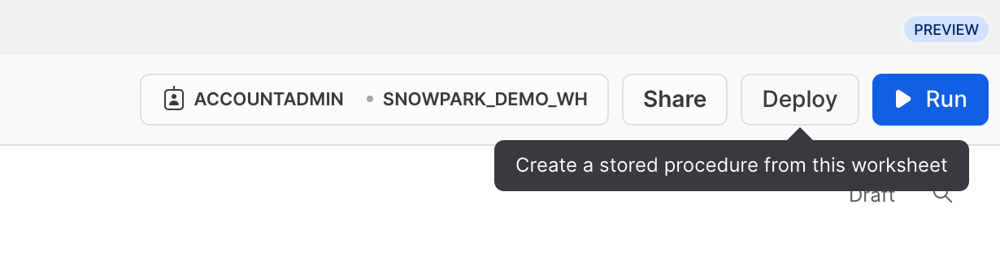

id: getting_started_with_snowpark_in_snowflake_python_worksheets
summary: Getting Started with Data Engineering and ML using Snowpark for Python
categories: featured,getting-started,data-engineering,app-development
environments: web
status: Published
feedback link: <https://github.com/Snowflake-Labs/sfguides/issues>
tags: Getting Started, Snowpark Python, Data Engineering, Python Worksheets
authors: Dash Desai

# Getting Started with Snowpark in Snowflake Python Worksheets
<!-- ------------------------ -->
## Overview

Duration: 5

By completing this guide, you will be able to try Snowpark for Python all from within the Snowflake UI. At the end, you’ll have a better understanding of how to perform core data engineering tasks using Snowpark in Snowflake Python Worksheet.

### What is Snowpark?

It allows developers to query data and write data applications inside Snowflake with languages other than SQL using a set of APIs and DataFrame-style programming constructs in Python, Java, and Scala. These applications run on and take advantage of the same distributed computation on Snowflake's elastic engine as your SQL workloads. Learn more about [Snowpark](https://www.snowflake.com/snowpark/).


### What are Python Worksheets?

Python worksheets are a new type of worksheet in Snowsight that helps you get started with Snowpark faster. Users can develop data pipelines, ML models and applications directly inside Snowflake, no additional IDE (development UI) to spin up, set up or maintain for Python. These worksheets can also be converted into procedures to schedule your Snowpark applications.

### What You’ll Learn

- How to load data from Snowflake tables into Snowpark DataFrames
- How to perform Exploratory Data Analysis on Snowpark DataFrames
- How to pivot and join data from multiple tables using Snowpark DataFrames
- How to save transformed data into Snowflake table
- How to deploy Python Worksheet as a Stored Procedure

### What You’ll Build

A prepared dataset that can be used in downstream analysis and applications. For example, training a machine learning model.

<!-- ------------------------ -->
## Get Started

Duration: 10

### Create a Snowflake Trial Account

Sign up for a free, 30-day trial by following this [link](https://signup.snowflake.com/?lab=getStartedWithSnowparkInPythonWorksheets) (which will land you back into the trial setup page titled **Getting Started with Snowpark in Snowflake Python Worksheets**). We recommend the region closest to you. We recommend the most popular edition, Enterprise, but any edition will work for this lab.

### Login and Setup Lab

Log into your Snowflake account. To access this lab and set up sample data and code, you'll want to ensure you click on the following link.

<button>[Setup Lab Environment](https://app.snowflake.com/resources/labs/getStartedWithSnowparkInPythonWorksheets)</button>

The button above will take you to a page in the trial titled **Getting Started with Snowpark in Snowflake Python Worksheets** that will invite you to click **Setup Lab** which will take less than a minute and provide a setup with data and sample Python code with explanation.

==================================================================================================


<!-- ------------------------ -->
## Load Data from Snowflake Tables into Snowpark DataFrames

Duration: 1

First, let’s import the Snowpark Python library.

```python
# Import Snowpark for Python
import snowflake.snowpark as snowpark
```

### Load Aggregated Campaign Spend and Revenue Data

Duration: 3

The campaign spend table contains ad click data that has been aggregated to show daily spend across digital ad channels including search engines, social media, email and video. The revenue table contains revenue data for 10yrs.

In this example, we will use the following code to load data from ***campaign_spend*** and ***monthly_revenue*** tables.

```python
snow_df_spend = session.table('campaign_spend')
snow_df_revenue = session.table('monthly_revenue')
```

And here are some of the other ways to load data into Snowpark DataFrames.

- session.sql("select col1, col2... from tableName")
- session.read.options({"field_delimiter": ",", "skip_header": 1}).schema(user_schema).csv("@mystage/testCSV.csv")
- session.read.parquet("@stageName/path/to/file")
- session.create_dataframe([1,2,3], schema=["col1"])

TIP: Learn more about [Snowpark DataFrames](https://docs.snowflake.com/en/developer-guide/snowpark/reference/python/dataframe.html).

<!-- ------------------------ -->
## Data Transformations

Duration: 10

In this section, we will perform a set of transformations including aggregations and joining two dataframes.

First, let’s import all the functions we will need.

```python
from snowflake.snowpark.functions import month,year,col,sum
```

### Total Spend per Year and Month For All Channels

Let's transform the data so we can see **total cost per year/month per channel** using ***group_by()*** and ***agg()*** Snowpark DataFrame functions.

```python
snow_df_spend_per_channel = snow_df_spend.group_by(year('DATE'), month('DATE'),'CHANNEL').agg(sum('TOTAL_COST').as_('TOTAL_COST')).with_column_renamed('"YEAR(DATE)"',"YEAR").with_column_renamed('"MONTH(DATE)"',"MONTH").sort('YEAR','MONTH')
```

TIP: See full list of [functions](https://docs.snowflake.com/en/developer-guide/snowpark/reference/python/functions.html).

In order to view the result of this transformation, we can use the Snowpark DataFrame's ***show()*** function which will print the output under the **Output** tab.

```python
print("Total Spend per Year and Month For All Channels")
snow_df_spend_per_channel.show()
```

### Total Spend Across All Channels

Let's further transform the campaign spend data so that each row will represent total cost across all channels per year/month using ***pivot()*** and ***sum()*** Snowpark DataFrame functions.

This transformation will enable us to join with the revenue table such that we will have our input features and target variable in a single table for model training.

```python
snow_df_spend_per_month = snow_df_spend_per_channel.pivot('CHANNEL',['search_engine','social_media','video','email']).sum('TOTAL_COST').sort('YEAR','MONTH')
snow_df_spend_per_month = snow_df_spend_per_month.select(
    col("YEAR"),
    col("MONTH"),
    col("'search_engine'").as_("SEARCH_ENGINE"),
    col("'social_media'").as_("SOCIAL_MEDIA"),
    col("'video'").as_("VIDEO"),
    col("'email'").as_("EMAIL")
)
```

In order to view the result of this transformation, we can use the Snowpark DataFrame's ***show()*** function which will print the output under the **Output** tab.

```python
print("Total Spend Across All Channels")
snow_df_spend_per_month.show()
```

### Total Revenue per Year and Month Data

Now let's transform the revenue data into revenue per year/month using ***group_by()*** and ***agg()*** functions.

```python
snow_df_revenue_per_month = snow_df_revenue.group_by('YEAR','MONTH').agg(sum('REVENUE')).sort('YEAR','MONTH').with_column_renamed('SUM(REVENUE)','REVENUE')
```

In order to view the result of this transformation, we can use the Snowpark DataFrame's ***show()*** function which will print the output under the **Output** tab.

```python
print("Total Revenue per Year and Month")
snow_df_revenue_per_month.show()
```

### Join Total Spend and Total Revenue per Year and Month Across All Channels

Next let's join this revenue data with the transformed campaign spend data so that our input features (i.e. cost per channel) and target variable (i.e. revenue) can be loaded into a single table for further analysis and model training.

```python
snow_df_spend_and_revenue_per_month = snow_df_spend_per_month.join(snow_df_revenue_per_month, ["YEAR","MONTH"])
```

In order to view the result of this transformation, we can use the Snowpark DataFrame's ***show()*** function which will print the output under the **Output** tab.

```python
print("Total Spend and Revenue per Year and Month Across All Channels")
snow_df_spend_and_revenue_per_month.show()
```

### Examine Query Explain Plan

Snowpark makes it really convenient to look at the DataFrame query and execution plan using ***explain()*** Snowpark DataFrame function.

```python
snow_df_spend_and_revenue_per_month.explain()
```

The output of the above statement can be viewed in the **Output** tab.

### Output Tab

Here's what the **Output** tab looks like after running the worksheet.


<!-- ------------------------ -->
## Save Transformed Data

Duration: 1

Let's save the transformed data into a Snowflake table ***SPEND_AND_REVENUE_PER_MONTH*** so it can be used for further analysis and/or for training a model.

```python
snow_df_spend_and_revenue_per_month.write.mode('overwrite').save_as_table('SPEND_AND_REVENUE_PER_MONTH')
```

<!-- ------------------------ -->
## View and Return Transformed Data

Duration: 1

One of the return values of a Python Worksheet is of ***Table()*** type and setting that in our case will enable you to view and return the tranformed data as a Snowpark DataFrame.

```python
return snow_df_spend_and_revenue_per_month
```

The output of the above statement can be viewed in the **Results** tab as shown below.

### Results Tab

Here's what the **Results** tab looks like after running the worksheet.


<!-- ------------------------ -->
## Deploy As A Stored Procedure

Duration: 2

Optionally you can also deploy this worksheet as a Python Stored Procedure so that you can schedule it using [Snowflake Tasks](https://docs.snowflake.com/en/user-guide/tasks-intro), for example. To deploy this worksheet, click on the **Deploy** button on the top right and follow the instructions as shown below.



==================================================================================================


### View Stored Procedure

Once it's deployed, the stored procedure details can be viewed under **Data >> Databases >> SNOWPARK_DEMO_SCHEMA >> Procedures**.


<!-- ------------------------ -->
## Conclusion And Resources

Congratulations! You've successfully performed data engineering tasks using Snowpark in Snowflake Python Worksheets.

We would love your feedback on this QuickStart Guide! Please submit your feedback using this [Feedback Form](https://docs.google.com/forms/d/e/1FAIpQLScpCO4ekMB9kitQ6stQZ1NLqZf3VqbQfDrf7yRIwMQjty57_g/viewform?usp=sf_link).

### What You Learned

- How to load data from Snowflake tables into Snowpark DataFrames
- How to perform Exploratory Data Analysis on Snowpark DataFrames
- How to pivot and join data from multiple tables using Snowpark DataFrames
- How to save transformed data into Snowflake table
- How to deploy Python Worksheet as a Stored Procedure

### Next Steps

To learn how to process data incrementally, orchestrate data pipelines with Snowflake tasks, deploy them via a CI/CD pipeline and how to use Snowflake's new developer CLI tool as well as Visual Studio Code extension, continue your journey and deep dive into [Data Engineering Pipelines with Snowpark Python](https://quickstarts.snowflake.com/guide/data_engineering_pipelines_with_snowpark_python/index.html).

### Related Resources

- [Python Worksheets Developer Guide](https://docs.snowflake.com/en/developer-guide/snowpark/python/python-worksheets)
- [Getting Started with Data Engineering and ML using Snowpark for Python](https://quickstarts.snowflake.com/guide/getting_started_with_dataengineering_ml_using_snowpark_python/index.html)
- [Advanced: Snowpark for Python Machine Learning Guide](https://quickstarts.snowflake.com/guide/getting_started_snowpark_machine_learning/index.html)
- [Snowpark for Python Demos](https://github.com/Snowflake-Labs/snowpark-python-demos/blob/main/README.md)
- [Snowpark for Python Developer Guide](https://docs.snowflake.com/en/developer-guide/snowpark/python/index.html)
