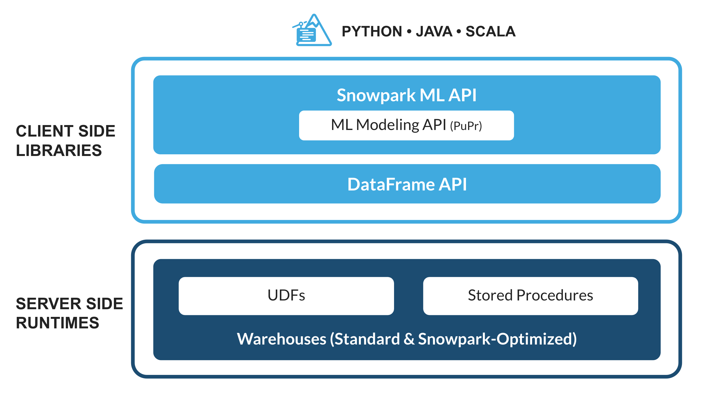
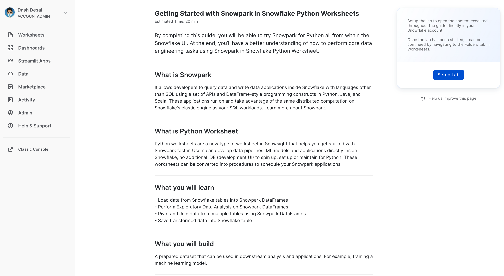
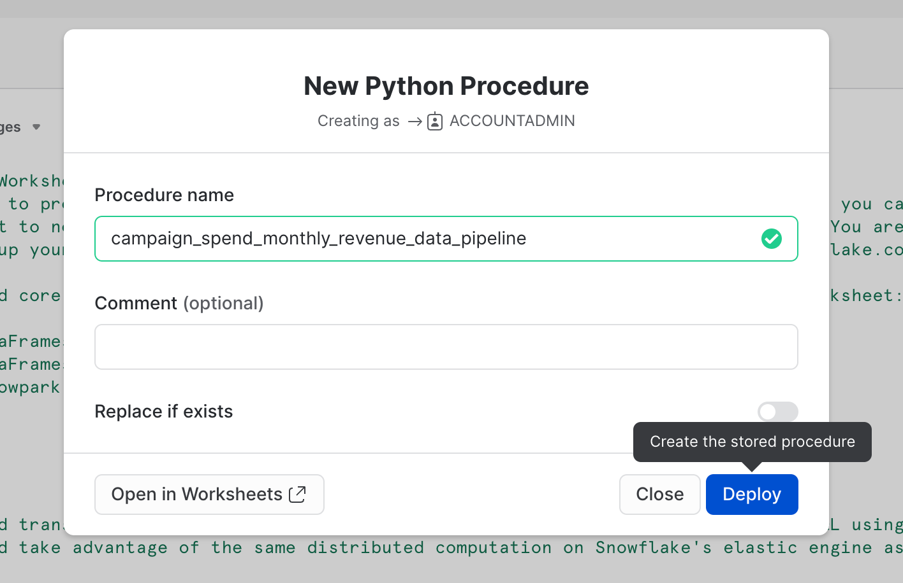

id: getting\_started\_with\_snowpark\_in\_snowflake\_python\_worksheets resumen: Introducción a la ingeniería de datos y al ML con Snowpark para Python categorías: destacado, introducción, ingeniería de datos, desarrollo de entornos de aplicaciones: estado web: enlace de comentarios publicado: <https://github.com/Snowflake-Labs/sfguides/issues> etiquetas: introducción, Snowpark para Python, ingeniería de datos, hojas de trabajo de Python autores: Dash Desai

# Introducción a Snowpark con las hojas de trabajo de Snowflake para Python
<!-- ------------------------ -->
## Descripción general

Duración: 5

Tras completar esta guía, serás capaz de probar Snowpark para Python desde la UI de Snowflake. Además, comprenderás mejor cómo llevar a cabo tareas esenciales de ingeniería de datos con Snowpark en una hoja de trabajo de Snowflake para Python.

### ¿Qué es Snowpark?

El conjunto de bibliotecas y tiempos de ejecución de Snowflake para implementar y procesar de forma segura código que no sea SQL, como Python, Java o Scala.

**Bibliotecas conocidas del cliente**: Snowpark ofrece una programación completamente integrada de estilo DataFrame y API compatibles con OSS para los lenguajes que los profesionales de los datos prefieran. También incluye la Snowpark ML API para conseguir un modelado de ML (en vista previa pública) y unas operaciones de ML (en vista previa privada) más eficientes.

**Estructuras de tiempo de ejecución flexibles**: Snowpark proporciona constructos de tiempo de ejecución flexibles que permiten a los usuarios introducir y ejecutar la lógica personalizada. Los desarrolladores pueden crear flujos de datos, modelos de ML y aplicaciones de datos sin problemas gracias a las UDF y mediante procedimientos almacenados.

Obtén más información sobre [Snowpark](https://www.snowflake.com/snowpark/).



### ¿Qué son las hojas de trabajo de Python?

Las hojas de trabajo de Python son un nuevo tipo de hojas de trabajo en Snowsight que te ayudan a empezar a usar Snowpark más rápido. Los usuarios pueden desarrollar flujos de datos, modelos de ML y aplicaciones directamente en Snowflake, sin necesidad de entornos de desarrollo integrado (integrated development environment, IDE) (es decir, UI de desarrollo) adicionales para poner en marcha, configurar ni mantener Python. Estas hojas de trabajo también se pueden convertir en procedimientos para programar tus aplicaciones de Snowpark.

### Descubrirás

- Cómo cargar datos de tablas de Snowflake en DataFrames de Snowpark
- Cómo realizar análisis de datos de exploración en DataFrames de Snowpark
- Cómo dinamizar y unir datos de varias tablas con DataFrames de Snowpark
- Cómo guardar datos transformados en una tabla de Snowflake
- Cómo implementar una hoja de trabajo de Python como un procedimiento almacenado

### Cosas que podrás crear

Un conjunto de datos preparado que se podrá utilizar en aplicaciones y análisis posteriores. Por ejemplo, para entrenar un modelo de ML.

<!-- ------------------------ -->
## Introducción

Duración: 10

### Creación de una cuenta de prueba de Snowflake

Haz clic en este [enlace](https://signup.snowflake.com/?lab=getStartedWithSnowparkInPythonWorksheets) (que te llevará a la página de configuración de la prueba **Introducción a Snowpark con las hojas de trabajo de Snowflake para Python**) y regístrate para obtener una prueba gratuita de 30 días. Te recomendamos que selecciones la región más cercana a ti y que utilices la edición más popular, Enterprise, aunque cualquier edición es compatible con este laboratorio.

### Inicio de sesión y configuración del laboratorio

Inicia sesión en tu cuenta de Snowflake. Para acceder a este laboratorio y configurar los datos y el código de muestra, debes hacer clic en el siguiente enlace.

> aside positive IMPORTANTE: Debes tener rol ACCOUNTADMIN para realizar la configuración del laboratorio que se describe a continuación. Nota: Si has creado una nueva cuenta de prueba, tendrás el rol ACCOUNTADMIN de forma predeterminada.

<button>[Configuración del entorno de laboratorio](https://app.snowflake.com/resources/labs/getStartedWithSnowparkInPythonWorksheets)</button>

El botón que aparece más arriba te redirigirá a la página de la prueba **Introducción a Snowpark con las hojas de trabajo de Snowflake para Python** que te pedirá que hagas clic en **Setup Lab** para configurar el laboratorio. Te llevará menos de un minuto y te proporcionará una configuración con datos y códigos Python de muestra con explicaciones.

==================================================================================================



<!-- ------------------------ -->
## Carga de datos de tablas de Snowflake en DataFrames de Snowpark

Duración: 1

En primer lugar, vamos a importar la biblioteca de Snowpark para Python.

\`\`\`python
# Import Snowpark for Python
import snowflake.snowpark as snowpark \`\`\`

### Carga de datos de gastos e ingresos agregados de una campaña

Duración: 3

La tabla de gastos de campaña contiene los datos de los clics en anuncios que se han agregado para mostrar los gastos diarios en diferentes canales de publicidad digital como buscadores, redes sociales, correo electrónico y vídeos. La tabla de ingresos contiene datos de diez años.

En este ejemplo, vamos a utilizar el siguiente código para cargar datos de las tablas ***campaign\_spend*** y ***monthly\_revenue***.

```python
snow_df_spend = session.table('campaign_spend')
snow_df_revenue = session.table('monthly_revenue')
```

A continuación te mostramos otras formas de cargar los datos en DataFrames de Snowpark:

- session.sql("select col1, col2... from tableName")
- session.read.options({"field_delimiter": ",", "skip_header": 1}).schema(user\_schema).csv("@mystage/testCSV.csv")
- session.read.parquet("@stageName/path/to/file")
- session.create\_dataframe(\[1,2,3], schema=\["col1"])

Consejo: Obtén más información sobre [DataFrames de Snowpark](https://docs.snowflake.com/en/developer-guide/snowpark/reference/python/dataframe.html).

<!-- ------------------------ -->
## Transformaciones de datos

Duración: 10

En esta sección vamos a realizar un conjunto de transformaciones, como agregaciones y uniones de dos DataFrames.

En primer lugar, vamos a importar todas las funciones que necesitaremos.

```python
from snowflake.snowpark.functions import month,year,col,sum
```

### Gastos totales por año y mes en todos los canales

Vamos a transformar los datos para poder ver el **coste total por año o mes y por canal** con las funciones de DataFrame de Snowpark ***group\_by()*** y ***agg()***.

```python
snow_df_spend_per_channel = snow_df_spend.group_by(year('DATE'), month('DATE'),'CHANNEL').agg(sum('TOTAL_COST').as_('TOTAL_COST')).with_column_renamed('"YEAR(DATE)"',"YEAR").with_column_renamed('"MONTH(DATE)"',"MONTH").sort('YEAR','MONTH')
```

Consejo: Consulta la lista completa de [funciones](https://docs.snowflake.com/en/developer-guide/snowpark/reference/python/functions.html).

Para ver el resultado de esta transformación, podemos utilizar la función ***show()*** de DataFrame de Snowpark, que escribirá el resultado en la pestaña **Output**.

```python
print("Total Spend per Year and Month For All Channels")
snow_df_spend_per_channel.show()
```

### Gastos totales en todos los canales

Continuemos con la transformación de los datos de los gastos de la campaña para hacer que cada fila represente el coste total en todos los canales por año o mes usando las funciones ***pivot()*** y ***sum()*** de DataFrame de Snowpark.

Esta transformación nos permitirá unir esta tabla con la de ingresos y tener en una sola tabla nuestras funciones de entrada y variables de destino para entrenar los modelos.

```python
snow_df_spend_per_month = snow_df_spend_per_channel.pivot('CHANNEL',['search_engine','social_media','video','email']).sum('TOTAL_COST').sort('YEAR','MONTH')
snow_df_spend_per_month = snow_df_spend_per_month.select(
    col("YEAR"),
    col("MONTH"),
    col("'search_engine'").as_("SEARCH_ENGINE"),
    col("'social_media'").as_("SOCIAL_MEDIA"),
    col("'video'").as_("VIDEO"),
    col("'email'").as_("EMAIL")
)
```

Para ver el resultado de esta transformación, podemos utilizar la función ***show()*** de DataFrame de Snowpark, que escribirá el resultado en la pestaña **Output**.

```python
print("Total Spend Across All Channels")
snow_df_spend_per_month.show()
```

### Datos de ingresos totales por año y mes

Ahora, con las funciones ***group\_by()*** y ***agg()*** vamos a transformar los datos de ingresos en ingresos por año o mes.

```python
snow_df_revenue_per_month = snow_df_revenue.group_by('YEAR','MONTH').agg(sum('REVENUE')).sort('YEAR','MONTH').with_column_renamed('SUM(REVENUE)','REVENUE')
```

Para ver el resultado de esta transformación, podemos utilizar la función ***show()*** de DataFrame de Snowpark, que escribirá el resultado en la pestaña **Output**.

```python
print("Total Revenue per Year and Month")
snow_df_revenue_per_month.show()
```

### Unión de los gastos e ingresos totales por año y mes en todos los canales

A continuación, vamos a unir los datos de los ingresos con los datos de gastos de la campaña ya transformados para que podamos cargar nuestras funciones de entrada (como los costes por canal) y variables de destino (por ejemplo, los ingresos) en una única tabla y continuar así con el análisis y el entrenamiento de modelos.

```python
snow_df_spend_and_revenue_per_month = snow_df_spend_per_month.join(snow_df_revenue_per_month, ["YEAR","MONTH"])
```

Para ver el resultado de esta transformación, podemos utilizar la función ***show()*** de DataFrame de Snowpark, que escribirá el resultado en la pestaña **Output**.

```python
print("Total Spend and Revenue per Year and Month Across All Channels")
snow_df_spend_and_revenue_per_month.show()
```

### Análisis de consultas y planes con Explain

Gracias a Snowpark, podemos ver cómodamente la consulta de DataFrame y el plan de ejecución con la función de DataFrame de Snowpark ***explain()***.

```python
snow_df_spend_and_revenue_per_month.explain()
```

Podemos ver el resultado de la sentencia anterior en la pestaña **Output**.

### Pestaña Output

Este es el aspecto que debería tener la pestaña **Output** tras haber ejecutado la hoja de trabajo.


<!-- ------------------------ -->
## Guardar de datos transformados

Duración: 1

Vamos a guardar los datos transformados en una tabla de Snowflake ***SPEND\_AND\_REVENUE\_PER\_MONTH*** y así podremos utilizarla para continuar con el análisis y el entrenamiento de un modelo.

```python
snow_df_spend_and_revenue_per_month.write.mode('overwrite').save_as_table('SPEND_AND_REVENUE_PER_MONTH')
```

<!-- ------------------------ -->
## Visualización y devolución de datos transformados

Duración: 1

Uno de los valores que ha devuelto una hoja de trabajo de Python es de tipo y configuración ***Table()*** que, en nuestro caso, nos permitirá visualizar y devolver los datos transformados como un DataFrame de Snowpark.

```python
return snow_df_spend_and_revenue_per_month
```

Podemos ver el resultado de la sentencia anterior en la pestaña **Results**, tal y como se muestra a continuación.

### Pestaña Results

Este es el aspecto que debería tener la pestaña **Results** tras haber ejecutado la hoja de trabajo.


<!-- ------------------------ -->
## Implementación como un procedimiento almacenado

Duración: 2

De manera opcional, también puedes implementar esta hoja de trabajo como un procedimiento almacenado de Python para poder, por ejemplo, programarlo usando [Snowflake Tasks](https://docs.snowflake.com/en/user-guide/tasks-intro). Para ello, haz clic en el botón **Deploy** en la parte superior derecha y sigue las instrucciones que se muestran a continuación.


==================================================================================================



### Visualización de procedimientos almacenados

Cuando se hayan implementado, podrás ver los detalles de los procedimientos almacenados en **Data >> Databases >> SNOWPARK\_DEMO\_SCHEMA >> Procedures**.


<!-- ------------------------ -->
## Conclusiones y recursos

¡Enhorabuena! Has realizado las tareas de ingeniería de datos con Snowpark y las hojas de trabajo de Snowflake para Python.

Nos encantaría conocer tu opinión sobre esta quickstart guide. Puedes enviárnosla a través de este [formulario](https://docs.google.com/forms/d/e/1FAIpQLScpCO4ekMB9kitQ6stQZ1NLqZf3VqbQfDrf7yRIwMQjty57_g/viewform?usp=sf_link).

### Qué has aprendido

- Cómo cargar datos de tablas de Snowflake en DataFrames de Snowpark
- Cómo realizar análisis de datos de exploración en DataFrames de Snowpark
- Cómo dinamizar y unir datos de varias tablas con DataFrames de Snowpark
- Cómo guardar datos transformados en una tabla de Snowflake
- Cómo implementar una hoja de trabajo de Python como un procedimiento almacenado

### Siguientes pasos

Si quieres aprender a procesar datos de forma incremental, a organizar flujos de datos con Snowflake Tasks e implementarlos a través de un flujo de integración y desarrollo continuos (continuous integration/continuous development, CI/CD) o si quieres aprender a usar la nueva herramienta de interfaz de línea de comandos (command-line interface, CLI) de Snowflake para desarrolladores, así como su extensión de Visual Studio Code, continúa tu aventura y adéntrate en [Flujos de ingeniería de datos con Snowpark para Python](https://quickstarts.snowflake.com/guide/data_engineering_pipelines_with_snowpark_python/index.html).

### Recursos relacionados

- [Guía para desarrolladores de hojas de trabajo para Python](https://docs.snowflake.com/en/developer-guide/snowpark/python/python-worksheets)
- [Introducción a la ingeniería de datos y al ML con Snowpark para Python](https://quickstarts.snowflake.com/guide/getting_started_with_dataengineering_ml_using_snowpark_python/index.html)
- [Avanzado: Guía de ML de Snowpark para Python](https://quickstarts.snowflake.com/guide/getting_started_snowpark_machine_learning/index.html)
- [Demos de Snowpark para Python](https://github.com/Snowflake-Labs/snowpark-python-demos/blob/main/README.md)
- [Guía de Snowpark para Python para desarrolladores](https://docs.snowflake.com/en/developer-guide/snowpark/python/index.html)
