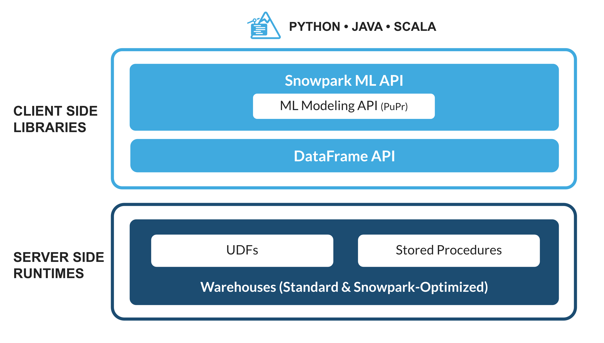
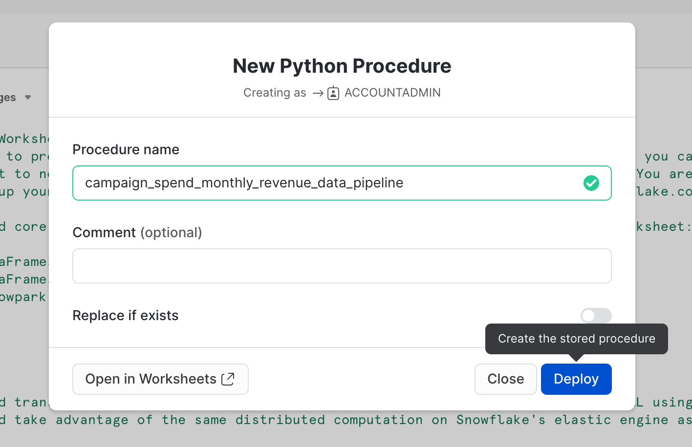

id: getting_started_with_snowpark_in_snowflake_python_worksheets_it
summary: Guida introduttiva all’uso di Snowpark nei fogli di lavoro Snowflake Python
categories: featured,getting-started,data-engineering,app-development
environments: web
status: Published
feedback link: https://github.com/Snowflake-Labs/sfguides/issues
tags: Getting Started, Snowpark Python, Data Engineering, Python Worksheets, Guida introduttiva, fogli di lavoro Python, it  
authors: Dash Desai

# Guida introduttiva all’uso di Snowpark nei fogli di lavoro Snowflake Python
<!-- ------------------------ -->
## Panoramica

Duration: 5

Completando questa guida potrai provare Snowpark per Python dall’interno dell’interfaccia utente di Snowflake. Alla fine avrai compreso meglio come eseguire attività essenziali di data engineering utilizzando Snowpark in un foglio di lavoro Snowflake Python.

### Che cos’è Snowpark?

Il set di librerie e runtime in Snowflake che consente di distribuire ed elaborare in modo sicuro codice non SQL, ad esempio Python, Java e Scala.

**Librerie lato client conosciute**: Snowpark consente agli esperti di dati di utilizzare i loro linguaggi preferiti con una programmazione profondamente integrata in stile DataFrame e API compatibili con OSS. Inoltre include la Snowpark ML API per eseguire in modo più efficiente modellazione ML (public preview) e operazioni ML (private preview).

**Costrutti runtime flessibili**: Snowpark fornisce costrutti runtime flessibili che consentono agli utenti di inserire ed eseguire logica personalizzata. Gli sviluppatori possono creare in modo fluido pipeline di dati, modelli ML e applicazioni basate sui dati utilizzando User Defined Function e stored procedure.

Scopri di più su [Snowpark](https://www.snowflake.com/snowpark/).



### Che cosa sono i fogli di lavoro Python?

I fogli di lavoro Python sono un nuovo tipo di foglio di lavoro in Snowsight che ti consente di iniziare a lavorare in Snowpark più rapidamente. Gli utenti possono sviluppare pipeline di dati, modelli ML e applicazioni direttamente all’interno di Snowflake, senza bisogno di creare, configurare o mantenere interfacce utente di sviluppo (IDE) aggiuntive per Python. Questi fogli di lavoro possono anche essere convertiti in procedure per pianificare l’esecuzione delle tue applicazioni Snowpark.

### Cosa imparerai

- Come caricare dati dalle tabelle Snowflake nei DataFrame Snowpark
- Come eseguire un’analisi dei dati esplorativa sui DataFrame Snowpark
- Come eseguire pivot e join dei dati provenienti da più tabelle utilizzando i DataFrame Snowpark
- Come salvare i dati trasformati in una tabella Snowflake
- Come distribuire un foglio di lavoro Python come stored procedure

### Cosa realizzerai

Un data set elaborato che potrà essere utilizzato nelle analisi e nelle applicazioni a valle, ad esempio per addestrare un modello di machine learning.

<!-- ------------------------ -->
## Operazioni iniziali

Duration: 10

### Creare un account di prova Snowflake

Richiedi la prova gratuita di 30 giorni seguendo questo [link](https://signup.snowflake.com/?lab=getStartedWithSnowparkInPythonWorksheets) (che ti riporterà alla pagina di configurazione della prova gratuita **Guida introduttiva all’uso di Snowpark nei fogli di lavoro Snowflake Python**). Consigliamo di scegliere la regione più vicina a te. Consigliamo l’edizione più comune, Enterprise, ma per questo workshop è possibile utilizzare qualsiasi edizione.

### Effettuare il login e configurare il workshop

Accedi al tuo account Snowflake. Per accedere a questo workshop e configurare il codice e i dati di esempio, fai clic sul seguente link.

> aside positive 
IMPORTANTE: per procedere con la configurazione del workshop descritta sotto, devi avere il ruolo ACCOUNTADMIN. Nota: se hai creato un nuovo account di prova, avrai automaticamente il ruolo ACCOUNTADMIN.

<button>[Configura l’ambiente del workshop](https://app.snowflake.com/resources/labs/getStartedWithSnowparkInPythonWorksheets)</button>

Il pulsante qui sopra ti porterà a una pagina nella versione di prova intitolata **Guida introduttiva all’uso di Snowpark nei fogli di lavoro Snowflake Python**, dove ti verrà chiesto di fare clic su **Setup Lab**. L’operazione richiederà meno di un minuto e fornirà una configurazione con dati e codice Python di esempio corredati da spiegazioni.

==================================================================================================


<!-- ------------------------ -->
## Caricare dati dalle tabelle Snowflake nei DataFrame Snowpark

Duration: 1

Per prima cosa, importiamo la libreria Snowpark Python.

```python
# Importare Snowpark for Python
import snowflake.snowpark as snowpark 
```

### Caricare i dati aggregati delle spese e dei ricavi della campagna

Duration: 3

La tabella delle spese per la campagna contiene i dati sui clic sugli annunci che sono stati aggregati per mostrare la spesa giornaliera sui canali pubblicitari digitali, inclusi motori di ricerca, social media, email e video. La tabella dei ricavi contiene i dati sui ricavi per 10 anni.

In questo esempio utilizzeremo il seguente codice per caricare i dati dalle tabelle ***campaign\_spend*** e ***monthly\_revenue***.

```python
snow_df_spend = session.table('campaign_spend')
snow_df_revenue = session.table('monthly_revenue')
```

Di seguito sono elencati alcuni altri modi per caricare i dati nei DataFrame Snowpark.

- session.sql("select col1, col2… from tableName")
- session.read.options({"field_delimiter": ",", "skip_header": 1}).schema(user\_schema).csv("@mystage/testCSV.csv")
- session.read.parquet("@stageName/path/to/file")
- session.create\_dataframe(\[1,2,3], schema=\["col1"])

SUGGERIMENTO: scopri di più sui [DataFrame Snowpark](https://docs.snowflake.com/en/developer-guide/snowpark/reference/python/dataframe.html).

<!-- ------------------------ -->
## Trasformazioni dei dati

Duration: 10

In questa sezione eseguiremo una serie di trasformazioni, tra cui aggregazioni e join di due DataFrame.

Per prima cosa importiamo tutte le funzioni di cui avremo bisogno.

```python
from snowflake.snowpark.functions import month,year,col,sum
```

### Spesa totale per anno e per mese per tutti i canali

Trasformiamo i dati per vedere il **costo totale per anno/mese per ogni canale** utilizzando le funzioni dei DataFrame Snowpark ***group\_by()*** e ***agg()***.

```python
snow_df_spend_per_channel = snow_df_spend.group_by(year('DATE'), month('DATE'),'CHANNEL').agg(sum('TOTAL_COST').as_('TOTAL_COST')).with_column_renamed('"YEAR(DATE)"',"YEAR").with_column_renamed('"MONTH(DATE)"',"MONTH").sort('YEAR','MONTH')
```

SUGGERIMENTO: consulta l’elenco completo delle [funzioni](https://docs.snowflake.com/en/developer-guide/snowpark/reference/python/functions.html).

Per visualizzare i risultati della trasformazione, possiamo utilizzare la funzione dei DataFrame Snowpark ***show()***, che stampa i risultati nella scheda **Output**.

```python
print("Total Spend per Year and Month For All Channels")
snow_df_spend_per_channel.show()
```

### Spesa totale per tutti i canali

Trasformiamo ulteriormente i dati delle spese per la campagna in modo che ogni riga rappresenti il costo totale per tutti i canali per anno/mese utilizzando le funzioni dei DataFrame Snowpark ***pivot()*** e ***sum()***.

Questa trasformazione ci consentirà di fare il join con la tabella dei ricavi, in modo da avere le feature di input e la variabile target in un’unica tabella per l’addestramento del modello.

```python
snow_df_spend_per_month = snow_df_spend_per_channel.pivot('CHANNEL',['search_engine','social_media','video','email']).sum('TOTAL_COST').sort('YEAR','MONTH')
snow_df_spend_per_month = snow_df_spend_per_month.select(
    col("YEAR"),
    col("MONTH"),
    col("'search_engine'").as_("SEARCH_ENGINE"),
    col("'social_media'").as_("SOCIAL_MEDIA"),
    col("'video'").as_("VIDEO"),
    col("'email'").as_("EMAIL")
)
```

Per visualizzare i risultati della trasformazione, possiamo utilizzare la funzione dei DataFrame Snowpark ***show()***, che stampa i risultati nella scheda **Output**.

```python
print("Total Spend Across All Channels")
snow_df_spend_per_month.show()
```

### Dati dei ricavi totali per anno e mese

Ora trasformiamo i dati dei ricavi in ricavi per mese/anno utilizzando le funzioni ***group\_by()*** e ***agg()***.

```python
snow_df_revenue_per_month = snow_df_revenue.group_by('YEAR','MONTH').agg(sum('REVENUE')).sort('YEAR','MONTH').with_column_renamed('SUM(REVENUE)','REVENUE')
```

Per visualizzare i risultati della trasformazione, possiamo utilizzare la funzione dei DataFrame Snowpark ***show()***, che stampa i risultati nella scheda **Output**.

```python
print("Total Revenue per Year and Month")
snow_df_revenue_per_month.show()
```

### Mettere in join la spesa totale e i ricavi totali per anno e per mese per tutti i canali

Ora uniamo questi dati dei ricavi con i dati delle spese per la campagna trasformati in modo che le feature di input (ossia il costo per canale) e la variabile target (ossia i ricavi) possano essere caricate in un’unica tabella per ulteriori analisi e per l’addestramento del modello.

```python
snow_df_spend_and_revenue_per_month = snow_df_spend_per_month.join(snow_df_revenue_per_month, ["YEAR","MONTH"])
```

Per visualizzare i risultati della trasformazione, possiamo utilizzare la funzione dei DataFrame Snowpark ***show()***, che stampa i risultati nella scheda **Output**.

```python
print("Total Spend and Revenue per Year and Month Across All Channels")
snow_df_spend_and_revenue_per_month.show()
```

### Esaminare il piano delle query con explain()

Snowpark consente di esaminare molto comodamente il piano di esecuzione delle query di un DataFrame utilizzando la funzione dei DataFrame Snowpark ***explain()***.

```python
snow_df_spend_and_revenue_per_month.explain()
```

L’output dell’istruzione qui sopra può essere visualizzato nella scheda **Output**.

### Scheda Output

Dopo l’esecuzione del foglio di lavoro, la scheda **Output** sarà simile a quella illustrata sotto.


<!-- ------------------------ -->
## Salvare i dati trasformati

Duration: 1

Salviamo i dati trasformati in una tabella Snowflake chiamata ***SPEND\_AND\_REVENUE\_PER\_MONTH*** in modo da poterli usare per ulteriori analisi e/o per addestrare un modello.

```python
snow_df_spend_and_revenue_per_month.write.mode('overwrite').save_as_table('SPEND_AND_REVENUE_PER_MONTH')
```

<!-- ------------------------ -->
## Visualizzare e restituire i dati trasformati

Duration: 1

Uno dei valori restituiti da un foglio di lavoro Python è di tipo ***Table()***; nel nostro caso, impostandolo sarà possibile visualizzare e restituire i dati trasformati sotto forma di DataFrame Snowpark.

```python
return snow_df_spend_and_revenue_per_month
```

L’output dell’istruzione qui sopra può essere visualizzato nella scheda **Results**, come illustrato di seguito.

### Scheda Results

Dopo l’esecuzione del foglio di lavoro, la scheda **Results** sarà simile a quella illustrata sotto.


<!-- ------------------------ -->
## Distribuire il foglio di lavoro come stored procedure

Duration: 2

Facoltativamente puoi anche distribuire questo foglio di lavoro sotto forma di stored procedure Python, ad esempio per pianificarlo utilizzando i [task di Snowflake](https://docs.snowflake.com/en/user-guide/tasks-intro). Per distribuire questo foglio di lavoro, fai clic sul pulsante **Deploy** in alto a destra e segui le istruzioni, come illustrato di seguito.


==================================================================================================



### Visualizzare la stored procedure

Dopo averla distribuita, i dettagli della stored procedure possono essere visualizzati in **Data >> Databases >> SNOWPARK\_DEMO\_SCHEMA >> Procedures**.


<!-- ------------------------ -->
## Conclusione e risorse

Congratulazioni! Hai eseguito attività di data engineering utilizzando Snowpark nei fogli di lavoro Snowflake Python.

Vogliamo conoscere la tua opinione su questo quickstart! Inviaci i tuoi commenti utilizzando questo [modulo di feedback](https://docs.google.com/forms/d/e/1FAIpQLScpCO4ekMB9kitQ6stQZ1NLqZf3VqbQfDrf7yRIwMQjty57_g/viewform?usp=sf_link).

### Che cosa hai imparato

- Come caricare dati dalle tabelle Snowflake nei DataFrame Snowpark
- Come eseguire un’analisi dei dati esplorativa sui DataFrame Snowpark
- Come eseguire pivot e join dei dati provenienti da più tabelle utilizzando i DataFrame Snowpark
- Come salvare i dati trasformati in una tabella Snowflake
- Come distribuire un foglio di lavoro Python come stored procedure

### Fasi successive

Per imparare a elaborare i dati in modo incrementale, orchestrare pipeline di dati con i task di Snowflake e distribuirle tramite una pipeline CI/CD e come utilizzare il nuovo strumento CLI per sviluppatori di Snowflake oltre alle estensioni di Visual Studio Code, segui il quickstart [Pipeline di data engineering con Snowpark Python](https://quickstarts.snowflake.com/guide/data_engineering_pipelines_with_snowpark_python/index.html).

### Risorse correlate

- [Fogli di lavoro Python - Guida allo sviluppo](https://docs.snowflake.com/en/developer-guide/snowpark/python/python-worksheets)
- [Guida introduttiva al data engineering e al machine learning con Snowpark per Python](/guide/getting_started_with_dataengineering_ml_using_snowpark_python_it/index.html)
- [Avanzato: Snowpark per Python - Guida al machine learning](https://quickstarts.snowflake.com/guide/getting_started_snowpark_machine_learning/index.html)
- [Snowpark per Python - Demo](https://github.com/Snowflake-Labs/snowpark-python-demos/blob/main/README.md)
- [Snowpark per Python - Guida allo sviluppo](https://docs.snowflake.com/en/developer-guide/snowpark/python/index.html)
　