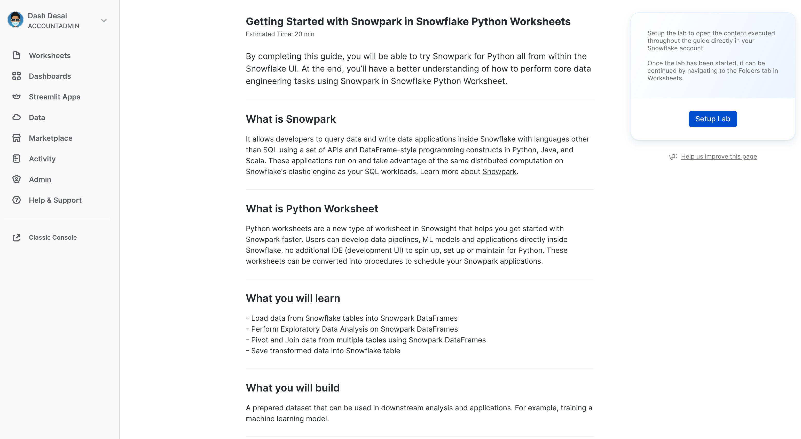
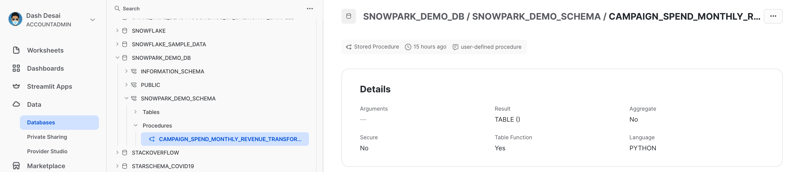

id: getting_started_with_snowpark_in_snowflake_python_worksheets_ja
summary: Snowflake PythonワークシートによるSnowpark入門
categories: featured,getting-started,data-engineering,app-development
environments: web
status: Published
feedback link: https://github.com/Snowflake-Labs/sfguides/issues
tags: Getting Started, Snowpark Python, Data Engineering, Python Worksheets, ja
authors: Dash Desai

# Snowflake PythonワークシートによるSnowpark入門

<!-- ------------------------ -->
## 概要

Duration: 5

このガイドを完了すると、Snowflake UI内からSnowpark for Pythonを試すことができるようになります。最後には、Snowflake PythonワークシートでSnowparkを使用してコアデータエンジニアリングタスクを実行する方法について理解を深めることができます。

### Snowparkとは

Python、Java、Scalaなどの非SQLコードを安全にデプロイして処理するSnowflakeのライブラリとランタイムのセットです。

**使い慣れたクライアント側ライブラリ** - Snowparkは、高度に統合されたDataFrame型のプログラミングとOSS互換のAPIをデータ実務者の好みの言語で利用できるようにします。より効率的なMLモデリング（公開プレビュー）とML運用（プライベートプレビュー）のためのSnowpark ML APIも含まれています。

**柔軟なランタイムコンストラクト** - Snowparkは、ユーザーがカスタムロジックを取り込んで実行できるようにする柔軟なランタイムコンストラクトを提供します。開発者は、ユーザー定義関数とストアドプロシージャを使用して、データパイプライン、MLモデル、データアプリケーションをシームレスに構築できます。

詳しくは、[Snowpark](https://www.snowflake.com/snowpark/)をご覧ください。


### Pythonワークシートとは

PythonワークシートはSnowsightの新しいタイプのワークシートで、Snowparkをより早く使い始めるのに役立ちます。ユーザーはSnowflake内でデータパイプライン、MLモデル、アプリケーションを直接開発でき、Python用に追加のIDE（開発UI）をスピンアップ、設定、維持する必要はありません。これらのワークシートは、Snowparkアプリケーションをスケジュールするためのプロシージャに変換することもできます。

### 学習する内容

- SnowflakeテーブルからSnowpark DataFramesにデータをロードする方法
- Snowpark DataFramesで探索的データ分析を実行する方法
- Snowpark DataFramesを使用して複数のテーブルからデータをピボットおよび結合する方法
- 変換されたデータをSnowflakeテーブルに保存する方法
- Pythonワークシートをストアドプロシージャとして展開する方法

### 構築するもの

ダウンストリームでの分析やアプリケーションで使用できる準備されたデータセット。たとえば、機械学習モデルのトレーニングです。

<!-- ------------------------ -->
## 開始する

Duration: 10

### Snowflakeトライアルアカウントを作成する

こちらの[リンク](https://signup.snowflake.com/?lab=getStartedWithSnowparkInPythonWorksheets)をクリックして、30日間の無料トライアルに登録します（「**Snowflake PythonワークシートによるSnowpark入門**」というタイトルのトライアル設定ページに戻ります）。最寄りの地域をお勧めします。最も一般的なエンタープライズエディションをお勧めしますが、このラボではどのエディションでも使用できます。

### ラボにログインして設定する

Snowflakeアカウントにログインします。このラボにアクセスし、サンプルデータとコードを設定するには、次のリンクをクリックしてください。

> 重要：以下に説明するラボ設定を続行するには、アカウント管理者ロールが必要です。注意：新しいトライアルアカウントを作成した場合は、自動的にアカウント管理者ロールが付与されます。

<button>[ラボ環境を設定する](https://app.snowflake.com/resources/labs/getStartedWithSnowparkInPythonWorksheets)</button>

上のボタンをクリックすると、「**Getting Started with Snowpark in Snowflake Python Worksheets**」というタイトルのトライアルページが表示され、**「ラボを設定」**をクリックするよう促されます。所要時間は1分以内で、データとサンプルPythonコードによる設定が説明付きで提供されます。

\==================================================================================================



<!-- ------------------------ -->
## SnowflakeテーブルからSnowpark DataFramesにデータをロードする

Duration: 1

まず、Snowpark Pythonライブラリをインポートしましょう。

```python
# Import Snowpark for Python
import snowflake.snowpark as snowpark
```

### 集約されたキャンペーン支出と売上データをロードする

Duration: 3

キャンペーン支出テーブルには、検索エンジン、ソーシャルメディア、メール、動画などのデジタル広告チャネル全体の1日の支出を示すために集約された広告クリックデータが含まれています。収益テーブルには、10年間の収益データが含まれています。

この例では、次のコードを使用して、***campaign_spend***テーブルと***monthly_revenue***テーブルからデータをロードします。

```python
snow_df_spend = session.table('campaign_spend')
snow_df_revenue = session.table('monthly_revenue')
```

他にも、Snowpark DataFramesにデータをロードする方法をいくつか紹介します。

- session.sql("select col1, col2... from tableName")
- session.read.options({"field_delimiter": ",", "skip_header": 1}).schema(user_schema).csv("@mystage/testCSV.csv")
- session.read.parquet("@stageName/path/to/file")
- session.create_dataframe([1,2,3], schema=\["col1"])

ヒント：[Snowpark DataFrames](https://docs.snowflake.com/en/developer-guide/snowpark/reference/python/dataframe.html)を参照してください。

<!-- ------------------------ -->
## データトランスフォーメーション

Duration: 10

このセクションでは、2つのDataFramesの集約と結合を含む一連の変換を実行します。

まず、必要な関数をすべてインポートしましょう。

```python
from snowflake.snowpark.functions import month,year,col,sum
```

### 全チャネルの年間および月間の総支出額

***group_by()*** および ***agg()*** Snowpark DataFrame関数を使用して、**チャネルごとの年間/月間総コスト**を確認できるようにデータを変換してみましょう。

```python
snow_df_spend_per_channel = snow_df_spend.group_by(year('DATE'), month('DATE'),'CHANNEL').agg(sum('TOTAL_COST').as_('TOTAL_COST')).with_column_renamed('"YEAR(DATE)"',"YEAR").with_column_renamed('"MONTH(DATE)"',"MONTH").sort('YEAR','MONTH')
```

ヒント：[関数](https://docs.snowflake.com/en/developer-guide/snowpark/reference/python/functions.html)の完全なリストを参照してください。

この変換の結果を表示するには、Snowpark DataFrameの ***show()*** 関数を使用して、 **出力** タブに出力します。

```python
print("Total Spend per Year and Month For All Channels")
snow_df_spend_per_channel.show()
```

### 全チャネルを通じた総支出額

***pivot()*** および ***sum()*** Snowpark DataFrame関数を使用して、各行が年間/月間のチャネル全体の総コストを表すようにキャンペーン支出データをさらに変換してみましょう。

この変換を行うことで、収益テーブルと結合し、モデルトレーニングのために、入力特徴量とターゲット変数を1つのテーブルにまとめることができるようになります。

```python
snow_df_spend_per_month = snow_df_spend_per_channel.pivot('CHANNEL',['search_engine','social_media','video','email']).sum('TOTAL_COST').sort('YEAR','MONTH')
snow_df_spend_per_month = snow_df_spend_per_month.select(
    col("YEAR"),
    col("MONTH"),
    col("'search_engine'").as_("SEARCH_ENGINE"),
    col("'social_media'").as_("SOCIAL_MEDIA"),
    col("'video'").as_("VIDEO"),
    col("'email'").as_("EMAIL")
)
```

この変換の結果を表示するには、Snowpark DataFrameの ***show()*** 関数を使用して、出力タブに出力します。

```python
print("Total Spend Across All Channels")
snow_df_spend_per_month.show()
```

### 年間および月間の総収益データ

次に、 ***group_by()*** および ***agg()*** 関数を使用して売上データを年間/月間の収益に変換してみましょう。

```python
snow_df_revenue_per_month = snow_df_revenue.group_by('YEAR','MONTH').agg(sum('REVENUE')).sort('YEAR','MONTH').with_column_renamed('SUM(REVENUE)','REVENUE')
```

この変換の結果を表示するには、Snowpark DataFrameの ***show()*** 関数を使用して、出力タブに出力します。

```python
print("Total Revenue per Year and Month")
snow_df_revenue_per_month.show()
```

### すべてのチャネルの年間および月間の総支出と総収益を結合する

次に、この収益データと変換されたキャンペーン支出データを結合し、入力特徴量（チャネルあたりの費用など）とターゲット変数（収益など）をさらなる分析とモデルトレーニングのために1つのテーブルにロードできるようにしましょう。

```python
snow_df_spend_and_revenue_per_month = snow_df_spend_per_month.join(snow_df_revenue_per_month, ["YEAR","MONTH"])
```

この変換の結果を表示するには、Snowpark DataFrameの ***show()*** 関数を使用して、出力タブに出力します。

```python
print("Total Spend and Revenue per Year and Month Across All Channels")
snow_df_spend_and_revenue_per_month.show()
```

### クエリ実行計画を調べる

Snowparkでは、***explain()*** Snowpark DataFrame関数を使用して、DataFrameクエリと実行計画を簡単に確認できます。

```python
snow_df_spend_and_revenue_per_month.explain()
```

上記の記述の出力は **出力** タブで確認できます。

### 出力タブ

ワークシートを実行した後の **出力** タブは次のようになります。


<!-- ------------------------ -->
## 変換されたデータを保存する

Duration: 1

変換されたデータをSnowflakeテーブル ***SPEND_AND_REVENUE_PER_MONTH*** に保存して、さらなる分析やモデルトレーニングに使用できるようにしましょう。

```python
snow_df_spend_and_revenue_per_month.write.mode('overwrite').save_as_table('SPEND_AND_REVENUE_PER_MONTH')
```

<!-- ------------------------ -->
## 変換されたデータを表示して返す

Duration: 1

Pythonワークシートの戻り値の1つは ***Table()*** 型であり、この例ではこれを設定することで、変換されたデータをSnowpark DataFrameとして表示して返すことができます。

```python
return snow_df_spend_and_revenue_per_month
```

上記のステートメントの出力は、以下に示す **結果** タブで確認できます。

### 結果タブ

ワークシートを実行した後の **結果** タブは次のようになります。


<!-- ------------------------ -->
## ストアドプロシージャとして展開する

Duration: 2

オプションで、このワークシートをPythonストアドプロシージャとして展開して、[Snowflakeタスク](https://docs.snowflake.com/en/user-guide/tasks-intro)などを使用してスケジュールできるようにすることもできます。このワークシートを展開するには、右上の「**展開**」ボタンをクリックし、以下の指示に従います。


\==================================================================================================


### ストアドプロシージャを表示する

展開されると、ストアドプロシージャの詳細は、**「データ」 >> 「データベース」 >> 「SNOWPARK_DEMO_SCHEMA」 >> 「プロシージャ**」で確認できます。



<!-- ------------------------ -->
## まとめとリソース

おめでとうございます。Snowflake PythonワークシートでSnowparkを使用してデータエンジニアリングタスクを正常に実行できました。

このクイックスタートガイドに関するフィードバックをお待ちしています。こちらの[フィードバックフォーム](https://docs.google.com/forms/d/e/1FAIpQLScpCO4ekMB9kitQ6stQZ1NLqZf3VqbQfDrf7yRIwMQjty57_g/viewform?usp=sf_link)からフィードバックをお寄せください。

### 学習した内容

- SnowflakeテーブルからSnowpark DataFramesにデータをロードする方法
- Snowpark DataFramesで探索的データ分析を実行する方法
- Snowpark DataFramesを使用して複数のテーブルからデータをピボットおよび結合する方法
- 変換されたデータをSnowflakeテーブルに保存する方法
- Pythonワークシートをストアドプロシージャとして展開する方法

### 次のステップ

データを段階的に処理する方法、Snowflakeタスクでデータパイプラインをオーケストレーションする方法、これらをCI/CDパイプラインで展開する方法、Snowflakeの新しい開発者CLIツールとVisual Studio Code拡張機能を使用する方法を学ぶには、引き続き[Snowpark Pythonを使用してデータエンジニアリングパイプライン](https://quickstarts.snowflake.com/guide/data_engineering_pipelines_with_snowpark_python/index.html)を深く掘り下げてください。

### 関連リソース

- [Pythonワークシート開発者ガイド](https://docs.snowflake.com/en/developer-guide/snowpark/python/python-worksheets)
- [Snowpark for Pythonを使用したデータエンジニアリングとMLの入門](https://quickstarts.snowflake.com/guide/getting_started_with_dataengineering_ml_using_snowpark_python/index.html)
- [上級：Snowpark for Python機械学習ガイド](https://quickstarts.snowflake.com/guide/getting_started_snowpark_machine_learning/index.html)
- [Snowpark for Pythonデモ](https://github.com/Snowflake-Labs/snowpark-python-demos/blob/main/README.md)
- [Snowpark for Python開発者ガイド](https://docs.snowflake.com/en/developer-guide/snowpark/python/index.html)