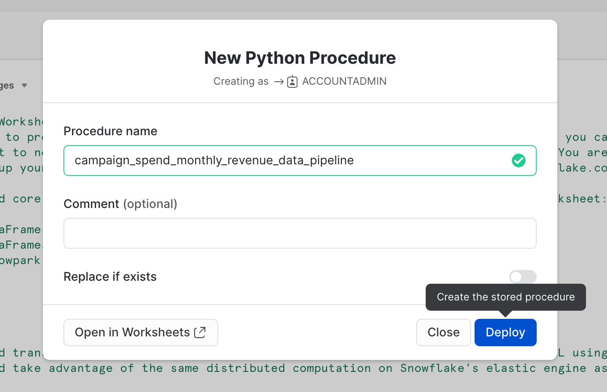

id: getting_started_with_snowpark_in_snowflake_python_worksheets_kr
summary: Snowflake Python 워크시트에서 Snowpark 시작하기
categories: featured,getting-started,data-engineering,app-development
environments: web
status: Published
feedback link: https://github.com/Snowflake-Labs/sfguides/issues
tags: Getting Started, Snowpark Python, Data Engineering, Python Worksheets, kr  
authors: Dash Desai

# Snowflake Python 워크시트에서 Snowpark 시작하기

<!-- ------------------------ -->
## 개요

Duration: 5

이 가이드를 완료하면 Snowflake UI 내에서 Snowpark for Python을 사용해 볼 수 있습니다. 결과적으로 Snowflake Python 워크시트에서 Snowpark를 사용하여 핵심 데이터 엔지니어링 작업을 수행하는 방법을 더 잘 이해하게 됩니다.

### Snowpark란 무엇일까요?

Python, Java 및 Scala를 비롯한 비 SQL 코드를 안전하게 배포하고 처리하는 Snowflake의 라이브러리 및 런타임 세트입니다.

**익숙한 클라이언트 측 라이브러리** - Snowpark는 심층적으로 통합된 DataFrame 스타일의 프로그래밍 및 OSS 호환 가능 API를 데이터 실무자가 선호하는 언어로 가져옵니다. 또한, 여기에는 더 효율적인 ML 모델링(공개 미리 보기) 및 ML 작업(비공개 미리 보기)을 위한 Snowpark ML API가 포함됩니다.

**유연한 런타임 구조** - Snowpark는 사용자가 사용자 정의 로직을 가져와 실행할 수 있도록 하는 유연한 런타임 구조를 제공합니다. 개발자는 사용자 정의 함수 및 저장 프로시저를 사용하여 원활하게 데이터 파이프라인, ML 모델 및 데이터 애플리케이션을 구축할 수 있습니다.

[Snowpark](https://www.snowflake.com/snowpark/)에 대해 자세히 알아보십시오.


### Python 워크시트란 무엇일까요?

Python 워크시트는 Snowpark를 더 빨리 시작할 수 있도록 돕는 Snowsight에 있는 새로운 유형의 워크시트입니다. 사용자는 추가 IDE(개발 UI)를 스핀업하거나, 설정하거나, Python을 위해 유지하지 않고 Snowflake 내부에서 바로 데이터 파이프라인, ML 모델 및 애플리케이션을 개발할 수 있습니다. 또한, 이러한 워크시트는 Snowpark 애플리케이션을 예약하기 위해 프로시저로 변환할 수 있습니다.

### 학습할 내용

- Snowflake 테이블에서 Snowpark DataFrame으로 데이터 로드하기
- Snowpark DataFrame에서 탐색적 데이터 분석 수행하기
- Snowpark DataFrame을 사용하여 여러 테이블의 데이터를 피벗 및 결합하기
- 변환된 데이터를 Snowflake 테이블에 저장하기
- Python 워크시트를 저장 프로시저로 배포하기

### 구축할 것

다운스트림 분석 및 애플리케이션에 사용할 수 있도록 준비된 데이터 세트 예: 머신러닝 모델 훈련

<!-- ------------------------ -->
## 시작하기

Duration: 10

### Snowflake 평가판 계정 생성

이 [링크](https://signup.snowflake.com/?lab=getStartedWithSnowparkInPythonWorksheets)(**Snowflake Python 워크시트에서 Snowpark 시작하기**라는 제목의 평가판 설정 페이지와 연결되어 있음)를 사용하여 30일 무료 평가판을 위해 등록하십시오. 자신과 가장 가까운 리전을 권장합니다. 가장 인기 있는 에디션인 엔터프라이즈를 권장하지만, 이 랩에서는 모든 에디션을 사용할 수 있습니다.

### 로그인 및 랩 설정

Snowflake 계정에 로그인합니다. 이 랩에 액세스하고 샘플 데이터 및 코드를 설정하려면 다음 링크를 클릭해야 합니다.

> aside positive 중요: 아래에서 설명하는 랩 설정을 계속하려면 ACCOUNTADMIN 역할을 보유하고 있어야 합니다. 참고: 새로운 평가판 계정을 생성한 경우, 자동으로 ACCOUNTADMIN 역할을 보유하게 됩니다.

<button>[랩 환경 설정](https://app.snowflake.com/resources/labs/getStartedWithSnowparkInPythonWorksheets)</button>

위 버튼은 **Snowflake Python 워크시트에서 Snowpark 시작하기** 라는 제목의 평가판 페이지와 연결되어 있습니다. 이 페이지는 **Setup Lab**을 클릭하도록 안내합니다. 이를 클릭하면 1분 이내에 설명이 포함된 데이터 및 샘플 Python 코드를 비롯한 설정이 제공됩니다.

\==================================================================================================


<!-- ------------------------ -->
## Snowflake 테이블에서 Snowpark DataFrame으로 데이터 로드

Duration: 1

우선, Snowpark Python 라이브러리를 가져오겠습니다.

```python
# Import Snowpark for Python
import snowflake.snowpark as snowpark
```

### 집계된 캠페인 지출 및 수익 데이터 로드

Duration: 3

이 캠페인 지출 테이블에는 일일 지출을 보여주기 위해 여러 디지털 광고 채널(예: 검색 엔진, 소셜 미디어, 이메일 및 동영상)에 걸쳐 집계된 광고 클릭 데이터가 포함되어 있습니다. 수익 테이블에는 10년 동안의 수익 데이터가 포함되어 있습니다.

이 사례에서는 ***campaign_spend*** 및 ***monthly_revenue*** 테이블에서 데이터를 로드하기 위해 다음 코드를 사용하겠습니다.

```python
snow_df_spend = session.table('campaign_spend')
snow_df_revenue = session.table('monthly_revenue')
```

또한, 데이터를 Snowpark DataFrame으로 로드하는 다른 방법은 다음과 같습니다.

- session.sql("select col1, col2... from tableName")
- session.read.options({"field_delimiter": ",", "skip_header": 1}).schema(user_schema).csv("@mystage/testCSV.csv")
- session.read.parquet("@stageName/path/to/file")
- session.create_dataframe([1,2,3], schema=\["col1"])

팁: [Snowpark DataFrame](https://docs.snowflake.com/ko/developer-guide/snowpark/reference/python/dataframe.html)에 대해 자세히 알아보십시오.

<!-- ------------------------ -->
## 데이터 변환

Duration: 10

이 섹션에서는 집계 및 2개의 DataFrame 결합을 비롯한 변환 세트를 수행하겠습니다.

우선, 필요하게 될 모든 함수를 가져오겠습니다.

```python
from snowflake.snowpark.functions import month,year,col,sum
```

### 모든 채널의 연간 및 월별 총지출

***group_by()*** 및 ***agg()*** Snowpark DataFrame 함수를 사용하여 **채널당 연간 및 월별 총비용**을 확인할 수 있도록 이 데이터를 변환하겠습니다.

```python
snow_df_spend_per_channel = snow_df_spend.group_by(year('DATE'), month('DATE'),'CHANNEL').agg(sum('TOTAL_COST').as_('TOTAL_COST')).with_column_renamed('"YEAR(DATE)"',"YEAR").with_column_renamed('"MONTH(DATE)"',"MONTH").sort('YEAR','MONTH')
```

팁: 전체 [함수](https://docs.snowflake.com/ko/developer-guide/snowpark/reference/python/functions.html) 목록을 확인하십시오.

이 변환 결과를 확인하기 위해 출력을 **Output** 탭에 출력하는 Snowpark DataFrame의 ***show()*** 함수를 사용할 수 있습니다.

```python
print("Total Spend per Year and Month For All Channels")
snow_df_spend_per_channel.show()
```

### 모든 채널에 걸친 총지출

각 행이 ***pivot()*** 및 ***sum()*** Snowpark DataFrame 함수를 사용하여 모든 채널에 걸쳐 연간 및 월별 총비용을 나타내도록 캠페인 지출 데이터를 추가적으로 변환하겠습니다.

이 변환을 수행하면 수익 테이블과 결합할 수 있습니다. 이렇게 하면 모델 훈련을 위해 단일 테이블에 입력 피처와 대상 변수를 보유하게 됩니다.

```python
snow_df_spend_per_month = snow_df_spend_per_channel.pivot('CHANNEL',['search_engine','social_media','video','email']).sum('TOTAL_COST').sort('YEAR','MONTH')
snow_df_spend_per_month = snow_df_spend_per_month.select(
    col("YEAR"),
    col("MONTH"),
    col("'search_engine'").as_("SEARCH_ENGINE"),
    col("'social_media'").as_("SOCIAL_MEDIA"),
    col("'video'").as_("VIDEO"),
    col("'email'").as_("EMAIL")
)
```

이 변환 결과를 확인하기 위해 출력을 **Output** 탭에 출력하는 Snowpark DataFrame의 ***show()*** 함수를 사용할 수 있습니다.

```python
print("Total Spend Across All Channels")
snow_df_spend_per_month.show()
```

### 연간 및 월별 총지출 데이터

이제 ***group_by()*** 및 ***agg()*** 함수를 사용하여 수익 데이터를 연간 및 월별 수익으로 변환하겠습니다.

```python
snow_df_revenue_per_month = snow_df_revenue.group_by('YEAR','MONTH').agg(sum('REVENUE')).sort('YEAR','MONTH').with_column_renamed('SUM(REVENUE)','REVENUE')
```

이 변환 결과를 확인하기 위해 출력을 **Output** 탭에 출력하는 Snowpark DataFrame의 ***show()*** 함수를 사용할 수 있습니다.

```python
print("Total Revenue per Year and Month")
snow_df_revenue_per_month.show()
```

### 모든 채널에 걸쳐 연간 및 월별 총지출 및 총수익 결합

다음으로 이 수익 데이터를 변환된 캠페인 지출 데이터와 결합하겠습니다. 이렇게 하면 추가 분석과 모델 훈련을 위해 입력 피처(예: 채널당 비용) 및 대상 변수(예: 수익)를 단일 테이블로 로드할 수 있습니다.

```python
snow_df_spend_and_revenue_per_month = snow_df_spend_per_month.join(snow_df_revenue_per_month, ["YEAR","MONTH"])
```

이 변환 결과를 확인하기 위해 출력을 **Output** 탭에 출력하는 Snowpark DataFrame의 ***show()*** 함수를 사용할 수 있습니다.

```python
print("Total Spend and Revenue per Year and Month Across All Channels")
snow_df_spend_and_revenue_per_month.show()
```

### 쿼리 설명 계획 검사

Snowpark는 ***explain()*** Snowpark DataFrame 함수를 사용하여 DataFrame 쿼리와 실행 계획을 확인하는 것을 매우 쉽게 만듭니다.

```python
snow_df_spend_and_revenue_per_month.explain()
```

위 문의 출력은 **Output** 탭에서 확인할 수 있습니다.

### Output 탭

워크시트를 실행한 후 **Output** 탭은 다음과 같습니다.


<!-- ------------------------ -->
## 변환된 데이터 저장

Duration: 1

변환된 데이터를 추가 분석 및 또는 모델 훈련에 사용할 수 있도록 이를 ***SPEND_AND_REVENUE_PER_MONTH*** Snowflake 테이블에 저장하겠습니다.

```python
snow_df_spend_and_revenue_per_month.write.mode('overwrite').save_as_table('SPEND_AND_REVENUE_PER_MONTH')
```

<!-- ------------------------ -->
## 변환된 데이터 보기 및 반환

Duration: 1

Python 워크시트의 반환 값 중 하나는 ***Table()*** 유형이며 여기에서 이를 설정하면 변환된 데이터를 Snowpark DataFrame으로 보고 반환할 수 있습니다.

```python
return snow_df_spend_and_revenue_per_month
```

위 문의 출력은 **Output** 탭에서 아래와 같은 모습으로 확인할 수 있습니다.

### Results 탭

워크시트를 실행한 후 **Results** 탭은 다음과 같습니다.


<!-- ------------------------ -->
## 저장 프로시저로 배포

Duration: 2

선택적으로 이 워크시트를 Python 저장 프로시저로 배포할 수도 있습니다. 이렇게 하면 예를 들어, [Snowflake 작업](https://docs.snowflake.com/ko/user-guide/tasks-intro)을 사용하여 이를 예약할 수 있습니다. 이 워크시트를 배포하려면 오른쪽 상단에서 **Deploy** 버튼을 클릭하고 아래에서 보이는 것과 같이 지침을 따릅니다.


\==================================================================================================



### 저장 프로시저 보기

배포된 후 저장 프로시저 세부 정보는 **Data >> Databases >> SNOWPARK_DEMO_SCHEMA >> Procedures**에서 확인할 수 있습니다.


<!-- ------------------------ -->
## 결론 및 리소스

축하합니다! Snowflake Python 워크시트에서 Snowpark를 사용하여 데이터 엔지니어링 작업을 성공적으로 수행하셨습니다.

이 Quickstart에 대한 피드백을 공유해 주시면 감사하겠습니다! 이 [피드백 양식](https://docs.google.com/forms/d/e/1FAIpQLScpCO4ekMB9kitQ6stQZ1NLqZf3VqbQfDrf7yRIwMQjty57_g/viewform?usp=sf_link)을 사용하여 피드백을 제출해 주십시오.

### 학습한 내용

- Snowflake 테이블에서 Snowpark DataFrame으로 데이터 로드하기
- Snowpark DataFrame에서 탐색적 데이터 분석 수행하기
- Snowpark DataFrame을 사용하여 여러 테이블의 데이터를 피벗 및 결합하기
- 변환된 데이터를 Snowflake 테이블에 저장하기
- Python 워크시트를 저장 프로시저로 배포하기

### 다음 단계

증분적으로 데이터를 처리하고, Snowpark 작업과 데이터 파이프라인을 조정하고, CI/CD 파이프라인을 통해 이를 배포하고, Snowflake의 새로운 개발자 CLI 도구 및 Visual Studio Code 확장 프로그램을 사용하는 방법을 알아보려면 여정을 계속하고 [Snowpark Python을 사용한 데이터 엔지니어링 파이프라인](/guide/data_engineering_pipelines_with_snowpark_python_kr/index.html)을 심층적으로 알아보십시오.

### 관련 리소스

- [Python 워크시트 개발자 가이드](https://docs.snowflake.com/ko/developer-guide/snowpark/python/python-worksheets)
- [Snowpark for Python를 사용하여 데이터 엔지니어링 및 ML 시작하기](/guide/getting_started_with_dataengineering_ml_using_snowpark_python_kr/index.html)
- [Advanced:　Snowpark for Python Machine Learning Guide](https://quickstarts.snowflake.com/guide/getting_started_snowpark_machine_learning/index.html)
- [Snowpark for Python 데모](https://github.com/Snowflake-Labs/snowpark-python-demos/blob/main/README.md)
- [Snowpark for Python 개발자 가이드](https://docs.snowflake.com/ko/developer-guide/snowpark/python/index.html)
