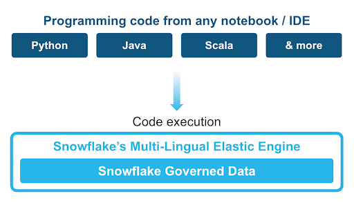
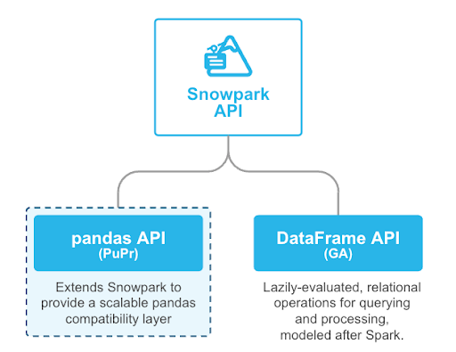

author: caleb-baechtold
id: getting_started_with_snowpark_pandas
summary: Through this quickstart guide, you will learn how to use the Snowpark pandas API
categories: Getting-Started
environments: web
status: Draft 
feedback link: https://github.com/Snowflake-Labs/sfguides/issues
tags: Getting Started, Data Science, Data Engineering, Machine Learning, Snowpark

# Getting Started with Snowpark pandas
<!-- ------------------------ -->
## Overview 

Through this quickstart guide, you will explore how to get started with the [Snowpark pandas API](https://docs.snowflake.com/en/developer-guide/snowpark/python/snowpark-pandas) and do large-scale data processing, analysis, and transformation using familiar pandas programming constructs.

### What is Snowpark?

Snowpark is the set of libraries and code execution environments that run Python and other programming languages next to your data in Snowflake. Snowpark can be used to build data pipelines, ML models, apps, and other data processing tasks.



**Client Side Libraries** - Snowpark libraries can be installed and downloaded from any client-side notebook or IDE and are used for code development and deployment. Libraries include the Snowpark API for data pipelines and apps and the Snowpark ML API for end to end machine learning.

**Code Execution Environments** - Snowpark provides elastic compute runtimes for secure execution of your code in Snowflake. Runtime options include: Python, Java, and Scala in warehouses, container runtimes for out-of-the-box distributed processing with CPUs or GPUs using any Python framework, or custom runtimes brought in from Snowpark Container Services to execute any language of choice with CPU or GPU compute.

Learn more about [Snowpark](http://www.snowflake.com/snowpark).

### What is Snowpark pandas?

[Snowpark pandas](https://github.com/Snowflake-Labs/sfguide-getting-started-with-snowpark-pandas) is an extension of the Snowpark API  that unlocks the power of Snowflake for pandas developers. With the expansion of Snowpark to provide a pandas-compatible API layer, with minimal code changes, users will be able to get the same pandas-native experience they know and love with Snowflake’s performance, scale and governance. 



### Why use Snowpark pandas?
pandas is the go-to data processing library for millions worldwide, including countless Snowflake users. However, pandas was never built to handle data at the scale organizations are operating today. Running pandas code requires transferring and loading all of the data into a single in-memory process. It becomes unwieldy on moderate-to-large data sets and breaks down completely on data sets that grow beyond what a single node can handle. We know organizations work with this volume of data today, and Snowpark pandas enables you to execute that same pandas code, but with all the pandas processing pushed down to run in a distributed fashion in Snowflake. Your data never leaves Snowflake, and your pandas workflows can process much more efficiently using the Snowflake elastic engine. This brings the power of Snowflake to pandas developers everywhere.

This quickstart will focus on getting started with Snowpark pandas, and enable you to perform common pandas operations on huge volumes of data using the power of Snowflake.

### What you will learn 
- How to install and configure the Snowpark pandas library
- How to use Snowpark pandas to transform and analyze large datasets using the power of Snowflake

### Prerequisites
- [Git](https://git-scm.com/book/en/v2/Getting-Started-Installing-Git) installed
    > aside positive
    >
    >Download the [git repo](https://github.com/Snowflake-Labs/sfguide-getting-started-with-snowpark-pandas)
- [Anaconda](https://www.anaconda.com/) installed
- [Python 3.11](https://www.python.org/downloads/) installed
    - Note that you will be creating a Python environment with 3.9 in the **Setup the Python Environment** step
- A Snowflake account with [Anaconda Packages enabled by ORGADMIN](https://docs.snowflake.com/en/developer-guide/udf/python/udf-python-packages.html#using-third-party-packages-from-anaconda). If you do not have a Snowflake account, you can register for a [free trial account](https://signup.snowflake.com/).
- A Snowflake account login with a role that has the ability to create database, schema, tables, stages, user-defined functions, and stored procedures. If not, you will need to register for a free trial or use a different role.

### What You’ll Build 
- A notebook leveraging Snowpark pandas:
    - to load and describe data
    - to perform common pandas operations and transformations at scale

<!-- ------------------------ -->
## Set up the Snowflake environment
Duration: 2

> aside positive
>
> MAKE SURE YOU'VE DOWNLOADED THE [GIT REPO](https://github.com/Snowflake-Labs/sfguide-getting-started-with-snowpark-pandas).

Run the following SQL commands in a SQL worksheet to create the [warehouse](https://docs.snowflake.com/en/sql-reference/sql/create-warehouse.html), [database](https://docs.snowflake.com/en/sql-reference/sql/create-database.html) and [schema](https://docs.snowflake.com/en/sql-reference/sql/create-schema.html).

```SQL
USE ROLE ACCOUNTADMIN;

-- Roles
SET MY_USER = CURRENT_USER();
CREATE OR REPLACE ROLE PANDAS_ROLE;
GRANT ROLE PANDAS_ROLE TO ROLE SYSADMIN;
GRANT ROLE PANDAS_ROLE TO USER IDENTIFIER($MY_USER);

GRANT IMPORTED PRIVILEGES ON DATABASE SNOWFLAKE TO ROLE PANDAS_ROLE;

-- Databases
CREATE OR REPLACE DATABASE PANDAS_DB;
GRANT OWNERSHIP ON DATABASE PANDAS_DB TO ROLE PANDAS_ROLE;

-- Warehouses
CREATE OR REPLACE WAREHOUSE PANDAS_WH WAREHOUSE_SIZE = XSMALL, AUTO_SUSPEND = 300, AUTO_RESUME= TRUE;
GRANT OWNERSHIP ON WAREHOUSE PANDAS_WH TO ROLE PANDAS_ROLE;


-- ----------------------------------------------------------------------------
-- Step #3: Create the database level objects
-- ----------------------------------------------------------------------------
USE ROLE PANDAS_ROLE;
USE WAREHOUSE PANDAS_WH;
USE DATABASE PANDAS_DB;

-- Schemas
CREATE OR REPLACE SCHEMA EXTERNAL;
CREATE OR REPLACE SCHEMA RAW_POS;
CREATE OR REPLACE SCHEMA RAW_CUSTOMER;

-- External Frostbyte objects
USE SCHEMA EXTERNAL;
CREATE OR REPLACE FILE FORMAT PARQUET_FORMAT
    TYPE = PARQUET
    COMPRESSION = SNAPPY
;
CREATE OR REPLACE STAGE FROSTBYTE_RAW_STAGE
    URL = 's3://sfquickstarts/data-engineering-with-snowpark-python/'
;

LS @FROSTBYTE_RAW_STAGE;
```

These can also be found in the **setup.sql** file.

<!-- ------------------------ -->
## Set up the Python environment
Duration: 7

> aside positive
>
> MAKE SURE YOU'VE DOWNLOADED THE [GIT REPO](https://github.com/Snowflake-Labs/sfguide-getting-started-with-snowpark-pandas).

### Snowpark pandas

- Download and install the miniconda installer from [https://conda.io/miniconda.html](https://conda.io/miniconda.html). (OR, you may use any other Python environment with Python 3.9, for example, [virtualenv](https://virtualenv.pypa.io/en/latest/)).

- Open a new terminal window and execute the following commands in the same terminal window:

  1. Create the conda environment.
  ```
  conda env create -f conda_env.yml
  ```

  2. Activate the conda environment.
  ```
  conda activate snowpark-pandas
  ```

  2. `Optionally` start notebook server:
  ```
  $ jupyter notebook &> /tmp/notebook.log &
  ```  

- Update [connection.json](connection.json) with your Snowflake account details and credentials.
  Here's a sample based on the object names we created in the last step:

```
{
  "account"   : "<your_account_identifier_goes_here>",
  "user"      : "<your_username_goes_here>",
  "password"  : "<your_password_goes_here>",
  "role"      : "ACCOUNTADMIN",
  "warehouse" : "PANDAS_WH",
  "database"  : "PANDAS_DB",
  "schema"    : "EXTERNAL"
}
```

> aside negative
> 
> **Note:** For the account parameter above, specify your account identifier and do not include the snowflakecomputing.com domain name. Snowflake automatically appends this when creating the connection. For more details on that, refer to the documentation.

<!-- ------------------------ -->
## Get started with Snowpark pandas
Duration: 20

Open the following jupyter notebook and run each of the cells: [01_snowpark_pandas.ipynb](https://github.com/Snowflake-Labs/sfguide-getting-started-with-snowpark-pandas/tree/main/01_snowpark_pandas.ipynb)

Within this notebook, we will import the Snowpark pandas API, connect to Snowflake, and perform common pandas operations on a dataset with over 220M records.

<!-- ------------------------ -->
## Conclusion and Resources
Congratulations, you have successfully completed this quickstart! Through this quickstart, we were able to showcase how Snowpark pandas allows pandas developers to easily get started processing and analyzing data at tremendous scale using familiar programming constructs and APIs.

### What you learned
- How to install and configure the Snowpark pandas library
- How to use Snowpark pandas to transform and analyze large datasets using the power of Snowflake

For more information, check out the resources below:

### Related Resources
- [Source Code on GitHub](https://github.com/Snowflake-Labs/sfguide-getting-started-with-snowpark-pandas)
- [Snowpark pandas Docs](https://docs.snowflake.com/en/developer-guide/snowpark/python/snowpark-pandas)
- [Snowpark pandas examples](https://github.com/Snowflake-Labs/sf-samples/tree/main/samples/snowpark-pandas)
- [Snowpark for Python Developer Docs](https://docs.snowflake.com/en/developer-guide/snowpark/python/index.html)

<!-- ------------------------ -->