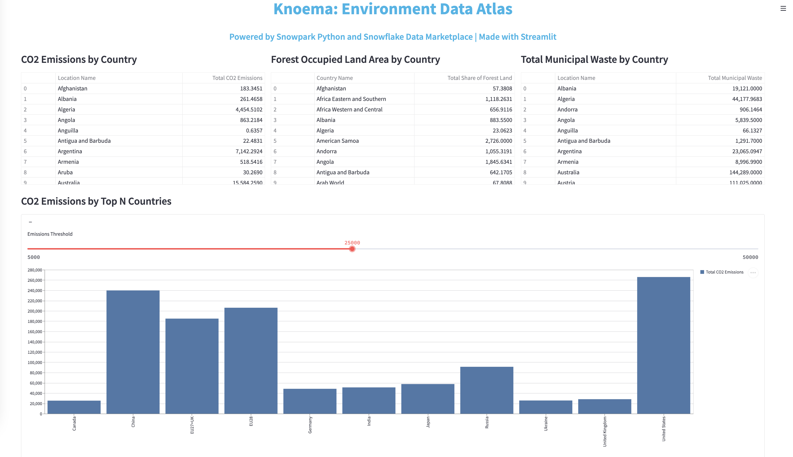
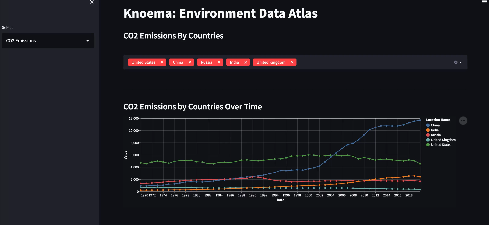
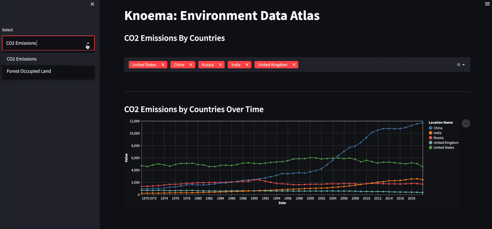
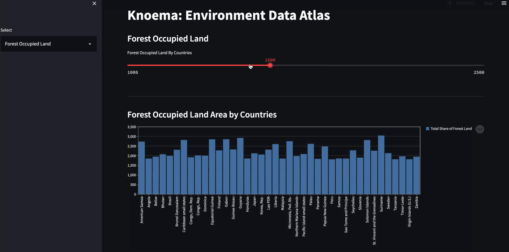

id: getting_started_with_snowpark_for_python_streamlit
summary: This guide provides the instructions for writing an application using Snowpark for Python and Streamlit.
categories: getting-started
environments: web
status: Published
feedback link: <https://github.com/Snowflake-Labs/sfguides/issues>
tags: Getting Started, Snowpark Python, Streamlit
authors: Dash Desai

# Getting Started With Snowpark for Python and Streamlit
<!-- ------------------------ -->
## Overview

Duration: 1

### What is Snowpark?

Snowpark at its core provides an API that developers can use to construct DataFrames that are executed lazily on Snowflake’s platform. It enables data engineers, data scientists, and developers coding in languages other than SQL such as Python to take advantage of Snowflake’s powerful platform without having to first move data out of Snowflake. This enables data application developers to run complex transformations within Snowflake while taking advantage of the built-in unlimited scalability, performance, governance and security features. Learn more about [Snowpark](https://www.snowflake.com/snowpark/).

### What is Streamlit?

Streamlit is a pure-Python [open-source](https://github.com/streamlit/streamlit) application framework that enables developers to quickly and easily write data applications. Learn more about [Streamlit](https://streamlit.io/).

### What You’ll Build

- A web-based data application that uses Snowpark for Python and Streamlit

### What You’ll Learn

- How to create a Session object for connecting to Snowflake
- How to create Snowpark DataFrames and load data from Snowflake
- How to display tabular data and interactive charts using Streamlit
- How to run the web-based data application using Streamlit
- Tips and tricks for enhancing the web-based data application in Streamlit

### Prerequisites

- Familiarity with Python
- Python 3.8
- Snowpark for Python library
- A [Snowflake](https://www.snowflake.com/) account with ACCOUNTADMIN role
  - For this guide, we’ll use the **Environment Data Atlas** dataset provided (for free) by **Knoema**. In the [Data Marketplace](https://app.snowflake.com/marketplace/listing/GZSTZ491VXY?search=Knoema), click on Get Data and follow the instructions to gain access to ENVIRONMENT_DATA_ATLAS.
  - In particular, we will analyze data in schema **ENVIRONMENT** from tables **EDGARED2019**, **WBWDI2019Jan**, and **UNENVDB2018**.
- Streamlit Python library

<!-- ------------------------ -->
## Setup Environment

Duration: 5

- Create Conda environment by downloading the miniconda installer from [https://conda.io/miniconda.html](https://conda.io/miniconda.html). (OR, you may use any other Python environment with Python 3.8)

IMPORTANT: If you are using a machine wth Apple M1 chip, follow [these instructons](https://docs.snowflake.com/en/developer-guide/snowpark/python/setup) to create the virtual environment and install Snowpark Python instead of what's described below.

```shell
conda create --name snowpark -c https://repo.anaconda.com/pkgs/snowflake python=3.8
```

- Activate conda environment by running the following command:

```shell
conda activate snowpark
```

- Install Snowpark for Python including Pandas and Streamlit by running the following commands:

```shell
conda install -c https://repo.anaconda.com/pkgs/snowflake snowflake-snowpark-python pandas

pip install streamlit (OR, conda install streamlit)
```

Troubleshooting `pyarrow` related issues:

- If you do not have `pyarrow` installed, you do not need to install it yourself; installing Snowpark automatically installs the appropriate version.

- If you have already installed any version of the `pyarrow` other than the recommended version `8.0.0`, uninstall it before installing Snowpark.

- Do not reinstall a different version of `pyarrow` after installing Snowpark.

<!-- ------------------------ -->
## Create Python Script

Duration: 1

Let's start by creating a Python script and adding the import statements to include the required libraries.

*my_snowpark_streamlit_app.py*

```python
# Import required libraries
from snowflake.snowpark.session import Session
from snowflake.snowpark.functions import avg, sum, col,lit
import streamlit as st
import pandas as pd
```

<!-- ------------------------ -->
## Connect to Snowflake

Duration: 5

In this step, you'll create a [Session object](https://docs.snowflake.com/en/developer-guide/snowpark/python/creating-session.html)
to connect to your Snowflake. Here’s a quick way of doing that, but note that hard coding credentials directly in code is not recommended in production environments. In production environments a better approach would be to load credentials from [AWS Secrets Manager](https://github.com/iamontheinet/sf-code-snippets/blob/main/aws_secrets_manager_sf_connection.py) or [Azure Key Vault](https://github.com/iamontheinet/sf-code-snippets/blob/main/azure_key_vault_sf_connection.py), for example.

```python
# Create Session object
def create_session_object():
   connection_parameters = {
      "account": "<account_identifier>",
      "user": "<username>",
      "password": "<password>",
      "role": "<role_name>",
      "warehouse": "<warehouse_name>",
      "database": "ENVIRONMENT_DATA_ATLAS",
      "schema": "ENVIRONMENT"
   }
   session = Session.builder.configs(connection_parameters).create()
   return session
```

In the above code snippet, replace variables enclosed in “<>” with your values. 

*IMPORTANT*:

- At the time of writing this guide, the database name was ENVIRONMENT_DATA_ATLAS and the schema name was ENVIRONMENT when accessing the data from the Marketplace. If they've changed, update the values in `connection_parameters` above accordingly.

- For the *account* parameter, specify your [account identifier](https://docs.snowflake.com/en/user-guide/admin-account-identifier.html) and do not include the snowflakecomputing.com domain name. Snowflake automatically appends this when creating the connection.

<!-- ------------------------ -->
## Load Data in Snowpark DataFrames

Duration: 5

In this step, you'll create three Snowpark DataFrames to load data from tables EDGARED2019, WBWDI2019Jan, and UNENVDB2018 from schema ENVIRONMENT.

```python
# Create Snowpark DataFrames that loads data from Knoema: Environmental Data Atlas
def load_data(session):
    # CO2 Emissions by Country
    snow_df_co2 = session.table("ENVIRONMENT.EDGARED2019").filter(col('Indicator Name') == 'Fossil CO2 Emissions').filter(col('Type Name') == 'All Type')
    snow_df_co2 = snow_df_co2.group_by('Location Name').agg(sum('$16').alias("Total CO2 Emissions")).filter(col('Location Name') != 'World').sort('Location Name')

    # Forest Occupied Land Area by Country
    snow_df_land = session.table("ENVIRONMENT.\"WBWDI2019Jan\"").filter(col('Series Name') == 'Forest area (% of land area)')
    snow_df_land = snow_df_land.group_by('Country Name').agg(sum('$61').alias("Total Share of Forest Land")).sort('Country Name')

    # Total Municipal Waste by Country
    snow_df_waste = session.table("ENVIRONMENT.UNENVDB2018").filter(col('Variable Name') == 'Municipal waste collected')
    snow_df_waste = snow_df_waste.group_by('Location Name').agg(sum('$12').alias("Total Municipal Waste")).sort('Location Name')

    # Convert Snowpark DataFrames to Pandas DataFrames for Streamlit
    pd_df_co2 = snow_df_co2.to_pandas()
    pd_df_land = snow_df_land.to_pandas()
    pd_df_waste = snow_df_waste.to_pandas()
```

In the above code snippet, we’re leveraging several Snowpark DataFrame functions to load and transform data. For example, *filter(), group_by(), agg(), sum(), alias() and sort()*.

**More importantly**, note that at this point nothing is executed on the server because of lazy evaluation–which reduces the amount of data exchanged between Snowflake and the client/application. Also note that when working with Streamlit we need Pandas DataFrames and Snowpark API for Python exposes a method to convert Snowpark DataFrames to Pandas. An action, for example *to_pandas()* in our case, causes the DataFrame to be evaluated and sends the corresponding generated SQL statement to the server for execution.

At this point, you’re technically done with most of the code and all you need to do to render the data in a web application in your browser is to use Streamlit’s *dataframe()* API. For example, *st.dataframe(pd_df_co2)*.

But let’s add a few more web components to make our data application a bit more presentable and interactive.

<!-- ------------------------ -->
## Add Web Page Components

Duration: 10

In this step, you'll add...

- A header and sub-header

```python
# Add header and a subheader
st.header("Knoema: Environment Data Atlas")
st.subheader("Powered by Snowpark for Python and Snowflake Data Marketplace | Made with Streamlit")
```

- Use containers and columns to organize our dataframes using Streamlit’s *columns()* and *container()* to display the data using Streamlit's *dataframe()* and an interactive bar chart using Streamlit's *slider()* and *bar_chart()*

```python
# Use columns to display the three dataframes side-by-side along with their headers
col1, col2, col3 = st.columns(3)
with st.container():
   with col1:
   st.subheader('CO2 Emissions by Country')
   st.dataframe(pd_df_co2)
with col2:
   st.subheader('Forest Occupied Land Area by Country')
   st.dataframe(pd_df_land)
with col3:
   st.subheader('Total Municipal Waste by Country')
   st.dataframe(pd_df_waste)

# Display an interactive bar chart to visualize CO2 Emissions by Top N Countries
with st.container():
   st.subheader('CO2 Emissions by Top N Countries')
   with st.expander(""):
      emissions_threshold = st.number_input(label='Emissions Threshold',min_value=5000, value=20000, step=5000)
      pd_df_co2_top_n = snow_df_co2.filter(col('Total CO2 Emissions') > emissions_threshold).toPandas()
      st.bar_chart(data=pd_df_co2_top_n.set_index('Location Name'), width=850, height=500, use_container_width=True)
```

In the above code snippet, a bar chart is constructed using Streamlit’s *bar_chart()* which takes a dataframe as one of the parameters. In our case, that is a subset of the **CO2 Emissions by Country** dataframe filtered by column Total CO2 Emissions via Snowpark DataFrame’s *filter()* and user-defined CO2 emissions threshold set via Streamlit’s user input component *slider()*.

Here's what the entire code in *my_snowpark_streamlit_app.py* should look like:

```python
# Snowpark
from snowflake.snowpark.session import Session
from snowflake.snowpark.functions import avg, sum, col,lit
import streamlit as st
import pandas as pd

st.set_page_config(
     page_title="Environment Data Atlas",
     page_icon="🧊",
     layout="wide",
     initial_sidebar_state="expanded",
     menu_items={
         'Get Help': 'https://developers.snowflake.com',
         'About': "This is an *extremely* cool app powered by Snowpark for Python, Streamlit, and Snowflake Data Marketplace"
     }
)

# Create Session object
def create_session_object():
    connection_parameters = {
      "account": "<account_identifier>",
      "user": "<username>",
      "password": "<password>",
      "role": "<role_name>",
      "warehouse": "<warehouse_name>",
      "database": "KNOEMA_ENVIRONMENT_DATA_ATLAS",
      "schema": "ENVIRONMENT"
    }
    session = Session.builder.configs(connection_parameters).create()
    print(session.sql('select current_warehouse(), current_database(), current_schema()').collect())
    return session

# Add header and a subheader
st.header("Knoema: Environment Data Atlas")
st.subheader("Powered by Snowpark for Python and Snowflake Data Marketplace | Made with Streamlit")
  
# Create Snowpark DataFrames that loads data from Knoema: Environmental Data Atlas
def load_data(session):
    # CO2 Emissions by Country
    snow_df_co2 = session.table("ENVIRONMENT.EDGARED2019").filter(col('Indicator Name') == 'Fossil CO2 Emissions').filter(col('Type Name') == 'All Type')
    snow_df_co2 = snow_df_co2.group_by('Location Name').agg(sum('$16').alias("Total CO2 Emissions")).filter(col('Location Name') != 'World').sort('Location Name')
    
    # Forest Occupied Land Area by Country
    snow_df_land = session.table("ENVIRONMENT.\"WBWDI2019Jan\"").filter(col('Series Name') == 'Forest area (% of land area)')
    snow_df_land = snow_df_land.group_by('Country Name').agg(sum('$61').alias("Total Share of Forest Land")).sort('Country Name')
    
    # Total Municipal Waste by Country
    snow_df_waste = session.table("ENVIRONMENT.UNENVDB2018").filter(col('Variable Name') == 'Municipal waste collected')
    snow_df_waste = snow_df_waste.group_by('Location Name').agg(sum('$12').alias("Total Municipal Waste")).sort('Location Name')
    
    # Convert Snowpark DataFrames to Pandas DataFrames for Streamlit
    pd_df_co2  = snow_df_co2.to_pandas()
    pd_df_land = snow_df_land.to_pandas() 
    pd_df_waste = snow_df_waste.to_pandas()
    
    # Use columns to display the three dataframes side-by-side along with their headers
    col1, col2, col3 = st.columns(3)
    with st.container():
        with col1:
            st.subheader('CO2 Emissions by Country')
            st.dataframe(pd_df_co2)
        with col2:
            st.subheader('Forest Occupied Land Area by Country')
            st.dataframe(pd_df_land)
        with col3:
            st.subheader('Total Municipal Waste by Country')
            st.dataframe(pd_df_waste)
    
    # Display an interactive chart to visualize CO2 Emissions by Top N Countries
    with st.container():
        st.subheader('CO2 Emissions by Top N Countries')
        with st.expander(""):
            emissions_threshold = st.slider(label='Emissions Threshold',min_value=5000, value=20000, step=5000)
            pd_df_co2_top_n = snow_df_co2.filter(col('Total CO2 Emissions') > emissions_threshold).to_pandas()
            st.bar_chart(data=pd_df_co2_top_n.set_index('Location Name'), width=850, height=500, use_container_width=True)

if __name__ == "__main__":
    session = create_session_object()
    load_data(session)
```

<!-- ------------------------ -->
## Run Web Application

Duration: 10

The fun part! Assuming your [application script](https://github.com/Snowflake-Labs/sfguide-snowpark-for-python-streamlit/blob/main/src/my_snowpark_streamlit_app.py) is free of syntax and connection errors, you’re ready to run the application.

To run the application, execute `streamlit run my_snowpark_streamlit_app.py` at the command line.

In the application:

1. You can click on columns to sort the data
2. You can increase/decrease the emissions threshold value using the slider to change the data visualization

---



---

<!-- ------------------------ -->
## Tips, Tricks And Updated App

Duration: 1

Here are a couple of tips and tricks to note:

- You can change the theme (light or dark) by clicking on the hamburger menu on the top right and then clicking on the **Settings** menu
- Making any changes to the source script and saving it will automatically prompt you to **Rerun** the application in the browser without having to stop and restart the application at the command line. (This can also be configured to always rerun the app without a prompt.)
- You can use Streamlit's `st.session_state` to save objects like `snowflake.snowpark.Session` so it's only created once during a session. For example:

```python
if "snowpark_session" not in st.session_state:
  session = Session.builder.configs(json.load(open("connection.json"))).create()
  st.session_state['snowpark_session'] = session
else:
  session = st.session_state['snowpark_session']
```

- Checkout the multi-page [updated application](https://github.com/Snowflake-Labs/sfguide-snowpark-for-python-streamlit/blob/main/src/new_snowpark_streamlit_app.py) that you can run by executing `streamlit run new_snowpark_streamlit_app.py`.



---



___



<!-- ------------------------ -->
## Conclusion And Resources

Duration: 1

Congratulations! You've successfully completed the Getting Started with Snowpark for Python and Streamlit quickstart guide.

### What You Learned

- How to create a Session object for connecting to Snowflake
- How to create Snowpark DataFrames and load data from Snowflake
- How to display tabular data and interactive charts using Streamlit
- How to run the web-based data application using Streamlit
- Tips and tricks for enhancing the web-based data application

### Related Resources

- [Application Source Code on GitHub](https://github.com/Snowflake-Labs/sfguide-snowpark-for-python-streamlit/blob/main/src/my_snowpark_streamlit_app.py)
- [Machine Learning with Snowpark for Python](https://quickstarts.snowflake.com/guide/getting_started_snowpark_machine_learning/index.html)
- [Snowpark for Python Examples](https://github.com/Snowflake-Labs/snowpark-python-demos/blob/main/README.md)
- [Snowpark for Python Developer Guide](https://docs.snowflake.com/en/developer-guide/snowpark/python/index.html)
- [Snowpark for Python API Reference](https://docs.snowflake.com/en/developer-guide/snowpark/reference/python/index.html)
- [Streamlit Docs](https://docs.streamlit.io/)
