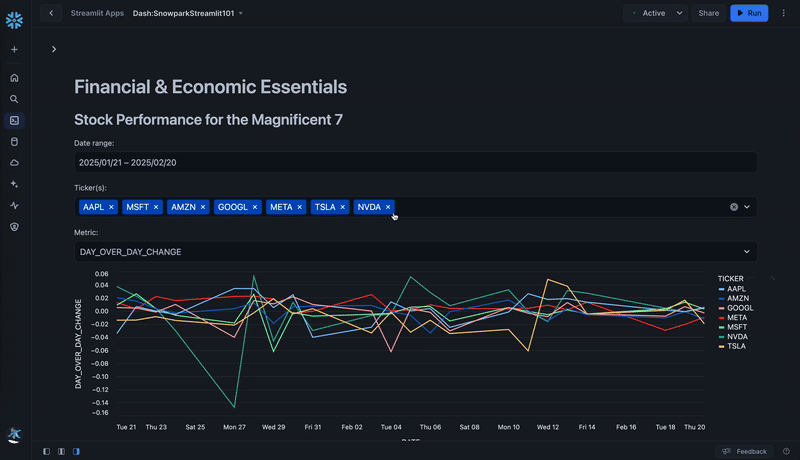

id: getting_started_with_snowpark_for_python_streamlit
summary: This guide provides the instructions for writing a Streamlit application using Snowpark for Python and data from Snowflake Marketplace.
categories: featured,getting-started,data-engineering,app-development
environments: web
status: Hidden
feedback link: <https://github.com/Snowflake-Labs/sfguides/issues>
tags: Getting Started, Snowpark Python, Streamlit
authors: Dash Desai

# Getting Started With Snowpark for Python and Streamlit
<!-- ------------------------ -->
## Overview

Duration: 5

This guide provides the instructions for building a Streamlit application using Snowpark for Python and data from Snowflake Marketplace.

### What You Will Build

A Streamlit application that loads and visualizes the data loaded from Snowflake Marketplace using Snowpark for Python.



### What is Snowpark?

The set of libraries and runtimes in Snowflake that securely deploy and process non-SQL code, including Python, Java and Scala.

**Familiar Client Side Libraries** - Snowpark brings deeply integrated, DataFrame-style programming and OSS compatible APIs to the languages data practitioners like to use. It also includes the Snowpark ML API for more efficient ML modeling (public preview) and ML operations (private preview).

**Flexible Runtime Constructs** - Snowpark provides flexible runtime constructs that allow users to bring in and run custom logic. Developers can seamlessly build data pipelines, ML models, and data applications with User-Defined Functions and Stored Procedures.

Learn more about [Snowpark](https://www.snowflake.com/snowpark/).


### What is Streamlit?

Streamlit enables data scientists and Python developers to combine Streamlit's component-rich, open-source Python library with the scale, performance, and security of the Snowflake platform.

Learn more about [Streamlit](https://www.snowflake.com/en/data-cloud/overview/streamlit-in-snowflake/).

### What You Will Learn

- How to access current Session object in Streamlit
- How to load data from Snowflake Marketplace
- How to create Snowpark DataFrames and perform transformations
- How to create and display interactive charts in Streamlit

### Prerequisites

- A [Snowflake](https://www.snowflake.com/) account in **AWS US Oregon**
- Access to **Environment Data Atlas** dataset provided by **Knoema**.
  - In the [Snowflake Marketplace](https://app.snowflake.com/marketplace/listing/GZSTZ491VXY?search=Knoema), click on **Get Data** and follow the instructions to gain access to ENVIRONMENT_DATA_ATLAS. In particular, we will use data in schema **ENVIRONMENT** from tables **EDGARED2019**, **WBWDI2019Jan**, and **UNENVDB2018**.

<!-- ------------------------ -->
## Get Started

Duration: 5

Follow these steps to start building Streamlit application in Snowsight.

**Step 1.** Click on **Streamlit** on the left navigation menu

**Step 2.** Click on **+ Streamlit App** on the top right

**Step 3.** Enter **App name**

**Step 4.** Select **Warehouse** (X-Small) and **App location** (Database and Schema) where you'd like to create the Streamlit applicaton

**Step 5.** Click on **Create**

- At this point, you will be provided code for an example Streamlit application

**Step 6.** Replace sample application code displayed in the code editor on the left by following instructions in the subsequent steps

<!-- ------------------------ -->
## Application Setup

Duration: 2

Delete existing sample application code in the code editor on the left and add the following code snippet at the very top.

```python
from snowflake.snowpark.context import get_active_session
from snowflake.snowpark.functions import sum, col
import altair as alt
import streamlit as st

# Set page config
st.set_page_config(layout="wide")

# Get current session
session = get_active_session()
```

In the above code snippet, we're importing the required libraries, setting the application's page config to use full width of the browser window, and gaining access to the current session.

<!-- ------------------------ -->
## Load and Transform Data

Duration: 5

Now add the following Python function that loads and caches data from *ENVIRONMENT_DATA_ATLAS.ENVIRONMENT.EDGARED2019* and *ENVIRONMENT_DATA_ATLAS.ENVIRONMENT.WBWDI2019Jan* tables.

```python
@st.cache_data()
def load_data():
    # Load CO2 emissions data
    snow_df_co2 = session.table("ENVIRONMENT_DATA_ATLAS.ENVIRONMENT.EDGARED2019").filter(col('Indicator Name') == 'Fossil CO2 Emissions').filter(col('Type Name') == 'All Type').sort('"Date"').with_column_renamed('"Date"','"Year"')

    # Load and transform forest occupied land area data
    snow_df_land = session.table("ENVIRONMENT_DATA_ATLAS.ENVIRONMENT.\"WBWDI2019Jan\"").filter(col('Series Name') == 'Forest area (% of land area)')
    snow_df_land = snow_df_land.group_by('Country Name').agg(sum('$61').alias("Total Share of Forest Land")).sort('Country Name')
    return snow_df_co2.to_pandas(), snow_df_land.to_pandas()

# Load and cache data
df_co2_overtime, df_forest_land = load_data()
```

In the above code snippet, we’re leveraging several Snowpark DataFrame functions to load and transform data. For example, *filter(), group_by(), agg(), sum(), alias() and sort()*.

<!-- ------------------------ -->
## CO2 Emissions by Countries

Duration: 5

Now add the following Python function that displays a country selection dropdown and a chart to visualize CO2 emissions over time for the selected countries.

```python
def co2_emmissions():
    st.subheader('CO2 Emissions by Countries Over Time')

    countries = ['United States','China','Russia','India','United Kingdom','Germany','Japan','Canada']
    selected_countries = st.multiselect('',countries, default = ['United States','China','Russia','India','United Kingdom'])
    st.markdown("___")

    # Display an interactive chart to visualize CO2 emissions over time by the selected countries
    with st.container():
        countries_list = countries if len(selected_countries) == 0 else selected_countries
        df_co2_overtime_filtered = df_co2_overtime[df_co2_overtime['Location Name'].isin(countries_list)]
        line_chart = alt.Chart(df_co2_overtime_filtered).mark_line(
            color="lightblue",
            line=True,
            point=alt.OverlayMarkDef(color="red")
        ).encode(
            x='Year',
            y='Value',
            color='Location Name',
            tooltip=['Location Name','Year','Value']
        )
        st.altair_chart(line_chart, use_container_width=True)
```

In the above code snippet, a line chart is constructed which takes a dataframe as one of the parameters. In our case, that is a subset of the *df_co2_overtime* dataframe filtered by the countries selected via Streamlit's *multiselect()* user input component.

<!-- ------------------------ -->
## Forest Occupied Land Area by Countries

Duration: 5

Next, add the following Python function that displays a slider input element and a chart to visualize forest occupied land area by countries based on the set threshold.

```python
def forest_occupied_land():
    st.subheader('Forest Occupied Land Area by Countries')

    threshold = st.slider(label='Forest Occupied Land By Countries', min_value=1000, max_value=2500, value=1800, step=200, label_visibility='hidden')
    st.markdown("___")

    # Display an interactive chart to visualize forest occupied land area by countries
    with st.container():
        filter = df_forest_land['Total Share of Forest Land'] > threshold
        pd_df_land_top_n = df_forest_land.where(filter)
        st.bar_chart(data=pd_df_land_top_n.set_index('Country Name'), width=850, height=400, use_container_width=True)
```

In the above code snippet, a bar chart is constructed which takes a dataframe as one of the parameters. In our case, that is a subset of the *df_forest_land* dataframe filtered by the threshold set via Streamlit's *slider()* user input component.

<!-- ------------------------ -->
## Application Components

Duration: 5

Add the following code snippet to display application header, create a sidebar, and map *co2_emmissions()* and *forest_occupied_land()* functions to **CO2 Emissions** and **Forest Occupied Land** options respectively in the sidebar.

```python
# Display header
st.header("Knoema: Environment Data Atlas")

# Create sidebar and load the first page
page_names_to_funcs = {
    "CO2 Emissions": co2_emmissions,
    "Forest Occupied Land": forest_occupied_land
}
selected_page = st.sidebar.selectbox("Select", page_names_to_funcs.keys())
page_names_to_funcs[selected_page]()
```

<!-- ------------------------ -->
## Run Application

Duration: 5

The fun part! Assuming your code is free of syntax and other errors, you’re ready to run the Streamlit application.

### Code

Here's what the entire application code should look like.

```python
# Import libraries
from snowflake.snowpark.context import get_active_session
from snowflake.snowpark.functions import sum, col
import altair as alt
import streamlit as st

# Set page config
st.set_page_config(layout="wide")

# Get current session
session = get_active_session()

@st.cache_data()
def load_data():
    # Load CO2 emissions data
    snow_df_co2 = session.table("ENVIRONMENT_DATA_ATLAS.ENVIRONMENT.EDGARED2019").filter(col('Indicator Name') == 'Fossil CO2 Emissions').filter(col('Type Name') == 'All Type').sort('"Date"').with_column_renamed('"Date"','"Year"')

    # Load forest occupied land area data
    snow_df_land = session.table("ENVIRONMENT_DATA_ATLAS.ENVIRONMENT.\"WBWDI2019Jan\"").filter(col('Series Name') == 'Forest area (% of land area)')
    snow_df_land = snow_df_land.group_by('Country Name').agg(sum('$61').alias("Total Share of Forest Land")).sort('Country Name')
    return snow_df_co2.to_pandas(), snow_df_land.to_pandas()

# Load and cache data
df_co2_overtime, df_forest_land = load_data()

def co2_emmissions():
    st.subheader('CO2 Emissions by Countries Over Time')

    countries = ['United States','China','Russia','India','United Kingdom','Germany','Japan','Canada']
    selected_countries = st.multiselect('',countries, default = ['United States','China','Russia','India','United Kingdom'])
    st.markdown("___")

    # Display an interactive chart to visualize CO2 emissions over time for the selected countries
    with st.container():
        countries_list = countries if len(selected_countries) == 0 else selected_countries
        df_co2_overtime_filtered = df_co2_overtime[df_co2_overtime['Location Name'].isin(countries_list)]
        line_chart = alt.Chart(df_co2_overtime_filtered).mark_line(
            color="lightblue",
            line=True,
            point=alt.OverlayMarkDef(color="red")
        ).encode(
            x='Year',
            y='Value',
            color='Location Name',
            tooltip=['Location Name','Year','Value']
        )
        st.altair_chart(line_chart, use_container_width=True)

def forest_occupied_land():
    st.subheader('Forest Occupied Land Area by Countries')

    threshold = st.slider(label='Forest Occupied Land By Countries', min_value=1000, max_value=2500, value=1800, step=200, label_visibility='hidden')
    st.markdown("___")

    # Display an interactive chart to visualize forest occupied land area by countries
    with st.container():
        filter = df_forest_land['Total Share of Forest Land'] > threshold
        pd_df_land_top_n = df_forest_land.where(filter)
        st.bar_chart(data=pd_df_land_top_n.set_index('Country Name'), width=850, height=400, use_container_width=True) 

# Display header
st.header("Knoema: Environment Data Atlas")

# Create sidebar and load the first page
page_names_to_funcs = {
    "CO2 Emissions": co2_emmissions,
    "Forest Occupied Land": forest_occupied_land
}
selected_page = st.sidebar.selectbox("Select", page_names_to_funcs.keys())
page_names_to_funcs[selected_page]()
```

### Run

To run the application, click on **Run** button located at the top right corner.

If all goes well, you should see the application running as shown below.


In the application:

1. Select **CO2 Emissions** or **Forest Occupied Land** option from the sidebar
2. Select or unselect countries to visualize CO2 emissions over time for the selected countries
3. Increase/decrease the emissions threshold value using the slider to visualize the forest occupied land area by countries based on the set threshold

<!-- ------------------------ -->
## Conclusion And Resources

Duration: 1

Congratulations! You've successfully completed the Getting Started with Snowpark for Python and Streamlit quickstart guide.

### What You Learned

- How to access current Session object in Streamlit
- How to load data from Snowflake Marketplace
- How to create Snowpark DataFrames and perform transformations
- How to create and display interactive charts in Streamlit

### Related Resources

- [Snowpark for Python Developer Guide](https://docs.snowflake.com/en/developer-guide/snowpark/python/index.html)
- [Snowpark for Python API Reference](https://docs.snowflake.com/en/developer-guide/snowpark/reference/python/index.html)
