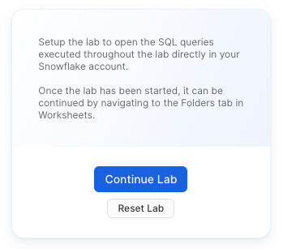
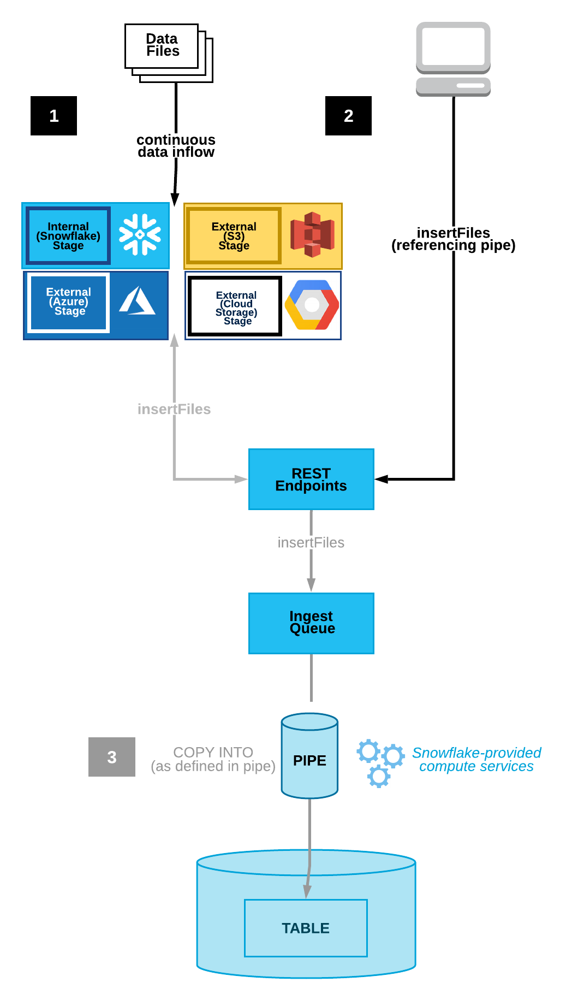
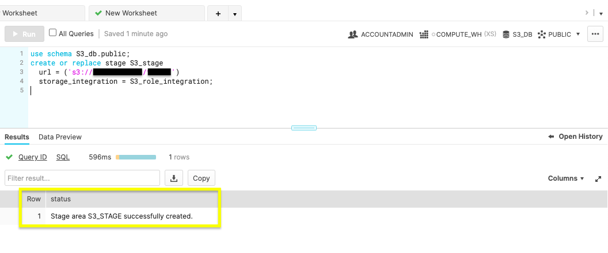
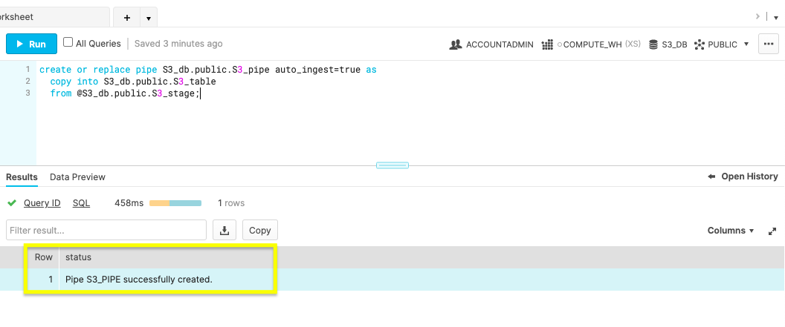
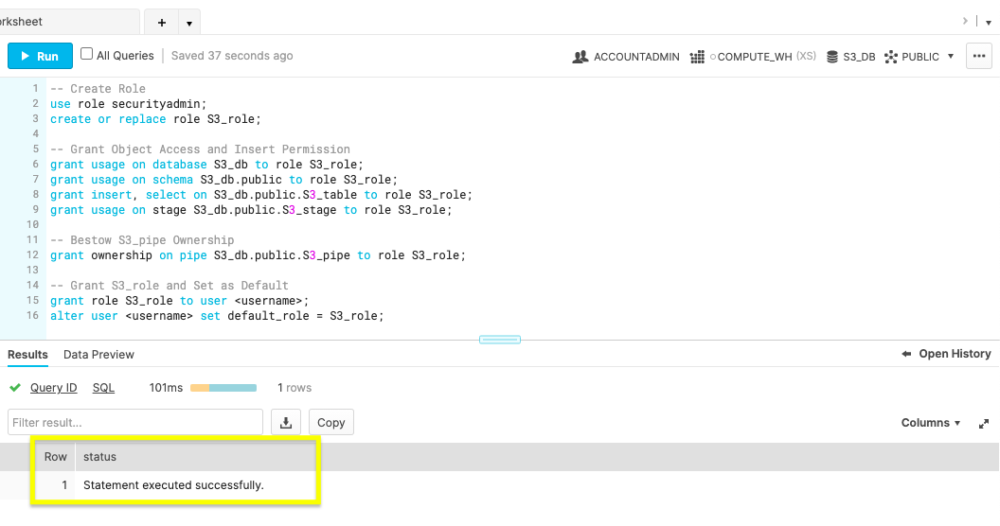
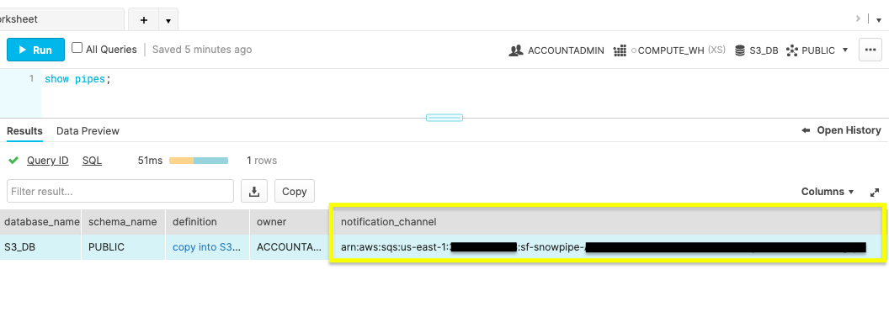
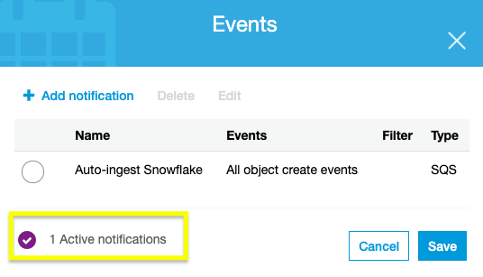

summary: This guide will help you get started with Snowpipe.
id: getting_started_with_snowpipe
categories: featured,getting-started
environments: web
status: Published
feedback link: https://github.com/Snowflake-Labs/sfguides/issues
tags: Getting Started, AWS, SQL, Data Engineering, Snowpipe, auto-ingest

# Getting Started with Snowpipe
<!-- ------------------------ -->
## Overview 
Duration: 1

When building data applications, your users count on seeing the latest. Stale data is less actionable and could lead to costly errors. That's why continuously generated data is essential. Snowflake provides a data loading tool to drive updates, ensuring your databases are accurate by updating tables in micro-batches.

Let's look into how Snowpipe can be configured for continual loading. Then, we can review how you can efficiently perform basic management tasks. But first, If you’re unfamiliar with Snowflake or loading database objects, check out these resources to get familiar with the topics ahead.

### Prerequisites
- Quick Video [Introduction to Snowflake](https://www.youtube.com/watch?v=fEtoYweBNQ4&ab_channel=SnowflakeInc.)
- Snowflake [Data Loading Basics](https://www.youtube.com/watch?v=us6MChC8T9Y&ab_channel=SnowflakeInc.) Video
- AWS S3 Service [Documentation](https://docs.aws.amazon.com/AmazonS3/latest/gsg/GetStartedWithS3.html)

### What You’ll Learn 
- Snowpipe staging methods
- Configure security access for Snowflake and AWS
- Automate Snowpipe with AWS S3 event notifications
- Manage Snowpipe and remove
- Next steps with database automation

### What You’ll Need 
- Create a [Snowflake account](https://signup.snowflake.com/?lab=getStartedWithSnowpipe&utm_cta=quickstart-getstartedwithsnowpipe-en) with an **ACCOUNTADMIN** role
- AWS [Account](https://aws.amazon.com/free/?sc_icampaign=acq_aws_takeover-1st-visit-free-tier&sc_ichannel=ha&sc_icontent=awssm-evergreen-1st-visit&sc_iplace=hero&trk=ha_awssm-evergreen-1st-visit&all-free-tier.sort-by=item.additionalFields.SortRank&all-free-tier.sort-order=asc) with access to a Snowflake supported [region](https://docs.snowflake.com/en/user-guide/intro-regions.html)

### What You’ll Build 
- Automated data loading with Snowpipe between AWS S3 bucket and Snowflake database.

After ensuring the prerequisites detailed in this section, jump into the queueing data integration options with Snowpipe.

<!-- ------------------------ -->
## Setting up Snowflake
Duration: 2

### Login and Setup Lab
Log into your Snowflake account or [signup for a free trial](https://signup.snowflake.com/?lab=getStartedWithSnowpipe&utm_cta=quickstart-getstartedwithsnowpipe-en). You can access the SQL commands we will execute throughout this lab directly in your Snowflake account by setting up your environment below:

<button>[Setup Lab Environment](https://app.snowflake.com/resources/labs/getStartedWithSnowpipe)</button>

This will create worksheets containing the lab SQL that can be executed as we step through this lab.


Once the lab has been setup, it can be continued by revisiting the [lab details page](https://app.snowflake.com/resources/labs/getStartedWithSnowpipe) and clicking `Continue Lab`



or by navigating to Worksheets and selecting the `Getting Started with Snowpipe` folder.


<!-- ------------------------ -->
## Choose the Data Ingestion Method
Duration: 2

Snowpipe is an event based data ingest tool. Snowpipe provides two main methods for triggering a data loading event. This trigger could be a cloud storage notification (i.e. AWS S3 `ObjectCreated` event) or by directly calling the Snowpipe `insertFiles` REST API.

1. Cloud Storage Event Notifications (AWS S3, GCP CS, Azure Blob)
2. Snowpipe’s REST API 

This tutorial follows option 1, automating continuous data loading with cloud event notifications on AWS S3. In the next section, we’ll configure your cloud notification preferences.



The image above reveals the two Snowpipe workflows. Option one shows continuous data loading with cloud storage event notifications. Option two illustrates queueing data with a REST API call to the `insertFiles` endpoint. 

<!-- ------------------------ -->
## Configure Cloud Storage Event Notifications
Duration: 3

Notifications from your cloud storage infrastructure are a straight-forward way to trigger Snowpipe for continuous loading. 

Cloud Storage Platforms Snowpipe Supports

- Google Cloud Storage
- Microsoft Azure Blob Storage
- AWS S3

This tutorial focuses on using AWS S3 buckets with Snowpipe. Visit Snowflake’s documentation to learn more about connecting Snowpipe to [Google Cloud Storage](https://docs.snowflake.com/en/user-guide/data-load-snowpipe-auto-gcs.html) or [Microsoft Azure Blob Storage](https://docs.snowflake.com/en/user-guide/data-load-snowpipe-auto-azure.html).

Choosing AWS S3 with Snowpipe integration allows you to decide between using an S3 event notification or Amazon’s Simple Notification Service(SNS) to stage data for integration. Check if you currently have S3 event notifications that may conflict with a new notification. If so, you’ll want to opt for SNS notifications. If not, the simple choice is to trigger continuous integration with S3 event notifications. Be aware that SNS network traffic travels outside of Amazon’s VPC. If the potential security risk is an issue, consider employing AWS’s PrivateLink service.

Let’s go over the access requirements needed to begin using S3 event notifications to load new data seamlessly in micro-batches.

<!-- ------------------------ -->
## Configure Cloud Storage Permissions
Duration: 8

To begin using AWS storage notifications for Snowpipe processing, you’ll follow these steps within your AWS and Snowflake account to set up the security conditions.

1. Create IAM Policy for Snowflake’s S3 Access

Snowflake needs IAM policy permission to access your S3 with `GetObject`, `GetObjectVersion`, and `ListBucket`. Log into your AWS console and navigate to the IAM service. Within the **Account settings**, confirm the **Security Token Service** list records your account’s region as **Active**.

Navigate to **Policies** and use the JSON below to create a new IAM policy named 'snowflake_access’.

```
{
    "Version": "2012-10-17",
    "Statement": [
        {
            "Effect": "Allow",
            "Action": [
                "s3:GetObject",
                "s3:GetObjectVersion"
            ],
            "Resource": "arn:aws:s3:::<bucket>/<prefix>/*"
        },
        {
            "Effect": "Allow",
            "Action": "s3:ListBucket",
            "Resource": "arn:aws:s3:::<bucket>",
            "Condition": {
                "StringLike": {
                    "s3:prefix": [
                        "*"
                    ]
                }
            }
        }
    ]
}
```
Don’t forget to replace the `<bucket>` and `<prefix>` with **your** AWS S3 bucket name and folder path prefix.

2. New IAM Role

On the AWS IAM console, add a new IAM role tied to the ‘snowflake_access’ IAM policy. Create the role with the following settings.

- **Trusted Entity**: Another AWS account
- **Account ID**: <your_account_id>
- **Require External ID**: [x]
- **External ID**: 0000
- **Role Name**: snowflake_role
- **Role Description**: Snowflake role for access to S3 `<bucket>`
- **Policies**: snowflake_access

Create the role, then click to see the role’s summary and record the **Role ARN**.

3. Integrate IAM user with Snowflake storage.

Within your Snowflake web console, you’ll run a `CREATE STORAGE INTEGRATION` command on a worksheet.
```
CREATE OR REPLACE STORAGE INTEGRATION S3_role_integration
  TYPE = EXTERNAL_STAGE
  STORAGE_PROVIDER = S3
  ENABLED = TRUE
  STORAGE_AWS_ROLE_ARN = "arn:aws:iam::<role_account_id>:role/snowflake_role"
  STORAGE_ALLOWED_LOCATIONS = ("s3://<bucket>/<path>/”);
```
Be sure to change the `<bucket>`, `<prefix>` and `<role_account_id>` is replaced with *your* AWS S3 bucket name, folder path prefix, and IAM role account ID.


Note in the figure above the **ACCOUNTADMIN** role and status message of a successful creation.

4. Run storage integration description command.

```
desc integration S3_role_integration;
```

Run the above command to display your new integration’s description.

Record the property values displayed for `STORAGE_AWS_IAM_USER_ARN` and `STORAGE_AWS_EXTERNAL_ID`. 

5. IAM User Permissions

Navigate back to your AWS IAM service console. Within the **Roles**, click the ‘snowflake_role’. On the **Trust relationships** tab, click **Edit trust relationship** and edit the file with the `STORAGE_AWS_IAM_USER_ARN` and `STORAGE_AWS_EXTERNAL_ID` retrieved in the previous step.

```
{
  "Version": "2012-10-17",
  "Statement": [
    {
      "Effect": "Allow",
      "Principal": {
        "AWS": "<STORAGE_AWS_IAM_USER_ARN>"
      },
      "Action": "sts:AssumeRole",
      "Condition": {
        "StringEquals": {
          "sts:ExternalId": "<STORAGE_AWS_EXTERNAL_ID>"
        }
      }
    }
  ]
}
```
**Update Trust Policy** after replacing the string values for *your* `STORAGE_AWS_IAM_USER_ARN` and `STORAGE_AWS_EXTERNAL_ID`.

After completing this section, your AWS and Snowflake account permissions are ready for Snowpipe. The next section provides the steps to perform automated micro-batching with cloud notifications triggering Snowpipe.

## Create a pipe in Snowflake
Duration: 8

Now that your AWS and Snowflake accounts have the right security conditions, complete Snowpipe setup with S3 event notifications.

1. Create a Database, Table, Stage, and Pipe

On a fresh Snowflake web console worksheet, use the commands below to create the objects needed for Snowpipe ingestion.

**Create Database**

```sql
create or replace database S3_db;
```

Execute the above command to create a database called ‘S3_db’. The **Results** output will show a status message of `Database S3_DB successfully created`.

**Create Table**

```sql
create or replace table S3_table(files string);
```

This command will make a table by the name of ‘S3_table’ on the S3_db database. The **Results** output will show a status message of `Table S3_TABLE successfully created`.

**Create Stage**

```sql
use schema S3_db.public;
create or replace stage S3_stage
  url = ('s3://<bucket>/<path>/')
  storage_integration = S3_role_integration;
```

To make the external [stage](https://docs.snowflake.com/en/sql-reference/sql/create-stage.html) needed for our S3 bucket, use this command. Be mindful to replace the `<bucket>` and `<path>` with your S3 bucket name and file path.


The figure above shows *Results* reading ‘Stage area S3_STAGE successfully created’.

**Create Pipe**

The magic of automation is in the [create pipe](https://docs.snowflake.com/en/sql-reference/sql/create-pipe.html) parameter, `auto_ingest=true`. With auto_ingest set to true, data stagged will automatically integrate into your database.

```sql
create or replace pipe S3_db.public.S3_pipe auto_ingest=true as
  copy into S3_db.public.S3_table
  from @S3_db.public.S3_stage;
```


Confirm you receive a status message of, ‘Pipe S3_PIPE successfully created’.

2. Configure Snowpipe User Permissions

To ensure the Snowflake user associated with executing the Snowpipe actions had sufficient permissions, create a unique role to manage Snowpipe security privileges. Do not employ the user account you're currently utilizing, instead create a new user to assign to Snowpipe within the web console.

```sql
-- Create Role
use role securityadmin;
create or replace role S3_role;

-- Grant Object Access and Insert Permission
grant usage on database S3_db to role S3_role;
grant usage on schema S3_db.public to role S3_role;
grant insert, select on S3_db.public.S3_table to role S3_role;
grant usage on stage S3_db.public.S3_stage to role S3_role;

-- Bestow S3_pipe Ownership
grant ownership on pipe S3_db.public.S3_pipe to role S3_role;

-- Grant S3_role and Set as Default
grant role S3_role to user <username>;
alter user <username> set default_role = S3_role;
```



Create a new role named `S3_role` with *SECURITYADMIN* access. Give the `S3_role` usage permissions to the database objects, insert permission for the `S3_table` and ownership of `S3_pipe`. Lastly, set the S3_role as a Snowflake user’s default. Confirm the statement was successful before creating the S3 event notification.

3. New S3 Event

Run the `show pipes` command to record the ARN listed in the ‘notification_channel’ column.

```sql
show pipes;
```



Copy the ARN because you’ll need it to configure the S3 event notification.

Sign in to your AWS account and navigate to the S3 service console. Select the bucket being used for Snowpipe and go to the **Properties** tab. The **Events** card listed will allow you to **Add notification**. Create a notification with the values listed.

- **Name**: Auto-ingest Snowflake
- **Events**: All object create events
- **Send to**: SQS Queue
- **SQS**: Add SQS queue ARN
- **SQS queue ARN:** <S3_pipe_ARN>


Snowpipe’s automated micro-batching is now active. Learn how to manage database integration in the next step.

<!-- ------------------------ -->
## Manage and Remove Pipes
Duration: 3

Snowpipe is configured and now updates the Snowflake database when any object is created in the AWS S3 bucket. Let’s review a few common commands to manage and remove Snowpipe.

**ALTER PIPE**

- Pause Snowpipe
  
```sql
ALTER PIPE … SET PIPE_EXECUTION_PAUSED = true
```

Before making configuration changes with `ALTER PIPE`, stop the Snowpipe process by pausing it by setting `PIPE_EXECUTION_PAUSED` to true. Once you’re ready to start the pipe again, set this parameter to false.

- Check Snowpipe Status
  
```sql
SYSTEM$PIPE_STATUS
```
To check the status of the pipe, run the above command.

**DROP PIPE**

```sql
drop pipe S3_db.public.S3_pipe;
```

The `drop` command will delete your Snowpipe once you are finished with this tutorial.

**SHOW PIPE** 

```sql
show pipes
```

Confirm the pipe was removed by displaying all of the pipes.

After wrapping up this section, you’re ready to look ahead to using Snowpipe on your applications.

<!-- ------------------------ -->
## Conclusion
Duration: 2

You’ve learned the benefits of continuous data loading and the different ways Snowpipe can be triggered to load new data. Plus, you can now configure cloud storage event notifications and manage Snowpipe. 

Review the various ways to implement Snowpipe. If you’re contemplating migrating an active database, select the staging method best for your architecture, and test the workflow on a small dataset. Experimenting will allow for an accurate cost-benefit analysis. If you aren’t gearing up to migrate, you quickly fire up a [Java or Python SDK](https://docs.snowflake.com/en/user-guide/data-load-snowpipe-rest-gs.html) to see how Snowpipe uses REST API endpoints for data integration.

### What we've covered
- Snowpipe Continuous Data Loading vs SnowPipe REST API
- Configuring AWS S3 event notifications for Snowpipe
- Creating, managing, and deleting pipes in Snowflake

To learn more about Snowpipe, checkout the [Snowpipe reference documentation](https://docs.snowflake.com/en/user-guide/data-load-snowpipe-intro.html).