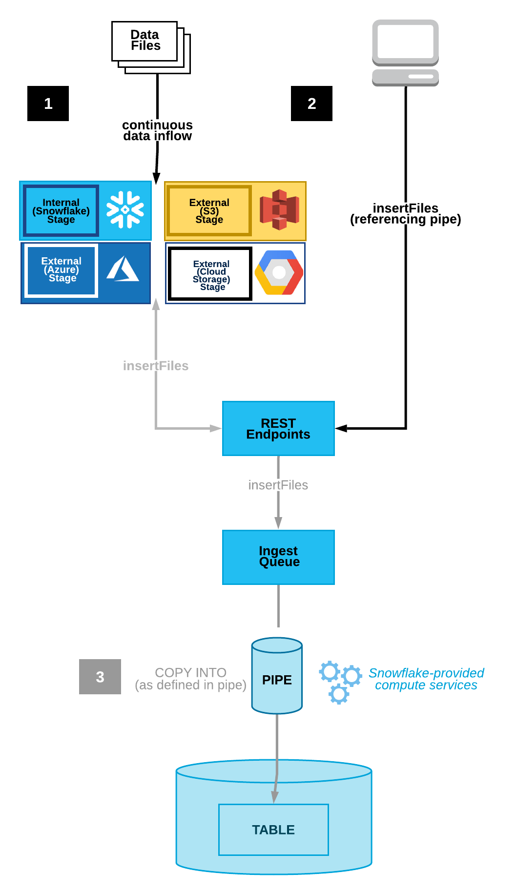
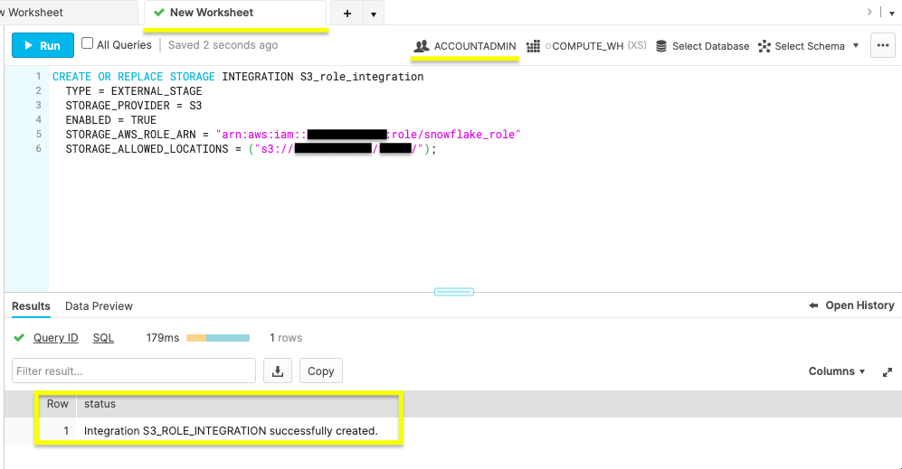
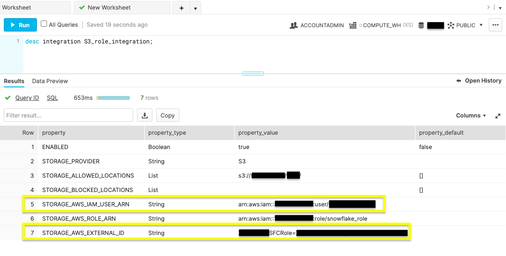
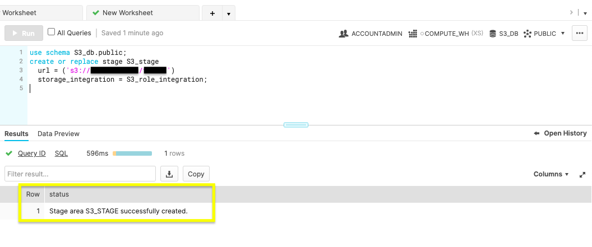
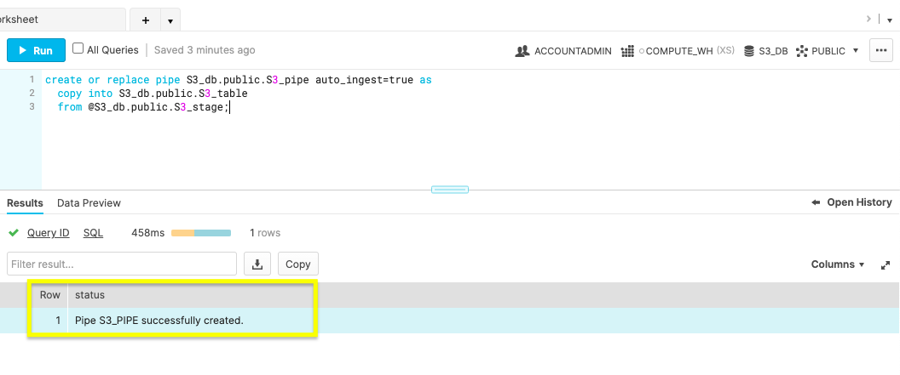
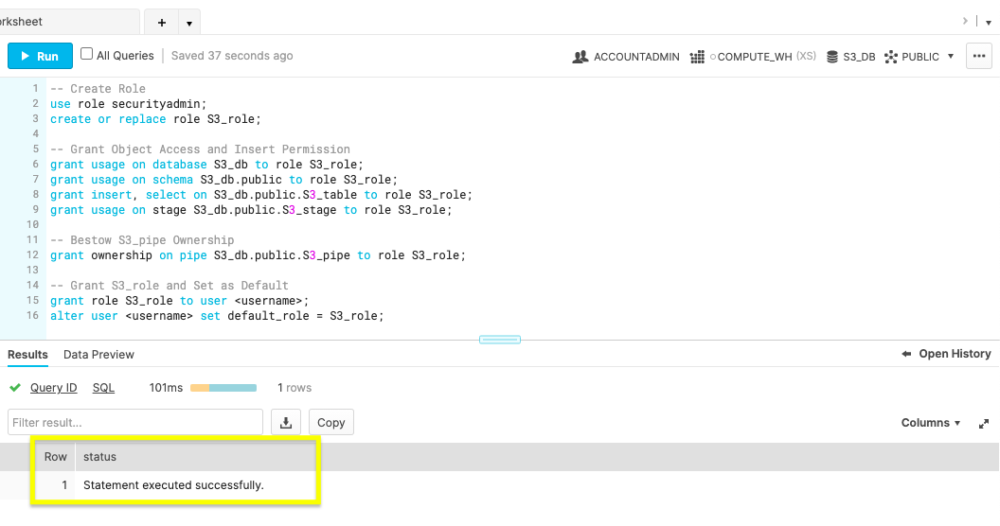
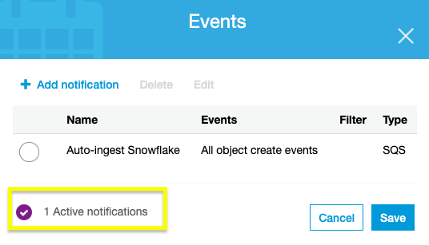

summary: 이 가이드는 Snowpipe를 시작하는 데 도움이 됩니다. 
id: getting_started_with_snowpipe_kr
categories: Getting-Started
environments: web
status: Hidden
feedback link: https://github.com/Snowflake-Labs/sfguides/issues 
tags: 스노우플레이크 시작하기, AWS, SQL, 데이터 엔지니어링, Snowpipe, 자동 수집, kr

# Snowpipe 시작하기

<!-- ------------------------ -->
## 개요

Duration: 1

데이터 애플리케이션을 구축할 때 여러분의 사용자는 최신 데이터를 보기를 기대합니다. 오래된 데이터는 실행 가능성이 낮으며 많은 비용이 드는 오류를 초래할 수 있습니다. 이는 지속적으로 생성된 데이터가 중요한 이유입니다. Snowflake는 데이터 로딩 도구를 제공하여 업데이트를 추진하고, 마이크로 배치에 있는 데이터를 업데이트하여 여러분의 데이터베이스 정확도를 보장합니다.

지속적인 로딩을 위해 Snowpipe를 어떻게 구성할 수 있는지 알아보겠습니다. 그런 다음 여러분이 효율적으로 기본 관리 작업을 수행할 수 있는 방법을 검토할 수 있습니다. 그러나 우선 Snowflake나 데이터베이스 오브젝트 로딩에 익숙하지 않다면 앞으로 다룰 주제에 익숙해지기 위해 다음 리소스를 확인하십시오.

### 사전 필요 조건 및 지식

- 짧은 [Snowflake 소개](https://www.youtube.com/watch?v=fEtoYweBNQ4&ab_channel=SnowflakeInc.) 동영상
- Snowflake [데이터 로딩 기본 사항](https://www.youtube.com/watch?v=us6MChC8T9Y&ab_channel=SnowflakeInc.) 동영상
- AWS S3 서비스 [설명서](https://docs.aws.amazon.com/AmazonS3/latest/gsg/GetStartedWithS3.html)

### 학습할 내용

- Snowpipe 스테이징 메서드
- Snowflake 및 AWS를 위한 보안 액세스 구성
- AWS S3 이벤트 알림으로 Snowpipe 자동화
- Snowpipe 관리 및 삭제
- 데이터베이스 자동화의 다음 단계

### 필요한 것

- **ACCOUNTADMIN** 역할을 가진 [Snowflake 계정](https://signup.snowflake.com/) 생성
- Snowflake 지원 [지역](https://docs.snowflake.com/ko/user-guide/intro-regions.html)에 대한 액세스를 가진 AWS [계정](https://aws.amazon.com/free/?sc_icampaign=acq_aws_takeover-1st-visit-free-tier&sc_ichannel=ha&sc_icontent=awssm-evergreen-1st-visit&sc_iplace=hero&trk=ha_awssm-evergreen-1st-visit&all-free-tier.sort-by=item.additionalFields.SortRank&all-free-tier.sort-order=asc)

### 구축할 것

- AWS S3 버킷과 Snowflake 데이터베이스 간에 Snowpipe를 통해 자동화된 데이터 로딩

이 섹션에서 자세히 설명한 사전 필요조건을 준비한 다음 Snowpipe를 통한 대기 데이터 통합 옵션을 알아보겠습니다.

<!-- ------------------------ -->
## 데이터 수집 메서드 선택

Duration: 2

Snowpipe는 이벤트 기반 데이터 수집 도구입니다. Snowpipe는 데이터 로딩 이벤트를 트리거하기 위한 2개의 기본 메서드를 제공합니다. 이 트리거는 클라우드 저장소 알림(예: AWS S3 `ObjectCreated` 이벤트)일 수 있습니다. 또는 직접 Snowpipe `insertFiles` REST API를 호출하기도 합니다.

1. 클라우드 저장소 이벤트 알림(AWS S3, GCP CS, Azure Blob)
2. Snowpipe의 REST API

이 자습서는 AWS S3에서 클라우드 이벤트 알림을 통해 지속적인 데이터 로딩을 자동화하는 옵션 1을 따릅니다. 다음 섹션에서는 여러분의 클라우드 알림 기본 설정을 구성하겠습니다.



위 이미지는 2가지 Snowpipe 워크플로를 선보입니다. 옵션 1은 클라우드 저장소 이벤트 알림을 통한 지속적인 데이터 로딩을 나타냅니다. 옵션 2는 `insertFiles` 엔드포인트 대상 REST API 호출을 통한 대기 데이터를 묘사합니다.

<!-- ------------------------ -->
## 클라우드 저장소 이벤트 알림 구성

Duration: 3

여러분의 클라우드 저장소 인프라에서 전송하는 알림은 지속적인 로딩을 위해 Snowpipe를 트리거하는 직접적인 방법입니다.

Snowpipe가 지원하는 클라우드 저장소 플랫폼

- Google Cloud Storage
- Microsoft Azure Blob Storage
- AWS S3

이 자습서는 Snowpipe를 통해 AWS S3 버킷을 사용하는 데 집중합니다. Snowflake 설명서를 방문하여 [Google Cloud Storage](https://docs.snowflake.com/ko/user-guide/data-load-snowpipe-auto-gcs.html) 또는 [Microsoft Azure Blob Storage](https://docs.snowflake.com/ko/user-guide/data-load-snowpipe-auto-azure.html)와 Snowpipe를 연결하는 것에 대해 자세히 알아보십시오.

AWS S3 및 Snowpipe 통합을 선택하면 통합을 위한 데이터를 스테이징하기 위해 S3 이벤트 알림을 사용할지 아니면 Amazon의 SNS(Simple Notification Service)를 사용할지를 결정할 수 있습니다. 새로운 알림과 충돌할 수 있으니 현재 S3 이벤트 알림이 있는지 확인하십시오. 있다면 SNS 알림을 선택하는 것이 좋습니다. 없다면 단순한 선택지는 S3 이벤트 알림을 통해 지속적인 통합을 트리거하는 것입니다. 참고로 SNS 네트워크 트래픽은 Amazon의 VPC 외부로 이동합니다. 잠재적 보안 위험이 이슈라면 AWS의 PrivateLink 서비스 사용을 고려하십시오.

마이크로 배치에서 새로운 데이터를 원활하게 로드하기 위해 S3 이벤트 알림 사용 시작에 필요한 액세스 요구 사항을 다뤄 보겠습니다.

<!-- ------------------------ -->
## 클라우드 저장소 권한 구성

Duration: 8

Snowpipe 처리를 위해 AWS 저장소 알림 사용을 시작하려면 여러분의 AWS와 Snowflake 계정 내에서 다음 단계에 따라 보안 조건을 설정하십시오.

1. Snowflake의 S3 액세스를 위한 IAM 정책 생성

Snowflake는 `GetObject`, `GetObjectVersion` 및 `ListBucket`으로 여러분의 S3에 액세스하려면 IAM 정책 권한이 필요합니다. 여러분의 AWS 콘솔에 로그인하고 IAM 서비스로 이동합니다. **Account settings** 내 **Security Token Service** 목록에서 여러분의 계정 지역이 **Active**로 기록되어 있는지 확인합니다.

**Policies**로 이동하고 아래 JSON을 사용하여 'snowflake_access'라는 새로운 IAM 정책을 생성합니다.

```
{
    "Version": "2012-10-17",
    "Statement": [
        {
            "Effect": "Allow",
            "Action": [
                "s3:GetObject",
                "s3:GetObjectVersion"
            ],
            "Resource": "arn:aws:s3:::<bucket>/<prefix>/*"
        },
        {
            "Effect": "Allow",
            "Action": "s3:ListBucket",
            "Resource": "arn:aws:s3:::<bucket>",
            "Condition": {
                "StringLike": {
                    "s3:prefix": [
                        "*"
                    ]
                }
            }
        }
    ]
}
```

**여러분의** AWS S3 버킷 이름과 폴더 경로 접미사로 `<bucket>` 및 `<prefix>`를 대체해야 합니다.

2. 새로운 IAM 역할

AWS IAM 콘솔에서 'snowflake_access' IAM 정책과 관련된 새로운 IAM 역할을 추가합니다. 다음과 같이 설정된 역할을 생성합니다.

- **Trusted Entity**: 또 다른 AWS 계정
- **Account ID**: <your_account_id>
- **Require External ID**: [X] 
- **External ID**: 0000
- **Role Name**: snowflake_role
- **Role Description**: S3 `<bucket>`에 대한 액세스를 위한 Snowflake 역할
- **Policies**: snowflake_access

역할을 생성한 다음 클릭하여 역할의 요약을 확인하고 **Role ARN**을 기록합니다.

3. IAM 사용자를 Snowflake 저장소와 통합합니다.

여러분의 Snowflake 웹 콘솔 내 워크시트에서 `CREATE STORAGE INTEGRATION` 명령을 실행하겠습니다.

```
CREATE OR REPLACE STORAGE INTEGRATION S3_role_integration
  TYPE = EXTERNAL_STAGE
  STORAGE_PROVIDER = S3
  ENABLED = TRUE
  STORAGE_AWS_ROLE_ARN = "arn:aws:iam::<role_account_id>:role/snowflake_role"
  STORAGE_ALLOWED_LOCATIONS = ("s3://<bucket>/<path>/”);
```

`<bucket>`, `<prefix>` 및 `<role_account_id>`를 *여러분의* AWS S3 버킷 이름, 폴더 경로 접미사 및 IAM 역할 계정 ID로 대체해야 합니다.

 위 그림에서 **ACCOUNTADMIN** 역할과 성공적인 생성 상태 메시지를 확인하십시오.

4. 저장소 통합 설명 명령을 실행합니다.

```
desc integration S3_role_integration;
```

위 명령을 실행하여 여러분의 새로운 통합의 설명을 표시합니다.  `STORAGE_AWS_IAM_USER_ARN` 및 `STORAGE_AWS_EXTERNAL_ID`를 위해 표시된 속성값을 기록합니다.

5. IAM 사용자 권한

여러분의 AWS IAM 서비스 콘솔로 되돌아갑니다. **Roles** 내에서 'snowflake_role'을 클릭합니다. **Trust relationships** 탭에서 **Edit trust relationship**을 클릭하고 이전 단계에서 찾았던 `STORAGE_AWS_IAM_USER_ARN` 및 `STORAGE_AWS_EXTERNAL_ID`가 포함된 파일을 편집합니다.

```
{
  "Version": "2012-10-17",
  "Statement": [
    {
      "Effect": "Allow",
      "Principal": {
        "AWS": "<STORAGE_AWS_IAM_USER_ARN>"
      },
      "Action": "sts:AssumeRole",
      "Condition": {
        "StringEquals": {
          "sts:ExternalId": "<STORAGE_AWS_EXTERNAL_ID>"
        }
      }
    }
  ]
}
```

*여러분의* `STORAGE_AWS_IAM_USER_ARN` 및 `STORAGE_AWS_EXTERNAL_ID`를 위한 문자열 값을 대체한 후 **Update Trust Policy**를 클릭합니다.

이 섹션을 완료한 후 여러분의 AWS와 Snowflake 계정 권한이 Snowpipe를 위해 준비되었습니다. 다음 섹션에서는 Snowpipe를 트리거하는 클라우드 알림을 통해 자동화된 마이크로 배치를 수행하기 위한 단계를 제공합니다.

## Snowflake에서 파이프 생성

Duration: 8

이제 여러분의 AWS와 Snowflake 계정이 올바른 보안 조건이 갖추고 있으니 S3 이벤트 알림을 통해 Snowpipe 설정을 마무리하십시오.

1. 데이터베이스, 테이블, 스테이지 및 파이프 생성

새 Snowflake 웹 콘솔 워크시트에서 아래 명령을 사용하여 Snowpipe 수집에 필요한 오브젝트를 생성합니다.

**데이터베이스 생성**

```sql
create or replace database S3_db;
```

위 명령을 실행하여 'S3_db'라는 데이터베이스를 생성합니다. **Results** 출력은 `Database S3_DB successfully created`라는 상태 메시지를 표시합니다.

**테이블 생성**

```sql
create or replace table S3_table(files string);
```

이 명령은 S3_db 데이터베이스에 'S3_table'이라는 테이블을 생성합니다. **Results** 출력은 `Table S3_TABLE successfully created`라는 상태 메시지를 표시합니다.

**스테이지 생성**

```sql
use schema S3_db.public;
create or replace stage S3_stage
  url = ('s3://<bucket>/<path>/')
  storage_integration = S3_role_integration;
```

S3 버킷에 필요한 외부 [스테이지](https://docs.snowflake.com/ko/sql-reference/sql/create-stage.html)를 생성하기 위해 이 명령을 사용하십시오. 여러분의 S3 버킷 이름과 파일 경로로 `<bucket>` 및 `<path>`를 대체해야 합니다.

 위 그림은 'Stage area S3_STAGE successfully created'라는 *Results*를 보여줍니다.

**파이프 생성**

자동화의 마법은 [CREATE PIPE](https://docs.snowflake.com/ko/sql-reference/sql/create-pipe.html) 매개 변수인 `auto_ingest=true`에 있습니다. auto_ingest가 true로 설정되어 있다면 스테이징된 데이터는 자동으로 여러분의 데이터베이스로 통합됩니다.

```sql
create or replace pipe S3_db.public.S3_pipe auto_ingest=true as
  copy into S3_db.public.S3_table
  from @S3_db.public.S3_stage;
```

 여러분이 'Pipe S3_PIPE successfully created'라는 상태 메시지를 받았음을 확인합니다.

2. Snowpipe 사용자 권한 구성

Snowpipe 작업 실행과 관련된 Snowflake 사용자에게 충분한 권한이 있음을 보장하기 위해 Snowpipe 보안 권한을 관리하기 위한 고유한 역할을 생성합니다. 현재 여러분이 활용하고 있는 사용자 계정을 사용하지 마십시오. 대신 웹 콘솔 내에서 Snowpipe에 할당할 새로운 사용자를 생성하십시오.

```sql
-- Create Role
use role securityadmin;
create or replace role S3_role;

-- Grant Object Access and Insert Permission
grant usage on database S3_db to role S3_role;
grant usage on schema S3_db.public to role S3_role;
grant insert, select on S3_db.public.S3_table to role S3_role;
grant usage on stage S3_db.public.S3_stage to role S3_role;

-- Bestow S3_pipe Ownership
grant ownership on pipe S3_db.public.S3_pipe to role S3_role;

-- Grant S3_role and Set as Default
grant role S3_role to user <username>;
alter user <username> set default_role = S3_role;
```



*SECURITYADMIN* 액세스를 가진 `S3_role`이라는 새로운 역할을 생성합니다. 데이터베이스 오브젝트에 `S3_role` 사용 권한을 부여하고 `S3_table` 권한과 `S3_pipe` 소유권을 삽입합니다. 마지막으로 S3_role을 Snowflake 사용자의 기본값으로 설정합니다. S3 이벤트 알림을 생성하기 전에 문이 성공적이었는지 확인합니다.

3. 새로운 S3 이벤트

`show pipes` 명령을 실행하여 'notification_channel' 열에 나열된 ARN을 기록합니다.

```sql
show pipes;
```


S3 이벤트 알림 구성에 필요하기에 ARN을 복사합니다.

여러분의 AWS 계정에 로그인하고 S3 서비스 콘솔로 이동합니다. Snowpipe에 사용될 버킷을 선택하고 **Properties** 탭으로 이동합니다. 나열된 **Events** 카드를 통해 **Add notification** 작업이 가능합니다. 나열된 값으로 알림을 생성합니다.

- **Name**: Snowflake 자동 수집
- **Events**: 모든 오브젝트가 이벤트를 생성합니다
- **Send to**: SQS 큐
- **SQS**: SQS 큐 ARN 추가
- **SQS queue ARN:** <S3_pipe_ARN>

 Snowpipe의 자동화된 마이크로 배치가 이제 활성 상태입니다. 다음 단계에서 데이터베이스 통합 관리 방법에 대해 알아보십시오.

<!-- ------------------------ -->
## 파이프 관리 및 삭제

Duration: 3

Snowpipe가 구성되었으며 이제 AWS S3 버킷에서 어떠한 오브젝트가 생성되었을 때 Snowflake 데이터베이스를 업데이트합니다. Snowpipe 관리 및 삭제를 위한 몇몇 공통 명령을 검토하겠습니다.

**ALTER PIPE**

- Snowpipe 일시 중지

```sql
ALTER PIPE … SET PIPE_EXECUTION_PAUSED = true
```

구성에 `ALTER PIPE`로 변경 사항을 적용하기 전에 `PIPE_EXECUTION_PAUSED`를 true로 설정하고 일시 중지하여 Snowpipe 프로세스를 중지합니다. 파이프를 다시 시작할 준비가 되었다면 이 매개 변수를 false로 설정합니다.

- Snowpipe 상태 확인

```sql
SYSTEM$PIPE_STATUS
```

파이프 상태를 확인하기 위해 위 명령을 실행합니다.

**DROP PIPE**

```sql
drop pipe S3_db.public.S3_pipe;
```

`drop` 명령은 이 자습서가 끝난 뒤에 여러분의 Snowpipe를 삭제합니다.

**SHOW PIPE**

```sql
show pipes
```

모든 파이프를 표시하여 파이프가 삭제되었는지 확인합니다.

이 섹션을 끝낸 후 여러분은 애플리케이션에서 Snowpipe를 사용할 준비가 되었습니다.

<!-- ------------------------ -->
## 결론

Duration: 2

지속적인 데이터 로딩의 이점과 새로운 데이터를 로드하기 위해 Snowpipe를 트리거할 수 있는 다양한 방법을 배웠습니다. 또한 이제 클라우드 저장소 이벤트 알림을 구성하고 Snowpipe를 관리할 수 있습니다.

Snowpipe를 구현하는 다양한 방식을 검토하십시오. 활성 데이터베이스의 마이그레이션을 고려하고 있다면 여러분의 아키텍처에 가장 적합한 스테이징 메서드를 선택하고 소규모 데이터 세트에서 워크플로를 테스트하십시오. 실험을 통해 정확한 비용 편익 분석이 가능합니다. 마이그레이션을 준비하고 있다면 빠르게 [Java 또는 Python SDK](https://docs.snowflake.com/ko/user-guide/data-load-snowpipe-rest-gs.html)를 시작하여 Snowpipe가 데이터 통합을 위해 어떻게 REST API 엔드포인트를 사용하는지 확인하십시오.

### 다룬 내용

- Snowpipe 지속적인 데이터 로딩 vs Snowpipe REST API
- Snowpipe를 위한 AWS S3 이벤트 알림 구성
- Snowflake에서 파이프 생성, 관리 및 삭제

Snowpipe에 대해 자세히 알아보려면 [Snowpipe 참조 설명서](https://docs.snowflake.com/ko/user-guide/data-load-snowpipe-intro.html)를 확인하십시오.