id: getting_started_with_snowpipe_streaming_aws_msk
summary: This guide will walk you through how to apply a data-intensive approach to real-time data using Snowpipe Streaming and Amazon Managed Streaming for Apache Kafka (MSK).
categories: getting-started
environments: web
status: Published
feedback link: https://github.com/Snowflake-Labs/sfguides/issues
tags: Getting Started, Kafka, Streaming, Amazon MSK, Snowpipe Streaming, SnowSQL
authors: James Sun

# Getting Started with Snowpipe Streaming and Amazon MSK
<!---------------------------->
## Overview
Duration: 5

Snowflake's Snowpipe streaming capabilities are designed for rowsets with variable arrival frequency.
It focuses on lower latency and cost for smaller data sets. This helps data workers stream rows into Snowflake
without requiring files with a more attractive cost/latency profile.

Here are some of the use cases that can benefit from Snowpipe streaming:
- IoT time-series data ingestion
- CDC streams from OLTP systems
- Log ingestion from SIEM systems
- Ingestion into ML feature stores

In our demo, we will use real-time commercial flight data over the San Francisco Bay Area from the [Opensky Network](https://opensky-network.org) to illustrate the solution using 
Snowflake's Snowpipe streaming and [MSK (Amazon Managed Streaming for Apache Kafka)](https://aws.amazon.com/msk/).

The architecture diagram below shows the deployment. An MSK cluster and a Linux 
EC2 instance (jumphost) will be provisioned in private subnets of an AWS VPC. 
The Linux jumphost will host the Kafka producer and Snowpipe streaming via [Kafka Connect](https://docs.snowflake.com/en/user-guide/kafka-connector-overview.html).

The Kafka producer calls the data sources' REST API and receives time-series data in JSON format. This data is then ingested into the Kafka cluster before being picked up by the Kafka connector and delivered to a Snowflake table.
The data in Snowflake table can be visualized in real-time with [AMG (Amazon Managed Grafana)](https://aws.amazon.com/grafana/) and [Streamlit](https://streamlit.io)
The historical data can also be analyzed by BI tools like [Amazon Quicksight](https://aws.amazon.com/quicksight/?trk=56601b48-df3f-4cb4-9ef7-9f52efa1d0b8&sc_channel=ps&ef_id=Cj0KCQiA_bieBhDSARIsADU4zLebWWM6ZmxRODjR9Xlc7ztNm5JGwqEMSi0EjCLZ9CXYa1YvXL3LMYYaAnV_EALw_wcB:G:s&s_kwcid=AL!4422!3!629393324770!!!g!!).
Please note that in the demo, we are not demonstrating the visualization aspect. We will have a future Quickstart demo that focuses on visualization.

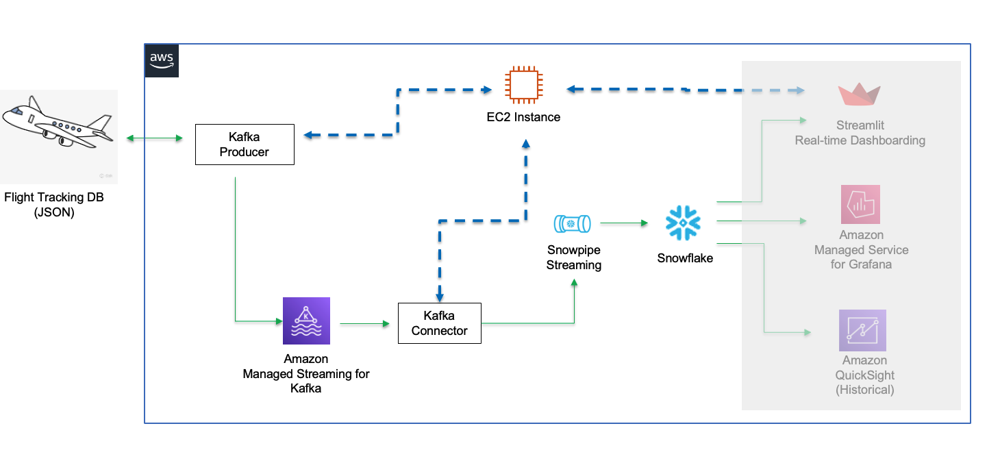


### Prerequisites

- Familiarity with Snowflake, basic SQL knowledge, Snowsight UI and Snowflake objects
- Familiarity with AWS Services (e.g. EC2, MSK, etc), Networking and the Management Console
- Basic knowledge of Python and Linux shell scripting

### What You'll Need Before the Lab

To participate in the virtual hands-on lab, attendees need the following resources.

- A [Snowflake Enterprise Account on preferred AWS region](https://signup.snowflake.com/) with `ACCOUNTADMIN` access
- An [AWS Account](https://aws.amazon.com/premiumsupport/knowledge-center/create-and-activate-aws-account/) with `Administrator Access`
- Create your own VPC and subnets (This is optional if you have an existing VPC with subnets you can leverage. Please refer
to this [AWS document](https://docs.aws.amazon.com/whitepapers/latest/amazon-msk-migration-guide/amazon-managed-streaming-for-apache-kafka-amazon-msk.html) for the MSK networking topology)
  - In the AWS account, [create a VPC](https://docs.aws.amazon.com/vpc/latest/userguide/working-with-vpcs.html), preferrably in the same region as the Snowflake account
  - In the VPC, [create subnets](https://docs.aws.amazon.com/vpc/latest/userguide/working-with-subnets.html) and attach an [internet gateway](https://docs.aws.amazon.com/vpc/latest/userguide/VPC_Internet_Gateway.html) to allow egress traffic to the internet by using a routing table and security group for outbound traffic.
  Note that the subnets can be public or private, for private subnets, you will need to attach a [NAT gateway](https://docs.aws.amazon.com/vpc/latest/userguide/vpc-nat-gateway.html) to allow egress traffic to the internet. Public subnets are sufficient for this lab.
  - Now if you have decided to create your own VPC/subnets, for your convenience, click [here](https://console.aws.amazon.com/cloudformation/home?region=us-west-2#/stacks/new?stackName=MSK-Snowflake-VPC&templateURL=https://snowflake-corp-se-workshop.s3.us-west-1.amazonaws.com/VHOL_Snowflake_Snowpipe_Streaming_MSK/MyFullVPC-2pub-2priv.json) to deploy a VPC with a pair of public and private subnets, internet gateway and NAT gateway for you. 
Note that you must have network administrator permissions to deploy these resources. 

### What You'll Learn

- Using [MSK (Amazon Managed Streaming for Apache Kafka)](https://aws.amazon.com/msk/)
- Connecting to EC2 instances with [Amazon System Session Manager](https://docs.aws.amazon.com/systems-manager/latest/userguide/session-manager.html), this is an alternative
to SSH if your instance is in a private subnet
- Using [SnowSQL](https://docs.snowflake.com/en/user-guide/snowsql.html), the command line client for connecting to Snowflake to execute SQL queries and perform all DDL and DML operations, including loading data into and unloading data out of database tables.
- Using Snowflake to query tables populated with time-series data

### What You'll Build

- [Create a provisioned Kafka cluster](https://docs.aws.amazon.com/msk/latest/developerguide/msk-create-cluster.html)
- Create Kafka producers and connectors
- Create topics in a Kafka cluster
- A Snowflake database for hosting real-time flight data

<!---------------------------->
## Create a provisioned Kafka cluster and a Linux jumphost in AWS
Duration: 30

#### 1. Create an MSK cluster and an EC2 instance
The MSK cluster is created in a VPC managed by Amazon. We will deploy our Kafka clients in our own VPC and use security groups to ensure
the communications between the MSK cluster and clients are secure. 

First, click [here](https://console.aws.amazon.com/cloudformation/home?region=us-west-2#/stacks/new?stackName=MSK-Snowflake&templateURL=https://snowflake-corp-se-workshop.s3.us-west-1.amazonaws.com/VHOL_Snowflake_Snowpipe_Streaming_MSK/msk-CFT-for-SE-Sandbox.json)
to launch a provisioned MSK cluster. Note the default AWS region is `us-west-2 (Oregon)`, feel free to select a region you prefer to deploy the environment.

Click `Next` at the `Create stack` page. 
Set the Stack name or modify the default value to customize it to your identity. Leave the default Kafka version as is. For `Subnet1` and `Subnet2`, in the drop-down menu, pick two different subnets respectively, they can be either public or private subnets depending on the network layout of your VPC. Please note that if
you plan to use [Amazon MSK Connect](https://aws.amazon.com/msk/features/msk-connect/) later, you should choose private subnets here. 
For `MSKSecurityGroupId`, we recommend
using the [default security group](https://docs.aws.amazon.com/AWSEC2/latest/UserGuide/default-custom-security-groups.html) in your VPC, if you do not have the default security group, [create one](https://docs.aws.amazon.com/vpc/latest/userguide/default-security-group.html) on your own before moving forward. Leave `TLSMutualAuthentication` as false and the jumphost instance type and AMI id as default before clicking
`Next`. 

See below sample screen capture for reference.

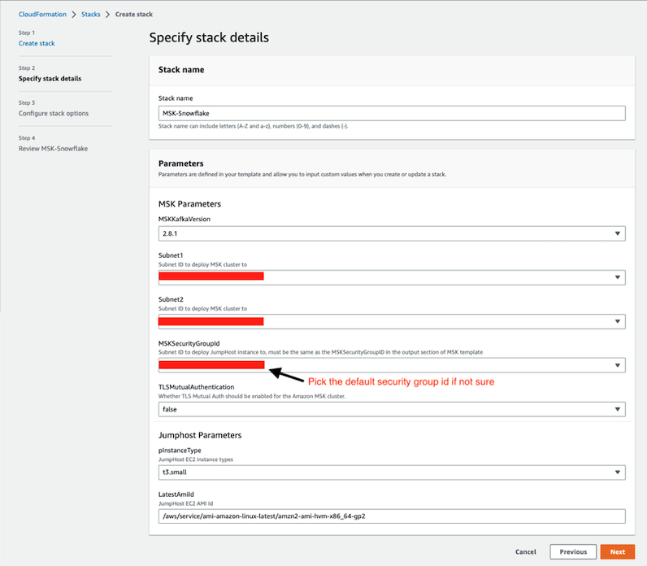

Leave everything as default in the `Configure stack options` page and click `Next`.
In the `Review` page, click `Submit`.

In about 10-30 minutes depending on your AWS region, the Cloudformation template provisions an MSK cluster with two brokers. It will also
provision a Linux EC2 instance in the subnet you selected. We will then use it to run the Kafka connector with Snowpipe streaming SDK and the producer.

#### 2. Configure the Linux session for timeout and default shell

In this step we need to connect to the EC2 instance in order to interact with the MSK cluster.

Go to the AWS [Systems Manager](https://us-west-2.console.aws.amazon.com/systems-manager/home) console in the same region where you setup the MSK cluster,
Click `Session Manager` on the left pane.

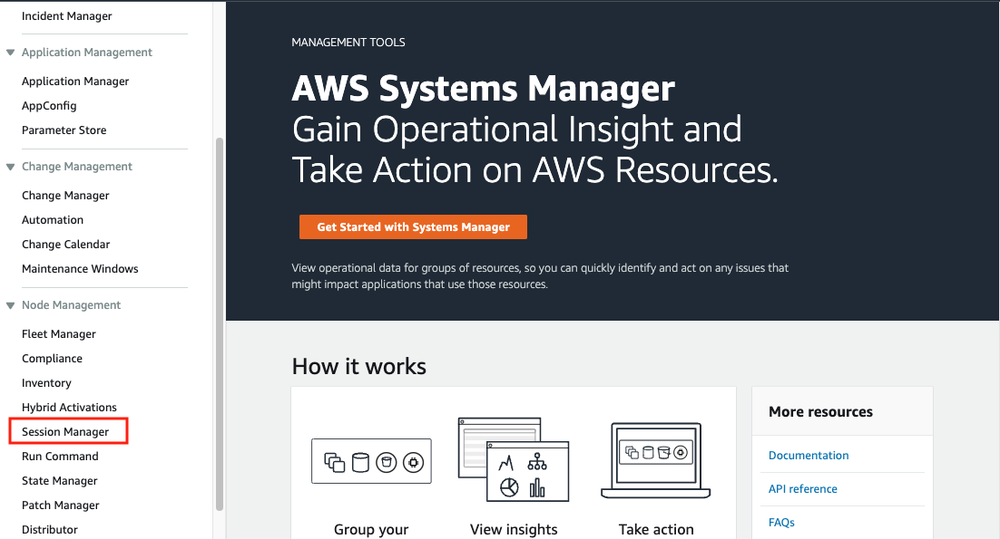

Next, we will set the preferred shell as bash.

Click the `Preferences` tab.
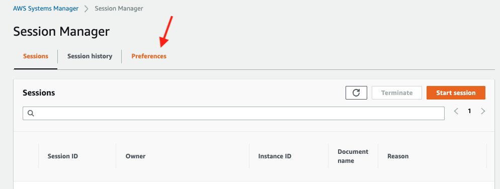

Click the `Edit` button.
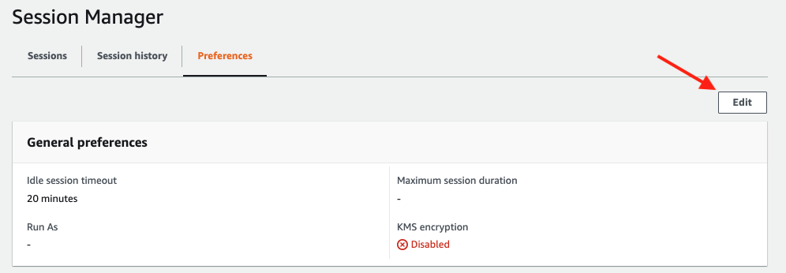

Go to `General preferences` section, type in 60 minutes for idle session timeout value.

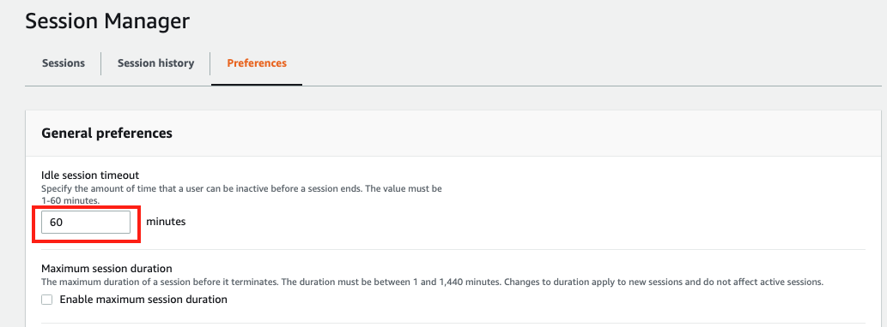

Further scroll down to `Linux shell profile` section, and type in `/bin/bash` before clicking `Save` button.


#### 3. Connect to the Linux EC2 instance console
Now go back to the `Session` tab and click the `Start session` button.


Now you should see the EC2 instance created by the Cloudformation template under `Target instances`.
Its name should be `<Cloudformation stack name>-jumphost`, select it and click `Start session`.

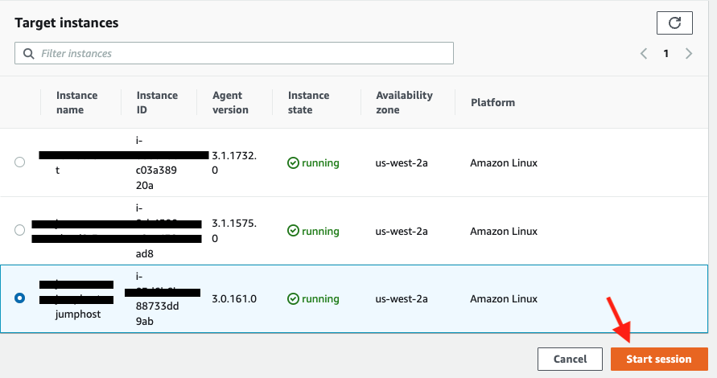

#### 4. Create a key-pair to be used for authenticating with Snowflake
Create a key pair in AWS Session Manager console by executing the following commands. You will be prompted to give an encryption password, remember 
this phrase, you will need it later.

```commandline
cd $HOME
openssl genrsa 2048 | openssl pkcs8 -topk8 -inform PEM -out rsa_key.p8
```
See below example screenshot:

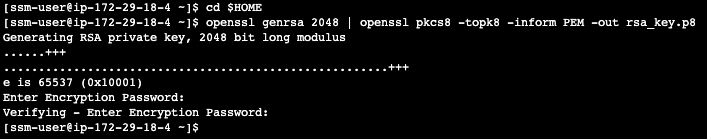

Next we will create a public key by running following commands. You will be prompted to type in the phrase you used in above step.
```
openssl rsa -in rsa_key.p8 -pubout -out rsa_key.pub
```
see below example screenshot:

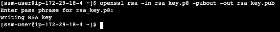

Next we will print out the public key string in a correct format that we can use for Snowflake.
```
grep -v KEY rsa_key.pub | tr -d '\n' | awk '{print $1}' > pub.Key
cat pub.Key
```
see below example screenshot:

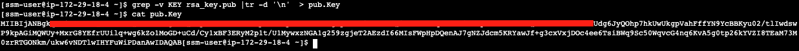


#### 5. Install the Kafka connector for Snowpipe streaming

Run the following command to install the Kafka connector and Snowpipe streaming SDK

```commandline
passwd=changeit  # Use the default password for the Java keystore, you should chang it after finishing the lab
directory=/home/ssm-user/snowpipe-streaming # Installation directory

cd $HOME
mkdir -p $directory
cd $directory
pwd=`pwd`
sudo yum clean all
sudo yum -y install openssl vim-common java-1.8.0-openjdk-devel.x86_64 gzip tar jq python3-pip
wget https://archive.apache.org/dist/kafka/2.8.1/kafka_2.12-2.8.1.tgz
tar xvfz kafka_2.12-2.8.1.tgz -C $pwd
wget https://github.com/aws/aws-msk-iam-auth/releases/download/v1.1.1/aws-msk-iam-auth-1.1.1-all.jar -O $pwd/kafka_2.12-2.8.1/libs/aws-msk-iam-auth-1.1.1-all.jar
rm -rf $pwd/kafka_2.12-2.8.1.tgz
cd /tmp && cp /usr/lib/jvm/java-openjdk/jre/lib/security/cacerts kafka.client.truststore.jks
cd /tmp && keytool -genkey -keystore kafka.client.keystore.jks -validity 300 -storepass $passwd -keypass $passwd -dname "CN=snowflake.com" -alias snowflake -storetype pkcs12

#Snowflake kafka connector
wget https://repo1.maven.org/maven2/com/snowflake/snowflake-kafka-connector/2.0.0/snowflake-kafka-connector-2.0.0.jar -O $pwd/kafka_2.12-2.8.1/libs/snowflake-kafka-connector-2.0.0.jar

#Snowpipe streaming SDK
wget https://repo1.maven.org/maven2/net/snowflake/snowflake-ingest-sdk/2.0.2/snowflake-ingest-sdk-2.0.2.jar -O $pwd/kafka_2.12-2.8.1/libs/snowflake-ingest-sdk-2.0.2.jar
wget https://repo1.maven.org/maven2/net/snowflake/snowflake-jdbc/3.13.15/snowflake-jdbc-3.13.15.jar -O $pwd/kafka_2.12-2.8.1/libs/snowflake-jdbc-3.13.15.jar
wget https://repo1.maven.org/maven2/org/bouncycastle/bc-fips/1.0.1/bc-fips-1.0.1.jar -O $pwd/kafka_2.12-2.8.1/libs/bc-fips-1.0.1.jar
wget https://repo1.maven.org/maven2/org/bouncycastle/bcpkix-fips/1.0.3/bcpkix-fips-1.0.3.jar -O $pwd/kafka_2.12-2.8.1/libs/bcpkix-fips-1.0.3.jar

```

#### 6. Retrieve the broker string from the MSK cluster.
Go to the [MSK](https://us-west-2.console.aws.amazon.com/msk/#/clusters) console and click the newly created MSK cluster, it should have a substring `MSKCluster` in its name.

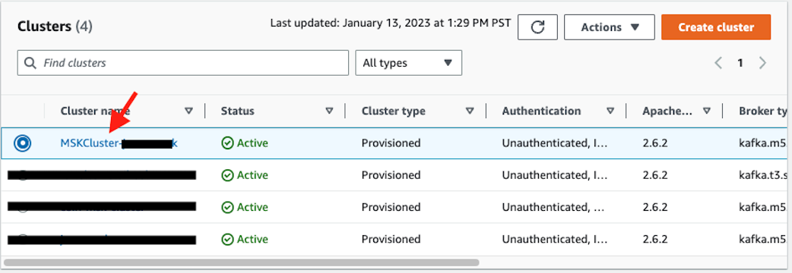

Click `View client information`
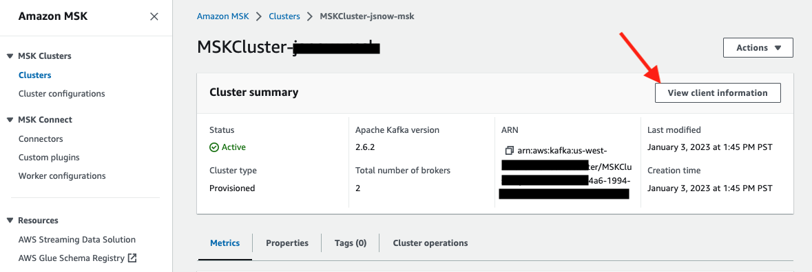

We are going to use TLS authentication between the client and brokers. Copy down the broker string under `Private endpoint` for TLS authentication type.
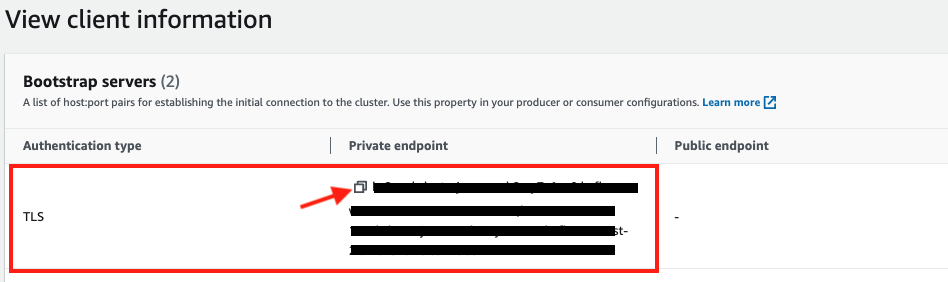

Now switch back to the Session Manager window and execute the following command by replacing `<broker string>` with 
the copied values.

```commandline
export BS=<broker string>
```

Now run the following command to add `BS` as an environment variable so it is recognized across the Linux sessions.
```
echo "export BS=$BS" >> ~/.bashrc
```
See the following example screen capture.

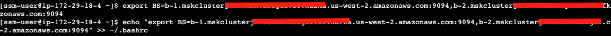
#### 7. Create a configuration file `connect-standalone.properties` for the Kafka connector

Run the following commands to generate a configuration file `connect-standalone.properties` in directory `/home/ssm-user/snowpipe-streaming/scripts` for the client to authenticate
with the Kafka cluster.

```commandline
dir=/home/ssm-user/snowpipe-streaming/scripts
mkdir -p $dir && cd $dir
cat << EOF > $dir/connect-standalone.properties
#************CREATING SNOWFLAKE Connector****************
bootstrap.servers=$BS

#************SNOWFLAKE VALUE CONVERSION****************
key.converter=org.apache.kafka.connect.storage.StringConverter
value.converter=com.snowflake.kafka.connector.records.SnowflakeJsonConverter
key.converter.schemas.enable=true
value.converter.schemas.enable=true
#************SNOWFLAKE ****************

offset.storage.file.filename=/tmp/connect.offsets
# Flush much faster than normal, which is useful for testing/debugging
offset.flush.interval.ms=10000

#*********** FOR SSL  ****************
security.protocol=SSL
ssl.truststore.location=/tmp/kafka.client.truststore.jks
ssl.truststore.password=changeit
ssl.enabled.protocols=TLSv1.1,TLSv1.2

consumer.security.protocol=SSL
consumer.ssl.truststore.location=/tmp/kafka.client.truststore.jks
consumer.ssl.truststore.password=changeit
consumer.ssl.enabled.protocols=TLSv1.1,TLSv1.2
EOF

```
A configuration file `connect-standalone.properties` is created in directory `/home/ssm-user/snowpipe-streaming/scripts`

#### 8. Create a security client.properties configuration file for the producer

Run the following commands to create a security configuration file `client.properties` for the MSK cluster
```commandline
dir=/home/ssm-user/snowpipe-streaming/scripts
cat << EOF > $dir/client.properties
security.protocol=SSL
ssl.truststore.location=/tmp/kafka.client.truststore.jks
ssl.truststore.password=changeit
ssl.enabled.protocols=TLSv1.1,TLSv1.2
EOF

```

A configuration file `client.properties` is created in directory `/home/ssm-user/snowpipe-streaming/scripts`

#### 9. Create a streaming topic called “streaming” in the MSK cluster

Now we can run the following commands to create a Kafka topic on the MSK cluster to stream our data.
 
```commandline
$HOME/snowpipe-streaming/kafka_2.12-2.8.1/bin/kafka-topics.sh --bootstrap-server $BS --command-config $HOME/snowpipe-streaming/scripts/client.properties --create --topic streaming --partitions 2 --replication-factor 2
```
You should see the response `Created topic streaming` if it is successful.

To describe the topic, run the following commands:
```commandline
$HOME/snowpipe-streaming/kafka_2.12-2.8.1/bin/kafka-topics.sh --bootstrap-server $BS --command-config $HOME/snowpipe-streaming/scripts/client.properties --describe --topic streaming
```
You should see there are two partitions with a replication factor of 2 in the `streaming` topic.
See below example screenshot:
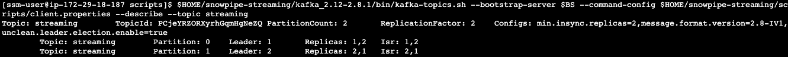

<!---------------------------->
## Prepare the Snowflake cluster for streaming
Duration: 10

#### 1. Creating user, role, and database
First login to your Snowflake account as a power user with ACCOUNTADMIN role. 
Then run the following SQL commands in a worksheet to create a user, database and the role that we will use in the lab.

```
-- Set default value for multiple variables
-- For purpose of this workshop, it is recommended to use these defaults during the exercise to avoid errors
-- You should change them after the workshop
SET PWD = 'Test1234567';
SET USER = 'STREAMING_USER';
SET DB = 'MSK_STREAMING_DB';
SET WH = 'MSK_STREAMING_WH';
SET ROLE = 'MSK_STREAMING_RL';

USE ROLE ACCOUNTADMIN;

-- CREATE USERS
CREATE USER IF NOT EXISTS IDENTIFIER($USER) PASSWORD=$PWD  COMMENT='STREAMING USER';

-- CREATE ROLES
CREATE OR REPLACE ROLE IDENTIFIER($ROLE);

-- CREATE DATABASE AND WAREHOUSE
CREATE DATABASE IF NOT EXISTS IDENTIFIER($DB);
USE IDENTIFIER($DB);
CREATE OR REPLACE WAREHOUSE IDENTIFIER($WH) WITH WAREHOUSE_SIZE = 'SMALL';

-- GRANTS
GRANT CREATE WAREHOUSE ON ACCOUNT TO ROLE IDENTIFIER($ROLE);
GRANT ROLE IDENTIFIER($ROLE) TO USER IDENTIFIER($USER);
GRANT OWNERSHIP ON DATABASE IDENTIFIER($DB) TO ROLE IDENTIFIER($ROLE);
GRANT USAGE ON WAREHOUSE IDENTIFIER($WH) TO ROLE IDENTIFIER($ROLE);

-- SET DEFAULTS
ALTER USER IDENTIFIER($USER) SET DEFAULT_ROLE=$ROLE;
ALTER USER IDENTIFIER($USER) SET DEFAULT_WAREHOUSE=$WH;


-- RUN FOLLOWING COMMANDS TO FIND YOUR ACCOUNT IDENTIFIER, COPY IT DOWN FOR USE LATER
-- IT WILL BE SOMETHING LIKE <organization_name>-<account_name>
-- e.g. ykmxgak-wyb52636

WITH HOSTLIST AS 
(SELECT * FROM TABLE(FLATTEN(INPUT => PARSE_JSON(SYSTEM$allowlist()))))
SELECT REPLACE(VALUE:host,'.snowflakecomputing.com','') AS ACCOUNT_IDENTIFIER
FROM HOSTLIST
WHERE VALUE:type = 'SNOWFLAKE_DEPLOYMENT_REGIONLESS';

```
Please write down the Account Identifier, we will need it later.
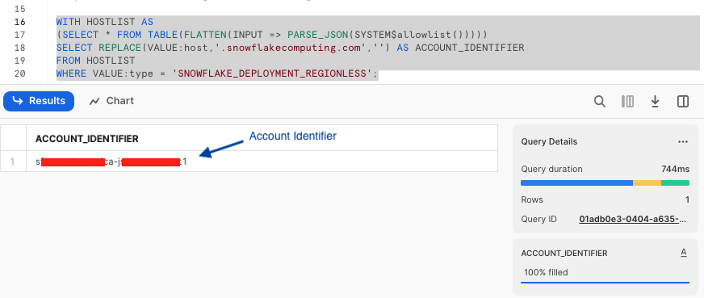

Next we need to configure the public key for the streaming user to access Snowflake programmatically.

First, in the Snowflake worksheet, replace `<pubKey>` with the content of the file `/home/ssm-user/pub.Key` (see `step 4` by clicking on `section #2 Create a provisioned Kafka cluster and a Linux jumphost in AWS` in the left pane) in the following SQL command and execute.
```commandline
use role accountadmin;
alter user streaming_user set rsa_public_key='<pubKey>';
```
See below example screenshot:

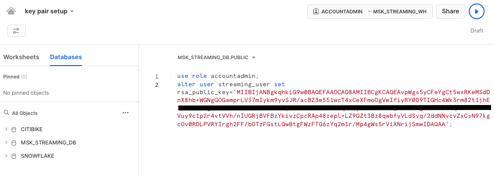

Now logout of Snowflake, sign back in as the default user `streaming_user` we just created with the associated password (default: Test1234567).
Run the following SQL commands in a worksheet to create a schema (e.g. `MSK_STREAMING_SCHEMA`) in the default database (e.g. `MSK_STREAMING_DB`):

```commandline
SET DB = 'MSK_STREAMING_DB';
SET SCHEMA = 'MSK_STREAMING_SCHEMA';

USE IDENTIFIER($DB);
CREATE OR REPLACE SCHEMA IDENTIFIER($SCHEMA);
```

#### 2. Install SnowSQL (optional but highly recommended)

[SnowSQL](https://docs.snowflake.com/en/user-guide/snowsql.html) is the command line client for connecting to Snowflake to execute SQL queries and perform all DDL and DML operations, including loading data into and unloading data out of database tables.

To install SnowSQL. Execute the following commands on the Linux Session Manager console:
```commandline
curl https://sfc-repo.snowflakecomputing.com/snowsql/bootstrap/1.2/linux_x86_64/snowsql-1.2.24-linux_x86_64.bash -o /tmp/snowsql-1.2.24-linux_x86_64.bash
echo -e "~/bin \n y" > /tmp/ans
bash /tmp/snowsql-1.2.24-linux_x86_64.bash < /tmp/ans

```
See below example screenshot:

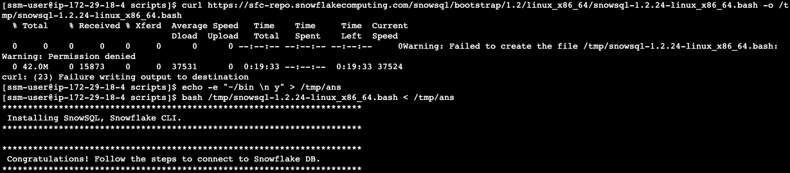

Next set the environment variable for Snowflake Private Key Phrase:
```commandline
export SNOWSQL_PRIVATE_KEY_PASSPHRASE=<key phrase you set up when running openssl previously>
```
Note that you should add the command above in the ~/.bashrc file to preserve this environment variable across sessions.
```commandline
echo "export SNOWSQL_PRIVATE_KEY_PASSPHRASE=$SNOWSQL_PRIVATE_KEY_PASSPHRASE" >> ~/.bashrc
```

Now you can execute this command to interact with Snowflake:
```commandline
$HOME/bin/snowsql -a <Snowflake Account Identifier> -u streaming_user --private-key-path $HOME/rsa_key.p8 -d msk_streaming_db -s msk_streaming_schema
```
See below example screenshot:

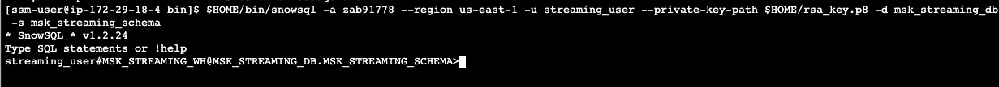

Type `Ctrl-D` to get out of SnowSQL session.

You can edit the [`~/.snowsql/config`](https://docs.snowflake.com/en/user-guide/snowsql-config.html#snowsql-config-file) file to set default parameters and eliminate the need to specify them every time you run snowsql.

At this point, the Snowflake setup is complete.

<!---------------------------->
## Configure Kafka connector for Snowpipe Streaming

Duration: 10

#### 1. Run the following commands to collect various connection parameters for the Kafka connector
```commandline
cd $HOME
outf=/tmp/params
cat << EOF > /tmp/get_params
a=''
until [ ! -z \$a ]
do
 read -p "Input Snowflake account identifier: e.g. ylmxgak-wyb53646 ==> " a
done

echo export clstr_url=\$a.snowflakecomputing.com > $outf
export clstr_url=\$a.snowflakecomputing.com

read -p "Snowflake cluster user name: default: streaming_user ==> " user
if [[ \$user == "" ]]
then
   user="streaming_user"
fi

echo export user=\$user >> $outf
export user=\$user

pass=''
until [ ! -z \$pass ]
do
  read -p "Private key passphrase ==> " pass
done

echo export key_pass=\$pass >> $outf
export key_pass=\$pass

read -p "Full path to your Snowflake private key file, default: /home/ssm-user/rsa_key.p8 ==> " p8
if [[ \$p8 == "" ]]
then
   p8="/home/ssm-user/rsa_key.p8"
fi

priv_key=\`cat \$p8 | grep -v PRIVATE | tr -d '\n'\`
echo export priv_key=\$priv_key  >> $outf
export priv_key=\$priv_key
cat $outf >> $HOME/.bashrc
EOF
. /tmp/get_params

```
See below example screen capture.

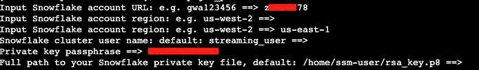

#### 2. Run the following commands to create a Snowflake Kafka connect property configuration file:
```commandline
dir=/home/ssm-user/snowpipe-streaming/scripts
cat << EOF > $dir/snowflakeconnectorMSK.properties
name=snowpipeStreaming
connector.class=com.snowflake.kafka.connector.SnowflakeSinkConnector
tasks.max=4
topics=streaming
snowflake.private.key.passphrase=$key_pass
snowflake.database.name=MSK_STREAMING_DB
snowflake.schema.name=MSK_STREAMING_SCHEMA
snowflake.topic2table.map=streaming:MSK_STREAMING_TBL
buffer.count.records=10000
buffer.flush.time=5
buffer.size.bytes=20000000
snowflake.url.name=$clstr_url
snowflake.user.name=$user
snowflake.private.key=$priv_key
snowflake.role.name=MSK_STREAMING_RL
snowflake.ingestion.method=snowpipe_streaming
value.converter.schemas.enable=false
jmx=true
key.converter=org.apache.kafka.connect.storage.StringConverter
value.converter=org.apache.kafka.connect.json.JsonConverter
errors.tolerance=all
EOF
```

<!---------------------------->
## Putting it all together
Duration: 10

Finally, we are ready to start ingesting data into the Snowflake table.

#### 1. Start the Kafka Connector for Snowpipe streaming

Go back to the Linux console and execute the following commands to start the Kafka connector.
```commandline
$HOME/snowpipe-streaming/kafka_2.12-2.8.1/bin/connect-standalone.sh $HOME/snowpipe-streaming/scripts/connect-standalone.properties $HOME/snowpipe-streaming/scripts/snowflakeconnectorMSK.properties
```

If everything goes well, you should something similar to screen capture below:
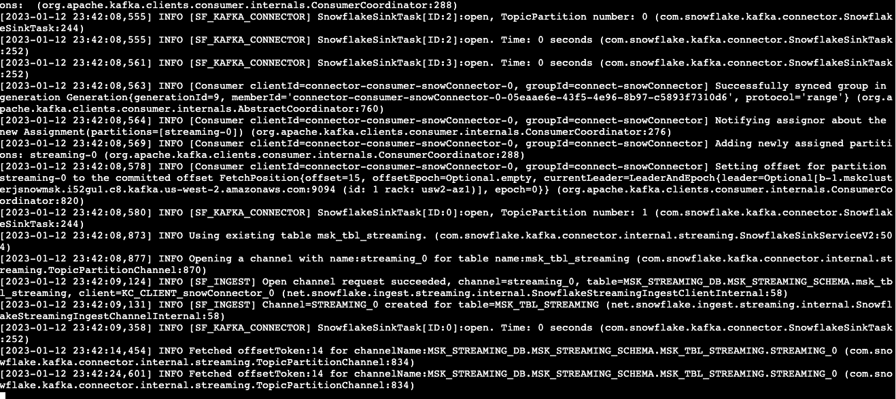

#### 2. Start the producer that will ingest real-time data to the MSK cluster

Start a new Linux session in `step 3` by clicking on `section #2 Create a provisioned Kafka cluster and a Linux jumphost in AWS` in the left pane.
```commandline
curl --connect-timeout 5 http://ecs-alb-1504531980.us-west-2.elb.amazonaws.com:8502/opensky | $HOME/snowpipe-streaming/kafka_2.12-2.8.1/bin/kafka-console-producer.sh --broker-list $BS --producer.config $HOME/snowpipe-streaming/scripts/client.properties --topic streaming
```
You should see response similar to screen capture below if everything works well.

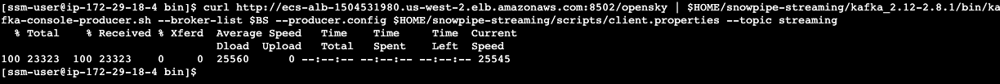

Note that in the script above, the producer queries a [Rest API](http://ecs-alb-1504531980.us-west-2.elb.amazonaws.com:8502/opensky ) that provides real-time flight data over the San Francisco 
Bay Area in JSON format. The data includes information such as timestamps, [icao](https://icao.usmission.gov/mission/icao/#:~:text=Home%20%7C%20About%20the%20Mission%20%7C%20U.S.,civil%20aviation%20around%20the%20world.) numbers, flight IDs, destination airport, longitude, 
latitude, and altitude of the aircraft, etc. The data is ingested into the `streaming` topic on the MSK cluster and 
then picked up by the Snowpipe streaming Kafka connector, which delivers it directly into a Snowflake 
table `msk_streaming_db.msk_streaming_schema.msk_streaming_tbl`.

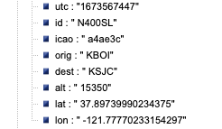

<!---------------------------->
## Query ingested data in Snowflake
Duration: 10

Now, switch back to the Snowflake console and make sure that you signed in as the default user `streaming_user`. 
The data should have been streamed into a table, ready for further processing.

#### 1. Query the raw data
To verify that data has been streamed into Snowflake, execute the following SQL commands.

```sh
use msk_streaming_db;
use schema msk_streaming_schema;
show channels in table msk_streaming_tbl;
```
You should see that there are two channels, corresponding to the two partitions created earlier in the topic.
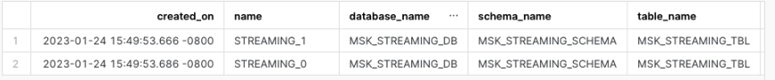

Now run the following query on the table.
```
select * from msk_streaming_tbl;
```
You should see there are two columns in the table: `RECORD_METADATA` and `RECORD_CONTENT` as shown in the screen capture below.

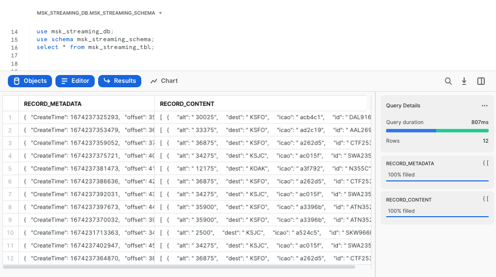
The `RECORD_CONTENT` column is an JSON array that needs to be flattened.

#### 2. Flatten the raw JSON data
Now execute the following SQL commands to flatten the raw JSONs and create a materialized view with multiple columns based on the key names.

```sh
create or replace view flights_vw
  as select
    f.value:utc::timestamp_ntz ts_utc,
    CONVERT_TIMEZONE('UTC','America/Los_Angeles',ts_utc::timestamp_ntz) as ts_pt,
    f.value:alt::integer alt,
    f.value:dest::string dest,
    f.value:orig::string orig,
    f.value:id::string id,
    f.value:icao::string icao,
    f.value:lat::float lat,
    f.value:lon::float lon,
    st_geohash(to_geography(ST_MAKEPOINT(lon, lat)),12) geohash,
    year(ts_pt) yr,
    month(ts_pt) mo,
    day(ts_pt) dd,
    hour(ts_pt) hr
FROM   msk_streaming_tbl,
       Table(Flatten(msk_streaming_tbl.record_content)) f;
```

The SQL commands create a view, convert timestamps to different time zones, and use Snowflake's [Geohash function](https://docs.snowflake.com/en/sql-reference/functions/st_geohash.html)  to generate geohashes that can be used in time-series visualization tools like Grafana

Let's query the view `flights_vw` now.
```sh
select * from flights_vw;
```

As a result, you will see a nicely structured output with columns derived from the JSONs
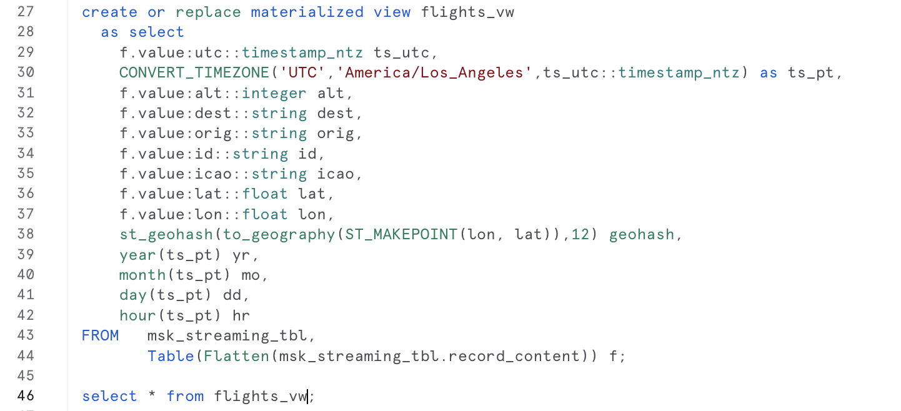

#### 3. Stream real-time flight data continuously to Snowflake

We can now write a loop to stream the flight data continuously into Snowflake.

Go back to the Linux session and run the following script.

```sh
while true
do
  curl --connect-timeout 5 -k https://ecs-alb-1504531980.us-west-2.elb.amazonaws.com:8502/opensky | $HOME/snowpipe-streaming/kafka_2.12-2.8.1/bin/kafka-console-producer.sh --broker-list $BS --producer.config $HOME/snowpipe-streaming/scripts/client.properties --topic streaming
  sleep 10
done

```
You can now go back to the Snowflake worksheet to run a `select count(1) from flights_vw` query every 30 seconds to verify that the row counts is indeed increasing.

<!---------------------------->
## Use MSK Connect (MSKC) - Optional
Duration: 15

So far we have been hosting the Kafka connector for Snowpipe Streaming on the EC2 instance. You can also use
[Amazon MSK Connect](https://aws.amazon.com/msk/features/msk-connect/) to manage the connector.

*Note that in order to use MSKC, it is suggested to run your MSK cluster in a private subnet with egress to the internet via the [NAT gateway](https://docs.aws.amazon.com/vpc/latest/userguide/vpc-nat-gateway.html) for it to work.
See this [AWS documentation](https://docs.aws.amazon.com/msk/latest/developerguide/msk-connect-internet-access.html) for more information.

#### 1. Create a S3 bucket to store the custom plugins
Follow this [AWS documentation](https://docs.aws.amazon.com/AmazonS3/latest/userguide/creating-bucket.html) to create a S3 bucket.

#### 2. Upload the libraries to the S3 bucket
On your EC2 session, run the following commands to compress the libraries into a zipped file.

```commandline
cd $HOME/snowpipe-streaming/kafka_2.12-2.8.1/libs
zip -9 /tmp/snowpipeStreaming-mskc-plugins.zip *
aws s3 cp /tmp/snowpipeStreaming-mskc-plugins.zip s3://<your s3 bucket name>/snowpipeStreaming-mskc-plugins.zip
```

#### 3. Create a custom plugin in MSK
Go to the [MSK console](https://console.aws.amazon.com/msk/home), click `Custom plugins` on the left pane.
Click `Create Custom plugin`.


Fill in the s3 path to your uploaded zip file, e.g. `s3://my-mskc-bucket/snowpipeStreaming-mskc-plugins.zip`
Give the custom plugin a name, e.g. `my-mskc-plugin`, click `Create custom plugin`.

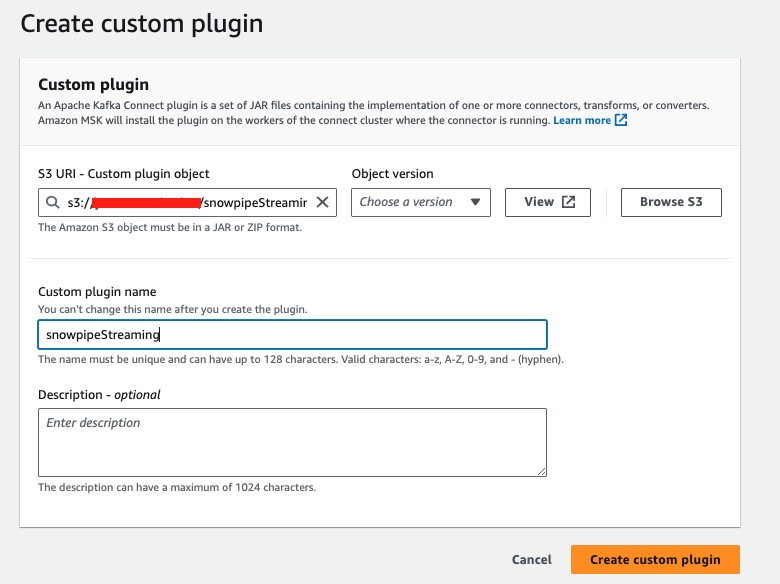

#### 4. Create a connector
Click `Connectors` on the left pane, then click `Create connector`.
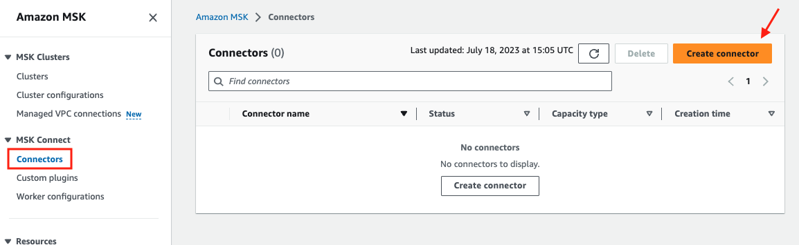

Check the `Use existing custom plugin` button.
Select the custom plugin you just created, click `Next`.
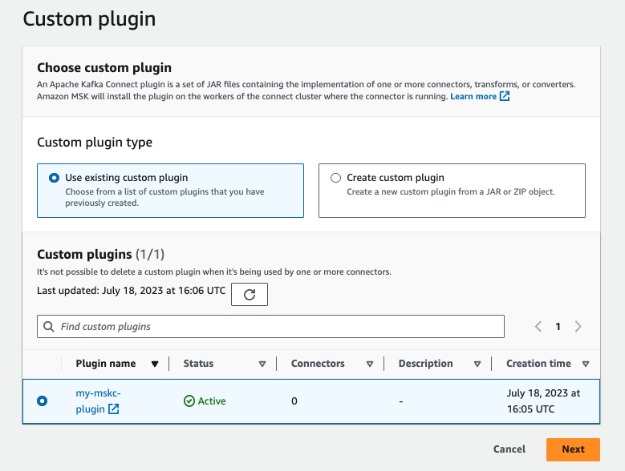

Give the connector a name, e.g. `snowpipeStreaming` in the `Basic information` section.


Select the MSK cluster you want to associate this connector with.
Scroll down to `Configuration settings`, copy and paste
the content from the configuration file: `$HOME/snowpipe-streaming/scripts/snowflakeconnectorMSK.properties` in the EC2 instance.
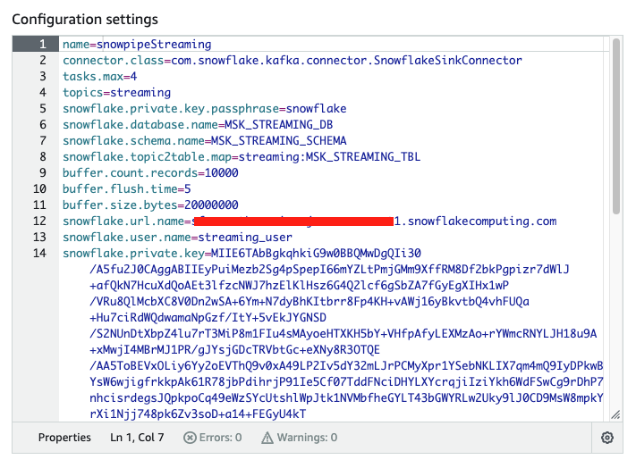

Leave all other settings as default, further scroll down to `Access permissions`. In the `Choose service role` drop-down menu, select
the role created by the Cloudformation template in the beginning of this quickstarts. The role name should look something like this
`<CFT stack name>-MSKConnectRole-<random characters>`. Click `Next`.

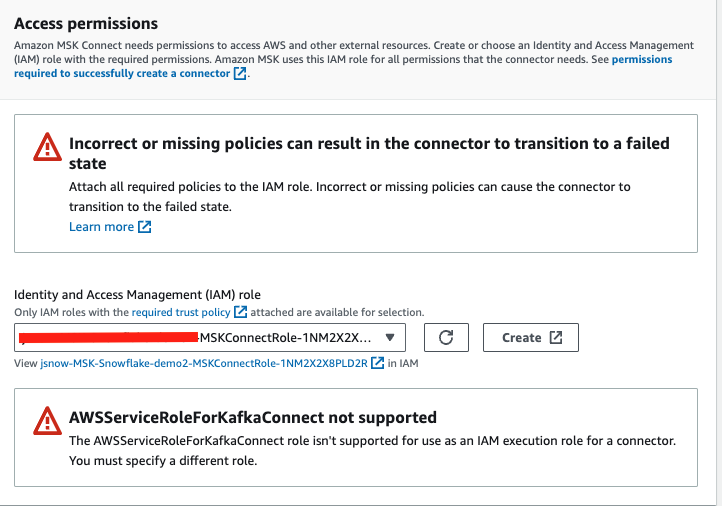

In the `Security` page, leave everything as default, click `Next`.
Skip the `Logs` page as it is optional, click `Next`.
Review the configurations and click `Create connector`. The connector will be created in about 5-10 minutes.
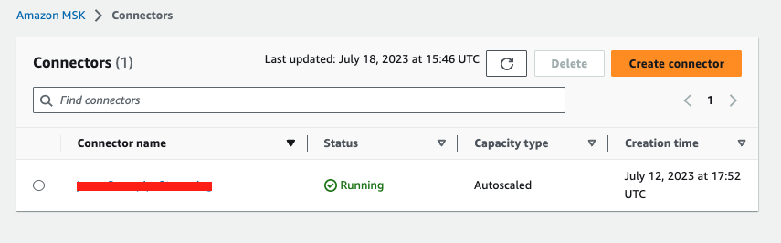

At this point, the Kafka connector for Snowpipestreaming has been configured, it is running and managed by MSKC, all you need to do is to 
run the source connector to ingest live data continuously as shown in Step 3 of Section 6. 
<!---------------------------->

## Cleanup

When you are done with the demo, to tear down the AWS resources, simply go to the [Cloudformation](https://us-west-2.console.aws.amazon.com/cloudformation/home?stacks) console.
Select the Cloudformation template you used to deploy the MSK cluster at the start of the demo, then click the `Delete` tab. All the resources that were deployed previously, such as EC2 instances, MSK clusters, roles, etc., will be cleaned up.

See example screen capture below.

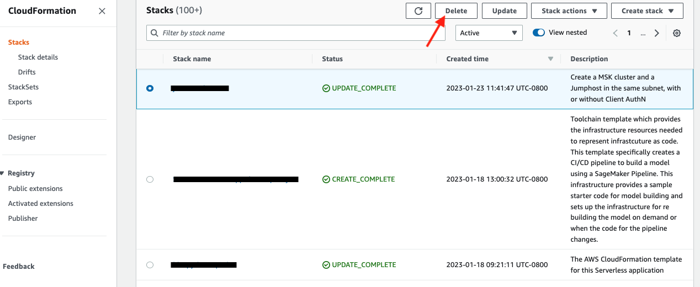

After the deletion of the MSK cluster, you will also need to delete the Cloudformation template for VPC if you created your own at the very beginning of the lab.

For Snowflake cleanup, execute the following SQL commands.

```commandline
USE ROLE ACCOUNTADMIN;

DROP DATABASE MSK_STREAMING_DB;
DROP WAREHOUSE MSK_STREAMING_WH;
DROP ROLE MSK_STREAMING_RL;

-- Drop the streaming user
DROP USER IF EXISTS STREAMING_USER;
```

<!---------------------------->
## Conclusions
Duration: 5

In this lab, we built a demo to show how to ingest time-series data using Snowpipe streaming and Kafka with low latency. We demonstrated this using a self-managed Kafka 
connector on an EC2 instance. However, for a production environment, we recommend using [Amazon MSK Connect](https://aws.amazon.com/msk/features/msk-connect/), which offers 
scalability and resilience through the AWS infrastructure. Alternatively, if you have infrastructure supported by either [Amazon EKS](https://aws.amazon.com/eks/) or
[Amazon ECS](https://aws.amazon.com/ecs/), you can use them to host your containerized Kafka connectors as well.

For those of you who are interested in learning more about how to build sleek dashboards for monitoring the live flight data, please navigate to this
[workshop](https://quickstarts.snowflake.com/guide/getting_started_with_amg_and_streamlit_on_real-time_dashboarding/index.html?index=..%2F..index#0)

Related Resources

- [Getting started with Snowflake](https://quickstarts.snowflake.com/)
- [Snowflake on AWS Marketplace](https://aws.amazon.com/marketplace/seller-profile?id=18d60ae8-2c99-4881-a31a-e74770d70347)
- [Snowflake for Data Sharing](https://www.snowflake.com/Workloads/data-sharing/)
- [Snowflake Marketplace](https://www.snowflake.com/en/data-cloud/marketplace/)
- [Amazon Managed Streaming for Apache Kafka (MSK)](https://aws.amazon.com/msk/)


