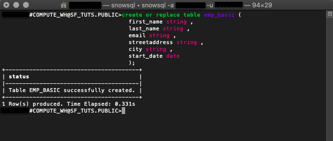
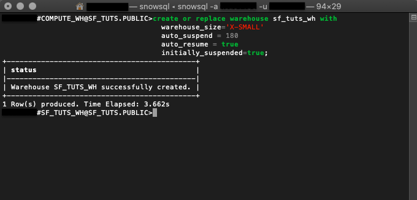
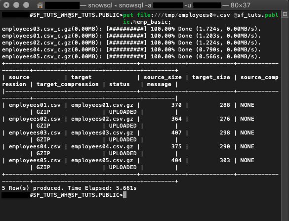
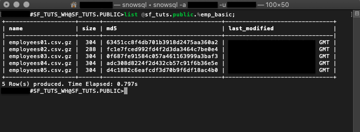
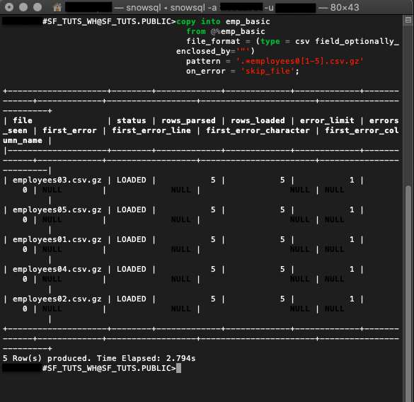
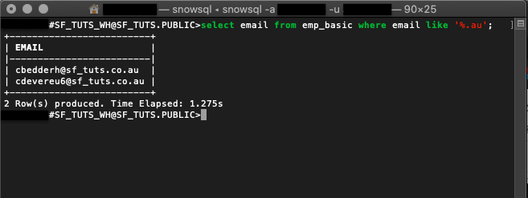

summary: Getting Started with SnowSQL
id:getting_started_with_snowsql
categories: Getting Started
environments: web
status: Published 
feedback link: https://github.com/Snowflake-Labs/sfguides/issues
tags: Getting Started, SQL, Data Engineering, SnowSQL

# Getting Started with SnowSQL
<!-- ------------------------ -->
## Overview 
Duration: 2

SnowSQL is the software CLI tool used to interact with Snowflake. Using SnowSQL, you can control all aspects of your Snowflake Data Cloud, including uploading data, querying data, changing data, and deleting data.  This guide will review SnowSQL and use it to create a database, load data, and learn helpful commands to manage your tables and data directly from your CLI. 

### Prerequisites
- Quick Video [Introduction to Snowflake](https://www.youtube.com/watch?v=fEtoYweBNQ4&ab_channel=SnowflakeInc.)
- Snowflake [Data Loading Basics](https://www.youtube.com/watch?v=us6MChC8T9Y&ab_channel=SnowflakeInc.) Video

### What You’ll Learn 
- how to create a Snowflake account
- how to install SnowSQL locally
- how to set up a cloud database and table
- how to create a virtual warehouse
- how to migrate sample data to the cloud
- how to query cloud data
- how to insert additional data
- how to drop database objects and close SnowSQL connection

Be sure to check the needed computing requirements before beginning. Also, download the sample files to complete this tutorial and note the folder location for later use.

### What You’ll Need 
- Local [Browser and OS Requirements](https://docs.snowflake.com/en/user-guide/setup.html)
- Download the [Sample Data Files](https://docs.snowflake.com/en/user-guide/getting-started-tutorial-prerequisites.html#sample-data-files-for-loading)

### What You’ll Build 
- A connection to cloud host and manage data with SnowSQL.

<!-- ------------------------ -->
## Set up SnowSQL
Duration: 8
First, you’ll get a Snowflake account and get comfortable navigating in the web console. After downloading the SnowSQL installer, you’ll install and confirm your success.

### Create a Snowflake Account

Snowflake lets you try out their services for free with a [trial account](https://signup.snowflake.com/).

### Access Snowflake’s Web Console

`https://<account-name>.snowflakecomputing.com/console/login`
    
Log in to the web interface on your browser. The URL contains your [account name](https://docs.snowflake.com/en/user-guide/connecting.html#your-snowflake-account-name) and potentially the region.

### Increase Your Account Permission

The Snowflake web interface has a lot to offer, but for now, we’ll just switch the account role from the default `SYSADMIN` to `ACCOUNTADMIN`. This increase in permissions will allow the user account to create objects.


### Download the SnowSQL Installer 

SnowSQL can be downloaded and installed on Linux, Windows, or Mac. In this example, we’ll download the installer for macOS via the AWS endpoint. If you’re using a different OS or prefer other methods, check out all the ways to get SnowSQL [here](https://docs.snowflake.com/en/user-guide/snowsql-install-config.html#).

```console
curl -O https://sfc-repo.snowflakecomputing.com/snowsql/bootstrap/​<bootstrap-version>/darwin_x86_4/snowsql-<snowsql-version>-darwin_x86_64.pkg
```

Specify `​<bootstrap-version>` and `<snowsql-version>`​ number within the cURL command.

The example below is a cURL command to the AWS endpoint for a macOS to download the
bootstrap version 1.2 and SnowSQL version 1.2.9.

```console
curl -O https://sfc-repo.snowflakecomputing.com/snowsql/bootstrap/1.2/darwin_x86_64/snowsql-1.2.9-darwin_x86_64.pkg​
```


### Install SnowSQL Locally
- Double-click the installer file and walk through the wizard prompts.
- Confirm the install was successful by checking the version `$ snowsql -v`.
- Reboot your machine and check again if necessary.

After completing these steps, you’ll be ready to use SnowSQL to make a database in the next section.

<!-- ------------------------ -->
## Create a Database
Duration: 6
With your account active and SnowSQL installed, you’ll use the terminal to sign in and create
the needed objects for cloud storage.

### Sign in From the Terminal

```console
snowsql -a <account-name> -u <username>
```

The `-a` flag represents the Snowflake account, and the `-u` represents the username.

### Create a Database and Schema

```console
create or replace database sf_tuts;
```

The command [​create or replace database​](https://docs.snowflake.com/en/sql-reference/sql/create-database.html) makes a new database and auto-creates the schema ‘public.’ It’ll also make the new database active for your current session.

To check which database is in use for your current session, execute:

```
select current_database(),
current_schema();
```

### Generate a Table

```console
create or replace table emp_basic (
  first_name string ,
  last_name string ,
  email string ,
  streetaddress string ,
  city string ,
  start_date date
  );
```

Running [​create or replace table​](https://docs.snowflake.com/en/sql-reference/sql/create-table.html) will build a new table based on the parameters specified. This example reflects the same columns in the sample CSV employee data files.



### Make a Virtual Warehouse
```console
create or replace warehouse sf_tuts_wh with
  warehouse_size='X-SMALL'
  auto_suspend = 180
  auto_resume = true
  initially_suspended=true;
```
After creation, this virtual warehouse will be active for your current session and begin running once the computing resources are needed.



With the database objects ready, you’ll employ SnowSQL to move the sample data onto the `emp_basic` table.

<!-- ------------------------ -->
## Upload Data
Duration: 8
In this section, you’ll stage your sample CVS employee files and execute a SQL command to
copy the data onto your table.

If you have not already done so, you can download the sample files here:

<button>[Download Sample Data](https://docs.snowflake.com/en/_downloads/34f4a66f56d00340f8f7a92acaccd977/getting-started.zip)</button>

### Stage Files With PUT

#### Linux
```console
put file:///tmp/employees0*.csv @<database-name>.<schema-name>.%<table-name>;
```
#### Windows
````console
put file://c:\temp\employees0*.csv @sf_tuts.public.%emp_basic;
````

- `file` specifies the *local* file path of the files to be staged. File paths are OS-specific.
- `@<database-name>.<schema-name>.%<table-name>` is the specific database,
schema, and table the staged files are headed.
- The `@` sign before the database and schema name `@sf_tuts.public` indicates that the files are being uploaded to an internal stage, rather than an external stage. The `%` sign before the table name `%emp_basic` indicates that the internal stage being used is the stage for the table. For more details about stages, see Staging Data Files from a Local File System.

```console
put file:///tmp/employees0*.csv @sf_tuts.public.%emp_basic;
```

Here is a PUT call to stage the sample employee CSV files from a macOS `file:///tmp/` folder onto the `emp_basic` table within the `sf_tuts` database.



### LIST Staged Files

```
list @<database-name>.<schema-name>.%<table-name>;
```

To check your staged files, run the `list` command.

```
list @sf_tuts.public.%emp_basic;
```

The example command above is to output the staged files for the `emp_basic` table. Learn
more LIST syntax [​here​](https://docs.snowflake.com/en/sql-reference/sql/list.html).



### [COPY INTO​](https://docs.snowflake.com/en/sql-reference/sql/copy-into-table.html) Your Table

```
copy into emp_basic
  from @%emp_basic
  file_format = (type = csv field_optionally_enclosed_by='"')
  pattern = '.*employees0[1-5].csv.gz'
  on_error = 'skip_file';
```
After getting the files staged, the data is copied into the `emp_basic` table. This DML command also auto-resumes the virtual warehouse made earlier.



The output indicates if the data was successfully copied and records any errors.

<!-- ------------------------ -->
## Query Data
Duration: 15

With your data in the cloud, you need to know how to query it. We’ll go over a few calls that will
put your data on speed-dial.

- The `select` command followed by the wildcard `*` returns all rows and columns in `<table-name>`.

```
select * from emp_basic;
```

Here is an example command to `select` everything on the `emp_basic` table.


Sifting through everything on your table may not be the best use of your time. Getting specific
results are simple, with a few functions and some query syntax.

- [WHERE​](https://docs.snowflake.com/en/sql-reference/constructs/where.html#where) is an additional clause you can add to your select query.

```
select * from emp_basic where first_name = 'Ron';
```

This query returns a list of employees by the `first_name` of ‘Ron’ from the `emp_basic` table.


- [LIKE​](https://docs.snowflake.com/en/sql-reference/functions/like.html) function supports wildcard `%` and `_`.

```
select email from emp_basic where email like '%.au';
```

The like function checks all emails in the `emp_basic` table for `au` and returns a record.



Snowflake supports many [​functions](https://docs.snowflake.com/en/sql-reference-functions.html)​, [​operators](https://docs.snowflake.com/en/sql-reference/operators.html)​, and [​commands](https://docs.snowflake.com/en/sql-reference-commands.html)​. However, if you need more
specific tasks performed, consider setting up an [​external function](https://docs.snowflake.com/en/sql-reference/external-functions-introduction.html)​​.

<!-- ------------------------ -->
## Manage and Delete Data
Duration: 6

Often data isn’t static. We’ll review a few common ways to maintain your cloud database.

If HR updated the CSV file after hiring another employee, downloading, staging, and copying
the whole CSV would be tedious. Instead, simply insert the new employee information into the
targeted table.

#### Insert Data
[​INSERT​](https://docs.snowflake.com/en/sql-reference/sql/insert.html) will update a table with additional values.


```
insert into emp_basic values
  ('Clementine','Adamou','cadamou@sf_tuts.com','10510 Sachs Road','Klenak','2017-9-22') ,
  ('Marlowe','De Anesy','madamouc@sf_tuts.co.uk','36768 Northfield Plaza','Fangshan','2017-1-26');
```
#### Drop Objects
In the command displayed, `insert` is used to add two new employees to the `emp_basic` table.


- [DROP​](https://docs.snowflake.com/en/sql-reference/sql/drop.html) objects no longer in use.

```
drop database if exists sf_tuts;

drop warehouse if exists sf_tuts_wh;
```

After practicing the basics covered in this tutorial, you’ll no longer need the `sf-tuts` database and warehouse. To remove them altogether, use the `drop` command.
<!---->

- Close Your Connection with `!exit` or `!disconnect`

For security reasons, it’s best not to leave your terminal connection open unnecessarily. Once you’re ready to close your SnowSQL connection, simply enter `!exit`.
<!-- ------------------------ -->
## Conclusion
Duration: 1

### Use SnowSQL for Your Application
You’ve created a Snowflake account, set up a cloud database with compute resources, and
migrated data to the cloud with SnowSQL. Nice work! There are many advantages to using the
cloud. Now that you know how easy getting started with Snowflake is, it’s time to consider your
next steps.

With your firm grasp of loading data with SnowSQL, start using it to run your application.
Continue by [​developing an application](https://docs.snowflake.com/en/developer-apps.html)​ with SnowSQL to learn how to connect your data to a Python application. If you already have application data, consider migrating it to the cloud with the same steps we used to complete the `emp_basic` table. Snowflake’s tools and documentation are extensive and give you the power of cloud computing.

### What we've covered
- SnowSQL setup
- Uploading data using SnowSQL
- Querying data using SnowSQL
- Managing and deleting data using SnowSQL
