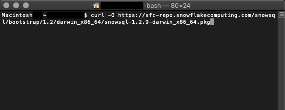
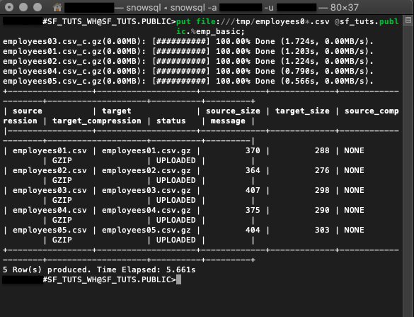
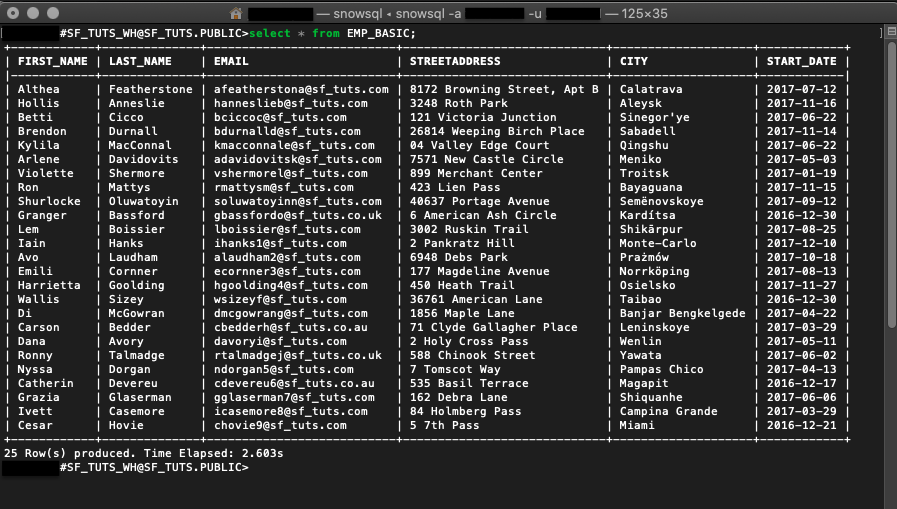
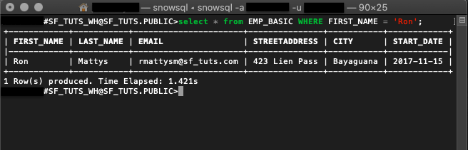
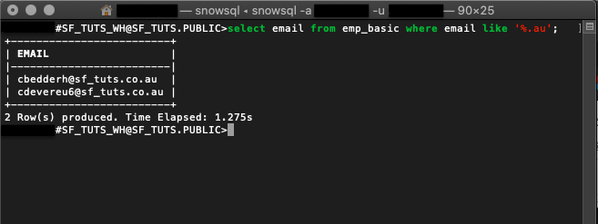
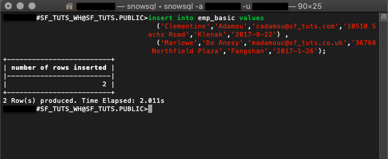

id:getting_started_with_snowsql_kr
summary: SnowSQL 시작하기
categories: undefined
environments: web
status: Hidden
feedback link: https://github.com/Snowflake-Labs/sfguides/issues
tags: 스노우플레이크 시작하기, SQL, 데이터 엔지니어링, SnowSQL, kr

# SnowSQL 시작하기

<!-- ------------------------ -->
## 개요

Duration: 2

SnowSQL은 Snowflake와 상호 작용하기 위해 사용되는 소프트웨어 CLI 도구입니다. SnowSQL을 사용하여 Snowflake Data Cloud의 모든 측면을 제어할 수 있습니다. 여기에는 데이터 업로드, 데이터 쿼리, 데이터 변경 및 데이터 삭제가 포함됩니다.  이 가이드에서는 SnowSQL을 검토하고 이를 사용하여 데이터베이스를 생성하고, 데이터를 로드하고, CLI에서 바로 테이블 및 데이터를 관리하는 데 유용한 명령을 배울 수 있습니다.

### 사전 필요 조건 및 지식

- 짧은 [Snowflake 소개](https://www.youtube.com/watch?v=fEtoYweBNQ4&ab_channel=SnowflakeInc.) 동영상
- Snowflake [데이터 로딩 기본 사항](https://www.youtube.com/watch?v=us6MChC8T9Y&ab_channel=SnowflakeInc.) 동영상

### 학습할 내용

- Snowflake 계정 생성 방법
- 로컬에서 SnowSQL 설치 방법
- 클라우드 데이터베이스 및 테이블 설정 방법
- 가상 웨어하우스 생성 방법
- 샘플 데이터를 클라우드로 마이그레이션하는 방법
- 클라우드 데이터 쿼리 방법
- 추가 데이터 삽입 방법
- 데이터베이스 오브젝트 삭제 및 SnowSQL 연결 종료 방법

시작하기 전에 필요한 컴퓨팅 요구 사항을 확인하시기 바랍니다. 또한 이 자습서를 완료하기 위해 샘플 파일을 다운로드하고 추후 사용을 위해 폴더 위치를 기록하십시오.

### 필요한 것

- 로컬 [브라우저 및 운영 체제 요구 사항](https://docs.snowflake.com/ko/user-guide/setup.html)
- [샘플 데이터 파일](https://docs.snowflake.com/ko/user-guide/getting-started-tutorial-prerequisites.html#sample-data-files-for-loading) 다운로드

### 구축할 것

- 클라우드 호스트와 연결 및 SnowSQL로 데이터 관리

<!-- ------------------------ -->
## SnowSQL 설정

Duration: 8 우선 Snowflake 계정을 만들고 웹 콘솔 탐색에 익숙해져 보겠습니다. SnowSQL 설치 프로그램을 다운로드한 다음 이를 설치하고 성공 여부를 확인하겠습니다.

### Snowflake 계정 생성

Snowflake는 무료로 Snowflake 서비스를 이용해 볼 수 있도록 [평가판 계정](https://signup.snowflake.com/)을 제공합니다.

### Snowflake의 웹 콘솔 액세스

`https://<account-name>.snowflakecomputing.com/console/login`

브라우저에서 웹 인터페이스에 로그인합니다. URL은 여러분의 [계정 이름](https://docs.snowflake.com/ko/user-guide/connecting.html#your-snowflake-account-name)과 잠재적으로 지역을 포함합니다.

### 계정 권한 확장

Snowflake의 웹 인터페이스는 다양한 기능을 제공하지만 지금은 계정 역할을 기본값인 `SYSADMIN`에서 `ACCOUNTADMIN`으로 전환하기만 하겠습니다. 이 권한 확장을 통해 사용자 계정은 오브젝트를 생성할 수 있습니다.


### SnowSQL 설치 프로그램 다운로드

SnowSQL을 Linux, Windows 또는 Mac에 다운로드하고 설치할 수 있습니다. 이 예에서는 AWS 엔드포인트를 통해 macOS를 위해 설치 프로그램을 다운로드하겠습니다. 다른 운영 체제를 사용하고 있거나 다른 방법을 선호한다면 SnowSQL을 설치하는 모든 방법을 [여기](https://docs.snowflake.com/ko/user-guide/snowsql-install-config.html#)에서 확인하십시오.

```console
curl -O https://sfc-repo.snowflakecomputing.com/snowsql/bootstrap/​<bootstrap-version>/darwin_x86_4/snowsql-<snowsql-version>-darwin_x86_64.pkg
```

`​<bootstrap-version>` 및 `<snowsql-version>`​숫자를 cURL 명령 내에서 지정합니다.

아래 예는 macOS를 위해 부트스트랩 버전 1.2 및 SnowSQL 버전 1.2.9를 다운로드하기 위한 AWS 엔드포인트에 대한 cURL 명령입니다.

```console
curl -O https://sfc-repo.snowflakecomputing.com/snowsql/bootstrap/1.2/darwin_x86_64/snowsql-1.2.9-darwin_x86_64.pkg​
```



### 로컬에서 SnowSQL 설치

- 설치 프로그램 파일을 두 번 클릭하고 마법사 프롬프트를 따릅니다.
- `$ snowsql -v` 버전을 확인하여 성공적으로 설치되었는지 확인합니다.
- 컴퓨터를 재부팅하고 필요하다면 다시 확인합니다.

이러한 단계를 완료하면 SnowSQL을 사용하여 다음 섹션에서 데이터베이스를 만들 준비가 된 것입니다.

<!-- ------------------------ -->
## 데이터베이스 생성

Duration: 6 여러분의 계정이 활성 상태이고 SnowSQL이 설치되었다면 터미널을 사용하여 로그인하고 클라우드 저장소에 필요한 오브젝트를 생성할 것입니다.

### 터미널에서 로그인

```console
snowsql -a <account-name> -u <username>
```

`-a` 플래그는 Snowflake 계정을 나타내며 `-u` 플래그는 사용자 이름을 나타냅니다.

### 데이터베이스 및 스키마 생성

```console
create or replace database sf_tuts;
```

[CREATE TABLE 또는 REPLACE TABLE](https://docs.snowflake.com/ko/sql-reference/sql/create-database.html) 명령은 새로운 데이터베이스를 만들며 ‘public’ 스키마를 자동으로 생성합니다. 이는 또한 여러분의 현재 세션을 위해 새로운 데이터베이스를 활성 상태로 만듭니다.

데이터베이스가 여러분의 현재 세션에서 사용되고 있는지 확인하려면 다음을 실행합니다.

```
select current_database(),
current_schema();
```

### 테이블 생성

```console
create or replace table emp_basic (
  first_name string ,
  last_name string ,
  email string ,
  streetaddress string ,
  city string ,
  start_date date
  );
```

[CREATE TABLE 또는 REPLACE TABLE](https://docs.snowflake.com/ko/sql-reference/sql/create-table.html)을 실행하면 지정된 매개 변수에 따라 새로운 테이블이 구축될 것입니다. 이 예는 샘플 CSV 직원 데이터 파일에 있는 동일한 열을 반영합니다.


### 가상 웨어하우스 생성

```console
create or replace warehouse sf_tuts_wh with
  warehouse_size='X-SMALL'
  auto_suspend = 180
  auto_resume = true
  initially_suspended=true;
```

생성한 후 이 가상 웨어하우스는 여러분의 현재 세션을 위해 활성 상태가 되며 컴퓨팅 리소스가 필요해지면 실행됩니다.


데이터베이스 오브젝트가 준비되었다면 SnowSQL을 사용하여 샘플 데이터를 `emp_basic` 테이블로 이동하겠습니다.

<!-- ------------------------ -->
## 데이터 업로드

Duration: 8 이 섹션에서는 여러분의 샘플 CVS 직원 파일을 스테이징하고 데이터를 여러분의 테이블로 복사하기 위해 SQL 명령을 실행하겠습니다.

아직 샘플 파일을 다운로드하지 않았다면 다음에서 다운로드할 수 있습니다.

<button>[샘플 데이터 다운로드](https://docs.snowflake.com/ko/_downloads/34f4a66f56d00340f8f7a92acaccd977/getting-started.zip)</button>

### PUT을 통해 파일 스테이징

#### Linux

```console
put file:///tmp/employees0*.csv @<database-name>.<schema-name>.%<table-name>;
```

#### Windows

````console
put file://c:\temp\employees0*.csv @sf_tuts.public.%emp_basic;
````

- `file`은 스테이징할 파일의 *로컬* 파일 경로를 지정합니다. 파일 경로는 운영 체제별로 다릅니다.
- `@<database-name>.<schema-name>.%<table-name>`은 스테이징된 파일이 향하는 특정 데이터베이스, 스키마 및 테이블입니다.
- 데이터베이스 전에 있는 `@` 기호와 `@sf_tuts.public` 스키마 이름은 파일이 외부 스테이지가 아닌 내부 스테이지에 업로드됨을 나타냅니다. `%emp_basic` 테이블 이름 전에 있는 `%` 기호는 사용되고 있는 내부 스테이지가 테이블을 위한 스테이지임을 나타냅니다. 스테이지에 대한 더 자세한 정보는 Local File System에서 Staging Data Files를 확인하십시오.

```console
put file:///tmp/employees0*.csv @sf_tuts.public.%emp_basic;
```

macOS `file:///tmp/` 폴더의 샘플 직원 CSV 파일을 `sf_tuts` 데이터베이스 내에 있는 `emp_basic` 테이블로 스테이징하기 위한 PUT 호출입니다.



### 스테이징된 파일 LIST

```
list @<database-name>.<schema-name>.%<table-name>;
```

스테이징된 파일을 확인하기 위해 `list` 명령을 실행합니다.

```
list @sf_tuts.public.%emp_basic;
```

위 예시 명령은 `emp_basic` 테이블을 위해 스테이징된 파일을 출력하기 위한 것입니다. 더 많은 LIST 구문은 [여기](https://docs.snowflake.com/ko/sql-reference/sql/list.html)에서 자세히 알아보십시오.


### 테이블로 [COPY INTO](https://docs.snowflake.com/ko/sql-reference/sql/copy-into-table.html)

```
copy into emp_basic
  from @%emp_basic
  file_format = (type = csv field_optionally_enclosed_by='"')
  pattern = '.*employees0[1-5].csv.gz'
  on_error = 'skip_file';
```

파일을 스테이징한 다음 데이터는 `emp_basic` 테이블로 복사됩니다. 이 DML 명령은 또한 이전에 만든 가상 웨어하우스를 자동으로 재개합니다.


출력은 데이터가 성공적으로 복사되었으며 모든 오류를 기록하는지를 나타냅니다.

<!-- ------------------------ -->
## 데이터 쿼리

Duration: 15

클라우드에 있는 데이터를 쿼리하는 방법을 알아야 합니다. 여러분의 데이터를 빠르게 호출할 수 있도록 하는 몇몇 호출을 다루겠습니다.

- `*` 와일드카드 앞에 있는 `select` 명령은 `<table-name>`의 모든 행과 열을 반환합니다.

```
select * from emp_basic;
```

다음 예시 명령은 `emp_basic` 테이블에 있는 모든 것을 대상으로 `select` 명령을 수행합니다.



테이블에 있는 모든 데이터를 살피는 것은 가장 효율적으로 시간을 사용하는 방법이 아닙니다. 몇몇 함수와 일부 쿼리 구문을 사용하면 특정 결과를 간단히 가져올 수 있습니다.

- [WHERE](https://docs.snowflake.com/ko/sql-reference/constructs/where.html#where)는 선택 쿼리에 추가할 수 있는 추가 절입니다.

```
select * from emp_basic where first_name = 'Ron';
```

이 쿼리는 `emp_basic` 테이블에서 `first_name`이 ‘Ron’인 직원 목록을 반환합니다.



- [LIKE](https://docs.snowflake.com/ko/sql-reference/functions/like.html) 함수는 `%` 및 `_` 와일드카드를 지원합니다.

```
select email from emp_basic where email like '%.au';
```

LIKE 함수는 `au`를 위해 `emp_basic` 테이블에 있는 모든 이메일을 확인하며 레코드를 반환합니다.



Snowflake는 다양한 [함수](https://docs.snowflake.com/ko/sql-reference-functions.html), [연산자](https://docs.snowflake.com/ko/sql-reference/operators.html) 및 [명령](https://docs.snowflake.com/ko/sql-reference-commands.html)을 지원합니다. 그러나 보다 구체적인 작업을 수행해야 한다면 [외부 함수](https://docs.snowflake.com/ko/sql-reference/external-functions-introduction.html) 설정을 고려하십시오.

<!-- ------------------------ -->
## 데이터 관리 및 삭제

Duration: 6

종종 데이터는 고정적이지 않습니다. 여러분의 클라우드 데이터베이스를 유지하기 위한 몇몇 일반적인 방법을 검토하겠습니다.

HR에서 또 다른 직원을 고용한 후에 CSV 파일을 업데이트한다면 모든 CSV를 다운로드하고 스테이징하고 복사하는 것은 지루할 것입니다. 대신 단순하게 새로운 직원 정보를 대상 테이블에 삽입합니다.

#### 데이터 삽입

[INSERT](https://docs.snowflake.com/ko/sql-reference/sql/insert.html)는 테이블을 추가 값으로 업데이트할 것입니다.

```
insert into emp_basic values
  ('Clementine','Adamou','cadamou@sf_tuts.com','10510 Sachs Road','Klenak','2017-9-22') ,
  ('Marlowe','De Anesy','madamouc@sf_tuts.co.uk','36768 Northfield Plaza','Fangshan','2017-1-26');
```

#### 오브젝트 삭제

표시된 명령에서 `insert`는 2명의 새로운 직원을 `emp_basic` 테이블에 추가하기 위해 사용됩니다.



- [DROP](https://docs.snowflake.com/ko/sql-reference/sql/drop.html) 오브젝트는 더 이상 사용되지 않습니다.

```
drop database if exists sf_tuts;

drop warehouse if exists sf_tuts_wh;
```

이 자습서에서 기본 사항을 연습한 후에는 `sf-tuts` 데이터베이스와 웨어하우스가 더 이상 필요하지 않습니다. 이를 모두 삭제하려면 `drop` 명령을 사용합니다.

<!---->
- `!exit` 또는 `!disconnect`로 연결 종료

보안상의 이유로 여러분의 터미널 연결을 불필요하게 유지하는 않는 것이 좋습니다. SnowSQL 연결을 종료할 준비가 되었다면 단순히 `!exit`를 입력합니다.

<!-- ------------------------ -->
## 결론

Duration: 1

### 애플리케이션을 위해 SnowSQL 사용

Snowflake 계정을 생성했고, 컴퓨팅 리소스로 클라우드 데이터베이스를 설정했고, SnowSQL을 통해 클라우드로 데이터를 마이그레이션했습니다. 잘하셨습니다! 클라우드를 사용하면 많은 이점을 누릴 수 있습니다. 이제 Snowflake를 시작하는 것이 얼마나 쉬운지 알게 되었으니 다음 단계를 고려할 시간입니다.

SnowSQL을 통한 데이터 로딩에 대해 잘 알고 있으니 이를 사용하여 여러분의 애플리케이션을 실행하십시오. SnowSQL을 통해 [애플리케이션 개발](https://docs.snowflake.com/ko/developer-apps.html)을 계속하여 Python 애플리케이션과 여러분의 데이터를 연결하는 방법을 알아보십시오. 애플리케이션 데이터가 이미 있다면 `emp_basic` 테이블을 완료하기 위해 사용했던 단계를 통해 이를 클라우드로 마이그레이션하는 것을 고려하십시오. Snowflake의 도구 및 설명서는 광범위하며 클라우드 컴퓨팅의 위력을 여러분에게 선사합니다.

### 다룬 내용

- SnowSQL 설정
- SnowSQL을 사용하여 데이터 업로드
- SnowSQL을 사용하여 데이터 쿼리
- SnowSQL을 사용하여 데이터 관리 및 삭제