id: getting_started_with_streams_and_tasks
summary: Learn how to use streams and tasks with Snowflake.
categories: featured,getting-started
environments: web
status: Published 
feedback link: https://github.com/Snowflake-Labs/sfguides/issues
tags: Data Engineering, Tasks, Streams, Financial Services
authors: steven.maser@snowflake.com 

# Getting Started with Streams & Tasks
<!-- ------------------------ -->
## Overview 
Duration: 4

This guide will take you through a scenario of using Snowflake's Tasks and Streams capabilities to ingest a stream of data and prepare for analytics.  

Streams provides a change tracking mechanism for your tables and views, enabling and ensuring "exactly once" semantics for new or changed data.

Tasks are Snowflake objects to execute a single command, which could be simple SQL command or calling an extensive stored procedure.  Tasks can be scheduled or run on-demand, either within a Snowflake Virtual warehouse or serverless.

This Lab will also construct a Directed Acyclic Graph (DAG), which is a series of tasks composed of a single root task and additional tasks, organized by their dependencies. Tasks will be combined with table streams to create data pipelines, continuous ELT workflows to process recently received or changed table rows. 

A simulated streaming datafeed will be used for this exercise, using a Snowpark-based Stored Procedure, to simplify your setup and focus on these two capabilities.  The simulation will be high-volume, at 1 million transactions a minute (exceeding 15k/second), of credit card purchases and returns.
This prerequisite streaming ingestion was modeled to mirror one created from Snowflake's Kafka Connector, without the distraction of having to setup a running Kafka instance.  
While not covered in this exercise, one can use these building blocks to further enrich your data with Snowflake Data Marketplace data, train and deploy machine learning models, perform fraud detection, and other use cases by combining these skills with other Snowflake virtual hands-on labs.


### Prerequisites
- Familiarity with Snowflake, basic SQL knowledge, Snowsight UI and Snowflake objects

### What You’ll Learn 
- how to create a Snowflake Stream
- how to create and schedule a Snowflake Task 
- how to orchestrate tasks into data pipelines
- how Snowpark can be used to build new types of user-defined functions and stored procedures 
- multiple ways to manage and monitor your Snowflake tasks and data pipelines

### What You’ll Need 
To participate in the virtual hands-on lab, attendees need the following:

- A [Snowflake Enterprise Account on preferred AWS region](https://signup.snowflake.com/?lab=getStartedWithStreamsAndTasks&utm_cta=quickstart-getstartedwithstreamsandtasks-en) with **ACCOUNTADMIN** access

### What You’ll Build 
- A Snowflake database that contains all data and objects built in this lab
- A Stage and Staging table to initially land your incoming data stream
- An Analytics-Ready Table
- A Stream to track recently-received credit card transactions
- Tasks orchestrated two ways to process those new transactions

<!-- ------------------------ -->
## Setting up Snowflake
Duration: 5

### Login and Setup Lab
Log into your Snowflake account or [signup for a free trial](https://signup.snowflake.com/?lab=getStartedWithStreamsAndTasks&utm_cta=quickstart-getstartedwithstreamsandtasks-en). You can access the SQL commands we will execute throughout this lab directly in your Snowflake account by going to the [lab details page](https://app.snowflake.com/resources/labs/getStartedWithStreamsAndTasks) and clicking the `Setup Lab` button. This will create worksheets containing the lab SQL that can be executed as we step through this lab.

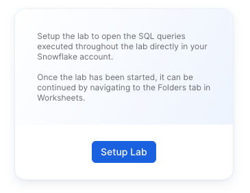

Once the lab has been setup, it can be continued by revisiting the [lab details page](https://app.snowflake.com/resources/labs/getStartedWithStreamsAndTasks) and clicking `Continue Lab`


or by navigating to Worksheets and selecting the `Getting Started with Streams & Tasks` folder.


### Set your Role
Finally, switch to the ACCOUNTADMIN role.  If you just created an evaluation account to go through this Lab, this should be easy.  However, if you are using an established account and find this role missing from your list, you may need assistance to complete the next few steps.  Creating a Role, Database, Stages, Tasks, and monitoring tasks executed by 'System' requires higher-level permissions.    


<!-- ------------------------ -->
## Begin Construction
Duration: 5

Create Foundational Snowflake Objects for this Hands-on Lab
### a)  Create a new role for this Lab and grant permissions
```
use role ACCOUNTADMIN;
set myname = current_user();
create role if not exists VHOL;
grant role VHOL to user identifier($myname);
grant create database on account to role VHOL;
grant EXECUTE TASK, EXECUTE MANAGED TASK on ACCOUNT to role VHOL;
grant IMPORTED PRIVILEGES on DATABASE SNOWFLAKE to role VHOL;
```
### b)  Create a Dedicated Virtual Compute Warehouse
Size XS, dedicated for this Hands-on Lab
```
create or replace warehouse VHOL_WH WAREHOUSE_SIZE = XSMALL, AUTO_SUSPEND = 5, AUTO_RESUME= TRUE;
grant all privileges on warehouse VHOL_WH to role VHOL;
```

### c)  Create Database used throughout this Lab
```
use role VHOL;
create or replace database VHOL_ST;
grant all privileges on database VHOL_ST to role VHOL;
use database VHOL_ST;
use schema PUBLIC;
use warehouse VHOL_WH;
```

### d)  Create an internal Stage
Dedicated for incoming streaming files (Typically real-time stream consumption would be automated from Kafka using Snowflake Kafka Connector, but for this exercise we are simulating data and focusing on Task and Stream usage.).  Incoming data will JSON format, with many transactions within each file.
```
create or replace stage VHOL_STAGE
FILE_FORMAT = ( TYPE=JSON,STRIP_OUTER_ARRAY=TRUE );
```
### d)  Create a Staging/Landing Table
Where all incoming data will land initially.  Each row will contain a transaction, but JSON will be stored as a VARIANT datatype within Snowflake.
```
create or replace table CC_TRANS_STAGING (RECORD_CONTENT variant);
```

## Simulated Stream Source
Duration: 1

Create Simulation Data Generation Stored Procedure (Using Snowpark Java).  We kept this as a separate step, as it is necessary for setup, but deep interrogation of how this Stored Procedure works to use Snowflake as a streaming ingestion process is not the focus of this Lab.
Just copy, paste and run this to create the Stored Procedure:
```
create or replace procedure SIMULATE_KAFKA_STREAM(mystage STRING,prefix STRING,numlines INTEGER)
  RETURNS STRING
  LANGUAGE JAVA
  PACKAGES = ('com.snowflake:snowpark:latest')
  HANDLER = 'StreamDemo.run'
  AS
  $$
    import com.snowflake.snowpark_java.Session;
    import java.io.*;
    import java.util.HashMap;
    public class StreamDemo {
      public String run(Session session, String mystage,String prefix,int numlines) {
        SampleData SD=new SampleData();
        BufferedWriter bw = null;
        File f=null;
        try {
            f = File.createTempFile(prefix, ".json");
            FileWriter fw = new FileWriter(f);
	        bw = new BufferedWriter(fw);
            boolean first=true;
            bw.write("[");
            for(int i=1;i<=numlines;i++){
                if (first) first = false;
                else {bw.write(",");bw.newLine();}
                bw.write(SD.getDataLine(i));
            }
            bw.write("]");
            bw.close();
            return session.file().put(f.getAbsolutePath(),mystage,options)[0].getStatus();
        }
        catch (Exception ex){
            return ex.getMessage();
        }
        finally {
            try{
	            if(bw!=null) bw.close();
                if(f!=null && f.exists()) f.delete();
	        }
            catch(Exception ex){
	            return ("Error in closing:  "+ex);
	        }
        }
      }
      
      private static final HashMap<String,String> options = new HashMap<String, String>() {
        { put("AUTO_COMPRESS", "TRUE"); }
      };
      
      // sample data generator (credit card transactions)
    public static class SampleData {
      private static final java.util.Random R=new java.util.Random();
      private static final java.text.NumberFormat NF_AMT = java.text.NumberFormat.getInstance();
      String[] transactionType={"PURCHASE","PURCHASE","PURCHASE","PURCHASE","PURCHASE","PURCHASE","PURCHASE","PURCHASE","PURCHASE","PURCHASE","REFUND"};
      String[] approved={"true","true","true","true","true","true","true","true","true","true","false"};
      static {
        NF_AMT.setMinimumFractionDigits(2);
        NF_AMT.setMaximumFractionDigits(2);
        NF_AMT.setGroupingUsed(false);
      }
      
      private static int randomQty(int low, int high){
        return R.nextInt(high-low) + low;
      }
      
      private static double randomAmount(int low, int high){
        return R.nextDouble()*(high-low) + low;
      }
      
      private String getDataLine(int rownum){
        StringBuilder sb = new StringBuilder()
            .append("{")
            .append("\"element\":"+rownum+",")
            .append("\"object\":\"basic-card\",")
            .append("\"transaction\":{")
            .append("\"id\":"+(1000000000 + R.nextInt(900000000))+",")
            .append("\"type\":"+"\""+transactionType[R.nextInt(transactionType.length)]+"\",")
            .append("\"amount\":"+NF_AMT.format(randomAmount(1,5000)) +",")
            .append("\"currency\":"+"\"USD\",")
            .append("\"timestamp\":\""+java.time.Instant.now()+"\",")
            .append("\"approved\":"+approved[R.nextInt(approved.length)]+"")
            .append("},")
            .append("\"card\":{")
                .append("\"number\":"+ java.lang.Math.abs(R.nextLong()) +"")
            .append("},")
            .append("\"merchant\":{")
            .append("\"id\":"+(100000000 + R.nextInt(90000000))+"")
            .append("}")
            .append("}");
        return sb.toString();
      }
    }
}
$$;
```
Which will return:
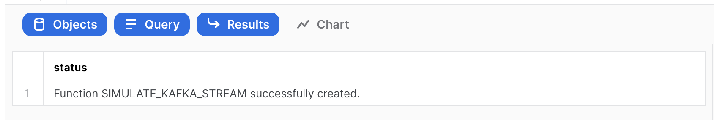


## Develop and Testing
Duration: 15

### a)  Call SP to generate the compressed JSON load file
Later, this will be setup to run repetitively on a schedule to simulate a real-time stream ingestion process.  First, we run the stored procedure on-demand using:  
```
call SIMULATE_KAFKA_STREAM('@VHOL_STAGE','SNOW_',1000000);
```
Which returns:  
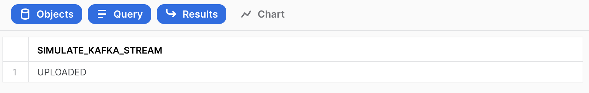

### b)  Verify file was created in the internal stage
```
list @VHOL_STAGE PATTERN='.*SNOW_.*';
```
This file looks similar to this in your Stage:
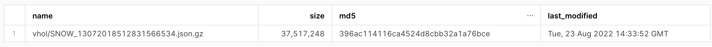

### c)  Load file into Staging Table  (about 100Mb raw json data per file).  Later, this will be setup to run every x minutes.
```
copy into CC_TRANS_STAGING from @VHOL_STAGE PATTERN='.*SNOW_.*';
```
Which will return this:
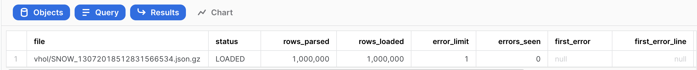

### d)  Now, there should be raw source JSON data in our Landing/Staging Table, but now a VARIANT datatype.
```
select count(*) from CC_TRANS_STAGING;
select * from CC_TRANS_STAGING limit 10;
```
Select one of the rows, and you will see a better view of the contents, which will be similar to:
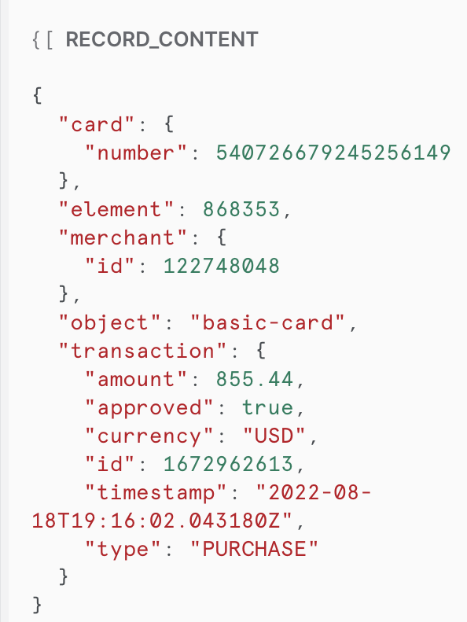

### e) Run Test Queries.  Now that it is a VARIANT datatype, the contents of the JSON is now understood.
```
select RECORD_CONTENT:card:number as card_id from CC_TRANS_STAGING limit 10;
```

```
select
RECORD_CONTENT:card:number::varchar,
RECORD_CONTENT:merchant:id::varchar,
RECORD_CONTENT:transaction:id::varchar,
RECORD_CONTENT:transaction:amount::float,
RECORD_CONTENT:transaction:currency::varchar,
RECORD_CONTENT:transaction:approved::boolean,
RECORD_CONTENT:transaction:type::varchar,
RECORD_CONTENT:transaction:timestamp::datetime
from CC_TRANS_STAGING
where RECORD_CONTENT:transaction:amount::float < 600 limit 10;
```
While the raw data was JSON, Snowflake has converted that during the COPY INTO step, creating VARIANT column values, making semi-structured data much easier
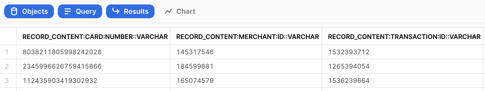


### f)  Create a View of Staging Table for real-time operational queries (normalize VARIANT column to a full tabular representation)
```
create or replace view CC_TRANS_STAGING_VIEW (card_id, merchant_id, transaction_id, amount, currency, approved, type, timestamp ) as (
select
RECORD_CONTENT:card:number::varchar card_id,
RECORD_CONTENT:merchant:id::varchar merchant_id,
RECORD_CONTENT:transaction:id::varchar transaction_id,
RECORD_CONTENT:transaction:amount::float amount,
RECORD_CONTENT:transaction:currency::varchar currency,
RECORD_CONTENT:transaction:approved::boolean approved,
RECORD_CONTENT:transaction:type::varchar type,
RECORD_CONTENT:transaction:timestamp::datetime timestamp
from CC_TRANS_STAGING);
```
### g) We will be creating a stream, so we need to enable change tracking
```
alter table CC_TRANS_STAGING set CHANGE_TRACKING = true;
alter view CC_TRANS_STAGING_VIEW set CHANGE_TRACKING = true;
```
### h) Preview your View
```
select * from CC_TRANS_STAGING_VIEW limit 10;
select count(*) from CC_TRANS_STAGING_VIEW limit 10;
```
While data in staging table is JSON, one can now see traditional tablular view of the data

### i) Create a Stream on the operational view
Note:  While we could put a stream on the staging table, by using the view one can use the normalized view
```
create or replace stream CC_TRANS_STAGING_VIEW_STREAM on view CC_TRANS_STAGING_VIEW SHOW_INITIAL_ROWS=true;
select count(*) from CC_TRANS_STAGING_VIEW_STREAM;
select * from CC_TRANS_STAGING_VIEW_STREAM limit 10;
```
Note:  We are populating the Stream with the all current rows in the table.  Querying the Stream does not consume it.  But, something that is in a transaction (auto or manual committed) will consume the records in the stream for exactly-once change pattern.

### j) Create Analytical table (normalized) for transformation (ELT) and easier user consumption (Staging table for landing can then be purged after X days)
```
create or replace table CC_TRANS_ALL (
card_id varchar,
merchant_id varchar,
transaction_id varchar,
amount float,
currency varchar,
approved boolean,
type varchar,
timestamp datetime);
```
## Create Data Pipeline #1
Duration: 15

Create Tasks to orchestrate Processing for this Hands-on Lab.  Each Task will be independent and separately scheduled.

See diagram:
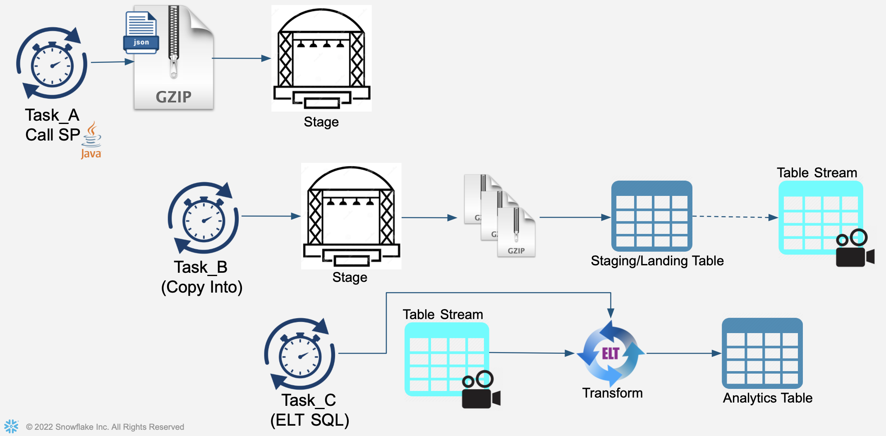
- First task will create an incoming JSON file containing credit card transactions and store this file in the Stage.
- Second task will perform a COPY INTO operation, reading file(s) within the Stage and load into staging/landing table
- Third task will perform an ELT transformation operation, processing recently-added records to the staging/landing table and load into the "analytics-ready" table.

### a)  Create Task
Task be our real-time kafka streaming source (calling Stored Procedure to simulate incoming Kafka-provided credit card transactions).  This task will be scheduled to run every 60 seconds, very similar to how Snowflake's Kafka Connector bundles and ingests data.
```
create or replace task GENERATE_TASK
WAREHOUSE=VHOL_WH
SCHEDULE = '1 minute'
COMMENT = 'Generates simulated real-time data for ingestion'
as
call SIMULATE_KAFKA_STREAM('@VHOL_STAGE','SNOW_',1000000);
```

### b)  View Definition of Task
Here are the details of your newly-created Task
```
describe task GENERATE_TASK;
```

### c)  Manually Run Task  
```
execute task GENERATE_TASK;
```

### d) Monitor our Activities

- Right-Click on "House icon" at upper right and open in a new browser tab:    
 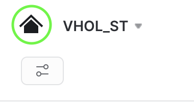  

- and then    
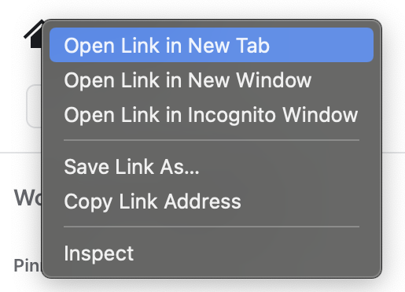
 -
- From that new tab, select Activity" on the left menu, then "Query History":     
 

- Remove filters at the top of this table, including your username, as later scheduled tasks will run as "System":


- Click "Filter", and add filter option 'Queries executed by user tasks' and click "Apply Filters":


- Now, you can see all executed SQL commands, including those executed by your running tasks:
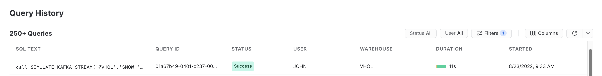

If you don't see your tasks, make sure you are ACCOUNTADMIN in this tab/window too (or same role if not ACCOUNTADMIN but have rights to see SYSTEM-executed tasks).
Finally, click on your Worksheet tab leaving your Query History tab available as you will want to return and jump between these two Snowsight views.


### e)  Enable Task to Run on its Schedule
Task scheduled to run every 1 minute
```
alter task GENERATE_TASK RESUME;
```

### f)  List Files in Stage
List Files in Stage now ready to be copied into Snowflake.
NOTE:  Task will not run instantly, it will wait a minute before running
```
list @VHOL_STAGE PATTERN='.*SNOW_.*';
```

### g)  Wait
Wait a couple minutes and then you should see that the Task is regularly generating and adding a new file to the Stage.
Reminder:  Remember to turn these Tasks off at end of lab or, if you take a break, jump to the last step of this section for the commands to suspend your tasks.
```
list @VHOL_STAGE PATTERN='.*SNOW_.*';
```

### h)  Create a Second Task
This Task will run every 3 minutes and utilizes the Staging Stream that identifies newly added records to the Staging file and loads into our analytical table.  As there will be multiple files ready for ingestion, note each will be loaded independently and in parallel.

For this Task, we will utilize the option to run with a serverless compute, as a full compute warehouse is not really necessary to have running for these small continuous micro-batch tasks.  In an actual implementation, the incoming simulated data stream will be external.

```
create or replace task PROCESS_FILES_TASK
USER_TASK_MANAGED_INITIAL_WAREHOUSE_SIZE = 'XSMALL'
SCHEDULE = '3 minute'
COMMENT = 'Ingests Incoming Staging Datafiles into Staging Table'
as
copy into CC_TRANS_STAGING from @VHOL_STAGE PATTERN='.*SNOW_.*';
```
Note:  Snowflake does track what files in a stage it has already processed for a period of time, but, if you get thousands and thousands of files in your stage, you don't want this process to sort through them for each run of the Task. Using "PURGE" is a way to delete them during the COPY INTO step, or you can create a separate step to archive or delete these files on your preferred schedule.

### i)  Check Staging Table, View, and Stream
Query Staging Table and its Stream tracking changes, before running Process Task.  Note before and after row counts.
```
select count(*) from CC_TRANS_STAGING;
select * from CC_TRANS_STAGING limit 10;
select count(*) from CC_TRANS_STAGING_VIEW_STREAM;
select * from CC_TRANS_STAGING_VIEW_STREAM limit 10;
```

### j)  Execute Task Manually
```
execute task PROCESS_FILES_TASK;
```
Wait here for processing (Can monitor from your Query History tab)

### k)  Query Staging View and its Stream
Streams make it so easy to track changes, after running Process Task:
```
select count(*) from CC_TRANS_STAGING_VIEW;
select count(*) from CC_TRANS_STAGING_VIEW_STREAM;
```

### l)  Begin task to run on its schedule
```
alter task PROCESS_FILES_TASK resume;
```

### m)  Create Third Task
This task will run every 4 minutes, leveraging the Staging Stream to process new records and load into the Analytical Table.
Note that this first checks if there are records in the stream and then will process and load records if the stream has records.
```
create or replace task REFINE_TASK
USER_TASK_MANAGED_INITIAL_WAREHOUSE_SIZE = 'XSMALL'
SCHEDULE = '4 minute'
COMMENT = '2.  ELT Process New Transactions in Landing/Staging Table into a more Normalized/Refined Table (flattens JSON payloads)'
when
SYSTEM$STREAM_HAS_DATA('CC_TRANS_STAGING_VIEW_STREAM')
as
insert into CC_TRANS_ALL (select                     
card_id, merchant_id, transaction_id, amount, currency, approved, type, timestamp
from CC_TRANS_STAGING_VIEW_STREAM);
```
Staging tables are typically periodically purged.  This Table will be permanent, storing all transactions for their useful lifecycle.  This ELT process would also typically include more transformations, validations, and refine/enrichment however that is not the focus of this hands-on Lab.

### n)  Query Analytical Table
You should see there are no records in this empty table
```
select count(*) from CC_TRANS_ALL;
```

### o)  Query Staging Table's Stream
Stream is showing there are records and has not yet been flushed/consumed.
```
select count(*) from CC_TRANS_STAGING_VIEW_STREAM;
```

### p)  Run Task Manually
```
execute task REFINE_TASK;
```

Wait here for task to complete, check Query History view to monitor.

### q)  Query Staging Table's Stream
Stream now showing stream after it has been flushed/consumed
```
select count(*) from CC_TRANS_ALL;
select count(*) from CC_TRANS_STAGING_VIEW_STREAM;
```

Note: The Stream will first show just the initial records (1,000,000).  Once those are consumed for the initial rows, then the stream will show the rows added by the scheduled tasks.

### r)  Schedule Task
Resume Task so it will run on its schedule.  Note it is fully independent of the other tasks we have running.  You can also configure tasks to run at a certain time, using CRON-based syntax option.
```
alter task REFINE_TASK resume;
```

### s)  Reporting
One can report on LOAD metadata generated by Snowflake.  This is available in two views:
1)  For no latency, but only 14 days of retention:
```
select * from VHOL_ST.INFORMATION_SCHEMA.LOAD_HISTORY where SCHEMA_NAME=current_schema() and TABLE_NAME='CC_TRANS_STAGING';
```

2)  Up to 90 minutes latency with this view, but 365 days of retention:
```
select * from SNOWFLAKE.ACCOUNT_USAGE.LOAD_HISTORY where SCHEMA_NAME=current_schema() and TABLE_NAME='CC_TRANS_STAGING';
```

### t)  Stop Tasks
```
alter task REFINE_TASK SUSPEND;
alter task PROCESS_FILES_TASK SUSPEND;
alter task GENERATE_TASK SUSPEND;
```

### u)  See how many transactions we have fully processed so far
```
select count(*) from CC_TRANS_ALL;
```

## Create Data Pipeline #2
Duration: 15

This section's Data Pipeline will be very similar to the first, except will orchestrate tasks with dependencies, rather than being independently scheduled and executed.

See diagram:
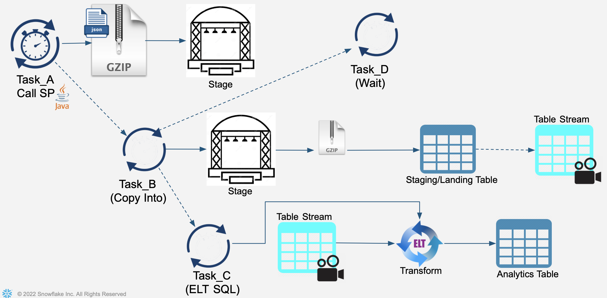

### a)  Create Two Tasks
Similar to the tasks created in the previous section, but ones that will become subtasks (rather than independent scheduling).
Note: Define all of these to run within the same warehouse, but that is not a requirement.
- First Task
```
create or replace task REFINE_TASK2
WAREHOUSE=VHOL_WH
as
insert into CC_TRANS_ALL (select                     
card_id, merchant_id, transaction_id, amount, currency, approved, type, timestamp
from CC_TRANS_STAGING_VIEW_STREAM);
```
- Second Task
```
create or replace task PROCESS_FILES_TASK2
WAREHOUSE=VHOL_WH
as
copy into CC_TRANS_STAGING from @VHOL_STAGE PATTERN='.*SNOW_.*';
```

### b)  Create Root Task
This is the Task where all others will be subprocesses of.
```
create or replace task LOAD_TASK
WAREHOUSE=VHOL_WH
SCHEDULE = '1 minute'
COMMENT = 'Full Sequential Orchestration'
as
call SIMULATE_KAFKA_STREAM('@VHOL_STAGE','SNOW_',1000000);
```

### c)  First Predecessor
-Have task REFINE_TASK2 be a predecessor of PROCESS_FILES_TASK2
```
alter task REFINE_TASK2 add after PROCESS_FILES_TASK2;
alter task REFINE_TASK2 RESUME;
```
-Have task LOAD_TASK be a predecessor of PROCESS_FILES_TASK2
```
alter task PROCESS_FILES_TASK2 add after LOAD_TASK;
alter task PROCESS_FILES_TASK2 RESUME;
```
Note:  One can also use the 'after' within the create task command

### d)  View DAG Orchestration
- In a new tab (use right-click on "home icon" at upper left), Navigate in Snowsight to:  
  **Data>Databases>VHOL_ST>PUBLIC>Tasks>LOAD_TASK**
- Review "Task Details" tab:    
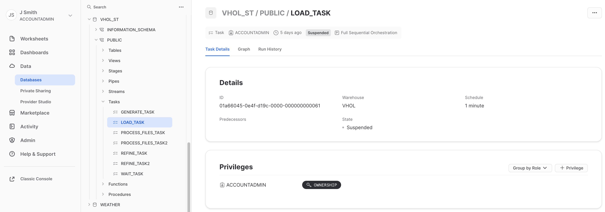

- Review "Graph" to see graphical representation of our simple flow:    
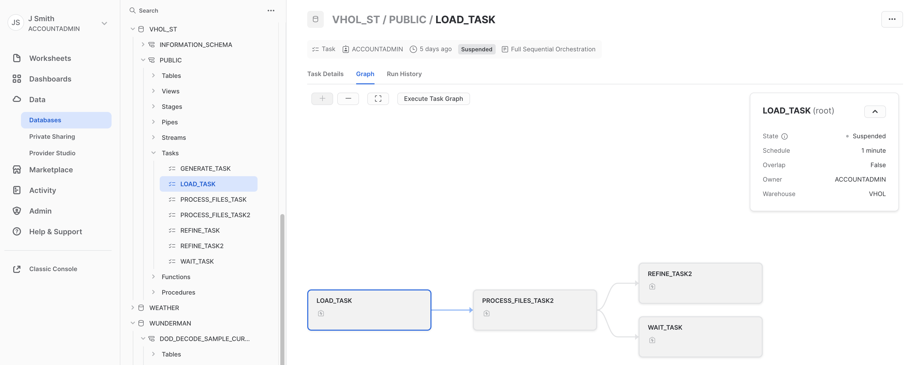
Remember your warehouse is 'VHOL_WH'

- Review "Run History" to view Task Executions:   
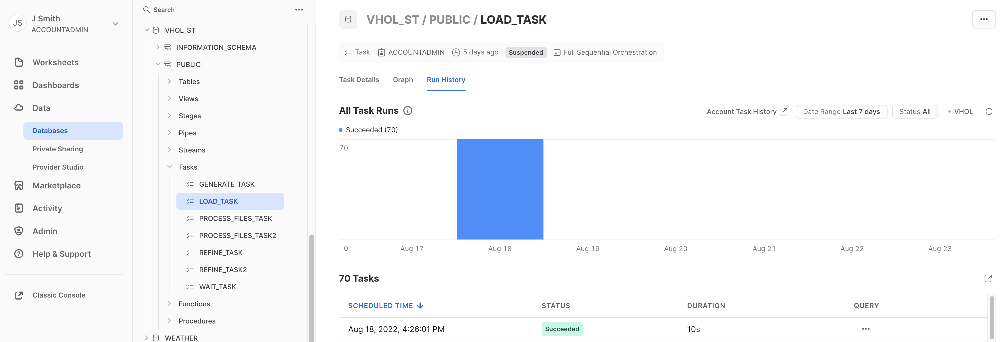

Note:  Graph and Task History are recently added previews, so may need to ask on how to enable in your account if these menu options are missing.

### e)  Start LOAD Task
```
alter task LOAD_TASK RESUME;
```
Wait, as task will run after one minute.  Then, see a file created in Stage
```
list @VHOL_STAGE PATTERN='.*SNOW_.*';
```
Go back to Activity tab, reviewing Query History and Task's Run History (refresh)

### f)  Tasks in Parallel
Tasks do not have to be sequential, they can also run in parallel.  Let's create a simple task to demonstrate this.  To add to the root task @ creation, you have to first suspend:
```
alter task LOAD_TASK SUSPEND;
create or replace task WAIT_TASK
  WAREHOUSE=VHOL_WH
  after PROCESS_FILES_TASK2
as
  call SYSTEM$wait(1);
```

### g)  Run Load Task
After this addition, resume/enable both tasks. Note we utilized the "AFTER" option during creation rather than using "ALTER" afterward to create this dependency to the DAG process.
```
alter task WAIT_TASK RESUME;
alter task LOAD_TASK RESUME;
```

### h)  Monitor
Go back to your Task tab, refreshing your Graph view and task's Run History.

### i)  Task Dependencies
Can also see task dependencies via SQL.  As this is available via query, this can be collected for your data catalog and other analysis/reporting purposes.
```
select * from table(information_schema.task_dependents(task_name => 'LOAD_TASK', recursive => true));
```

### j)  Section is Complete
Suspend your Tasks for this Section
```
alter task LOAD_TASK SUSPEND;
alter task REFINE_TASK2 SUSPEND;
alter task PROCESS_FILES_TASK2 SUSPEND;
alter task WAIT_TASK SUSPEND;
```


## Final Steps & Cleanup
Duration: 2
### a)  See how many transactions we have processed
```
select count(*) from CC_TRANS_ALL;
```
### b)  Look at our newest record now in your Analytical table:
```
select * from CC_TRANS_ALL order by TIMESTAMP desc limit 1;
```

### c)  See all tasks we have created, and to confirm their state is all "Suspended"
```
show tasks;
```
(suspend any still running)

### d)    Drop Database, removing all objects created by this Hands-on Lab (Optional)  
```
drop database VHOL_ST;
```

### e)    Drop Warehouse (Optional)
```

use role ACCOUNTADMIN;
drop warehouse VHOL_WH;
```

### e)    Drop Role (Optional)
```
use role ACCOUNTADMIN;
drop role VHOL;
```

## Conclusion
Duration: 3

Congratulations, you have completed this Lab!  

### What We Covered
- Created a Snowflake Stream
- Created and Scheduled a Snowflake Task
- Assembled tasks into Data Pipelines
- Snowpark can be used to build new types of user-defined functions and stored procedures
- Managed and Monitored your Snowflake Tasks and Data Pipelines


### Related Resources
- [Streams](https://docs.snowflake.com/en/user-guide/streams-intro.html)
- [Tasks](https://docs.snowflake.com/en/user-guide/tasks-intro.html)
- [Execute Tasks](https://docs.snowflake.com/en/sql-reference/sql/execute-task.html)
- [Handling Task Errors](https://docs.snowflake.com/en/user-guide/tasks-errors.html)
- [Snowpipe](https://docs.snowflake.com/en/user-guide/data-load-snowpipe.html)
- [Kafka Connector](https://docs.snowflake.com/en/user-guide/kafka-connector.html)


