author: Matt Marzillo
id: getting_started_with_the_microsoft_teams_and_365_copilot_cortex_app
summary: This is a quickstart showing users how use the Microsoft Teams and 365 Copilot Cortex App
categories: AI, Cortex, Microsoft, Azure, Agents, Copilot, Teams, Search, Analyst
environments: web
status: Hidden 
feedback link: https://github.com/Snowflake-Labs/sfguides/issues
tags: AI, Microsoft, Agents, Cortex, Copilot, chatbot, Teams, Cortex, Search, Analyst

# Getting Started with The Microsoft Teams and 365 Copilot Cortex App
<!-- ------------------------ -->
## Overview 
Duration: 10

In this quickstart you learn to build a Snowflake Cortex Agent and connect to it from a Teams or MS 365 Copilot App. In this Quickstart, after Setting Up the Snowflake Environment there will be a section for configuring the app connectivity then using the app; this Quickstart can be followed all the way through but you may be focused on one experience or another depending on your role and interest :grin:

Snowflake Cortex Agents orchestrate across both structured and unstructured data sources to deliver insights. They plan tasks, use tools to execute these tasks, and generate responses. Agents use Cortex Analyst (structured) and Cortex Search (unstructured) as tools, along with LLMs, to analyze data. Cortex Search extracts insights from unstructured sources, while Cortex Analyst generates SQL to process structured data. A comprehensive support for tool identification and tool execution enables delivery of sophisticated applications grounded in enterprise data.

A Teams 365 Copilot app is an AI-powered productivity assistant integrated into Microsoft Teams and Microsoft 365 Services (Word, Excel, Outlook, etc.). It's part of Microsoft’s broader Copilot ecosystem, which embeds generative AI into everyday work apps and can connect to services like Snowflake Cortex Agents.

CURRENTLY THIS IS ONLY AVAILABLE FOR SNOWFLAKE ACCOUNTS DEPLOYED IN AZURE US EAST 2

### Use Case
In this use cases we will build two data sources, one with structured sales data and another with unstructured sales call data. Then we will create a Cortex Agent that uses Search (for unstructured data) and Analyst (for structured data) then wrap a Cortex Agent around it so that it can combine both the services in a unified agentic experience. This can then be used by Copilot leveraging oauth authentication and triggered by a simple phrase in your Microsoft Copilot to access sales data easily with plain text questions.

Snowflake Cortex has proven to be a best-in-class platform for building GenAI services (Search and Analyst) and agents with your data and now customers can seamlessly connect to Cortex Agents in Teams and 365 Copilots alongside all of their Microsoft GenAI experiences.

### Prerequisites
- Familiarity with [Snowflake](https://signup.snowflake.com/?utm_cta=quickstarts_) and a Snowflake account
- A Teams account or 365 with Copilot (with administrator privileges if following that section)

### What You’ll Learn
- Creating Snowflake Cortex Services for Search, Analyst and Agents
- Securely connecting Teams and 365 Copilot App to Cortex Agents
- Using the Teams and 365 App with Cortex Agents!

First we will build a simple Cortex agent that leverages Analyst and Search Services on structured and unstructured data respectively.
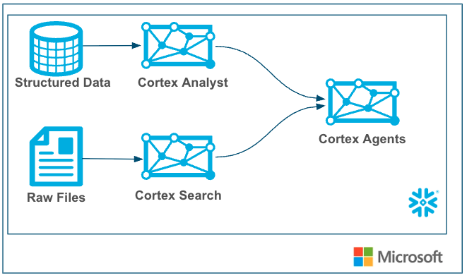

Next, we will confifure connectivity to connect the Teams/Copilot 365 App to Cortex then use it, with the underlying architecture like below. 
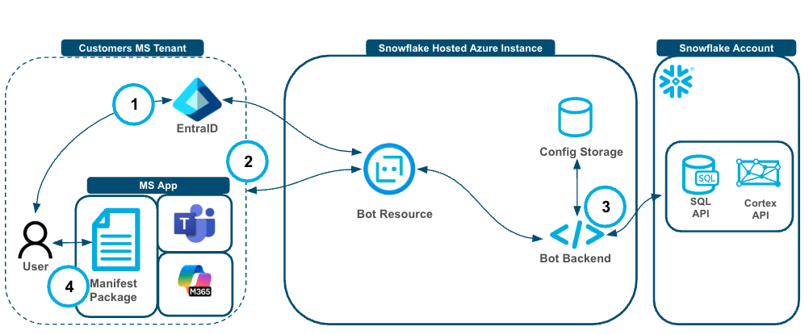
The authentication and user flow goes like this:

1. User authenticates to Entra ID and via the Bot Resource to authenticate into their Snowflake Account.
2. The user then interacts with the MS app and the Bot Resource sends the request, along with the token from step 1, to the Bot backend with the user.
3. The Bot Backend stores and retrieves the tenant level configuration and prompts the Cortex Agent API and executes queries against the SQL API when needed.
4. Responses traverse through the Bot Backend, through the Bot Resource back to the application and to the user.

...

### What You’ll Need
- [Snowflake account](https://signup.snowflake.com/) 
- A Teams account or 365 with Copilot (with administrator privileges if following that section)

### What You'll Build
- A Snowflake Search Service
- A Snowflake Analyst Service
- A Snowflake Agent
- A Teams or 365 Copilot App that connects to the Cortex Agent

<!-- ------------------------ -->
## Set Up Snowflake Environment
Duration: 9


```sql
-- Create database and schema
CREATE OR REPLACE DATABASE sales_intelligence;
CREATE OR REPLACE SCHEMA sales_intelligence.data;
CREATE OR REPLACE WAREHOUSE sales_intelligence_wh;

-- Create tables for sales data
CREATE TABLE sales_conversations (
    conversation_id VARCHAR,
    transcript_text TEXT,
    customer_name VARCHAR,
    deal_stage VARCHAR,
    sales_rep VARCHAR,
    conversation_date TIMESTAMP,
    deal_value FLOAT,
    product_line VARCHAR
);

CREATE TABLE sales_metrics (
    deal_id FLOAT PRIMARY KEY,
    customer_name VARCHAR,
    deal_value FLOAT,
    close_date DATE,
    sales_stage VARCHAR,
    win_status BOOLEAN,
    sales_rep VARCHAR,
    product_line VARCHAR
);

-- First, let's insert data into sales_conversations
INSERT INTO sales_conversations 
(conversation_id, transcript_text, customer_name, deal_stage, sales_rep, conversation_date, deal_value, product_line)
VALUES
('CONV001', 'Initial discovery call with TechCorp Inc''s IT Director and Solutions Architect. Client showed strong interest in our enterprise solution features, particularly the automated workflow capabilities. Main discussion centered around integration timeline and complexity. They currently use Legacy System X for their core operations and expressed concerns about potential disruption during migration. Team asked detailed questions about API compatibility and data migration tools. Action items: 1) Provide detailed integration timeline document 2) Schedule technical deep-dive with their infrastructure team 3) Share case studies of similar Legacy System X migrations. Client mentioned Q2 budget allocation for digital transformation initiatives. Overall positive engagement with clear next steps.', 'TechCorp Inc', 'Discovery', 'Sarah Johnson', '2024-01-15 10:30:00', 75000, 'Enterprise Suite'),

('CONV002', 'Follow-up call with SmallBiz Solutions'' Operations Manager and Finance Director. Primary focus was on pricing structure and ROI timeline. They compared our Basic Package pricing with Competitor Y''s small business offering. Key discussion points included: monthly vs. annual billing options, user license limitations, and potential cost savings from process automation. Client requested detailed ROI analysis focusing on: 1) Time saved in daily operations 2) Resource allocation improvements 3) Projected efficiency gains. Budget constraints were clearly communicated - they have a maximum budget of $30K for this year. Showed interest in starting with basic package with room for potential upgrade in Q4. Need to provide competitive analysis and customized ROI calculator by next week.', 'SmallBiz Solutions', 'Negotiation', 'Mike Chen', '2024-01-16 14:45:00', 25000, 'Basic Package'),

('CONV003', 'Strategy session with SecureBank Ltd''s CISO and Security Operations team. Extremely positive 90-minute deep dive into our Premium Security package. Customer emphasized immediate need for implementation due to recent industry compliance updates. Our advanced security features, especially multi-factor authentication and encryption protocols, were identified as perfect fits for their requirements. Technical team was particularly impressed with our zero-trust architecture approach and real-time threat monitoring capabilities. They''ve already secured budget approval and have executive buy-in. Compliance documentation is ready for review. Action items include: finalizing implementation timeline, scheduling security audit, and preparing necessary documentation for their risk assessment team. Client ready to move forward with contract discussions.', 'SecureBank Ltd', 'Closing', 'Rachel Torres', '2024-01-17 11:20:00', 150000, 'Premium Security'),

('CONV004', 'Comprehensive discovery call with GrowthStart Up''s CTO and Department Heads. Team of 500+ employees across 3 continents discussed current challenges with their existing solution. Major pain points identified: system crashes during peak usage, limited cross-department reporting capabilities, and poor scalability for remote teams. Deep dive into their current workflow revealed bottlenecks in data sharing and collaboration. Technical requirements gathered for each department. Platform demo focused on scalability features and global team management capabilities. Client particularly interested in our API ecosystem and custom reporting engine. Next steps: schedule department-specific workflow analysis and prepare detailed platform migration plan.', 'GrowthStart Up', 'Discovery', 'Sarah Johnson', '2024-01-18 09:15:00', 100000, 'Enterprise Suite'),

('CONV005', 'In-depth demo session with DataDriven Co''s Analytics team and Business Intelligence managers. Showcase focused on advanced analytics capabilities, custom dashboard creation, and real-time data processing features. Team was particularly impressed with our machine learning integration and predictive analytics models. Competitor comparison requested specifically against Market Leader Z and Innovative Start-up X. Price point falls within their allocated budget range, but team expressed interest in multi-year commitment with corresponding discount structure. Technical questions centered around data warehouse integration and custom visualization capabilities. Action items: prepare detailed competitor feature comparison matrix and draft multi-year pricing proposals with various discount scenarios.', 'DataDriven Co', 'Demo', 'James Wilson', '2024-01-19 13:30:00', 85000, 'Analytics Pro'),

('CONV006', 'Extended technical deep dive with HealthTech Solutions'' IT Security team, Compliance Officer, and System Architects. Four-hour session focused on API infrastructure, data security protocols, and compliance requirements. Team raised specific concerns about HIPAA compliance, data encryption standards, and API rate limiting. Detailed discussion of our security architecture, including: end-to-end encryption, audit logging, and disaster recovery protocols. Client requires extensive documentation on compliance certifications, particularly SOC 2 and HITRUST. Security team performed initial architecture review and requested additional information about: database segregation, backup procedures, and incident response protocols. Follow-up session scheduled with their compliance team next week.', 'HealthTech Solutions', 'Technical Review', 'Rachel Torres', '2024-01-20 15:45:00', 120000, 'Premium Security'),

('CONV007', 'Contract review meeting with LegalEase Corp''s General Counsel, Procurement Director, and IT Manager. Detailed analysis of SLA terms, focusing on uptime guarantees and support response times. Legal team requested specific modifications to liability clauses and data handling agreements. Procurement raised questions about payment terms and service credit structure. Key discussion points included: disaster recovery commitments, data retention policies, and exit clause specifications. IT Manager confirmed technical requirements are met pending final security assessment. Agreement reached on most terms, with only SLA modifications remaining for discussion. Legal team to provide revised contract language by end of week. Overall positive session with clear path to closing.', 'LegalEase Corp', 'Negotiation', 'Mike Chen', '2024-01-21 10:00:00', 95000, 'Enterprise Suite'),

('CONV008', 'Quarterly business review with GlobalTrade Inc''s current implementation team and potential expansion stakeholders. Current implementation in Finance department showcasing strong adoption rates and 40% improvement in processing times. Discussion focused on expanding solution to Operations and HR departments. Users highlighted positive experiences with customer support and platform stability. Challenges identified in current usage: need for additional custom reports and increased automation in workflow processes. Expansion requirements gathered from Operations Director: inventory management integration, supplier portal access, and enhanced tracking capabilities. HR team interested in recruitment and onboarding workflow automation. Next steps: prepare department-specific implementation plans and ROI analysis for expansion.', 'GlobalTrade Inc', 'Expansion', 'James Wilson', '2024-01-22 14:20:00', 45000, 'Basic Package'),

('CONV009', 'Emergency planning session with FastTrack Ltd''s Executive team and Project Managers. Critical need for rapid implementation due to current system failure. Team willing to pay premium for expedited deployment and dedicated support team. Detailed discussion of accelerated implementation timeline and resource requirements. Key requirements: minimal disruption to operations, phased data migration, and emergency support protocols. Technical team confident in meeting aggressive timeline with additional resources. Executive sponsor emphasized importance of going live within 30 days. Immediate next steps: finalize expedited implementation plan, assign dedicated support team, and begin emergency onboarding procedures. Team to reconvene daily for progress updates.', 'FastTrack Ltd', 'Closing', 'Sarah Johnson', '2024-01-23 16:30:00', 180000, 'Premium Security'),

('CONV010', 'Quarterly strategic review with UpgradeNow Corp''s Department Heads and Analytics team. Current implementation meeting basic needs but team requiring more sophisticated analytics capabilities. Deep dive into current usage patterns revealed opportunities for workflow optimization and advanced reporting needs. Users expressed strong satisfaction with platform stability and basic features, but requiring enhanced data visualization and predictive analytics capabilities. Analytics team presented specific requirements: custom dashboard creation, advanced data modeling tools, and integrated BI features. Discussion about upgrade path from current package to Analytics Pro tier. ROI analysis presented showing potential 60% improvement in reporting efficiency. Team to present upgrade proposal to executive committee next month.', 'UpgradeNow Corp', 'Expansion', 'Rachel Torres', '2024-01-24 11:45:00', 65000, 'Analytics Pro');

-- Now, let's insert corresponding data into sales_metrics
INSERT INTO sales_metrics 
(deal_id, customer_name, deal_value, close_date, sales_stage, win_status, sales_rep, product_line)
VALUES
('001', 'TechCorp Inc', 75000, '2024-02-15', 'Closed', true, 'Sarah Johnson', 'Enterprise Suite'),

('002', 'SmallBiz Solutions', 25000, '2024-02-01', 'Lost', false, 'Mike Chen', 'Basic Package'),

('003', 'SecureBank Ltd', 150000, '2024-01-30', 'Closed', true, 'Rachel Torres', 'Premium Security'),

('004', 'GrowthStart Up', 100000, '2024-02-10', 'Pending', false, 'Sarah Johnson', 'Enterprise Suite'),

('005', 'DataDriven Co', 85000, '2024-02-05', 'Closed', true, 'James Wilson', 'Analytics Pro'),

('006', 'HealthTech Solutions', 120000, '2024-02-20', 'Pending', false, 'Rachel Torres', 'Premium Security'),

('007', 'LegalEase Corp', 95000, '2024-01-25', 'Closed', true, 'Mike Chen', 'Enterprise Suite'),

('008', 'GlobalTrade Inc', 45000, '2024-02-08', 'Closed', true, 'James Wilson', 'Basic Package'),

('009', 'FastTrack Ltd', 180000, '2024-02-12', 'Closed', true, 'Sarah Johnson', 'Premium Security'),

('010', 'UpgradeNow Corp', 65000, '2024-02-18', 'Pending', false, 'Rachel Torres', 'Analytics Pro');

-- Enable change tracking
ALTER TABLE sales_conversations SET CHANGE_TRACKING = TRUE;

-- Create the search service
CREATE OR REPLACE CORTEX SEARCH SERVICE sales_conversation_search
  ON transcript_text
  ATTRIBUTES customer_name, deal_stage, sales_rep
  WAREHOUSE = sales_intelligence_wh
  TARGET_LAG = '1 hour'
  AS (
    SELECT
        transcript_text,
        customer_name,
        deal_stage,
        sales_rep,
        conversation_date
    FROM sales_conversations
    WHERE conversation_date >= '2024-01-01' 
);

CREATE OR REPLACE STAGE models DIRECTORY = (ENABLE = TRUE);
```

To set up Cortex Analyst you will have to upload a semantic file.
- Download [sales_metrics_model.yaml](https://github.com/Snowflake-Labs/sfguide-getting-started-with-cortex-agents/blob/main/sales_metrics_model.yaml) (NOTE: Do NOT right-click to download.)
- Navigate to Data » Databases » SALES_INTELLIGENCE » DATA » Stages » MODELS
- Click "+ Files" in the top right
- Browse and select sales_metrics_model.yaml file
- Click "Upload"

Cortex Analyst is a highly accurate text to sql generator and in order to produce highly accurate results a semantic file such as this one is required. Cortex Analyst will use this semantic file along with user prompts to generate accurate SQL.

To set up Cortex Analyst you will have to upload a semantic file.
- Download [cortex_agent_definition.json](https://github.com/Snowflake-Labs/getting_started_with_the_microsoft_teams_and_365_copilot_cortex_app/cortex_agent_definition.json) (NOTE: Do NOT right-click to download.)
- Navigate to Data » Databases » SALES_INTELLIGENCE » DATA » Stages » MODELS
- Click "+ Files" in the top right
- Browse and select cortex_agent_definition.json file
- Click "Upload"

And last we will run this below script to grant the appropriate privileges to the PUBLIC role (or whatever role you can use). 

```sql
GRANT USAGE ON DATABASE SALES_INTELLIGENCE TO ROLE PUBLIC;
GRANT USAGE ON SCHEMA DATA TO ROLE PUBLIC;
GRANT USAGE ON CORTEX SEARCH SERVICE SALES_CONVERSATION_SEARCH TO ROLE PUBLIC;
GRANT USAGE ON WAREHOUSE SALES_INTELLIGENCE_WH TO ROLE PUBLIC;
GRANT READ ON STAGE MODELS TO ROLE PUBLIC;
```
<!-- ------------------------ -->
## App Connectivity to Cortex
Duration: 12

A Global Administrator for your Microsoft Entra ID tenant must use the two links below to grant the necessary permissions for the applications. Please review the permissions requested on each consent screen before accepting.

 <TENANT-ID> with your organization’s tenant identifier:
https://login.microsoftonline.com/<TENANT-ID>/adminconsent?client_id=5a840489-78db-4a42-8772-47be9d833efe
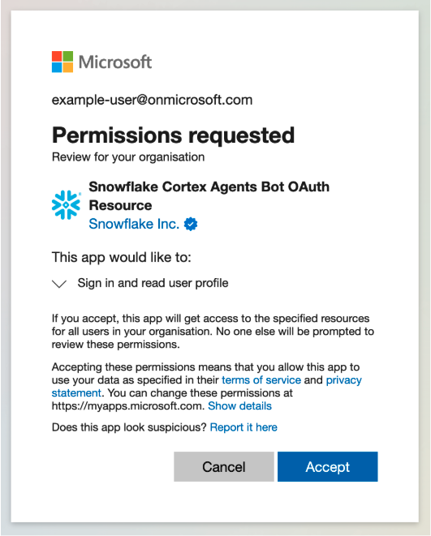

Replace <TENANT-ID> with your organization’s tenant identifier:
https://login.microsoftonline.com/<TENANT-ID>/adminconsent?client_id=bfdfa2a2-bce5-4aee-ad3d-41ef70eb5086
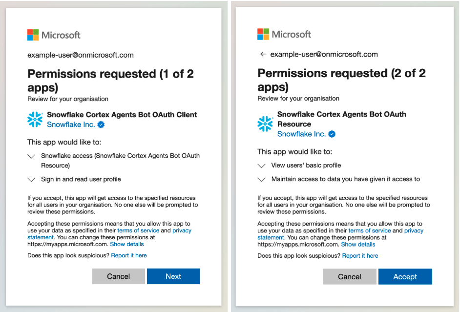

Admins should also make sure the Snowflake users have an email address in their Snowflake user that matches their Microsoft tenant.

Admins should execute the below code to create the security integration necessary to authenticate with Entra ID.
 <TENANT-ID> with your organization’s tenant identifier:
```sql
CREATE OR REPLACE SECURITY INTEGRATION entra_id_cortex_agents_integration 
TYPE = EXTERNAL_OAUTH 
ENABLED = TRUE 
EXTERNAL_OAUTH_TYPE = AZURE 
EXTERNAL_OAUTH_ISSUER = 'https://login.microsoftonline.com/<TENANT-ID>/v2.0'
EXTERNAL_OAUTH_JWS_KEYS_URL = 'https://login.microsoftonline.com/<TENANT-ID>/discovery/v2.0/keys'
EXTERNAL_OAUTH_AUDIENCE_LIST = ('0f24a786-17be-4e2b-bcc8-54f6b1ac897c') EXTERNAL_OAUTH_TOKEN_USER_MAPPING_CLAIM = ('email', 'upn')
EXTERNAL_OAUTH_SNOWFLAKE_USER_MAPPING_ATTRIBUTE = 'email_address' 
EXTERNAL_OAUTH_ANY_ROLE_MODE = 'ENABLE'
```
Search for "Snowflake Cortex Agents" in the Teams App Store and click "Add".

The first user from your organization to interact with the agent will be guided through a one-time setup process to connect your Snowflake account for the whole organization. This user must have administrative permissions in the target Snowflake account to complete the setup.

Depending on your organization’s Microsoft Teams policies, a Teams Administrator may need to approve or unblock the application before it is available to users. Reach to [Overview of app management and governance in Teams admin center”](https://learn.microsoft.com/en-us/microsoftteams/manage-apps) article in order to get more information on managing access to Teams Applications across an organization.
ADD SCREENSHPT HERE OF ADD

Upon the first interaction with the agent, you will be prompted to log in with your Microsoft account.

The agent will inform you that no Snowflake account is configured for your organization and will ask for your Snowflake account URL. Clicking “I’m the Snowflake administrator” action will unveil a simple form, where you can provide your account’s URL.
-The full URL to enter is your_organization-your_account.snowflakecomputing.com.
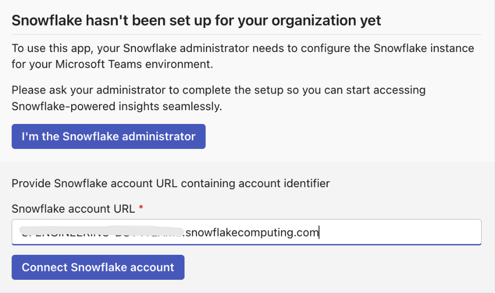

Initial Verification: The agent will perform several checks:
- Verifies that the URL leads to a valid Snowflake instance.
- Confirms your Microsoft user has access to this Snowflake instance via the security integration.
- Checks that your user holds administrative privileges in the Snowflake account.
- Ensures the Snowflake account is hosted in the Azure East US 2 region.

Enter Configuration Details: Once the initial verification is successful, a form will appear requesting the following configuration details:
- Account Alias: A user-friendly name for this Snowflake connection (e.g., "Production Analytics," "Dev Environment"), which will be used in UI to refer to this Snowflake account.
- Agent Definition Path: The fully qualified path to the agent's JSON definition file on your Snowflake stage.
- Warehouse: The name of the Snowflake warehouse the agent will use to run queries.
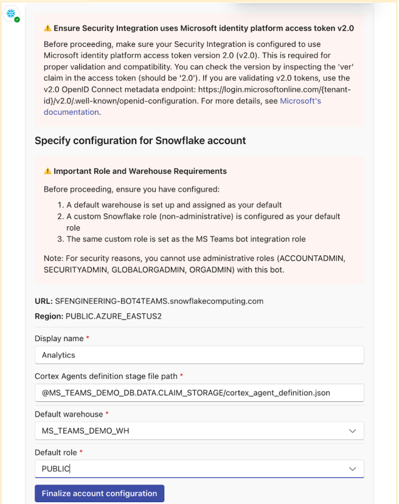

Final Validation: After you submit the configuration, the agent performs a final validation:
- Checks that the JSON file exists at the specified path and contains a valid agent definition.
- Performs a test API call to the agent to ensure it can respond correctly.

If all checks pass, the Snowflake configuration has been successfully added for your organization. All users from your Microsoft tenant can now interact with the agent using this Snowflake account.

<!-- ------------------------ -->
## Using the App
Duration: 8

Access the App from 365 Copilot or Teams experience. The experience will be mostly the same with some minor variations in the UI. See the two screenshots below.

#### Teams
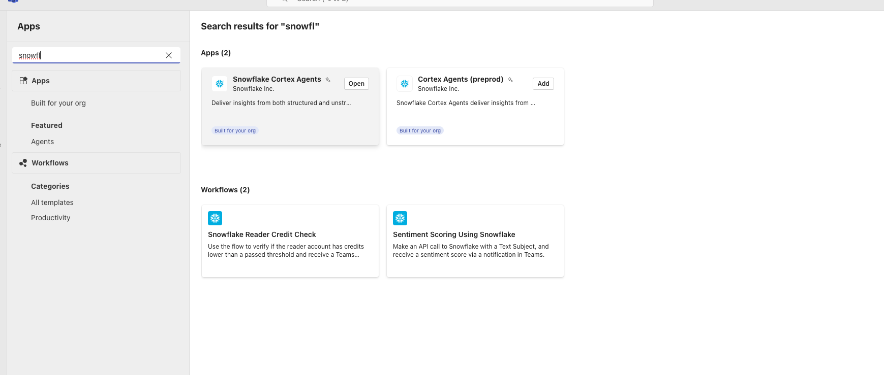

#### 365 Copilot
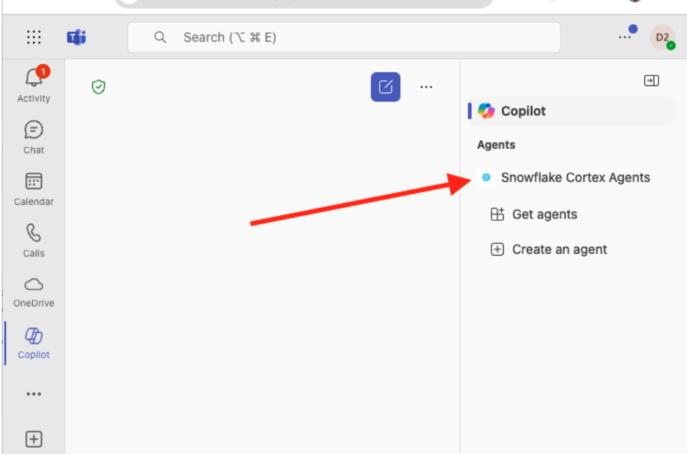


You can start by asking "view available commands" to then access the admin panel, get help or choose a new snowflake account.
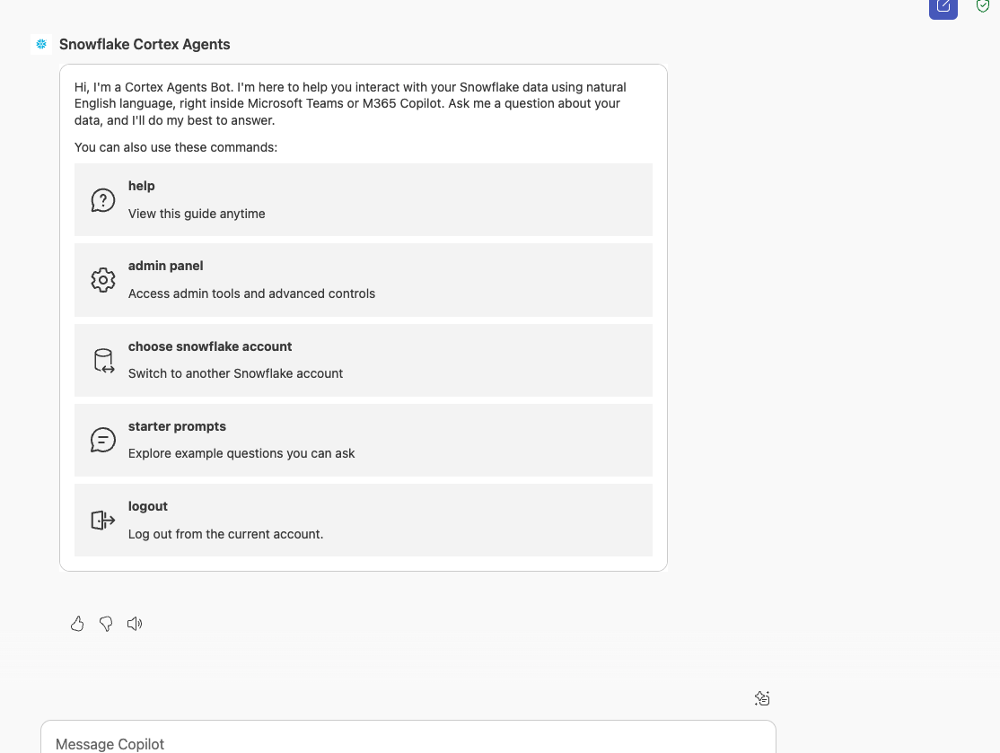

For now you can view available prompts.
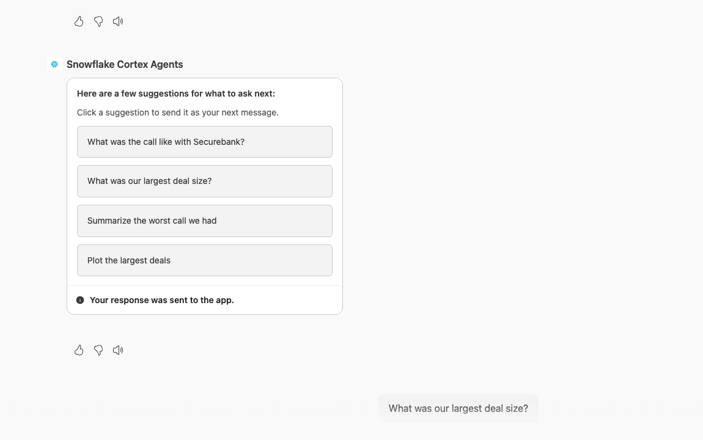

Select (or ask by typing) "what was the largest deal size" to see the answer.
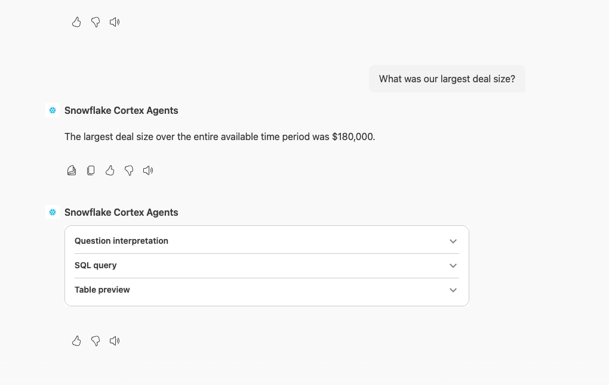


And you are now ready to go! You can continue asking questions like:
- plot our largest deals by deal size?
- how was the call with Securebank?
- what was the worst customer call we had?
- show the deals that are currently pending
<!-- ------------------------ -->
## Conclusion and Resources
Duration: 5

### Technical Considerations
This quickstart showed you how to connect MS Teams and 365 Copilots Snowflake Cortex using the new App. Hopefully you're just getting started and you can build bigger Cortex Agents to help support business users query all types of data with plain text from Teams and 365 Copilot!

### What you learned
By following this quickstart, you learned how to:
- Create Snowflake Cortex Services for Search, Analyst and Agents
- Securely connect Teams and 365 Copilot App to Cortex Agents
- Use the Teams and 365 App with Cortex Agents

### Resources
- Learn more about the complete [Snowflake Cortex set of features](https://www.snowflake.com/en/product/features/cortex/)
- Learn more about using [Agents in Cortex](https://docs.snowflake.com/en/user-guide/snowflake-cortex/cortex-agents)
- Learn more about using [MS 365](https://www.microsoft.com/en-us/microsoft-365/products-apps-services)
- Learn more about using [MS Copilot](https://www.microsoft.com/en-us/microsoft-copilot/organizations)
- The official [Teams 365 Copilot Cortex App Docs]()
- [Demo Video](https://cloudpartners.transform.microsoft.com/download?assetname=assets%2FCopilot-Partner-Demo-Snowflake-v2505.mp4)
