id: getting_started_with_time_series_using_snowflake_streaming_sis_ml_notebooks
summary: Getting Started with Time Series Analysis in Snowflake
categories: Getting-Started
environments: web
status: Published 
feedback link: https://github.com/Snowflake-Labs/sfguides/issues
tags: Getting Started, Data Science, Data Engineering
author: nathan.birch@snowflake.com, jonathan.regenstein@snowflake.com

# Getting Started with Time Series Analysis in Snowflake
<!-- ------------------------ -->
## Overview
Duration: 4

This guide will take you through a scenario of using Snowflake to ingest, transform, and analyze time series data using Snowflake, with the ultimate goal of serving time series data to end users via a Streamlit application in Snowflake.

### Key Activities

To achieve this goal, the following key activities will be performed:
- **Configure a Snowflake account** to work with time series data
- **Setup a streaming ingestion** client to to stream time series data into Snowflake using Snowpipe Streaming
- **Model and transform** the streaming time series data
- **Analyze the data** using time series queries
- **Create time series Snowpark functions** to assist in analysis
- **Deploy a time series Streamlit** application in Snowflake for end users to query time series

### Streamlit Application
**GOAL:** A Streamlit application will be deploy  Snowflake will allow users to easily report on time series IOT data streamed into Snowflake.

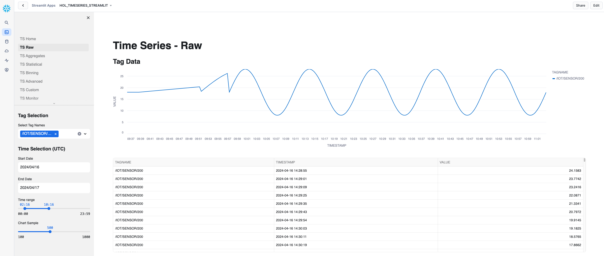

### Architecture Plan
A simulated IOT streaming datafeed will be used for this exercise, ingesting into a RAW staging table via Snowpark Streaming. Once data is streamed into a stage table, a task will detect when new records are loaded, and execute a procedure to transform the data into a dimensional model, ready for analytics. A Streamlit application will be deployed in Snowflake to then enable end users to report on the IOT streamed data.

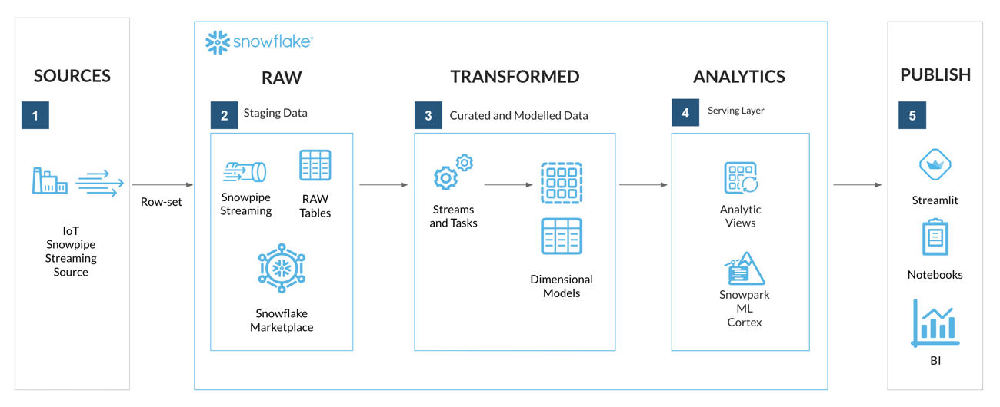


<!-- ------------------------ -->
## Prerequisites

### Knowledge and Tooling

To participate in the virtual hands-on lab, attendees need the following:
- Familiarity with Snowflake, basic SQL knowledge, Snowsight UI and Snowflake objects
- Familiarity with command-line navigation within a terminal
- Access or sign-up to a [Snowflake Enterprise Account on preferred AWS region](https://signup.snowflake.com/?lab=getting_started_with_time_series_using_snowflake_streaming_sis_ml_notebooks&utm_cta=getting_started_with_time_series_using_snowflake_streaming_sis_ml_notebooks) with **ACCOUNTADMIN** access
- Access to a personal GitHub account to fork the QuickStart repo and create GitHub Codespace

### Lab environment
For this Quickstart we will be using [GitHub Codespaces](https://docs.github.com/en/codespaces/overview) for our development environment. Codespaces offer a hosted development environment with a hosted, web-based VS Code environment. At the time of writing, GitHub offers [free Codespace hours each month](https://github.com/features/codespaces) when using a 2 node environment, which should be enough to work through this lab.

> aside negative
> 
> It is recommended to use a personal GitHub account which will have permissions to deploy a GitHub Codespace.

### Snowflake Account details
Login to your Snowflake account using Snowsight and execute the [SYSTEM$ALLOWLIST](https://docs.snowflake.com/en/sql-reference/functions/system_allowlist) command:

```sql
-- Note down your Snowflake account identifier details
-- <account_identifier>.snowflakecomputing.com

SELECT SYSTEM$ALLOWLIST();
```

**Note** the **<account_identifier>**.snowflakecomputing.com by retrieving at the **host** attribute returned. This will be used to update the **<ACCOUNT_IDENTIFIER>** configuration variables during the Lab Setup.

<!-- ------------------------ -->
## Lab Setup

Duration: 10

### Fork the GitHub Repository and Deploy a GitHub Codespace

The very first step is to fork the GitHub repository [Getting Started with Time Series in Snowflake associated GitHub Repository](https://github.com/Snowflake-Labs/sfguide-getting-started-with-time-series-using-snowflake-streaming-sis-ml-notebooks). This repository contains all the code you need to successfully complete this Quickstart guide.  Click on the **"Fork"** button near the top right. Complete any required fields and click **"Create Fork"**.

To create a GitHub Codespace, click on the green `<> Code` button from the GitHub repository homepage. In the Code popup, click on the `Codespaces` tab and then on the green `Create codespace on main`.

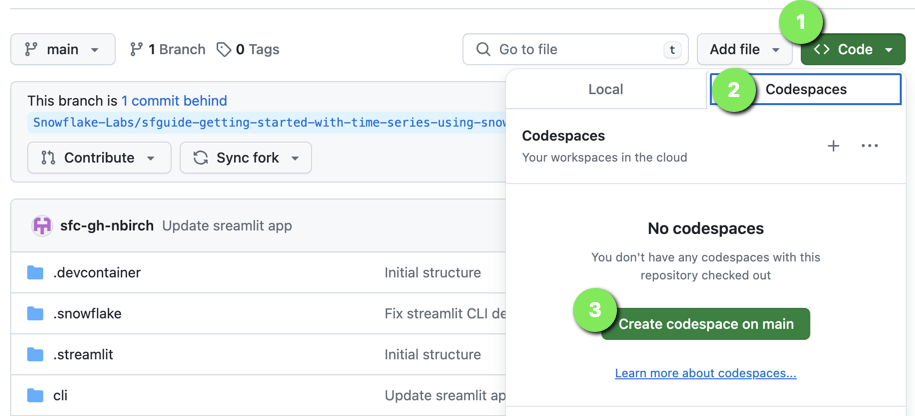

> aside positive
> 
> This will open a new tab and begin **Setting up your codespace**.
>

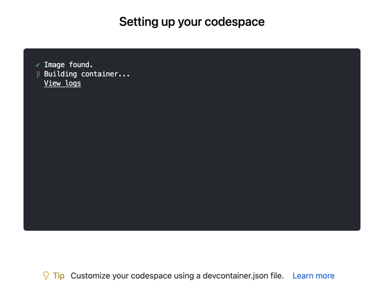

> aside negative
>
> Please wait for the **postCreateCommand** to run.
>
> **Ignore any notifications** that may prompt to refresh the Codespace, these will disappear once the postCreateCommand has run.
>

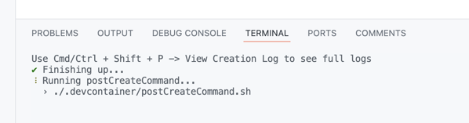

### Github Codespace Deployment Summary
The Github Codespace deployment will take a few minutes as it sets up the entire environment for this Quickstart. Once complete you should see a hosted web-based version of **VS Code Integrated Development Environment (IDE)** in your browser with your forked repository.

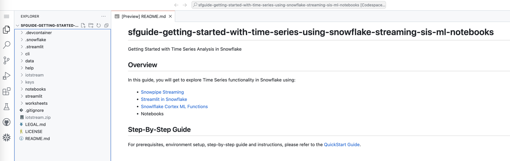

Here is what is being done for you:
- Start a hosted, web-based VS Code editor
- Pull a copy of the forked Lab QuickStart GitHub repository within the VS Code container
- Installing Anaconda (conda)
- Installing a Java Runtime Environment (JRE)
- Anaconda setup
  - Creating an Anaconda virtual environment: **hol-timeseries**
  - Using the [Snowflake Anaconda Channel](https://repo.anaconda.com/pkgs/snowflake/)
  - Installing the [Snowflake Snowpark Python library and connector](https://docs.snowflake.com/en/developer-guide/snowpark/index)
  - Installing [Snowflake Command Line Interface (CLI)](https://docs.snowflake.com/en/developer-guide/snowflake-cli-v2/index)
- VS Code setup
  - Installing the [Snowflake VS Code Extension](https://docs.snowflake.com/en/user-guide/vscode-ext)
- Private key pair setup using OpenSSL to be used to connect to Snowflake
- Downloads and extracts a Java IOT streaming client application

> aside negative
>
> If you do not see the **Snowflake VS Code Extension** try **Refreshing** your browser window.

### Verify Your Anaconda Environment is Activated

During the Codespace setup the postCreateCommand script created an Anaconda virtual environment named **hol-timeseries**. This virtual environment contains the packages needed to connect and interact with Snowflake using the Snowflake CLI.

To activate the virtual environment:

1. Open `Menu > Terminal > New Terminal` - a new terminal window will now open

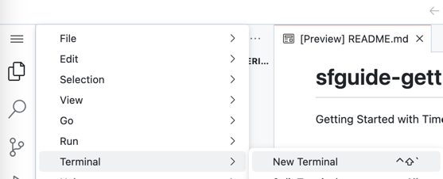

2. Enter command `conda activate hol-timeseries`

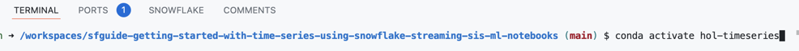

The terminal prompt should now show a prefix `(hol-timeseries)` to confirm the **hol-timeseries** virtual environment is activated.

### Configure Snowflake Account Connection Configurations

> aside negative
>
> This section will require the Snowflake **<account_identifier>** noted earlier.
>
> **NOTE:** The account identifers entered will **NOT** include the **.snowflakecomputing.com**

In VS Code navigate to the following files and replace **<ACCOUNT_IDENTIFER>** with your account identifer value:

1. `.snowflake/config.toml`
    - **account** variable for both connections 
2. `iotstream/snowflake.properties`
    - **account** variable
    - **host** variable
    
### Configure Snowflake VS Code Extension Connection

1. Open the Snowflake VS Code Extension
2. Enter your **<ACCOUNT_IDENTIFER>**
3. Click Continue

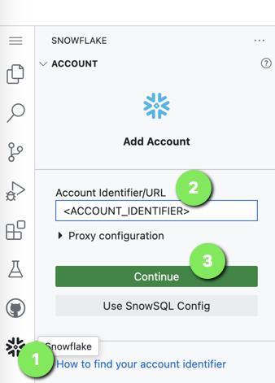

1. For Auth Method select `Username/password`
2. Now enter the **ACCOUNTADMIN** user
3. Enter the ACCOUNTADMIN **password**
3. Click `Sign in`

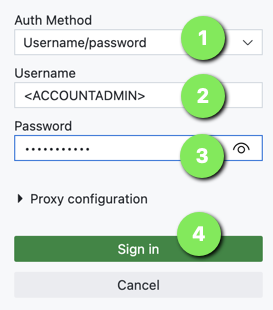

> aside positive
>
> **The VS Code Snowflake Extension** should now be connected to your Snowflake.

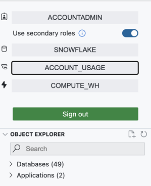

### Update Snowflake Setup Worksheet

**Worksheets** have been provided for the next sections, these can be accessed by going to **VS Code Explorer** and expanding the `worksheets` folder.

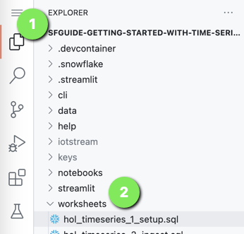

> aside negative
>
> We'll need to update the setup worksheet with your **PUBLIC KEY** to be used during the initial Snowflake setup.

### Retrieve Snowflake Private Keypair
As part of the GitHub Codespace setup, an OpenSSL Private Keypair was generated in the VS Code `keys` directory.

Retrieve the **PUBLIC KEY** value from the `keys/rsa_key.pub` file. This will be need in the setup worksheet.

> aside negative
>
> Only the **PUBLIC KEY** value is required, which is the section between:
>
> `-----BEGIN PUBLIC KEY-----` and `-----END PUBLIC KEY-----`
>
> ensure you **DO NOT** copy these lines.

### Update Snowflake Setup Worksheet with Lab PUBLIC KEY
Open worksheet: `worksheets/hol_timeseries_1_setup.sql`

**Find and replace** the **<RSA_PUBLIC_KEY>** with the **PUBLIC KEY** retrieved from the `keys/rsa_key.pub` file.

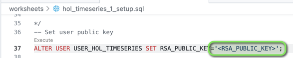

> aside positive
>
> The pasted **PUBLIC KEY** can show on mulitple lines and will work.

The **Snowflake setup** worksheets are now ready to run, and The Lab environment is now ready!

<!-- ------------------------ -->
## Setup Snowflake Resources
Duration: 5

Create the foundational Snowflake Objects for this lab.

This includes:
- Role: ROLE_HOL_TIMESERIES - role used for working through the lab
- User: USER_HOL_TIMESERIES -
- Warehouses:
    - HOL_TRANSFORM_WH - warehouse used for transforming ingested data
    - HOL_ANALYTICS_WH - warehouse used for analytics
- Database: HOL_TIMESERIES - main database to store all lab objects
- Schemas:
    - STAGING - RAW data source landing schema
    - TRANSFORM - transformed and modelled data schema
    - ANALYTICS - serving and analytics functions schema

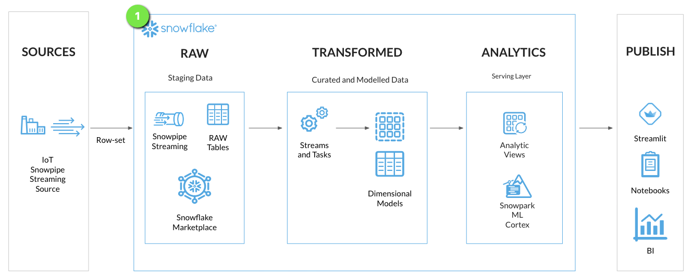

> aside negative
> 
>  This section will require the **ACCOUNTADMIN** login. This was previously setup in **Snowflake VS Code Extension** connection.
>

### Run Setup Worksheet

> aside positive
> 
> Open worksheet: `worksheets/hol_timeseries_1_setup.sql`
>

```sql
-- Setup HOL role and user
USE ROLE ACCOUNTADMIN;
CREATE ROLE IF NOT EXISTS ROLE_HOL_TIMESERIES;
GRANT ROLE ROLE_HOL_TIMESERIES TO ROLE SYSADMIN;
CREATE OR REPLACE USER USER_HOL_TIMESERIES DEFAULT_ROLE = "ROLE_HOL_TIMESERIES" COMMENT = "HOL Time Series user.";
GRANT ROLE ROLE_HOL_TIMESERIES TO USER USER_HOL_TIMESERIES;

/* EXTERNAL ACTIVITY

A public key is setup in Github Codespace file: keys/rsa_pub.key

Retrieve the public key detail and replace <RSA_PUBLIC_KEY> with the contents of the public key
excluding the -----BEGIN PUBLIC KEY----- and -----END PUBLIC KEY----- lines

*/

-- Set user public key
ALTER USER USER_HOL_TIMESERIES SET RSA_PUBLIC_KEY='<RSA_PUBLIC_KEY>';

-- Setup HOL infrastructure objects
USE ROLE SYSADMIN;

-- Transform WH
CREATE WAREHOUSE IF NOT EXISTS HOL_TRANSFORM_WH WITH WAREHOUSE_SIZE = XSMALL AUTO_SUSPEND = 60 AUTO_RESUME = TRUE INITIALLY_SUSPENDED = TRUE COMMENT = 'Transform Warehouse' ENABLE_QUERY_ACCELERATION = TRUE;
-- Analytics WH
CREATE WAREHOUSE IF NOT EXISTS HOL_ANALYTICS_WH WITH WAREHOUSE_SIZE = XSMALL AUTO_SUSPEND = 60 AUTO_RESUME = TRUE INITIALLY_SUSPENDED = TRUE COMMENT = 'Analytics Warehouse' ENABLE_QUERY_ACCELERATION = TRUE;
-- HOL Database
CREATE DATABASE IF NOT EXISTS HOL_TIMESERIES COMMENT = 'HOL Time Series database.';
-- HOL Schemas
CREATE SCHEMA IF NOT EXISTS HOL_TIMESERIES.STAGING WITH MANAGED ACCESS COMMENT = 'HOL Time Series STAGING schema.';
CREATE SCHEMA IF NOT EXISTS HOL_TIMESERIES.TRANSFORM WITH MANAGED ACCESS COMMENT = 'HOL Time Series TRANSFORM schema.';
CREATE SCHEMA IF NOT EXISTS HOL_TIMESERIES.ANALYTICS WITH MANAGED ACCESS COMMENT = 'HOL Time Series ANALYTICS schema.';

-- Grant HOL role object access
GRANT USAGE ON DATABASE HOL_TIMESERIES TO ROLE ROLE_HOL_TIMESERIES;
GRANT ALL ON WAREHOUSE HOL_TRANSFORM_WH TO ROLE ROLE_HOL_TIMESERIES;
GRANT ALL ON WAREHOUSE HOL_ANALYTICS_WH TO ROLE ROLE_HOL_TIMESERIES;
GRANT ALL ON SCHEMA HOL_TIMESERIES.STAGING TO ROLE ROLE_HOL_TIMESERIES;
GRANT ALL ON SCHEMA HOL_TIMESERIES.TRANSFORM TO ROLE ROLE_HOL_TIMESERIES;
GRANT ALL ON SCHEMA HOL_TIMESERIES.ANALYTICS TO ROLE ROLE_HOL_TIMESERIES;
```


<!-- ------------------------ -->
## Snowpipe Streaming Ingestion

```sql
USE ROLE ROLE_HOL_TIMESERIES;
USE SCHEMA HOL_TIMESERIES.STAGING;

-- RAW IOTSTREAM Table
CREATE OR REPLACE TABLE HOL_TIMESERIES.STAGING.RAW_TS_IOTSTREAM_DATA (
    RECORD_CONTENT VARIANT
);

```


> aside positive
> 
>  [Streams](https://docs.snowflake.com/en/user-guide/streams-intro) provides a change tracking mechanism for your tables and > views, enabling and ensuring "exactly once" semantics for new or changed data.
>
> [Tasks](https://docs.snowflake.com/en/user-guide/tasks-intro) are Snowflake objects to execute a single command, which could be simple SQL command or calling an extensive stored > > procedure.  Tasks can be scheduled or run on-demand, either within a Snowflake Virtual warehouse or serverless.


Test channel open
```bash
./Test.sh
```

Check channel is open
```sql
show channels;
```

Run initial load
```bash
./Run_MAX.sh
```


<!-- ------------------------ -->
## Data Modelling and Transformation
Duration: 2

```sql
USE ROLE ROLE_HOL_TIMESERIES;
USE HOL_TIMESERIES.TRANSFORM;

-- Setup Transform Tabls
-- IOT Tag Metadata (Dimension)
CREATE OR REPLACE TABLE HOL_TIMESERIES.TRANSFORM.TS_TAG_METADATA (
    TAGKEY NUMBER NOT NULL,
    NAMESPACE VARCHAR,
    TAGNAME VARCHAR NOT NULL,
    TAGALIAS ARRAY,
    TAGDESCRIPTION VARCHAR,
    TAGUOM VARCHAR,
    TAGDATATYPE VARCHAR,
    INGESTION_TIMESTAMP TIMESTAMP_NTZ,
    CONSTRAINT PK_TSD_TAG_METADATA PRIMARY KEY (TAGKEY) RELY
);

-- IOT Tag Readings (Fact)
CREATE OR REPLACE TABLE HOL_TIMESERIES.TRANSFORM.TS_TAG_READINGS (
    TAGKEY NUMBER NOT NULL,
    TS TIMESTAMP_NTZ NOT NULL,
    VAL VARCHAR,
    VAL_NUMERIC FLOAT,
    INGESTION_TIMESTAMP TIMESTAMP_NTZ,
    CONSTRAINT FK_TSD_TAG_READINGS FOREIGN KEY (TAGKEY) REFERENCES HOL_TIMESERIES.TRANSFORM.TS_TAG_METADATA (TAGKEY) RELY
);
```

<!-- ------------------------ -->
## Time Series Analysis
Duration: 2

Setup serving layer views

```sql
-- Setup Reporting Views
USE ROLE ROLE_HOL_TIMESERIES;
USE HOL_TIMESERIES.ANALYTICS;

-- IOT Tag Reference View
CREATE OR REPLACE VIEW HOL_TIMESERIES.ANALYTICS.TS_TAG_REFERENCE AS
SELECT
    META.NAMESPACE,
    META.TAGNAME,
    META.TAGALIAS,
    META.TAGDESCRIPTION,
    META.TAGUOM,
    META.TAGDATATYPE
FROM HOL_TIMESERIES.TRANSFORM.TS_TAG_METADATA META;

-- IOT Tag Readings View
CREATE OR REPLACE VIEW HOL_TIMESERIES.ANALYTICS.TS_TAG_READINGS AS
SELECT
    META.TAGNAME,
    READ.TS AS TIMESTAMP,
    READ.VAL AS VALUE,
    READ.VAL_NUMERIC AS VALUE_NUMERIC
FROM HOL_TIMESERIES.TRANSFORM.TS_TAG_METADATA META
INNER JOIN HOL_TIMESERIES.TRANSFORM.TS_TAG_READINGS READ
ON META.TAGKEY = READ.TAGKEY;
```

Time Series queries

```sql
-- RAW DATA
SELECT tagname, timestamp, value, NULL AS value_numeric
FROM HOL_TIMESERIES.ANALYTICS.TS_TAG_READINGS
WHERE timestamp > '2000-03-26 12:45:37' 
AND timestamp <= '2024-03-26 14:45:37' 
AND tagname = '/WITSML/NO 15/9-F-7/DEPTH' 
ORDER BY tagname, timestamp
;

-- HI WATER MARK
SELECT tagname, to_timestamp('2024-03-26 14:47:55') AS timestamp, MAX_BY(value, timestamp) AS value, MAX_BY(value_numeric, timestamp) AS value_numeric 
FROM HOL_TIMESERIES.ANALYTICS.TS_TAG_READINGS
WHERE timestamp > '2000-03-26 08:47:55' 
AND timestamp <= '2024-03-26 14:47:55' 
AND tagname = '/WITSML/NO 15/9-F-7/DEPTH' 
GROUP BY tagname 
ORDER BY tagname, timestamp
;

-- LOW WATER MARK
SELECT tagname, to_timestamp('2024-03-26 14:47:55') AS timestamp, MIN_BY(value, timestamp) AS value, MIN_BY(value_numeric, timestamp) AS value_numeric 
FROM HOL_TIMESERIES.ANALYTICS.TS_TAG_READINGS
WHERE timestamp > '2000-03-26 08:47:55' 
AND timestamp <= '2024-03-26 14:47:55' 
AND tagname = '/WITSML/NO 15/9-F-7/DEPTH' 
GROUP BY tagname 
ORDER BY tagname, timestamp
;

-- DOWNSAMPLING / RESAMPLING
-- BINNING
SELECT tagname, TIME_SLICE(DATEADD(MILLISECOND, -1, timestamp), 15, 'MINUTE', 'END') AS timestamp, NULL AS value, APPROX_PERCENTILE(value_numeric, 0.5) AS value_numeric
FROM HOL_TIMESERIES.ANALYTICS.TS_TAG_READINGS 
WHERE timestamp > '2000-03-26 02:58:38' AND timestamp <= '2024-03-28 14:58:38' 
AND tagname IN ('/WITSML/NO 15/9-F-7/DEPTH') 
GROUP BY TIME_SLICE(DATEADD(MILLISECOND, -1, timestamp), 15, 'MINUTE', 'END'), tagname 
ORDER BY tagname, timestamp
;

-- FIRST_VALUE / LAST_VALUE
SELECT tagname, ts as timestamp, f_value_numeric, l_value_numeric
FROM (
SELECT tagname, TIME_SLICE(DATEADD(MILLISECOND, -1, timestamp), 5, 'MINUTE', 'END') AS ts, timestamp, value_numeric, FIRST_VALUE(value_numeric) OVER (PARTITION BY tagname, ts ORDER BY timestamp) AS f_value_numeric, LAST_VALUE(value_numeric) OVER (PARTITION BY tagname, ts ORDER BY timestamp) AS l_value_numeric 
FROM HOL_TIMESERIES.ANALYTICS.TS_TAG_READINGS  
WHERE timestamp > '2000-03-26 03:29:08' AND timestamp <= '2024-03-28 15:29:08' 
AND tagname = '/WITSML/NO 15/9-F-7/DEPTH' 
GROUP BY TIME_SLICE(DATEADD(MILLISECOND, -1, timestamp), 5, 'MINUTE', 'END'), timestamp, tagname, value_numeric
)
GROUP BY tagname, ts, f_value_numeric, l_value_numeric
ORDER BY tagname, ts
;


-- STDDEV
SELECT tagname, TIME_SLICE(DATEADD(MILLISECOND, -1, timestamp), 15, 'MINUTE', 'END') AS timestamp, NULL AS value, STDDEV(value_numeric) AS value_numeric 
FROM HOL_TIMESERIES.ANALYTICS.TS_TAG_READINGS 
WHERE timestamp > '2000-03-26 15:00:50' AND timestamp <= '2024-03-25 15:00:50' 
AND tagname = '/WITSML/NO 15/9-F-7/DEPTH' 
GROUP BY TIME_SLICE(DATEADD(MILLISECOND, -1, timestamp), 15, 'MINUTE', 'END'), tagname 
ORDER BY tagname, timestamp
;


```

<!-- ------------------------ -->
## Snowpark User Defined Table Function
Duration: 2

Setup LTTB Downsample Function
```sql
USE ROLE ROLE_HOL_TIMESERIES;
USE HOL_TIMESERIES.ANALYTICS;

-- LTTB Downsampling Table Function
CREATE OR REPLACE FUNCTION HOL_TIMESERIES.ANALYTICS.FUNCTION_TS_LTTB (
    TIMESTAMP NUMBER,
    VALUE_NUMERIC FLOAT,
    SIZE NUMBER
) 
RETURNS TABLE (
    TIMESTAMP NUMBER,
    VALUE_NUMERIC FLOAT
)
LANGUAGE PYTHON
RUNTIME_VERSION = 3.11
PACKAGES = ('pandas', 'plotly-resampler', 'setuptools')
HANDLER = 'lttb_run'
AS $$
from _snowflake import vectorized
import pandas as pd
from plotly_resampler.aggregation.algorithms.lttb_py import LTTB_core_py

class lttb_run:
    @vectorized(input=pd.DataFrame)

    def end_partition(self, df):
        if df.SIZE.max() >= len(df.index):
            return df[['TIMESTAMP','VALUE_NUMERIC']]
        else:
            idx = LTTB_core_py.downsample(
                df.TIMESTAMP.to_numpy(),
                df.VALUE_NUMERIC.to_numpy(),
                n_out=df.SIZE.max()
            )
            return df[['TIMESTAMP','VALUE_NUMERIC']].iloc[idx]
$$;
```

LTTB Query
```sql
-- LTTB
SELECT data.tagname, lttb.timestamp::varchar::timestamp_ntz AS timestamp, NULL AS value, lttb.value_numeric 
FROM (
SELECT tagname, TIME_SLICE(DATEADD(MILLISECOND, -1, timestamp), 1, 'SECOND', 'END') AS timestamp, APPROX_PERCENTILE(value_numeric, 0.5) AS value_numeric 
FROM HOL_TIMESERIES.ANALYTICS.TS_TAG_READINGS
WHERE timestamp > '2000-03-26 02:50:21' AND timestamp <= '2024-03-26 14:50:21' 
AND tagname IN ('/WITSML/NO 15/9-F-7/DEPTH') 
GROUP BY tagname, TIME_SLICE(DATEADD(MILLISECOND, -1, timestamp), 1, 'SECOND', 'END')
) AS data 
CROSS JOIN TABLE(HOL_TIMESERIES.ANALYTICS.function_ts_lttb(date_part(epoch_nanosecond, data.timestamp), data.value_numeric, 500) OVER (PARTITION BY data.tagname ORDER BY data.timestamp)) AS lttb
ORDER BY tagname, timestamp
;
```

<!-- ------------------------ -->
## Streamlit in Snowflake
Duration: 2

Deploy Streamlit application to Snowflake

```bash
snow --config-file=".snowflake/config.toml" streamlit deploy --replace --project "streamlit" --connection="hol-timeseries-streamlit"
```

<!-- ------------------------ -->
## Milestone

### Activitied
- Ingest streaming time series data into Snowflake
- Created a data pipeline to transform streaming time series data
- Deployed ana analytics layer for serving time series data
- Delivered a Streamlit application interface for end users to run time series analytics

### Outcomes
- A standard ingestion pattern has been established for easy onboarding of time series data sources
- Unlocked low latency ingestion pipelines for data sources
- Delivered an easy user experience in Streamlit to derive insights and value from time series data


<!-- ------------------------ -->
## Clean-up
Duration: 1

- Remove [Github Codespace](https://github.com/codespaces)


<!-- ------------------------ -->
## Conclusion and Resources
Duration: 1


### What we've covered


### Additional resources
- [Getting Started with Snowflake CLI](https://quickstarts.snowflake.com/guide/getting-started-with-snowflake-cli/index.html)
- [Getting Started with Streams & Tasks](https://quickstarts.snowflake.com/guide/getting_started_with_streams_and_tasks/index.html)