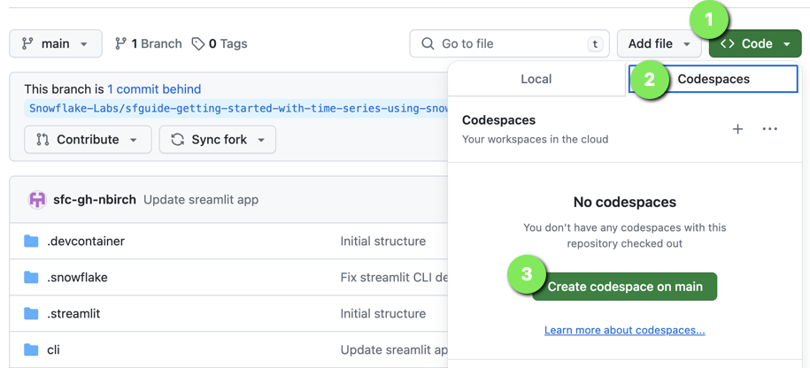

id: getting_started_with_time_series_using_snowflake_streaming_sis_ml_notebooks
summary: Getting Started with Time Series Analysis in Snowflake
categories: Getting-Started
environments: web
status: Published 
feedback link: https://github.com/Snowflake-Labs/sfguides/issues
tags: Getting Started, Data Science, Data Engineering
author: nathan.birch@snowflake.com, jonathan.regenstein@snowflake.com

# Getting Started with Time Series Analysis in Snowflake
<!-- ------------------------ -->
## Overview 
Duration: 1

Please use [this markdown file](https://raw.githubusercontent.com/Snowflake-Labs/sfguides/master/site/sfguides/sample.md) as a template for writing your own Snowflake Quickstarts. This example guide has elements that you will use when writing your own guides, including: code snippet highlighting, downloading files, inserting photos, and more. 

It is important to include on the first page of your guide the following sections: Prerequisites, What you'll learn, What you'll need, and What you'll build. Remember, part of the purpose of a Snowflake Guide is that the reader will have **built** something by the end of the tutorial; this means that actual code needs to be included (not just pseudo-code).

The rest of this Snowflake Guide explains the steps of writing your own guide. 
 
<!-- ------------------------ -->
## Quickstart Setup

Duration: 10

### Fork the GitHub Repository

The very first step is to fork the GitHub repository [Getting Started with Time Series in Snowflake associated GitHub Repository](https://github.com/Snowflake-Labs/sfguide-getting-started-with-time-series-using-snowflake-streaming-sis-ml-notebooks). This repository contains all the code you need to successfully complete this Quickstart guide.  Click on the "Fork" button near the top right. Complete any required fields and click "Create Fork".

### Create GitHub Codespace

For this Quickstart we will be using [GitHub Codespaces](https://docs.github.com/en/codespaces/overview) for our development environment. Codespaces offer a hosted development environment with a hosted, web-based VS Code environment. GitHub currently offers [60 hours for free each month](https://github.com/features/codespaces) when using a 2 node environment, which should be enough to work through this lab.

To create a GitHub Codespace, click on the green `<> Code` button from the GitHub repository homepage. In the Code popup, click on the `Codespaces` tab and then on the green `Create codespace on main`.



This will open a new tab and begin setting up your codespace. It will take a few minutes as it sets up the entire environment for this Quickstart. Here is what is being done for you:

- Creating a container for your environment
- Installing Anaconda (conda)
- Anaconda setup
  - Creating the Anaconda environment
  - Installing the Snowpark Python library
- VS Code setup
  - Installing VS Code
  - Installing the Snowflake VS Code extension
- Starting a hosted, web-based VS Code editor

Once the codepsace has been created and started you should see a hosted web-based version of VS Code with your forked repository set up! Just a couple more things and we're ready to start.

### Configure Snowflake Credentials
[TODO]


### Verify Your Anaconda Environment is AVailable

During the codespace setup we created an Anaconda environment named `hol-timeseries`. And when VS Code started up it should have automatically activated the environment in your terminal. You should see something like this in the terminal, and in particular you should see `(hol-timeseries)` before your bash prompt.

<!-- ------------------------ -->
## Metadata Configuration
Duration: 2

It is important to set the correct metadata for your Snowflake Guide. The metadata contains all the information required for listing and publishing your guide and includes the following:


- **summary**: This is a sample Snowflake Guide 
  - This should be a short, 1 sentence description of your guide. This will be visible on the main landing page. 
- **id**: sample 
  - make sure to match the id here with the name of the file, all one word.
- **categories**: data-science 
  - You can have multiple categories, but the first one listed is used for the icon.
- **environments**: web 
  - `web` is default. If this will be published for a specific event or  conference, include it here.
- **status**: Published
  - (`Draft`, `Published`, `Deprecated`, `Hidden`) to indicate the progress and whether the sfguide is ready to be published. `Hidden` implies the sfguide is for restricted use, should be available only by direct URL, and should not appear on the main landing page.
- **feedback link**: https://github.com/Snowflake-Labs/sfguides/issues
- **tags**: Getting Started, Data Science, Twitter 
  - Add relevant  tags to make your sfguide easily found and SEO friendly.
- **authors**: Daniel Myers 
  - Indicate the author(s) of this specific sfguide.

---

You can see the source metadata for this guide you are reading now, on [the github repo](https://raw.githubusercontent.com/Snowflake-Labs/sfguides/master/site/sfguides/sample.md).


<!-- ------------------------ -->
## Creating a Step
Duration: 2

A single sfguide consists of multiple steps. These steps are defined in Markdown using Header 2 tag `##`. 

```markdown
## Step 1 Title
Duration: 3

All the content for the step goes here.

## Step 2 Title
Duration: 1

All the content for the step goes here.
```

To indicate how long each step will take, set the `Duration` under the step title (i.e. `##`) to an integer. The integers refer to minutes. If you set `Duration: 4` then a particular step will take 4 minutes to complete. 

The total sfguide completion time is calculated automatically for you and will be displayed on the landing page. 

<!-- ------------------------ -->
## Code Snippets, Info Boxes, and Tables
Duration: 2

Look at the [markdown source for this sfguide](https://raw.githubusercontent.com/Snowflake-Labs/sfguides/master/site/sfguides/sample.md) to see how to use markdown to generate code snippets, info boxes, and download buttons. 

### JavaScript
```javascript
{ 
  key1: "string", 
  key2: integer,
  key3: "string"
}
```

### Java
```java
for (statement 1; statement 2; statement 3) {
  // code block to be executed
}
```

### Info Boxes
> aside positive
> 
>  This will appear in a positive info box.


> aside negative
> 
>  This will appear in a negative info box.

### Buttons
<button>

  [This is a download button](link.com)
</button>

### Tables
<table>
    <thead>
        <tr>
            <th colspan="2"> **The table header** </th>
        </tr>
    </thead>
    <tbody>
        <tr>
            <td>The table body</td>
            <td>with two columns</td>
        </tr>
    </tbody>
</table>

### Hyperlinking
[Youtube - Halsey Playlists](https://www.youtube.com/user/iamhalsey/playlists)

<!-- ------------------------ -->
## Images, Videos, and Surveys, and iFrames
Duration: 2

Look at the [markdown source for this guide](https://raw.githubusercontent.com/Snowflake-Labs/sfguides/master/site/sfguides/sample.md) to see how to use markdown to generate these elements. 

### Videos
Videos from youtube can be directly embedded:
<video id="KmeiFXrZucE"></video>

### Inline Surveys
<form>
  <name>How do you rate yourself as a user of Snowflake?</name>
  <input type="radio" value="Beginner">
  <input type="radio" value="Intermediate">
  <input type="radio" value="Advanced">
</form>

### Embed an iframe


<!-- ------------------------ -->
## Conclusion
Duration: 1

At the end of your Snowflake Guide, always have a clear call to action (CTA). This CTA could be a link to the docs pages, links to videos on youtube, a GitHub repo link, etc. 

If you want to learn more about Snowflake Guide formatting, checkout the official documentation here: [Formatting Guide](https://github.com/googlecodelabs/tools/blob/master/FORMAT-GUIDE.md)

### What we've covered
- creating steps and setting duration
- adding code snippets
- embedding images, videos, and surveys
- importing other markdown files