id: getting_started_with_time_series_using_snowflake_streaming_sis_ml_notebooks
summary: Getting Started with Time Series Analysis in Snowflake
categories: Getting-Started
environments: web
status: Published 
feedback link: https://github.com/Snowflake-Labs/sfguides/issues
tags: Getting Started, Data Engineering
author: nathan.birch@snowflake.com

# Getting Started with Time Series Analytics for IoT in Snowflake
<!-- ------------------------ -->
## Overview
Duration: 5

Snowflake offers a rich set of functionalities for **Time Series Analytics** making it a performant and cost effective platform for bringing in your time series workloads. This quickstart lab covers a real world scenario of ingesting, analyzing and visualizing IOT time series data.


### What You'll Learn

Upon completing this quickstart lab, you will have learned how to perform time series analytics in Snowflake, and will have gained practical experience in several areas:

- **Setup a streaming ingestion** client to to stream time series data into Snowflake using Snowpipe Streaming
- **Model and transform** the streaming time series data using Dynamic Tables
- **Analyzing the data** using native time series functions
- **Building your own time series functions** using Snowpark UDFs when necessary
- **Deploying a Streamlit application** for visualizing and analyzing time series data


### What You'll Build

By the end of this lab you will have an **end-to-end streaming Time Series Analysis solution**, with a front-end application deployed using **Streamlit in Snowflake**.


### What You'll Need

- A supported Snowflake [Browser](https://docs.snowflake.com/en/user-guide/setup#browser-requirements)
- [Sign-up for a Snowflake Trial](https://signup.snowflake.com/?lab=getting_started_with_time_series_using_snowflake_streaming_sis_ml_notebooks&utm_cta=getting_started_with_time_series_using_snowflake_streaming_sis_ml_notebooks) OR have access to an existing Snowflake account with the ACCOUNTADMIN role. Select the Enterprise edition, AWS as a cloud provider.
- Access to a **personal [GitHub](https://github.com/signup) account** to fork the quickstart repo and create [GitHub Codespaces](https://docs.github.com/en/codespaces/overview). Codespaces offer a hosted development environment. GitHub offers [free Codespace hours each month](https://github.com/features/codespaces) when using a 2 or 4 node environment, which should be enough to work through this lab.

> aside negative
> 
> It is recommended to use a personal GitHub account which will have permissions to deploy a GitHub Codespace.
>

<!-- ------------------------ -->
## Lab Setup
Duration: 15

### Step 1 - Fork the Lab GitHub Repository

The first step is to create a fork of the Lab GitHub repository.

1. In a web browser log into your [Github](https://github.com/) account.

2. Open [Getting Started with Time Series Analytics for IoT in Snowflake associated GitHub Repository](https://github.com/Snowflake-Labs/sfguide-getting-started-with-time-series-using-snowflake-streaming-sis-ml-notebooks). 
    - This repository contains all the code you need to successfully complete this quickstart guide.

3. Click on the **"Fork"** button near the top right.


4. Click **"Create Fork"**.


### Step 2 - Deploy a GitHub Codespace for the Lab

Now create the GitHub Codespace.

1. Click on the green `<> Code` button from the GitHub repository homepage. 

2. In the Code popup, click on the `Codespaces` tab.

3. Click `Create codespace on main`.


> aside negative
>
> If you are seeing the message **Codespace access limited**, you may be logged into Github with an organization account. Please [Sign up to GitHub](https://github.com/signup) using a personal account and retry the **Lab Setup**.
>


> aside positive
> 
> This will open a new browser window and begin **Setting up your codespace**. The Github Codespace deployment will take several minutes to set up the entire environment for this lab.
>


> aside negative
>
> **Please wait** for the **postCreateCommand** to run. It may take 5-10 mins to fully deploy.
>
> **Ignore any notifications** that may prompt to refresh the Codespace, these will disappear once the postCreateCommand has run.
>


### INFO: Github Codespace Deployment Summary

Once complete you should see a hosted web-based version of **VS Code Integrated Development Environment (IDE)** in your browser with your forked repository.


**The Github Codespace deployment will contain all the resources needed to complete the lab**.

> aside negative
>
> If you do not see the **Snowflake VS Code Extension** try **Refreshing** your browser window.
>

### Step 3 - Verify Your Anaconda Environment is Activated

During the Codespace setup the postCreateCommand script created an Anaconda virtual environment named **hol-timeseries**. This virtual environment contains the packages needed to connect and interact with Snowflake using the **Snowflake CLI**.

To activate the virtual environment:

1. Remove any existing open Terminal by clicking the `Kill Terminal` button

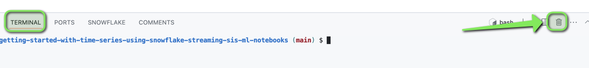

2. Open `Menu > Terminal > New Terminal` - a new terminal window will now open


3. Enter command `conda activate hol-timeseries`


The terminal prompt should now show a prefix `(hol-timeseries)` to confirm the **hol-timeseries** virtual environment is activated.


### Step 4 - Update Snowflake Connection Account Identifiers in Lab Files

1. Login to your Snowflake account using a browser 

2. From the menu expand `Projects > Worksheets`


3. At the top right of the **Worksheets** screen select `+ > SQL Worksheet`. This will open a new worksheet in Snowsight.


4. **In the new worksheet**, execute the [SYSTEM$ALLOWLIST](https://docs.snowflake.com/en/sql-reference/functions/system_allowlist) command:

```sql
SELECT SYSTEM$ALLOWLIST();

-- Note down your Snowflake account identifier host detail
-- where "type":"SNOWFLAKE_DEPLOYMENT_REGIONLESS"
-- <account_identifier>.snowflakecomputing.com
```

5. In the results returned, below the command, **select the first row returned**, and **Copy** the **<account_identifier>**.snowflakecomputing.com for the **host** attribute returned, where the **type** is **"type":"SNOWFLAKE_DEPLOYMENT_REGIONLESS"**.

    - **Worksheet Output** for `SELECT SYSTEM$ALLOWLIST();`. **<account_identifier>** is in-front of `.snowflakecomputing.com`.


6. Back in **VS Code**, navigate to the following files and in the files replace **<ACCOUNT_IDENTIFIER>** with your Snowflake account identifier value:

* `.snowflake/config.toml`
    - **account** variable for **both** connections


 
* `iotstream/snowflake.properties`
    - **account** variable
    - **host** variable

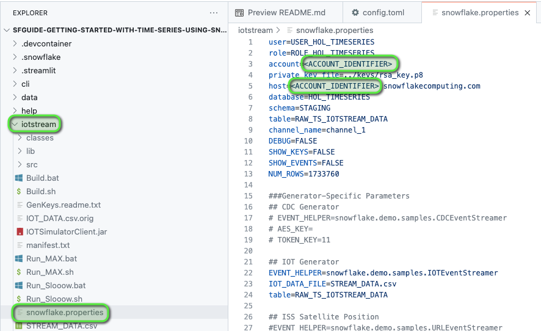

7. **Save** file changes by pressing `Command/Ctrl` and `S`


### Step 5 - Configure Snowflake VS Code Extension Connection

1. Open the **Snowflake VS Code Extension**


2. For **Account Identifier/URL**, enter your **<ACCOUNT_IDENTIFIER>**, **without** the `.snowflakecomputing.com`
3. Click **Continue**


1. For Auth Method select `Username/password`
2. For Username enter the **ACCOUNTADMIN user** (defined when setting up the Snowflake account)
3. For Password enter the **ACCOUNTADMIN password**
3. Click `Sign in`


> aside positive
>
> **The VS Code Snowflake Extension** should now be connected to your Snowflake. **Once connected**, it will show a `Sign Out` button along with **Databases** and **Applications** in the `OBJECT EXPLORER` section.


### Step 6 - Expand Snowflake Worksheets Folder

**Worksheets** have been provided for the next sections, these can be accessed by going to **VS Code Explorer** and expanding the `worksheets` folder.


> aside negative
>
> We'll need to update the **setup worksheet** with your **PUBLIC KEY** to be used during the initial Snowflake setup.


### Step 7 - Retrieve the Snowflake Public Key
As part of the GitHub Codespace setup, an **OpenSSL Private Key-pair** will be generated in the **VS Code** `keys` directory.

**Copy** the **PUBLIC KEY** value from the `keys/rsa_key.pub` file. This will be needed in the setup worksheet.

> aside negative
>
> Only the **PUBLIC KEY** value is required, which is the section **between**
>
> `-----BEGIN PUBLIC KEY-----` and `-----END PUBLIC KEY-----`
>
> ensure you **DO NOT** copy these lines.

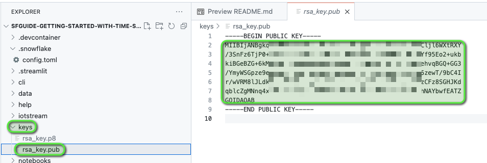


### Step 8 - Update Snowflake "Setup" Worksheet with Lab Provisioned PUBLIC KEY
1. Open worksheet: `worksheets/hol_timeseries_1_setup.sql`

2. **Find and replace** the **<RSA_PUBLIC_KEY>** with the **PUBLIC KEY** copied from the `keys/rsa_key.pub` file.


**NOTE:** The pasted **PUBLIC KEY** can show on multiple lines and will work.


> aside positive
> 
> **NO NEED TO RUN** anything just yet, this is just setup, this worksheet will be run in the next section.
>
> The **Snowflake setup** is complete, and The Lab environment is configured!

<!-- ------------------------ -->
## Setup Snowflake Resources
Duration: 5

#### Create the Foundational Snowflake Objects for this Lab

This includes:
- Role: **ROLE_HOL_TIMESERIES** - role used for working throughout the lab
- User: **USER_HOL_TIMESERIES** - the user to connect to Snowflake
- Warehouses:
    - **HOL_TRANSFORM_WH** - warehouse used for transforming ingested data
    - **HOL_ANALYTICS_WH** - warehouse used for analytics
- Database: **HOL_TIMESERIES** - main database to store all lab objects
- Schemas:
    - **STAGING** - RAW data source landing schema
    - **TRANSFORM** - transformed and modeled data schema
    - **ANALYTICS** - serving and analytics functions schema


### Step 1 - Run Snowflake Setup Worksheet

In the **GitHub Codespace VS Code** open worksheet: `worksheets/hol_timeseries_1_setup.sql`

**Run through the worksheet to get Snowflake resources created.**

> aside negative
> 
>  This section will run using the **ACCOUNTADMIN** login setup via **Snowflake VS Code Extension** connection.
> 
>  There are **EXTERNAL ACTIVITY** sections in the worksheet, these sections will be executed within the **GitHub Codespace**.
>

```sql
/*
SNOWFLAKE SETUP SCRIPT
*/

-- Login and assume ACCOUNTADMIN role
USE ROLE ACCOUNTADMIN;

-- Create lab role
CREATE ROLE IF NOT EXISTS ROLE_HOL_TIMESERIES;
GRANT ROLE ROLE_HOL_TIMESERIES TO ROLE SYSADMIN;

-- Create lab user
CREATE OR REPLACE USER USER_HOL_TIMESERIES DEFAULT_ROLE = "ROLE_HOL_TIMESERIES"
COMMENT = "HOL Time Series user.";
GRANT ROLE ROLE_HOL_TIMESERIES TO USER USER_HOL_TIMESERIES;

/* EXTERNAL ACTIVITY

A public key is setup in Github Codespace VS Code environment

Retrieve the public key detail and replace <RSA_PUBLIC_KEY>
with the contents of the public key excluding
the -----BEGIN PUBLIC KEY----- and -----END PUBLIC KEY----- lines

*/

-- Assign lab user public key
ALTER USER USER_HOL_TIMESERIES SET RSA_PUBLIC_KEY='<RSA_PUBLIC_KEY>';

-- Setup HOL infrastructure objects
-- Assume the SYSADMIN role
USE ROLE SYSADMIN;

-- Create a TRANSFORM WH - used for ingest and transform activity
CREATE WAREHOUSE IF NOT EXISTS HOL_TRANSFORM_WH WITH WAREHOUSE_SIZE = XSMALL
AUTO_SUSPEND = 60 AUTO_RESUME = TRUE INITIALLY_SUSPENDED = TRUE
COMMENT = 'Transform Warehouse' ENABLE_QUERY_ACCELERATION = TRUE;

-- Create an Analytics WH = used for analytics and reporting
CREATE WAREHOUSE IF NOT EXISTS HOL_ANALYTICS_WH WITH WAREHOUSE_SIZE = XSMALL
AUTO_SUSPEND = 60 AUTO_RESUME = TRUE INITIALLY_SUSPENDED = TRUE
COMMENT = 'Analytics Warehouse' ENABLE_QUERY_ACCELERATION = TRUE;


-- Create HOL Database
CREATE DATABASE IF NOT EXISTS HOL_TIMESERIES COMMENT = 'HOL Time Series database.';


-- HOL Schemas
-- Create STAGING schema - for RAW data
CREATE SCHEMA IF NOT EXISTS HOL_TIMESERIES.STAGING WITH MANAGED ACCESS
COMMENT = 'HOL Time Series STAGING schema.';

-- Create TRANSFORM schema - for modeled data
CREATE SCHEMA IF NOT EXISTS HOL_TIMESERIES.TRANSFORM WITH MANAGED ACCESS
COMMENT = 'HOL Time Series TRANSFORM schema.';

-- Create ANALYTICS schema - for serving analytics
CREATE SCHEMA IF NOT EXISTS HOL_TIMESERIES.ANALYTICS WITH MANAGED ACCESS
COMMENT = 'HOL Time Series ANALYTICS schema.';


-- Grant HOL role access to lab resources
-- Assign database grants to lab role
GRANT USAGE ON DATABASE HOL_TIMESERIES TO ROLE ROLE_HOL_TIMESERIES;

-- Assign Warehouse grants to lab role
GRANT ALL ON WAREHOUSE HOL_TRANSFORM_WH TO ROLE ROLE_HOL_TIMESERIES;

GRANT ALL ON WAREHOUSE HOL_ANALYTICS_WH TO ROLE ROLE_HOL_TIMESERIES;

-- Assign schema grants to lab role
GRANT ALL ON SCHEMA HOL_TIMESERIES.STAGING TO ROLE ROLE_HOL_TIMESERIES;

GRANT ALL ON SCHEMA HOL_TIMESERIES.TRANSFORM TO ROLE ROLE_HOL_TIMESERIES;

GRANT ALL ON SCHEMA HOL_TIMESERIES.ANALYTICS TO ROLE ROLE_HOL_TIMESERIES;

-- Cortex ML Functions
GRANT CREATE SNOWFLAKE.ML.ANOMALY_DETECTION ON SCHEMA HOL_TIMESERIES.ANALYTICS TO ROLE ROLE_HOL_TIMESERIES;

GRANT CREATE SNOWFLAKE.ML.FORECAST ON SCHEMA HOL_TIMESERIES.ANALYTICS TO ROLE ROLE_HOL_TIMESERIES;

/*
SETUP SCRIPT COMPLETED
*/
```

> aside positive
> 
>  The Snowflake foundation objects have now been deployed, and we can continue on to set up a **Snowpipe Streaming Ingestion**.
>

<!-- ------------------------ -->
## Snowpipe Streaming Ingestion
Duration: 10

With the foundational objects setup, we can now **deploy a staging table** to stream time series data into Snowflake via a Snowpipe Streaming client.

For this lab a **Java IOT Simulator Client** application has been created to stream IoT sensor readings into Snowflake.


### Step 1 - Create Streaming Staging Table

We'll create a stage loading table to stream RAW time series data into Snowflake. This will be located in the **STAGING** schema of the **HOL_TIMESERIES** database.


In the **GitHub Codespace VS Code** open worksheet: `worksheets/hol_timeseries_2_ingest.sql`

1. Create the staging table to load IoT streaming data

```sql
-- Set role, context, and warehouse
USE ROLE ROLE_HOL_TIMESERIES;
USE SCHEMA HOL_TIMESERIES.STAGING;
USE WAREHOUSE HOL_TRANSFORM_WH;

-- Setup staging tables
-- IOTSTREAM
CREATE OR REPLACE TABLE HOL_TIMESERIES.STAGING.RAW_TS_IOTSTREAM_DATA (
    RECORD_METADATA VARIANT,
    RECORD_CONTENT VARIANT
)
CHANGE_TRACKING = TRUE
COMMENT = 'IOTSTREAM staging table.'
;
```

The IoT data will be streamed into Snowflake in a similar [schema format as Kafka](https://docs.snowflake.com/en/user-guide/kafka-connector-overview#schema-of-tables-for-kafka-topics) which contains two columns:
- **RECORD_CONTENT** - This contains the Kafka message.
- **RECORD_METADATA** - This contains metadata about the message, for example, the topic from which the message was read.

> aside negative
> 
>  There are **EXTERNAL ACTIVITY** sections in the worksheet, which will be executed within the **GitHub Codespace** terminal. Details in the next steps.
>


### INFO: Snowpipe Streaming Ingest Client SDK

Snowflake provides an [Ingest Client SDK](https://mvnrepository.com/artifact/net.snowflake/snowflake-ingest-sdk) in Java that allows applications, such as Kafka Connectors, to stream rows of data into a Snowflake table at low latency.


The Ingest Client SDK is configured with a secure JDBC connection to Snowflake, and will establish a streaming [Channel](https://docs.snowflake.com/en/user-guide/data-load-snowpipe-streaming-overview#channels) between the client and a Snowflake table.


### Step 2 - Test Streaming Client

Now that a staging table is available to stream time series data. We can look at setting up a streaming connection channel with a Java Snowpipe Streaming client. The simulator Java application is available in the `iotstream` folder of the lab, and can be run via a terminal with a Java runtime.

> aside positive
> 
>  The lab environment has been set up with a **Java Runtime** to execute the Java Snowpipe Streaming client application.
>

In the **GitHub Codespace VS Code**:

1. Open `Menu > Terminal > New Terminal` - a new terminal window will now open


2. Change directory into to the **iotstream** folder: `cd iotstream`

3. Run the `Test.sh` script to confirm a table channel stream can be established with Snowflake.

```bash
./Test.sh
```

> aside positive
> 
> If **successful**, it will return:
> `** Successfully Connected, Test complete! **`
>
> This will confirm that the Java streaming client is able to connect to Snowflake, and is able to establish a channel to the target table.
>

4. In **VS Code** open the worksheet `worksheets/hol_timeseries_2_ingest.sql` and run the `SHOW CHANNELS` command to confirm a channel is now open to Snowflake.

```sql
SHOW CHANNELS;
```

The query should return a single channel `CHANNEL_1_TEST` opened to the `RAW_TS_IOTSTREAM_DATA` table.


**With a channel now opened to the table we are ready to stream data into the table.**


### Step 3 - Load a Simulated IoT Data Set

With the channel connection being successful, we can now load the IoT data set, as fast as the connection and machine will allow.


The simulated IoT dataset contains six sensor devices at various frequencies, with each device being assigned a unique Tag Names within a single **namespace** called **"IOT"**.

| **Namespace** | **Tag Name** | **Frequency** | **Units** | **Data Type** | **Sensor Type** |
| --- | --- | --- | --- | --- | --- |
| IOT | TAG101 | 5 SEC | PSI | DOUBLE | Pressure Gauge |
| IOT | TAG201 | 10 SEC | RPM | DOUBLE | Motor RPM |
| IOT | TAG301 | 1 SEC | KPA | DOUBLE | Pressure Gauge |
| IOT | TAG401 | 60 SEC | CM3S | DOUBLE | Flow Sensor |
| IOT | TAG501 | 60 SEC | DEGF | DOUBLE | Temperature Gauge |
| IOT | TAG601 | 10 SEC | KPA | DOUBLE | Pressure Gauge |


1. In the **VS Code** `Terminal` run the `Run_MAX.sh` script to load the IoT data.

```bash
./Run_MAX.sh
```

> aside positive
> 
> The **Java client application** is being called using a **Terminal shell script**. The client accepts various speed parameters to change the number of rows that are streamed. The **"MAX"** script will send as many rows as the device will allow.
>

2. In **VS Code** open the worksheet `worksheets/hol_timeseries_2_ingest.sql` and run the `SHOW CHANNELS` command to confirm a new channel is now open to Snowflake.

```sql
SHOW CHANNELS;
```

The query should return a new channel `CHANNEL_1_MAX` opened to the `RAW_TS_IOTSTREAM_DATA` table, with an **offset_token** showing the number of rows loaded.

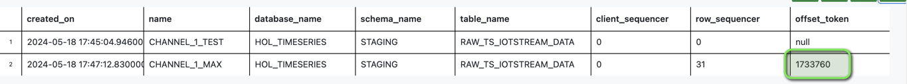

3. In **VS Code** open the worksheet `worksheets/hol_timeseries_2_ingest.sql` and view the streamed records, by running the `Check stream table data` script.

```sql
-- Check stream table data
SELECT * FROM HOL_TIMESERIES.STAGING.RAW_TS_IOTSTREAM_DATA LIMIT 10;
```

- **RECORD_METADATA** - This contains metadata about IOT Tag reading.


- **RECORD_CONTENT** - This contains the IOT Tag reading.


Each IoT device reading is a **JSON payload**, transmitted in the following Kafka like format:

```json
{
    "meta":
    {
        "LogAppendTime": "1714487166815",
        "headers":
        {
            "namespace": "IOT",
            "source": "STREAM_DATA.csv",
            "speed": "MAX"
        },
        "offset": "116",
        "partition": "1",
        "topic": "time-series"
    },
    "content":
    {
        "datatype": "double",
        "tagname": "SENSOR/TAG301",
        "timestamp": "1704067279",
        "units": "KPA",
        "value": "118.152"
    } 
}
```

> aside positive
> 
>  Data has now been **streamed into Snowflake**, and we can now look at modeling the data for analytics.
>

<!-- ------------------------ -->
## Data Modeling and Transformation
Duration: 5

Now that data has been streamed into Snowflake, we are ready for some **Data Engineering** activities to get the data into a report ready state for analytics. We'll be **transforming the data** from the **JSON VARIANT** format into a tabular format. Using Snowflake **Dynamic Tables**, the data streamed into Snowflake will continuously update the analytics layers.

Along with setting up Dynamic Tables for continuous loading, we'll also deploy some **analytics views** for the consumer serving layer. This will allow for specific columns of data to be exposed to the end users and applications.


### INFO: Dynamic Tables

[Dynamic Tables](https://docs.snowflake.com/en/user-guide/dynamic-tables-intro) are a declarative way of defining your data pipeline in Snowflake. It's a Snowflake table which is **defined as a query to continuously and automatically materialize the result of that query as a table**. Dynamic Tables can join and aggregate across **multiple source objects** and **incrementally update** results as sources change.

Dynamic Tables can also be chained together to create a DAG for more complex data pipelines.


### Step 1 - Model Time Series Data with Dynamic Tables

For the IoT streaming data we'll setup two Dynamic Tables in a simple Dimension and Fact model:
- **DT_TS_TAG_METADATA (Dimension)**: Containing Tag Metadata such as tag names, sourcing, and data types
- **DT_TS_TAG_READINGS (Fact)**: Containing the readings from each IoT sensor in raw and numeric format


In **VS Code** open the worksheet `worksheets/hol_timeseries_3_transform.sql` and run the **Dynamic Tables Setup** scripts.

```sql
-- Dynamic Tables Setup
-- Set role, context, and warehouse
USE ROLE ROLE_HOL_TIMESERIES;
USE HOL_TIMESERIES.TRANSFORM;
USE WAREHOUSE HOL_TRANSFORM_WH;

/* Tag metadata (Dimension)
TAGNAME - uppercase concatenation of namespace and tag name
QUALIFY - deduplication filter to only include unique tag names
*/
CREATE OR REPLACE DYNAMIC TABLE HOL_TIMESERIES.TRANSFORM.DT_TS_TAG_METADATA
TARGET_LAG = '1 MINUTE'
WAREHOUSE = HOL_TRANSFORM_WH
REFRESH_MODE = 'INCREMENTAL'
AS
SELECT
    SRC.RECORD_METADATA:headers:namespace::VARCHAR AS NAMESPACE,
    SRC.RECORD_METADATA:headers:source::VARCHAR AS TAGSOURCE,
    UPPER(CONCAT('/', SRC.RECORD_METADATA:headers:namespace::VARCHAR, '/', TRIM(SRC.RECORD_CONTENT:tagname::VARCHAR))) AS TAGNAME,
    SRC.RECORD_CONTENT:units::VARCHAR AS TAGUNITS,
    SRC.RECORD_CONTENT:datatype::VARCHAR AS TAGDATATYPE
FROM HOL_TIMESERIES.STAGING.RAW_TS_IOTSTREAM_DATA SRC
QUALIFY ROW_NUMBER() OVER (PARTITION BY UPPER(CONCAT('/', SRC.RECORD_METADATA:headers:namespace::VARCHAR, '/', TRIM(SRC.RECORD_CONTENT:tagname::VARCHAR))) ORDER BY SRC.RECORD_CONTENT:timestamp::NUMBER, SRC.RECORD_METADATA:offset::NUMBER) = 1
;

/* Tag readings (Fact)
TAGNAME - uppercase concatenation of namespace and tag name
QUALIFY - deduplication filter to only include unique tag readings based on tagname and timestamp
*/
CREATE OR REPLACE DYNAMIC TABLE HOL_TIMESERIES.TRANSFORM.DT_TS_TAG_READINGS
TARGET_LAG = '1 MINUTE'
WAREHOUSE = HOL_TRANSFORM_WH
REFRESH_MODE = 'INCREMENTAL'
AS
SELECT
    UPPER(CONCAT('/', SRC.RECORD_METADATA:headers:namespace::VARCHAR, '/', TRIM(SRC.RECORD_CONTENT:tagname::VARCHAR))) AS TAGNAME,
    SRC.RECORD_CONTENT:timestamp::VARCHAR::TIMESTAMP_NTZ AS TIMESTAMP,
    SRC.RECORD_CONTENT:value::VARCHAR AS VALUE,
    TRY_CAST(SRC.RECORD_CONTENT:value::VARCHAR AS FLOAT) AS VALUE_NUMERIC,
    SRC.RECORD_METADATA:partition::VARCHAR AS PARTITION,
    SRC.RECORD_METADATA:offset::VARCHAR AS OFFSET
FROM HOL_TIMESERIES.STAGING.RAW_TS_IOTSTREAM_DATA SRC
QUALIFY ROW_NUMBER() OVER (PARTITION BY UPPER(CONCAT('/', SRC.RECORD_METADATA:headers:namespace::VARCHAR, '/', TRIM(SRC.RECORD_CONTENT:tagname::VARCHAR))), SRC.RECORD_CONTENT:timestamp::NUMBER ORDER BY SRC.RECORD_METADATA:offset::NUMBER) = 1;
```

> aside positive
> 
>  **Dynamic Tables** have a [TARGET_LAG](https://docs.snowflake.com/en/user-guide/dynamic-tables-refresh#label-dynamic-tables-understand-dt-lag) parameter, which defines a **target “freshness”** for the  data. In this case, we have configured the Dynamic Tables to have a TARGET_LAG of 1 minute, so we want the Dynamic Table to **update within 1 minute of the base tables being updated**.
>


### Step 2 - Review Dynamic Table Details

1. Login to Snowflake, and from the menu expand `Data > Databases > HOL_TIMESERIES > TRANSFORM > Dynamic Tables > DT_TS_TAG_METADATA > Refresh History`

**The DT_TS_TAG_METADATA table will show six rows loaded, representing the six tags of data streamed into Snowflake**.

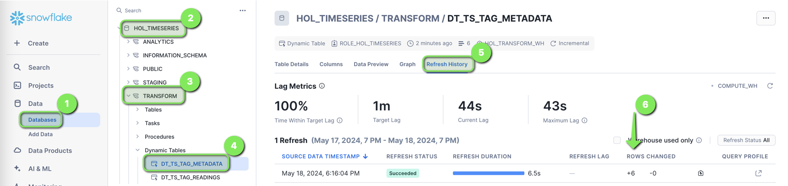

2. Open the `Data Preview` tab

**You can now see the Tag Metadata in a columnar table format**.

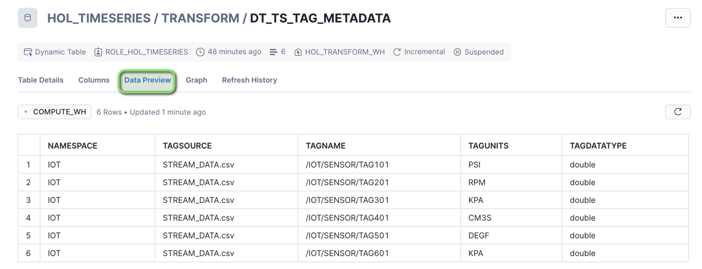

3. Select `Dynamic Tables > DT_TS_TAG_READINGS > Refresh History`

**The DT_TS_TAG_READINGS table will show all the tag readings streamed into Snowflake**.

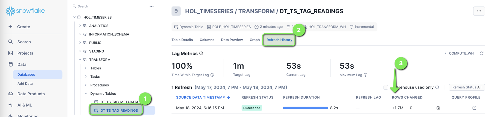

4. Open the `Data Preview` tab

**You can now see the Tag Readings in a columnar table format**.

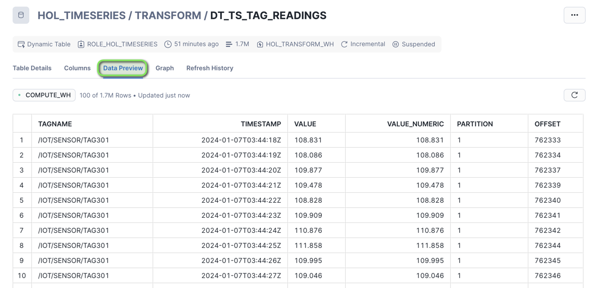

> aside positive
> 
>  Data is now being **transformed in Snowflake** using **Dynamic Tables**.
>

### Step 3 - Create Analytics Views for Consumers

The Dynamic Tables are now set up to continuously transform streaming data. We can now look at setting up an **Analytics** serving layer with some views for end users and applications to consume the streaming data.


We'll create a set of analytics views similar to the Dynamic Tables with a subset of columns in the **ANALYTICS** schema:
- **TS_TAG_REFERENCE (Dimension)**: Containing Tag Metadata such as tag names, sourcing, and data types
- **TS_TAG_READINGS (Fact)**: Containing the readings from each IoT sensor in raw and numeric format

In **VS Code** open the worksheet `worksheets/hol_timeseries_3_transform.sql` and run the **Analytics Views Setup** scripts.

```sql
-- Analytics Views Setup
-- Set role, context, and warehouse
USE ROLE ROLE_HOL_TIMESERIES;
USE HOL_TIMESERIES.ANALYTICS;
USE WAREHOUSE HOL_ANALYTICS_WH;

-- Tag Reference View
CREATE OR REPLACE VIEW HOL_TIMESERIES.ANALYTICS.TS_TAG_REFERENCE AS
SELECT
    META.NAMESPACE,
    META.TAGSOURCE,
    META.TAGNAME,
    META.TAGUNITS,
    META.TAGDATATYPE
FROM HOL_TIMESERIES.TRANSFORM.DT_TS_TAG_METADATA META;

-- Tag Readings View
CREATE OR REPLACE VIEW HOL_TIMESERIES.ANALYTICS.TS_TAG_READINGS AS
SELECT
    READ.TAGNAME,
    READ.TIMESTAMP,
    READ.VALUE,
    READ.VALUE_NUMERIC
FROM HOL_TIMESERIES.TRANSFORM.DT_TS_TAG_READINGS READ;
```

> aside positive
> 
>  Data is now **modeled in Snowflake** and available in the **ANALYTICS** schema, and we can now proceed to analyze the data using Snowflake time series functions.
>

<!-- ------------------------ -->
## Time Series Analysis
Duration: 20

Now that we have created the analytics views, we can start to query the data using **Snowflake native time series functions**.


### INFO - Time Series Query Profiles

The following query profiles will be covered in this section.

| **Query Type** | **Functions** | **Description** |
| --- | --- | --- |
| Raw | Time Boundary: Left, Right, and Both | Raw data within a time range. |
| Math [Statistical Aggregates](https://docs.snowflake.com/en/sql-reference/functions-aggregation) | [MIN](https://docs.snowflake.com/en/sql-reference/functions/min), [MAX](https://docs.snowflake.com/en/sql-reference/functions/max), [AVG](https://docs.snowflake.com/en/sql-reference/functions/avg), [COUNT](https://docs.snowflake.com/en/sql-reference/functions/count), [SUM](https://docs.snowflake.com/en/sql-reference/functions/sum), FREQUENCY | Mathematical calculations over values within a time range. |
| Distribution [Statistical Aggregates](https://docs.snowflake.com/en/sql-reference/functions-aggregation) | [APPROX_PERCENTILE](https://docs.snowflake.com/en/sql-reference/functions/approx_percentile), [STDDEV](https://docs.snowflake.com/en/sql-reference/functions/stddev), [VARIANCE](https://docs.snowflake.com/en/sql-reference/functions/variance), [KURTOSIS](https://docs.snowflake.com/en/sql-reference/functions/kurtosis), [SKEW](https://docs.snowflake.com/en/sql-reference/functions/skew) | Statistics on distributions of data. |
| [Window Functions](https://docs.snowflake.com/en/sql-reference/functions-analytic) | [LAG](https://docs.snowflake.com/en/sql-reference/functions/lag), [LEAD](https://docs.snowflake.com/en/sql-reference/functions/lead), [FIRST_VALUE](https://docs.snowflake.com/en/sql-reference/functions/first_value), [LAST_VALUE](https://docs.snowflake.com/en/sql-reference/functions/last_value), ROWS BETWEEN, RANGE BETWEEN | Functions over a group of related rows. |
| Watermarks | [MAX_BY](https://docs.snowflake.com/en/sql-reference/functions/max_by), [MIN_BY](https://docs.snowflake.com/en/sql-reference/functions/min_by) | Find latest or earliest values ordered by timestamps. |
| Downsampling / Time Binning | [TIME_SLICE](https://docs.snowflake.com/en/sql-reference/functions/time_slice) | Time binning aggregations over time intervals. |
| Aligning time series datasets | [ASOF JOIN](https://docs.snowflake.com/en/sql-reference/constructs/asof-join) | Joining time series datasets when the timestamps don't match exactly, and interpolating values. |
| Gap Filling | [GENERATOR](https://docs.snowflake.com/en/sql-reference/functions/generator), [ROW_NUMBER](https://docs.snowflake.com/en/sql-reference/functions/row_number), [SEQ](https://docs.snowflake.com/en/sql-reference/functions/seq1) | Generating timestamps to fill time gaps. |
| Forecasting | [Time-Series Forecasting (Snowflake Cortex ML Functions)](https://docs.snowflake.com/en/user-guide/snowflake-cortex/ml-functions/forecasting), [FORECAST](https://docs.snowflake.com/en/sql-reference/classes/forecast/commands/create-forecast)  | Generating Time Series Forecasts using Snowflake Cortex ML. |


### Step 1 - Copy Worksheet Content To Snowsight Worksheet

**This section will be executed within a Snowflake Snowsight Worksheet.**

1. Login to Snowflake, and from the menu expand `Projects > Worksheets`


2. At the top right of the **Worksheets** screen select `+ > SQL Worksheet`. This will open a new worksheet in Snowsight.


3. In **VS Code** open the worksheet `worksheets/hol_timeseries_4_anaysis.sql`

4. **Copy** the contents of the worksheet to **clipboard**, and paste it into the newly created **Worksheet in Snowsight**


### Step 2 - Run the Snowsight Worksheet Time Series Analysis Queries


### Exploring Raw Time Series Data

We'll start with a simple **Raw** query that returns time series data between an input start time and end time.

**Raw**: Retrieve time series data between an input start time and end time.

```sql
/* RAW
Retrieve time series data between an input start time and end time.
*/
SELECT TAGNAME, TIMESTAMP, VALUE
FROM HOL_TIMESERIES.ANALYTICS.TS_TAG_READINGS
WHERE TIMESTAMP >= '2024-01-01 00:00:00'
AND TIMESTAMP < '2024-01-01 00:00:10'
AND TAGNAME = '/IOT/SENSOR/TAG301'
ORDER BY TAGNAME, TIMESTAMP;
```


### Time Series Statistical Aggregates

The following set of queries contains various [Aggregate Functions](https://docs.snowflake.com/en/sql-reference/functions-aggregation) covering **counts, math operations, distributions, and watermarks**.

**Counts**: Retrieve count and distinct counts within the time boundary.

```sql
/* COUNT AND COUNT DISTINCT
Retrieve count and distinct counts within the time boundary.

COUNT - Count of all values
COUNT DISTINCT - Count of unique values

Note: Counts can work with both varchar and numeric data types.
*/
SELECT TAGNAME, TO_TIMESTAMP_NTZ('2024-01-01 01:00:00') AS TIMESTAMP,
    COUNT(VALUE) AS COUNT_VALUE,
    COUNT(DISTINCT VALUE) AS COUNT_DISTINCT_VALUE
FROM HOL_TIMESERIES.ANALYTICS.TS_TAG_READINGS
WHERE TIMESTAMP > '2024-01-01 00:00:00'
AND TIMESTAMP <= '2024-01-01 01:00:00'
AND TAGNAME = '/IOT/SENSOR/TAG301'
GROUP BY TAGNAME
ORDER BY TAGNAME;
```


**Math Operations**: Retrieve statistical detail for the readings within the time boundary.

```sql
/* MIN/MAX/AVG/SUM
Retrieve statistical aggregates for the readings within the time boundary using math operations.

MIN - Minimum value
MAX - Maximum value
AVG - Average of values (mean)
SUM - Sum of values

Note: Aggregates can work with numerical data types.
*/
SELECT TAGNAME, TO_TIMESTAMP_NTZ('2024-01-01 01:00:00') AS TIMESTAMP,
    MIN(VALUE_NUMERIC) AS MIN_VALUE,
    MAX(VALUE_NUMERIC) AS MAX_VALUE,
    SUM(VALUE_NUMERIC) AS SUM_VALUE,
    AVG(VALUE_NUMERIC) AS AVG_VALUE
FROM HOL_TIMESERIES.ANALYTICS.TS_TAG_READINGS 
WHERE TIMESTAMP > '2024-01-01 00:00:00'
AND TIMESTAMP <= '2024-01-01 01:00:00'
AND TAGNAME = '/IOT/SENSOR/TAG301'
GROUP BY TAGNAME
ORDER BY TAGNAME;
```

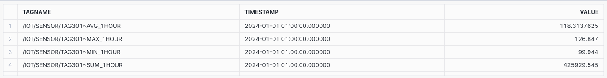

**Relative Frequency**: Consider the use case of **calculating the frequency and relative frequency** of each value within a specific time frame, to **determine how often the value occurs**.

Find the value that occurs most frequently within a time frame.

```sql
/* RELATIVE FREQUENCY
Consider the use case of calculating the frequency and relative frequency of each value within a specific time frame, to determine how often the value occurs.

Find the value that occurs most frequently within a time frame.
*/
SELECT 
    TAGNAME,
    VALUE,
    COUNT(VALUE) AS FREQUENCY,
    COUNT(VALUE) / SUM(COUNT(VALUE)) OVER(PARTITION BY TAGNAME) AS RELATIVE_FREQUENCY
FROM HOL_TIMESERIES.ANALYTICS.TS_TAG_READINGS
WHERE TAGNAME IN ('/IOT/SENSOR/TAG501')
AND TIMESTAMP > '2024-01-01 00:00:00'
AND TIMESTAMP <= '2024-01-01 01:00:00'
AND VALUE IS NOT NULL
GROUP BY TAGNAME, VALUE
ORDER BY TAGNAME, FREQUENCY DESC;
```

**Relative Frequency**: Value 424 occurs most, with a frequency of 13 and a relative frequency of 21.6%. 

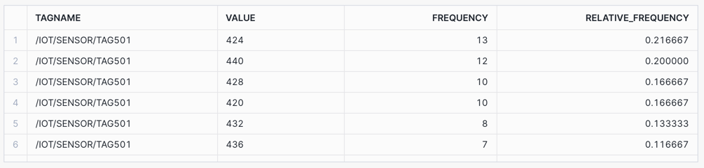


### INFO: Query Result Data Contract

The following **two** queries are written with a standard return set of columns, namely **TAGNAME, TIMESTAMP, and VALUE**. This is a way to structure your query results format if **looking to build an API for time series data**, similar to a data contract with consumers.

The **TAGNAME** is updated to show that a calculation has been applied to the returned values, and multiple aggregations can be grouped together using [UNION ALL](https://docs.snowflake.com/en/sql-reference/operators-query).

**Distribution Statistics**: Retrieve distribution sample statistics within the time boundary.

```sql
/* DISTRIBUTIONS - sample distributions statistics
Retrieve distribution sample statistics within the time boundary.

PERCENTILE_50 - 50% of values are less than this value.
PERCENTILE_95 - 95% of values are less than this value.
STDDEV - Closeness to the mean/average of the distribution.
VARIANCE - Spread between numbers in the time boundary.
KURTOSIS - Measure of outliers occuring.
SKEW - Left (negative) and right (positive) distribution skew.

Note: Distributions can work with numerical data types.
*/
SELECT TAGNAME || '~PERCENTILE_50_1HOUR' AS TAGNAME, TO_TIMESTAMP_NTZ('2024-01-01 01:00:00') AS TIMESTAMP, APPROX_PERCENTILE(VALUE_NUMERIC, 0.5) AS VALUE
FROM HOL_TIMESERIES.ANALYTICS.TS_TAG_READINGS
WHERE TIMESTAMP > '2024-01-01 00:00:00'
AND TIMESTAMP <= '2024-01-01 01:00:00'
AND TAGNAME = '/IOT/SENSOR/TAG301'
GROUP BY TAGNAME
UNION ALL
SELECT TAGNAME || '~PERCENTILE_95_1HOUR' AS TAGNAME, TO_TIMESTAMP_NTZ('2024-01-01 01:00:00') AS TIMESTAMP, APPROX_PERCENTILE(VALUE_NUMERIC, 0.95) AS VALUE
FROM HOL_TIMESERIES.ANALYTICS.TS_TAG_READINGS
WHERE TIMESTAMP > '2024-01-01 00:00:00'
AND TIMESTAMP <= '2024-01-01 01:00:00'
AND TAGNAME = '/IOT/SENSOR/TAG301'
GROUP BY TAGNAME
UNION ALL
SELECT TAGNAME || '~STDDEV_1HOUR' AS TAGNAME, TO_TIMESTAMP_NTZ('2024-01-01 01:00:00') AS TIMESTAMP, STDDEV(VALUE_NUMERIC) AS VALUE
FROM HOL_TIMESERIES.ANALYTICS.TS_TAG_READINGS
WHERE TIMESTAMP > '2024-01-01 00:00:00'
AND TIMESTAMP <= '2024-01-01 01:00:00'
AND TAGNAME = '/IOT/SENSOR/TAG301'
GROUP BY TAGNAME
UNION ALL
SELECT TAGNAME || '~VARIANCE_1HOUR' AS TAGNAME, TO_TIMESTAMP_NTZ('2024-01-01 01:00:00') AS TIMESTAMP, VARIANCE(VALUE_NUMERIC) AS VALUE
FROM HOL_TIMESERIES.ANALYTICS.TS_TAG_READINGS
WHERE TIMESTAMP > '2024-01-01 00:00:00'
AND TIMESTAMP <= '2024-01-01 01:00:00'
AND TAGNAME = '/IOT/SENSOR/TAG301'
GROUP BY TAGNAME
UNION ALL
SELECT TAGNAME || '~KURTOSIS_1HOUR' AS TAGNAME, TO_TIMESTAMP_NTZ('2024-01-01 01:00:00') AS TIMESTAMP, KURTOSIS(VALUE_NUMERIC) AS VALUE
FROM HOL_TIMESERIES.ANALYTICS.TS_TAG_READINGS
WHERE TIMESTAMP > '2024-01-01 00:00:00'
AND TIMESTAMP <= '2024-01-01 01:00:00'
AND TAGNAME = '/IOT/SENSOR/TAG301'
GROUP BY TAGNAME
UNION ALL
SELECT TAGNAME || '~SKEW_1HOUR' AS TAGNAME, TO_TIMESTAMP_NTZ('2024-01-01 01:00:00') AS TIMESTAMP, SKEW(VALUE_NUMERIC) AS VALUE
FROM HOL_TIMESERIES.ANALYTICS.TS_TAG_READINGS
WHERE TIMESTAMP > '2024-01-01 00:00:00'
AND TIMESTAMP <= '2024-01-01 01:00:00'
AND TAGNAME = '/IOT/SENSOR/TAG301'
GROUP BY TAGNAME
ORDER BY TAGNAME;
```


**Watermarks**: Consider the use case of **determining a sensor variance over time** by calculating the latest (high watermark) and earliest (low watermark) readings within a time boundary.

Retrieve both the high watermark (latest time stamped value) and low watermark (earliest time stamped value) readings within the time boundary.

```sql
/* WATERMARKS
Retrieve both the high watermark (latest time stamped value) and low watermark (earliest time stamped value) readings within the time boundary.

MAX_BY - High Watermark - latest reading in the time boundary
MIN_BY - Low Watermark - earliest reading in the time boundary
*/
SELECT TAGNAME || '~MAX_BY_1HOUR' AS TAGNAME, MAX_BY(TIMESTAMP, TIMESTAMP) AS TIMESTAMP, MAX_BY(VALUE, TIMESTAMP) AS VALUE
FROM HOL_TIMESERIES.ANALYTICS.TS_TAG_READINGS
WHERE TIMESTAMP > '2024-01-01 00:00:00'
AND TIMESTAMP <= '2024-01-01 01:00:00'
AND TAGNAME = '/IOT/SENSOR/TAG301'
GROUP BY TAGNAME
UNION ALL
SELECT TAGNAME || '~MIN_BY_1HOUR' AS TAGNAME, MIN_BY(TIMESTAMP, TIMESTAMP) AS TIMESTAMP, MIN_BY(VALUE, TIMESTAMP) AS VALUE
FROM HOL_TIMESERIES.ANALYTICS.TS_TAG_READINGS
WHERE TIMESTAMP > '2024-01-01 00:00:00'
AND TIMESTAMP <= '2024-01-01 01:00:00'
AND TAGNAME = '/IOT/SENSOR/TAG301'
GROUP BY TAGNAME
ORDER BY TAGNAME;
```


### Time Series Analytics using Window Functions

[Window Functions](https://docs.snowflake.com/en/sql-reference/functions-analytic) enable aggregates to operate over groups of data, looking forward and backwards in the ordered data rows, and returning a single result for each group. More detail available in [Using Window Functions](https://docs.snowflake.com/en/user-guide/functions-window-using).

* The **OVER()** clause defines the group of rows used in the calculation.
* The **PARTITION BY** sub-clause allows us to divide that window into sub-windows.
* The **ORDER BY** clause can be used with ASC (ascending) or DESC (descending), and allows ordering of the partition sub-window rows.

**Lag and Lead**: Consider the use case where you need to analyze the **changes in the readings** of a specific IoT sensor **over a short period** (say 10 seconds) by examining the **current, previous, and next values** of the readings.

Access data in previous (LAG) or subsequent (LEAD) rows without having to join the table to itself.

```sql
/* WINDOW FUNCTIONS - LAG AND LEAD
Consider the use case where you need to analyze the changes in the readings of a specific IoT sensor
over a short period (say 10 seconds) by examining the current, previous, and next values of the readings.

Access data in previous (LAG) or subsequent (LEAD) rows without having to join the table to itself.

LAG - Prior time period value
LEAD - Next time period value
*/
SELECT TAGNAME, TIMESTAMP, VALUE_NUMERIC AS VALUE,
    LAG(VALUE_NUMERIC) OVER (
        PARTITION BY TAGNAME ORDER BY TIMESTAMP) AS LAG_VALUE,
    LEAD(VALUE_NUMERIC) OVER (
        PARTITION BY TAGNAME ORDER BY TIMESTAMP) AS LEAD_VALUE
FROM HOL_TIMESERIES.ANALYTICS.TS_TAG_READINGS
WHERE TIMESTAMP >= '2024-01-01 00:00:00'
AND TIMESTAMP < '2024-01-01 00:00:10'
AND TAGNAME = '/IOT/SENSOR/TAG301'
ORDER BY TAGNAME, TIMESTAMP;
```


**First and Last Value**: Consider the use case of **change detection** where you want to **detect any sudden pressure changes** in comparison to initial and final values in a specific time frame.

For this you would use the **FIRST_VALUE** and **LAST_VALUE** window functions to retrieve the first and last values within the time boundary to perform such an analysis.

```sql
/* FIRST_VALUE AND LAST_VALUE
Consider the use case of change detection where you want to detect any sudden pressure changes in comparison to initial and final values in a specific time frame.

For this you would use the FIRST_VALUE and LAST_VALUE window functions to retrieve the first and last values within the time boundary to perform such an analysis.

FIRST_VALUE - First value in the time boundary
LAST_VALUE - Last value in the time boundary
*/
SELECT TAGNAME, TIMESTAMP, VALUE_NUMERIC AS VALUE, 
    FIRST_VALUE(VALUE_NUMERIC) OVER (
        PARTITION BY TAGNAME ORDER BY TIMESTAMP) AS FIRST_VALUE,
    LAST_VALUE(VALUE_NUMERIC) OVER (
        PARTITION BY TAGNAME ORDER BY TIMESTAMP) AS LAST_VALUE
FROM HOL_TIMESERIES.ANALYTICS.TS_TAG_READINGS
WHERE TIMESTAMP >= '2024-01-01 00:00:00'
AND TIMESTAMP < '2024-01-01 00:00:10'
AND TAGNAME = '/IOT/SENSOR/TAG301'
ORDER BY TAGNAME, TIMESTAMP;
```


**Rows Between - Preceding and Following**: Consider the use case, where the data you have is **second by second** sensor readings, and you want to compute the **rolling 6 second average** of sensor readings over a specific time frame to **detect trends and patterns** in the data.

In cases where the data **doesn't have any gaps**, you can use **ROWS BETWEEN** window frames to perform these **rolling calculations**.

Create a rolling AVG for the five preceding and following rows, inclusive of the current row.

```sql
/* WINDOW FUNCTIONS - ROWS BETWEEN
Consider the use case, where the data you have second by second sensor reading and you want to compute the
rolling 6 second average of sensor readings over a specific time frame to detect trends and patterns in the data. 

In cases where the data doesn't have any gaps like this one, you can use ROW BETWEEN
window frames to perform these rolling calculations.

Create a rolling AVG for the five preceding and following rows, inclusive of the current row.

ROW_AVG_PRECEDING - Rolling AVG from 5 preceding rows and current row
ROW_AVG_FOLLOWING - Rolling AVG from current row and 5 following rows
*/
SELECT TAGNAME, TIMESTAMP, VALUE_NUMERIC AS VALUE,
    AVG(VALUE_NUMERIC) OVER (
        PARTITION BY TAGNAME ORDER BY TIMESTAMP
        ROWS BETWEEN 5 PRECEDING AND CURRENT ROW) AS ROW_AVG_PRECEDING,
    AVG(VALUE_NUMERIC) OVER (
        PARTITION BY TAGNAME ORDER BY TIMESTAMP
        ROWS BETWEEN CURRENT ROW AND 5 FOLLOWING) AS ROW_AVG_FOLLOWING
FROM HOL_TIMESERIES.ANALYTICS.TS_TAG_READINGS
WHERE TIMESTAMP >= '2024-01-01 00:00:00'
AND TIMESTAMP < '2024-01-01 00:01:00'
AND TAGNAME = '/IOT/SENSOR/TAG301'
ORDER BY TAGNAME, TIMESTAMP;
```


> aside negative
> 
>  Now assume a scenario, where there are **time gaps or missing data** received from a sensor. Such as a sensor that sends roughly every 5 seconds and experiences a fault.
>
> In this example I am using [DATE_PART](https://docs.snowflake.com/en/sql-reference/functions/date_part) to exclude seconds 20, 45, and 55 from the data.
>
> ```sql
> SELECT TAGNAME, TIMESTAMP, VALUE_NUMERIC AS VALUE
> FROM HOL_TIMESERIES.ANALYTICS.TS_TAG_READINGS
> WHERE TIMESTAMP >= '2024-01-01 00:00:00'
> AND TIMESTAMP < '2024-01-01 00:02:00'
> AND TAGNAME = '/IOT/SENSOR/TAG101'
> AND DATE_PART('SECOND', TIMESTAMP) NOT IN (20, 45, 55)
> ORDER BY TAGNAME, TIMESTAMP;
> ```
>
> 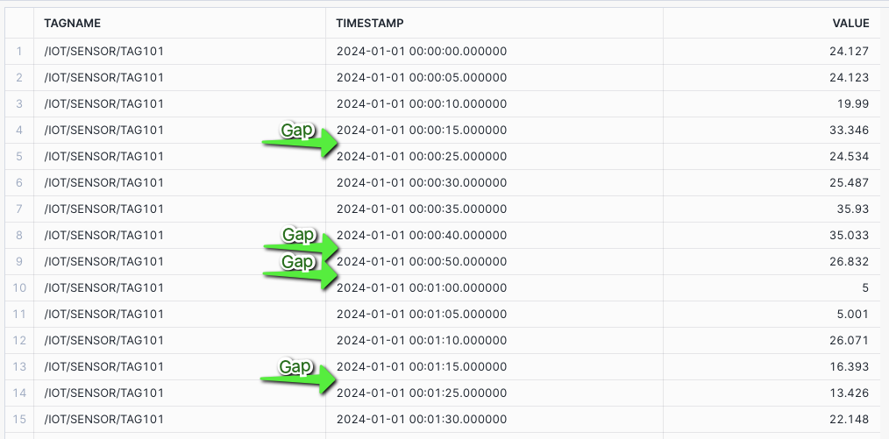
>
> Now say you want to perform an aggregation to **calculate the 1 minute rolling average** of sensor readings,
over a specific time frame to detect trends and patterns in the data.
>
> **ROWS BETWEEN** may NOT yield correct results, as the number of rows that make up the 1 minute interval could be inconsistent. In this case for a 5 second tag without gaps, you might have assumed 12 rows would make up 1 minute.
>

> aside positive
> 
> This is where **RANGE BETWEEN** can be used with intervals of time that can be added or subtracted from timestamps.
>
> **RANGE BETWEEN** differs from **ROWS BETWEEN** in that it can:
> * **Handle time gaps** in data being analyzed.
>   - For example, if a sensor is faulty or sends data at inconsistent intervals.
> * Allow for **reporting frequencies that differ** from the data frequency.
>   - For example, data at 5 second frequency that you want to aggregate the prior 1 minute.
>
> 
>
> More detail at [Interval Constants](https://docs.snowflake.com/en/sql-reference/data-types-datetime#interval-constants)
>

**Range Between - 1 MIN Rolling Average and Sum showing gap differences**: Create a rolling AVG and SUM for the time **INTERVAL** 1 minute preceding, inclusive of the current row. Assuming the preceding 12 rows would make up 1 minute of data.

```sql
SELECT TAGNAME, TIMESTAMP, VALUE_NUMERIC AS VALUE,
    AVG(VALUE_NUMERIC) OVER (
        PARTITION BY TAGNAME ORDER BY TIMESTAMP
        RANGE BETWEEN INTERVAL '1 MIN' PRECEDING AND CURRENT ROW) AS RANGE_AVG_1MIN,
    AVG(VALUE_NUMERIC) OVER (
        PARTITION BY TAGNAME ORDER BY TIMESTAMP
        ROWS BETWEEN 12 PRECEDING AND CURRENT ROW) AS ROW_AVG_1MIN,
    SUM(VALUE_NUMERIC) OVER (
        PARTITION BY TAGNAME ORDER BY TIMESTAMP
        RANGE BETWEEN INTERVAL '1 MIN' PRECEDING AND CURRENT ROW) AS RANGE_SUM_1MIN,
    SUM(VALUE_NUMERIC) OVER (
        PARTITION BY TAGNAME ORDER BY TIMESTAMP
        ROWS BETWEEN 12 PRECEDING AND CURRENT ROW) AS ROW_SUM_1MIN
FROM HOL_TIMESERIES.ANALYTICS.TS_TAG_READINGS
WHERE TIMESTAMP >= '2024-01-01 00:00:00'
AND TIMESTAMP <= '2024-01-01 01:00:00'
AND DATE_PART('SECOND', TIMESTAMP) NOT IN (20, 45, 55)
AND TAGNAME = '/IOT/SENSOR/TAG101'
ORDER BY TAGNAME, TIMESTAMP;
```

**The first minute of data aligns for both RANGE BETWEEN and ROWS BETWEEN, however, after the first minute the rolling values will start to show variances due to the introduced time gaps**.

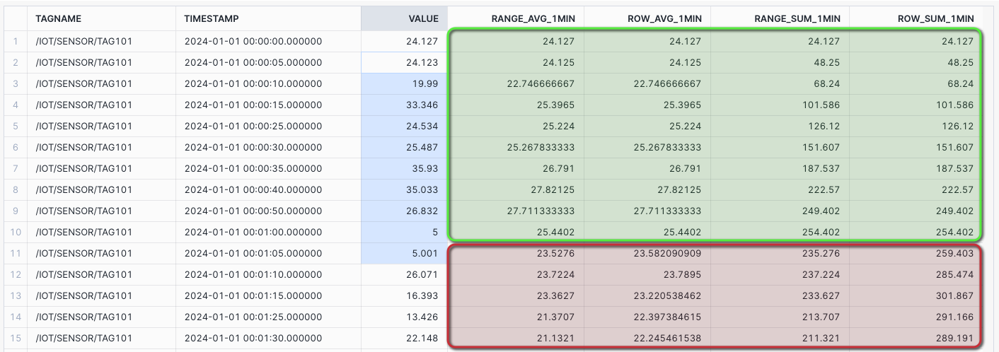

### CHART: Rolling 1 MIN Average and Sum - showing differences between RANGE BETWEEN and ROWS BETWEEN

1. Select the `Chart` sub tab below the worksheet.
2. Under Data select the `VALUE` column and set the Aggregation to `Max`.
3. Select `+ Add column` and select `RANGE_AVG_1MIN` and set Aggregation to `Max`.
4. Select `+ Add column` and select `ROW_AVG_1MIN` and set Aggregation to `Max`.

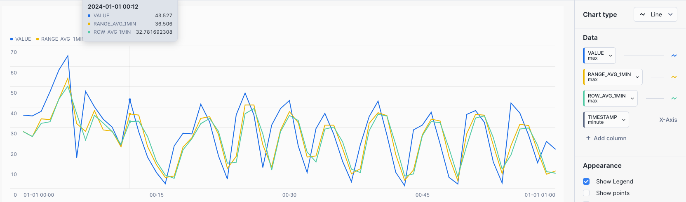

**Range Between - 5 MIN Rolling Average and Sum**: Let's expand on RANGE BETWEEN and create a rolling AVG and SUM for the time **INTERVAL** five minutes preceding, inclusive of the current row.

```sql
/* WINDOW FUNCTIONS - RANGE BETWEEN
Let's expand on RANGE BETWEEN and create a rolling AVG and SUM for the time **INTERVAL** five minutes preceding, inclusive of the current row.

INTERVAL - 5 MIN AVG and SUM preceding the current row
*/
SELECT TAGNAME, TIMESTAMP, VALUE_NUMERIC AS VALUE,
    AVG(VALUE_NUMERIC) OVER (
        PARTITION BY TAGNAME ORDER BY TIMESTAMP
        RANGE BETWEEN INTERVAL '5 MIN' PRECEDING AND CURRENT ROW) AS RANGE_AVG_5MIN,
    SUM(VALUE_NUMERIC) OVER (
        PARTITION BY TAGNAME ORDER BY TIMESTAMP
        RANGE BETWEEN INTERVAL '5 MIN' PRECEDING AND CURRENT ROW) AS RANGE_SUM_5MIN
FROM HOL_TIMESERIES.ANALYTICS.TS_TAG_READINGS
WHERE TIMESTAMP >= '2024-01-01 00:00:00'
AND TIMESTAMP <= '2024-01-01 01:00:00'
AND TAGNAME = '/IOT/SENSOR/TAG401'
ORDER BY TAGNAME, TIMESTAMP;
```

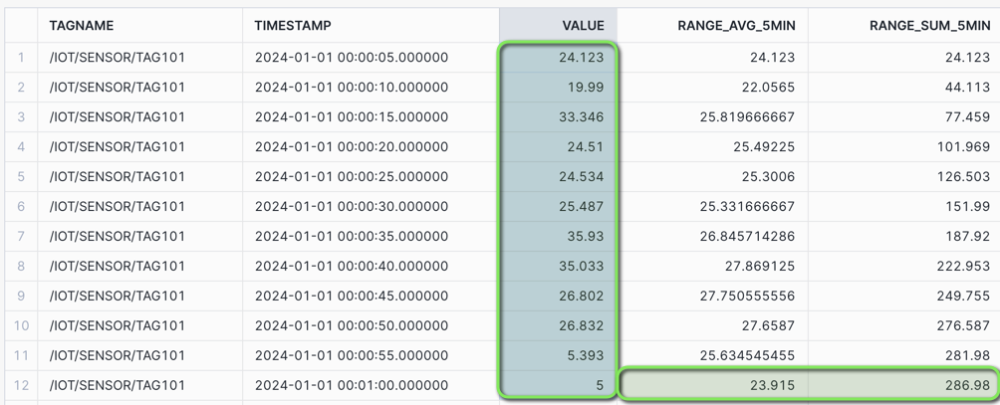

### CHART: Rolling 5 MIN Average

1. Select the `Chart` sub tab below the worksheet.
2. Under Data select the `VALUE` and set the Aggregation to `Max`.
3. Select `+ Add column` and select `RANGE_AVG_5MIN` and set Aggregation to `Max`.


**A rolling average could be useful in scenarios where you are trying to detect
EXCEEDANCES in equipment operating limits over periods of time, such as a maximum pressure limit.**

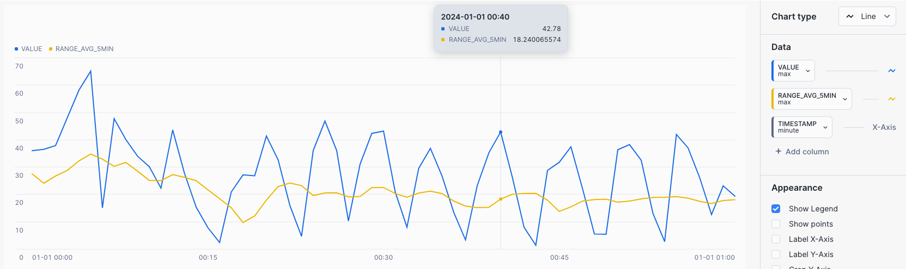

### Downsampling Time Series Data

Downsampling is used to **decrease the frequency of time samples**, such as from seconds to minutes, by placing time series data into fixed time intervals using aggregate operations on the existing values within each time interval.

**Time Binning - 5 min Aggregate**: Consider a use case where you want to obtain a broader view of a high frequency pressure gauge, by aggregating data into evenly spaced intervals to find trends over time.

Create a downsampled time series data set with 5 minute aggregates, showing the **START and END timestamp label** of each interval.

```sql
/* TIME BINNING - 5 min AGGREGATE with START and END label
Create a downsampled time series data set with 5 minute aggregates, showing the START and END timestamp label of each interval.

COUNT - Count of values within the time bin
SUM - Sum of values within the time bin
AVG - Average of values (mean) within the time bin
PERCENTILE_95 - 95% of values are less than this within the time bin
*/
SELECT TAGNAME,
    TIME_SLICE(TIMESTAMP, 5, 'MINUTE', 'START') AS START_TIMESTAMP,
    TIME_SLICE(TIMESTAMP, 5, 'MINUTE', 'END') AS END_TIMESTAMP,
    COUNT(*) AS COUNT_VALUE,
    SUM(VALUE_NUMERIC) AS SUM_VALUE,
    AVG(VALUE_NUMERIC) AS AVG_VALUE,
    APPROX_PERCENTILE(VALUE_NUMERIC, 0.95) AS PERCENTILE_95_VALUE
FROM HOL_TIMESERIES.ANALYTICS.TS_TAG_READINGS
WHERE TIMESTAMP >= '2024-01-01 00:00:00'
AND TIMESTAMP < '2024-01-01 01:00:00'
AND TAGNAME = '/IOT/SENSOR/TAG301'
GROUP BY TIME_SLICE(TIMESTAMP, 5, 'MINUTE', 'START'), TIME_SLICE(TIMESTAMP, 5, 'MINUTE', 'END'), TAGNAME
ORDER BY TAGNAME, START_TIMESTAMP;
```

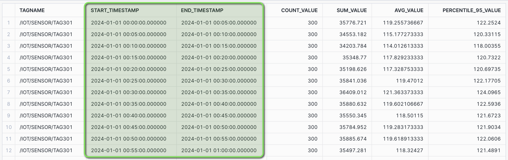


### Aligning Time Series Data

Often you will need to **align two data sets** that may have differing time frequencies. To do this you can utilize the **Time Series ASOF JOIN** to pair closely matching records based on timestamps.

**Joining Time Series Data with ASOF JOIN**: Consider the use case where you want to align a one second and five second pressure gauge to determine if there is a correlation.

Using the `ASOF JOIN`, join two data sets by applying a `MATCH_CONDITION` to pair closely aligned timestamps and values.

```sql
/* ASOF JOIN - Align a 1 second tag with a 5 second tag
Consider the use case where you want to align a one second and five second pressure gauge to determine if there is a correlation.

Using the `ASOF JOIN`, join two data sets by applying a `MATCH_CONDITION` to pair closely aligned timestamps and values.
*/
SELECT ONE_SEC.TAGNAME AS ONE_SEC_TAGNAME, ONE_SEC.TIMESTAMP AS ONE_SEC_TIMESTAMP, ONE_SEC.VALUE_NUMERIC AS ONE_SEC_VALUE, FIVE_SEC.VALUE_NUMERIC AS FIVE_SEC_VALUE, FIVE_SEC.TAGNAME AS FIVE_SEC_TAGNAME, FIVE_SEC.TIMESTAMP AS FIVE_SEC_TIMESTAMP
FROM HOL_TIMESERIES.ANALYTICS.TS_TAG_READINGS ONE_SEC
ASOF JOIN (
    -- 5 sec tag data
    SELECT TAGNAME, TIMESTAMP, VALUE_NUMERIC
    FROM HOL_TIMESERIES.ANALYTICS.TS_TAG_READINGS
    WHERE TAGNAME = '/IOT/SENSOR/TAG101'
    ) FIVE_SEC
MATCH_CONDITION(ONE_SEC.TIMESTAMP >= FIVE_SEC.TIMESTAMP)
WHERE ONE_SEC.TAGNAME = '/IOT/SENSOR/TAG301'
AND ONE_SEC.TIMESTAMP >= '2024-01-03 09:15:00'
AND ONE_SEC.TIMESTAMP <= '2024-01-03 09:45:00'
ORDER BY ONE_SEC.TIMESTAMP;
```


### CHART: Aligned Time Series Data

1. Select the `Chart` sub tab below the worksheet.
2. Under Data set the first Data column to `ONE_SEC_VALUE` with an Aggregation of `Max`.
3. Set the X-Axis to `ONE_SEC_TIMESTAMP` and a Bucketing of `Second`
3. Select `+ Add column` and select `FIVE_SEC_VALUE` and set Aggregation to `Max`.

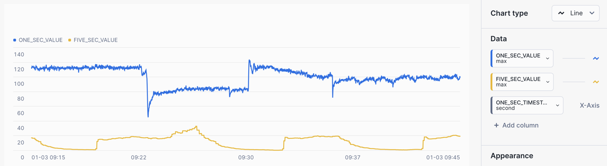

### Gap Filling

Time gap filling is the process of generating timestamps for a given start and end time boundary, and joining to a tag with less frequent timestamp values.

**Gap Filling**: Generate timestamps given a start and end time boundary, and join to a tag with less frequent values.

```sql
/* TIME GAP FILLING
Generate timestamps given a start and end time boundary, and join to a tag with less frequent values.

TIME_PERIODS - A variable passed into the query to determine the number of time stamps generated for gap filling.
*/
SET TIME_PERIODS = (SELECT TIMESTAMPDIFF('SECOND', '2024-01-01 00:00:00'::TIMESTAMP_NTZ, '2024-01-01 00:00:00'::TIMESTAMP_NTZ + INTERVAL '1 MINUTE'));

-- LAST OBSERVED VALUE CARRIED FORWARD (LOCF) - IGNORE NULLS
WITH TIMES AS (
    SELECT
    DATEADD('SECOND', ROW_NUMBER() OVER (ORDER BY SEQ8()) - 1, '2024-01-01')::TIMESTAMP_NTZ AS TIMESTAMP,
    '/IOT/SENSOR/TAG101' AS TAGNAME
    FROM TABLE(GENERATOR(ROWCOUNT => $TIME_PERIODS))
),
DATA AS (
    SELECT TAGNAME, TIMESTAMP, VALUE_NUMERIC AS VALUE,
    FROM HOL_TIMESERIES.ANALYTICS.TS_TAG_READINGS
    WHERE TIMESTAMP >= '2024-01-01 00:00:00'
    AND TIMESTAMP < '2024-01-01 00:01:00'
    AND TAGNAME = '/IOT/SENSOR/TAG101'
)
SELECT TIMES.TIMESTAMP,
    A.TAGNAME AS TAGNAME,
    L.VALUE,
    A.VALUE AS LOCF_VALUE
FROM TIMES
LEFT JOIN DATA L ON TIMES.TIMESTAMP = L.TIMESTAMP AND TIMES.TAGNAME = L.TAGNAME
ASOF JOIN DATA A MATCH_CONDITION(TIMES.TIMESTAMP >= A.TIMESTAMP) ON TIMES.TAGNAME = A.TAGNAME
ORDER BY TAGNAME, TIMESTAMP;
```


### Time Series Forecasting

**[Time-Series Forecasting](https://docs.snowflake.com/en/user-guide/snowflake-cortex/ml-functions/forecasting)** employs a machine learning algorithm to predict future data by using historical time series data.

Forecasting is part of Snowflake Cortex, Snowflake’s intelligent, fully-managed AI and ML service.
This feature is part of the Snowflake Cortex ML function suite.

**Forecasting**: Generate a time series forecast for a single tag looking forward one day.

1. Create a forecast training data view from historical data.

```sql
/* FORECAST DATA - Training Data Set - /IOT/SENSOR/TAG401
A single tag of data for two weeks.

Create a forecast training data view from historical data.
*/
CREATE OR REPLACE VIEW HOL_TIMESERIES.ANALYTICS.TS_TAG_READINGS_401 AS
SELECT TAGNAME, TIMESTAMP, VALUE_NUMERIC AS VALUE
FROM HOL_TIMESERIES.ANALYTICS.TS_TAG_READINGS
WHERE TAGNAME = '/IOT/SENSOR/TAG401'
ORDER BY TAGNAME, TIMESTAMP;
```

2. Create a Time-Series Forecast model using the training data view.

```sql
/* FORECAST MODEL - Training Data Set - /IOT/SENSOR/TAG401
Create a Time-Series Forecast model using the training data view.

INPUT_DATA - The data set used for training the forecast model
SERIES_COLUMN - The column that splits multiple series of data, such as different TAGNAMES
TIMESTAMP_COLNAME - The column containing the Time Series times
TARGET_COLNAME - The column containing the target value
*/
CREATE OR REPLACE SNOWFLAKE.ML.FORECAST HOL_TIMESERIES_FORECAST(
    INPUT_DATA => SYSTEM$REFERENCE('VIEW', 'HOL_TIMESERIES.ANALYTICS.TS_TAG_READINGS_401'),
    SERIES_COLNAME => 'TAGNAME',
    TIMESTAMP_COLNAME => 'TIMESTAMP',
    TARGET_COLNAME => 'VALUE'
);
```

> aside negative
> 
>  Training the Time Series Forecast model may take 2-3 minutes. Indicative training times available at [Training on Multi-Series Data](https://docs.snowflake.com/user-guide/snowflake-cortex/ml-functions/forecasting#training-on-multi-series-data).
>

3. Test Forecasting model output for one day.

```sql
/* FORECAST MODEL OUTPUT - Forecast for 1 Day
Test Forecasting model output for one day.

SERIES_VALUE - Defines the series being forecasted - for example the specific tag
FORECASTING_PERIODS - The number of periods being forecasted
*/
CALL HOL_TIMESERIES_FORECAST!FORECAST(SERIES_VALUE => TO_VARIANT('/IOT/SENSOR/TAG401'), FORECASTING_PERIODS => 1440);
```

4. Create a forecast analysis combining historical data with forecast data using [RESULT_SCAN](https://docs.snowflake.com/en/sql-reference/functions/result_scan).

```sql
/* FORECAST COMBINED - Combined ACTUAL and FORECAST data
Create a forecast analysis combining historical data with forecast data.

UNION the historical ACTUAL data with the FORECAST data using RESULT_SCAN
*/
SELECT
    'ACTUAL' AS DATASET,
    TAGNAME,
    TIMESTAMP,
    VALUE,
    NULL AS FORECAST,
    NULL AS UPPER
FROM HOL_TIMESERIES.ANALYTICS.TS_TAG_READINGS_401
WHERE TAGNAME = '/IOT/SENSOR/TAG401'
AND TO_DATE(TIMESTAMP) = '2024-01-14'
UNION ALL
SELECT
    'FORECAST' AS DATASET,
    SERIES AS TAGNAME,
    TS AS TIMESTAMP,
    NULL AS VALUE,
    FORECAST,
    UPPER_BOUND AS UPPER
FROM TABLE(RESULT_SCAN(-1))
ORDER BY DATASET, TAGNAME, TIMESTAMP;
```

### CHART: Time Series Forecast

1. Select the `Chart` sub tab below the worksheet.
2. Under Data set the first column to `VALUE` and set the Aggregation to `Max`.
3. Select the `TIMESTAMP` column and set the Bucketing to `Minute`.
4. Select `+ Add column` and select `FORECAST` and set Aggregation to `Max`.

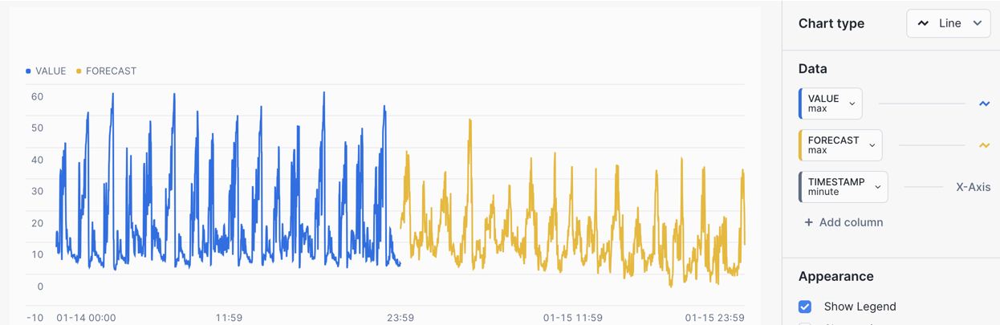


> aside positive
> 
>  You have now run through several **Time Series Analysis** queries, we can now look at creating **Time Series Functions**.
>

<!-- ------------------------ -->
## Build Your Own Time Series Functions
Duration: 10

Now that you have a great understanding of running **Time Series Analysis**, we will now look at deploying time series [User Defined Table Functions (UDTF)](https://docs.snowflake.com/en/developer-guide/udf/udf-overview) that can query time series data in a re-usable manner. Table functions will accept a set of input parameters and perform operations on a data set, and return results in a table format.


### INFO: Upsampling Time Series Data

**Upsampling** is used to **increase the frequency** of time samples, such as from hours to minutes, by placing time series data into fixed time intervals using aggregate operations on the values within each time interval. Due to the frequency of samples being increased it has the effect of **creating new values if the interval is more frequent** than the data itself. If the interval does not contain a value, it will be **interpolated from the surrounding aggregated data**.

### Step 1 - Deploy Time Series Functions and Procedures

1. In **VS Code** open the worksheet `worksheets/hol_timeseries_5_functions.sql`

2. Run the **Create Interpolate Table Function**

```sql
-- Set role, context, and warehouse
USE ROLE ROLE_HOL_TIMESERIES;
USE HOL_TIMESERIES.ANALYTICS;
USE WAREHOUSE HOL_ANALYTICS_WH;

-- Create Interpolate Table Function
CREATE OR REPLACE FUNCTION HOL_TIMESERIES.ANALYTICS.FUNCTION_TS_INTERPOLATE (
    V_TAGLIST VARCHAR,
    V_START_TIMESTAMP TIMESTAMP_NTZ,
    V_END_TIMESTAMP TIMESTAMP_NTZ,
    V_INTERVAL NUMBER,
    V_BUCKETS NUMBER
)
RETURNS TABLE (
    TIMESTAMP TIMESTAMP_NTZ,
    TAGNAME VARCHAR,
    INTERP_VALUE FLOAT,
    LOCF_VALUE FLOAT,
    LAST_TIMESTAMP TIMESTAMP_NTZ
)
LANGUAGE SQL
AS
$$
WITH
TSTAMPS AS (
    SELECT 
        DATEADD('SEC', V_INTERVAL * ROW_NUMBER() OVER (ORDER BY SEQ8()) - V_INTERVAL, V_START_TIMESTAMP) AS TIMESTAMP
    FROM TABLE(GENERATOR(ROWCOUNT => V_BUCKETS))
),
TAGLIST AS (
    SELECT
        TRIM(TAGLIST.VALUE) AS TAGNAME
    FROM
        TABLE(SPLIT_TO_TABLE(V_TAGLIST, ',')) TAGLIST
),
TIMES AS (
    SELECT
        TSTAMPS.TIMESTAMP,
        TAGLIST.TAGNAME
    FROM
        TSTAMPS
        CROSS JOIN TAGLIST
),
LAST_VALUE AS (
    SELECT
        TIMES.TIMESTAMP,
        RAW_DATA.TIMESTAMP RAW_TS,
        RAW_DATA.TAGNAME,
        RAW_DATA.VALUE_NUMERIC
    FROM
        TIMES ASOF JOIN HOL_TIMESERIES.ANALYTICS.TS_TAG_READINGS RAW_DATA
            MATCH_CONDITION(TIMES.TIMESTAMP >= RAW_DATA.TIMESTAMP)
            ON TIMES.TAGNAME = RAW_DATA.TAGNAME
    WHERE
        RAW_DATA.TIMESTAMP >= V_START_TIMESTAMP
    AND RAW_DATA.TIMESTAMP <= V_END_TIMESTAMP
),
NEXT_VALUE AS (
    SELECT
        TIMES.TIMESTAMP,
        RAW_DATA.TIMESTAMP RAW_TS,
        RAW_DATA.TAGNAME,
        RAW_DATA.VALUE_NUMERIC
    FROM
        TIMES ASOF JOIN HOL_TIMESERIES.ANALYTICS.TS_TAG_READINGS RAW_DATA
            MATCH_CONDITION(TIMES.TIMESTAMP <= RAW_DATA.TIMESTAMP)
            ON TIMES.TAGNAME = RAW_DATA.TAGNAME
    WHERE
        RAW_DATA.TIMESTAMP >= V_START_TIMESTAMP
    AND RAW_DATA.TIMESTAMP <= V_END_TIMESTAMP
),
COMB_VALUES AS (
    SELECT
        TIMES.TIMESTAMP,
        TIMES.TAGNAME,
        LV.VALUE_NUMERIC LAST_VAL,
        LV.TIMESTAMP LV_TS,
        LV.RAW_TS LV_RAW_TS,
        NV.VALUE_NUMERIC NEXT_VAL,
        NV.TIMESTAMP NV_TS,
        NV.RAW_TS NV_RAW_TS
    FROM TIMES
    INNER JOIN LAST_VALUE LV ON TIMES.TIMESTAMP = LV.TIMESTAMP AND TIMES.TAGNAME = LV.TAGNAME
    INNER JOIN NEXT_VALUE NV ON TIMES.TIMESTAMP = NV.TIMESTAMP AND TIMES.TAGNAME = NV.TAGNAME
),
INTERP AS (
    SELECT
        TIMESTAMP,
        TAGNAME,
        TIMESTAMPDIFF(SECOND, LV_RAW_TS, NV_RAW_TS) TDIF_BASE,
        TIMESTAMPDIFF(SECOND, LV_RAW_TS, TIMESTAMP) TDIF,
        LV_TS,
        NV_TS,
        LV_RAW_TS,
        LAST_VAL,
        NEXT_VAL,
        DECODE(TDIF, 0, LAST_VAL, LAST_VAL + (NEXT_VAL - LAST_VAL) / TDIF_BASE * TDIF) IVAL
    FROM
        COMB_VALUES
)
SELECT
    TIMESTAMP,
    TAGNAME,
    IVAL INTERP_VALUE,
    LAST_VAL LOCF_VALUE,
    LV_RAW_TS LAST_TIMESTAMP
FROM
    INTERP
$$;
```

> aside positive
> 
>  The **INTERPOLATE Table Function** is using the [ASOF JOIN](https://docs.snowflake.com/en/sql-reference/constructs/asof-join) for each time interval to **look both backwards (LAST_VALUE) and forwards (NEXT_VALUE) in time**, to calculate the time and value difference at each time interval, which is then used to generate a smooth linear interpolated value.
>
> The **INTERPOLATE Table Function** will return both **linear interpolated values** and the **last observed value carried forward (LOCF)**.
>

3. Run the **Create Interpolate Procedure** Script

```sql
-- Add helper procedure to accept start and end times, and return either LOCF or Linear Interpolated Values
CREATE OR REPLACE PROCEDURE HOL_TIMESERIES.ANALYTICS.PROCEDURE_TS_INTERPOLATE (
    V_TAGLIST VARCHAR,
    V_FROM_TIME TIMESTAMP_NTZ,
    V_TO_TIME TIMESTAMP_NTZ,
    V_INTERVAL NUMBER,
    V_INTERP_TYPE VARCHAR
)
RETURNS TABLE (
    TIMESTAMP TIMESTAMP_NTZ,
    TAGNAME VARCHAR,
    VALUE FLOAT
)
LANGUAGE SQL
AS
$$
DECLARE
TIME_BUCKETS NUMBER;
RES RESULTSET;
BEGIN
    TIME_BUCKETS := CEIL((TIMESTAMPDIFF('SEC', :V_FROM_TIME, :V_TO_TIME) + 1) / :V_INTERVAL);

    IF (:V_INTERP_TYPE = 'LOCF') THEN
        RES := (SELECT TIMESTAMP, TAGNAME, LOCF_VALUE AS VALUE FROM TABLE(HOL_TIMESERIES.ANALYTICS.FUNCTION_TS_INTERPOLATE(:V_TAGLIST, :V_FROM_TIME, :V_TO_TIME, :V_INTERVAL, :TIME_BUCKETS)) ORDER BY TAGNAME, TIMESTAMP);
    ELSE
        RES := (SELECT TIMESTAMP, TAGNAME, INTERP_VALUE AS VALUE FROM TABLE(HOL_TIMESERIES.ANALYTICS.FUNCTION_TS_INTERPOLATE(:V_TAGLIST, :V_FROM_TIME, :V_TO_TIME, :V_INTERVAL, :TIME_BUCKETS)) ORDER BY TAGNAME, TIMESTAMP);
    END IF;

    RETURN TABLE(RES);
END;
$$;
```

> aside positive
> 
>  The **INTERPOLATE PROCEDURE** can calculate the number of time buckets within a time boundary based on the interval specified. It then calls the **INTERPOLATE** table function, and depending on the **V_INTERP_TYPE** variable, it will return either the last observed value carried forward (LOCF) or linear interpolated values (default).
>

4. Run the **LTTB Downsampling Table Function** Script

```sql
-- LTTB Downsampling Table Function
CREATE OR REPLACE FUNCTION HOL_TIMESERIES.ANALYTICS.FUNCTION_TS_LTTB (
    TIMESTAMP NUMBER,
    VALUE FLOAT,
    SIZE NUMBER
)
RETURNS TABLE (
    TIMESTAMP NUMBER,
    VALUE FLOAT
)
LANGUAGE PYTHON
RUNTIME_VERSION = 3.11
PACKAGES = ('pandas', 'plotly-resampler')
HANDLER = 'lttb_run'
AS $$
from _snowflake import vectorized
import pandas as pd
from plotly_resampler.aggregation.algorithms.lttb_py import LTTB_core_py

class lttb_run:
    @vectorized(input=pd.DataFrame)

    def end_partition(self, df):
        if df.SIZE.iat[0] >= len(df.index):
            return df[['TIMESTAMP','VALUE']]
        else:
            idx = LTTB_core_py.downsample(
                df.TIMESTAMP.to_numpy(),
                df.VALUE.to_numpy(),
                n_out=df.SIZE.iat[0]
            )
            return df[['TIMESTAMP','VALUE']].iloc[idx]
$$;
```

> aside positive
> 
>  The **Largest Triangle Three Buckets (LTTB)** algorithm is a time series downsampling algorithm that **reduces the number of visual data points, whilst retaining the shape and variability of the time series data**. It's useful for reducing large time series data sets for charting purposes where the consumer system may have reduced memory resources.
>
> This is a **Snowpark Python** implementation using the **plotly-resampler** package.
>
> The original code for LTTB is available at [Sveinn Steinarsson - GitHub](https://github.com/sveinn-steinarsson/flot-downsample).
>

### Step 2 - Copy Worksheet Content To Snowsight Worksheet

This section will be executed within a Snowflake Snowsight Worksheet.

1. Login to Snowflake, and from the menu expand `Projects > Worksheets`


2. At the top right of the **Worksheets** screen select `+ > SQL Worksheet`. This will open a new worksheet in Snowsight.


3. In **VS Code** open the worksheet `worksheets/hol_timeseries_6_function_queries.sql`

4. **Copy** the contents of the worksheet to **clipboard**, and paste it into the newly created **Worksheet in Snowsight**


### Step 3 - Query Time Series Data Using Deployed Functions and Procedures

### Interpolate Query

The Interpolation table function will return both the **last observed value carried forward (LOCF) and linear interpolated values (default)**.

```sql
-- Set role, context, and warehouse
USE ROLE ROLE_HOL_TIMESERIES;
USE HOL_TIMESERIES.ANALYTICS;
USE WAREHOUSE HOL_ANALYTICS_WH;

/* INTERPOLATE TABLE FUNCTION
The Interpolation table function will return both the last observed value carried forward (LOCF) and linear interpolated values (default).
*/
SELECT * FROM TABLE(HOL_TIMESERIES.ANALYTICS.FUNCTION_TS_INTERPOLATE('/IOT/SENSOR/TAG401', '2024-01-01 12:10:00'::TIMESTAMP_NTZ, '2024-01-01 13:10:00'::TIMESTAMP_NTZ, 10, 362)) ORDER BY TAGNAME, TIMESTAMP;
```

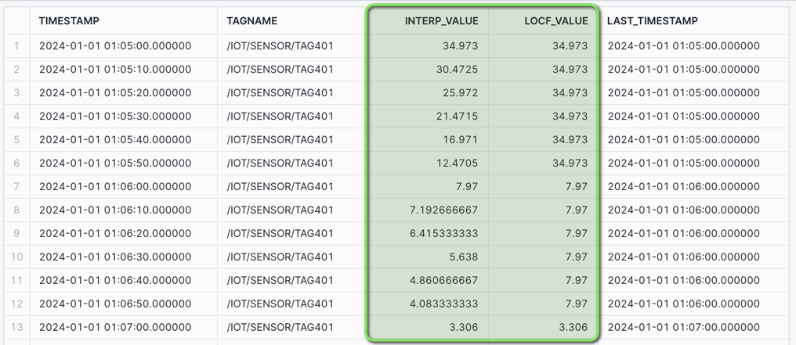

### CHART: Interpolation - Linear and LOCF

1. Select the `Chart` sub tab below the worksheet.
2. Under Data select `TIMESTAMP` and set Bucketing to `Second`
3. Under Data select `INTERP_VALUE` and set the Aggregation to `Max`.
4. Select `+ Add column` and select `LOCF_VALUE` and set Aggregation to `Max`.

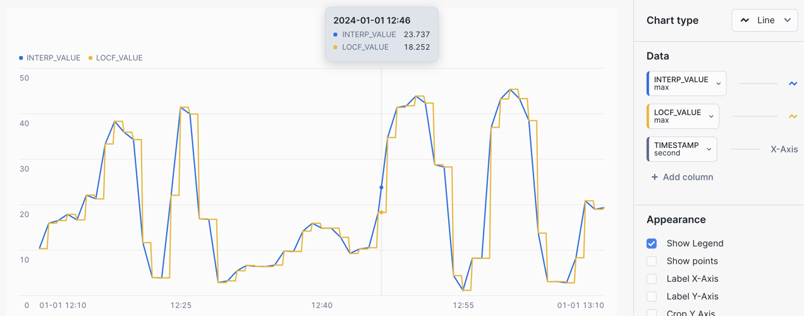


### Interpolation - Last Observed Value Carried Forward (LOCF) Query

The Interpolation Procedure will accept a start time and end time, along with a bucket interval size in seconds.
It will then calculate the number of buckets within the time boundary, and call the Interpolate table function.

```sql
/* INTERPOLATE PROCEDURE - LOCF
The Interpolation Procedure will accept a start time and end time, along with a bucket interval size in seconds.
It will then calculate the number of buckets within the time boundary, and call the Interpolate table function.

Call Interpolate Procedure with Taglist, Start Time, End Time, and Intervals - LOCF Interpolate
*/
CALL HOL_TIMESERIES.ANALYTICS.PROCEDURE_TS_INTERPOLATE(
    -- V_TAGLIST
    '/IOT/SENSOR/TAG401',
    -- V_FROM_TIME
    '2024-01-01 12:10:00',
    -- V_TO_TIME
    '2024-01-01 13:10:00',
    -- V_INTERVAL
    10,
    -- V_INTERP_TYPE
    'LOCF'
);
```

### CHART: Interpolation - LOCF

1. Select the `Chart` sub tab below the worksheet.
2. Under Data select `VALUE` and set the Aggregation to `Max`.

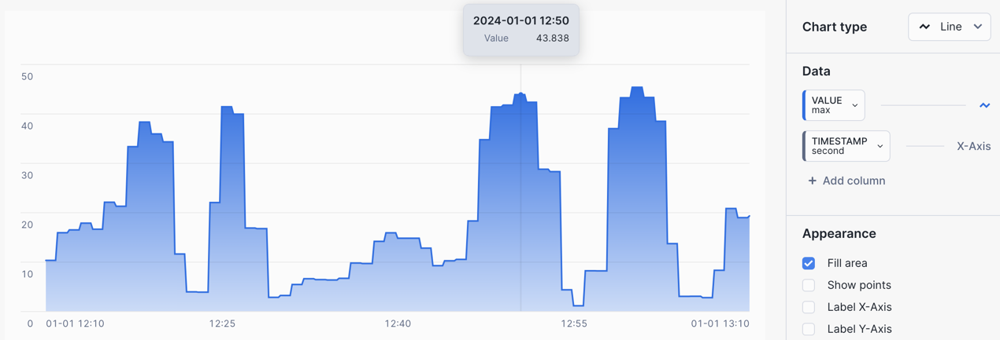


### Interpolation - Linear Query

Similar to the Interpolation - LOCF procedure call, this will create a Linear Interpolation return.

```sql
/* INTERPOLATE PROCEDURE - LOCF
Similar to the Interpolation - LOCF procedure call, this will create a Linear Interpolation return.

Call Interpolate Procedure with Taglist, Start Time, End Time, and Intervals - LINEAR Interpolate
*/
CALL HOL_TIMESERIES.ANALYTICS.PROCEDURE_TS_INTERPOLATE(
    -- V_TAGLIST
    '/IOT/SENSOR/TAG401',
    -- V_FROM_TIME
    '2024-01-01 12:10:00',
    -- V_TO_TIME
    '2024-01-01 13:10:00',
    -- V_INTERVAL
    10,
    -- V_INTERP_TYPE
    'INTERP'
);
```

### CHART: Interpolation - Linear

1. Select the `Chart` sub tab below the worksheet.
2. Under Data select `VALUE` and set the Aggregation to `Max`.

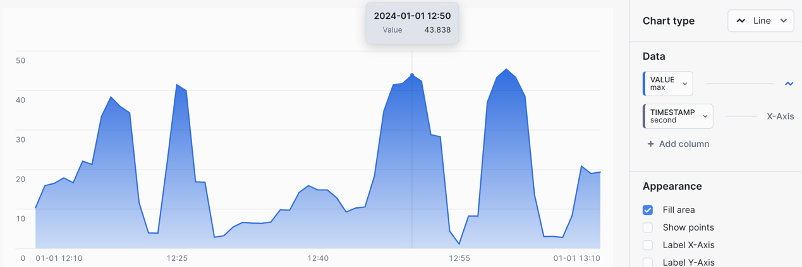


### LTTB Query

The **Largest Triangle Three Buckets (LTTB)** algorithm is a time series downsampling algorithm that reduces the number of visual data points, whilst retaining the shape and variability of the time series data.

Starting with a **RAW** query we can see the **LTTB** function in action, where the function will **downsample two hours of data for a one second tag**, 7200 data points to 500 whilst keeping the shape and variability of the values.

**RAW Query**

```sql
/* RAW - 2 HOURS OF 1 SEC DATA
Source of downsample - 7200 data points
*/
SELECT TAGNAME, TIMESTAMP, VALUE_NUMERIC as VALUE
FROM HOL_TIMESERIES.ANALYTICS.TS_TAG_READINGS
WHERE TIMESTAMP > '2024-01-09 21:00:00'
AND TIMESTAMP <= '2024-01-09 23:00:00'
AND TAGNAME = '/IOT/SENSOR/TAG301'
ORDER BY TAGNAME, TIMESTAMP;
```

### CHART: RAW Query

1. Select the `Chart` sub tab below the worksheet.
2. Under Data select `VALUE` and set the Aggregation to `Max`.
3. Under Data select `TIMESTAMP` and set the Bucketing to `Second`. 

**7200 Data Points**

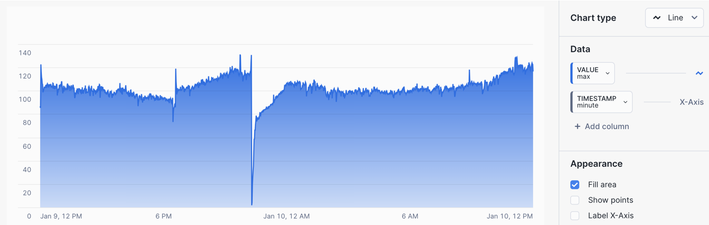

**LTTB Query**

We can now pass the same data into the **LTTB table function** and request 500 data points to be returned.

```sql
/* LTTB - DOWNSAMPLE TO 500 DATA POINTS
We can now pass the same data into the LTTB table function and request 500 data points to be returned.

The DATA subquery sets up the data set, and this is cross joined with the LTTB table function,
with an input of TIMESTAMP, VALUE, and the downsample size of 500.
*/
SELECT DATA.TAGNAME, LTTB.TIMESTAMP::VARCHAR::TIMESTAMP_NTZ AS TIMESTAMP, LTTB.VALUE 
FROM (
    SELECT TAGNAME, TIMESTAMP, VALUE_NUMERIC as VALUE
    FROM HOL_TIMESERIES.ANALYTICS.TS_TAG_READINGS
    WHERE TIMESTAMP > '2024-01-09 21:00:00'
    AND TIMESTAMP <= '2024-01-09 23:00:00'
    AND TAGNAME = '/IOT/SENSOR/TAG301'
) AS DATA 
CROSS JOIN TABLE(HOL_TIMESERIES.ANALYTICS.FUNCTION_TS_LTTB(DATE_PART(EPOCH_NANOSECOND, DATA.TIMESTAMP), DATA.VALUE, 500) OVER (PARTITION BY DATA.TAGNAME ORDER BY DATA.TIMESTAMP)) AS LTTB
ORDER BY TAGNAME, TIMESTAMP;
```

### CHART: LTTB Query

1. Select the `Chart` sub tab below the worksheet.
2. Under Data select `VALUE` and set the Aggregation to `Max`.
3. Under Data select `TIMESTAMP` and set the Bucketing to `Second`. 

**500 Data Points - The shape and variability of the values are retained, when compared to the 7200 data point RAW chart**.

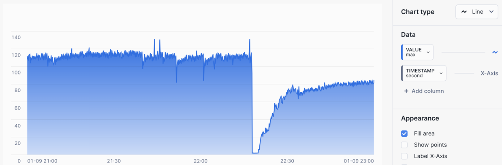


> aside positive
> 
>  You have now built your own **Time Series Analysis** functions and procedures, these can be called within applications working with time series data. We can now look at deploying a Time Series application.
>

<!-- ------------------------ -->
## Build Your Time Series Application in Streamlit
Duration: 15

After completing the analysis of the time series data that was streamed into Snowflake, we are now ready to **deliver a Time Series Analytics application** for end users to easily consume time series data. For this purpose we are going use a **Streamlit in Snowflake** application, deployed using **Snowflake CLI**.


### INFO: Streamlit
**Streamlit** is an open-source Python library that makes it easy to **create web applications for machine learning, data analysis, and visualization**. **[Streamlit in Snowflake](https://docs.snowflake.com/en/developer-guide/streamlit/about-streamlit)** helps developers securely build, deploy, and share **Streamlit apps on Snowflake’s data cloud platform**, without moving data or application code to an external system.


### INFO: Snowflake CLI

**[Snowflake CLI](https://docs.snowflake.com/en/developer-guide/snowflake-cli-v2/introduction/introduction)** is an open-source command-line tool designed for developers to **easily create, deploy, update, and view apps running on Snowflake**. We will use Snowflake CLI to deploy the **Time Series Streamlit application** to your Snowflake account.


### Step 1 - Setup Snowflake Stage for Streamlit Application

1. In **VS Code** open the worksheet `worksheets/hol_timeseries_7_streamlit.sql`

2. Run the Worksheet to **create a stage for the Streamlit** application

```sql
/*
SNOWFLAKE STREAMLIT SCRIPT
*/

-- Set role, context, and warehouse
USE ROLE ROLE_HOL_TIMESERIES;
USE HOL_TIMESERIES.ANALYTICS;
USE WAREHOUSE HOL_ANALYTICS_WH;

-- CREATE STAGE FOR STREAMLIT FILES
CREATE OR REPLACE STAGE HOL_TIMESERIES.ANALYTICS.STAGE_TS_STREAMLIT
DIRECTORY = (ENABLE = TRUE, REFRESH_ON_CREATE = TRUE)
ENCRYPTION = (TYPE = 'SNOWFLAKE_SSE');

/* EXTERNAL ACTIVITY

Use Snowflake CLI to upload Streamlit app

*/

/*
STREAMLIT SCRIPT COMPLETED
*/
```

> aside negative
> 
>  There are **EXTERNAL ACTIVITY** sections in the worksheet, this will be covered in the next step.
>


### Step 2 - Deploy Streamlit Application to Snowflake

In this step, we will now deploy the Streamlit application on the Snowflake account using **Snowflake CLI**.

In the **GitHub Codespace VS Code**:

1. Open `Menu > Terminal > New Terminal` - a new terminal window will now open


2. Activate `hol-timeseries` python virtual environment by running `conda activate hol-timeseries`

```bash
conda activate hol-timeseries
```


3. **Copy and run** the following Snowflake CLI command **into the Terminal** to deploy the Streamlit application

```bash
snow --config-file=".snowflake/config.toml" streamlit deploy --replace --project "streamlit" --connection="hol-timeseries-streamlit"
```

> aside negative
> 
>  The **GitHub Codespace** may prompt to allow pasting into **VSCode**, select **Allow** if prompted.
>


**Streamlit Deploy with Snowflake CLI**

This command does the following:

- **Deploys the Streamlit application** using the Snowflake account details mentioned in the ".snowflake/config.toml" file
- **--config-file** option provides the location of the config file that **contains Snowflake account details**
- **--replace** option ensures that the **existing application, if present, is overwritten**
- **--project** option provides the **path where the Streamlit app project resides**
- **--connection** option dictates **which connection section from the ".snowflake/config.toml"** file should be used for deployment


### Step 3 - Launch the Streamlit Application

Once the Streamlit application is successfully deployed, Snowflake CLI will display the message **"Streamlit successfully deployed and available"** and will provide the URL for the Streamlit application.


1. Press **Command/Ctrl** and **click the URL** link to launch the Streamlit application in a new tab. Alternatively, copy and paste the URL into a new tab.

2. Select `Open` once prompted.


### Step 4 - Understanding the Streamlit Application

The **Streamlit in Snowflake** application contains several pages, accessible via the left menu, that cover the following Time Series queries:
* **Raw** Time Series Data
* **Statistical Aggregate** Time Series Data
* **Time Binning / Downsampling** Time Series Data


**Filtering Menu**

Each page has a filtering menu to:
* Select one or more tags
* Change reporting time selection
* Set the sample size of chart visualizations
* Select various aggregations


**Streamlit Features**

At the bottom of each page there are options to:
* **Select** how much data is displayed in the table along with the order
* **Download as CSV** - To download the data in CSV file format
* **Supporting Detail** - Shows the queries being run
* **Refresh Mode** - Contains a toggle to enable auto refresh and see new data automatically


### Step 5 - Set Streamlit Filters and Query Data

The initial data set contains two weeks of data loaded for 1-Jan-2024 to 14-Jan-2024. Let's query this using the Streamlit application.

Open the **Streamlit Application**:

1. Select the **TS Raw** page

2. From **Select Tag Name** choose the `/IOT/SENSOR/TAG101`

3. For **Start Date** select `1-Jan-2024`

4. For **Start Time** select `00:00`

5. For **End Date** select `1-Jan-2024`

6. For **End Time** select `04:00`


> aside positive
> 
> **Streamlit** will automatically refresh the page after making filter selections.
>
> Review the chart and table detail.
>

**Data for 1-Jan-2024 should now display**

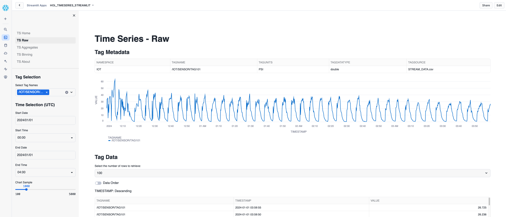

7. Select the **TS Aggregates** page

    - The aggregates page will show high level statistical detail for the selected tag and time period.

8. Select the **TS Binning** page

    - The binning page shows a 1 minute downsampled average for the selected tag and time period.

9. Try changing the **Select Aggregation Method** to `MIN` 

    - This will now show the 1 minute minimums for the tag and time period.

10. Try changing the **Label Position** to `START`

    - The **Tag Data** table will now show the **Start** timestamp for each minute interval.


### Step 6 - Start a Continuous Simulated Stream

We can now **start a continuous stream of data into Snowflake**, similar to the initial streaming load, to simulate IoT device **data streaming in near real-time** to Snowflake.


In the **GitHub Codespace VS Code**:

1. Open `Menu > Terminal > New Terminal` - a new terminal window will now open


2. Change directory into to the **iotstream** folder: `cd iotstream`

3. Run the `Run_Slooow.sh` script to load the IoT data.

```bash
./Run_Slooow.sh
```

> aside positive
> 
> If there are no errors, IoT data will now be **streaming into Snowflake**, and the **Dynamic Tables** will start to update.
>

4. Back **in the Streamlit application** try enabling `Auto Refresh` by `Expanding Refresh Mode > Toggle Auto Refresh`

    - The charts and data should now start to **automatically update with new data streaming into Snowflake every minute**.

5. Select the **TS Raw** page to see the raw data

6. Try adding `/IOT/SENSOR/TAG401` and `/IOT/SENSOR/TAG601` to the **Select Tag Names** filter

    - The charts and data should now contain two additional tags with the data updating every minute.


> aside positive
> 
>  You have now successfully deployed a **Time Series Application** using Streamlit in Snowflake. This will allow end users easy access to visualize time series data as well as run their own **Time Series Analysis** on all Time Series data available in Snowflake.
>

<!-- ------------------------ -->
## Cleanup
Duration: 3

1. In **VS Code** open the worksheet `worksheets/hol_timeseries_8_cleanup.sql` and run the script to remove Snowflake objects.

```sql
/*
SNOWFLAKE CLEANUP SCRIPT
*/

-- Set role
USE ROLE ACCOUNTADMIN;

-- Cleanup Snowflake objects
DROP DATABASE HOL_TIMESERIES;
DROP WAREHOUSE HOL_TRANSFORM_WH;
DROP WAREHOUSE HOL_REPORT_WH;
DROP ROLE ROLE_HOL_TIMESERIES;
DROP USER USER_HOL_TIMESERIES;

/*
CLEANUP SCRIPT COMPLETED
*/
```

2. Stop or delete the [Github Codespace](https://github.com/codespaces), using the Codespace actions menu.


<!-- ------------------------ -->
## Conclusion and Resources
Duration: 2

> aside positive
> 
> **Congratulations!**
>
> You've successfully deployed an end-to-end **Time Series Analytics** solution with streaming data in Snowflake.
>
> **We would greatly appreciate your feedback in our [Time series analytics survey](https://docs.google.com/forms/d/e/1FAIpQLSft8rz7OslJoZ4JZIUWMcNjdD45FwKZH5BGNRGY1n5kNIu1dg/viewform)**.
>


### What You Learned

- How to **stream time series data** into Snowflake using Snowpipe Streaming
- How to **use Dynamic Tables** for continuous data pipeline transformations
- How to **analyze time series data** using native Snowflake time series functions
- How to **create custom time series functions** and procedure in Snowflake
- How to **deploy a Streamlit application using Snowflake CLI** to enable end users to run time series analytics


### Additional Resources
- **Documentation** - [Analyzing time-series data](https://docs.snowflake.com/en/user-guide/querying-time-series-data)
- **Blog** - [Accelerate Your Time Series Analytics with Snowflake’s ASOF JOIN, Now Generally Available](https://www.snowflake.com/blog/time-series-analytics-asof-join-generally-available/)
- **Lab** - [Getting Started with Snowflake CLI](https://quickstarts.snowflake.com/guide/getting-started-with-snowflake-cli/index.html)
