id: getting_started_with_time_series_using_snowflake_streaming_sis_ml_notebooks
summary: Getting Started with Time Series Analysis in Snowflake
categories: Getting-Started
environments: web
status: Published 
feedback link: https://github.com/Snowflake-Labs/sfguides/issues
tags: Getting Started, Data Science, Data Engineering
author: nathan.birch@snowflake.com, jonathan.regenstein@snowflake.com

# Getting Started with Time Series Analysis in Snowflake
<!-- ------------------------ -->
## Overview
Duration: 5

Snowflake offers a rich set of functionalities for time series analytics making it a performant and cost effective platform for bringing in your time series workloads. This lab covers a real world scenario of ingesting, analyzing and visualizing IOT time series data.

### What You'll Learn

Upon completing this quickstart, you will have learned how to perform time series analytics in Snowflake, and will have gained practical experience in several areas:

- **Setup a streaming ingestion** client to to stream time series data into Snowflake using Snowpipe Streaming
- **Model and transform** the streaming time series data using Dynamic Tables
- **Analyzing the data** using native time series functions
- **Building your own time series functions** using Snowpark UDFs when necessary
- **Deploying a Streamlit application** for visualizing and analyzing time series data

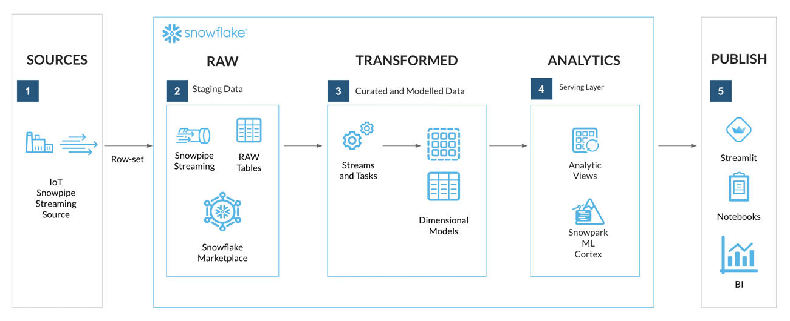

### What You'll Need

- A supported Snowflake [Browser](https://docs.snowflake.com/en/user-guide/setup#browser-requirements)
- [Sign-up for a Snowflake Trial](https://signup.snowflake.com/?lab=getting_started_with_time_series_using_snowflake_streaming_sis_ml_notebooks&utm_cta=getting_started_with_time_series_using_snowflake_streaming_sis_ml_notebooks) OR have access to an existing Snowflake account with the ACCOUNTADMIN role. Select the Enterprise edition, AWS as a cloud provider.
- Access to a personal GitHub account to fork the QuickStart repo and create [GitHub Codespaces](https://docs.github.com/en/codespaces/overview). Codespaces offer a hosted development environment. GitHub offers [free Codespace hours each month](https://github.com/features/codespaces) when using a 2 or 4 node environment, which should be enough to work through this lab.

> aside negative
> 
> It is recommended to use a personal GitHub account which will have permissions to deploy a GitHub Codespace.

<!-- ------------------------ -->
## Lab Setup
Duration: 10

### Step 1 - Note Snowflake Account details
Login to your Snowflake account using Snowsight and execute the [SYSTEM$ALLOWLIST](https://docs.snowflake.com/en/sql-reference/functions/system_allowlist) command:

```sql
-- Note down your Snowflake account identifier details
-- <account_identifier>.snowflakecomputing.com

SELECT SYSTEM$ALLOWLIST();
```

**Note** the **<account_identifier>**.snowflakecomputing.com by retrieving the **host** attribute returned. This will be used during the lab when referencing the **<ACCOUNT_IDENTIFIER>** configuration variables during setup.

### Step 2 - Fork the Lab GitHub Repository

The first step is to create a fork of the Lab GitHub repository.

1. In a web browser log into your [Github](https://github.com/) account.

2. Open [Getting Started with Time Series in Snowflake associated GitHub Repository](https://github.com/Snowflake-Labs/sfguide-getting-started-with-time-series-using-snowflake-streaming-sis-ml-notebooks). 
    - This repository contains all the code you need to successfully complete this Quickstart guide.

3. Click on the **"Fork"** button near the top right.

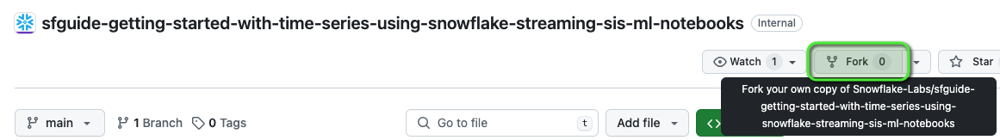

4. Click **"Create Fork"**.

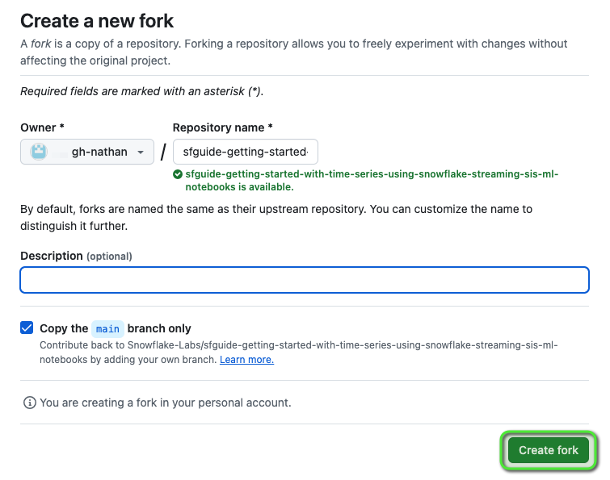


### Step 3 - Deploy a GitHub Codespace for the Lab

Now create the GitHub Codespace.

1. Click on the green `<> Code` button from the GitHub repository homepage. 

2. In the Code popup, click on the `Codespaces` tab.

3. Click `Create codespace on main`.


> aside positive
> 
> This will open a new browser window and begin **Setting up your codespace**. The Github Codespace deployment will take several minutes to setup the entire environment for this lab.
>


> aside negative
>
> **Please wait** for the **postCreateCommand** to run.
>
> **Ignore any notifications** that may prompt to refresh the Codespace, these will disappear once the postCreateCommand has run.
>


### Github Codespace Deployment Summary

Once complete you should see a hosted web-based version of **VS Code Integrated Development Environment (IDE)** in your browser with your forked repository.


The Github Codespace deployment is automating the following:
- Starting a hosted, web-based VS Code Integrated Development Environment (IDE)
- Pulling a copy of the forked Lab QuickStart GitHub repository within the VS Code container
- Installing Python Anaconda (conda) package management
- Installing a Java Runtime Environment (JRE)
- Creates an Anaconda virtual environment called **hol-timeseries** with required packages for the lab installed
  - Using the [Snowflake Anaconda Channel](https://repo.anaconda.com/pkgs/snowflake/)
  - Installs Snowflake Python packages
    - [Snowflake Snowpark Python library and connector](https://docs.snowflake.com/en/developer-guide/snowpark/index) package
    - [Snowflake Command Line Interface (CLI)](https://docs.snowflake.com/en/developer-guide/snowflake-cli-v2/index)
- VS Code setup
  - Installing the [Snowflake VS Code Extension](https://docs.snowflake.com/en/user-guide/vscode-ext)
- Private key pair setup using OpenSSL to be used to connect to Snowflake
- Downloads and extracts a Java IOT streaming client application

> aside negative
>
> If you do not see the **Snowflake VS Code Extension** try **Refreshing** your browser window.

### Step 4 - Verify Your Anaconda Environment is Activated

During the Codespace setup the postCreateCommand script created an Anaconda virtual environment named **hol-timeseries**. This virtual environment contains the packages needed to connect and interact with Snowflake using the Snowflake CLI.

To activate the virtual environment:

1. Open `Menu > Terminal > New Terminal` - a new terminal window will now open

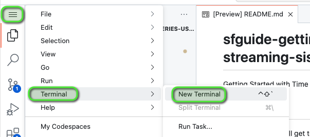

2. Enter command `conda activate hol-timeseries`


The terminal prompt should now show a prefix `(hol-timeseries)` to confirm the **hol-timeseries** virtual environment is activated.


### Step 5 - Configure Snowflake Account Connection Configurations

> aside negative
>
> This section will require the Snowflake **<account_identifier>** noted earlier.
>
> **NOTE:** The account identifers entered will **NOT** include the **.snowflakecomputing.com** domain.

In VS Code navigate to the following files and replace **<ACCOUNT_IDENTIFER>** with your account identifer value:

1. `.snowflake/config.toml`
    - **account** variable for both connections 
2. `iotstream/snowflake.properties`
    - **account** variable
    - **host** variable


### Step 6 - Configure Snowflake VS Code Extension Connection

1. Open the Snowflake VS Code Extension
2. Enter your **<ACCOUNT_IDENTIFER>**
3. Click Continue


1. For Auth Method select `Username/password`
2. Now enter the **ACCOUNTADMIN** user
3. Enter the ACCOUNTADMIN **password**
3. Click `Sign in`

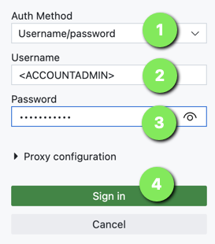

> aside positive
>
> **The VS Code Snowflake Extension** should now be connected to your Snowflake.

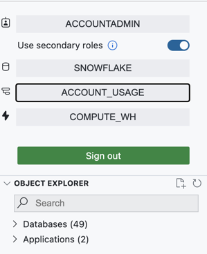


### Step 7 - Update Snowflake Setup Worksheet

**Worksheets** have been provided for the next sections, these can be accessed by going to **VS Code Explorer** and expanding the `worksheets` folder.

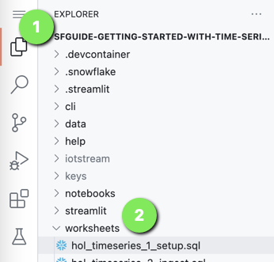

> aside negative
>
> We'll need to update the setup worksheet with your **PUBLIC KEY** to be used during the initial Snowflake setup.


### Retrieve Snowflake Private Keypair
As part of the GitHub Codespace setup, an OpenSSL Private Keypair was generated in the VS Code `keys` directory.

Retrieve the **PUBLIC KEY** value from the `keys/rsa_key.pub` file. This will be need in the setup worksheet.

> aside negative
>
> Only the **PUBLIC KEY** value is required, which is the section between:
>
> `-----BEGIN PUBLIC KEY-----` and `-----END PUBLIC KEY-----`
>
> ensure you **DO NOT** copy these lines.


### Update Snowflake Setup Worksheet with Lab Provisioned PUBLIC KEY
Open worksheet: `worksheets/hol_timeseries_1_setup.sql`

**Find and replace** the **<RSA_PUBLIC_KEY>** with the **PUBLIC KEY** retrieved from the `keys/rsa_key.pub` file.

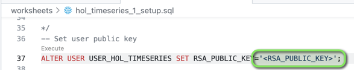

**NOTE:** The pasted **PUBLIC KEY** can show on mulitple lines and will work.

> aside positive
>
> The **Snowflake setup** worksheets are now ready to run, and The Lab environment is now ready!

<!-- ------------------------ -->
## Setup Snowflake Resources
Duration: 5

Create the foundational Snowflake Objects for this lab.

This includes:
- Role: **ROLE_HOL_TIMESERIES** - role used for working throughout the lab
- User: **USER_HOL_TIMESERIES** - the user to connect to Snowflake
- Warehouses:
    - **HOL_TRANSFORM_WH** - warehouse used for transforming ingested data
    - **HOL_ANALYTICS_WH** - warehouse used for analytics
- Database: **HOL_TIMESERIES** - main database to store all lab objects
- Schemas:
    - **STAGING** - RAW data source landing schema
    - **TRANSFORM** - transformed and modelled data schema
    - **ANALYTICS** - serving and analytics functions schema

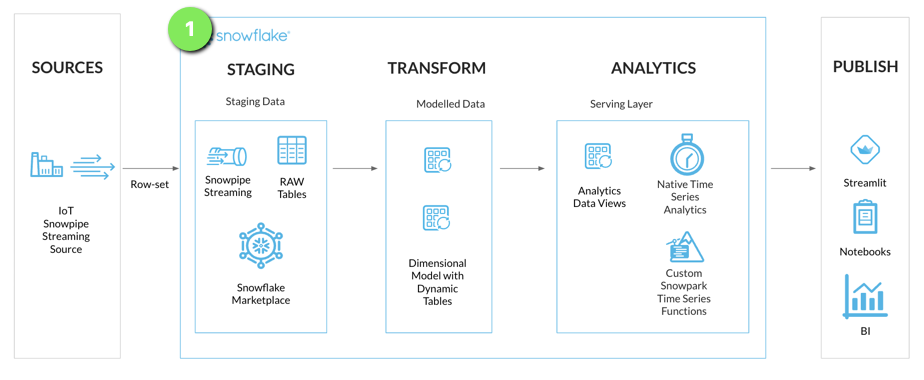

### Step 1 - Run Snowflake Setup Worksheet

In the **GitHub Codespace VS Code** open worksheet: `worksheets/hol_timeseries_1_setup.sql`

**Run through the worksheet to get Snowflake resources created.**

> aside negative
> 
>  This section will run using the **ACCOUNTADMIN** login setup via **Snowflake VS Code Extension** connection.
> 
>  There are **EXTERNAL ACTIVITY** sections in the worksheet, these sections will be executed within the **GitHub Codespace**.
>

```sql
/*
SNOWFLAKE FOUNDATION SETUP SCRIPT
*/

-- Login and assume ACCOUNTADMIN role
USE ROLE ACCOUNTADMIN;

-- Create lab role
CREATE ROLE IF NOT EXISTS ROLE_HOL_TIMESERIES;
GRANT ROLE ROLE_HOL_TIMESERIES TO ROLE SYSADMIN;

-- Create lab user
CREATE OR REPLACE USER USER_HOL_TIMESERIES DEFAULT_ROLE = "ROLE_HOL_TIMESERIES"
COMMENT = "HOL Time Series user.";
GRANT ROLE ROLE_HOL_TIMESERIES TO USER USER_HOL_TIMESERIES;

/* EXTERNAL ACTIVITY

A public key is setup in Github Codespace VS Code environment "keys" folder

Retrieve the public key detail from keys/rsa_key.pub and replace <RSA_PUBLIC_KEY>
with the contents of the public key excluding
the -----BEGIN PUBLIC KEY----- and -----END PUBLIC KEY----- lines

*/

-- Assign lab user public key
ALTER USER USER_HOL_TIMESERIES SET RSA_PUBLIC_KEY='<RSA_PUBLIC_KEY>';

-- Setup HOL infrastructure objects
-- Assume the SYSADMIN role
USE ROLE SYSADMIN;

-- Create a TRANSFORM WH - used for ingest and transform activity
CREATE WAREHOUSE IF NOT EXISTS HOL_TRANSFORM_WH WITH WAREHOUSE_SIZE = XSMALL
AUTO_SUSPEND = 60 AUTO_RESUME = TRUE INITIALLY_SUSPENDED = TRUE
COMMENT = 'Transform Warehouse' ENABLE_QUERY_ACCELERATION = TRUE;

-- Create an Analytics WH = used for analytics and reporting
CREATE WAREHOUSE IF NOT EXISTS HOL_ANALYTICS_WH WITH WAREHOUSE_SIZE = XSMALL
AUTO_SUSPEND = 60 AUTO_RESUME = TRUE INITIALLY_SUSPENDED = TRUE
COMMENT = 'Analytics Warehouse' ENABLE_QUERY_ACCELERATION = TRUE;


-- Create HOL Database
CREATE DATABASE IF NOT EXISTS HOL_TIMESERIES COMMENT = 'HOL Time Series database.';


-- HOL Schemas
-- Create STAGING schema - for RAW data
CREATE SCHEMA IF NOT EXISTS HOL_TIMESERIES.STAGING WITH MANAGED ACCESS
COMMENT = 'HOL Time Series STAGING schema.';

-- Create TRANSFORM schema - for modelled data
CREATE SCHEMA IF NOT EXISTS HOL_TIMESERIES.TRANSFORM WITH MANAGED ACCESS
COMMENT = 'HOL Time Series TRANSFORM schema.';

-- Create ANALYTICS schema - for serving analytics
CREATE SCHEMA IF NOT EXISTS HOL_TIMESERIES.ANALYTICS WITH MANAGED ACCESS
COMMENT = 'HOL Time Series ANALYTICS schema.';


-- Grant HOL role access to lab resources
-- Assign database grants to lab role
GRANT USAGE ON DATABASE HOL_TIMESERIES TO ROLE ROLE_HOL_TIMESERIES;

-- Assign Warehouse grants to lab role
GRANT ALL ON WAREHOUSE HOL_TRANSFORM_WH TO ROLE ROLE_HOL_TIMESERIES;

GRANT ALL ON WAREHOUSE HOL_ANALYTICS_WH TO ROLE ROLE_HOL_TIMESERIES;

-- Assign schema grants to lab role
GRANT ALL ON SCHEMA HOL_TIMESERIES.STAGING TO ROLE ROLE_HOL_TIMESERIES;

GRANT ALL ON SCHEMA HOL_TIMESERIES.TRANSFORM TO ROLE ROLE_HOL_TIMESERIES;

GRANT ALL ON SCHEMA HOL_TIMESERIES.ANALYTICS TO ROLE ROLE_HOL_TIMESERIES;

/*
SETUP SCRIPT NOW COMPLETED
*/
```

> aside positive
> 
>  The Snowflake foundation objects have now been deployed, and we can continue on to setup a **Snowpipe Streaming Ingestion**.
>

<!-- ------------------------ -->
## Snowpipe Streaming Ingestion
Duration: 5

With the foundational objects setup, we can now deploy a staging table to stream time series data into Snowflake via a Snowpipe Streaming client.

For this lab a Java IOT Sumilator Client has been created to stream IoT sensor readings into Snowflake.

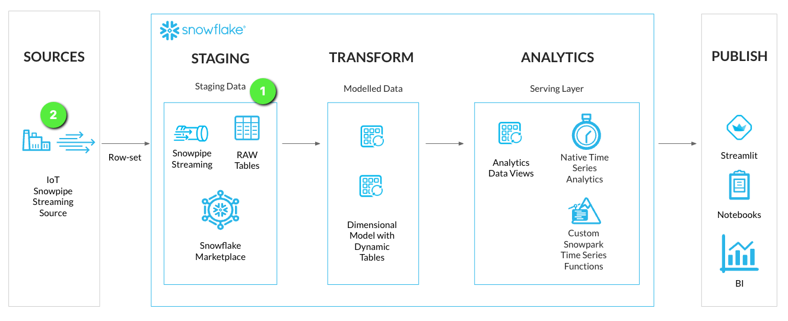

### Step 1 - Create Streaming Staging Table

We'll create a stage loading table to stream RAW time series data into Snowflake. This will be located in the **STAGING** schema of the **HOL_TIMESERIES** database.

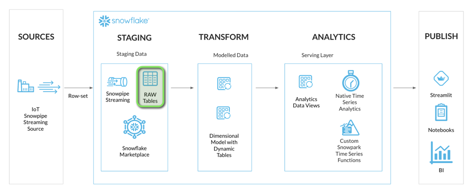

In the **GitHub Codespace VS Code** open worksheet: `worksheets/hol_timeseries_2_ingest.sql`

1. Create the staging table to load IoT streaming data

```sql
-- Set role, context, and warehouse
USE ROLE ROLE_HOL_TIMESERIES;
USE SCHEMA HOL_TIMESERIES.STAGING;
USE WAREHOUSE HOL_TRANSFORM_WH;

-- Setup staging tables
-- IOTSTREAM
CREATE OR REPLACE TABLE HOL_TIMESERIES.STAGING.RAW_TS_IOTSTREAM_DATA (
    RECORD_METADATA VARIANT,
    RECORD_CONTENT VARIANT
)
CHANGE_TRACKING = TRUE
COMMENT = 'IOTSTREAM staging table.'
;
```

The IoT data will be streamed into Snowflake in a similar [schema format as Kafka](https://docs.snowflake.com/en/user-guide/kafka-connector-overview#schema-of-tables-for-kafka-topics) which contains two columns:
- RECORD_CONTENT. This contains the Kafka message.
- RECORD_METADATA. This contains metadata about the message, for example, the topic from which the message was read.

> aside negative
> 
>  There is an **EXTERNAL ACTIVITY** sections in the worksheet, which will be executed within the **GitHub Codespace** terminal. Details in the next steps.
>

### INFO: Snowpipe Streaming Ingest Client SDK

Snowflake provides an [Ingest Client SDK](https://mvnrepository.com/artifact/net.snowflake/snowflake-ingest-sdk) in Java that allows applications, such as Kafka, to streaming rowset data into a Snowflake table at low latency.

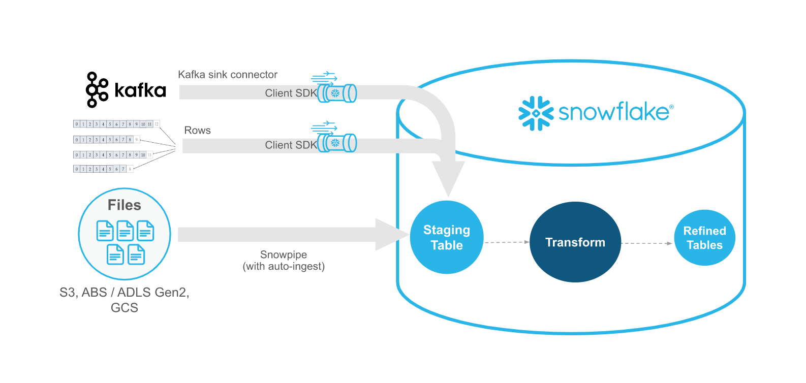

The Ingest Client SDK is configured with a secure JDBC connection to Snowflake, and will establish a streaming [Channel](https://docs.snowflake.com/en/user-guide/data-load-snowpipe-streaming-overview#channels) between the client and a Snowflake table.

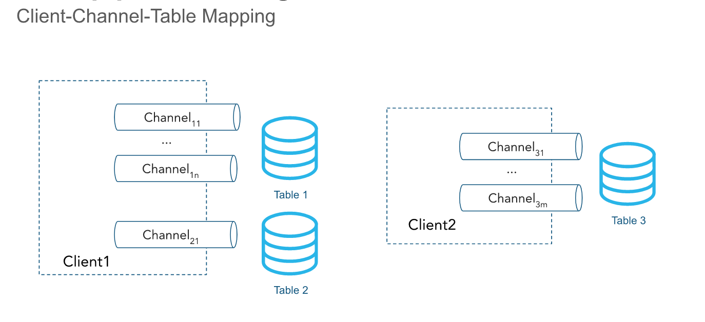

### Step 2 - Test Streaming Client Channel

Now that a staging table is available to stream time series data. We can look at setting up a streaming connection channel with a Java Snowpipe Streaming client. The simulator Java application is available in the `iotstream` folder of the lab, and can be run via a terminal with a Java run time.

> aside positive
> 
>  The lab environment has been setup with a **Java Runtime** to execute the Java Snowpipe Streaming client application.
>

In the **GitHub Codespace VS Code**:

1. Open `Menu > Terminal > New Terminal` - a new terminal window will now open

2. Change directory into to the **iotstream** folder: `cd iotstream`

3. Run the `Test.sh` script to confirm a table channel stream can be established with Snowflake.

```bash
./Test.sh
```

If **successful**, it will return:
`** Successfully Connected, Test complete! **`

4. In **VS Code** open the worksheet `worksheets/hol_timeseries_2_ingest.sql` and run the `SHOW CHANNELS` command to confirm a channel is now open to Snowflake.

```sql
SHOW CHANNELS;
```

The query should return a single channel `CHANNEL_1_TEST` opened to the `RAW_TS_IOTSTREAM_DATA` table.

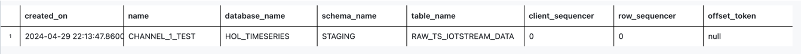

### Step 3 - Load a Simulated IoT Data Set

With the channel connection being successful, we can now load the IoT data set, as fast as the connection and machine will allow.


The simlulated IoT dataset contians six sensor device tags at different frequencies, within a single **namespace**. A namespace generally represents a grouping of unique tags.

| NAMESPACE | TAGNAME | FREQUENCY |
| --- | --- | --- |
| IOT | TAG101 | 5 SEC |
| IOT | TAG201 | 10 SEC |
| IOT | TAG301 | 1 SEC |
| IOT | TAG401 | 60 SEC |
| IOT | TAG501 | 60 SEC |
| IOT | TAG601 | 10 SEC |


1. In the **VS Code** `Terminal` run the `Run_MAX.sh` script to load the IoT data.

```bash
./Run_MAX.sh
```

2. In **VS Code** open the worksheet `worksheets/hol_timeseries_2_ingest.sql` and view the stremed records.

```sql
-- Check stream table data
SELECT * FROM HOL_TIMESERIES.STAGING.RAW_TS_IOTSTREAM_DATA LIMIT 10;
```

Each IoT device reading is a JSON payload, transmitted in the following Kafka like format:
```json
{
    "meta":
    {
        "LogAppendTime": "1714487166815",
        "headers":
        {
            "namespace": "IOT",
            "source": "STREAM_DATA.csv",
            "speed": "MAX"
        },
        "offset": "116",
        "partition": "1",
        "topic": "time-series"
    },
    "content":
    {
        "datatype": "double",
        "tagname": "SENSOR/TAG301",
        "timestamp": "1704067279",
        "units": "KPA",
        "value": "118.152"
    } 
}
```

> aside positive
> 
>  Data has now been **streamed into Snowflake**, and we can now look at modelling the data for analyitcs.
>

<!-- ------------------------ -->
## Data Modelling, Transformation, and Continuous Ingestion
Duration: 5

Now that data is streamed into Snowflake, we are ready for some **Data Engineering** actvities to get the data into a report ready state for analytics. We'll be transforming the data from the JSON **VARIANT** format into a tabular format by leveraging Snowflake **Dynamic Tables**, to ensure that data streamed into Snowflake will continuously update the analytics layers.

Along with setting up Dynamic Tables for continuous loading, we'll also deploy some analytics views for the consumer serving layer. This will allow for specific columns of data to be exposed to the end users and applications.

Finally, we'll start another continous stream of IoT data to see the Dynamic Tables continuously update.

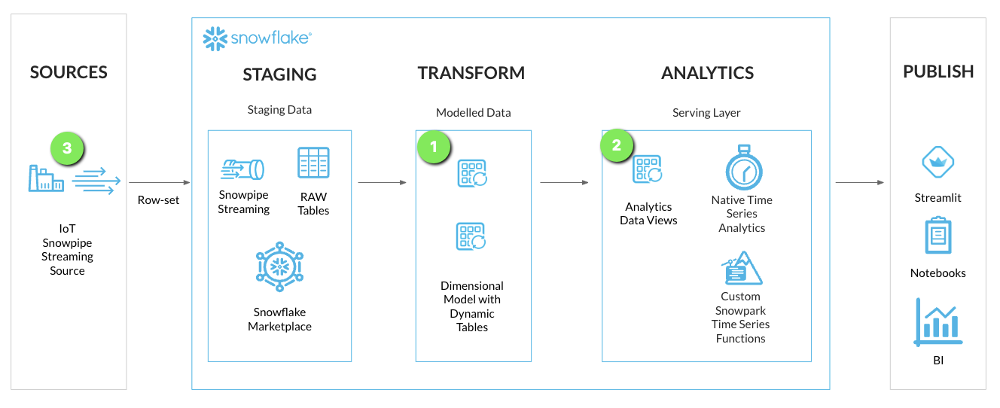

### INFO: Dynamic Tables

[Dynamic Tables](https://docs.snowflake.com/en/user-guide/dynamic-tables-intro) are a declarative way of defining your data pipeline in Snowflake. It's a Snowflake table which is defined as a query to continuously and automatically materialize the result of that query as a table. Dynamic Tables can join and aggregate across **multiple source objects** and **incrementally update** results as sources change.

Dynamic Tables can also be chained together to create a DAG for more complex data pipelines.

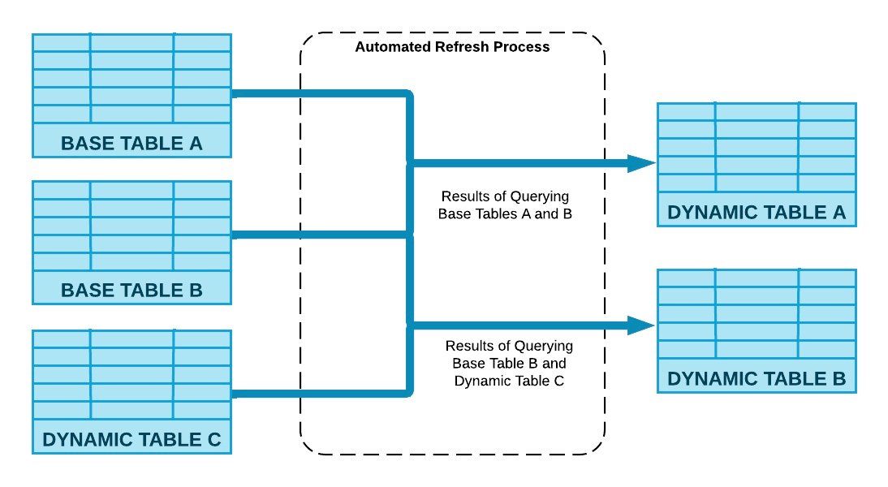

### Step 1 - Create Dynamic Tables

For the IoT streaming data we'll setup two Dynamic Tables in a simple Dimension and Fact model:
- DT_TS_TAG_METADATA (Dimension): Containing Tag Metadata such as tag names, sourcing, and data types
- DT_TS_TAG_READINGS (Fact): Containing the readings from each IoT sensor in raw and numeric format

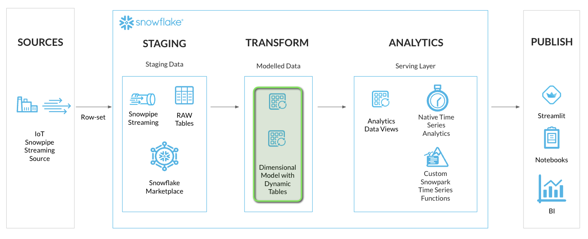

1. In **VS Code** open the worksheet `worksheets/hol_timeseries_3_transform.sql` and run the Dynamic Table creation scripts.

```sql
-- Setup Transform Dynamic Tables
-- Set role, context, and warehouse
USE ROLE ROLE_HOL_TIMESERIES;
USE HOL_TIMESERIES.TRANSFORM;
USE WAREHOUSE HOL_TRANSFORM_WH;

-- Sensor metadata (Dimension)
CREATE OR REPLACE DYNAMIC TABLE HOL_TIMESERIES.TRANSFORM.DT_TS_TAG_METADATA
TARGET_LAG = '1 MINUTE'
WAREHOUSE = HOL_TRANSFORM_WH
REFRESH_MODE = 'INCREMENTAL'
AS
SELECT
    SRC.RECORD_METADATA:headers:namespace::VARCHAR AS NAMESPACE,
    SRC.RECORD_METADATA:headers:source::VARCHAR AS TAGSOURCE,
    UPPER(CONCAT('/', SRC.RECORD_METADATA:headers:namespace::VARCHAR, '/', TRIM(SRC.RECORD_CONTENT:tagname::VARCHAR))) AS TAGNAME,
    SRC.RECORD_CONTENT:units::VARCHAR AS TAGUNITS,
    SRC.RECORD_CONTENT:datatype::VARCHAR AS TAGDATATYPE
FROM HOL_TIMESERIES.STAGING.RAW_TS_IOTSTREAM_DATA SRC
QUALIFY ROW_NUMBER() OVER (PARTITION BY UPPER(CONCAT('/', SRC.RECORD_METADATA:headers:namespace::VARCHAR, '/', TRIM(SRC.RECORD_CONTENT:tagname::VARCHAR))) ORDER BY SRC.RECORD_CONTENT:timestamp::NUMBER, SRC.RECORD_METADATA:offset::NUMBER) = 1
;

-- Sensor readings (Fact)
CREATE OR REPLACE DYNAMIC TABLE HOL_TIMESERIES.TRANSFORM.DT_TS_TAG_READINGS
TARGET_LAG = '1 MINUTE'
WAREHOUSE = HOL_TRANSFORM_WH
REFRESH_MODE = 'INCREMENTAL'
AS
SELECT
    UPPER(CONCAT('/', SRC.RECORD_METADATA:headers:namespace::VARCHAR, '/', TRIM(SRC.RECORD_CONTENT:tagname::VARCHAR))) AS TAGNAME,
    DATE_TRUNC('SECOND', SRC.RECORD_CONTENT:timestamp::VARCHAR::TIMESTAMP_NTZ) AS TIMESTAMP,
    SRC.RECORD_CONTENT:value::VARCHAR AS VALUE,
    TRY_CAST(SRC.RECORD_CONTENT:value::VARCHAR AS FLOAT) AS VALUE_NUMERIC,
    SRC.RECORD_METADATA:partition::VARCHAR AS PARTITION,
    SRC.RECORD_METADATA:offset::VARCHAR AS OFFSET
FROM HOL_TIMESERIES.STAGING.RAW_TS_IOTSTREAM_DATA SRC
QUALIFY ROW_NUMBER() OVER (PARTITION BY UPPER(CONCAT('/', SRC.RECORD_METADATA:headers:namespace::VARCHAR, '/', TRIM(SRC.RECORD_CONTENT:tagname::VARCHAR))), SRC.RECORD_CONTENT:timestamp::NUMBER ORDER BY SRC.RECORD_METADATA:offset::NUMBER) = 1;
```

> aside positive
> 
>  Dynamic tables have a defined [TARGET_LAG](https://docs.snowflake.com/en/user-guide/dynamic-tables-refresh#label-dynamic-tables-understand-dt-lag) parameter, which defines how out of date the data can be before a refresh is automatically triggered. At the time of writing the minimum is 1 minute target lag.
>

### Step 2 - Create Analytics Views for Consumers

The Dynamic Tables are now setup to continously transform ingested streaming data. We can now look at setting up an **Analytics** serving layer with some views for end users and applications to consume the streaming data.

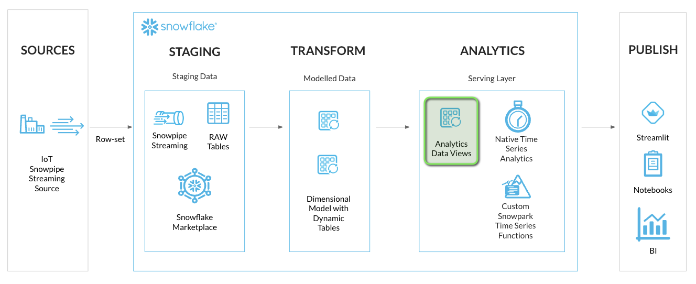

```sql
-- Setup Analytics Views
-- Set role, context, and warehouse
USE ROLE ROLE_HOL_TIMESERIES;
USE HOL_TIMESERIES.ANALYTICS;
USE WAREHOUSE HOL_ANALYTICS_WH;

-- Tag Reference View
CREATE OR REPLACE VIEW HOL_TIMESERIES.ANALYTICS.TS_TAG_REFERENCE AS
SELECT
    META.NAMESPACE,
    META.TAGSOURCE,
    META.TAGNAME,
    META.TAGUNITS,
    META.TAGDATATYPE
FROM HOL_TIMESERIES.TRANSFORM.DT_TS_TAG_METADATA META;

-- Tag Readings View
CREATE OR REPLACE VIEW HOL_TIMESERIES.ANALYTICS.TS_TAG_READINGS AS
SELECT
    READ.TAGNAME,
    READ.TIMESTAMP,
    READ.VALUE,
    READ.VALUE_NUMERIC
FROM HOL_TIMESERIES.TRANSFORM.DT_TS_TAG_READINGS READ;
```

### Step 3 - Start a Continous Simulated Stream

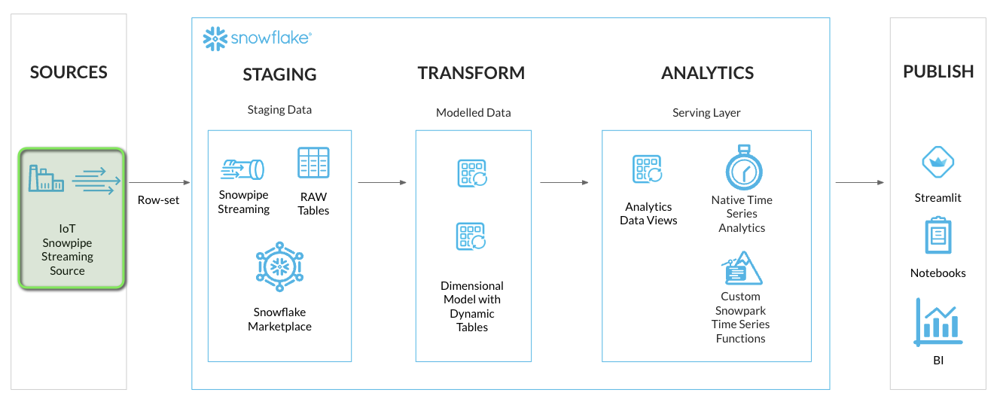

1. In the **VS Code** `Terminal` run the `Run_Slooow.sh` script to load the IoT data.

```bash
./Run_Slooow.sh
```


<!-- ------------------------ -->
## Time Series Analysis
Duration: 10

Time Series queries

```sql
-- Run Time Series Analysis across various query profiles
-- RAW DATA
SELECT TAGNAME, TIMESTAMP, VALUE
FROM HOL_TIMESERIES.ANALYTICS.TS_TAG_READINGS
WHERE TIMESTAMP > '2024-01-01 00:00:00'
AND TIMESTAMP <= '2024-01-01 00:00:30'
AND TAGNAME = '/IOT/SENSOR/TAG301'
ORDER BY TAGNAME, TIMESTAMP
;

-- STATISTICAL
-- COUNT
SELECT TAGNAME, TO_TIMESTAMP('2024-01-01 00:00:30') AS TIMESTAMP, COUNT(VALUE) AS VALUE
FROM HOL_TIMESERIES.ANALYTICS.TS_TAG_READINGS
WHERE TIMESTAMP > '2024-01-01 00:00:00'
AND TIMESTAMP <= '2024-01-01 00:00:30'
AND TAGNAME = '/IOT/SENSOR/TAG301'
GROUP BY TAGNAME
ORDER BY TAGNAME, TIMESTAMP
;

-- COUNT DISTINCT
SELECT TAGNAME, TO_TIMESTAMP('2024-01-01 00:00:30') AS TIMESTAMP, COUNT(DISTINCT VALUE) AS VALUE
FROM HOL_TIMESERIES.ANALYTICS.TS_TAG_READINGS
WHERE TIMESTAMP > '2024-01-01 00:00:00'
AND TIMESTAMP <= '2024-01-01 00:00:30'
AND TAGNAME = '/IOT/SENSOR/TAG301'
GROUP BY TAGNAME
ORDER BY TAGNAME, TIMESTAMP
;

-- SUM
SELECT TAGNAME, TO_TIMESTAMP('2024-01-01 00:00:30') AS TIMESTAMP, SUM(VALUE_NUMERIC) AS VALUE
FROM HOL_TIMESERIES.ANALYTICS.TS_TAG_READINGS 
WHERE TIMESTAMP > '2024-01-01 00:00:00'
AND TIMESTAMP <= '2024-01-01 00:00:30'
AND TAGNAME = '/IOT/SENSOR/TAG301'
GROUP BY TAGNAME
ORDER BY TAGNAME, TIMESTAMP
;

-- AVG
SELECT TAGNAME, TO_TIMESTAMP('2024-04-26 14:45:37') AS TIMESTAMP, AVG(VALUE_NUMERIC) AS VALUE
FROM HOL_TIMESERIES.ANALYTICS.TS_TAG_READINGS 
WHERE TIMESTAMP > '2024-01-01 00:00:00'
AND TIMESTAMP <= '2024-01-01 00:00:30'
AND TAGNAME = '/IOT/SENSOR/TAG301'
GROUP BY TAGNAME
ORDER BY TAGNAME, TIMESTAMP
;

-- STDDEV
SELECT TAGNAME, TO_TIMESTAMP('2024-01-01 00:00:30') AS TIMESTAMP, STDDEV(VALUE_NUMERIC) AS VALUE
FROM HOL_TIMESERIES.ANALYTICS.TS_TAG_READINGS
WHERE TIMESTAMP > '2024-01-01 00:00:00'
AND TIMESTAMP <= '2024-01-01 00:00:30'
AND TAGNAME = '/IOT/SENSOR/TAG301'
GROUP BY TAGNAME
ORDER BY TAGNAME, TIMESTAMP
;

-- VARIANCE
SELECT TAGNAME, TO_TIMESTAMP('2024-01-01 00:00:30') AS TIMESTAMP, VARIANCE(VALUE_NUMERIC) AS VALUE
FROM HOL_TIMESERIES.ANALYTICS.TS_TAG_READINGS
WHERE TIMESTAMP > '2024-01-01 00:00:00'
AND TIMESTAMP <= '2024-01-01 00:00:30'
AND TAGNAME = '/IOT/SENSOR/TAG301'
GROUP BY TAGNAME
ORDER BY TAGNAME, TIMESTAMP
;

-- MAX_BY - HI WATER
SELECT TAGNAME, TO_TIMESTAMP('2024-01-01 00:00:30') AS TIMESTAMP, MAX_BY(VALUE, TIMESTAMP) AS VALUE
FROM HOL_TIMESERIES.ANALYTICS.TS_TAG_READINGS
WHERE TIMESTAMP > '2024-01-01 00:00:00'
AND TIMESTAMP <= '2024-01-01 00:00:30'
AND TAGNAME = '/IOT/SENSOR/TAG301'
GROUP BY TAGNAME
ORDER BY TAGNAME, TIMESTAMP
;

-- MIN-BY - LOW WATER
SELECT TAGNAME, TO_TIMESTAMP('2024-01-01 00:00:30') AS TIMESTAMP, MIN_BY(VALUE, TIMESTAMP) AS VALUE
FROM HOL_TIMESERIES.ANALYTICS.TS_TAG_READINGS
WHERE TIMESTAMP > '2024-01-01 00:00:00'
AND TIMESTAMP <= '2024-01-01 00:00:30'
AND TAGNAME = '/IOT/SENSOR/TAG301'
GROUP BY TAGNAME
ORDER BY TAGNAME, TIMESTAMP
;

-- DOWNSAMPLING / RESAMPLING
-- BINNING - PERCENTILE
SELECT TAGNAME, TIME_SLICE(DATEADD(MILLISECOND, -1, TIMESTAMP), 10, 'SECOND', 'END') AS TIMESTAMP, APPROX_PERCENTILE(VALUE_NUMERIC, 0.5) AS VALUE
FROM HOL_TIMESERIES.ANALYTICS.TS_TAG_READINGS
WHERE TIMESTAMP > '2024-01-01 00:00:00'
AND TIMESTAMP <= '2024-01-01 00:00:30'
AND TAGNAME = '/IOT/SENSOR/TAG301'
GROUP BY TIME_SLICE(DATEADD(MILLISECOND, -1, TIMESTAMP), 10, 'SECOND', 'END'), TAGNAME
ORDER BY TAGNAME, TIMESTAMP
;

-- BINNING - SUM
SELECT TAGNAME, TIME_SLICE(DATEADD(MILLISECOND, -1, TIMESTAMP), 10, 'SECOND', 'END') AS TIMESTAMP, SUM(VALUE_NUMERIC) AS VALUE, COUNT(*) AS READING_COUNT
FROM HOL_TIMESERIES.ANALYTICS.TS_TAG_READINGS
WHERE TIMESTAMP > '2024-01-01 00:00:00'
AND TIMESTAMP <= '2024-01-01 00:00:30'
AND TAGNAME = '/IOT/SENSOR/TAG301'
GROUP BY TIME_SLICE(DATEADD(MILLISECOND, -1, TIMESTAMP), 10, 'SECOND', 'END'), TAGNAME
ORDER BY TAGNAME, TIMESTAMP
;

-- BINNING - AVERAGE
SELECT TAGNAME, TIME_SLICE(DATEADD(MILLISECOND, -1, TIMESTAMP), 10, 'SECOND', 'END') AS TIMESTAMP, AVG(VALUE_NUMERIC) AS VALUE, COUNT(*) AS READING_COUNT
FROM HOL_TIMESERIES.ANALYTICS.TS_TAG_READINGS
WHERE TIMESTAMP > '2024-01-01 00:00:00'
AND TIMESTAMP <= '2024-01-01 00:00:30'
AND TAGNAME = '/IOT/SENSOR/TAG301'
GROUP BY TIME_SLICE(DATEADD(MILLISECOND, -1, TIMESTAMP), 10, 'SECOND', 'END'), TAGNAME
ORDER BY TAGNAME, TIMESTAMP
;

-- BINNING - STDDEV
SELECT TAGNAME, TIME_SLICE(DATEADD(MILLISECOND, -1, TIMESTAMP), 10, 'SECOND', 'END') AS TIMESTAMP, STDDEV(VALUE_NUMERIC) AS VALUE
FROM HOL_TIMESERIES.ANALYTICS.TS_TAG_READINGS
WHERE TIMESTAMP > '2024-01-01 00:00:00'
AND TIMESTAMP <= '2024-01-01 00:00:30'
AND TAGNAME = '/IOT/SENSOR/TAG301'
GROUP BY TIME_SLICE(DATEADD(MILLISECOND, -1, TIMESTAMP), 10, 'SECOND', 'END'), TAGNAME
ORDER BY TAGNAME, TIMESTAMP
;


-- WINDOW FUNCTIONS
-- LAG
SELECT TAGNAME, TIMESTAMP, VALUE_NUMERIC AS VALUE,
    LAG(VALUE_NUMERIC) OVER (
        PARTITION BY TAGNAME ORDER BY TIMESTAMP) AS PRIOR_VALUE
FROM HOL_TIMESERIES.ANALYTICS.TS_TAG_READINGS
WHERE TIMESTAMP > '2024-01-01 00:00:00'
AND TIMESTAMP <= '2024-01-01 00:00:30'
AND TAGNAME = '/IOT/SENSOR/TAG101'
ORDER BY TAGNAME, TIMESTAMP
;

SET TIME_PERIODS = (SELECT TIMESTAMPDIFF('SECOND', '2024-01-01 00:00:00'::TIMESTAMP_NTZ, '2024-01-01 00:00:00'::TIMESTAMP_NTZ + INTERVAL '720 HOURS') / 5);

SELECT '2024-01-01 00:00:00'::TIMESTAMP_NTZ + INTERVAL '720 HOURS';

SELECT $TIME_PERIODS;

WITH TIMES AS (
    SELECT
    DATEADD('SECOND', ROW_NUMBER() OVER (ORDER BY SEQ8()), '2024-01-01')::TIMESTAMP_NTZ AS TIMESTAMP
    FROM TABLE(GENERATOR(ROWCOUNT => $TIME_PERIODS))
),
DATA AS (
    SELECT TAGNAME, TIMESTAMP, VALUE_NUMERIC AS VALUE,
    FROM HOL_TIMESERIES.ANALYTICS.TS_TAG_READINGS
    WHERE TIMESTAMP > '2024-01-01 00:00:00'
    AND TIMESTAMP <= '2024-01-31 00:00:00'
    AND TAGNAME = '/IOT/SENSOR/TAG101'
)
SELECT TIMES.TIMESTAMP, DATA.TAGNAME, DATA.VALUE,
    LAG(DATA.VALUE) IGNORE NULLS OVER (
        ORDER BY TIMES.TIMESTAMP) AS PRIOR_VALUE
FROM TIMES
LEFT JOIN DATA ON TIMES.TIMESTAMP = DATE_TRUNC('SECOND', DATA.TIMESTAMP)
ORDER BY TIMESTAMP;

WITH times AS (
    SELECT dateadd(sec, 5 * row_number() over (order by SEQ8()), '2022-07-01 01:05:25.000') AS timestamp
    FROM table(generator(rowcount => 518400)))
SELECT * FROM TIMES;

SELECT TAGNAME, TIMESTAMP, VALUE_NUMERIC AS VALUE,
    LAG(VALUE_NUMERIC) IGNORE NULLS OVER (
        PARTITION BY TAGNAME ORDER BY TIMESTAMP) AS PRIOR_VALUE
FROM HOL_TIMESERIES.ANALYTICS.TS_TAG_READINGS
WHERE TIMESTAMP > '2024-01-01 00:00:00'
AND TIMESTAMP <= '2024-01-31 00:00:00'
AND TAGNAME = '/IOT/SENSOR/TAG101'
ORDER BY TAGNAME, TIMESTAMP
;

-- RANGE BETWEEN - ROW BASED
-- PRECEDING
SELECT TAGNAME, TIMESTAMP, VALUE_NUMERIC AS VALUE,
    SUM(VALUE_NUMERIC) OVER (
        PARTITION BY TAGNAME ORDER BY TIMESTAMP
        ROWS BETWEEN 5 PRECEDING AND CURRENT ROW) AS ROLL_SUM_VALUE
FROM HOL_TIMESERIES.ANALYTICS.TS_TAG_READINGS
WHERE TIMESTAMP > '2024-01-01 00:00:00'
AND TIMESTAMP <= '2024-01-31 00:00:00'
AND TAGNAME = '/IOT/SENSOR/TAG301'
ORDER BY TAGNAME, TIMESTAMP
;

-- FOLLOWING
SELECT TAGNAME, TIMESTAMP, VALUE_NUMERIC AS VALUE,
    AVG(VALUE_NUMERIC) OVER (PARTITION BY TAGNAME ORDER BY TIMESTAMP
    ROWS BETWEEN CURRENT ROW AND 5 FOLLOWING) AS ROLL_VALUE
FROM HOL_TIMESERIES.ANALYTICS.TS_TAG_READINGS
WHERE TIMESTAMP > '2024-01-01 00:00:00'
AND TIMESTAMP <= '2024-01-31 00:00:00'
AND TAGNAME = '/IOT/SENSOR/TAG301'
ORDER BY TAGNAME, TIMESTAMP
;

-- RANGE BETWEEN INTERVAL - TIME BASED
-- PRECEEDING
SELECT TAGNAME, TIMESTAMP, VALUE_NUMERIC AS VALUE,
    SUM(VALUE_NUMERIC) OVER (
        PARTITION BY TAGNAME ORDER BY TIMESTAMP
        RANGE BETWEEN INTERVAL '5 SEC' PRECEDING AND CURRENT ROW) AS PREC_ROLL_SUM_VALUE
FROM HOL_TIMESERIES.ANALYTICS.TS_TAG_READINGS
WHERE TIMESTAMP > '2024-01-01 00:00:00'
AND TIMESTAMP <= '2024-01-31 00:00:00'
AND TAGNAME = '/IOT/SENSOR/TAG301'
ORDER BY TAGNAME, TIMESTAMP
;

-- FOLLOWING
SELECT TAGNAME, TIMESTAMP, VALUE_NUMERIC AS VALUE,
    SUM(VALUE_NUMERIC) OVER (
        PARTITION BY TAGNAME ORDER BY TIMESTAMP
        RANGE BETWEEN CURRENT ROW AND INTERVAL '5 SEC' FOLLOWING) AS FOLL_ROLL_SUM_VALUE
FROM HOL_TIMESERIES.ANALYTICS.TS_TAG_READINGS
WHERE TIMESTAMP > '2024-01-01 00:00:00'
AND TIMESTAMP <= '2024-01-31 00:00:00'
AND TAGNAME = '/IOT/SENSOR/TAG301'
ORDER BY TAGNAME, TIMESTAMP
;


-- FIRST_VALUE / LAST_VALUE
SELECT TAGNAME, TS AS TIMESTAMP, F_VALUE, L_VALUE
FROM (
SELECT TAGNAME, TIME_SLICE(DATEADD(MILLISECOND, -1, TIMESTAMP), 10, 'SECOND', 'END') AS TS, TIMESTAMP, VALUE_NUMERIC, FIRST_VALUE(VALUE_NUMERIC) OVER (PARTITION BY TAGNAME, TS ORDER BY TIMESTAMP) AS F_VALUE, LAST_VALUE(VALUE_NUMERIC) OVER (PARTITION BY TAGNAME, TS ORDER BY TIMESTAMP) AS L_VALUE
FROM HOL_TIMESERIES.ANALYTICS.TS_TAG_READINGS
WHERE TIMESTAMP > '2024-01-01 00:00:00'
AND TIMESTAMP <= '2024-01-01 00:00:30'
AND TAGNAME = '/IOT/SENSOR/TAG301'
GROUP BY TIME_SLICE(DATEADD(MILLISECOND, -1, TIMESTAMP), 10, 'SECOND', 'END'), TIMESTAMP, TAGNAME, VALUE_NUMERIC
)
GROUP BY TAGNAME, TS, F_VALUE, L_VALUE
ORDER BY TAGNAME, TS
;


-- ASOF JOIN
SELECT SMP.TAGNAME, SMP.TIMESTAMP, SMP.VALUE_NUMERIC AS VALUE, IOT.VALUE_NUMERIC AS IOT_VALUE, IOT.TAGNAME AS IOT_TAGNAME, IOT.TIMESTAMP AS IOT_TIMESTAMP
FROM HOL_TIMESERIES.ANALYTICS.TS_TAG_READINGS SMP
ASOF JOIN (
    SELECT TAGNAME, TIMESTAMP, VALUE_NUMERIC
    FROM HOL_TIMESERIES.ANALYTICS.TS_TAG_READINGS
    WHERE TAGNAME = '/IOT/SENSOR/TAG101'
    ) IOT
MATCH_CONDITION(SMP.TIMESTAMP >= IOT.TIMESTAMP)
WHERE SMP.TAGNAME = '/IOT/SENSOR/TAG301'
AND SMP.TIMESTAMP >= '2024-01-01 00:00:00'
AND SMP.TIMESTAMP < '2024-01-01 00:01:00'
ORDER BY SMP.TIMESTAMP;
```


<!-- ------------------------ -->
## Build Your Own - Snowpark User Defined Table Function
Duration: 5

Setup LTTB Downsample Function
```sql
-- Set role, context, and warehouse
USE ROLE ROLE_HOL_TIMESERIES;
USE HOL_TIMESERIES.ANALYTICS;
USE WAREHOUSE HOL_ANALYTICS_WH;

-- LTTB Downsampling Table Function
CREATE OR REPLACE FUNCTION HOL_TIMESERIES.ANALYTICS.FUNCTION_TS_LTTB (
    TIMESTAMP NUMBER,
    VALUE FLOAT,
    SIZE NUMBER
) 
RETURNS TABLE (
    TIMESTAMP NUMBER,
    VALUE FLOAT
)
LANGUAGE PYTHON
RUNTIME_VERSION = 3.11
PACKAGES = ('pandas', 'plotly-resampler')
HANDLER = 'lttb_run'
AS $$
from _snowflake import vectorized
import pandas as pd
from plotly_resampler.aggregation.algorithms.lttb_py import LTTB_core_py

class lttb_run:
    @vectorized(input=pd.DataFrame)

    def end_partition(self, df):
        if df.SIZE.iat[0] >= len(df.index):
            return df[['TIMESTAMP','VALUE']]
        else:
            idx = LTTB_core_py.downsample(
                df.TIMESTAMP.to_numpy(),
                df.VALUE.to_numpy(),
                n_out=df.SIZE.iat[0]
            )
            return df[['TIMESTAMP','VALUE']].iloc[idx]
$$;
```

LTTB Query
```sql
-- LTTB
SELECT data.tagname, lttb.timestamp::varchar::timestamp_ntz AS timestamp, NULL AS value, lttb.value_numeric 
FROM (
SELECT tagname, TIME_SLICE(DATEADD(MILLISECOND, -1, timestamp), 1, 'SECOND', 'END') AS timestamp, APPROX_PERCENTILE(value_numeric, 0.5) AS value_numeric 
FROM HOL_TIMESERIES.ANALYTICS.TS_TAG_READINGS
WHERE timestamp > '2000-03-26 02:50:21' AND timestamp <= '2024-03-26 14:50:21' 
AND tagname IN ('/WITSML/NO 15/9-F-7/DEPTH') 
GROUP BY tagname, TIME_SLICE(DATEADD(MILLISECOND, -1, timestamp), 1, 'SECOND', 'END')
) AS data 
CROSS JOIN TABLE(HOL_TIMESERIES.ANALYTICS.function_ts_lttb(date_part(epoch_nanosecond, data.timestamp), data.value_numeric, 500) OVER (PARTITION BY data.tagname ORDER BY data.timestamp)) AS lttb
ORDER BY tagname, timestamp
;
```


<!-- ------------------------ -->
## Streamlit in Snowflake
Duration: 10

After completing the analysis of the time series data that was streamed into Snowflake using SQL queries, we are now ready to build visualisations that would help us easily analyse the data. For this purpose we are going to use Streamlit. First, let's breifly understand what is Streamlit.

### What is Streamlit?
Streamlit is an open-source Python library that makes it easy to create web applications for machine learning, data analysis, and visualization. It allows developers to build interactive and customizable web apps directly from Python scripts, without needing to write any HTML, CSS, or JavaScript. With Streamlit, data scientists can quickly prototype and share data science projects with others, making it a popular choice among data scientists and machine learning engineers for creating intuitive and user-friendly interfaces for their models and analyses.

[Streamlit in Snowflake](https://docs.snowflake.com/en/developer-guide/streamlit/about-streamlit) helps developers securely build, deploy, and share Streamlit apps on Snowflake’s data cloud. Using Streamlit in Snowflake, you can build applications that process and use data in Snowflake without moving data or application code to an external system.

We will use the Snowflake CLI interface to deploy the Streamlit app on your Snowflake account from where you can launch the application and visualse data.Let's also get a brief understanding of Snowflake CLI

### What is Snowflake CLI?

[Snowflake CLI](https://docs.snowflake.com/en/developer-guide/snowflake-cli-v2/introduction/introduction) is an open-source command-line tool explicitly designed for developer-centric workloads in addition to SQL operations. It is a flexible and extensible tool that can accommodate modern development practices and technologies.

With Snowflake CLI, developers can create, manage, update, and view apps running on Snowflake across workloads such as Streamlit in Snowflake, the Snowflake Native App Framework, Snowpark Container Services, and Snowpark. It supports a range of Snowflake features, including user-defined functions, stored procedures, Streamlit in Snowflake, and SQL execution.

### Deploy Streamlit application to Snowflake :

In the step #2 (Lab Setup) of this Quickstart, we have already setup a Github codespace with all the requirements necessary for building and deploying a Streamlit application. 

In this step, we will now deploy the Streamlit application on the Snowflake account using Snowflake CLI:

1. Navigate to the existing Terminal window where you have activated the hol-timeseries virtual environment and execute the following command:

```bash
snow --config-file=".snowflake/config.toml" streamlit deploy --replace --project "streamlit" --connection="hol-timeseries-streamlit"
```

This command does the following:

- Deploys the Streamlit application using the Snowflake account details mentioned in the ".snowflake/config.toml" file
- --config-file option provides the location of the config file that contains Snowflake account details
- --replace option ensures that the existing application, if present, is overwritten
- --project option provides the path where the Streamlit app project resides
- --connection option dictates which connection section from the ".snowflake/config.toml" file should be used for deployment

### Launch Streamlit application :

Once the Streamlit app is successfully deployed, the Snowflake CLI will display the message "Streamlit successfully deployed" and also provide the URL for the Streamlit application. You can copy the link and paste it in a browser address bar or simply presss Command/Ctrl and click the link to launch the Streamlit application

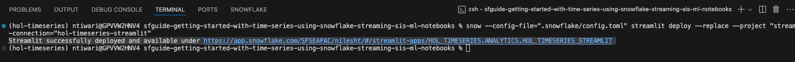

### Working with Streamlit Application :


<!-- ------------------------ -->
## Milestone

### Key Activities
- Ingest streaming time series data into Snowflake
- Created a data pipeline to transform streaming time series data
- Deployed ana analytics layer for serving time series data
- Delivered a Streamlit application interface for end users to run time series analytics

### Outcomes Achieved
- A standard ingestion pattern has been established for easy onboarding of time series data sources
- Unlocked low latency ingestion pipelines for data sources
- Delivered an easy user experience in Streamlit to derive insights and value from time series data


<!-- ------------------------ -->
## Streams and Tasks

> aside positive
> 
>  [Streams](https://docs.snowflake.com/en/user-guide/streams-intro) provides a change tracking mechanism for your tables and > views, enabling and ensuring "exactly once" semantics for new or changed data.
>
> [Tasks](https://docs.snowflake.com/en/user-guide/tasks-intro) are Snowflake objects to execute a single command, which could be simple SQL command or calling an extensive stored > > procedure.  Tasks can be scheduled or run on-demand, either within a Snowflake Virtual warehouse or serverless.


<!-- ------------------------ -->
## Clean-up
Duration: 1

- Remove [Github Codespace](https://github.com/codespaces)


<!-- ------------------------ -->
## Conclusion and Resources
Duration: 1


### What we've covered


### Additional resources
- [Getting Started with Snowflake CLI](https://quickstarts.snowflake.com/guide/getting-started-with-snowflake-cli/index.html)
- [Getting Started with Streams & Tasks](https://quickstarts.snowflake.com/guide/getting_started_with_streams_and_tasks/index.html)